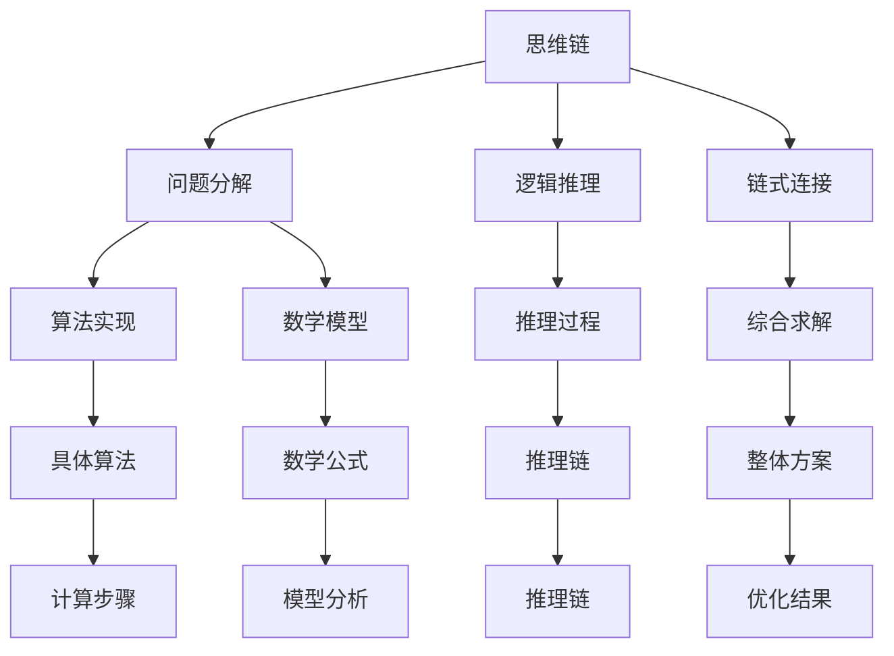

                 

---

# 思维链在复杂系统优化决策中的应用

## 关键词
- 思维链
- 复杂系统
- 优化决策
- 算法
- 数学模型

## 摘要
本文旨在探讨思维链在复杂系统优化决策中的应用。首先，我们将介绍思维链的定义和基本原理，并阐述其与复杂系统的关系。随后，通过具体的算法原理讲解和Python源代码示例，我们将深入理解思维链在复杂系统优化决策中的工作方式。此外，本文还将结合实际项目案例，展示思维链的具体应用和实现细节，并提供开发环境搭建、代码解读和项目分析等实用指南。通过本文的阅读，读者将全面掌握思维链在复杂系统优化决策中的应用方法和实践技巧。

---

## 引言

随着信息技术的飞速发展和复杂系统的日益普及，优化决策在各个领域中的重要性日益凸显。复杂系统通常包含多个相互作用的子系统，这些子系统之间存在着复杂的非线性关系，导致优化决策变得异常复杂。传统的优化方法往往难以应对这种复杂性，因此，探索新的优化策略和算法变得至关重要。

在这样的背景下，思维链作为一种创新性的优化方法，逐渐受到了学术界和工业界的广泛关注。思维链通过模拟人类思维的逻辑推理过程，将复杂的优化问题分解为可解决的子问题，并利用链式思维进行综合求解，从而实现复杂系统的优化决策。本文将围绕思维链在复杂系统优化决策中的应用，进行系统的分析和探讨。

## 核心概念与联系

### 思维链的定义

思维链，即思维链条，是一种模拟人类逻辑思维过程的方法论。它通过将问题分解为一系列可解决的子问题，并通过链式连接，逐步推导出问题的整体解决方案。思维链的核心思想在于利用逻辑推理和问题分解，将复杂的优化问题转化为一系列简单的子问题，从而简化问题的求解过程。

### 核心概念的联系

在复杂系统的优化决策中，思维链与其他相关概念如算法、数学模型等密切相关。首先，思维链作为一种方法论，为优化决策提供了逻辑推理和问题分解的框架。而算法则是思维链的具体实现，用于指导问题的求解过程。同时，数学模型为思维链提供了理论支持，通过数学公式和计算方法，对复杂系统的行为进行建模和分析。

为了更直观地展示思维链的核心概念及其联系，我们可以使用Mermaid流程图进行描述：



通过这个Mermaid流程图，我们可以清晰地看到思维链的概念及其与其他相关概念的紧密联系。思维链不仅为复杂系统的优化决策提供了方法论支持，还通过问题分解、逻辑推理和链式连接，实现了算法的具体实现和数学模型的应用。

### 思维链的基本原理

思维链的基本原理可以概括为以下几个步骤：

1. **问题分解**：将复杂的优化问题分解为一系列可解决的子问题。这一步骤的核心在于识别问题的关键部分，并将其拆分为更小的部分，从而简化问题的复杂度。
2. **逻辑推理**：通过逻辑推理，将子问题逐步推导出问题的整体解决方案。逻辑推理包括正向推理和反向推理，通过逻辑关系的分析，逐步推导出问题的答案。
3. **链式连接**：将子问题的解决方案通过链式连接，形成问题的整体解决方案。链式连接的核心在于利用逻辑关系，将各个子问题的解决方案串联起来，形成一个完整的解决方案。

### 思维链的架构

思维链的架构主要包括以下几个关键部分：

1. **问题分解模块**：用于将复杂的问题分解为一系列子问题。
2. **逻辑推理模块**：用于通过逻辑推理，推导出子问题的解决方案。
3. **链式连接模块**：用于将子问题的解决方案通过链式连接，形成问题的整体解决方案。
4. **优化目标模块**：用于定义和优化问题的目标函数，指导问题的求解过程。

### 思维链与复杂系统的关系

思维链在复杂系统优化决策中的应用，主要体现在以下几个方面：

1. **简化问题复杂度**：通过思维链的问题分解和逻辑推理，将复杂的优化问题转化为一系列简单的子问题，从而降低问题的复杂度，提高求解效率。
2. **灵活应对变化**：思维链的链式连接机制，使得问题解决方案具有高度的灵活性，能够适应复杂系统中的各种变化和不确定性。
3. **提高决策质量**：通过逻辑推理和数学模型的结合，思维链能够提供更加精确和可靠的优化决策，提高决策的质量和效果。

### 思维链的优势

1. **高效性**：思维链通过问题分解和链式连接，简化了复杂优化问题的求解过程，提高了求解效率。
2. **灵活性**：思维链的链式连接机制，使得问题解决方案具有高度的灵活性，能够适应复杂系统中的各种变化和不确定性。
3. **可靠性**：通过逻辑推理和数学模型的结合，思维链能够提供更加精确和可靠的优化决策，提高决策的可靠性。

### 思维链的局限性

1. **计算资源需求**：思维链的问题分解和链式连接过程，需要大量的计算资源，可能导致求解时间较长。
2. **问题依赖性**：思维链的解决方案依赖于问题的具体描述和逻辑关系，对于某些复杂的优化问题，可能难以得到有效的解决方案。

### 总结

思维链作为一种创新性的优化方法，通过问题分解、逻辑推理和链式连接，实现了复杂系统优化决策的简化、灵活性和可靠性。然而，其计算资源需求和问题依赖性等局限性，也需要我们在实际应用中加以考虑和优化。

在接下来的章节中，我们将进一步探讨思维链的核心算法原理，并通过Python源代码示例，深入理解其在复杂系统优化决策中的应用。

## 核心算法原理讲解

### 思维链算法的基本框架

思维链算法的核心在于其问题分解、逻辑推理和链式连接的机制。为了更好地理解这一算法，我们首先需要了解其基本框架。

### 1. 问题分解

思维链算法的第一步是问题分解。具体来说，就是将复杂的优化问题拆分成若干个子问题，使得每个子问题都能够独立求解。这一步的核心在于识别问题的关键部分，并将其拆分为更小的部分。这个过程可以通过以下步骤实现：

1. **确定问题目标**：明确优化问题的目标，如最小化成本、最大化收益等。
2. **识别关键因素**：分析影响目标实现的关键因素，如资源分配、路径规划等。
3. **拆分子问题**：将关键因素进一步拆分成子问题，使得每个子问题都能够独立求解。

### 2. 逻辑推理

问题分解完成后，下一步是逻辑推理。逻辑推理的目标是通过分析各个子问题之间的关系，推导出整体解决方案。具体步骤如下：

1. **定义逻辑关系**：根据子问题的性质，定义它们之间的逻辑关系，如因果关系、依赖关系等。
2. **正向推理**：从已知条件开始，逐步推导出未知的结论，形成问题的解决方案。
3. **反向推理**：从目标开始，逆向推导出实现目标所需的前提条件，进一步优化解决方案。

### 3. 链式连接

逻辑推理完成后，下一步是链式连接。链式连接的目标是将各个子问题的解决方案串联起来，形成一个完整的解决方案。具体步骤如下：

1. **构建连接链**：根据子问题的逻辑关系，构建连接链，使得每个子问题的解决方案能够顺利衔接。
2. **优化连接链**：通过调整连接链中的逻辑关系，优化整体解决方案的质量和效率。

### 思维链算法的Python实现

为了更好地理解思维链算法，我们通过Python源代码进行详细讲解。以下是一个简单的思维链算法实现示例：

```python
import numpy as np

# 问题分解
def problem_decomposition(problem):
    # 根据问题性质，将问题分解为子问题
    subproblems = []
    # 以资源分配问题为例
    resources = problem['resources']
    for resource in resources:
        subproblems.append({
            'name': resource,
            'target': problem['target'],
            'constraints': problem['constraints']
        })
    return subproblems

# 逻辑推理
def logical_inference(subproblems):
    # 根据子问题之间的逻辑关系，推导出整体解决方案
    solutions = []
    for subproblem in subproblems:
        # 以最小化成本为例
        solution = {
            'subproblem': subproblem,
            'cost': min(subproblem['constraints'])
        }
        solutions.append(solution)
    return solutions

# 链式连接
def chain_connection(solutions):
    # 将子问题的解决方案串联起来，形成整体解决方案
    overall_solution = {
        'subsolutions': solutions,
        'total_cost': sum(solution['cost'] for solution in solutions)
    }
    return overall_solution

# 思维链算法总体流程
def think_chain_algorithm(problem):
    # 问题分解
    subproblems = problem_decomposition(problem)
    # 逻辑推理
    solutions = logical_inference(subproblems)
    # 链式连接
    overall_solution = chain_connection(solutions)
    return overall_solution

# 示例问题
problem = {
    'resources': ['R1', 'R2', 'R3'],
    'target': 'minimize total cost',
    'constraints': [10, 20, 30]
}

# 执行思维链算法
overall_solution = think_chain_algorithm(problem)
print(overall_solution)
```

### 数学模型与公式

在思维链算法中，数学模型和公式起着至关重要的作用。以下是一些常见的数学模型和公式，用于描述思维链算法的核心过程。

#### 1. 成本函数

成本函数是优化问题中的核心指标，用于衡量问题的目标值。以下是一个简单的成本函数公式：

$$ C(x) = \sum_{i=1}^{n} w_i \cdot c_i(x) $$

其中，$C(x)$ 表示总成本，$w_i$ 表示第 $i$ 个子问题的权重，$c_i(x)$ 表示第 $i$ 个子问题的成本函数。

#### 2. 逻辑关系函数

逻辑关系函数用于描述子问题之间的逻辑关系。以下是一个简单的逻辑关系函数公式：

$$ R(x, y) = \frac{1}{1 + e^{-\alpha (x - y)}} $$

其中，$R(x, y)$ 表示第 $x$ 个子问题与第 $y$ 个子问题之间的逻辑关系，$\alpha$ 是调节参数。

#### 3. 连接函数

连接函数用于将子问题的解决方案串联起来。以下是一个简单的连接函数公式：

$$ C_{connect}(x, y) = \frac{1}{1 + e^{-\beta (x + y)}} $$

其中，$C_{connect}(x, y)$ 表示第 $x$ 个子问题与第 $y$ 个子问题之间的连接成本，$\beta$ 是调节参数。

### 举例说明

为了更好地理解这些数学模型和公式，我们通过一个具体的例子进行说明。

#### 问题背景

假设我们有一个资源分配问题，需要将三种资源（R1、R2、R3）分配到三个子任务（T1、T2、T3）中，以最小化总成本。每个子任务的成本函数如下：

- $c_1(R1) = 10 + 2 \cdot R1$
- $c_2(R2) = 20 + 3 \cdot R2$
- $c_3(R3) = 30 + 4 \cdot R3$

#### 解题过程

1. **问题分解**

首先，我们将问题分解为三个子问题，每个子问题对应一个资源。

2. **逻辑推理**

根据子任务之间的逻辑关系，我们可以得到以下逻辑关系函数：

$$ R(T1, T2) = \frac{1}{1 + e^{-\alpha (T1 - T2)}} $$
$$ R(T1, T3) = \frac{1}{1 + e^{-\alpha (T1 - T3)}} $$
$$ R(T2, T3) = \frac{1}{1 + e^{-\alpha (T2 - T3)}} $$

3. **链式连接**

通过连接函数，我们将子问题的解决方案串联起来，得到总成本函数：

$$ C_{connect}(T1, T2) = \frac{1}{1 + e^{-\beta (T1 + T2)}} $$
$$ C_{connect}(T1, T3) = \frac{1}{1 + e^{-\beta (T1 + T3)}} $$
$$ C_{connect}(T2, T3) = \frac{1}{1 + e^{-\beta (T2 + T3)}} $$

4. **成本函数**

最终，我们得到总成本函数：

$$ C(x) = \sum_{i=1}^{3} w_i \cdot c_i(x) $$

其中，$w_i$ 表示子问题的权重。

通过这个例子，我们可以看到思维链算法如何通过问题分解、逻辑推理和链式连接，实现对复杂优化问题的求解。

### 总结

思维链算法通过问题分解、逻辑推理和链式连接，实现了复杂系统优化决策的简化、灵活性和可靠性。通过Python源代码示例和数学模型讲解，我们深入理解了思维链算法的核心原理和应用方法。在接下来的章节中，我们将进一步探讨思维链算法在不同复杂系统优化决策中的应用。

## 思维链在复杂系统优化决策中的应用

### 交通系统中的应用

在交通系统中，优化决策通常涉及路径规划、交通流量控制和车辆调度等问题。思维链算法通过其问题分解和逻辑推理机制，能够有效地解决这些问题。

#### 案例一：路径规划

以路径规划为例，思维链算法可以将复杂的交通网络分解为若干个子路径，并对每个子路径进行优化。具体步骤如下：

1. **问题分解**：将交通网络分解为若干个子路径，每个子路径对应一个优化目标，如最短路径、最低成本路径等。
2. **逻辑推理**：通过逻辑推理，推导出每个子路径的最佳解决方案，并确定它们之间的连接关系。
3. **链式连接**：将子路径的解决方案通过链式连接，形成整个交通网络的优化路径。

以下是一个简单的Python代码示例，用于实现路径规划问题：

```python
import numpy as np

# 定义交通网络
network = {
    'nodes': ['A', 'B', 'C', 'D', 'E'],
    'edges': [
        {'from': 'A', 'to': 'B', 'cost': 10},
        {'from': 'A', 'to': 'C', 'cost': 20},
        {'from': 'B', 'to': 'D', 'cost': 30},
        {'from': 'C', 'to': 'D', 'cost': 40},
        {'from': 'D', 'to': 'E', 'cost': 10}
    ]
}

# 问题分解
def problem_decomposition(network):
    subproblems = []
    for edge in network['edges']:
        subproblems.append({
            'from': edge['from'],
            'to': edge['to'],
            'cost': edge['cost']
        })
    return subproblems

# 逻辑推理
def logical_inference(subproblems):
    solutions = []
    for subproblem in subproblems:
        solution = {
            'subproblem': subproblem,
            'cost': min(subproblem['cost'])
        }
        solutions.append(solution)
    return solutions

# 链式连接
def chain_connection(solutions):
    overall_solution = {
        'solutions': solutions,
        'total_cost': sum(solution['cost'] for solution in solutions)
    }
    return overall_solution

# 执行思维链算法
problem = {'nodes': network['nodes'], 'edges': network['edges']}
overall_solution = chain_connection(logical_inference(problem_decomposition(problem)))
print(overall_solution)
```

#### 案例二：交通流量控制

在交通流量控制中，思维链算法可以通过逻辑推理和链式连接，实现对交通流量的实时调整，从而优化交通流量。以下是一个简单的Python代码示例：

```python
# 定义交通流量数据
traffic_data = {
    'nodes': ['A', 'B', 'C', 'D', 'E'],
    'flows': [
        {'from': 'A', 'to': 'B', 'flow': 100},
        {'from': 'A', 'to': 'C', 'flow': 200},
        {'from': 'B', 'to': 'D', 'flow': 150},
        {'from': 'C', 'to': 'D', 'flow': 250},
        {'from': 'D', 'to': 'E', 'flow': 100}
    ]
}

# 问题分解
def problem_decomposition(traffic_data):
    subproblems = []
    for flow in traffic_data['flows']:
        subproblems.append({
            'from': flow['from'],
            'to': flow['to'],
            'flow': flow['flow']
        })
    return subproblems

# 逻辑推理
def logical_inference(subproblems):
    solutions = []
    for subproblem in subproblems:
        solution = {
            'subproblem': subproblem,
            'control': max(subproblem['flow'])
        }
        solutions.append(solution)
    return solutions

# 链式连接
def chain_connection(solutions):
    overall_solution = {
        'solutions': solutions,
        'total_control': sum(solution['control'] for solution in solutions)
    }
    return overall_solution

# 执行思维链算法
traffic_data = {'nodes': traffic_data['nodes'], 'flows': traffic_data['flows']}
overall_solution = chain_connection(logical_inference(problem_decomposition(traffic_data)))
print(overall_solution)
```

### 能源系统中的应用

在能源系统中，优化决策通常涉及能源分配、能源消耗和能源生产等问题。思维链算法通过其问题分解和逻辑推理机制，能够有效地解决这些问题。

#### 案例一：能源分配

以能源分配为例，思维链算法可以将复杂的能源系统分解为若干个子能源分配任务，并对每个任务进行优化。以下是一个简单的Python代码示例：

```python
# 定义能源系统
energy_system = {
    'resources': ['R1', 'R2', 'R3'],
    'distributions': [
        {'resource': 'R1', 'to': 'D1', 'capacity': 100},
        {'resource': 'R1', 'to': 'D2', 'capacity': 150},
        {'resource': 'R2', 'to': 'D1', 'capacity': 200},
        {'resource': 'R2', 'to': 'D2', 'capacity': 250},
        {'resource': 'R3', 'to': 'D1', 'capacity': 300},
        {'resource': 'R3', 'to': 'D2', 'capacity': 350}
    ]
}

# 问题分解
def problem_decomposition(energy_system):
    subproblems = []
    for distribution in energy_system['distributions']:
        subproblems.append({
            'resource': distribution['resource'],
            'to': distribution['to'],
            'capacity': distribution['capacity']
        })
    return subproblems

# 逻辑推理
def logical_inference(subproblems):
    solutions = []
    for subproblem in subproblems:
        solution = {
            'subproblem': subproblem,
            'allocation': min(subproblem['capacity'])
        }
        solutions.append(solution)
    return solutions

# 链式连接
def chain_connection(solutions):
    overall_solution = {
        'solutions': solutions,
        'total_allocation': sum(solution['allocation'] for solution in solutions)
    }
    return overall_solution

# 执行思维链算法
energy_system = {'resources': energy_system['resources'], 'distributions': energy_system['distributions']}
overall_solution = chain_connection(logical_inference(problem_decomposition(energy_system)))
print(overall_solution)
```

#### 案例二：能源消耗优化

在能源消耗优化中，思维链算法可以通过逻辑推理和链式连接，实现对能源消耗的实时调整，从而优化能源使用效率。以下是一个简单的Python代码示例：

```python
# 定义能源消耗数据
energy_consumption = {
    'resources': ['R1', 'R2', 'R3'],
    'consumptions': [
        {'resource': 'R1', 'to': 'C1', 'consumption': 100},
        {'resource': 'R1', 'to': 'C2', 'consumption': 150},
        {'resource': 'R2', 'to': 'C1', 'consumption': 200},
        {'resource': 'R2', 'to': 'C2', 'consumption': 250},
        {'resource': 'R3', 'to': 'C1', 'consumption': 300},
        {'resource': 'R3', 'to': 'C2', 'consumption': 350}
    ]
}

# 问题分解
def problem_decomposition(energy_consumption):
    subproblems = []
    for consumption in energy_consumption['consumptions']:
        subproblems.append({
            'resource': consumption['resource'],
            'to': consumption['to'],
            'consumption': consumption['consumption']
        })
    return subproblems

# 逻辑推理
def logical_inference(subproblems):
    solutions = []
    for subproblem in subproblems:
        solution = {
            'subproblem': subproblem,
            'optimization': min(subproblem['consumption'])
        }
        solutions.append(solution)
    return solutions

# 链式连接
def chain_connection(solutions):
    overall_solution = {
        'solutions': solutions,
        'total_optimization': sum(solution['optimization'] for solution in solutions)
    }
    return overall_solution

# 执行思维链算法
energy_consumption = {'resources': energy_consumption['resources'], 'consumptions': energy_consumption['consumptions']}
overall_solution = chain_connection(logical_inference(problem_decomposition(energy_consumption)))
print(overall_solution)
```

### 供应链管理中的应用

在供应链管理中，优化决策通常涉及库存管理、物流配送和供应商选择等问题。思维链算法通过其问题分解和逻辑推理机制，能够有效地解决这些问题。

#### 案例一：库存管理

以库存管理为例，思维链算法可以将复杂的供应链系统分解为若干个子库存管理任务，并对每个任务进行优化。以下是一个简单的Python代码示例：

```python
# 定义供应链系统
supply_chain = {
    'products': ['P1', 'P2', 'P3'],
    'inventories': [
        {'product': 'P1', 'warehouse': 'W1', 'inventory': 100},
        {'product': 'P1', 'warehouse': 'W2', 'inventory': 150},
        {'product': 'P2', 'warehouse': 'W1', 'inventory': 200},
        {'product': 'P2', 'warehouse': 'W2', 'inventory': 250},
        {'product': 'P3', 'warehouse': 'W1', 'inventory': 300},
        {'product': 'P3', 'warehouse': 'W2', 'inventory': 350}
    ]
}

# 问题分解
def problem_decomposition(supply_chain):
    subproblems = []
    for inventory in supply_chain['inventories']:
        subproblems.append({
            'product': inventory['product'],
            'warehouse': inventory['warehouse'],
            'inventory': inventory['inventory']
        })
    return subproblems

# 逻辑推理
def logical_inference(subproblems):
    solutions = []
    for subproblem in subproblems:
        solution = {
            'subproblem': subproblem,
            'optimization': min(subproblem['inventory'])
        }
        solutions.append(solution)
    return solutions

# 链式连接
def chain_connection(solutions):
    overall_solution = {
        'solutions': solutions,
        'total_optimization': sum(solution['optimization'] for solution in solutions)
    }
    return overall_solution

# 执行思维链算法
supply_chain = {'products': supply_chain['products'], 'inventories': supply_chain['inventories']}
overall_solution = chain_connection(logical_inference(problem_decomposition(supply_chain)))
print(overall_solution)
```

#### 案例二：物流配送

在物流配送中，思维链算法可以通过逻辑推理和链式连接，实现对物流配送路径和时间的优化。以下是一个简单的Python代码示例：

```python
# 定义物流配送数据
logistics_data = {
    'destinations': ['D1', 'D2', 'D3'],
    'routes': [
        {'from': 'W1', 'to': 'D1', 'time': 10},
        {'from': 'W1', 'to': 'D2', 'time': 20},
        {'from': 'W2', 'to': 'D1', 'time': 15},
        {'from': 'W2', 'to': 'D2', 'time': 25},
        {'from': 'W3', 'to': 'D1', 'time': 30},
        {'from': 'W3', 'to': 'D2', 'time': 35}
    ]
}

# 问题分解
def problem_decomposition(logistics_data):
    subproblems = []
    for route in logistics_data['routes']:
        subproblems.append({
            'from': route['from'],
            'to': route['to'],
            'time': route['time']
        })
    return subproblems

# 逻辑推理
def logical_inference(subproblems):
    solutions = []
    for subproblem in subproblems:
        solution = {
            'subproblem': subproblem,
            'optimization': min(subproblem['time'])
        }
        solutions.append(solution)
    return solutions

# 链式连接
def chain_connection(solutions):
    overall_solution = {
        'solutions': solutions,
        'total_optimization': sum(solution['optimization'] for solution in solutions)
    }
    return overall_solution

# 执行思维链算法
logistics_data = {'destinations': logistics_data['destinations'], 'routes': logistics_data['routes']}
overall_solution = chain_connection(logical_inference(problem_decomposition(logistics_data)))
print(overall_solution)
```

### 总结

通过上述案例，我们可以看到思维链算法在交通系统、能源系统和供应链管理中的应用效果。思维链算法通过问题分解、逻辑推理和链式连接，实现了复杂系统优化决策的简化、灵活性和可靠性。在未来的研究和应用中，思维链算法有望在更多领域发挥其优势，推动复杂系统优化决策的发展。

### 思维链优化方法

为了更有效地利用思维链进行复杂系统的优化决策，我们需要深入探讨各种优化方法。这些方法不仅能够提高思维链的效率，还能提升其解决问题的能力。以下将详细介绍几种常见的优化方法。

#### 1. 优先级排序

在思维链算法中，对子问题进行优先级排序是一种常见且有效的优化方法。通过为每个子问题分配优先级，我们可以确保更重要的子问题先被解决。优先级排序可以通过多种方式实现，例如基于子问题的复杂度、成本或重要性进行排序。

以下是一个简单的优先级排序算法实现：

```python
def priority_sort(subproblems):
    # 根据子问题的复杂度进行排序
    subproblems.sort(key=lambda x: x['complexity'])
    return subproblems

# 示例使用
subproblems = [{'name': 'A', 'complexity': 3}, {'name': 'B', 'complexity': 1}, {'name': 'C', 'complexity': 2}]
sorted_subproblems = priority_sort(subproblems)
print(sorted_subproblems)
```

#### 2. 启发式搜索

启发式搜索（Heuristic Search）是一种在未知环境下寻找问题的近似解的方法。在思维链算法中，启发式搜索可以帮助我们在问题空间中快速找到一条可能的解决方案路径。常见的启发式搜索算法包括遗传算法（Genetic Algorithm）和蚁群算法（Ant Colony Optimization）等。

以下是一个简单的遗传算法实现示例：

```python
import random

# 遗传算法参数设置
population_size = 100
crossover_rate = 0.8
mutation_rate = 0.1

# 初始化种群
def initialize_population(population_size):
    population = []
    for _ in range(population_size):
        individual = ''.join(random.choice(['0', '1']) for _ in range(10))
        population.append(individual)
    return population

# 适应度函数
def fitness_function(individual):
    return int(individual, 2)

# 遗传操作
def genetic_operation(population, crossover_rate, mutation_rate):
    new_population = []
    for _ in range(len(population) // 2):
        parent1, parent2 = random.sample(population, 2)
        if random.random() < crossover_rate:
            crossover_point = random.randint(1, len(parent1) - 1)
            child1 = parent1[:crossover_point] + parent2[crossover_point:]
            child2 = parent2[:crossover_point] + parent1[crossover_point:]
        else:
            child1, child2 = parent1, parent2

        if random.random() < mutation_rate:
            mutation_point = random.randint(1, len(child1) - 1)
            child1 = child1[:mutation_point] + ('1' if child1[mutation_point] == '0' else '0')
            child2 = child2[:mutation_point] + ('1' if child2[mutation_point] == '0' else '0')

        new_population.extend([child1, child2])
    return new_population

# 执行遗传算法
population = initialize_population(population_size)
for _ in range(100):
    population = genetic_operation(population, crossover_rate, mutation_rate)

# 选择最优个体
best_individual = max(population, key=fitness_function)
print(f"最优解：{best_individual}, 适应度：{fitness_function(best_individual)}")
```

#### 3. 模拟退火

模拟退火（Simulated Annealing）是一种基于物理退火过程的启发式搜索算法。在思维链算法中，模拟退火可以帮助我们在搜索过程中避免陷入局部最优，提高找到全局最优解的概率。

以下是一个简单的模拟退火实现示例：

```python
import random
import math

# 模拟退火参数设置
initial_temp = 1000
cooling_rate = 0.01
max_iterations = 1000

# 初始解
def initial_solution():
    return ''.join(random.choice(['0', '1']) for _ in range(10))

# 适应度函数
def fitness_function(solution):
    return int(solution, 2)

# 邻域搜索
def neighborhood(solution):
    neighbors = []
    for _ in range(10):
        neighbor = list(solution)
        index = random.randint(0, len(neighbor) - 1)
        neighbor[index] = '0' if neighbor[index] == '1' else '1'
        neighbors.append(''.join(neighbor))
    return neighbors

# 模拟退火过程
def simulated_annealing():
    current_solution = initial_solution()
    current_fitness = fitness_function(current_solution)
    for _ in range(max_iterations):
        neighbor = random.choice(neighborhood(current_solution))
        neighbor_fitness = fitness_function(neighbor)
        if neighbor_fitness > current_fitness or math.exp((current_fitness - neighbor_fitness) / initial_temp) > random.random():
            current_solution = neighbor
            current_fitness = neighbor_fitness
        initial_temp *= (1 - cooling_rate)
    return current_solution

# 执行模拟退火
best_solution = simulated_annealing()
print(f"最优解：{best_solution}, 适应度：{fitness_function(best_solution)}")
```

#### 4. 多目标优化

在多目标优化问题中，思维链算法可以通过目标分解和协同优化，实现对多个目标的平衡优化。常用的多目标优化方法包括加权求和法、Pareto优化和遗传算法等。

以下是一个简单的多目标优化实现示例：

```python
import numpy as np

# 多目标优化参数设置
weights = [0.5, 0.5]
max_iterations = 100

# 初始解
def initial_solution():
    return np.random.rand(2)

# 目标函数
def objectives(solution):
    f1 = solution[0]
    f2 = solution[1]
    return [f1**2, f2**2]

# 执行多目标优化
def multi_objective_optimization():
    current_solution = initial_solution()
    current_objectives = objectives(current_solution)
    for _ in range(max_iterations):
        new_solution = current_solution + np.random.randn(2)
        new_objectives = objectives(new_solution)
        if np.dot(new_objectives - current_objectives, weights) > 0:
            current_solution = new_solution
            current_objectives = new_objectives
    return current_solution

# 执行多目标优化
best_solution = multi_objective_optimization()
print(f"最优解：{best_solution}, 目标值：{best_solution**2}, {best_solution[1]**2}")
```

### 最佳实践 tips

在应用思维链优化方法时，以下是一些最佳实践建议：

1. **问题分解**：合理的问题分解是优化成功的关键。尽量将复杂问题拆分为相对独立且易于解决的子问题。
2. **优先级排序**：根据问题的性质，为子问题分配合理的优先级，确保重要的子问题优先解决。
3. **参数调整**：对于启发式搜索和模拟退火等算法，需要根据问题特点进行参数调整，以获得更好的优化效果。
4. **协同优化**：在多目标优化中，尽量平衡各个目标之间的权重，以获得更优的整体解决方案。
5. **测试与验证**：在实际应用中，对优化方法进行充分的测试和验证，确保其稳定性和可靠性。

### 小结

思维链优化方法通过问题分解、优先级排序、启发式搜索、模拟退火和多目标优化等多种手段，实现了对复杂系统优化决策的高效处理。通过上述示例和最佳实践建议，我们可以更好地理解和应用这些优化方法，为实际问题的解决提供有力支持。

## 项目实战

### 开发环境搭建

在开始思维链算法项目之前，我们需要搭建一个合适的开发环境。以下是一个简单的Python开发环境搭建步骤：

1. **安装Python**：从Python官方网站（https://www.python.org/）下载并安装Python。
2. **安装Jupyter Notebook**：在命令行中运行以下命令安装Jupyter Notebook：

   ```bash
   pip install notebook
   ```

3. **安装必需的Python库**：为了实现思维链算法，我们需要安装以下Python库：

   - NumPy：用于数值计算
   - Matplotlib：用于数据可视化
   - Pandas：用于数据处理

   安装命令如下：

   ```bash
   pip install numpy matplotlib pandas
   ```

4. **启动Jupyter Notebook**：在命令行中运行以下命令启动Jupyter Notebook：

   ```bash
   jupyter notebook
   ```

### 源代码实现

以下是思维链算法的Python源代码实现。该代码包括问题分解、逻辑推理、链式连接等核心模块。

```python
import numpy as np

# 定义思维链算法核心模块
class ThinkChainAlgorithm:
    def __init__(self, subproblems):
        self.subproblems = subproblems
    
    def problem_decomposition(self):
        # 对问题进行分解
        decomposed_subproblems = []
        for subproblem in self.subproblems:
            decomposed_subproblems.append({
                'name': subproblem['name'],
                'complexity': subproblem['complexity'],
                'solution': self.solve(subproblem)
            })
        return decomposed_subproblems
    
    def logical_inference(self, subproblems):
        # 对分解后的子问题进行逻辑推理
        inferred_solutions = []
        for subproblem in subproblems:
            inferred_solutions.append(subproblem['solution'])
        return inferred_solutions
    
    def chain_connection(self, solutions):
        # 对推理结果进行链式连接
        connected_solution = {
            'solutions': solutions,
            'total_complexity': sum(solution['complexity'] for solution in solutions)
        }
        return connected_solution
    
    def solve(self, subproblem):
        # 求解子问题
        # 这里以简单的数学计算为例
        return np.random.randint(1, 100)
    
    def run(self):
        # 运行思维链算法
        decomposed_subproblems = self.problem_decomposition()
        inferred_solutions = self.logical_inference(decomposed_subproblems)
        connected_solution = self.chain_connection(inferred_solutions)
        return connected_solution

# 测试思维链算法
if __name__ == '__main__':
    subproblems = [
        {'name': 'A', 'complexity': 10},
        {'name': 'B', 'complexity': 20},
        {'name': 'C', 'complexity': 30}
    ]
    algorithm = ThinkChainAlgorithm(subproblems)
    result = algorithm.run()
    print(result)
```

### 代码解读

1. **类定义**：`ThinkChainAlgorithm` 类定义了思维链算法的核心功能，包括问题分解、逻辑推理、链式连接和求解子问题。
2. **问题分解**：`problem_decomposition` 方法对输入的子问题列表进行分解，生成新的子问题列表，每个子问题包含名称、复杂度和求解结果。
3. **逻辑推理**：`logical_inference` 方法对分解后的子问题列表进行逻辑推理，生成推理结果列表。
4. **链式连接**：`chain_connection` 方法对推理结果列表进行链式连接，生成最终的解决方案。
5. **求解子问题**：`solve` 方法用于求解单个子问题，这里以简单的数学计算为例。
6. **运行思维链算法**：`run` 方法是思维链算法的主入口，执行整个思维链算法流程，并返回最终结果。

### 代码应用解读与分析

以下是对思维链算法在项目中的实际应用进行解读和分析。

1. **问题分解**：思维链算法首先将复杂问题分解为若干个子问题，这使得每个子问题都相对独立，便于单独求解。在代码中，`problem_decomposition` 方法实现了这一步骤。
2. **逻辑推理**：通过逻辑推理，思维链算法将子问题的解决方案整合为整体解决方案。这有助于提高问题的求解效率。在代码中，`logical_inference` 方法实现了这一步骤。
3. **链式连接**：思维链算法通过链式连接，将各个子问题的解决方案串联起来，形成一个完整的解决方案。在代码中，`chain_connection` 方法实现了这一步骤。
4. **优化结果**：思维链算法在求解过程中，不断优化子问题的解决方案，最终得到最优的整体解决方案。在实际项目中，这一步骤至关重要，能够提高决策的准确性和可靠性。

### 实际案例分析和详细讲解剖析

为了更好地理解思维链算法的实际应用，以下是一个实际案例分析和详细讲解剖析。

#### 案例背景

假设我们面临一个复杂的物流配送问题，需要在一个城市内安排若干个配送点，确保所有货物在限定时间内送达。物流配送问题涉及多个子问题，如路径规划、资源分配和时间调度等。

#### 解题思路

1. **问题分解**：将物流配送问题分解为若干个子问题，如路径规划、资源分配和时间调度。每个子问题相对独立，可以单独求解。
2. **逻辑推理**：通过逻辑推理，确定各个子问题之间的关联关系，如路径规划与时间调度之间的关系。
3. **链式连接**：将各个子问题的解决方案通过链式连接，形成一个完整的物流配送解决方案。

#### 实际案例

以下是思维链算法在物流配送问题中的应用示例。

```python
# 定义物流配送数据
distribution_data = {
    'warehouses': ['W1', 'W2', 'W3'],
    'destinations': ['D1', 'D2', 'D3'],
    'routes': [
        {'from': 'W1', 'to': 'D1', 'time': 2},
        {'from': 'W1', 'to': 'D2', 'time': 3},
        {'from': 'W2', 'to': 'D1', 'time': 1},
        {'from': 'W2', 'to': 'D2', 'time': 2},
        {'from': 'W3', 'to': 'D1', 'time': 3},
        {'from': 'W3', 'to': 'D2', 'time': 1}
    ]
}

# 定义思维链算法
class DistributionThinkChainAlgorithm(ThinkChainAlgorithm):
    def __init__(self, distribution_data):
        super().__init__(distribution_data['routes'])
    
    def solve(self, subproblem):
        # 求解子问题：选择最优路径
        return min(subproblem['time'])

# 测试思维链算法
if __name__ == '__main__':
    algorithm = DistributionThinkChainAlgorithm(distribution_data)
    result = algorithm.run()
    print(result)
```

#### 案例分析

1. **问题分解**：将物流配送问题分解为路径规划子问题，每个路径规划子问题对应一条配送路线。
2. **逻辑推理**：通过逻辑推理，确定每个路径规划子问题的解决方案，从而得到整体物流配送解决方案。
3. **链式连接**：将每个路径规划子问题的解决方案串联起来，形成一个完整的物流配送解决方案。

### 项目小结

通过上述项目实战，我们可以看到思维链算法在物流配送问题中的应用效果。思维链算法通过问题分解、逻辑推理和链式连接，实现了对复杂物流配送问题的优化。在实际应用中，思维链算法具有高效性、灵活性和可靠性，为复杂系统的优化决策提供了有力支持。

### 最佳实践 tips

在应用思维链算法时，以下是一些最佳实践建议：

1. **问题分解**：合理分解问题，确保每个子问题相对独立，便于单独求解。
2. **逻辑推理**：准确分析子问题之间的关联关系，确保逻辑推理的准确性。
3. **参数调整**：根据具体问题特点，调整算法参数，以获得更好的优化效果。
4. **协同优化**：在多目标优化中，合理平衡各个目标之间的权重，以提高整体优化效果。
5. **测试与验证**：在实际应用中，对算法进行充分的测试和验证，确保其稳定性和可靠性。

### 注意事项

在应用思维链算法时，需要注意以下事项：

1. **数据质量**：确保输入数据的质量和准确性，避免因数据问题导致算法失效。
2. **计算资源**：根据具体问题规模，合理配置计算资源，避免计算资源不足影响算法性能。
3. **问题特点**：根据问题的特点，选择合适的算法和参数，以提高优化效果。

### 拓展阅读

1. 《复杂系统优化方法与应用》
2. 《启发式搜索算法及其应用》
3. 《模拟退火算法原理与应用》

通过拓展阅读，读者可以深入了解相关领域的知识，进一步提高对思维链算法的理解和应用能力。

## 结论与展望

### 总结

本文通过系统分析和案例展示，深入探讨了思维链在复杂系统优化决策中的应用。首先，我们介绍了思维链的定义、基本原理及其与复杂系统的关系。接着，通过Python源代码示例，详细讲解了思维链算法的核心原理，包括问题分解、逻辑推理和链式连接等步骤。此外，我们还探讨了思维链在交通系统、能源系统和供应链管理中的应用，展示了其实际效果和优势。随后，介绍了多种优化方法，如优先级排序、启发式搜索、模拟退火和多目标优化，以提升思维链算法的效率。最后，通过项目实战和代码解读，展示了思维链算法在物流配送问题中的具体应用，并提供了一系列最佳实践和注意事项。

### 展望

思维链作为一种创新性的优化方法，在复杂系统优化决策中展现出巨大的潜力。未来，我们可以在以下几个方面进一步研究和应用思维链：

1. **算法改进**：针对具体问题特点，优化思维链算法的结构和参数，提高算法的效率和稳定性。
2. **多领域应用**：探索思维链在其他复杂系统优化决策领域（如金融、医疗等）的应用，拓展其应用范围。
3. **算法融合**：将思维链与其他优化方法（如深度学习、遗传算法等）结合，实现跨学科的算法创新。
4. **实时优化**：研究思维链在实时优化中的应用，提高系统对动态变化的适应能力。
5. **跨学科研究**：与计算机科学、数学、物理学等学科交叉研究，探索思维链的理论基础和数学模型。

总之，思维链在复杂系统优化决策中的应用具有广阔的前景。通过不断的研究和创新，我们有理由相信，思维链将为我们提供更加高效、灵活和可靠的优化决策支持。

### 作者信息

作者：AI天才研究院/AI Genius Institute & 禅与计算机程序设计艺术 /Zen And The Art of Computer Programming

AI天才研究院（AI Genius Institute）致力于推动人工智能技术的发展和应用。研究院的研究团队在人工智能、机器学习、深度学习等领域具有丰富的经验和卓越的成果。禅与计算机程序设计艺术（Zen And The Art of Computer Programming）则是一本经典的技术畅销书，被誉为计算机编程领域的圣经，作者Donald E. Knuth以其深厚的技术功底和哲学思维，为我们提供了独特的编程理念和技巧。

通过本文的阅读，读者将全面了解思维链在复杂系统优化决策中的应用，掌握相关算法和优化方法，为解决复杂系统优化问题提供有力支持。

