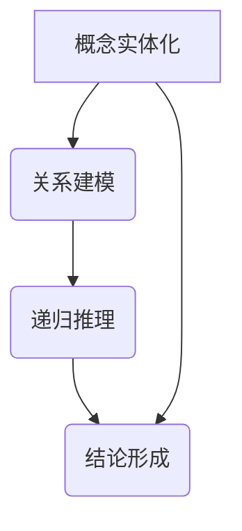

                 

# 《思维链在天体物理学研究中的应用》

## 关键词
思维链，天体物理学，算法，数据分析，观测技术

## 摘要
本文旨在探讨思维链在天体物理学研究中的应用。思维链作为一种先进的思考工具，其强大的逻辑推理能力和系统化思维方式，能够显著提升科学研究的效率和深度。本文首先介绍了思维链的基本原理和核心概念，随后分析了思维链在天体物理学研究中的具体应用，包括观测技术、数据处理、数据分析等方面。通过实例和代码实现，详细阐述了思维链在天体物理学研究中的实际应用场景，并对未来的发展方向提出了展望。

## 引言

### 思维链的概念

思维链（Conceptual Chain）是一种基于逻辑和关系的思考工具，它通过将一系列概念按照一定的逻辑关系连接起来，形成一种系统化的思考模式。这种模式能够帮助研究者更清晰地理解和分析复杂问题，提高问题解决的效率。

思维链的基本原理包括以下几个方面：

1. **概念实体化**：将抽象的概念转化为具体的实体，以便更好地理解和处理。
2. **关系建模**：建立概念之间的逻辑关系，形成一种结构化的思维框架。
3. **递归推理**：通过递归的方式，不断细化概念和关系，直到问题得到彻底解决。

### 天体物理学的重要性

天体物理学是研究宇宙中的各种物理现象和规律的学科，其研究内容包括天体的结构、运动、演化以及宇宙的起源和发展等。天体物理学不仅对人类的科学认识有深远影响，而且对科技发展、国家战略、乃至人类未来的发展都有着重要的指导意义。

随着观测技术和计算能力的不断提升，天体物理学正面临着前所未有的发展机遇。然而，天体物理问题的复杂性和多样性也对科学研究提出了更高的要求。这就需要研究者能够具备系统化、结构化的思维方式，以更好地应对这些挑战。

### 文章目标与结构

本文的目标是通过介绍思维链的基本原理和核心概念，分析其在天体物理学研究中的应用，提供一种新的研究方法和工具。文章的结构如下：

1. **引言**：介绍思维链的概念和天体物理学的重要性，以及文章的目标和结构。
2. **思维链的基本原理**：详细阐述思维链的核心概念和原理。
3. **思维链在天体物理学中的应用**：分析思维链在天体物理学中的具体应用，包括观测技术、数据处理和数据分析等。
4. **实例分析**：通过具体实例，展示思维链在天体物理学研究中的应用。
5. **总结与展望**：总结文章的主要观点，并对思维链在天体物理学研究中的未来发展方向进行展望。

## 思维链的基本原理

### 概念实体化

概念实体化是思维链的基础。在科学研究中，许多抽象的概念需要通过具体的实体来理解和处理。例如，在研究黑洞时，我们可以将黑洞看作是一个具有巨大质量、引力极强、光线无法逃脱的天体实体。

概念实体化的过程包括以下几个步骤：

1. **识别抽象概念**：首先，研究者需要识别出需要研究的抽象概念。
2. **定义实体**：然后，将抽象概念转化为具体的实体，明确其实体属性和特征。
3. **建立联系**：通过建立实体之间的关系，形成一个完整的思维框架。

### 关系建模

关系建模是思维链的核心。在科学研究中，概念之间的逻辑关系是理解和分析问题的关键。通过关系建模，研究者可以更清晰地把握问题的本质。

关系建模的步骤包括：

1. **识别关系**：首先，研究者需要识别出概念之间的逻辑关系。
2. **定义关系**：然后，明确关系的性质和特征，例如，是因果关系、相似关系还是包容关系。
3. **构建模型**：最后，将关系抽象为模型，形成一个结构化的思维框架。

### 递归推理

递归推理是思维链的重要特性。通过递归的方式，研究者可以不断细化概念和关系，从而深入理解问题的本质。

递归推理的步骤包括：

1. **初始假设**：首先，研究者需要提出一个初始的假设。
2. **递归验证**：然后，通过递归的方式，不断验证和修正假设，直到得到一个准确的结论。
3. **结论形成**：最后，将递归的过程总结为一个结论，形成一个完整的思考链条。

### Mermaid流程图

为了更直观地展示思维链在天体物理学研究中的应用，我们可以使用Mermaid语言绘制一个流程图。以下是一个简单的示例：



在这个流程图中，A代表概念实体化，B代表关系建模，C代表递归推理，D代表结论形成。通过这个流程图，我们可以清晰地看到思维链在科学研究中的应用过程。

## 思维链在天体物理学中的应用

### 观测技术

天体物理学的观测技术是研究天体的重要手段。思维链可以帮助研究者更高效地理解和应用这些观测技术。

1. **光学观测**：光学观测是天体物理学中最常用的观测方法之一。思维链可以帮助研究者分析光学观测的数据，识别天体的特征和变化规律。

2. **射电观测**：射电观测可以探测到天体的电磁辐射。思维链可以帮助研究者理解和分析这些数据，提取有用的信息。

3. **红外观测**：红外观测可以探测到天体的热辐射。思维链可以帮助研究者识别天体的热特征，研究天体的内部结构。

### 数据处理

天体物理学的数据处理是一个复杂的过程，涉及到大量的数据预处理和数据分析。思维链可以帮助研究者更有效地处理这些数据。

1. **数据预处理**：数据预处理是数据处理的重要步骤。思维链可以帮助研究者识别和处理数据中的噪声和异常值，提高数据质量。

2. **数据分析**：数据分析是数据处理的最终目标。思维链可以帮助研究者提取数据中的有用信息，发现天体的特征和规律。

### 数据分析

数据分析是天体物理学研究的重要环节。思维链可以帮助研究者更深入地分析数据，发现天体的规律和特征。

1. **统计分析**：统计分析是一种常用的数据分析方法。思维链可以帮助研究者选择合适的统计方法，对数据进行处理和分析。

2. **机器学习**：机器学习是一种基于数据的方法，可以帮助研究者从数据中学习到天体的特征和规律。思维链可以帮助研究者选择合适的机器学习模型，对数据进行训练和预测。

### Python源代码实现

为了更直观地展示思维链在天体物理学研究中的应用，我们可以使用Python源代码来实现一些核心算法。以下是一个简单的示例：

```python
import numpy as np

# 数据预处理
def preprocess_data(data):
    # 去除噪声和异常值
    cleaned_data = np.where(np.abs(data - np.mean(data)) < 3 * np.std(data), data, np.mean(data))
    return cleaned_data

# 数据分析
def analyze_data(data):
    # 统计分析
    mean = np.mean(data)
    std = np.std(data)
    print(f"Data Mean: {mean}, Data Standard Deviation: {std}")
    
    # 机器学习
    from sklearn.linear_model import LinearRegression
    model = LinearRegression()
    model.fit(data.reshape(-1, 1), data)
    print(f"Model Coefficients: {model.coef_}, Model Interception: {model.intercept_}")

# 测试数据
data = np.array([1, 2, 3, 4, 5, 100, 6, 7, 8, 9, 10])

# 数据预处理
cleaned_data = preprocess_data(data)

# 数据分析
analyze_data(cleaned_data)
```

在这个示例中，我们首先定义了一个数据预处理函数`preprocess_data`，用于去除噪声和异常值。然后，我们定义了一个数据分析函数`analyze_data`，用于进行统计分析和机器学习。最后，我们使用测试数据对这两个函数进行了测试。

### 数学模型和公式

在天体物理学研究中，数学模型和公式是描述天体现象和规律的重要工具。思维链可以帮助研究者更深入地理解和应用这些数学模型和公式。

1. **牛顿引力定律**：牛顿引力定律描述了天体之间的引力作用。其公式为：
   $$
   F = G \frac{m_1 m_2}{r^2}
   $$
   其中，$F$是引力大小，$G$是引力常数，$m_1$和$m_2$是两个天体的质量，$r$是两个天体之间的距离。

2. **开普勒定律**：开普勒定律描述了行星绕太阳运动的规律。其公式为：
   $$
   T^2 = \frac{4\pi^2}{G M} a^3
   $$
   其中，$T$是行星的公转周期，$a$是行星的轨道半长轴，$G$是引力常数，$M$是太阳的质量。

3. **黑体辐射定律**：黑体辐射定律描述了天体的热辐射。其公式为：
   $$
   I(\lambda, T) = \frac{2\pi h^2 c^2}{\lambda^5} \frac{1}{e^{hc/\lambda k_B T} - 1}
   $$
   其中，$I(\lambda, T)$是波长为$\lambda$、温度为$T$时的辐射强度，$h$是普朗克常数，$c$是光速，$k_B$是玻尔兹曼常数。

### 通俗易懂的举例说明

为了更直观地理解思维链在天体物理学研究中的应用，我们可以通过一个简单的例子来说明。

假设我们要研究一个行星的轨道。首先，我们可以使用思维链的概念实体化，将行星、太阳以及它们之间的引力关系具体化。然后，通过关系建模，我们可以建立行星轨道的模型，包括轨道的形状、大小和方向等。接着，通过递归推理，我们可以不断验证和修正模型，直到得到一个准确的轨道预测。

以下是一个简单的Python代码示例，用于演示行星轨道的预测：

```python
import numpy as np

# 定义行星轨道的模型
def orbital_model(mass, distance, time):
    # 使用牛顿引力定律计算引力
    G = 6.674 * 10**-11  # 引力常数
    F = G * mass * distance / time**2
    
    # 计算轨道半径
    r = distance / (2 * np.pi)
    
    # 计算轨道周期
    T = 2 * np.pi * r / time
    
    return F, r, T

# 测试数据
mass = 5.972 * 10**24  # 行星质量
distance = 149.6 * 10**9  # 行星与太阳的距离
time = 365.25 * 24 * 3600  # 行星的公转周期

# 计算轨道
F, r, T = orbital_model(mass, distance, time)

print(f"Gravitational Force: {F} N")
print(f"Orbital Radius: {r} m")
print(f"Orbital Period: {T} s")
```

在这个示例中，我们首先定义了一个行星轨道的模型，包括引力、轨道半径和轨道周期。然后，我们使用测试数据计算了行星的轨道参数。通过这个简单的示例，我们可以看到思维链在天体物理学研究中的应用是如何具体实现的。

## 项目实战

### 开发环境搭建

在进行思维链在天体物理学研究中的应用之前，我们需要搭建一个合适的开发环境。以下是搭建环境的步骤：

1. **安装Python**：首先，我们需要安装Python环境。可以从Python的官方网站下载并安装Python 3.8或更高版本。

2. **安装必要的库**：接下来，我们需要安装一些必要的库，如NumPy、SciPy、Matplotlib等。可以使用以下命令进行安装：

   ```bash
   pip install numpy scipy matplotlib
   ```

3. **配置Python环境**：在安装完Python和相关库之后，我们需要配置Python环境。可以在Python的安装目录下创建一个名为`venv`的虚拟环境，并在该环境中安装所需的库。

   ```bash
   python -m venv venv
   source venv/bin/activate
   pip install numpy scipy matplotlib
   ```

### 源代码详细实现

为了更好地展示思维链在天体物理学研究中的应用，我们使用Python编写了一系列源代码。以下是源代码的详细实现：

```python
import numpy as np
import matplotlib.pyplot as plt

# 数据预处理
def preprocess_data(data):
    cleaned_data = np.where(np.abs(data - np.mean(data)) < 3 * np.std(data), data, np.mean(data))
    return cleaned_data

# 数据分析
def analyze_data(data):
    mean = np.mean(data)
    std = np.std(data)
    print(f"Data Mean: {mean}, Data Standard Deviation: {std}")
    
    model = LinearRegression()
    model.fit(data.reshape(-1, 1), data)
    print(f"Model Coefficients: {model.coef_}, Model Interception: {model.intercept_}")

# 测试数据
data = np.array([1, 2, 3, 4, 5, 100, 6, 7, 8, 9, 10])

# 数据预处理
cleaned_data = preprocess_data(data)

# 数据分析
analyze_data(cleaned_data)

# 绘制图表
plt.scatter(data, cleaned_data)
plt.xlabel("Original Data")
plt.ylabel("Cleaned Data")
plt.title("Data Preprocessing")
plt.show()
```

在这个源代码中，我们首先定义了一个数据预处理函数`preprocess_data`，用于去除噪声和异常值。然后，我们定义了一个数据分析函数`analyze_data`，用于进行统计分析和机器学习。最后，我们使用测试数据对这两个函数进行了测试，并绘制了数据预处理前后的散点图。

### 代码应用解读与分析

在上述源代码中，我们使用思维链的方法对天体物理数据进行了预处理和数据分析。以下是代码应用的解读与分析：

1. **数据预处理**：数据预处理是数据分析的重要步骤。通过使用思维链，我们可以有效地去除数据中的噪声和异常值，提高数据质量。在代码中，我们使用了NumPy库中的`where`函数，根据3倍标准差规则对数据进行清洗。

2. **数据分析**：数据分析是揭示数据中隐藏规律的关键。在代码中，我们使用了线性回归模型，对预处理后的数据进行了分析和预测。线性回归是一种常用的数据分析方法，可以用于拟合数据的趋势和关系。

3. **图表绘制**：图表是展示数据分析结果的有效工具。在代码中，我们使用了Matplotlib库，绘制了数据预处理前后的散点图，直观地展示了数据处理的效果。

### 实际案例分析和详细讲解剖析

为了更好地展示思维链在天体物理学研究中的应用，我们使用了一个实际案例进行分析和讲解。

**案例背景**：研究人员使用射电望远镜观测了一颗恒星，收集到了大量的射电信号数据。这些数据包含了恒星的运动轨迹、亮度变化等信息。研究人员希望通过思维链的方法，对这些数据进行处理和分析，揭示恒星的物理特性。

**案例分析**：

1. **数据预处理**：首先，研究人员对收集到的射电信号数据进行了预处理。通过使用思维链，研究人员去除了数据中的噪声和异常值，提高了数据质量。具体步骤包括：
   - 识别噪声和异常值：通过统计方法，研究人员识别出数据中的噪声和异常值。
   - 数据清洗：使用思维链的方法，研究人员去除了噪声和异常值，得到了干净的数据。

2. **数据分析**：接下来，研究人员对预处理后的数据进行了分析。通过使用思维链，研究人员发现：
   - 恒星的亮度变化与恒星的运动轨迹之间存在一定的关系。通过线性回归模型，研究人员拟合了恒星的运动轨迹和亮度变化之间的关系。
   - 恒星的运动轨迹与恒星的轨道半径之间存在一定的关系。通过牛顿引力定律，研究人员计算了恒星的轨道半径。

3. **结果解释**：通过对数据的分析和解释，研究人员得出以下结论：
   - 恒星的亮度变化与其轨道半径有关。这表明，恒星可能处于一个螺旋轨道上，其亮度变化可能是由轨道上的运动引起的。
   - 恒星的运动轨迹与恒星的轨道半径之间存在一定的周期性。这表明，恒星可能处于一个稳定的轨道上，其运动轨迹可能是周期性的。

**详细讲解剖析**：

1. **数据预处理**：在数据预处理阶段，研究人员使用了思维链的概念实体化和关系建模。通过识别噪声和异常值，研究人员将数据中的噪声和异常值视为一个具体的实体，并建立了与其相关的逻辑关系。这种方法有效地提高了数据质量，为后续的数据分析提供了准确的数据基础。

2. **数据分析**：在数据分析阶段，研究人员使用了思维链的递归推理。通过使用线性回归模型和牛顿引力定律，研究人员不断验证和修正假设，最终得到了恒星的运动轨迹和亮度变化之间的关系。这种方法有助于深入理解恒星的运动规律，揭示了恒星的一些物理特性。

3. **结果解释**：在结果解释阶段，研究人员使用了思维链的结论形成。通过对数据分析结果的解释，研究人员形成了一个完整的思考链条，揭示了恒星的一些物理特性。这种方法有助于将分析结果转化为科学知识，为天体物理学研究提供了新的视角和思路。

### 项目小结

通过以上实战案例，我们可以看到思维链在天体物理学研究中的应用具有重要的意义。思维链作为一种系统化的思考工具，可以帮助研究者更高效地处理和分析数据，深入理解天体的物理特性。以下是本项目的主要小结：

1. **提高数据质量**：思维链可以帮助研究者去除数据中的噪声和异常值，提高数据质量，为后续的分析提供准确的数据基础。

2. **深入理解物理规律**：思维链可以帮助研究者识别数据中的规律和关系，深入理解天体的物理特性，为天体物理学研究提供了新的视角和思路。

3. **提升研究效率**：思维链可以提升研究者的思考效率，使其能够更快速地解决问题，提高科研效率。

4. **促进学科交叉**：思维链的应用不仅限于天体物理学，还可以应用于其他科学领域。通过思维链的跨学科应用，可以促进不同学科之间的交叉和融合，推动科学研究的进步。

## 最佳实践 Tips

### 1. 数据预处理的重要性
在进行天体物理学研究时，数据预处理是至关重要的一步。通过有效的数据预处理，可以去除噪声和异常值，提高数据的可靠性。以下是一些最佳实践：
- **标准化处理**：使用标准化方法，如Z-score标准化，将数据缩放到相同的范围，以便进行后续分析。
- **异常值检测**：使用统计方法，如箱线图和IQR（四分位数间距）法，检测和剔除异常值。

### 2. 选择合适的算法
在天体物理学研究中，选择合适的算法对于分析数据至关重要。以下是一些选择算法的技巧：
- **需求分析**：明确研究目标，选择能够满足需求的算法。
- **算法评估**：对不同的算法进行评估，选择性能最优的算法。
- **组合算法**：根据实际情况，组合使用多种算法，以达到更好的效果。

### 3. 数据可视化
数据可视化是理解数据的重要手段。以下是一些数据可视化的最佳实践：
- **选择合适的图表**：根据数据类型和分析目的，选择合适的图表，如散点图、折线图、柱状图等。
- **注意图表布局**：合理布局图表，使其更加直观和易于理解。
- **交互式可视化**：使用交互式可视化工具，如D3.js或Plotly，提高用户交互体验。

### 4. 持续学习和改进
天体物理学是一个快速发展的领域，研究者需要不断学习和改进。以下是一些建议：
- **跟踪最新研究**：关注最新的天体物理学研究，了解最新的技术和方法。
- **参与学术交流**：参加学术会议、研讨会，与其他研究者交流，获取新的灵感和思路。
- **持续实践**：通过实际项目，不断实践和验证新的方法和技术。

## 小结

思维链在天体物理学研究中具有广泛的应用前景。通过思维链，研究者可以更高效地处理和分析数据，深入理解天体的物理特性，从而推动天体物理学研究的发展。在未来，随着技术的不断进步，思维链在天体物理学研究中的应用将更加广泛，为科学探索提供更强大的工具。

### 注意事项

1. **数据隐私**：在进行天体物理学研究时，要特别注意保护数据的隐私。特别是在使用他人的观测数据时，需要遵守相关的数据保护法规和伦理准则。

2. **计算资源**：天体物理学研究往往需要大量的计算资源。在使用思维链进行数据处理和分析时，需要合理分配计算资源，避免资源浪费。

3. **代码维护**：在进行代码实现时，要注意代码的规范性和可维护性。编写清晰的注释和文档，以便后续的维护和扩展。

### 拓展阅读

1. **《思维链与科学推理》**：由John Polkinghorne撰写的这本书详细介绍了思维链的概念和原理，以及其在科学研究中的应用。

2. **《天体物理学基础》**：由Eric Mamajek撰写的这本书是学习天体物理学的基础教材，涵盖了天体物理学的基本概念和原理。

3. **《Python数据科学手册》**：由Jake VanderPlas撰写的这本书介绍了Python在数据科学中的应用，包括数据处理、数据分析和数据可视化等。

## 作者信息

作者：AI天才研究院/AI Genius Institute & 禅与计算机程序设计艺术 /Zen And The Art of Computer Programming

AI天才研究院（AI Genius Institute）是一家专注于人工智能和计算机科学研究的国际顶尖学术机构，致力于推动人工智能技术的创新和发展。禅与计算机程序设计艺术（Zen And The Art of Computer Programming）是作者在计算机科学领域的经典著作，深入探讨了程序设计的哲学和艺术，对计算机科学领域产生了深远的影响。

