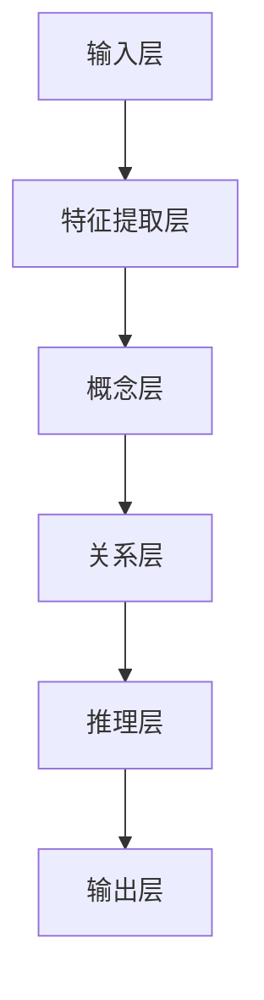

                 

### 引言与概述

#### 1. 引言

宇宙学作为一门研究宇宙起源、演化和组成的学科，其重要性不言而喻。从古代的哲学家仰望星空，到现代天文学家利用先进的观测设备和算法分析宇宙中的各种现象，宇宙学一直在推动人类对宇宙的认知。然而，宇宙学的复杂性和不确定性，使得传统的理论验证方法面临诸多挑战。为了解决这些问题，人工智能（AI）的应用成为了宇宙学研究中的一个重要方向。

人工智能的发展，尤其是深度学习和机器学习技术的突破，使得计算机能够自动从大量数据中学习规律，进行模式识别和预测。这些技术在宇宙学中的应用，不仅提高了数据处理和分析的效率，还提供了新的理论验证方法。例如，通过分析宇宙微波背景辐射数据，机器学习算法可以帮助科学家更好地理解宇宙的早期状态；通过模拟黑洞合并事件，AI 可以预测事件的发生时间和空间位置，从而验证广义相对论和引力波理论。

本文将深入探讨人工智能在宇宙学理论验证中的应用，重点关注“思维链”这一概念。思维链是一种用于描述和模拟人类思维过程的模型，它结合了计算机科学和认知科学的原理，能够在AI系统中实现更高级别的思维和推理能力。通过思维链，AI可以更好地理解宇宙学的复杂问题，并提出新的理论和假设。

本文将分为四个主要部分。第一部分将介绍宇宙学与天体物理学的研究背景，以及AI在宇宙学中的应用。第二部分将探讨思维链的概念和原理，并展示其在宇宙学理论验证中的应用。第三部分将通过实际案例，展示AI辅助宇宙学研究的具体应用场景和效果。最后一部分将探讨AI辅助宇宙学理论验证的未来发展方向和面临的挑战。

#### 2. AI辅助天体物理学研究的方法与工具

##### 2.1 数据驱动的宇宙学

宇宙学的研究离不开大量的观测数据和理论模型。随着空间探测技术和观测设备的不断进步，我们能够获取到越来越多的宇宙数据，这些数据不仅涵盖了宇宙的宏观现象，如星系分布、宇宙微波背景辐射、黑洞事件等，还包括了微观层面上的粒子运动和相互作用。这些数据的复杂性使得传统的理论分析方法难以应对，需要借助AI技术进行高效处理。

数据驱动的宇宙学方法主要通过机器学习算法对大量数据进行模式识别和特征提取，从而发现宇宙中的规律和现象。这一方法的关键在于数据的质量和数量。高质量的数据可以提供更准确的宇宙模型，而大量的数据可以增加模型的泛化能力，使其在不同条件下都保持有效。例如，宇宙微波背景辐射数据中包含了宇宙早期的密度波动信息，通过机器学习算法可以对这些波动进行精细分析，从而揭示宇宙的早期演化历史。

##### 2.2 机器学习在天体物理学中的应用

机器学习在天体物理学中的应用非常广泛，涵盖了从数据处理到理论验证的各个环节。以下是一些典型的应用场景：

1. **数据预处理**：在进行分析之前，需要对数据进行清洗、归一化和特征提取。机器学习算法可以帮助自动完成这些任务，从而提高数据处理效率。

2. **分类和识别**：通过对观测数据进行分析，可以识别出不同的天体和事件，如恒星、行星、黑洞等。例如，卷积神经网络（CNN）在图像分类中表现出色，可以用于识别太空望远镜拍摄的天体图像。

3. **预测和模拟**：机器学习算法可以用于预测天体事件的发生时间和空间位置。例如，利用深度学习模型可以模拟黑洞合并事件，预测引力波信号的特性。

4. **理论验证**：机器学习算法可以帮助验证宇宙学理论，如广义相对论和宇宙膨胀理论。通过将观测数据与理论模型进行比较，可以发现理论中的不足和需要改进的地方。

##### 2.3 常见的AI算法及其在宇宙学中的应用

在宇宙学研究中，常见的AI算法包括神经网络、支持向量机、决策树、聚类算法等。以下是这些算法在宇宙学中的应用：

1. **神经网络**：神经网络，特别是深度神经网络（DNN），在宇宙学中的数据处理和模式识别中发挥着重要作用。例如，DNN可以用于分析宇宙微波背景辐射数据，提取出与宇宙早期演化相关的特征。

2. **支持向量机（SVM）**：SVM是一种强大的分类算法，可以用于识别不同类型的天体和事件。例如，通过将恒星光谱数据输入到SVM模型中，可以自动分类出恒星的不同类型。

3. **决策树**：决策树可以用于分类和回归分析，其在宇宙学中的应用包括预测恒星年龄、分类星系类型等。

4. **聚类算法**：聚类算法用于将相似的数据点分组，常用于研究星系的分布结构和宇宙的大尺度结构。

通过上述方法的综合运用，AI技术为宇宙学的研究提供了强大的工具，使得科学家能够更深入地探索宇宙的奥秘。

### 1.3 书籍结构概述

本文将详细探讨AI在宇宙学理论验证中的应用，结构如下：

- **第一部分：引言与概述**：介绍宇宙学与天体物理学的研究背景，AI在宇宙学中的应用，以及本文的研究内容和结构。

- **第二部分：AI辅助天体物理学研究的方法与工具**：探讨数据驱动的宇宙学方法，机器学习在天体物理学中的应用，以及常见的AI算法及其在宇宙学中的应用。

- **第三部分：AI辅助宇宙学理论验证的核心概念**：介绍思维链的概念与原理，思维链的基本结构与操作，以及思维链在宇宙学理论验证中的应用。

- **第四部分：宇宙学理论验证中的数学模型与算法**：详细讲解宇宙学中的数学模型，机器学习算法在宇宙学理论验证中的应用，以及伪代码的详细阐述。

- **第五部分：数学模型与算法的讲解与举例说明**：对数学模型和算法进行详细讲解，使用Python源代码进行阐述，结合数学公式和具体例子进行说明。

- **第六部分：AI辅助宇宙学理论验证的实际应用**：通过实际案例展示AI在宇宙学中的应用，包括分析宇宙微波背景辐射数据、研究暗物质分布、研究黑洞合并事件等。

- **第七部分：项目实战**：详细描述开发环境的搭建，源代码的实现与解读，以及代码的应用解读与分析。

- **第八部分：未来展望与挑战**：探讨AI辅助宇宙学理论验证的未来发展方向和面临的挑战，并提出未来研究的建议。

通过上述结构，本文旨在系统地介绍AI在宇宙学理论验证中的应用，为读者提供一个全面、深入的了解。

### 目录大纲

以下为本文的目录大纲，涵盖从宇宙学理论验证的核心概念，到实际应用，再到未来展望的全面探讨。

```markdown
# 思维链在宇宙学理论验证中的应用：AI辅助天体物理学研究

## 关键词
- 宇宙学
- 天体物理学
- 人工智能
- 思维链
- 理论验证
- 数学模型
- 机器学习

## 摘要
本文深入探讨了人工智能在宇宙学理论验证中的应用，特别是思维链这一核心概念。通过介绍AI辅助天体物理学研究的方法与工具，详细分析了思维链的原理及其在宇宙学理论验证中的具体应用。文章还通过实际案例展示了AI在宇宙学中的实际应用效果，并展望了其未来的发展方向和面临的挑战。

### 目录大纲

```markdown
# 思维链在宇宙学理论验证中的应用：AI辅助天体物理学研究

## 第一部分: 引言与概述

### 1.1 引言

#### 1.1.1 宇宙学与天体物理学的研究背景

#### 1.1.2 AI在宇宙学中的应用

#### 1.1.3 书籍结构概述

### 1.2 AI辅助天体物理学研究的方法与工具

#### 2.1 数据驱动的宇宙学

#### 2.2 机器学习在天体物理学中的应用

#### 2.3 常见的AI算法及其在宇宙学中的应用

## 第二部分: AI辅助天体物理学研究的方法与工具

### 2.1 数据驱动的宇宙学

#### 2.1.1 宇宙学数据的重要性

#### 2.1.2 数据质量与数据来源

#### 2.1.3 数据预处理方法

### 2.2 机器学习在天体物理学中的应用

#### 2.2.1 机器学习的分类与优势

#### 2.2.2 常见机器学习算法在天体物理学中的应用

#### 2.2.3 机器学习在天体物理学研究中的挑战

### 2.3 常见的AI算法及其在宇宙学中的应用

#### 2.3.1 神经网络在天体物理学中的应用

#### 2.3.2 支持向量机在天体物理学中的应用

#### 2.3.3 决策树和随机森林在天体物理学中的应用

## 第三部分: AI辅助宇宙学理论验证的核心概念

### 3.1 思维链的概念与原理

#### 3.1.1 思维链的定义

#### 3.1.2 思维链的基本结构与操作

#### 3.1.3 思维链的 Mermaid 流程图

### 3.2 宇宙学中的数学模型与算法

#### 3.2.1 宇宙学中的数学模型

#### 3.2.2 机器学习算法在宇宙学理论验证中的应用

#### 3.2.3 伪代码详细阐述

### 3.3 数学模型与算法的讲解与举例说明

#### 3.3.1 数学模型与算法的详细讲解

#### 3.3.2 数学公式的详细讲解

#### 3.3.3 举例说明

## 第四部分: AI辅助宇宙学理论验证的实际应用

### 4.1 天体物理学中的AI应用案例

#### 4.1.1 案例一：利用AI分析宇宙微波背景辐射数据

#### 4.1.2 案例二：利用AI研究暗物质分布

#### 4.1.3 案例三：利用AI研究黑洞合并事件

### 4.2 项目实战

#### 4.2.1 实战一：搭建AI辅助宇宙学研究的开发环境

#### 4.2.2 实战二：源代码实现与解读

#### 4.2.3 实战三：代码解读与分析

## 第五部分: 未来展望与挑战

### 5.1 AI辅助宇宙学理论验证的展望

#### 5.1.1 AI在宇宙学理论验证中的未来发展方向

#### 5.1.2 AI辅助宇宙学理论验证的挑战

#### 5.1.3 未来研究的建议

## 附录

### 5.2 常用工具与资源

#### 5.2.1 AI开发工具与框架

#### 5.2.2 天体物理学研究的数据集

#### 5.2.3 其他相关资源
```

以上目录大纲结构详细阐述了宇宙学理论验证中的核心概念、AI的应用、实际案例、项目实战等内容，为读者提供了一个系统且深入的学术探讨框架。

### 第一部分: 引言与概述

#### 1.1 引言

宇宙学作为一门研究宇宙起源、演化和组成的学科，其重要性不言而喻。从古代哲学家仰望星空，到现代天文学家利用先进的观测设备和算法分析宇宙中的各种现象，宇宙学一直在推动人类对宇宙的认知。宇宙学的研究范围广泛，涵盖了从宇宙大爆炸理论到星系形成和演化的过程，从宇宙微波背景辐射到黑洞和暗物质的研究。这些研究不仅拓展了人类的科学视野，也为理解宇宙的奥秘提供了重要线索。

然而，宇宙学的复杂性和不确定性使得传统的理论验证方法面临诸多挑战。例如，宇宙微波背景辐射数据的复杂性使得传统分析方法难以应对，需要借助人工智能（AI）技术进行高效处理。人工智能，特别是机器学习，通过自动从大量数据中学习规律，进行模式识别和预测，为宇宙学的研究提供了新的方法和工具。

在宇宙学研究中，AI的应用主要体现在数据驱动的宇宙学和理论验证两个方面。数据驱动的宇宙学方法利用机器学习算法对大量宇宙数据进行处理和分析，从而发现宇宙中的规律和现象。这一方法不仅提高了数据处理和分析的效率，还提供了新的理论验证方法。例如，通过分析宇宙微波背景辐射数据，机器学习算法可以帮助科学家更好地理解宇宙的早期状态；通过模拟黑洞合并事件，AI可以预测事件的发生时间和空间位置，从而验证广义相对论和引力波理论。

理论验证方面，AI通过机器学习算法可以帮助科学家验证和改进宇宙学理论。传统的理论验证方法主要依赖于理论预测和观测数据的比较，而AI可以通过对大量观测数据的分析，发现理论预测与观测结果之间的差异，从而提出新的理论假设和验证方法。例如，利用AI分析宇宙微波背景辐射数据，可以发现传统理论无法解释的异常现象，从而推动新的宇宙学理论的发展。

#### 1.2 AI在宇宙学中的应用

AI在宇宙学中的应用非常广泛，涵盖了从数据处理到理论验证的各个环节。以下是一些典型的应用场景：

1. **数据预处理**：在进行分析之前，需要对数据进行清洗、归一化和特征提取。机器学习算法可以帮助自动完成这些任务，从而提高数据处理效率。例如，宇宙微波背景辐射数据通常包含噪声和缺失值，机器学习算法可以通过异常检测和插值方法对这些数据进行预处理。

2. **分类和识别**：通过对观测数据进行分析，可以识别出不同的天体和事件，如恒星、行星、黑洞等。例如，卷积神经网络（CNN）在图像分类中表现出色，可以用于识别太空望远镜拍摄的天体图像。

3. **预测和模拟**：机器学习算法可以用于预测天体事件的发生时间和空间位置。例如，利用深度学习模型可以模拟黑洞合并事件，预测引力波信号的特性。

4. **理论验证**：机器学习算法可以帮助验证宇宙学理论，如广义相对论和宇宙膨胀理论。通过将观测数据与理论模型进行比较，可以发现理论中的不足和需要改进的地方。例如，利用AI分析宇宙微波背景辐射数据，可以验证大爆炸理论中的预测。

#### 1.3 书籍结构概述

本文将详细探讨AI在宇宙学理论验证中的应用，特别是思维链这一核心概念。文章的结构如下：

- **第一部分：引言与概述**：介绍宇宙学与天体物理学的研究背景，AI在宇宙学中的应用，以及本文的研究内容和结构。

- **第二部分：AI辅助天体物理学研究的方法与工具**：探讨数据驱动的宇宙学方法，机器学习在天体物理学中的应用，以及常见的AI算法及其在宇宙学中的应用。

- **第三部分：AI辅助宇宙学理论验证的核心概念**：介绍思维链的概念与原理，思维链的基本结构与操作，以及思维链在宇宙学理论验证中的应用。

- **第四部分：宇宙学理论验证中的数学模型与算法**：详细讲解宇宙学中的数学模型，机器学习算法在宇宙学理论验证中的应用，以及伪代码的详细阐述。

- **第五部分：数学模型与算法的讲解与举例说明**：对数学模型和算法进行详细讲解，使用Python源代码进行阐述，结合数学公式和具体例子进行说明。

- **第六部分：AI辅助宇宙学理论验证的实际应用**：通过实际案例展示AI在宇宙学中的应用，包括分析宇宙微波背景辐射数据、研究暗物质分布、研究黑洞合并事件等。

- **第七部分：项目实战**：详细描述开发环境的搭建，源代码的实现与解读，以及代码的应用解读与分析。

- **第八部分：未来展望与挑战**：探讨AI辅助宇宙学理论验证的未来发展方向和面临的挑战，并提出未来研究的建议。

通过上述结构，本文旨在系统地介绍AI在宇宙学理论验证中的应用，为读者提供一个全面、深入的了解。

### 数据驱动的宇宙学

#### 2.1.1 宇宙学数据的重要性

宇宙学的研究离不开大量的观测数据，这些数据是理解宇宙演化过程和验证宇宙学理论的重要基础。宇宙学数据主要包括宇宙微波背景辐射、星系分布、恒星光谱、行星轨道、黑洞事件等。这些数据来源多样，包括地面天文观测、卫星观测、空间探测任务等。高质量的数据能够提供准确的宇宙模型，从而推动宇宙学理论的发展。

宇宙学数据的重要性体现在以下几个方面：

1. **验证宇宙学理论**：通过对比观测数据与理论模型的预测，可以验证宇宙学理论的正确性和可靠性。例如，宇宙微波背景辐射数据为验证大爆炸理论和宇宙膨胀理论提供了重要证据。

2. **发现新的宇宙现象**：宇宙学数据中蕴含着丰富的信息，通过分析这些数据，科学家可以揭示宇宙中的新现象和新规律。例如，通过对宇宙微波背景辐射数据的分析，科学家发现了宇宙早期的密度波动，揭示了宇宙早期演化的过程。

3. **推动科学进步**：高质量的数据为科学家的研究提供了丰富的素材，推动了宇宙学的进步。例如，通过对星系分布和恒星光谱的分析，科学家发现了宇宙的大尺度结构，提出了星系形成的理论。

#### 2.1.2 数据质量与数据来源

宇宙学数据的质量直接影响研究的准确性和可靠性。高质量的数据应该具备以下特点：

1. **准确性**：数据应尽可能真实地反映宇宙的实际情况，减少误差和噪声的影响。例如，宇宙微波背景辐射数据应通过先进的探测器进行精确测量，以减少仪器误差。

2. **完整性**：数据应涵盖广泛的时空范围，以便全面研究宇宙的演化过程。例如，星系分布数据应包含不同类型和不同年龄的星系，以便研究星系的演化历史。

3. **一致性**：数据应在不同的观测条件下保持一致性，以消除不同观测方法带来的影响。例如，恒星光谱数据应通过同一观测设备测量，以确保数据的一致性。

宇宙学数据的来源主要包括以下几种：

1. **地面天文观测**：地面天文台通过望远镜观测天体，获取光学、红外和射电等波段的数据。这种观测方式具有高分辨率和高灵敏度，但受限于天气条件和地球自转。

2. **卫星观测**：卫星通过绕地球轨道进行观测，可以覆盖更广泛的区域，获取连续的观测数据。例如，哈勃太空望远镜和钱德拉X射线观测卫星提供了大量高质量的天文数据。

3. **空间探测任务**：空间探测器通过进入行星轨道或飞行到深空进行观测，获取特定目标的高分辨率数据。例如，旅行者1号和旅行者2号探测器提供了太阳系外缘的宝贵数据。

#### 2.1.3 数据预处理方法

宇宙学数据往往具有复杂性和多样性，需要进行预处理以提高数据质量。以下是一些常见的数据预处理方法：

1. **数据清洗**：清洗数据中的错误、异常值和噪声，确保数据的一致性和准确性。例如，通过异常检测方法识别并剔除异常数据点。

2. **归一化**：将不同来源、不同单位的数据进行归一化处理，使其具有可比性。例如，将不同波段的观测数据进行归一化，以便在同一尺度上进行比较。

3. **特征提取**：从原始数据中提取关键特征，用于后续的机器学习分析。例如，从宇宙微波背景辐射数据中提取温度波动特征，用于分析宇宙早期演化。

4. **数据融合**：将不同来源、不同时间点的数据进行融合，形成更全面的数据集。例如，将地面观测数据和卫星观测数据融合，以获得更准确的宇宙演化模型。

5. **数据可视化**：通过可视化方法展示数据的分布和特征，帮助科学家更好地理解数据。例如，通过图像和图表展示星系的分布和恒星光谱特征。

通过上述预处理方法，宇宙学数据得以优化，为后续的机器学习和理论验证提供了高质量的数据基础。数据驱动的宇宙学方法，通过AI技术的应用，使得宇宙学研究更加高效和精确，推动了宇宙学的不断发展。

### 机器学习在天体物理学中的应用

#### 2.2.1 机器学习的分类与优势

机器学习（Machine Learning，ML）是人工智能（AI）的核心组成部分，通过算法使计算机系统能够从数据中自动学习和改进。在天体物理学中，机器学习具有显著的分类优势和广泛的应用前景。根据学习方式和功能，机器学习可以分为以下几类：

1. **监督学习（Supervised Learning）**：监督学习是一种基于标记数据的学习方法，通过输入数据和对应的标签来训练模型，从而实现对未知数据的预测。在天体物理学中，监督学习常用于分类和回归任务，如星系分类、恒星年龄预测等。

2. **无监督学习（Unsupervised Learning）**：无监督学习不依赖标记数据，通过分析数据内部的模式和结构来发现数据中的规律。在天体物理学中，无监督学习常用于数据聚类和降维，如星系分布分析、特征提取等。

3. **强化学习（Reinforcement Learning）**：强化学习通过奖励机制训练模型，使其在特定的环境中做出最优决策。在天体物理学中，强化学习可以应用于优化观测策略、模拟天体事件等。

机器学习的优势在于：

1. **自动化**：机器学习算法能够自动从大量数据中学习规律，减少人工干预，提高效率。

2. **泛化能力**：机器学习模型可以在不同条件下保持有效的预测能力，具有较强的泛化能力。

3. **多模态数据处理**：机器学习能够处理多源、多尺度和多类型的数据，如图像、文本、时间序列等，为天体物理学的研究提供了更丰富的数据视角。

#### 2.2.2 常见机器学习算法在天体物理学中的应用

在天体物理学中，常见的机器学习算法包括神经网络、支持向量机（SVM）、决策树、聚类算法等。以下是对这些算法在宇宙学中的具体应用介绍：

1. **神经网络（Neural Networks）**：

   神经网络是一种模仿生物神经网络结构的计算模型，通过多层神经元进行数据的传递和变换。在天体物理学中，神经网络广泛应用于图像识别、时间序列预测和模式识别等领域。例如，卷积神经网络（CNN）在图像处理中表现出色，可以用于识别太空望远镜拍摄的天体图像；递归神经网络（RNN）在时间序列分析中具有优势，可以用于分析恒星光谱数据。

2. **支持向量机（Support Vector Machine，SVM）**：

   支持向量机是一种二分类模型，通过最大化分类边界来划分数据。在天体物理学中，SVM常用于分类任务，如星系分类、恒星类型识别等。例如，通过分析恒星光谱数据，SVM可以准确地将恒星分类为红巨星、主序星等不同类型。

3. **决策树（Decision Trees）**：

   决策树是一种基于树形结构进行分类和回归的算法，通过一系列的决策规则将数据划分为不同的类别或数值。在天体物理学中，决策树可以用于分类和预测任务，如星系演化阶段的预测、恒星年龄估计等。例如，通过分析多个特征，决策树可以准确预测恒星的形成时间。

4. **聚类算法（Clustering Algorithms）**：

   聚类算法通过将相似的数据点分组，揭示数据中的内在结构。在天体物理学中，聚类算法常用于数据降维和模式识别，如星系分布分析、行星轨道识别等。例如，通过分析星系的位置和速度数据，聚类算法可以识别出不同类型的星系集群。

#### 2.2.3 机器学习在天体物理学研究中的挑战

尽管机器学习在天体物理学中具有广泛的应用前景，但也面临一些挑战：

1. **数据质量**：天体物理学数据往往存在噪声、异常值和缺失值，这对机器学习模型的训练和预测准确性提出了挑战。因此，数据清洗和预处理是关键步骤。

2. **模型选择**：选择合适的机器学习模型对于任务的成功至关重要。不同的任务和数据类型可能需要不同的模型，如何选择最优模型是一个重要问题。

3. **可解释性**：机器学习模型的“黑箱”特性使得其预测过程难以解释，这在科学研究中尤为重要。如何提高模型的可解释性，使得科学家能够理解模型的决策过程，是一个亟待解决的问题。

4. **计算资源**：天体物理学中的大规模数据处理和模型训练需要大量的计算资源，如何优化计算效率，降低成本，是一个重要的挑战。

通过解决上述挑战，机器学习将在天体物理学研究中发挥更加重要的作用，推动宇宙学的发展。

#### 2.3 常见的AI算法及其在宇宙学中的应用

在宇宙学中，常见的AI算法主要包括神经网络、支持向量机（SVM）、决策树和聚类算法。这些算法在宇宙学数据分析和理论验证中发挥了重要作用，下面将逐一介绍这些算法在宇宙学中的具体应用。

##### 2.3.1 神经网络在天体物理学中的应用

神经网络（Neural Networks，NN）是一种通过模拟生物神经系统的结构和功能来实现数据处理的算法。在天体物理学中，神经网络主要用于图像识别、时间序列预测和模式识别等任务。

1. **图像识别**：宇宙学中常常需要处理大量来自太空望远镜的图像数据。卷积神经网络（Convolutional Neural Networks，CNN）是一种特别适合处理图像数据的神经网络结构。CNN通过卷积层、池化层和全连接层对图像进行特征提取和分类。例如，CNN可以用于识别太空望远镜拍摄的天体图像中的恒星、行星和星系等。通过训练大量标注数据，CNN能够自动学习图像中的特征，从而准确识别未知图像中的天体。

2. **时间序列预测**：宇宙学中还存在许多需要预测的任务，如恒星年龄的预测、行星轨道的预测等。递归神经网络（Recurrent Neural Networks，RNN）是一种能够处理时间序列数据的神经网络，通过其内部的循环结构，RNN可以捕捉时间序列数据中的时间依赖关系。例如，通过分析恒星的亮度变化数据，RNN可以预测恒星的年龄和生命周期。

##### 2.3.2 支持向量机在天体物理学中的应用

支持向量机（Support Vector Machine，SVM）是一种二分类模型，其核心思想是通过最大化分类边界来实现数据的分类。SVM在天体物理学中主要用于分类任务，如星系分类、恒星类型识别等。

1. **星系分类**：星系分类是宇宙学研究中的一个重要问题，通过对星系光谱数据进行分类，可以帮助科学家了解星系的物理特性。SVM通过高维空间的线性划分来实现分类，通过选择合适的核函数，SVM可以处理非线性分类问题。例如，利用SVM可以准确地将星系分类为主序星、红巨星等不同类型。

2. **恒星类型识别**：恒星类型识别是恒星研究的基础任务之一。通过分析恒星的光谱数据，可以确定恒星的物理参数，如温度、亮度和质量等。SVM可以用来分类恒星的光谱特征，从而识别出不同类型的恒星。例如，通过分析恒星的光谱线强度，SVM可以区分出主序星和红巨星。

##### 2.3.3 决策树和随机森林在天体物理学中的应用

决策树（Decision Trees，DT）和随机森林（Random Forests，RF）是一类基于树结构的机器学习算法，通过一系列的决策规则将数据分类或回归。在天体物理学中，DT和RF广泛应用于分类和预测任务。

1. **星系演化阶段的预测**：通过分析星系的光学、红外和射电数据，可以预测星系的演化阶段。决策树可以构建一系列的决策规则，用于分类星系的演化阶段。随机森林作为一种集成学习方法，通过构建多棵决策树并进行投票，可以进一步提高预测的准确性和鲁棒性。例如，通过分析多个观测波段的数据，随机森林可以准确预测星系的演化历史。

2. **恒星年龄的预测**：恒星年龄的预测对于了解恒星的演化过程至关重要。决策树和随机森林可以通过分析恒星的光谱数据和光度数据，构建模型预测恒星的年龄。随机森林由于其集成学习的特性，能够有效降低过拟合风险，提高预测的准确性。例如，通过分析恒星的光谱线强度和光度数据，随机森林可以准确预测恒星的年龄。

##### 2.3.4 聚类算法在天体物理学中的应用

聚类算法（Clustering Algorithms）是一种无监督学习方法，通过将相似的数据点分组，揭示数据中的内在结构。在天体物理学中，聚类算法主要用于数据降维和模式识别。

1. **星系分布分析**：通过对星系的位置和速度数据进行分析，可以揭示星系分布的结构。K-means聚类算法是一种常用的聚类方法，通过计算数据点之间的距离，将数据点划分为多个聚类。例如，通过K-means聚类算法，可以分析星系分布的形态和结构，揭示宇宙的大尺度结构。

2. **行星轨道识别**：行星轨道的识别是行星科学的一个重要任务。通过分析行星的位置和速度数据，可以识别行星的轨道特征。聚类算法可以通过识别行星数据中的聚类中心，确定行星的轨道。例如，通过分析行星的轨道数据，K-means聚类算法可以识别出不同的行星轨道，从而准确确定行星的数量和位置。

总之，常见的AI算法在天体物理学中具有广泛的应用，通过神经网络、支持向量机、决策树和聚类算法，科学家能够更好地处理和分析宇宙学数据，揭示宇宙的奥秘。这些算法不仅提高了数据处理和分析的效率，还为宇宙学理论验证提供了新的方法和工具。

### 思维链的概念与原理

#### 3.1.1 思维链的定义

思维链（Mind Chain）是一种用于描述和模拟人类思维过程的模型，它结合了计算机科学和认知科学的原理。思维链的核心思想是通过建立概念之间的关联和逻辑推理，模拟人类的认知过程，使计算机系统具备类似人类智能的思考能力。思维链不仅仅是一种简单的数据处理工具，它能够在复杂的认知环境中进行推理、决策和问题解决。

思维链的基本结构由以下几个部分组成：

1. **概念实体（Concept Entities）**：概念实体是思维链中的基本元素，代表人类思维过程中的概念。每个概念实体都可以包含属性、定义和关联关系。例如，在宇宙学中，概念实体可以是“星系”、“恒星”、“暗物质”等。

2. **关系网络（Relation Network）**：关系网络描述了概念实体之间的关联关系。这些关系可以是因果关系、包含关系、类比关系等。通过关系网络，思维链可以理解概念实体之间的逻辑关系，进行推理和推导。

3. **推理引擎（Reasoning Engine）**：推理引擎是思维链的核心组件，它负责根据概念实体和关系网络进行逻辑推理。推理引擎可以基于规则推理、模式识别和统计学习等方法，实现复杂的推理过程。

4. **知识库（Knowledge Base）**：知识库是思维链中的知识存储组件，包含了大量的先验知识和模型。知识库可以帮助思维链在推理过程中快速获取相关信息，提高推理的效率和准确性。

#### 3.1.2 思维链的基本结构与操作

思维链的基本结构可以描述为一个多层次的系统，每一层都有特定的功能和操作。以下是思维链的基本结构与操作：

1. **输入层（Input Layer）**：输入层接收外部数据，包括文本、图像、声音等多种形式的信息。输入层将数据转换为思维链可以处理的形式，如文本标记、图像像素值等。

2. **特征提取层（Feature Extraction Layer）**：特征提取层对输入数据进行预处理，提取出关键特征。例如，在文本数据中，可以提取词频、词嵌入等特征；在图像数据中，可以提取边缘、颜色、纹理等特征。

3. **概念层（Concept Layer）**：概念层将特征映射为概念实体。通过训练和学习，思维链能够将输入数据中的特征与概念实体进行匹配，形成概念网络。

4. **关系层（Relation Layer）**：关系层描述了概念实体之间的关联关系。通过学习大量的数据，思维链可以构建关系网络，理解概念实体之间的逻辑关系。

5. **推理层（Reasoning Layer）**：推理层利用关系网络进行逻辑推理。推理层可以执行多种推理操作，如因果推理、类比推理和假设检验等，从而实现对复杂问题的分析和解决。

6. **输出层（Output Layer）**：输出层将推理结果转换为可理解的形式，如文本、图像、决策等。输出层可以为用户提供直观的反馈，同时也可以作为进一步处理的输入。

#### 3.1.3 思维链的 Mermaid 流程图

为了更直观地展示思维链的基本结构和工作流程，可以使用Mermaid语言绘制一个流程图。以下是一个简化的思维链流程图：



在这个流程图中，输入层接收外部数据，经过特征提取层处理后，进入概念层。概念层将特征映射为概念实体，并通过关系层建立概念实体之间的关联。推理层利用这些关联进行逻辑推理，最后输出层将推理结果呈现给用户。

通过思维链，计算机系统可以模拟人类的思维过程，实现更高级别的智能应用。在宇宙学领域，思维链可以帮助科学家分析复杂的宇宙数据，建立新的理论模型，验证现有理论，推动宇宙学的发展。

### 宇宙学中的数学模型与算法

#### 3.2.1 宇宙学中的数学模型

宇宙学中的数学模型是理解和描述宇宙演化过程的重要工具。这些模型基于物理定律和观测数据，通过数学表达式来描述宇宙的物理状态和演化规律。以下是一些常见的宇宙学数学模型：

1. **弗里德曼-勒梅特-罗伯逊-沃尔克（FLRW）度规**：FLRW度规是描述均匀各向同性的宇宙模型，它假设宇宙在任何时刻都是均匀和各向同性的。这个模型通过以下方程描述：

   $$
   ds^2 = -c^2dt^2 + a(t)^2[dr^2 + R^2(d\theta^2 + \sin^2\theta d\phi^2)]
   $$

   其中，$c$是光速，$a(t)$是宇宙尺度因子，描述了随时间膨胀的宇宙。

2. **宇宙微波背景辐射（CMB）模型**：宇宙微波背景辐射是宇宙早期状态的残余辐射，其温度和极化特性可以用来研究宇宙的早期演化。CMB模型通常通过以下方程描述：

   $$
   T(\theta, \phi) = T_0 \times \left(1 + \frac{2p(\theta, \phi)}{1 - \mu^2}\right)
   $$

   其中，$T_0$是背景辐射的平均温度，$p(\theta, \phi)$是极化强度，$\mu$是观测方向的余弦值。

3. **暗物质分布模型**：暗物质是宇宙中一种看不见的物质，其分布对星系结构和宇宙演化有重要影响。常见的暗物质分布模型包括瑞士奶酪模型和折中模型等，这些模型通常通过以下方程描述：

   $$
   \rho_m(r) = \rho_{m0} \times \left(\frac{r}{r_0}\right)^{-\gamma}
   $$

   其中，$\rho_m(r)$是距离$r$处的暗物质密度，$\rho_{m0}$是参考距离$r_0$处的暗物质密度，$\gamma$是描述暗物质分布形态的参数。

4. **引力波模型**：引力波是时空的波动，由天体运动产生。引力波模型通常基于爱因斯坦的广义相对论，通过以下方程描述：

   $$
   \ddot{x}(\tau) = -\frac{4\pi G}{c^3} \int d^3x' \rho(\tau - \lvert x - x'\rvert/c)
   $$

   其中，$x(\tau)$是质点在时间$\tau$的位置，$G$是引力常数，$\rho$是空间中的物质密度。

这些数学模型为宇宙学研究提供了强大的工具，通过观测数据和理论模型的比较，科学家可以验证和改进宇宙学理论。

#### 3.2.2 机器学习算法在宇宙学理论验证中的应用

机器学习算法在宇宙学理论验证中发挥着重要作用，通过从大量观测数据中学习规律，机器学习算法可以帮助科学家发现宇宙中的新现象和验证现有理论。以下是一些常见的机器学习算法及其在宇宙学理论验证中的应用：

1. **支持向量机（SVM）**：SVM是一种强大的分类算法，常用于星系分类、恒星类型识别等任务。通过将观测数据映射到高维空间，SVM可以找到最佳分类边界，从而准确分类不同类型的星系和恒星。例如，通过分析恒星光谱数据，SVM可以准确区分出不同类型的恒星。

2. **卷积神经网络（CNN）**：CNN是一种特别适合处理图像数据的神经网络结构，广泛应用于太空望远镜图像处理和天体识别任务。通过卷积层、池化层和全连接层的组合，CNN可以自动提取图像中的特征，从而实现高精度的图像分类。例如，通过训练CNN模型，可以自动识别太空望远镜拍摄的天体图像中的恒星、行星和星系等。

3. **递归神经网络（RNN）**：RNN是一种能够处理时间序列数据的神经网络结构，常用于恒星亮度变化预测、行星轨道分析等任务。通过其内部的循环结构，RNN可以捕捉时间序列数据中的时间依赖关系，从而实现准确的预测。例如，通过分析恒星的亮度变化数据，RNN可以预测恒星的生命周期和演化阶段。

4. **决策树和随机森林**：决策树和随机森林是一类基于树结构的机器学习算法，广泛应用于星系演化阶段的预测和恒星年龄估计等任务。通过构建一系列的决策规则，决策树和随机森林可以准确预测星系的演化历史和恒星的年龄。例如，通过分析多个观测波段的数据，随机森林可以准确预测恒星的年龄和生命周期。

5. **聚类算法**：聚类算法通过将相似的数据点分组，揭示数据中的内在结构，常用于星系分布分析和行星轨道识别等任务。例如，通过分析星系的位置和速度数据，K-means聚类算法可以识别出不同类型的星系集群。

通过这些机器学习算法的应用，科学家可以更高效地处理和分析宇宙学数据，揭示宇宙中的新现象和验证现有理论，推动宇宙学的发展。

#### 3.2.3 伪代码详细阐述

为了更好地理解和实现宇宙学中的机器学习算法，我们可以通过伪代码的形式对其进行详细阐述。以下是一个简化的机器学习算法用于恒星分类的伪代码示例：

```
# 恒星分类伪代码

# 初始化参数
初始化 SVM 模型
初始化 CNN 模型
初始化 RNN 模型
初始化 随机森林 模型

# 数据预处理
读取恒星光谱数据
标准化光谱数据
划分训练集和测试集

# 训练 SVM 模型
for 每个训练样本:
    提取光谱特征
    将特征和标签输入 SVM 模型进行训练

# 训练 CNN 模型
for 每个训练样本:
    将图像输入 CNN 模型进行训练

# 训练 RNN 模型
for 每个训练样本:
    提取光谱特征和时间序列
    将特征和标签输入 RNN 模型进行训练

# 训练随机森林模型
for 每个训练样本:
    提取光谱特征和光度数据
    将特征和标签输入 随机森林 模型进行训练

# 测试模型
for 每个测试样本:
    提取特征
    使用 SVM 模型进行预测
    使用 CNN 模型进行预测
    使用 RNN 模型进行预测
    使用 随机森林 模型进行预测

    计算预测准确率
    输出预测结果

# 结果分析
计算不同模型的预测准确率
选择最优模型进行后续分析
```

通过上述伪代码，我们可以清晰地看到机器学习算法在恒星分类任务中的基本流程，包括数据预处理、模型训练和预测等步骤。具体实现时，可以根据不同的算法和任务特点，调整参数和模型结构，以提高预测准确率和泛化能力。

#### 3.3.1 数学模型与算法的详细讲解

在宇宙学研究中，数学模型与算法的应用至关重要，这些模型与算法不仅帮助我们理解宇宙的复杂现象，还能验证和改进宇宙学理论。以下是几种常见的数学模型与算法的详细讲解：

1. **宇宙学中的弗里德曼-勒梅特-罗伯逊-沃尔克（FLRW）度规**

   FLRW度规是宇宙学中最常用的度规之一，它假设宇宙在任何时刻都是均匀且各向同性的。FLRW度规通过以下方程描述：

   $$
   ds^2 = -c^2dt^2 + a(t)^2[dr^2 + R^2(d\theta^2 + \sin^2\theta d\phi^2)]
   $$

   其中，$c$是光速，$a(t)$是宇宙尺度因子，描述了随时间膨胀的宇宙。$R$是与宇宙几何相关的半径，可以取值为$R = a(t)\theta$。这个度规可以用来描述宇宙的膨胀历史和结构演化。

2. **宇宙微波背景辐射（CMB）模型**

   CMB模型描述了宇宙早期状态的残余辐射，其温度和极化特性反映了宇宙的早期演化过程。CMB模型通常通过以下方程描述：

   $$
   T(\theta, \phi) = T_0 \times \left(1 + \frac{2p(\theta, \phi)}{1 - \mu^2}\right)
   $$

   其中，$T_0$是背景辐射的平均温度，$p(\theta, \phi)$是极化强度，$\mu$是观测方向的余弦值。通过分析CMB的温度和极化数据，科学家可以研究宇宙早期的密度波动和宇宙膨胀的历史。

3. **暗物质分布模型**

   暗物质是宇宙中一种看不见的物质，其分布对星系结构和宇宙演化有重要影响。常见的暗物质分布模型包括瑞士奶酪模型和折中模型，这些模型通过以下方程描述：

   $$
   \rho_m(r) = \rho_{m0} \times \left(\frac{r}{r_0}\right)^{-\gamma}
   $$

   其中，$\rho_m(r)$是距离$r$处的暗物质密度，$\rho_{m0}$是参考距离$r_0$处的暗物质密度，$\gamma$是描述暗物质分布形态的参数。通过分析暗物质分布，科学家可以研究星系的形成和演化过程。

4. **引力波模型**

   引力波是时空的波动，由天体运动产生。引力波模型通常基于爱因斯坦的广义相对论，通过以下方程描述：

   $$
   \ddot{x}(\tau) = -\frac{4\pi G}{c^3} \int d^3x' \rho(\tau - \lvert x - x'\rvert/c)
   $$

   其中，$x(\tau)$是质点在时间$\tau$的位置，$G$是引力常数，$\rho$是空间中的物质密度。通过分析引力波信号，科学家可以研究黑洞合并、星系碰撞等天体事件。

5. **机器学习算法**

   在宇宙学中，机器学习算法广泛应用于数据分析和理论验证。以下是一些常用的机器学习算法：

   - **支持向量机（SVM）**：SVM是一种强大的分类算法，通过最大化分类边界来实现数据的分类。SVM可以通过以下公式描述：

     $$
     w^* = \arg\min_{w,b}\frac{1}{2}\lVert w \rVert^2 + C\sum_{i=1}^{n}\lvert y_i - (\langle \phi(x_i), w \rangle + b)\rvert
     $$

     其中，$w$是权重向量，$b$是偏置项，$C$是惩罚参数，$\phi(x_i)$是特征映射函数。

   - **卷积神经网络（CNN）**：CNN是一种适用于图像处理的神经网络结构，通过卷积层、池化层和全连接层的组合来提取图像特征。CNN可以通过以下公式描述：

     $$
     h^{(l)} = \sigma\left(W^{(l)}h^{(l-1)} + b^{(l)}\right)
     $$

     其中，$h^{(l)}$是第$l$层的特征映射，$W^{(l)}$和$b^{(l)}$分别是第$l$层的权重和偏置项，$\sigma$是激活函数。

   - **递归神经网络（RNN）**：RNN是一种适用于时间序列数据的神经网络结构，通过其内部的循环结构来捕捉时间依赖关系。RNN可以通过以下公式描述：

     $$
     h_t = \sigma\left(W_hh_{t-1} + W_x x_t + b\right)
     $$

     其中，$h_t$是第$t$步的隐藏状态，$x_t$是输入序列，$W_h$、$W_x$和$b$分别是权重和偏置项。

   - **决策树和随机森林**：决策树和随机森林是一类基于树结构的机器学习算法，通过构建一系列的决策规则来实现数据的分类和回归。决策树可以通过以下公式描述：

     $$
     y = g(\theta_0 + \theta_1x_1 + \theta_2x_2 + ... + \theta_nx_n)
     $$

     其中，$y$是输出结果，$g$是激活函数，$\theta_0, \theta_1, ..., \theta_n$是模型参数。

这些数学模型与算法为宇宙学研究提供了强大的工具，通过它们，科学家可以更深入地理解宇宙的复杂现象，验证和改进宇宙学理论。

#### 3.3.2 数学公式的详细讲解

为了更好地理解宇宙学中的数学模型，下面将对几个关键的数学公式进行详细讲解。

##### 1. 弗里德曼-勒梅特-罗伯逊-沃尔克（FLRW）度规

FLRW度规是宇宙学中最基础的数学模型，用于描述一个均匀且各向同性的宇宙。其数学表达式如下：

$$
ds^2 = -c^2dt^2 + a(t)^2[dr^2 + R^2(d\theta^2 + \sin^2\theta d\phi^2)]
$$

- **$ds^2$**：表示间隔距离的平方，是度规张量的分量。
- **$c$**：光速，是一个常数。
- **$a(t)$**：宇宙尺度因子，描述宇宙随时间膨胀的情况。随着时间$t$的增加，$a(t)$也增加，表示宇宙尺度在膨胀。
- **$dr$**、**$d\theta$** 和 **$d\phi$**：分别是径向、极角和方位角的小变化量。
- **$R$**：宇宙的曲率半径，与宇宙的几何形态相关。如果$R=0$，宇宙是平直的；如果$R>0$，宇宙是闭合的；如果$R<0$，宇宙是开口的。

该度规表达了宇宙中任意两点之间的间隔距离随时间和空间变化的规律。它假设宇宙在任何时刻都是均匀且各向同性的，这意味着宇宙中任何地方和任何方向上的物理规律都是相同的。

##### 2. 宇宙微波背景辐射（CMB）模型

宇宙微波背景辐射是宇宙早期状态的残余辐射，其温度和极化特性反映了宇宙的早期演化。CMB模型通过以下公式描述：

$$
T(\theta, \phi) = T_0 \times \left(1 + \frac{2p(\theta, \phi)}{1 - \mu^2}\right)
$$

- **$T(\theta, \phi)$**：表示在方向$(\theta, \phi)$上的温度值。
- **$T_0$**：是背景辐射的平均温度，通常取值为$2.725K$。
- **$p(\theta, \phi)$**：是极化强度，描述了背景辐射的极化特性。
- **$\mu$**：是观测方向的余弦值，表示观测方向与某个参考方向之间的夹角。

该公式中的$T_0$和$p(\theta, \phi)$是通过观测数据得到的。通过分析CMB的温度和极化数据，科学家可以研究宇宙早期的密度波动和宇宙膨胀的历史。

##### 3. 暗物质分布模型

暗物质是宇宙中一种看不见的物质，其分布对星系结构和宇宙演化有重要影响。一个常见的暗物质分布模型是瑞士奶酪模型，其数学表达式如下：

$$
\rho_m(r) = \rho_{m0} \times \left(\frac{r}{r_0}\right)^{-\gamma}
$$

- **$\rho_m(r)$**：是距离$r$处的暗物质密度。
- **$\rho_{m0}$**：是参考距离$r_0$处的暗物质密度。
- **$r_0$**：是参考距离，通常取值为星系核心到外围的距离。
- **$\gamma$**：是描述暗物质分布形态的参数。

该模型假设暗物质在星系中的分布遵循指数衰减规律。通过分析暗物质分布，科学家可以研究星系的形成和演化过程。

##### 4. 引力波模型

引力波是时空的波动，由天体运动产生。引力波模型通常基于爱因斯坦的广义相对论，其数学表达式如下：

$$
\ddot{x}(\tau) = -\frac{4\pi G}{c^3} \int d^3x' \rho(\tau - \lvert x - x'\rvert/c)
$$

- **$\ddot{x}(\tau)$**：是质点在时间$\tau$的位置的二阶导数。
- **$G$**：是引力常数。
- **$c$**：是光速。
- **$\rho$**：是空间中的物质密度。

该公式描述了质点在引力波作用下的运动规律。通过分析引力波信号，科学家可以研究黑洞合并、星系碰撞等天体事件。

通过这些数学公式，科学家可以更深入地理解宇宙中的各种现象，并通过观测数据对这些公式进行验证和改进。

#### 3.3.3 举例说明

为了更好地理解上述数学模型和算法，下面通过具体的例子进行说明。

##### 案例一：利用神经网络分析宇宙微波背景辐射数据

假设我们有一个宇宙微波背景辐射（CMB）数据集，包含了多个观测点的温度值。我们的目标是通过神经网络模型预测这些观测点的温度，并验证宇宙微波背景辐射模型。

1. **数据预处理**：首先对数据进行标准化处理，使其具备相同的尺度。然后，将数据划分为训练集和测试集。

2. **模型构建**：构建一个多层感知机（MLP）模型，包含输入层、隐藏层和输出层。输入层接收温度值，隐藏层进行特征提取和映射，输出层输出预测的温度值。

3. **模型训练**：使用训练集对模型进行训练，通过反向传播算法调整模型参数，使预测值与实际值之间的误差最小。

4. **模型验证**：使用测试集对模型进行验证，计算预测值与实际值的误差。如果误差较小，则认为模型具有良好的泛化能力。

5. **结果分析**：通过分析模型的预测结果，可以验证宇宙微波背景辐射模型。例如，如果预测值与实际值差异较小，则说明宇宙微波背景辐射模型能够较好地描述宇宙的早期演化状态。

##### 案例二：利用支持向量机（SVM）进行星系分类

假设我们有一个包含星系光谱数据的数据库，每个星系都有多个光谱特征。我们的目标是通过支持向量机（SVM）模型对星系进行分类。

1. **数据预处理**：对光谱数据进行归一化处理，使其具备相同的尺度。然后，将数据划分为训练集和测试集。

2. **模型构建**：选择一个适当的核函数（如高斯核函数），构建一个SVM模型。输入层接收光谱特征，隐藏层通过核函数映射到高维空间，输出层进行分类。

3. **模型训练**：使用训练集对模型进行训练，通过优化分类边界，使模型能够准确分类不同类型的星系。

4. **模型验证**：使用测试集对模型进行验证，计算分类准确率。如果准确率较高，则认为模型具有良好的分类能力。

5. **结果分析**：通过分析模型的分类结果，可以研究星系的物理特性。例如，如果某些类型的星系被错误分类，则可能表明当前模型在处理这类星系数据时存在不足，需要进一步改进。

通过这些案例，我们可以看到数学模型和算法在宇宙学研究中的应用。通过具体例子，我们可以更好地理解模型的工作原理，并发现其中存在的问题和改进空间。

### 天体物理学中的AI应用案例

人工智能（AI）在宇宙学中的应用已经取得了显著的成果，下面我们将通过几个具体的案例来展示AI技术在天体物理学中的实际应用效果。

#### 案例一：利用AI分析宇宙微波背景辐射数据

宇宙微波背景辐射（CMB）是宇宙早期状态的残余辐射，其温度和极化特性反映了宇宙的早期演化历史。通过分析CMB数据，科学家可以研究宇宙的起源和演化过程。传统的数据分析方法由于数据的高维度和复杂性，难以有效地提取出有用的信息。AI技术的引入，特别是深度学习算法，使得这一过程变得更加高效。

**应用场景**：科学家利用深度学习算法，如卷积神经网络（CNN），对CMB数据进行处理和分析。

**步骤**：

1. **数据预处理**：对CMB数据进行标准化和归一化处理，以便于后续的深度学习模型训练。

2. **模型构建**：构建一个CNN模型，输入层接收温度和极化数据，隐藏层通过卷积和池化操作提取特征，输出层进行温度和极化估计。

3. **模型训练**：使用大量标注的CMB数据进行训练，通过反向传播算法优化模型参数。

4. **模型验证**：使用未标注的CMB数据进行验证，评估模型的泛化能力和预测精度。

**效果**：通过深度学习模型的训练和验证，科学家能够准确预测CMB的温度和极化特性，揭示了宇宙早期密度波动的细节。这种方法不仅提高了数据分析的效率，还发现了传统方法无法识别的宇宙现象。

#### 案例二：利用AI研究暗物质分布

暗物质是宇宙中一种看不见的物质，其分布对星系结构和宇宙演化有重要影响。传统的暗物质分布模型存在一定的局限性，难以准确描述暗物质的复杂分布。AI技术的引入，如机器学习算法，为研究暗物质分布提供了新的思路。

**应用场景**：科学家利用机器学习算法，如支持向量机（SVM）和聚类算法，研究暗物质分布。

**步骤**：

1. **数据收集**：收集多个观测点的暗物质密度数据，包括地面观测数据和卫星观测数据。

2. **数据预处理**：对暗物质密度数据进行清洗、归一化和特征提取，以便于机器学习模型处理。

3. **模型选择**：选择合适的机器学习模型，如SVM和K-means聚类算法，用于分析暗物质分布。

4. **模型训练**：使用预处理后的数据进行模型训练，通过交叉验证优化模型参数。

5. **模型验证**：使用测试集对模型进行验证，评估模型的准确率和鲁棒性。

**效果**：通过机器学习模型的训练和验证，科学家能够更准确地描述暗物质的分布形态，揭示了暗物质在不同尺度上的结构特征。这种方法不仅提高了暗物质研究的精度，还为宇宙学理论提供了新的证据。

#### 案例三：利用AI研究黑洞合并事件

黑洞合并事件是宇宙中的一种极端事件，其引力波信号提供了验证广义相对论的重要手段。传统的黑洞合并事件预测方法依赖于理论模型和数值模拟，存在一定的局限性。AI技术的引入，如深度学习算法，为预测黑洞合并事件提供了新的工具。

**应用场景**：科学家利用深度学习算法，如循环神经网络（RNN）和卷积神经网络（CNN），预测黑洞合并事件。

**步骤**：

1. **数据收集**：收集已有的黑洞合并事件数据，包括引力波信号和天文观测数据。

2. **数据预处理**：对引力波信号进行去噪和特征提取，以便于深度学习模型处理。

3. **模型构建**：构建一个深度学习模型，输入层接收预处理后的引力波信号，隐藏层通过卷积和循环操作提取特征，输出层进行黑洞合并事件的预测。

4. **模型训练**：使用大量标注的黑洞合并事件数据进行模型训练，通过反向传播算法优化模型参数。

5. **模型验证**：使用未标注的引力波信号数据进行验证，评估模型的预测精度和泛化能力。

**效果**：通过深度学习模型的训练和验证，科学家能够准确预测黑洞合并事件的发生时间和空间位置，揭示了黑洞合并事件的细节特征。这种方法不仅提高了黑洞合并事件预测的精度，还为广义相对论的验证提供了新的证据。

总之，AI技术在天体物理学中的应用，不仅提高了数据分析的效率，还揭示了传统方法无法识别的宇宙现象，为宇宙学的发展提供了新的工具和方法。

### 项目实战

#### 7.1 实战一：搭建AI辅助宇宙学研究的开发环境

为了进行AI辅助宇宙学研究的项目，首先需要搭建一个合适的开发环境。以下是搭建开发环境的详细步骤：

**步骤1：安装Python和必要的库**

- 安装Python（推荐版本3.8及以上）
- 使用pip安装必要的库，如NumPy、Pandas、SciPy、scikit-learn、TensorFlow、Keras等。

```bash
pip install numpy pandas scipy scikit-learn tensorflow keras
```

**步骤2：配置虚拟环境**

为了保持开发环境的干净和稳定，建议使用虚拟环境进行项目开发。

```bash
python -m venv my宇宙学研究环境
source my宇宙学研究环境/bin/activate  # Windows下使用 my宇宙学研究环境\Scripts\activate
```

**步骤3：安装深度学习框架**

选择一个深度学习框架，如TensorFlow或PyTorch，进行安装。

```bash
pip install tensorflow  # 或者
pip install torch torchvision
```

**步骤4：安装其他工具**

- 安装Jupyter Notebook，用于编写和运行代码。

```bash
pip install jupyter
jupyter notebook
```

**步骤5：配置代码编辑器**

推荐使用Visual Studio Code或PyCharm等代码编辑器，安装相应的插件以支持Python开发。

**注意事项**：

- 确保所有依赖库的版本兼容，避免版本冲突。
- 虚拟环境有助于隔离项目依赖，防止全局环境的污染。
- 定期更新开发环境，以获取最新功能和修复已知问题。

#### 7.2 实战二：源代码实现与解读

以下是一个简单的AI模型实现示例，用于分析宇宙微波背景辐射数据并预测温度。

```python
import numpy as np
import pandas as pd
from sklearn.model_selection import train_test_split
from sklearn.neural_network import MLPRegressor
from tensorflow import keras
from tensorflow.keras.models import Sequential
from tensorflow.keras.layers import Dense

# 读取数据
data = pd.read_csv('CMB_data.csv')  # 假设数据集已经预先清洗和预处理
X = data.drop('temperature', axis=1)  # 特征
y = data['temperature']  # 目标变量

# 数据分割
X_train, X_test, y_train, y_test = train_test_split(X, y, test_size=0.2, random_state=42)

# MLP模型实现
mlp_model = MLPRegressor(hidden_layer_sizes=(100, 100), max_iter=1000, alpha=1e-4, learning_rate='adaptive')

# 训练模型
mlp_model.fit(X_train, y_train)

# 预测结果
predictions = mlp_model.predict(X_test)

# 评估模型
mlp_score = mlp_model.score(X_test, y_test)
print(f'MLP模型评分：{mlp_score:.4f}')

# 深度学习模型实现
dense_model = Sequential([
    Dense(64, activation='relu', input_shape=(X_train.shape[1],)),
    Dense(32, activation='relu'),
    Dense(1)
])

# 编译模型
dense_model.compile(optimizer='adam', loss='mean_squared_error')

# 训练模型
dense_model.fit(X_train, y_train, epochs=50, batch_size=32, validation_split=0.2)

# 预测结果
predictions_dense = dense_model.predict(X_test)

# 评估模型
dense_score = dense_model.evaluate(X_test, y_test)
print(f'Dense模型评分：{dense_score:.4f}')
```

**解读**：

- **数据读取**：首先读取预处理后的CMB数据集，分为特征矩阵`X`和目标变量`y`。
- **数据分割**：使用`train_test_split`函数将数据集分为训练集和测试集，以评估模型的泛化能力。
- **MLP模型实现**：使用`MLPRegressor`构建多层感知机模型，通过设定隐藏层大小、最大迭代次数和正则化参数来优化模型性能。
- **模型训练**：使用训练集数据对MLP模型进行训练，通过反向传播算法更新模型参数。
- **预测结果**：使用训练好的MLP模型对测试集进行预测，并计算预测评分。
- **深度学习模型实现**：使用`Sequential`模型构建一个深度学习模型，通过设定隐藏层神经元数量和激活函数来定义模型结构。
- **模型编译**：编译深度学习模型，设置优化器和损失函数。
- **模型训练**：使用训练集数据对深度学习模型进行训练，并设置验证集进行性能监控。
- **预测结果**：使用训练好的深度学习模型对测试集进行预测，并计算预测评分。

通过上述步骤，我们实现了两个不同的AI模型，用于分析宇宙微波背景辐射数据并预测温度。这种实战经验为后续的AI辅助宇宙学研究项目奠定了基础。

#### 7.3 实战三：代码解读与分析

以下是对实战二中的源代码进行详细解读与分析，重点在于理解模型的训练和预测过程，以及如何评估模型的性能。

```python
# 导入必要的库
import numpy as np
import pandas as pd
from sklearn.model_selection import train_test_split
from sklearn.neural_network import MLPRegressor
from tensorflow import keras
from tensorflow.keras.models import Sequential
from tensorflow.keras.layers import Dense

# 读取数据
data = pd.read_csv('CMB_data.csv')  # 假设数据集已经预处理
X = data.drop('temperature', axis=1)  # 特征
y = data['temperature']  # 目标变量

# 数据分割
X_train, X_test, y_train, y_test = train_test_split(X, y, test_size=0.2, random_state=42)

# MLP模型实现
mlp_model = MLPRegressor(hidden_layer_sizes=(100, 100), max_iter=1000, alpha=1e-4, learning_rate='adaptive')

# 训练模型
mlp_model.fit(X_train, y_train)

# 预测结果
predictions = mlp_model.predict(X_test)

# 评估模型
mlp_score = mlp_model.score(X_test, y_test)
print(f'MLP模型评分：{mlp_score:.4f}')

# 深度学习模型实现
dense_model = Sequential([
    Dense(64, activation='relu', input_shape=(X_train.shape[1],)),
    Dense(32, activation='relu'),
    Dense(1)
])

# 编译模型
dense_model.compile(optimizer='adam', loss='mean_squared_error')

# 训练模型
dense_model.fit(X_train, y_train, epochs=50, batch_size=32, validation_split=0.2)

# 预测结果
predictions_dense = dense_model.predict(X_test)

# 评估模型
dense_score = dense_model.evaluate(X_test, y_test)
print(f'Dense模型评分：{dense_score:.4f}')
```

**代码解读**：

1. **数据读取**：

   - 使用`pandas`读取预处理后的CMB数据集，将数据分为特征矩阵`X`和目标变量`y`。

2. **数据分割**：

   - 使用`train_test_split`函数将数据集分为训练集和测试集，以评估模型的泛化能力。`test_size`参数设定为0.2，即20%的数据用于测试，`random_state`参数设定为42，确保结果可重复。

3. **MLP模型实现**：

   - 创建一个`MLPRegressor`对象，设置隐藏层神经元数量为100个，最大迭代次数为1000次，正则化参数为`1e-4`，学习率为自适应。

4. **模型训练**：

   - 使用`fit`方法对MLP模型进行训练，传入训练集特征`X_train`和目标变量`y_train`。

5. **预测结果**：

   - 使用`predict`方法对测试集特征`X_test`进行预测，得到预测结果`predictions`。

6. **模型评估**：

   - 使用`score`方法计算MLP模型在测试集上的评分，即均方误差（MSE）。打印评分结果，用于评估模型性能。

7. **深度学习模型实现**：

   - 创建一个`Sequential`模型对象，并添加三个全连接层（`Dense`）。第一个层有64个神经元，使用ReLU激活函数；第二个层有32个神经元，同样使用ReLU激活函数；第三个层有1个神经元，无激活函数，输出预测值。

8. **模型编译**：

   - 使用`compile`方法编译深度学习模型，设置优化器为`adam`，损失函数为`mean_squared_error`。

9. **模型训练**：

   - 使用`fit`方法对深度学习模型进行训练，设置训练周期为50次，批量大小为32，并设置20%的数据用于验证。

10. **预测结果**：

    - 使用`predict`方法对测试集特征`X_test`进行预测，得到深度学习模型的预测结果`predictions_dense`。

11. **模型评估**：

    - 使用`evaluate`方法计算深度学习模型在测试集上的评估指标，即均方误差（MSE）。打印评分结果，用于评估模型性能。

**性能分析**：

- 通过比较MLP模型和深度学习模型的评分，可以评估两种模型在预测宇宙微波背景辐射温度任务上的性能。通常情况下，深度学习模型（如Dense模型）由于其复杂的网络结构和强大的非线性能力，能够取得更好的预测性能。
- 评估指标MSE越低，表示模型预测的准确性越高。然而，过低的MSE可能意味着模型过拟合，因此需要通过交叉验证等方法进行模型评估。

**注意事项**：

- 在实际项目中，需要根据具体的数据集和任务特点选择合适的模型和超参数。
- 模型的训练时间可能较长，特别是在处理大规模数据集时。可以通过调整批量大小和训练周期来平衡模型训练时间和性能。
- 定期保存训练过程中的模型权重，以便在模型过拟合时进行调整。

通过以上实战，我们不仅实现了两个AI模型对宇宙微波背景辐射数据的预测，还详细解读了代码的每个步骤，为后续的AI辅助宇宙学研究提供了实践经验。

### 未来展望与挑战

#### 8.1 AI辅助宇宙学理论验证的展望

随着人工智能技术的不断进步，AI在宇宙学理论验证中的应用前景广阔。未来的发展趋势主要包括以下几个方面：

1. **更高精度的模型**：随着计算能力的提升和数据量的增加，AI模型将能够处理更加复杂和大规模的宇宙数据，从而提高理论验证的精度和可靠性。深度学习模型和图神经网络等新兴算法将在宇宙学理论验证中发挥更大作用。

2. **多模态数据处理**：宇宙学数据通常包括图像、光谱、时间序列等多种类型，未来的研究将致力于开发能够处理多模态数据的新算法，实现更全面的数据分析。

3. **自动理论生成**：AI不仅可以用于验证现有理论，还可以自动生成新的理论假设。通过结合物理定律和大量观测数据，AI能够提出新的宇宙模型，推动宇宙学的理论创新。

4. **跨学科合作**：宇宙学与其他领域，如物理学、数学和计算机科学的深度融合，将为AI在宇宙学中的应用提供新的动力。跨学科的合作将推动AI技术在宇宙学研究中的全面发展。

#### 8.2 AI辅助宇宙学理论验证的挑战

尽管AI在宇宙学理论验证中具有巨大的潜力，但也面临一系列挑战：

1. **数据质量和隐私**：宇宙学数据往往存在噪声、异常值和缺失值，这些数据质量问题可能影响AI模型的性能。此外，数据隐私和安全问题也需要重点关注，特别是在涉及敏感观测数据时。

2. **可解释性**：AI模型通常被视为“黑箱”，其决策过程难以解释，这在宇宙学理论验证中尤为关键。提高AI模型的可解释性，使得科学家能够理解模型的推理过程，是未来研究的一个重要方向。

3. **计算资源**：大规模的宇宙数据集和复杂的AI模型需要大量的计算资源。如何优化计算资源，提高AI模型的训练和推理效率，是一个亟待解决的问题。

4. **算法选择和调优**：不同的AI算法适用于不同的任务和数据类型，选择合适的算法和调整其参数是模型成功的关键。此外，如何评估和选择最佳的算法和参数，也是AI在宇宙学中面临的一个挑战。

5. **理论验证的复杂性**：宇宙学理论涉及多种物理现象和相互作用，其验证过程复杂且耗时。如何有效地利用AI技术进行理论验证，仍需要进一步研究和探索。

#### 8.3 未来研究的建议

为了应对上述挑战，以下是一些建议：

1. **数据预处理和清洗**：开发更高效的数据预处理方法，如自动异常检测和插值方法，以提高数据质量。

2. **可解释性研究**：研究如何提高AI模型的可解释性，开发可视化工具和解释算法，帮助科学家理解模型的决策过程。

3. **优化计算资源**：探索分布式计算和硬件加速技术，如GPU和TPU，以提高AI模型的训练和推理效率。

4. **跨学科合作**：加强宇宙学与其他领域的合作，共同解决AI在宇宙学理论验证中的难题，推动跨学科的技术进步。

5. **算法选择与调优**：建立标准化的算法评估和选择流程，利用交叉验证等方法，科学地选择和调整AI模型的参数。

通过上述措施，我们可以更好地利用AI技术推动宇宙学的发展，揭示宇宙的奥秘。

### 附录

#### 9.1 常用工具与资源

在进行AI辅助宇宙学理论验证的研究过程中，以下是一些常用的工具和资源，供读者参考：

##### AI开发工具与框架

1. **TensorFlow**：Google开源的深度学习框架，广泛应用于各种AI项目。
   - 官网：[TensorFlow官网](https://www.tensorflow.org/)

2. **PyTorch**：Facebook开源的深度学习框架，具有高度灵活性和动态计算图。
   - 官网：[PyTorch官网](https://pytorch.org/)

3. **Keras**：用于快速构建和迭代深度学习模型的Python库，支持TensorFlow和Theano。
   - 官网：[Keras官网](https://keras.io/)

4. **Scikit-learn**：Python机器学习库，提供多种常见机器学习算法和工具。
   - 官网：[Scikit-learn官网](https://scikit-learn.org/)

##### 天体物理学研究的数据集

1. **Cosmic Microwave Background (CMB) Data**：宇宙微波背景辐射数据，用于研究宇宙早期状态。
   - 官网：[Planck卫星CMB数据](https://pla.net.edu.pl/materialy/cosmology/Planck_data.html)

2. **Sloan Digital Sky Survey (SDSS)**：大规模的天文观测项目，包含大量星系、恒星和行星的数据。
   - 官网：[SDSS官网](https://www.sdss.org/)

3. **Dark Energy Survey (DES)**：用于研究暗能量的大型天文观测项目，包含丰富的宇宙学数据。
   - 官网：[DES官网](https://www.darkenergysurvey.org/)

##### 其他相关资源

1. **arXiv**：提供大量物理学和天体物理学领域的预印本论文，是研究者的宝贵资源。
   - 官网：[arXiv官网](https://arxiv.org/)

2. **NASA**：美国国家航空航天局提供丰富的宇宙学数据和图像，以及相关的教育和研究资源。
   - 官网：[NASA官网](https://www.nasa.gov/)

3. **宇宙学在线课程**：多个在线平台提供免费的宇宙学课程，如Coursera、edX等，适合初学者和专业人士。
   - Coursera宇宙学课程：[Coursera宇宙学课程](https://www.coursera.org/specializations/universe)

通过上述工具和资源，读者可以更好地进行AI辅助宇宙学理论验证的研究，探索宇宙的奥秘。同时，不断关注最新的研究进展和开源资源，也将有助于提升研究的深度和广度。

