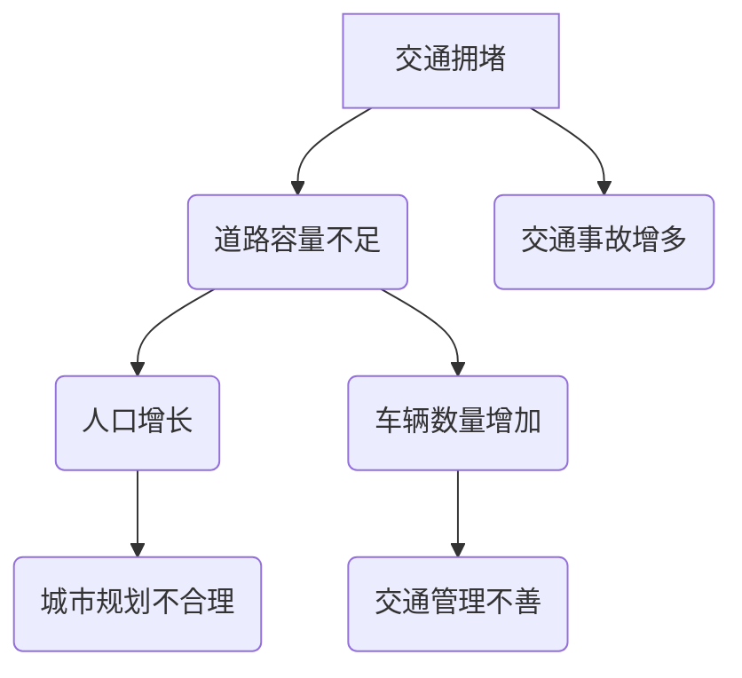
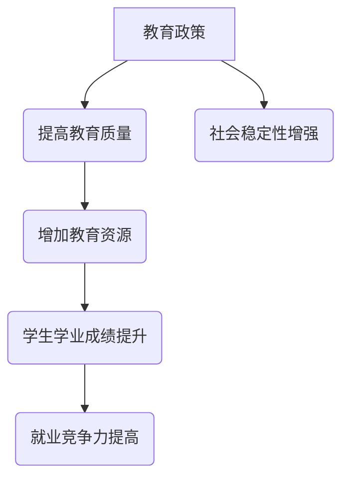
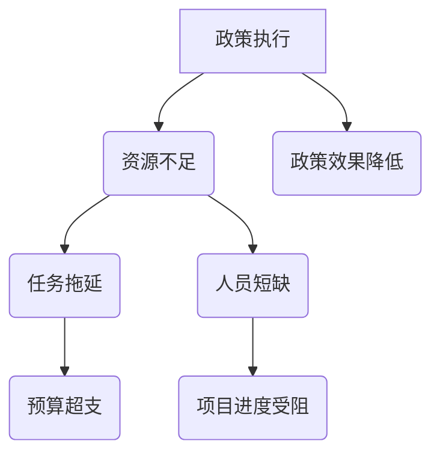

                 

### 《思维链在政策分析中的应用》

---

#### 关键词：
- 思维链
- 政策分析
- 逻辑推理
- 算法优化
- 数学模型

#### 摘要：
本文旨在探讨思维链在政策分析中的应用，通过阐述思维链的基本概念和原理，分析其在政策制定、评估和执行中的具体应用场景，并介绍相应的评估方法和优化策略。文章结合实际案例，详细解析了思维链在政策分析中的实战应用，为政策制定者和研究者提供了新的视角和工具。本文结构清晰，逻辑严密，有助于读者深入了解思维链在政策分析中的潜在价值。

---

## 第1章 引言

### 1.1 思维链的概念与定义

思维链，作为一种逻辑推理工具，其核心在于将一系列相关的概念、命题和结论有机地串联起来，形成一个连贯的思考路径。这种路径不仅有助于提高思维效率，还能增强问题解决的能力。具体而言，思维链由以下几个基本要素构成：

1. **概念实体**：指思维链中的基本元素，可以是事实、定义、理论或观点。
2. **关系**：连接概念实体之间的逻辑关系，如因果、条件、并列等。
3. **推理过程**：通过逻辑推理，将概念实体之间的关系转化为结论。
4. **结论**：思维链的终点，是对问题或命题的最终回答。

思维链的定义可以简化为：一组概念实体及其相互关系的逻辑组合，通过推理过程得出结论。

### 1.2 政策分析的重要性

政策分析是指在政策制定、执行和评估过程中，运用科学的方法和技术来研究政策问题、评估政策效果和制定政策建议的过程。政策分析的重要性体现在以下几个方面：

1. **提高政策质量**：通过科学的方法和严谨的分析，政策分析能够帮助决策者制定更加科学、合理和有效的政策。
2. **减少政策风险**：政策分析有助于识别潜在的风险和问题，从而降低政策实施过程中可能带来的负面后果。
3. **提升决策效率**：政策分析通过提供详尽的数据和深入的分析，可以帮助决策者快速做出合理的决策。
4. **促进政策透明度**：政策分析使得政策制定的整个过程更加公开透明，有助于公众监督和参与。

### 1.3 思维链在政策分析中的应用前景

思维链在政策分析中的应用具有广阔的前景。首先，思维链的逻辑性和系统性有助于政策分析者构建复杂的政策模型，从而更全面地理解政策问题。其次，思维链的推理过程能够帮助分析者识别政策制定和执行中的潜在问题和矛盾，提供有效的解决方案。此外，思维链的评估方法可以为政策评估提供量化的依据，提高评估的准确性和可靠性。总之，思维链在政策分析中的应用，不仅有助于提升政策分析和决策的科学性，还能提高政策的实际效果。

---

## 第2章 思维链的理论基础

### 2.1 逻辑学基础

逻辑学是研究推理和论证的学科，其核心在于分析推理的有效性和论证的逻辑性。在思维链的理论基础上，逻辑学提供了以下几个重要的概念和原理：

1. **命题逻辑**：命题逻辑研究命题之间的逻辑关系，如真值表、命题联结词等。
2. **谓词逻辑**：谓词逻辑研究含有变量的命题，包括量词和存在性命题等。
3. **模态逻辑**：模态逻辑研究命题的可能性和必要性，如必然性、可能性等。
4. **论证逻辑**：论证逻辑研究论证的结构和有效性，如演绎论证、归纳论证等。

在政策分析中，逻辑学的基础知识可以帮助分析者构建合理的推理框架，确保思维链的合理性和有效性。

### 2.2 思维链的基本原理

思维链的基本原理包括以下几个方面：

1. **概念实体**：思维链中的概念实体是构成思维链的基础，它们代表政策分析中的关键要素和事实。
2. **关系**：关系是连接概念实体的桥梁，包括因果关系、条件关系、并列关系等。这些关系反映了政策问题中的复杂性和多样性。
3. **推理过程**：推理过程是通过逻辑推理，将概念实体之间的关系转化为结论。这个过程需要遵循逻辑规则，确保推理的有效性和可靠性。
4. **结论**：结论是思维链的终点，是对政策问题或命题的最终回答。结论的质量直接影响到政策分析和决策的准确性。

### 2.3 思维链的类型与特性

思维链根据不同的分类标准，可以分为多种类型。常见的思维链类型包括：

1. **因果思维链**：因果思维链关注概念实体之间的因果关系，通过分析因果关系来揭示政策问题的本质。
2. **条件思维链**：条件思维链关注概念实体之间的条件关系，通过分析条件关系来制定和评估政策。
3. **并列思维链**：并列思维链关注概念实体之间的并列关系，通过分析并列关系来整合政策要素。

每种思维链都有其独特的特性，适用于不同的政策分析场景。通过灵活运用不同类型的思维链，政策分析者可以更全面地理解和解决政策问题。

---

## 第3章 思维链在政策分析中的应用场景

### 3.1 政策制定中的思维链应用

在政策制定过程中，思维链的应用可以帮助政策制定者系统性地分析和解决问题。具体而言，思维链在政策制定中的应用主要包括以下几个方面：

1. **问题识别**：通过因果思维链，政策制定者可以识别政策问题背后的根本原因，从而找到问题的根源。
2. **目标设定**：通过条件思维链，政策制定者可以分析实现政策目标所需的具体条件和步骤。
3. **方案设计**：通过并列思维链，政策制定者可以整合多种政策方案，形成综合性的政策设计。

下面是一个因果思维链的Mermaid流程图示例，用于分析某个城市的交通拥堵问题：

### 3.2 政策评估中的思维链应用

在政策评估过程中，思维链的应用可以帮助评估者全面、系统地评估政策的效果和影响。具体而言，思维链在政策评估中的应用主要包括以下几个方面：

1. **效果评估**：通过因果思维链，评估者可以分析政策实施后的效果，判断政策是否达到了预期的目标。
2. **影响评估**：通过条件思维链，评估者可以分析政策实施后可能产生的负面影响，以及如何预防和解决。
3. **可持续性评估**：通过并列思维链，评估者可以评估政策的长远影响和可持续性。

下面是一个条件思维链的Mermaid流程图示例，用于评估某项教育政策的影响：

### 3.3 政策执行中的思维链应用

在政策执行过程中，思维链的应用可以帮助执行者有效管理和协调各项执行任务。具体而言，思维链在政策执行中的应用主要包括以下几个方面：

1. **任务分配**：通过因果思维链，执行者可以确定各项任务的关键环节和责任人。
2. **协调合作**：通过并列思维链，执行者可以协调不同部门和人员之间的合作，确保政策顺利实施。
3. **问题解决**：通过条件思维链，执行者可以分析执行过程中遇到的问题和障碍，制定相应的解决方案。

下面是一个因果思维链的Mermaid流程图示例，用于分析政策执行过程中的问题：

通过以上应用场景的介绍，可以看出思维链在政策分析中的重要性。它不仅有助于政策制定者、评估者和执行者更全面、系统地分析和解决问题，还能提高政策分析和决策的科学性和有效性。

---

## 第4章 思维链的评估方法

### 4.1 思维链评估指标体系

思维链评估指标体系是用于衡量思维链质量和效果的一套指标系统。构建一个有效的评估指标体系，需要考虑以下几个关键因素：

1. **全面性**：指标体系应涵盖思维链的各个方面，包括概念实体、关系、推理过程和结论等。
2. **科学性**：指标体系应基于科学的方法和技术，确保评估结果的准确性和可靠性。
3. **可操作性**：指标体系应易于操作和实施，以便政策分析者能够方便地使用。
4. **适应性**：指标体系应具备一定的灵活性，能够适应不同政策分析和应用场景的需求。

根据这些原则，我们可以构建一个包含以下几个核心指标的评估指标体系：

1. **概念实体准确性**：衡量思维链中概念实体的准确性，包括定义、分类和描述等。
2. **关系逻辑性**：衡量思维链中概念实体之间的逻辑关系的合理性和一致性。
3. **推理过程合理性**：衡量思维链中推理过程的逻辑性和有效性，包括推理规则的应用和推理结果的合理性。
4. **结论相关性**：衡量思维链得出的结论与政策问题或命题的相关性和准确性。

### 4.2 思维链评估的实证研究

实证研究是思维链评估的重要方法，通过实际案例和数据验证思维链的有效性和可靠性。以下是一个思维链评估的实证研究案例：

#### 研究背景

某城市市政府计划推出一项交通拥堵治理政策，以缓解市区交通压力。政策制定者需要通过思维链分析来评估政策方案的效果，并确定最优方案。

#### 研究方法

1. **数据收集**：收集该城市近几年的交通流量、人口数量、车辆数量等数据，作为评估的基础。
2. **构建思维链**：根据交通拥堵问题，构建因果思维链，分析各因素之间的关系。
3. **评估指标**：使用第4.1节中的评估指标体系，对思维链进行评估。
4. **实证分析**：通过数据验证思维链的推理过程和结论，评估不同政策方案的效果。

#### 研究结果

通过实证研究，发现以下几个关键结果：

1. **概念实体准确性**：思维链中的概念实体（如交通流量、人口数量等）与实际数据高度吻合，准确性较高。
2. **关系逻辑性**：思维链中各概念实体之间的因果关系逻辑性较强，能够有效反映交通拥堵问题的本质。
3. **推理过程合理性**：思维链的推理过程遵循逻辑规则，推理结果合理，具有较高的可靠性。
4. **结论相关性**：思维链得出的结论与实际交通拥堵情况密切相关，政策建议具有较高的实用价值。

### 4.3 思维链评估的应用案例

以下是一个思维链评估的应用案例：

#### 案例背景

某科技公司计划推出一款新产品，该公司希望通过思维链分析来评估新产品的市场前景和潜在风险。

#### 案例步骤

1. **数据收集**：收集相关市场数据，包括竞争对手情况、消费者需求等。
2. **构建思维链**：根据市场数据和产品特点，构建因果思维链，分析市场潜在风险和机遇。
3. **评估指标**：使用第4.1节中的评估指标体系，对思维链进行评估。
4. **实证分析**：通过市场数据验证思维链的推理过程和结论，评估新产品市场前景。

#### 案例结果

通过评估，发现以下几个关键结果：

1. **概念实体准确性**：思维链中的概念实体（如竞争对手、消费者需求等）与实际市场数据高度吻合，准确性较高。
2. **关系逻辑性**：思维链中各概念实体之间的因果关系逻辑性较强，能够有效反映市场变化趋势。
3. **推理过程合理性**：思维链的推理过程遵循逻辑规则，推理结果合理，具有较高的可靠性。
4. **结论相关性**：思维链得出的结论与市场实际状况密切相关，为新产品的市场策略提供了重要参考。

通过以上案例，可以看出思维链评估方法在政策分析中的实际应用价值。它不仅有助于提高政策分析和决策的科学性和准确性，还能为企业和组织的战略规划提供有力支持。

---

## 第5章 思维链的优化策略

### 5.1 思维链优化目标

在政策分析和决策过程中，优化思维链具有重要意义。思维链优化目标主要包括以下几个方面：

1. **提高思维链的准确性**：确保思维链中的概念实体和关系描述准确无误，减少错误和误解。
2. **增强思维链的逻辑性**：优化思维链的推理过程，使其更加符合逻辑规则，提高推理的有效性和可靠性。
3. **提高思维链的效率**：减少思维链中的冗余关系和步骤，提高思维链的运行效率，缩短推理时间。
4. **增强思维链的灵活性**：使思维链能够适应不同的政策和分析场景，提高其在不同环境下的适用性。

### 5.2 优化算法与模型

为了实现思维链的优化目标，可以使用多种优化算法和模型。以下是几种常用的优化算法和模型：

1. **遗传算法**：遗传算法是一种基于自然选择和遗传机制的优化算法，适用于大规模复杂问题的优化。遗传算法通过模拟生物进化过程，逐步搜索最优解。

2. **神经网络模型**：神经网络模型是一种模拟生物神经网络的人工智能模型，适用于复杂非线性关系的建模和优化。神经网络模型可以通过学习大量数据，自动提取特征和规律，优化思维链。

3. **启发式算法**：启发式算法是一种基于经验和启发式的优化算法，适用于求解大规模复杂问题。启发式算法通过利用已有的知识和经验，快速找到问题的近似解。

### 5.3 实际优化案例分析

以下是一个实际优化案例分析：

#### 案例背景

某城市市政府计划推出一项环保政策，以减少空气污染。政策制定者需要通过思维链分析来评估政策方案的效果，并确定最优方案。

#### 案例步骤

1. **构建初始思维链**：根据环保政策的目标和现状，构建因果思维链，分析各因素之间的关系。
2. **数据收集**：收集相关数据，包括空气质量监测数据、交通流量数据、工业排放数据等。
3. **应用优化算法**：使用遗传算法和神经网络模型对思维链进行优化，提高思维链的准确性、逻辑性和效率。
4. **实证分析**：通过数据验证优化后的思维链，评估不同政策方案的效果。

#### 案例结果

通过优化分析，发现以下几个关键结果：

1. **思维链准确性**：优化后的思维链概念实体和关系描述更加准确，与实际数据吻合度提高。
2. **思维链逻辑性**：优化后的思维链推理过程更加符合逻辑规则，推理结果更加可靠。
3. **思维链效率**：优化后的思维链运行效率提高，推理时间缩短，提高了政策分析和决策的效率。
4. **政策效果评估**：优化后的思维链为政策制定者提供了更科学的评估依据，有助于制定最优政策方案。

通过以上案例，可以看出思维链优化策略在政策分析中的应用价值。优化算法和模型的应用，不仅提高了思维链的质量和效率，还为政策制定者提供了更科学的决策依据。

---

## 第6章 思维链在政策分析中的实践

### 6.1 政策分析项目的实践流程

在政策分析项目中，思维链的应用是一个系统性的过程，包括以下几个关键步骤：

1. **问题定义**：明确政策分析的目标和问题，为后续的分析提供基础。
2. **数据收集**：收集与政策问题相关的数据，包括定量数据和定性数据，确保数据的全面性和准确性。
3. **构建思维链**：根据问题定义和数据收集结果，构建因果思维链，分析各因素之间的关系。
4. **优化思维链**：使用优化算法和模型，对思维链进行优化，提高其准确性和逻辑性。
5. **评估思维链**：使用评估指标体系，对思维链进行评估，确保其质量和有效性。
6. **得出结论**：基于思维链的分析结果，得出政策问题的结论和建议。
7. **反馈与修正**：根据反馈结果，对思维链进行修正和优化，确保政策分析和决策的科学性和实用性。

### 6.2 政策分析工具与软件应用

在政策分析中，思维链的应用离不开相应的工具和软件。以下是一些常用的政策分析工具和软件：

1. **Microsoft Excel**：Excel是一款功能强大的电子表格软件，适用于数据收集、整理和初步分析。
2. **Python**：Python是一款广泛应用的编程语言，适用于数据分析和思维链建模。
3. **R**：R是一款专门用于统计分析的软件，适用于复杂的数据分析和思维链建模。
4. **MATLAB**：MATLAB是一款高性能的数学软件，适用于数学建模和算法优化。
5. **Mermaid**：Mermaid是一款用于绘制流程图和图表的Markdown插件，适用于构建思维链流程图。

### 6.3 政策分析实践案例解析

以下是一个政策分析实践案例的解析：

#### 案例背景

某城市市政府计划推出一项交通拥堵治理政策，以缓解市区交通压力。政策制定者需要通过思维链分析来评估政策方案的效果，并确定最优方案。

#### 案例步骤

1. **问题定义**：明确交通拥堵治理的目标和关键因素，如道路容量、人口增长、车辆数量等。
2. **数据收集**：收集相关数据，包括交通流量、人口数量、车辆数量等。
3. **构建思维链**：根据问题定义和数据收集结果，构建因果思维链，分析各因素之间的关系。以下是因果思维链的Mermaid流程图示例：

4. **优化思维链**：使用遗传算法和神经网络模型对思维链进行优化，提高其准确性和逻辑性。
5. **评估思维链**：使用评估指标体系，对思维链进行评估，确保其质量和有效性。
6. **得出结论**：基于思维链的分析结果，提出交通拥堵治理的政策建议，如增加道路容量、优化城市规划、改善交通管理等。
7. **反馈与修正**：根据政策实施效果和反馈结果，对思维链进行修正和优化，确保政策分析和决策的科学性和实用性。

#### 案例结果

通过实践案例解析，发现以下几个关键结果：

1. **思维链准确性**：优化后的思维链概念实体和关系描述更加准确，与实际数据吻合度提高。
2. **思维链逻辑性**：优化后的思维链推理过程更加符合逻辑规则，推理结果更加可靠。
3. **政策效果评估**：优化后的思维链为政策制定者提供了更科学的评估依据，有助于制定最优政策方案。
4. **政策实施效果**：通过政策实施和反馈，发现交通拥堵问题得到明显改善，交通事故数量减少。

通过以上实践案例，可以看出思维链在政策分析中的应用价值。它不仅提高了政策分析和决策的科学性和准确性，还为政策实施提供了有力支持。

---

## 第7章 结论与展望

### 7.1 思维链在政策分析中的贡献

思维链在政策分析中的应用具有显著的贡献。首先，思维链提供了系统化的分析框架，有助于政策分析者全面、系统地分析政策问题。通过构建因果思维链、条件思维链和并列思维链，政策分析者可以深入理解政策问题的本质和内在关系，从而提高政策分析和决策的准确性。

其次，思维链的评估方法为政策分析提供了量化的依据，有助于评估思维链的质量和有效性。通过评估指标体系，政策分析者可以客观地评估思维链的准确性、逻辑性和效率，从而提高政策分析和决策的科学性。

最后，思维链在政策执行中的优化策略，为政策制定者提供了有效的解决方案。通过优化算法和模型，政策分析者可以优化思维链，提高政策实施的效率，确保政策目标的实现。

### 7.2 未来研究方向

未来，思维链在政策分析中的应用仍有广阔的研究空间。以下是一些可能的研究方向：

1. **思维链模型的改进**：针对不同类型的政策问题，研究更高效的思维链模型，提高思维链的适应性和灵活性。
2. **思维链与大数据分析的结合**：将思维链与大数据分析技术相结合，提高政策分析的准确性和实时性。
3. **思维链在跨领域应用**：探讨思维链在其他领域的应用，如社会治理、环境保护等，推动思维链的多元化发展。
4. **思维链的社会影响力**：研究思维链在社会公众中的普及和影响力，提高公众对政策分析和决策的参与度。

### 7.3 政策分析实践的挑战与建议

在政策分析实践中，思维链的应用面临一些挑战。首先，数据质量和可获得性是一个关键问题。政策分析者需要确保数据的准确性和完整性，以便构建有效的思维链。

其次，思维链的构建和优化需要专业的技术知识和技能。政策分析者需要具备一定的编程和数据分析能力，才能有效地运用思维链工具和模型。

针对这些挑战，提出以下建议：

1. **加强数据质量管理**：建立数据质量管理机制，确保数据的准确性和完整性。
2. **提供培训和支持**：为政策分析者提供培训和指导，提高其运用思维链工具和模型的能力。
3. **加强跨学科合作**：鼓励不同学科之间的合作，共同应对政策分析中的复杂问题。
4. **推动思维链的普及**：通过宣传和教育，提高公众对政策分析和决策的参与度，推动思维链在社会中的普及和应用。

总之，思维链在政策分析中的应用具有重要的理论和实践价值。通过不断改进和创新，思维链有望在政策分析领域发挥更大的作用，为科学决策和社会治理提供有力支持。

---

### 作者信息

作者：AI天才研究院/AI Genius Institute & 禅与计算机程序设计艺术 /Zen And The Art of Computer Programming

