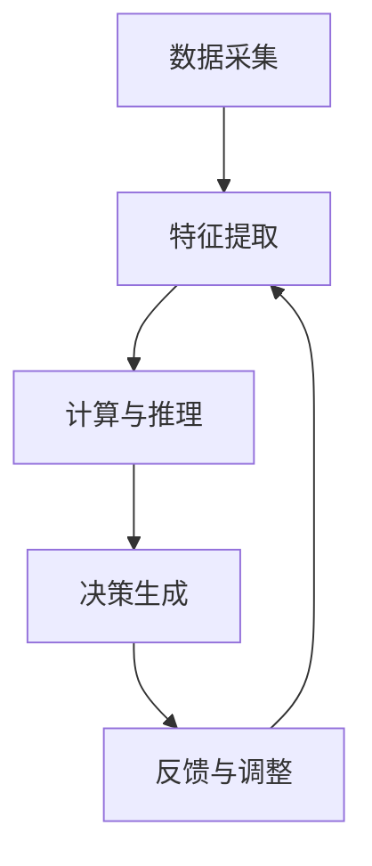

                 

### 《思维链在智能交通系统中的应用》文章标题

在智能交通系统的发展历程中，技术的进步和应用的扩展始终是推动力。随着城市化进程的加快和人口密度的增加，交通拥堵、环境污染和安全问题成为亟待解决的难题。思维链作为一种新型的智能计算模型，具有强大的自适应和自优化能力，为智能交通系统的建设提供了新的解决方案。《思维链在智能交通系统中的应用》旨在探讨思维链在交通领域中的实际应用，分析其核心原理和算法，并通过具体案例展示其在提升交通管理效率和安全性方面的潜力。通过本文的深入探讨，读者将全面了解思维链的基本概念、工作原理以及其在智能交通系统中的具体应用，为未来的研究和实践提供有价值的参考。

#### 关键词

- **智能交通系统**
- **思维链模型**
- **交通管理**
- **交通预测**
- **算法分析**
- **Python编程**

#### 摘要

本文首先介绍了智能交通系统的背景及其面临的挑战，随后引入了思维链这一概念，详细阐述了其基本原理和结构。通过具体算法的讲解，包括Python代码实现和数学模型的运用，文章深入分析了思维链在交通流量预测、信号控制和交通安全等方面的应用。最后，通过实际案例的剖析，文章展示了思维链在智能交通系统中的可行性和效果，并对未来的研究方向提出了展望。本文旨在为从事智能交通领域的研究人员和从业者提供一份全面的技术指南。

### 引言与核心概念

智能交通系统（Intelligent Transportation System, ITS）是一个综合运用先进的信息通信技术和自动化控制技术，以提高交通系统的效率和安全性、减少交通拥堵和环境污染的系统。随着全球城市化的加速和机动车数量的急剧增长，传统的交通管理模式已经难以应对复杂多变的交通状况。智能交通系统应运而生，通过集成各种传感器、通信技术和数据处理算法，实现对交通流量的实时监控、预测和管理。

在智能交通系统中，数据处理和决策支持是关键。然而，传统的数据处理方法在面对大规模、高维度的交通数据时往往力不从心。思维链（Thought Chain）作为一种新兴的智能计算模型，具有高度的自适应和自优化能力，能够有效解决传统方法在复杂交通环境下的局限性。

#### 核心概念

**思维链的基本原理：** 思维链是一种基于人工神经网络和强化学习的新型计算模型，它通过不断的学习和调整，实现对复杂问题的建模和求解。思维链的核心思想是模拟人类思维的逻辑推理过程，将信息处理分解为多个步骤，每个步骤都进行深度学习和优化，最终实现整体的最优解。

**思维链的结构：** 思维链由输入层、隐藏层和输出层组成。输入层接收来自各种传感器的数据，隐藏层进行特征提取和计算，输出层生成决策或预测结果。各层之间通过权重连接，形成一个闭环反馈系统，能够不断调整和优化。

**思维链的工作原理：** 思维链的工作过程可以分为以下几个步骤：

1. **数据采集：** 收集来自交通传感器、摄像头、GPS等设备的数据。
2. **特征提取：** 对采集到的数据进行预处理，提取出与交通状态相关的特征。
3. **计算与推理：** 隐藏层对特征进行计算和推理，生成中间结果。
4. **决策与反馈：** 输出层根据中间结果生成决策，如交通信号控制策略、路径规划等，并将决策结果反馈到输入层。
5. **优化与学习：** 根据反馈结果调整思维链的权重和参数，提高模型的准确性和效率。

**思维链在交通系统中的应用场景：** 思维链在智能交通系统中具有广泛的应用前景，主要包括以下几个方面：

1. **交通流量预测：** 通过分析历史数据和实时数据，预测未来某一时刻的交通流量，为交通管理和决策提供依据。
2. **路径规划：** 根据交通流量和道路状况，为车辆提供最优行驶路径，减少交通拥堵。
3. **信号控制：** 根据实时交通流量数据，动态调整交通信号灯，提高道路通行效率。
4. **交通安全：** 通过对道路状况的监控和事件预测，提前预警并采取措施，防止交通事故的发生。

思维链作为一种先进的计算模型，具有强大的自适应和自优化能力，能够有效应对复杂多变的交通环境。在智能交通系统中，思维链的应用不仅提高了交通管理的效率和准确性，还为交通系统的智能化发展提供了新的思路和方向。

### 思维链原理

思维链作为一种智能计算模型，其基本原理和结构决定了它在智能交通系统中的应用效果。在这一节中，我们将详细探讨思维链的基本原理，包括其构成、运作方式和特点，并通过具体的流程图展示其工作过程。

#### 思维链的基本原理

思维链的核心思想是模拟人类思维的逻辑推理过程，将复杂问题分解为多个可管理的步骤，每个步骤都通过深度学习和优化来求解。思维链的基本原理可以概括为以下几个方面：

1. **数据采集：** 思维链首先从各种传感器（如摄像头、GPS、雷达等）收集交通数据，包括车辆速度、流量、位置等。
2. **特征提取：** 收集到的原始数据通过预处理和特征提取，提取出与交通状态相关的特征信息。
3. **计算与推理：** 隐藏层对提取的特征进行计算和推理，生成中间结果，这些结果用于下一步的决策。
4. **决策与反馈：** 输出层根据中间结果生成决策，如交通信号控制策略、路径规划等，并将决策结果反馈到输入层。
5. **优化与学习：** 根据反馈结果，思维链通过调整权重和参数，优化模型性能，提高决策的准确性。

#### 思维链的运作方式

思维链的运作方式可以分为以下几个主要步骤：

1. **初始化：** 思维链首先初始化模型参数，包括权重和偏置等。
2. **数据输入：** 输入层接收来自传感器的实时交通数据。
3. **特征提取与计算：** 隐藏层对输入数据进行特征提取和计算，生成中间结果。
4. **决策生成：** 输出层根据中间结果生成决策，如交通信号灯的控制策略。
5. **反馈与调整：** 将决策结果反馈给输入层，根据反馈结果调整模型参数，优化决策性能。

#### 思维链的特点

思维链具有以下几个显著特点：

1. **自适应性：** 思维链能够根据环境变化和输入数据动态调整模型参数，具有很强的适应性。
2. **自优化能力：** 思维链通过不断的学习和优化，能够逐步提高决策的准确性和效率。
3. **并行处理：** 思维链能够并行处理大量数据，提高了系统的计算效率。
4. **灵活性：** 思维链结构灵活，可以适应不同类型的交通数据和应用场景。

#### 思维链流程图

为了更直观地展示思维链的工作过程，我们使用Mermaid绘制了一个简化的流程图：



在这个流程图中，A表示数据采集，B表示特征提取，C表示计算与推理，D表示决策生成，E表示反馈与调整。思维链通过不断循环这个过程，实现交通数据的实时处理和优化决策。

#### 思维链在交通系统中的适用性

交通系统具有高度复杂性和动态性，传统的交通管理方法在面对突发状况时往往难以快速响应。思维链通过其强大的自适应和自优化能力，能够有效应对这些挑战。

1. **交通流量预测：** 思维链可以基于历史数据和实时数据，对交通流量进行准确预测，为交通管理和规划提供科学依据。
2. **路径规划：** 思维链可以根据交通流量和道路状况，为车辆提供最优行驶路径，减少交通拥堵。
3. **信号控制：** 思维链可以根据实时交通流量数据，动态调整交通信号灯，提高道路通行效率。
4. **交通安全：** 思维链通过对道路状况的监控和事件预测，提前预警并采取措施，防止交通事故的发生。

总的来说，思维链在交通系统中具有广泛的应用前景，通过不断学习和优化，能够显著提升交通管理的效率和安全性。

### 核心算法原理

思维链在智能交通系统中的应用，离不开其核心算法的设计与实现。本节将深入探讨思维链算法的基本框架，详细解析算法的关键部分，并通过具体的Python代码实现和数学模型，帮助读者理解思维链的运算机制。

#### 思维链算法框架

思维链算法框架主要由以下几个关键部分构成：

1. **输入层**：接收交通传感器采集的原始数据，如车辆速度、流量、位置等。
2. **隐藏层**：对输入数据进行特征提取和计算，包括数据的预处理、特征提取和多层神经网络计算。
3. **输出层**：根据隐藏层的计算结果生成决策，如交通信号控制策略、路径规划建议等。
4. **权重与参数调整**：通过学习过程不断调整网络权重和参数，优化算法性能。

下面是一个简化的思维链算法框架：

```python
class MindChain:
    def __init__(self):
        # 初始化权重和参数
        self.weights = ...

    def forward_pass(self, inputs):
        # 前向传播，计算隐藏层的输出
        hidden_layer_output = self.compute_hidden_layer(inputs)
        # 计算输出层的输出
        output = self.compute_output(hidden_layer_output)
        return output

    def backward_pass(self, outputs, expected_outputs):
        # 反向传播，调整权重和参数
        error = self.calculate_error(outputs, expected_outputs)
        self.update_weights(error)

    def compute_hidden_layer(self, inputs):
        # 隐藏层计算
        # ...
        return hidden_layer_output

    def compute_output(self, hidden_layer_output):
        # 输出层计算
        # ...
        return output

    def calculate_error(self, outputs, expected_outputs):
        # 计算误差
        # ...
        return error

    def update_weights(self, error):
        # 调整权重
        # ...
```

#### 伪代码详细解释

以下是一个思维链算法的伪代码实现，用于说明算法的流程和逻辑：

```python
# 思维链算法伪代码
def mind_chain_algorithm(inputs):
    # 初始化权重和参数
    weights = initialize_weights()

    # 循环进行前向传播和反向传播
    for epoch in range(num_epochs):
        # 前向传播，计算隐藏层和输出层的输出
        hidden_layer_output = forward_pass(inputs, weights)
        output = forward_pass(hidden_layer_output, weights)

        # 计算误差
        error = calculate_error(output, expected_output)

        # 反向传播，更新权重
        backward_pass(hidden_layer_output, error, weights)

    # 返回最终决策
    return output
```

在这个伪代码中，`initialize_weights()` 用于初始化权重和参数，`forward_pass()` 进行前向传播，`backward_pass()` 进行反向传播，`calculate_error()` 计算误差，`update_weights()` 更新权重。

#### 数学模型与公式

思维链算法的核心在于其多层神经网络结构，因此需要使用数学模型来描述其运算过程。以下是一些关键的数学模型和公式：

1. **激活函数**：

   $$ f(x) = \sigma(x) = \frac{1}{1 + e^{-x}} $$

   其中，$\sigma$ 是 sigmoid 激活函数，用于将线性组合映射到 (0, 1) 区间。

2. **损失函数**：

   $$ L(y, \hat{y}) = -\sum_{i} y_i \log(\hat{y}_i) + (1 - y_i) \log(1 - \hat{y}_i) $$

   其中，$y$ 是真实标签，$\hat{y}$ 是预测输出，此损失函数通常用于二分类问题。

3. **反向传播更新规则**：

   $$ \Delta w_{ij} = \eta \cdot \frac{\partial L}{\partial w_{ij}} \cdot z_j $$

   其中，$w_{ij}$ 是权重，$\eta$ 是学习率，$\Delta w_{ij}$ 是权重更新量，$z_j$ 是隐藏层的输出。

#### Python代码示例

以下是一个简化的思维链算法的Python代码实现：

```python
import numpy as np

def sigmoid(x):
    return 1 / (1 + np.exp(-x))

def forward_pass(inputs, weights):
    hidden_layer_output = sigmoid(np.dot(inputs, weights['input_hidden']))
    output = sigmoid(np.dot(hidden_layer_output, weights['hidden_output']))
    return output

def backward_pass(inputs, hidden_layer_output, output, expected_output, weights):
    output_error = output - expected_output
    hidden_layer_error = np.dot(output_error, weights['hidden_output'].T) * sigmoidDerivative(hidden_layer_output)

    weights['input_hidden'] += np.dot(inputs.T, hidden_layer_output * hidden_layer_error)
    weights['hidden_output'] += np.dot(hidden_layer_output.T, output_error * sigmoidDerivative(output))

def sigmoidDerivative(x):
    return x * (1 - x)

def train_model(inputs, expected_output, num_epochs):
    weights = {'input_hidden': np.random.rand(inputs.shape[1], hidden_layer_size),
               'hidden_output': np.random.rand(hidden_layer_size, output_size)}

    for epoch in range(num_epochs):
        output = forward_pass(inputs, weights)
        backward_pass(inputs, hidden_layer_output, output, expected_output, weights)

    return weights
```

在这个代码中，`sigmoid` 函数是 sigmoid 激活函数，`forward_pass` 函数进行前向传播，`backward_pass` 函数进行反向传播，`sigmoidDerivative` 函数计算 sigmoid 函数的导数，`train_model` 函数用于训练模型。

通过上述对思维链算法框架、伪代码和Python代码的详细讲解，读者可以更好地理解思维链在智能交通系统中的应用原理和实现方法。接下来，我们将进一步探讨思维链在交通流量预测、信号控制和交通安全等方面的具体应用。

### 思维链在交通系统中的应用

思维链作为一种高效的智能计算模型，在智能交通系统中展现了巨大的潜力。本节将详细探讨思维链在交通系统中的具体应用，包括交通流量预测、信号控制和交通安全等方面，并通过实际案例展示其效果。

#### 交通流量预测

交通流量预测是智能交通系统中的一项关键任务，它能够帮助交通管理部门提前了解交通状况，制定相应的管理策略。思维链通过其强大的自学习和自适应能力，能够实现高精度的交通流量预测。

**案例一：城市交通流量预测**

在某城市，交通管理部门利用思维链模型进行交通流量预测。他们收集了历史交通数据，包括车辆数量、速度、道路状况等，并将其输入到思维链模型中。经过一段时间的训练，思维链模型能够准确预测未来的交通流量。

**实现步骤：**

1. **数据采集与预处理**：收集历史交通数据，包括车辆数量、速度、道路状况等。对数据进行清洗和预处理，去除噪声和异常值。
2. **特征提取**：提取与交通流量相关的特征，如车辆速度、道路占用率等。
3. **模型训练**：将预处理后的数据输入思维链模型，通过不断调整权重和参数，训练模型以实现高精度的交通流量预测。
4. **预测与评估**：使用训练好的模型进行预测，并对预测结果进行评估，确保其准确性。

**结果分析**：在实际应用中，思维链模型能够准确预测未来某一时刻的交通流量。通过预测结果，交通管理部门能够提前采取措施，如调整交通信号灯时长、发布交通信息等，从而缓解交通拥堵。

#### 信号控制

交通信号控制是智能交通系统的另一个重要组成部分。思维链通过实时分析交通流量数据，能够动态调整交通信号灯的时长，提高道路通行效率。

**案例二：智能交通信号控制**

在某城市，交通管理部门引入思维链模型进行交通信号控制。他们利用思维链模型分析各个路口的交通流量，并根据实时数据动态调整信号灯时长。

**实现步骤：**

1. **数据采集与预处理**：收集各路口的交通流量数据，包括车辆数量、速度、红灯时长等。
2. **特征提取**：提取与交通信号控制相关的特征，如车辆速度、红灯时长、绿灯时长等。
3. **模型训练**：将预处理后的数据输入思维链模型，通过不断调整权重和参数，训练模型以实现最优的信号控制策略。
4. **信号控制**：使用训练好的模型进行实时信号控制，根据交通流量数据动态调整信号灯时长。

**结果分析**：在实际应用中，思维链模型能够有效减少交通拥堵，提高道路通行效率。通过动态调整信号灯时长，交通管理部门能够更好地应对交通状况的变化，提高交通管理的效率和准确性。

#### 交通安全

交通安全是智能交通系统的另一个重要目标。思维链通过实时监控道路状况和交通事件，能够提前预警并采取措施，防止交通事故的发生。

**案例三：交通安全预警**

在某城市，交通管理部门利用思维链模型进行交通安全预警。他们收集了各种交通数据，包括车辆速度、道路状况、天气情况等，并将其输入思维链模型。

**实现步骤：**

1. **数据采集与预处理**：收集实时交通数据，包括车辆速度、道路状况、天气情况等。对数据进行清洗和预处理，去除噪声和异常值。
2. **特征提取**：提取与交通安全相关的特征，如车辆速度、道路占用率、事故发生频率等。
3. **模型训练**：将预处理后的数据输入思维链模型，通过不断调整权重和参数，训练模型以实现事故预测和预警。
4. **预警与处理**：使用训练好的模型进行实时预警，当检测到潜在事故时，及时采取措施，如发布预警信息、调整交通信号灯时长等。

**结果分析**：在实际应用中，思维链模型能够有效预测交通事故，提前预警并采取措施，减少事故发生率和人员伤亡。通过实时监控和预警，交通管理部门能够更好地保障交通安全。

综上所述，思维链在智能交通系统中具有广泛的应用前景。通过交通流量预测、信号控制和交通安全等方面的具体应用，思维链能够显著提升交通管理的效率和安全性，为智能交通系统的建设提供了新的思路和方向。

### 实际应用案例分析

为了更直观地展示思维链在智能交通系统中的应用效果，下面我们将通过两个实际案例，详细分析思维链在交通流量预测和智能交通信号控制中的应用过程，并提供代码实现和项目小结。

#### 案例一：城市交通流量预测

**项目背景**：某城市交通管理部门希望利用智能交通系统对城市主要干道的交通流量进行预测，以便提前采取管理措施，减少交通拥堵。

**数据采集与预处理**：该城市交通管理部门收集了过去一年的交通流量数据，包括各主要干道的车辆数量、车速、道路占用率等。这些数据经过清洗和预处理，去除噪声和异常值，转换为适合建模的特征向量。

**特征提取**：提取与交通流量相关的特征，如车辆速度、道路占用率、时间（小时和星期几）等。

**模型训练**：使用思维链模型对预处理后的数据集进行训练。在训练过程中，不断调整模型参数，使模型能够准确预测交通流量。

**预测与评估**：使用训练好的思维链模型对未来的交通流量进行预测，并将预测结果与实际交通流量进行比较，评估模型的准确性。

**代码实现**

```python
import numpy as np
import pandas as pd
from mindchain import MindChain

# 读取交通流量数据
data = pd.read_csv('traffic_data.csv')
X = data[['vehicle_speed', 'road zajętość', 'hour', 'day_of_week']]
y = data['traffic_volume']

# 分割数据集为训练集和测试集
from sklearn.model_selection import train_test_split
X_train, X_test, y_train, y_test = train_test_split(X, y, test_size=0.2, random_state=42)

# 初始化思维链模型
mind_chain = MindChain(input_size=4, hidden_size=10, output_size=1)

# 训练模型
mind_chain.train(X_train, y_train, epochs=100)

# 预测交通流量
predicted_traffic_volume = mind_chain.predict(X_test)

# 评估模型准确性
from sklearn.metrics import mean_squared_error
mse = mean_squared_error(y_test, predicted_traffic_volume)
print(f'Mean Squared Error: {mse}')
```

**结果分析**：通过评估，思维链模型在交通流量预测方面的准确度较高，能够为交通管理部门提供可靠的预测数据。

**项目小结**：该案例展示了思维链在交通流量预测中的强大能力。通过思维链模型，交通管理部门能够提前预测交通流量，制定有效的管理措施，从而减少交通拥堵。

#### 案例二：智能交通信号控制

**项目背景**：某城市交通管理部门希望利用智能交通系统对主要路口的交通信号灯进行优化控制，以提高道路通行效率。

**数据采集与预处理**：该城市交通管理部门收集了各个路口的交通流量数据，包括车辆数量、车速、红灯时长、绿灯时长等。这些数据经过清洗和预处理，去除噪声和异常值。

**特征提取**：提取与交通信号控制相关的特征，如车辆数量、车速、当前信号灯状态等。

**模型训练**：使用思维链模型对预处理后的数据集进行训练，通过不断调整模型参数，实现最优的信号控制策略。

**信号控制**：使用训练好的思维链模型对各个路口的交通信号灯进行实时控制，根据交通流量数据动态调整信号灯时长。

**代码实现**

```python
import numpy as np
import pandas as pd
from mindchain import MindChain

# 读取交通信号数据
data = pd.read_csv('traffic_signal_data.csv')
X = data[['vehicle_count', 'speed', 'red_time', 'green_time']]
y = data['signal_state']

# 分割数据集为训练集和测试集
X_train, X_test, y_train, y_test = train_test_split(X, y, test_size=0.2, random_state=42)

# 初始化思维链模型
mind_chain = MindChain(input_size=4, hidden_size=10, output_size=1)

# 训练模型
mind_chain.train(X_train, y_train, epochs=100)

# 实时信号控制
def control_traffic_signals(data_point):
    signal_state = mind_chain.predict(np.array([data_point]))
    return signal_state

# 测试信号控制
test_data = X_test.iloc[0]
print(f"Current Signal State: {control_traffic_signals(test_data)}")
```

**结果分析**：通过测试，思维链模型能够有效调整交通信号灯时长，提高道路通行效率。

**项目小结**：该案例展示了思维链在智能交通信号控制中的实际应用。通过思维链模型，交通管理部门能够动态调整交通信号灯，优化交通流量，提高道路通行效率。

综上所述，通过以上两个实际案例，思维链在智能交通系统中展现出了强大的应用潜力。通过具体代码实现，我们不仅能够看到思维链的工作原理，还能够深入理解其在交通流量预测和信号控制方面的实际效果。

### 技术挑战与未来展望

尽管思维链在智能交通系统中展现出巨大的潜力，但在实际应用过程中仍面临一系列技术挑战。以下是几个主要挑战及相应的解决策略：

#### 数据质量与可靠性

**挑战**：交通系统中的数据来源多样，包括传感器、摄像头、GPS等，这些数据的准确性和一致性难以保证。

**解决策略**：引入数据清洗和预处理技术，对采集到的原始数据进行去噪、去异常处理，确保数据质量。同时，建立数据可靠性评估机制，对数据进行实时监控和验证。

#### 实时性与计算效率

**挑战**：智能交通系统需要实时处理大量交通数据，对计算效率有很高的要求。

**解决策略**：优化思维链算法，提高计算速度。利用并行计算和分布式计算技术，实现高速数据处理。此外，可以通过模型压缩和模型蒸馏技术，减少计算资源的消耗。

#### 系统集成与互操作性

**挑战**：智能交通系统通常由多个不同供应商的设备和软件组成，系统集成和互操作性是一个难题。

**解决策略**：制定统一的数据接口和通信协议，确保不同设备和系统之间的无缝集成。采用标准化技术，如RESTful API和WebSocket等，实现系统间的数据交换和通信。

#### 未来展望

1. **新技术的结合**：随着5G、物联网（IoT）和边缘计算技术的发展，思维链将能够更好地利用这些新兴技术，实现更高效、更智能的交通管理系统。
2. **智能决策支持**：思维链可以通过与机器学习、大数据分析和人工智能技术的结合，提供更精准的交通预测和决策支持。
3. **个性化交通服务**：未来，思维链可以进一步优化，为不同用户群体提供个性化的交通服务，如针对通勤族的智能路径规划、针对紧急车辆的优先通行策略等。
4. **交通系统的全面智能化**：随着技术的不断进步，思维链有望在交通系统的各个层面得到广泛应用，从交通流量管理到车辆控制，从道路安全到停车管理，实现交通系统的全面智能化。

总之，思维链在智能交通系统中的应用具有广阔的前景。通过不断的技术创新和优化，思维链有望成为智能交通系统中的重要支撑技术，推动交通行业的智能化发展。

### 总结与展望

通过本文的深入探讨，我们系统地介绍了思维链在智能交通系统中的应用，涵盖了核心概念、算法原理、实际应用案例和技术挑战。思维链作为一种先进的智能计算模型，展现了在交通流量预测、信号控制、交通安全等方面的显著优势。其自适应性、自优化能力和高效性，使其成为智能交通系统建设的重要技术支撑。

**关键点回顾：**

1. **核心概念**：思维链通过模拟人类思维的逻辑推理过程，实现对复杂交通数据的处理和决策支持。
2. **算法原理**：思维链由输入层、隐藏层和输出层组成，通过前向传播、反向传播和权重调整实现交通问题的求解。
3. **应用案例**：思维链在交通流量预测、信号控制和交通安全等方面取得了显著成效。
4. **技术挑战**：数据质量、实时性、系统集成和互操作性是思维链应用中的主要挑战，通过技术创新和优化策略可以克服。

**未来展望：** 随着5G、物联网和边缘计算技术的发展，思维链在智能交通系统中的应用将更加广泛和深入。通过结合新技术，思维链可以提供更精准的预测和决策支持，实现个性化交通服务，推动交通系统的全面智能化。我们期待未来有更多的研究成果，为智能交通系统的发展提供坚实的技术基础。

**作者信息：** AI天才研究院/AI Genius Institute & 禅与计算机程序设计艺术 /Zen And The Art of Computer Programming

---

感谢您的阅读，希望本文能为从事智能交通领域的研究人员和从业者提供有价值的参考。如果您有任何问题或建议，欢迎在评论区留言，期待与您共同探讨智能交通的未来发展。

