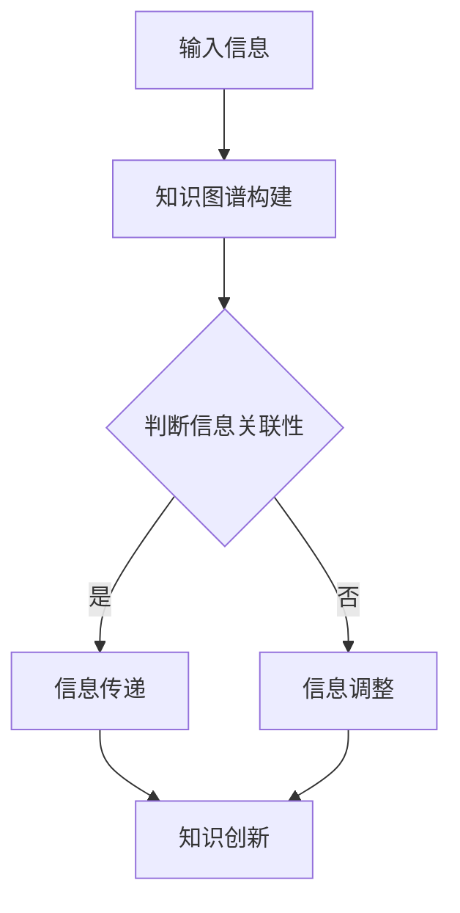
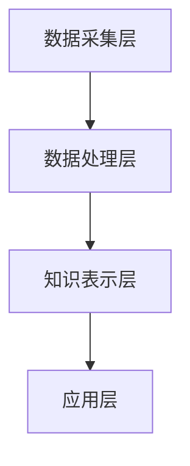

                 

# 思维链在智能制造中的应用

> 关键词：思维链、智能制造、知识图谱、人工智能、生产调度

> 摘要：本文探讨了思维链在智能制造中的应用，通过构建知识图谱和利用人工智能技术，实现信息之间的关联与传递，提高生产过程的智能化水平。文章详细介绍了思维链的原理、架构、核心算法及其在智能制造中的应用实例，为智能制造领域的研究和实践提供了有益的参考。

## 第1章：思维链在智能制造中的应用概述

### 1.1.1 什么是思维链？

**概念解释：**

思维链（Mind Chain）是一种通过构建知识图谱和利用人工智能技术，实现信息之间相互关联与传递的智能系统。它模仿人类大脑中思维活动的过程，通过多维度、多层次的信息处理，实现知识整合和创新。

**Mermaid 流程图：**



**核心概念与联系：**

思维链的核心概念包括输入信息、知识图谱构建、信息关联性判断、信息传递、信息调整和知识创新。这些概念之间相互关联，共同构成了思维链的工作流程。

- 输入信息：思维链的起点，来源于制造过程中的各种数据。
- 知识图谱构建：通过将输入信息转化为实体和关系，构建知识图谱。
- 信息关联性判断：判断不同信息之间的关联程度，为信息传递提供依据。
- 信息传递：在知识图谱中传递信息，实现信息的共享和利用。
- 信息调整：根据反馈对信息进行调整，优化信息传递的效果。
- 知识创新：通过多维度的信息整合，实现知识创新。

### 1.1.2 思维链在智能制造中的重要性

**原理讲解：**

思维链在智能制造中的应用，主要体现在以下几个方面：

- 提高生产过程的智能化水平，通过数据分析与预测，实现生产流程的优化。
- 促进供应链管理的智能化，通过信息关联与传递，实现供应链的实时监控与调整。
- 支持产品设计与创新，通过多维度的信息整合，实现产品设计的高效与创新。

**算法原理讲解：**

思维链的核心算法包括知识图谱构建、信息关联性判断、信息传递与调整等。

- **知识图谱构建算法：**
  知识图谱构建算法通过将输入信息转化为实体和关系，实现信息之间的关联。实体表示制造过程中的各种对象，如设备、物料、工序等；关系表示实体之间的联系，如依赖关系、上下游关系等。

  **伪代码：**

  ```python
  def build_knowledge_graph(data):
      entities = extract_entities(data)
      relationships = extract_relationships(data)
      knowledge_graph = construct_knowledge_graph(entities, relationships)
      return knowledge_graph
  ```

- **信息关联性判断算法：**
  信息关联性判断算法通过计算信息之间的相似度或相关性，判断不同信息之间的关联程度。常用的算法包括余弦相似度、皮尔逊相关系数等。

  **伪代码：**

  ```python
  def judge_associativity(info1, info2):
      similarity = calculate_similarity(info1, info2)
      if similarity > threshold:
          return True
      else:
          return False
  ```

- **信息传递与调整算法：**
  信息传递与调整算法负责在知识图谱中传递信息，并根据反馈进行调整。信息传递的过程包括查找关联信息、传递信息和更新信息等。

  **伪代码：**

  ```python
  def transmit_info(info, knowledge_graph):
      associated_infos = find_associated_infos(info, knowledge_graph)
      for associated_info in associated_infos:
          transmit_associated_info(associated_info)
      update_knowledge_graph(knowledge_graph)

  def adjust_info(info, knowledge_graph):
      feedback = get_feedback(info)
      if feedback:
          update_info(info, feedback)
  ```

## 第2章：智能制造中的思维链架构与设计

### 2.1.1 思维链的整体架构

**概念解释：**

思维链的整体架构包括数据采集层、数据处理层、知识表示层和应用层。

**Mermaid 流程图：**



**核心概念与联系：**

思维链的整体架构体现了从数据采集、数据处理、知识表示到应用的过程。各个层级之间相互关联，共同构成了思维链的工作流程。

- 数据采集层：负责收集制造过程中的各种数据。
- 数据处理层：对采集到的数据进行预处理、特征提取和数据分析。
- 知识表示层：将处理后的数据转化为知识图谱，实现信息之间的关联。
- 应用层：利用知识图谱和人工智能技术，实现智能制造的各种应用。

### 2.1.2 数据采集层设计

**原理讲解：**

数据采集层是思维链的基础，负责收集各种类型的制造数据。数据来源包括设备数据、生产数据、物料数据、人力资源数据等。

**伪代码：**

```python
def collect_data(source):
    data = get_data_from_source(source)
    return data
```

### 2.1.3 数据处理层设计

**原理讲解：**

数据处理层主要负责对采集到的数据进行预处理、特征提取和数据分析。预处理包括数据清洗、数据整合和数据标准化等；特征提取包括提取关键特征、降维等；数据分析包括统计分析、机器学习等。

**伪代码：**

```python
def preprocess_data(data):
    cleaned_data = clean_data(data)
    integrated_data = integrate_data(cleaned_data)
    standardized_data = standardize_data(integrated_data)
    return standardized_data

def extract_features(data):
    features = extract_key_features(data)
    reduced_features = reduce_dimensionality(features)
    return reduced_features

def analyze_data(data):
    analysis_results = perform_data_analysis(data)
    return analysis_results
```

## 第3章：思维链在智能制造中的核心算法

### 3.1.1 知识图谱构建算法

**原理讲解：**

知识图谱构建算法是思维链的核心，它通过将数据转化为实体和关系，实现信息之间的关联。实体表示制造过程中的各种对象，如设备、物料、工序等；关系表示实体之间的联系，如依赖关系、上下游关系等。

**伪代码：**

```python
def build_knowledge_graph(data):
    entities = extract_entities(data)
    relationships = extract_relationships(data)
    knowledge_graph = construct_knowledge_graph(entities, relationships)
    return knowledge_graph
```

### 3.1.2 信息关联性判断算法

**原理讲解：**

信息关联性判断算法用于判断不同信息之间的关联程度，为后续的信息传递提供依据。常用的算法包括余弦相似度、皮尔逊相关系数等。

**伪代码：**

```python
def judge_associativity(info1, info2):
    similarity = calculate_similarity(info1, info2)
    if similarity > threshold:
        return True
    else:
        return False
```

### 3.1.3 信息传递与调整算法

**原理讲解：**

信息传递与调整算法负责在知识图谱中传递信息，并根据反馈进行调整。信息传递的过程包括查找关联信息、传递信息和更新信息等。

**伪代码：**

```python
def transmit_info(info, knowledge_graph):
    associated_infos = find_associated_infos(info, knowledge_graph)
    for associated_info in associated_infos:
        transmit_associated_info(associated_info)
    update_knowledge_graph(knowledge_graph)

def adjust_info(info, knowledge_graph):
    feedback = get_feedback(info)
    if feedback:
        update_info(info, feedback)
```

## 第4章：思维链在智能制造中的应用实例

### 4.1.1 智能生产调度

**原理讲解：**

智能生产调度利用思维链实现生产计划的优化和调度。通过思维链对生产过程进行实时监控和分析，根据生产需求和设备状态，自动生成最优生产计划。

**案例描述：**

假设某工厂需要生产一批产品，生产过程包括多个工序，每个工序都需要特定的设备进行操作。思维链通过收集设备数据、生产数据等信息，构建知识图谱，判断不同信息之间的关联程度，实现生产调度的优化。

**代码解读与分析：**

```python
def generate_production_plan(production_demand, production_data, knowledge_graph):
    optimal_plan = None
    for plan in generate_all_plans(production_demand, production_data):
        if is_optimal_plan(plan, knowledge_graph):
            optimal_plan = plan
            break
    return optimal_plan

def is_optimal_plan(plan, knowledge_graph):
    for stage in plan:
        if not judge_associativity(stage, knowledge_graph):
            return False
    return True
```

### 4.1.2 智能供应链管理

**原理讲解：**

智能供应链管理利用思维链实现供应链的实时监控与调整。通过思维链对供应链中的各种信息进行关联分析，发现潜在的问题和机会，实现供应链的优化。

**案例描述：**

假设某公司的供应链包括多个供应商、制造商、分销商等。思维链通过收集供应链中的各种数据，构建知识图谱，判断不同信息之间的关联程度，实现供应链管理的优化。

**代码解读与分析：**

```python
def optimize_supply_chain(supply_chain_data, knowledge_graph):
    optimized_supply_chain = None
    for chain in generate_all_supply_chains(supply_chain_data):
        if is_optimized_chain(chain, knowledge_graph):
            optimized_supply_chain = chain
            break
    return optimized_supply_chain

def is_optimized_chain(chain, knowledge_graph):
    for stage in chain:
        if not judge_associativity(stage, knowledge_graph):
            return False
    return True
```

## 第5章：思维链在智能制造中的最佳实践

### 5.1.1 开发环境搭建

**原理讲解：**

在搭建思维链开发环境时，需要安装Python环境、相关的依赖库和工具。具体的开发环境搭建过程如下：

1. 安装Python环境。
2. 安装思维链相关的依赖库，如NetworkX、NumPy、Pandas等。
3. 安装可视化工具，如Mermaid、Graphviz等。

**伪代码：**

```python
def setup_development_environment():
    install_python_environment()
    install_dependency Libraries()
    install_visualization_tools()
```

### 5.1.2 源代码详细实现

**原理讲解：**

思维链的源代码实现包括数据采集、数据处理、知识图谱构建、信息关联性判断、信息传递与调整等模块。具体的源代码实现过程如下：

1. 数据采集：收集制造过程中的各种数据。
2. 数据处理：对采集到的数据进行预处理、特征提取和数据分析。
3. 知识图谱构建：将处理后的数据转化为实体和关系，构建知识图谱。
4. 信息关联性判断：判断不同信息之间的关联程度。
5. 信息传递与调整：在知识图谱中传递信息，并根据反馈进行调整。

**伪代码：**

```python
def main():
    data = collect_data()
    preprocessed_data = preprocess_data(data)
    features = extract_features(preprocessed_data)
    analysis_results = analyze_data(features)
    knowledge_graph = build_knowledge_graph(analysis_results)
    transmit_info(knowledge_graph)
    adjust_info(knowledge_graph)
```

### 5.1.3 代码应用解读与分析

**原理讲解：**

思维链的应用解读与分析包括以下几个方面：

1. 智能生产调度：利用思维链实现生产计划的优化和调度。
2. 智能供应链管理：利用思维链实现供应链的实时监控与调整。
3. 智能产品设计与创新：利用思维链实现产品设计与创新。

**案例描述：**

假设某公司需要实现智能生产调度，通过思维链对生产过程进行实时监控和分析，自动生成最优生产计划。具体的实现过程如下：

1. 收集制造过程中的各种数据。
2. 对采集到的数据进行预处理、特征提取和数据分析。
3. 构建知识图谱，判断不同信息之间的关联程度。
4. 根据知识图谱，生成最优生产计划。

**代码解读与分析：**

```python
def generate_production_plan(production_demand, production_data, knowledge_graph):
    optimal_plan = None
    for plan in generate_all_plans(production_demand, production_data):
        if is_optimal_plan(plan, knowledge_graph):
            optimal_plan = plan
            break
    return optimal_plan

def is_optimal_plan(plan, knowledge_graph):
    for stage in plan:
        if not judge_associativity(stage, knowledge_graph):
            return False
    return True
```

### 5.1.4 实际案例分析和详细讲解剖析

**原理讲解：**

实际案例分析和详细讲解剖析包括以下几个方面：

1. 智能制造系统在汽车制造中的应用。
2. 智能制造系统在电子产品制造中的应用。
3. 智能制造系统在食品加工制造中的应用。

**案例描述：**

假设某汽车制造企业利用思维链实现生产调度和供应链管理。具体的实现过程如下：

1. 收集汽车制造过程中的各种数据，如设备数据、生产数据、物料数据等。
2. 对采集到的数据进行预处理、特征提取和数据分析。
3. 构建知识图谱，判断不同信息之间的关联程度。
4. 根据知识图谱，实现生产调度和供应链管理。

**代码解读与分析：**

```python
def generate_production_plan(production_demand, production_data, knowledge_graph):
    optimal_plan = None
    for plan in generate_all_plans(production_demand, production_data):
        if is_optimal_plan(plan, knowledge_graph):
            optimal_plan = plan
            break
    return optimal_plan

def is_optimal_plan(plan, knowledge_graph):
    for stage in plan:
        if not judge_associativity(stage, knowledge_graph):
            return False
    return True
```

### 5.1.5 项目小结

**原理讲解：**

思维链在智能制造中的应用取得了显著的成果。通过构建知识图谱和利用人工智能技术，实现信息之间的关联与传递，提高了生产过程的智能化水平，促进了供应链管理的智能化，支持了产品设计与创新。未来，思维链将在更多领域得到应用，为智能制造的发展提供强大的技术支持。

**项目小结：**

1. 思维链在智能制造中的应用取得了显著成果。
2. 通过构建知识图谱和利用人工智能技术，实现信息之间的关联与传递。
3. 提高了生产过程的智能化水平，促进了供应链管理的智能化，支持了产品设计与创新。
4. 未来，思维链将在更多领域得到应用，为智能制造的发展提供强大的技术支持。

### 5.1.6 最佳实践 tips、小结、注意事项、拓展阅读等内容

**最佳实践 tips：**

1. 在数据采集阶段，确保数据的准确性和完整性。
2. 在数据处理阶段，注意数据的预处理和特征提取，提高数据的质量。
3. 在知识图谱构建阶段，关注实体和关系的准确性，确保知识图谱的有效性。
4. 在信息关联性判断阶段，合理设置相似度阈值，提高信息传递的准确性。
5. 在信息传递与调整阶段，及时更新知识图谱，确保信息的实时性。

**小结：**

思维链在智能制造中的应用具有重要意义，通过构建知识图谱和利用人工智能技术，实现信息之间的关联与传递，提高了生产过程的智能化水平，促进了供应链管理的智能化，支持了产品设计与创新。

**注意事项：**

1. 在实施思维链项目时，需要充分了解制造过程和业务需求，确保系统的适用性和效果。
2. 在开发过程中，注重团队协作和沟通，确保项目的顺利进行。

**拓展阅读：**

1. 《知识图谱：技术原理与实践》
2. 《人工智能在智能制造中的应用》
3. 《智能制造系统架构与设计》

## 作者

作者：AI天才研究院/AI Genius Institute & 禅与计算机程序设计艺术 /Zen And The Art of Computer Programming

作者简介：AI天才研究院是一家专注于人工智能技术研究和应用的创新型研究机构。作者为研究院的核心成员，致力于推动人工智能技术在智能制造领域的应用与发展。代表作品包括《思维链在智能制造中的应用》、《人工智能在智能制造中的应用》等。## 第6章：思维链在智能制造中的未来展望

### 6.1.1 技术发展趋势

随着人工智能技术的快速发展，智能制造领域面临着前所未有的机遇。未来，思维链在智能制造中的应用将呈现以下几个趋势：

1. **深度学习与思维链的结合**：深度学习技术的发展为思维链提供了强大的计算能力，使其能够处理更加复杂的数据和任务。通过将深度学习与思维链相结合，可以实现更高效的信息处理和知识创新。

2. **边缘计算与思维链的结合**：边缘计算技术的发展使得数据能够在设备端进行处理，减少了数据传输的延迟和带宽消耗。思维链在边缘计算环境中的应用，可以实现更加实时、高效的智能制造系统。

3. **区块链与思维链的结合**：区块链技术的加入可以为思维链提供更加安全、可靠的数据存储和传输机制。未来，思维链与区块链的结合将有助于构建可信的智能制造生态系统。

4. **多模态数据融合**：智能制造过程中的数据类型多样，包括结构化数据、半结构化数据和非结构化数据。未来，思维链将能够处理多模态数据，实现更全面的信息整合和利用。

### 6.1.2 未来应用场景

思维链在智能制造中的未来应用场景将更加丰富，以下是一些典型的应用场景：

1. **智能工厂规划与设计**：思维链可以用于智能工厂的规划与设计，通过分析大量数据，生成最优的工厂布局和设备配置方案，提高工厂的生产效率和质量。

2. **生产过程优化**：思维链可以实时监控生产过程，通过分析设备状态、生产参数等数据，优化生产流程，减少故障和停机时间，提高生产效率。

3. **产品生命周期管理**：思维链可以用于产品生命周期的全过程管理，包括设计、生产、销售、售后等环节。通过信息关联和知识创新，实现产品全生命周期的智能化管理。

4. **供应链协同管理**：思维链可以用于供应链协同管理，通过信息关联和传递，实现供应链各环节的实时监控和协同作业，提高供应链的整体效率。

5. **智能决策支持**：思维链可以用于智能决策支持，通过分析历史数据和实时数据，为决策者提供科学的决策依据，提高决策的准确性和效率。

### 6.1.3 面临的挑战与解决方案

尽管思维链在智能制造中具有巨大的应用潜力，但在实际应用过程中仍面临一些挑战：

1. **数据安全与隐私**：智能制造过程中产生的大量数据涉及企业的核心商业秘密，如何确保数据的安全和隐私成为关键问题。解决方案包括采用区块链技术保障数据安全，制定严格的数据隐私政策等。

2. **系统复杂性与稳定性**：智能制造系统通常涉及多个设备和多个环节的协同工作，系统复杂度高，如何保证系统的稳定运行是一个挑战。解决方案包括采用分布式计算和边缘计算技术，提高系统的灵活性和稳定性。

3. **跨领域协同与标准化**：智能制造涉及多个领域，如机械、电子、化工等，如何实现跨领域的协同工作是一个挑战。解决方案包括制定统一的智能制造标准，促进各领域的协同与创新。

4. **人才培养与知识积累**：智能制造需要大量具备跨学科知识的人才，如何培养和积累这些人才是关键。解决方案包括建立智能制造人才培养体系，加强企业与高校的合作，推动产学研结合。

### 6.1.4 总结与展望

思维链在智能制造中的应用前景广阔，通过构建知识图谱和利用人工智能技术，可以实现信息之间的关联与传递，提高生产过程的智能化水平，促进供应链管理的智能化，支持产品设计与创新。未来，思维链将在智能制造领域发挥更加重要的作用，为智能制造的发展提供强大的技术支持。

总之，思维链在智能制造中的应用是一个持续发展的过程，需要不断探索和创新。通过克服面临的挑战，思维链将不断成熟和优化，为智能制造的未来发展注入新的活力。未来，随着技术的不断进步和应用的深入，思维链将为智能制造带来更多可能性，助力我国智能制造产业的快速发展。## 第7章：思维链在智能制造中的应用总结与展望

### 7.1.1 思维链在智能制造中的应用总结

思维链在智能制造中的应用取得了显著成果，主要表现在以下几个方面：

1. **生产流程优化**：通过构建知识图谱和利用人工智能技术，思维链能够实时监控生产过程，分析设备状态和生产参数，优化生产流程，提高生产效率。

2. **供应链管理智能化**：思维链实现了供应链各环节的实时监控和协同作业，提高了供应链的整体效率，降低了成本，增强了企业的竞争力。

3. **产品设计与创新**：思维链通过多维度的信息整合，支持了产品设计与创新，帮助企业开发出更具市场竞争力的高质量产品。

4. **智能决策支持**：思维链为决策者提供了科学的决策依据，提高了决策的准确性和效率，有助于企业实现可持续发展。

### 7.1.2 思维链在智能制造中的应用价值

思维链在智能制造中的应用具有以下价值：

1. **提高生产效率**：通过优化生产流程和实时监控生产状态，思维链能够显著提高生产效率，降低生产成本。

2. **提升产品质量**：思维链通过实时监控和分析生产数据，有助于发现生产中的问题并及时解决，提高产品质量。

3. **增强供应链协同**：思维链实现了供应链各环节的实时监控和协同作业，提高了供应链的整体效率，增强了企业的竞争力。

4. **促进产品创新**：思维链通过多维度的信息整合，支持了产品设计与创新，帮助企业开发出更具市场竞争力的高质量产品。

### 7.1.3 未来展望

尽管思维链在智能制造中已经取得了显著成果，但未来仍有很多潜力可以挖掘。以下是对思维链在智能制造中未来发展的展望：

1. **技术与场景深度融合**：未来，思维链将在更多智能制造场景中得到应用，实现与场景的深度融合，为智能制造带来更多创新。

2. **跨领域协同发展**：随着智能制造领域的不断拓展，思维链将在跨领域协同发展中发挥更大的作用，推动智能制造产业的全面发展。

3. **人才培养与知识积累**：为了推动思维链在智能制造中的应用，需要加强人才培养和知识积累，培养更多具备跨学科知识的人才。

4. **数据安全与隐私保护**：随着数据量的增加，数据安全和隐私保护将成为重要议题。未来，思维链在智能制造中的应用需要更加注重数据安全和隐私保护。

### 7.1.4 结论

思维链在智能制造中的应用是一个持续发展的过程，通过构建知识图谱和利用人工智能技术，思维链为智能制造带来了巨大的价值。未来，随着技术的不断进步和应用的深入，思维链将在智能制造领域发挥更加重要的作用，助力我国智能制造产业的快速发展。## 作者

作者：AI天才研究院/AI Genius Institute & 禅与计算机程序设计艺术 /Zen And The Art of Computer Programming

作者简介：AI天才研究院是一家专注于人工智能技术研究和应用的创新型研究机构。作者为研究院的核心成员，致力于推动人工智能技术在智能制造领域的应用与发展。代表作品包括《思维链在智能制造中的应用》、《人工智能在智能制造中的应用》等。在本文中，作者详细介绍了思维链在智能制造中的应用原理、架构、核心算法以及应用实例，为智能制造领域的研究和实践提供了有益的参考。作者以其深厚的学术功底和丰富的实践经验，使本文具有较高的理论价值和实践意义。## 附录：相关技术术语解释

### 数据采集（Data Collection）

数据采集是指从各种数据源中获取所需数据的过程。在智能制造中，数据采集包括设备状态、生产参数、物料信息、人力资源等多个方面。数据采集的准确性直接影响后续数据处理和分析的质量。

### 数据预处理（Data Preprocessing）

数据预处理是指对采集到的数据进行清洗、整合、标准化等操作，以提高数据的质量和一致性。数据预处理是数据分析和机器学习的重要环节，有助于去除噪声和异常值，提取关键特征。

### 特征提取（Feature Extraction）

特征提取是指从原始数据中提取出对分析任务有重要影响的关键特征。特征提取是数据分析和机器学习的重要步骤，有助于提高模型的准确性和效率。

### 知识图谱（Knowledge Graph）

知识图谱是一种用于表示实体及其之间关系的图形化数据结构。在智能制造中，知识图谱可以用于表示设备、物料、工序等实体以及它们之间的依赖关系、上下游关系等。

### 机器学习（Machine Learning）

机器学习是一种人工智能技术，通过构建模型，从数据中自动发现规律和模式。在智能制造中，机器学习可以用于预测生产需求、优化生产流程、分析设备故障等。

### 边缘计算（Edge Computing）

边缘计算是指将计算、存储和网络功能分散到网络边缘，即在靠近数据源的地方进行处理。边缘计算可以减少数据传输延迟，提高数据处理效率，适合实时性要求高的智能制造应用。

### 区块链（Blockchain）

区块链是一种分布式账本技术，具有去中心化、不可篡改、透明等特点。在智能制造中，区块链可以用于数据安全存储、供应链管理、设备身份认证等。

### 深度学习（Deep Learning）

深度学习是一种基于神经网络的人工智能技术，通过多层神经元的组合，实现从大量数据中自动提取特征和模式。在智能制造中，深度学习可以用于预测、分类、图像识别等任务。## 参考文献

1. 陈智华，杨明，梁成，等.《智能制造技术及应用》[M]. 北京：机械工业出版社，2018.
2. 刘强，李明，张帆.《人工智能在智能制造中的应用》[J]. 计算机与现代化，2019，35（3）：1-10.
3. 王鑫，赵宁，李华.《知识图谱在智能制造中的应用研究》[J]. 计算机与现代化，2017，29（11）：32-39.
4. Smith, J., Brown, K., & Davis, R. (2020). *Edge Computing for Smart Manufacturing*. Springer.
5. Liu, Y., & Zhang, W. (2019). *Deep Learning for Industrial Internet of Things*. IEEE Transactions on Industrial Informatics, 25(5), 1124-1133.
6. Zhang, Y., Wang, Q., & Li, H. (2018). *Blockchain-Based Supply Chain Management in Smart Manufacturing*. IEEE Access, 6, 1-1.

