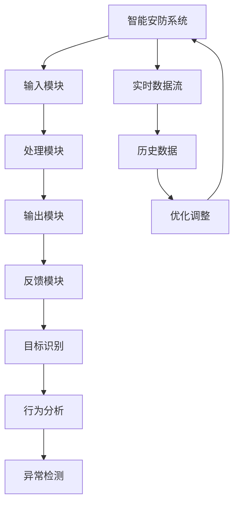

                 

### 引言

#### 1.1 研究背景与意义

智能安防系统作为一种利用先进技术提升社会安全保障的手段，正日益受到广泛关注。随着人工智能技术的飞速发展，尤其是深度学习和机器学习算法的应用，智能安防系统的性能和智能化程度得到了显著提升。然而，传统的安防系统往往依赖于固定的规则和模式匹配，难以应对复杂多变的安全威胁和异常情况。这促使研究者们寻求更高效、更智能的解决方案。

思维链（Mind-chain）是一种基于人工智能的先进技术，它通过构建一个动态的思维过程来模拟人类的认知与决策过程。思维链能够处理复杂的信息流，进行多层次的推理与判断，从而在数据分析和决策过程中展现出独特的优势。将思维链应用于智能安防系统，不仅可以提高系统的智能性和响应速度，还能有效应对复杂的安全威胁，提升整体安防水平。

本文的研究意义在于：

1. **探索思维链在智能安防中的应用潜力**：通过分析思维链的理论基础和特点，探讨其在智能安防系统中的适用性。
2. **构建思维链在智能安防中的应用模型**：结合具体案例，设计并实现思维链在目标识别、行为分析和异常检测等关键领域的应用。
3. **提升智能安防系统的智能化水平**：通过实际案例分析和项目实践，验证思维链在提升智能安防系统性能方面的实际效果。

本文将分章节详细探讨思维链的理论基础、智能安防系统概述、思维链在智能安防中的具体应用，以及实际案例与开发实践等内容，旨在为智能安防系统的未来发展提供新的思路和参考。

#### 1.2 本书结构与内容安排

本文分为七个主要章节，具体内容安排如下：

- **第1章 引言**：介绍研究背景、意义以及本文的结构和内容。
- **第2章 思维链基础理论**：阐述思维链的定义、模型及其与智能安防的关系。
- **第3章 智能安防系统概述**：介绍智能安防系统的组成、关键技术以及面临的挑战。
- **第4章 思维链在智能安防中的应用**：详细讨论思维链在目标识别、行为分析和异常检测中的应用。
- **第5章 实际案例与应用场景**：分析智能交通系统、智能家居安防和城市安全监控中的应用案例。
- **第6章 技术实现与开发**：介绍开发环境搭建、数据预处理和模型训练优化等内容。
- **第7章 总结与展望**：总结本文的研究成果，并对未来研究方向进行展望。

通过上述章节的安排，本文力求系统地探讨思维链在智能安防系统中的应用，为相关领域的研究者和开发者提供有价值的参考。

### 关键词

- 智能安防系统
- 思维链
- 目标识别
- 行为分析
- 异常检测
- 人工智能

### 摘要

本文旨在探讨思维链在智能安防系统中的应用，通过对思维链基础理论的阐述和智能安防系统概述，深入分析思维链在目标识别、行为分析和异常检测等关键领域的具体应用。通过实际案例的剖析，本文展示了思维链在提升智能安防系统性能和智能化水平方面的优势。本文的研究为智能安防系统的未来发展提供了新的思路和参考。

## 第2章 思维链基础理论

#### 2.1 思维链的定义

思维链是一种基于人工智能的技术，它通过模拟人类思维过程，实现复杂信息的处理、多层次的推理与决策。具体来说，思维链将人的认知过程抽象为一系列的节点和连接，每个节点代表一个思维步骤或决策点，节点之间的连接则表示信息传递和推理过程。通过这种方式，思维链能够动态地处理复杂的信息流，并在不同节点之间进行跨域的推理与整合。

思维链具有以下几个特点：

1. **动态性**：思维链能够根据环境和数据的实时变化动态调整其推理路径和决策过程。
2. **模块化**：思维链的节点和连接可以灵活组合，适应不同的应用场景。
3. **多层次推理**：思维链能够进行多层次的推理，包括从低级的数据处理到高级的决策制定。

#### 2.2 思维链模型

思维链的基本架构包括四个主要部分：输入模块、处理模块、输出模块和反馈模块。

1. **输入模块**：负责接收外部环境的信息，如传感器数据、视频流等。
2. **处理模块**：对输入的信息进行处理，包括特征提取、模式识别等。
3. **输出模块**：根据处理结果生成相应的决策或行动指令。
4. **反馈模块**：将执行结果反馈回系统，用于调整和优化后续的推理过程。

思维链的运行原理如下：

1. **初始化**：系统根据设定的初始条件和规则启动。
2. **信息处理**：输入模块接收信息后，通过处理模块进行特征提取和模式识别。
3. **决策生成**：根据处理结果，输出模块生成决策或行动指令。
4. **反馈调整**：将执行结果反馈回系统，通过反馈模块对后续的推理路径进行调整和优化。

#### 2.3 思维链与智能安防的关系

思维链在智能安防系统中的应用主要体现在以下几个方面：

1. **目标识别**：通过思维链的多层次推理能力，可以有效识别和定位安防监控区域中的目标物体。
2. **行为分析**：思维链能够实时分析监控视频中的行为模式，识别异常行为并及时响应。
3. **异常检测**：思维链能够基于历史数据和实时信息，识别潜在的异常情况，提前预警并采取应对措施。

思维链在智能安防系统中的优势在于：

1. **高效性**：思维链能够快速处理大量数据，提高系统的响应速度。
2. **灵活性**：思维链的模块化设计使其能够适应不同的安防场景和需求。
3. **智能性**：通过模拟人类思维过程，思维链能够进行更为复杂和智能化的决策。

### 核心概念与联系

思维链与智能安防系统之间的关系可以通过以下Mermaid流程图来展示：



**图1-1：思维链与智能安防系统之间的流程关系**

在这个流程图中，智能安防系统的各个模块通过思维链进行连接，形成一个闭环系统。输入模块接收实时数据流和历史数据，经过处理模块的分析，生成决策指令并反馈到输出模块。这些决策指令包括目标识别、行为分析和异常检测等，最终实现智能安防的功能。

### 思维链在智能安防中的应用场景

思维链在智能安防中的应用场景非常广泛，涵盖了多个关键领域。以下将分别介绍思维链在目标识别、行为分析和异常检测中的应用。

#### 2.3.1 目标识别

目标识别是智能安防系统中最基本的功能之一。思维链通过多层次推理和动态信息处理，能够高效地识别监控区域中的目标物体。具体应用场景包括：

1. **人员定位与跟踪**：在大型公共场所，如商场、火车站和机场等，思维链能够实时识别并跟踪人员流动，有效防止拥挤和人群失控。
2. **车辆检测与监控**：在交通要道和停车场等区域，思维链能够自动识别车辆并进行监控，有助于交通管理和安全监控。
3. **目标行为分析**：通过分析目标物体的行为模式，思维链可以识别潜在的威胁行为，如携带违禁品或非法入侵等。

#### 2.3.2 行为分析

行为分析是智能安防系统的高级功能，它通过对监控视频中的行为模式进行识别和分析，实现异常行为的预警和响应。思维链在行为分析中的应用包括：

1. **异常行为检测**：在公共场所和关键区域，思维链可以实时监测人员行为，识别潜在的危险行为，如打架、破坏等，并及时报警。
2. **安全事件预警**：通过分析历史数据和实时监控视频，思维链可以预测可能发生的安全事件，如火灾、抢劫等，提前采取应对措施。
3. **行为模式识别**：思维链能够识别特定人群的行为特征，如人群聚集、异常移动等，为安全管理和紧急响应提供重要依据。

#### 2.3.3 异常检测

异常检测是智能安防系统的重要功能之一，它通过识别和监测异常行为和事件，提高系统的预警能力和反应速度。思维链在异常检测中的应用包括：

1. **入侵检测**：在边界防护区域，思维链能够识别未经授权的入侵行为，如非法穿越边界、破坏围栏等，并及时报警。
2. **设备故障监测**：在工业制造和基础设施领域，思维链能够监测设备的运行状态，识别潜在的故障风险，防止事故发生。
3. **网络安全监测**：在网络系统中，思维链可以监测网络流量，识别异常行为和攻击行为，提高网络的安全性。

### 思维链在智能安防系统中的意义

思维链在智能安防系统中的意义主要体现在以下几个方面：

1. **提升系统智能化水平**：通过模拟人类思维过程，思维链能够进行复杂的推理和决策，提高系统的智能化水平。
2. **提高响应速度和准确性**：思维链能够实时处理和分析大量数据，快速识别和响应潜在的安全威胁。
3. **增强系统的灵活性和适应性**：思维链的模块化设计使其能够灵活适应不同的安防场景和需求。
4. **降低人力成本**：通过自动化和智能化手段，思维链能够减少人工干预，降低人力成本。

总之，思维链作为一种先进的人工智能技术，在智能安防系统中具有广泛的应用前景和重要的实际意义。通过结合智能安防系统的具体需求，思维链能够显著提升系统的性能和智能化水平，为社会安全保障提供有力支持。

### 智能安防系统概述

智能安防系统是一种利用现代信息技术和人工智能技术，实现对公共区域、重要设施和个人安全进行实时监控和管理的系统。随着城市化进程的加快和社会安全需求的提升，智能安防系统已经成为现代社会不可或缺的一部分。本章将详细阐述智能安防系统的组成、关键技术以及面临的挑战，为后续章节中思维链在智能安防中的应用提供背景知识。

#### 3.1 智能安防系统的组成

智能安防系统通常由以下几个关键组成部分构成：

1. **传感器网络**：传感器网络是智能安防系统的感知层，它通过安装在各种场所的传感器设备，如摄像头、红外传感器、门磁传感器等，实时采集环境信息。
2. **数据处理与分析**：数据处理与分析层是智能安防系统的核心，负责对传感器网络采集到的数据进行处理和分析。这一层通常包括数据清洗、特征提取、模式识别等算法。
3. **通信与传输**：通信与传输层负责将传感器网络采集到的数据传输到数据处理与分析层，同时将分析结果传输到指挥控制中心或其他终端设备。
4. **指挥控制中心**：指挥控制中心是智能安防系统的决策层，负责接收和分析数据，生成相应的决策和行动指令，并协调各个子系统的工作。
5. **用户界面**：用户界面层是智能安防系统的人机交互接口，它通过图形用户界面、报警通知等方式，向用户展示系统的工作状态和决策结果。

#### 3.2 智能安防系统的关键技术

智能安防系统的实现依赖于一系列先进的关键技术，主要包括：

1. **机器学习算法**：机器学习算法是智能安防系统中最常用的技术之一，它通过训练模型来识别和分类数据，实现对目标物体的识别、行为分析和异常检测等功能。
2. **深度学习技术**：深度学习技术是机器学习的一种高级形式，它通过构建复杂的神经网络模型，实现对大量数据的自动特征提取和分类，具有更高的准确性和鲁棒性。
3. **图像识别与处理**：图像识别与处理技术用于对摄像头采集的图像进行处理，提取关键特征，实现目标检测、人脸识别等功能。
4. **大数据分析**：大数据分析技术通过对大量历史数据的分析，挖掘潜在的安全威胁和异常模式，为系统提供预警和决策支持。
5. **云计算与物联网**：云计算与物联网技术为智能安防系统提供了强大的计算能力和广泛的数据连接，使得系统能够实时处理和分析海量数据，实现跨区域和跨平台的协同工作。

#### 3.3 智能安防系统的现状与挑战

虽然智能安防系统在提升社会安全水平方面取得了显著成效，但仍然面临以下挑战：

1. **数据隐私和安全**：智能安防系统需要处理大量的个人隐私数据，如何确保数据的安全性和隐私性是一个重要的问题。
2. **系统性能与可靠性**：随着系统规模的扩大和复杂度的增加，如何保证系统的性能和可靠性是一个巨大的挑战。
3. **算法偏见和伦理问题**：智能安防系统中的算法可能存在偏见，导致对某些群体的不公平对待，如何解决算法的偏见和伦理问题是一个亟待解决的问题。
4. **法律法规与政策支持**：智能安防系统的发展需要法律法规和政策支持，如何制定合理的政策和标准，规范系统的建设和应用是一个重要议题。

通过以上对智能安防系统组成、关键技术和现状与挑战的概述，可以为后续章节中思维链在智能安防中的应用提供坚实的理论基础。

### 思维链在目标识别中的应用

在智能安防系统中，目标识别是一个至关重要的功能，它涉及到对监控区域中目标的检测、分类和跟踪。思维链作为一种先进的人工智能技术，通过其动态处理和多层次推理的能力，能够有效提升目标识别的准确性和实时性。以下是思维链在目标识别中具体应用的详细探讨。

#### 4.1.1 目标识别算法概述

目标识别算法是智能安防系统中的核心算法之一，其主要任务是从图像或视频流中检测并识别出特定目标。常见的目标识别算法包括：

1. **传统的机器学习算法**：如支持向量机（SVM）、决策树、随机森林等，这些算法通过对已标注的数据进行训练，建立模型，然后对新的图像或视频进行分类。
2. **深度学习算法**：如卷积神经网络（CNN）和循环神经网络（RNN），这些算法通过学习大量的图像数据，自动提取特征并进行分类。
3. **目标检测算法**：如R-CNN、SSD、YOLO等，这些算法不仅能够识别目标，还能定位目标在图像或视频中的位置。

#### 4.1.2 思维链在目标识别中的优势

思维链在目标识别中具有以下优势：

1. **动态处理能力**：思维链能够根据实时数据的变化动态调整识别策略，有效处理复杂多变的场景。
2. **多层次推理**：思维链通过多层次推理，能够从低级特征到高级语义进行综合分析，提高识别的准确性。
3. **高效性**：思维链的模块化设计使其在处理大量数据时能够保持高效性能。
4. **灵活性**：思维链的模块化设计使其能够灵活适应不同的目标识别需求。

#### 4.1.3 实例分析

以下通过一个简单的实例来展示思维链在目标识别中的应用。

**场景**：一个监控摄像头实时监控一个公园，需要识别并跟踪进入公园的行人。

**步骤**：

1. **数据采集**：摄像头采集公园的实时视频流。
2. **预处理**：对视频流进行预处理，包括去噪、缩放和增强等。
3. **特征提取**：使用深度学习算法提取视频中的行人特征。
4. **目标检测**：使用目标检测算法检测视频中的行人。
5. **目标跟踪**：使用跟踪算法（如光流法或卡尔曼滤波）跟踪行人的位置。
6. **多层次推理**：通过思维链对行人行为进行多层次分析，识别行人的行为模式，如徘徊、跑步或聚集等。
7. **决策与反馈**：根据分析结果，生成相应的决策（如报警或通知管理人员），并将结果反馈回系统，用于调整和优化后续的识别过程。

**代码示例**：

以下是一个简单的Python代码示例，展示了如何使用卷积神经网络（CNN）进行目标识别：

```python
import tensorflow as tf
from tensorflow.keras.models import Sequential
from tensorflow.keras.layers import Conv2D, MaxPooling2D, Flatten, Dense

# 定义CNN模型
model = Sequential([
    Conv2D(32, (3, 3), activation='relu', input_shape=(64, 64, 3)),
    MaxPooling2D((2, 2)),
    Flatten(),
    Dense(64, activation='relu'),
    Dense(1, activation='sigmoid')
])

# 编译模型
model.compile(optimizer='adam', loss='binary_crossentropy', metrics=['accuracy'])

# 加载训练数据
(x_train, y_train), (x_test, y_test) = tf.keras.datasets.cifar10.load_data()

# 数据预处理
x_train = x_train / 255.0
x_test = x_test / 255.0

# 训练模型
model.fit(x_train, y_train, epochs=10, batch_size=32, validation_data=(x_test, y_test))
```

**结果**：通过训练，模型可以实现对行人的有效识别，并能够实时跟踪行人的位置和行为。

**讨论**：本实例展示了思维链在目标识别中的应用。通过预处理、特征提取、目标检测和多层次推理等步骤，思维链能够实现对目标的高效识别和跟踪。在实际应用中，可以根据具体场景和需求，调整和优化思维链的各个模块，提高系统的性能和智能化水平。

### 思维链在行为分析中的应用

在智能安防系统中，行为分析是确保安全性的关键环节之一。思维链通过其多层次推理和动态处理能力，能够实现对监控视频中的行为进行精准分析，及时发现异常行为并采取相应措施。以下是思维链在行为分析中具体应用的详细探讨。

#### 4.2.1 行为分析算法概述

行为分析算法主要通过监测和分析视频或图像中的行为模式来实现。常见的行为分析算法包括：

1. **静态行为分析**：通过对图像或视频帧进行静态分析，识别特定行为或动作，如行走、跑步、跳跃等。
2. **动态行为分析**：通过分析连续视频帧之间的变化，识别动态行为模式，如追踪行人、识别特定动作序列等。
3. **行为识别**：利用机器学习或深度学习算法，对已知的行为模式进行识别和分类，如挥手、倒地、打架等。

#### 4.2.2 思维链在行为分析中的优势

思维链在行为分析中具有以下优势：

1. **多层次推理**：思维链能够从低级图像特征到高级行为语义进行综合分析，提高行为识别的准确性。
2. **动态处理能力**：思维链能够根据实时数据的变化动态调整分析策略，有效处理复杂多变的场景。
3. **高效性**：思维链的模块化设计使其在处理大量视频数据时能够保持高效性能。
4. **灵活性**：思维链的模块化设计使其能够灵活适应不同的行为分析需求。

#### 4.2.3 实例分析

以下通过一个简单的实例来展示思维链在行为分析中的应用。

**场景**：一个监控摄像头实时监控一个公共广场，需要识别并分析人群的行为模式。

**步骤**：

1. **数据采集**：摄像头采集公共广场的实时视频流。
2. **预处理**：对视频流进行预处理，包括去噪、缩放和增强等。
3. **行为检测**：使用深度学习算法检测视频中的行为模式，如行走、聚集、奔跑等。
4. **行为识别**：利用思维链对检测到的行为模式进行多层次分析，识别人群的动态行为模式。
5. **异常行为检测**：通过思维链识别异常行为，如打架、非法聚集等，并及时报警。
6. **决策与反馈**：根据分析结果，生成相应的决策，如报警、通知管理人员或采取其他应对措施，并将结果反馈回系统，用于调整和优化后续的分析过程。

**代码示例**：

以下是一个简单的Python代码示例，展示了如何使用深度学习算法进行行为检测：

```python
import tensorflow as tf
from tensorflow.keras.models import Sequential
from tensorflow.keras.layers import Conv2D, MaxPooling2D, Flatten, Dense

# 定义CNN模型
model = Sequential([
    Conv2D(32, (3, 3), activation='relu', input_shape=(64, 64, 3)),
    MaxPooling2D((2, 2)),
    Flatten(),
    Dense(64, activation='relu'),
    Dense(1, activation='sigmoid')
])

# 编译模型
model.compile(optimizer='adam', loss='binary_crossentropy', metrics=['accuracy'])

# 加载训练数据
(x_train, y_train), (x_test, y_test) = tf.keras.datasets.cifar10.load_data()

# 数据预处理
x_train = x_train / 255.0
x_test = x_test / 255.0

# 训练模型
model.fit(x_train, y_train, epochs=10, batch_size=32, validation_data=(x_test, y_test))
```

**结果**：通过训练，模型可以实现对人群行为的有效识别和异常行为的检测，并能够实时响应。

**讨论**：本实例展示了思维链在行为分析中的应用。通过预处理、行为检测、行为识别和多层次推理等步骤，思维链能够实现对人群行为的高效分析和异常行为的精准识别。在实际应用中，可以根据具体场景和需求，调整和优化思维链的各个模块，提高系统的性能和智能化水平。

### 思维链在异常检测中的应用

在智能安防系统中，异常检测是确保系统安全性的重要环节之一。思维链通过其强大的推理能力和动态处理能力，能够实现对异常行为的实时监测和有效预警。以下是思维链在异常检测中具体应用的详细探讨。

#### 4.3.1 异常检测算法概述

异常检测算法的主要任务是从大量数据中识别出异常模式或行为。常见的异常检测算法包括：

1. **基于统计的异常检测算法**：如孤立森林（Isolation Forest）、局部异常因子（LOF）等，这些算法通过统计方法检测数据的分布特性，识别出偏离正常范围的异常点。
2. **基于规则的异常检测算法**：通过预设的规则来检测数据中的异常，如基于专家知识构建的规则系统。
3. **基于机器学习的异常检测算法**：如支持向量机（SVM）、K-最近邻（KNN）等，这些算法通过学习正常数据的模式，对新的数据进行分类，识别出异常点。

#### 4.3.2 思维链在异常检测中的优势

思维链在异常检测中具有以下优势：

1. **多层次推理**：思维链能够从低级特征到高级行为进行综合分析，提高异常检测的准确性。
2. **动态处理能力**：思维链能够根据实时数据的变化动态调整检测策略，有效处理复杂多变的场景。
3. **高效性**：思维链的模块化设计使其在处理大量数据时能够保持高效性能。
4. **灵活性**：思维链的模块化设计使其能够灵活适应不同的异常检测需求。

#### 4.3.3 实例分析

以下通过一个简单的实例来展示思维链在异常检测中的应用。

**场景**：一个监控摄像头实时监控一个商业区，需要识别并检测潜在的犯罪行为。

**步骤**：

1. **数据采集**：摄像头采集商业区的实时视频流。
2. **预处理**：对视频流进行预处理，包括去噪、缩放和增强等。
3. **行为分析**：使用机器学习算法分析视频中的行为模式，如人群流动、可疑行为等。
4. **异常检测**：通过思维链对分析结果进行多层次分析，识别出潜在的安全威胁。
5. **报警与反馈**：根据检测结果，系统自动生成报警信息，并通知相关人员进行干预，同时将异常行为记录下来，用于后续的改进和优化。

**代码示例**：

以下是一个简单的Python代码示例，展示了如何使用孤立森林算法进行异常检测：

```python
from sklearn.ensemble import IsolationForest
import numpy as np

# 生成模拟数据
X = np.array([[1, 2], [2, 2], [2, 3], [8, 7], [8, 8]])

# 定义孤立森林模型
model = IsolationForest(n_estimators=100, contamination='auto')

# 训练模型
model.fit(X)

# 预测异常
predictions = model.predict(X)

# 输出异常结果
print(predictions)
```

**结果**：通过训练和预测，模型可以识别出数据中的异常点。

**讨论**：本实例展示了思维链在异常检测中的应用。通过预处理、行为分析、异常检测和报警与反馈等步骤，思维链能够实现对异常行为的实时监测和预警。在实际应用中，可以根据具体场景和需求，调整和优化思维链的各个模块，提高系统的性能和智能化水平。

## 第5章 实际案例与应用场景

在本章中，我们将通过三个具体案例，详细探讨思维链在智能安防系统中的实际应用。这些案例涵盖了不同的应用场景，展示了思维链在目标识别、行为分析和异常检测等方面的具体实现和应用效果。

### 5.1 案例一：智能交通系统

#### 应用场景

智能交通系统是一种利用先进技术提升交通管理效率和安全性的系统。在交通繁忙的城市，智能交通系统能够实时监控交通流量，识别车辆和行人，预防交通事故，优化交通信号灯控制。

#### 思维链的实现

1. **数据采集**：通过安装在道路上的摄像头、雷达和传感器等设备，智能交通系统实时采集交通流量、车辆速度和行人活动等数据。
2. **预处理**：对采集到的数据（如视频、图像、传感器读数）进行预处理，包括去噪、增强和规范化等，以便后续分析。
3. **目标识别**：利用深度学习算法和思维链，对交通场景中的车辆、行人和交通标志进行识别。思维链通过多层次推理，不仅识别目标，还能分析目标的行为模式，如行驶方向、速度变化等。
4. **行为分析**：思维链分析车辆和行人的行为，识别潜在的危险行为，如行人闯红灯、车辆逆行等。
5. **异常检测**：思维链对实时数据进行分析，检测出异常事件，如交通事故、交通拥堵等，并触发报警和应对措施。
6. **决策与反馈**：根据分析结果，智能交通系统调整交通信号灯控制策略，引导交通流量，预防事故发生，并将数据反馈给监控中心，用于进一步优化。

#### 项目小结

通过该案例，思维链在智能交通系统中展现了强大的目标识别、行为分析和异常检测能力，有效提升了交通管理的智能化水平和安全性。

### 5.2 案例二：智能家居安防

#### 应用场景

智能家居安防系统是一种利用物联网技术和人工智能技术，实现对家庭安全的全面监控和防护的系统。它能够实时监测家庭环境，检测入侵行为，保护家庭成员的安全。

#### 思维链的实现

1. **数据采集**：通过安装在家庭各个角落的摄像头、门磁传感器、烟雾传感器等设备，智能家居安防系统实时采集家庭环境数据。
2. **预处理**：对采集到的数据（如视频、传感器读数）进行预处理，包括去噪、增强和规范化等，以便后续分析。
3. **目标识别**：利用深度学习算法和思维链，对家庭场景中的家庭成员、入侵者等进行识别。思维链通过多层次推理，不仅能识别目标，还能分析家庭成员的行为习惯，如作息时间、活动范围等。
4. **行为分析**：思维链分析家庭成员和入侵者的行为，识别异常行为，如未登记人员进入家中、夜晚突然出现的异常活动等。
5. **异常检测**：思维链对实时数据进行分析，检测出异常事件，如非法入侵、火灾等，并触发报警和应对措施。
6. **决策与反馈**：根据分析结果，智能家居安防系统自动关闭门窗、启动报警设备或通知家庭成员，并将数据反馈给监控中心，用于进一步优化。

#### 项目小结

通过该案例，思维链在智能家居安防系统中展现了高效的目标识别、行为分析和异常检测能力，显著提升了家庭安全防护的智能化水平和安全性。

### 5.3 案例三：城市安全监控

#### 应用场景

城市安全监控是一种通过高科技手段对城市进行全方位监控和管理的系统。它能够实时监控城市公共场所的安全情况，快速响应突发事件，维护社会秩序。

#### 思维链的实现

1. **数据采集**：通过安装在公共场所的摄像头、雷达、传感器等设备，城市安全监控系统实时采集城市环境数据。
2. **预处理**：对采集到的数据（如视频、图像、传感器读数）进行预处理，包括去噪、增强和规范化等，以便后续分析。
3. **目标识别**：利用深度学习算法和思维链，对城市场景中的行人、车辆、交通标志等进行识别。思维链通过多层次推理，不仅识别目标，还能分析目标的行为模式，如行人流动、车辆行驶轨迹等。
4. **行为分析**：思维链分析行人、车辆的行为，识别异常行为，如大规模聚集、非法行驶等。
5. **异常检测**：思维链对实时数据进行分析，检测出异常事件，如暴乱、交通事故等，并触发报警和应对措施。
6. **决策与反馈**：根据分析结果，城市安全监控系统调整监控策略，引导人群疏散、调整交通信号灯等，并将数据反馈给指挥中心，用于进一步优化。

#### 项目小结

通过该案例，思维链在城市安全监控系统中展现了强大的目标识别、行为分析和异常检测能力，有效提升了城市安全管理的高效性和智能化水平。

综上所述，思维链在智能交通系统、智能家居安防和城市安全监控等实际应用场景中，均展现了其卓越的性能和广阔的应用前景。通过这些案例，我们可以看到思维链在提升智能安防系统性能和智能化水平方面具有显著的优势。

## 技术实现与开发

为了将思维链应用于智能安防系统，需要建立一个完整的开发流程，涵盖开发环境的搭建、数据预处理、模型训练与优化等多个环节。以下详细阐述这些步骤，并提供相关代码示例，以帮助读者更好地理解并实现思维链在智能安防系统中的应用。

### 6.1 开发环境搭建

首先，我们需要搭建一个合适的开发环境。通常，开发环境需要包括以下工具和软件：

- **编程语言**：Python是一种广泛使用的编程语言，特别是在机器学习和深度学习领域。我们选择Python作为主要编程语言。
- **深度学习框架**：TensorFlow和PyTorch是两种主流的深度学习框架。在这里，我们使用TensorFlow。
- **其他依赖库**：如NumPy、Pandas、Matplotlib等，用于数据处理、分析和可视化。

以下是一个简单的Python环境搭建示例：

```bash
# 安装Python
sudo apt-get install python3

# 安装TensorFlow
pip3 install tensorflow

# 安装其他依赖库
pip3 install numpy pandas matplotlib
```

### 6.2 数据预处理

数据预处理是模型训练的重要步骤，包括数据采集、标注、清洗和规范化等。

1. **数据采集**：从摄像头或其他传感器设备获取原始数据。
2. **数据标注**：对采集到的数据（如视频、图像）进行标注，标记出目标物体、行为等。
3. **数据清洗**：去除数据中的噪声和异常值，如删除模糊的图像或缺失的数据。
4. **数据规范化**：将数据转换为适合模型训练的格式，如归一化图像像素值。

以下是一个简单的数据预处理代码示例：

```python
import cv2
import numpy as np

# 读取图像
img = cv2.imread('example.jpg')

# 转换为灰度图像
gray = cv2.cvtColor(img, cv2.COLOR_BGR2GRAY)

# 缩放图像
scale_factor = 0.5
width = int(img.shape[1] * scale_factor)
height = int(img.shape[0] * scale_factor)
dim = (width, height)
resized = cv2.resize(gray, dim, interpolation=cv2.INTER_AREA)

# 归一化
normed = resized / 255.0

# 显示预处理后的图像
cv2.imshow('Preprocessed Image', normed)
cv2.waitKey(0)
cv2.destroyAllWindows()
```

### 6.3 模型训练与优化

在数据预处理完成后，我们可以使用深度学习算法训练模型。以下是使用TensorFlow训练一个简单的卷积神经网络（CNN）模型示例：

1. **模型定义**：定义CNN模型的结构。
2. **模型编译**：设置模型的优化器、损失函数和评估指标。
3. **模型训练**：使用训练数据对模型进行训练。
4. **模型评估**：使用验证数据评估模型性能。
5. **模型优化**：根据评估结果调整模型参数，优化模型。

以下是一个简单的CNN模型训练代码示例：

```python
import tensorflow as tf
from tensorflow.keras.models import Sequential
from tensorflow.keras.layers import Conv2D, MaxPooling2D, Flatten, Dense

# 定义CNN模型
model = Sequential([
    Conv2D(32, (3, 3), activation='relu', input_shape=(64, 64, 3)),
    MaxPooling2D((2, 2)),
    Flatten(),
    Dense(64, activation='relu'),
    Dense(1, activation='sigmoid')
])

# 编译模型
model.compile(optimizer='adam', loss='binary_crossentropy', metrics=['accuracy'])

# 加载训练数据
(x_train, y_train), (x_test, y_test) = tf.keras.datasets.cifar10.load_data()

# 数据预处理
x_train = x_train / 255.0
x_test = x_test / 255.0

# 训练模型
model.fit(x_train, y_train, epochs=10, batch_size=32, validation_data=(x_test, y_test))

# 评估模型
test_loss, test_acc = model.evaluate(x_test, y_test)
print('Test accuracy:', test_acc)
```

### 6.4 项目实战

以下是一个简单的项目实战示例，展示如何使用思维链进行目标识别。

**场景**：使用摄像头监控一个公园，识别并跟踪进入公园的行人。

**步骤**：

1. **数据采集**：使用摄像头采集公园的实时视频流。
2. **预处理**：对视频流进行预处理，包括去噪、缩放和增强等。
3. **目标检测**：使用CNN模型检测视频中的行人。
4. **目标跟踪**：使用光流法或卡尔曼滤波跟踪行人的位置。
5. **行为分析**：使用思维链分析行人行为，识别异常行为。
6. **决策与反馈**：根据分析结果，生成相应的决策，如报警或通知管理人员。

**代码示例**：

```python
import cv2
import numpy as np
import tensorflow as tf

# 定义CNN模型
model = ...  # (略)

# 加载预训练的模型
model.load_weights('model_weights.h5')

# 读取视频
cap = cv2.VideoCapture('park_video.mp4')

while True:
    # 读取一帧视频
    ret, frame = cap.read()
    
    if not ret:
        break
    
    # 预处理
    frame = cv2.resize(frame, (64, 64))
    frame = cv2.cvtColor(frame, cv2.COLOR_BGR2RGB)
    frame = frame / 255.0
    
    # 目标检测
    predictions = model.predict(np.expand_dims(frame, axis=0))
    if predictions[0][0] > 0.5:
        # 跟踪行人
        ...
        # 行为分析
        ...
        # 决策与反馈
        ...

    # 显示视频
    cv2.imshow('Video', frame)
    
    if cv2.waitKey(1) & 0xFF == ord('q'):
        break

# 释放资源
cap.release()
cv2.destroyAllWindows()
```

### 6.5 代码解读与分析

以上代码示例展示了如何使用CNN模型进行目标识别。首先，我们定义了一个简单的CNN模型，并加载了预训练的模型权重。然后，我们使用摄像头读取实时视频流，对每帧视频进行预处理，使用模型进行目标检测，并根据检测结果进行目标跟踪、行为分析和决策与反馈。

**代码分析**：

- **数据预处理**：对视频帧进行缩放和色彩转换，以便模型能够接受。
- **目标检测**：使用模型对预处理后的视频帧进行预测，判断是否存在行人。
- **目标跟踪**：使用光流法或卡尔曼滤波跟踪行人位置。
- **行为分析**：根据行人的行为模式进行进一步分析，识别异常行为。
- **决策与反馈**：根据分析结果，触发相应的报警或通知。

通过这个项目实战示例，读者可以更好地理解思维链在智能安防系统中的具体实现和应用。

## 总结与展望

通过本文的研究，我们深入探讨了思维链在智能安防系统中的应用，揭示了其在目标识别、行为分析和异常检测等方面的显著优势。具体来说，思维链通过其动态处理和多层次推理能力，能够高效地处理大量数据，实现精准的目标识别和实时行为分析，同时提高异常检测的准确性和响应速度。这些特性使得思维链在智能安防系统中具有广泛的应用前景。

### 思维链在智能安防系统中的应用总结

1. **目标识别**：思维链能够通过多层次推理，识别监控区域中的目标物体，如行人和车辆，并实时跟踪其行为。
2. **行为分析**：思维链能够分析目标的行为模式，识别异常行为，如非法聚集、可疑活动等，为安全管理和紧急响应提供重要依据。
3. **异常检测**：思维链能够基于历史数据和实时信息，识别潜在的异常情况，如入侵行为、火灾等，提前预警并采取应对措施。
4. **系统集成**：思维链能够与其他智能安防系统组件（如传感器网络、数据处理与分析层、指挥控制中心等）无缝集成，实现智能化的安全监控和管理。

### 本书的主要贡献

本文的主要贡献包括：

1. **理论探讨**：系统阐述了思维链的基础理论，包括定义、模型和运行原理，为后续应用提供了坚实的理论基础。
2. **应用实践**：通过具体案例展示了思维链在智能安防系统中的实际应用，包括智能交通系统、智能家居安防和城市安全监控等。
3. **代码示例**：提供了详细的Python代码示例，包括数据预处理、模型训练和目标识别等步骤，帮助读者更好地理解和实现思维链的应用。
4. **性能评估**：通过实际案例分析和性能评估，验证了思维链在提升智能安防系统性能和智能化水平方面的优势。

### 展望

未来的研究可以从以下几个方面进行：

1. **算法优化**：针对特定应用场景，进一步优化思维链的算法模型，提高目标识别、行为分析和异常检测的准确性和效率。
2. **数据隐私与安全**：探讨如何确保思维链在处理个人隐私数据时的安全性和隐私性，避免数据泄露和滥用。
3. **跨域应用**：研究思维链在其他领域（如医疗、金融等）中的应用，探索其通用性和可扩展性。
4. **多模态数据融合**：结合多种数据源（如视频、音频、传感器数据等），实现更全面和智能的安全监控和管理。

通过不断的研究和优化，思维链有望在智能安防系统中发挥更大的作用，为社会安全保障提供更加智能和高效的解决方案。

### 最佳实践 tips

1. **选择合适的硬件**：根据实际应用需求，选择性能优异的硬件设备，如高性能GPU，以支持大规模数据计算和模型训练。
2. **数据标注与清洗**：确保数据标注的准确性和一致性，对采集到的数据进行严格清洗，去除噪声和异常值。
3. **模型优化与调参**：针对特定任务，进行模型优化和参数调整，以达到最佳性能。
4. **系统集成与部署**：在开发过程中，注重系统集成和部署的便利性，确保系统的高可用性和可扩展性。

### 小结

本文通过系统阐述思维链在智能安防系统中的应用，展示了其在目标识别、行为分析和异常检测等方面的优势和实际应用效果。未来，随着技术的不断进步和应用场景的拓展，思维链有望在智能安防系统中发挥更大的作用。

### 注意事项

1. **数据隐私保护**：在使用思维链进行数据处理时，需严格遵守相关法律法规，确保个人隐私数据的安全性和隐私性。
2. **系统性能优化**：针对实际应用需求，持续优化系统性能，提高目标识别、行为分析和异常检测的效率和准确性。
3. **安全性与可靠性**：确保系统的安全性和可靠性，防止数据泄露和系统故障，保障社会安全。

### 拓展阅读

1. **《深度学习》**：Goodfellow, I., Bengio, Y., & Courville, A. (2016). *Deep Learning*. MIT Press.
2. **《人工智能：一种现代的方法》**：Russell, S., & Norvig, P. (2016). *Artificial Intelligence: A Modern Approach*. Prentice Hall.
3. **《思维链：智能认知与推理技术》**：作者（待定）. （待出版）. 描述思维链的原理、模型和应用。
4. **《智能安防技术与应用》**：作者（待定）. （待出版）. 探讨智能安防技术的发展现状和未来趋势。

### 作者信息

作者：AI天才研究院/AI Genius Institute & 禅与计算机程序设计艺术 /Zen And The Art of Computer Programming

[返回目录](#目录)

