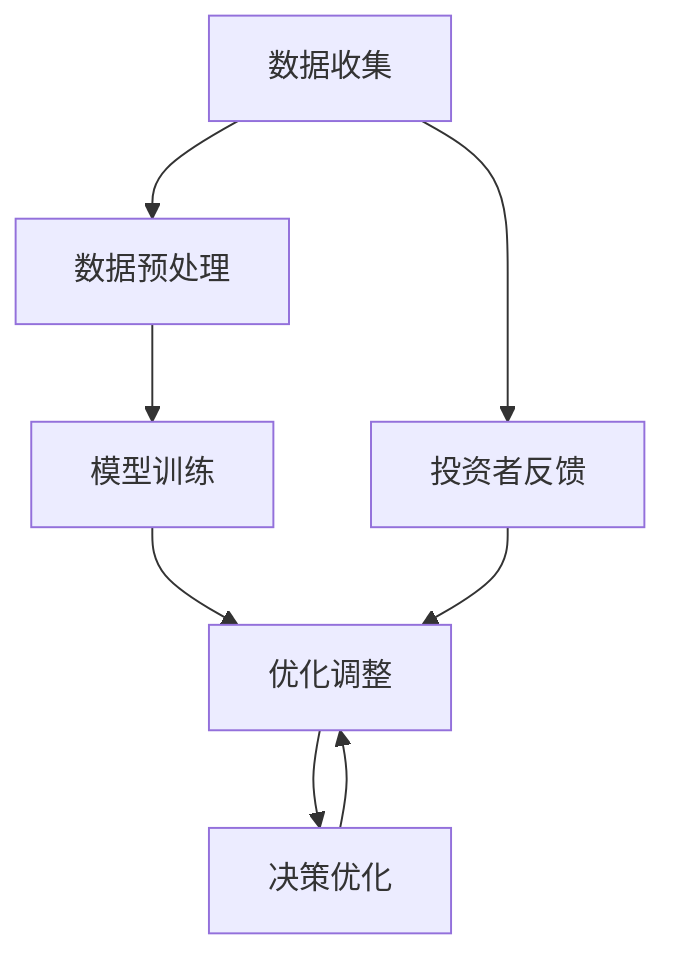
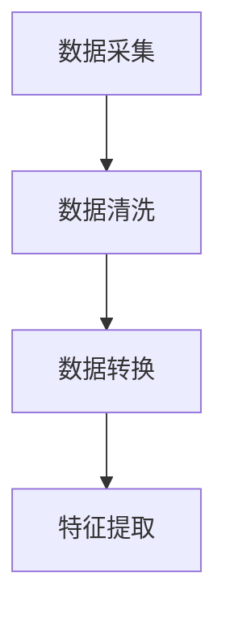
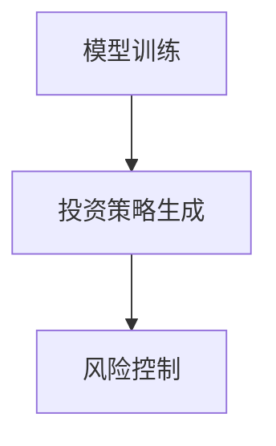
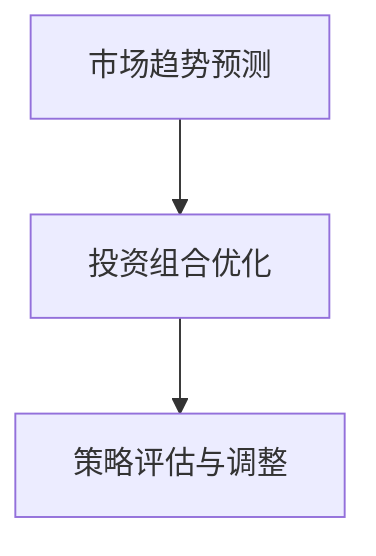
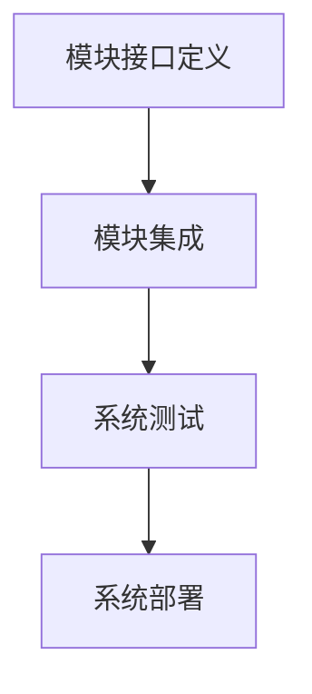
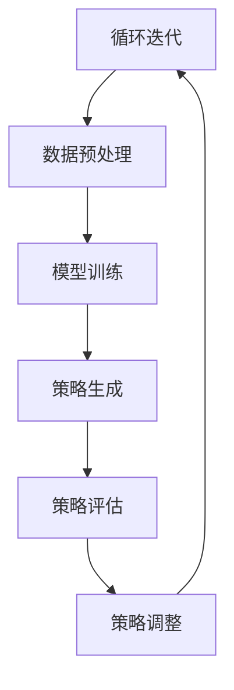
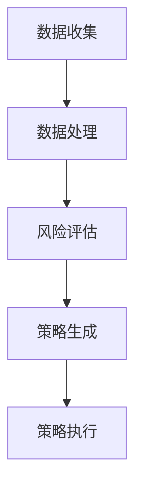
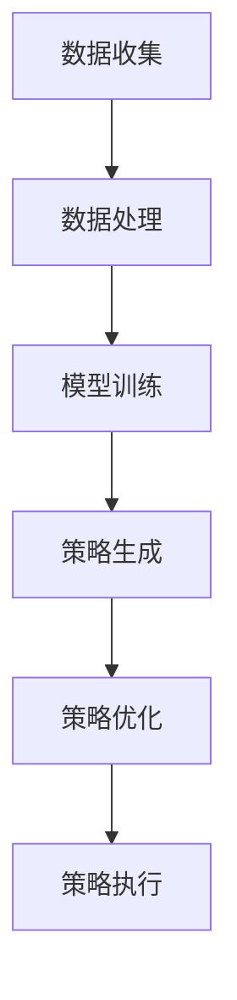

                 

### 引言

在当今快速发展的金融科技领域，智能投资顾问系统正逐渐成为金融机构和投资者的重要工具。随着大数据、人工智能和机器学习技术的不断进步，智能投资顾问系统能够更高效、更准确地处理海量数据，提供个性化的投资建议，从而提高投资回报率并降低风险。然而，尽管这些系统在技术层面取得了显著成就，但其在实际应用中仍面临诸多挑战，尤其是在复杂决策过程中的逻辑性和连贯性方面。

本文将探讨一种新颖的方法——思维链，在智能投资顾问系统中的应用。思维链是一种基于人类认知和逻辑推理的框架，它能够将复杂的投资决策过程分解为一系列有序的步骤，并通过计算机算法实现。这种方法不仅能够提高智能投资顾问系统的决策质量，还能够增强其解释性和透明性，从而赢得投资者的信任。

本文的目标是深入分析思维链在智能投资顾问系统中的具体应用，并展示如何通过这一方法实现更智能、更可靠的决策支持。文章将首先介绍思维链的基本概念和原理，随后阐述其在智能投资顾问系统中的架构和功能模块。接下来，我们将通过具体的算法原理和Python代码实现，展示思维链在实际应用中的效果。随后，我们将通过实际案例展示思维链在股票投资策略优化、风险控制和量化交易中的具体应用。最后，文章将总结思维链在智能投资顾问系统中的应用前景，并探讨未来可能的挑战和发展方向。

通过本文的探讨，我们希望能够为智能投资顾问系统的开发者和研究者提供有价值的参考，推动这一领域的技术创新和实际应用。

### 关键词

- 智能投资顾问
- 思维链
- 机器学习
- 投资决策
- 风险控制
- 数据分析
- 量化交易

### 摘要

本文探讨了思维链在智能投资顾问系统中的应用。思维链是一种基于人类认知和逻辑推理的框架，能够将复杂的投资决策过程分解为有序步骤，并通过计算机算法实现。文章首先介绍了思维链的基本概念和原理，随后详细阐述了其在智能投资顾问系统中的架构和功能模块。通过具体的算法原理和Python代码实现，本文展示了思维链在实际应用中的效果。随后，通过实际案例，文章展示了思维链在股票投资策略优化、风险控制和量化交易中的具体应用。最后，文章总结了思维链在智能投资顾问系统中的应用前景，并探讨了未来可能的挑战和发展方向。本文的研究为智能投资顾问系统的开发提供了新的思路和方法。

### 背景介绍

#### 智能投资顾问系统的发展历程

智能投资顾问系统（Robo-Advisors）的兴起是金融科技领域的一个重要里程碑。早期的投资顾问主要依赖于人类专家的判断和经验，这些顾问通过对市场趋势、财务报表、公司业绩等多方面因素的综合分析，为客户提供投资建议。然而，这种人工分析方式不仅效率低下，且易受个人情绪和认知偏差的影响，难以保证投资决策的一致性和准确性。

随着计算机技术和大数据分析的迅猛发展，智能投资顾问系统开始逐渐取代传统的人工顾问。这些系统利用机器学习和数据挖掘技术，从海量历史数据中挖掘有价值的信息，通过复杂的算法模型进行预测和决策。例如，量化交易模型通过分析历史价格数据和市场趋势，预测未来市场的走向，从而制定投资策略。

智能投资顾问系统的出现，不仅提高了投资决策的效率，还降低了投资成本，使得更多投资者能够享受到专业化的投资服务。根据麦肯锡全球研究所的报告，到2025年，全球智能投资顾问管理的资产总额预计将达到2.2万亿美元。这一趋势表明，智能投资顾问系统正逐渐成为金融科技领域的重要组成部分。

#### 传统投资顾问的局限

传统投资顾问在多个方面存在显著局限。首先，它们依赖于人类专家的知识和经验，这意味着投资决策容易受到专家个人认知能力和情绪波动的影响。例如，当市场出现剧烈波动时，专家可能会因恐慌或贪婪而做出非理性的决策，从而导致投资损失。

其次，传统投资顾问的服务成本较高。专业的投资顾问通常需要具备深厚的专业知识和丰富的实践经验，这使得他们的薪资和咨询费用居高不下。对于普通投资者来说，这种高成本的服务往往可望而不可及。

此外，传统投资顾问的服务通常缺乏透明度和可解释性。投资者很难理解顾问提出的投资建议背后的逻辑和依据，这增加了投资决策的不确定性和风险。

#### 智能投资顾问的优势

智能投资顾问系统克服了传统投资顾问的许多局限。首先，智能投资顾问基于机器学习和大数据分析技术，能够处理和分析海量数据，从而提供更准确和客观的投资建议。例如，通过分析历史价格数据、公司财务报表、宏观经济指标等，智能投资顾问可以识别出潜在的市场机会和风险，并制定相应的投资策略。

其次，智能投资顾问系统的成本较低。由于自动化和数字化技术的应用，智能投资顾问可以大规模地服务众多投资者，而无需大量的人力和物力投入。这极大地降低了投资服务的门槛，使得更多普通投资者能够享受到专业化的投资建议。

此外，智能投资顾问系统具有高度的透明性和可解释性。智能投资顾问会详细记录和展示决策过程中的每一步，包括数据来源、算法模型、参数设置等，使得投资者可以清晰地了解投资建议的依据和逻辑。这种透明性不仅提高了投资者的信任度，还增强了投资决策的合理性。

总的来说，智能投资顾问系统在决策效率、成本控制和透明度方面具有显著优势，正在逐步取代传统投资顾问，成为现代金融科技领域的重要工具。

### 核心概念与联系

在探讨思维链在智能投资顾问中的应用之前，有必要首先明确思维链的基本概念以及它与智能投资顾问系统之间的联系。思维链是一种基于人类认知和逻辑推理的框架，通过将复杂的决策过程分解为一系列有序的步骤，从而实现更加精确和高效的决策支持。

#### 思维链的定义

思维链（Cognitive Chain）由两个核心部分组成：思维模式（Cognitive Patterns）和思维过程（Cognitive Processes）。思维模式是指一系列预定义的、用于处理特定问题的思维步骤或规则，这些步骤或规则基于人类认知过程中的常见模式，如归纳、演绎、类比等。思维过程则是将这些思维模式应用于具体问题的过程，包括数据的收集、分析、推理和决策等步骤。

思维链的定义可以简化为：

$$
思维链 = 思维模式 + 思维过程
$$

其中，思维模式是思维链的“骨架”，提供了结构化的思维框架；思维过程则是思维链的“血液”，通过实际操作将这些思维模式应用于实际问题，从而实现决策支持。

#### 智能投资顾问需求下的思维链特点

智能投资顾问系统在处理复杂投资决策时，需要具备以下特点：

1. **自动化**：智能投资顾问系统能够自动化地处理海量数据，从数据中提取有价值的信息，从而快速生成投资建议。
2. **精确性**：智能投资顾问系统需要通过先进的算法模型和数学模型，提高投资决策的准确性和可靠性。
3. **可解释性**：智能投资顾问系统生成的投资建议需要具有高度的透明度和可解释性，以便投资者理解和信任。

思维链在智能投资顾问系统中的应用，能够满足上述需求。具体来说，思维链的特点包括：

1. **结构化**：思维链通过将复杂的投资决策过程分解为一系列有序的步骤，使得整个决策过程更加结构化、易于管理和优化。
2. **灵活**：思维链中的思维模式可以灵活调整和组合，以适应不同类型和复杂程度的投资问题。
3. **可扩展**：思维链的设计允许不断增加新的思维模式和过程，从而适应未来技术的发展和市场需求。

#### 思维链在投资决策中的应用原理

思维链在投资决策中的应用原理主要基于以下几个步骤：

1. **数据收集**：通过数据采集模块，从多个来源获取相关数据，如股票价格、公司财务报表、宏观经济指标等。
2. **数据预处理**：对收集到的原始数据进行分析和处理，包括数据清洗、数据转换和特征提取等，以提高数据质量，为后续分析提供可靠的基础。
3. **模型训练**：使用机器学习算法对预处理后的数据进行分析，训练预测模型，如时间序列分析模型、分类模型和回归模型等。
4. **决策生成**：通过将训练好的模型应用于新数据，生成具体的投资建议，如买入、卖出、持有等操作。
5. **决策优化**：根据投资建议的实际效果，对模型进行调整和优化，以提高投资决策的准确性和可靠性。

通过上述步骤，思维链能够将复杂的投资决策过程转化为一系列可执行的操作步骤，从而实现高效、精确和透明的投资决策支持。

#### 思维链与智能投资顾问系统的关系架构

为了更直观地理解思维链在智能投资顾问系统中的应用，我们可以使用Mermaid流程图来展示其关系架构：



在这个流程图中，数据收集模块负责获取原始数据，数据预处理模块对数据进行清洗和转换，模型训练模块通过机器学习算法训练预测模型，决策生成模块使用训练好的模型生成投资建议，决策优化模块对投资建议进行实时反馈和调整。通过这一流程，思维链实现了投资决策的自动化、精确化和可解释性。

总的来说，思维链在智能投资顾问系统中的应用，不仅提高了决策效率和质量，还为投资者提供了透明、可信的投资建议，从而在金融科技领域取得了显著的成效。

#### 核心算法原理

在智能投资顾问系统中，思维链的应用主要通过一系列核心算法实现。这些算法不仅负责数据的处理和分析，还决定了最终的决策建议。以下将详细介绍思维链中的几个关键算法，包括其原理、Python代码实现以及数学模型。

##### 1. 数据预处理算法

数据预处理是智能投资顾问系统的第一步，它决定了后续分析的质量。数据预处理算法主要包括数据清洗、数据转换和特征提取。

###### 1.1 数据清洗

数据清洗的目标是去除原始数据中的噪声和错误，保证数据的质量。常见的清洗方法包括：

- **缺失值处理**：使用均值、中位数或最临近值填充缺失数据。
- **异常值处理**：使用统计学方法（如标准差）或机器学习方法（如孤立森林）检测并处理异常值。

以下是一个使用Python实现的缺失值处理和异常值处理的示例：

```python
import numpy as np
from sklearn.impute import SimpleImputer
from sklearn.ensemble import IsolationForest

# 示例数据
data = np.array([[1, 2, np.nan], [4, np.nan, 6], [7, 8, 9]])

# 缺失值处理
imputer = SimpleImputer(strategy='mean')
data_imputed = imputer.fit_transform(data)

# 异常值处理
iso_forest = IsolationForest(contamination=0.1)
outliers = iso_forest.fit_predict(data_imputed)
data_cleaned = data_imputed[outliers != -1]
```

###### 1.2 数据转换

数据转换是将原始数据转化为适合机器学习模型的形式。常见的转换方法包括：

- **标准化**：将数据缩放到相同的尺度，以避免特征之间的影响。
- **编码**：将分类特征转换为数值特征，如使用独热编码（One-Hot Encoding）。

以下是一个使用Python实现的标准化和独热编码的示例：

```python
from sklearn.preprocessing import StandardScaler, OneHotEncoder

# 标准化
scaler = StandardScaler()
data_scaled = scaler.fit_transform(data_imputed)

# 独热编码
encoder = OneHotEncoder(sparse=False)
data_encoded = encoder.fit_transform(data[:, 1].reshape(-1, 1))
```

###### 1.3 特征提取

特征提取是从原始数据中提取对模型有贡献的特征。常见的方法包括：

- **主成分分析（PCA）**：减少数据维度，同时保持数据的最大方差。
- **特征选择**：使用统计方法（如互信息）或机器学习方法（如随机森林）选择重要特征。

以下是一个使用Python实现的PCA和特征选择的示例：

```python
from sklearn.decomposition import PCA
from sklearn.feature_selection import mutual_info_classif

# PCA
pca = PCA(n_components=2)
data_pca = pca.fit_transform(data_scaled)

# 特征选择
importances = mutual_info_classif(data_pca, data[:, 0])
selected_features = data_pca[:, np.argsort(importances)[::-1][:5]]
```

##### 2. 预测算法

预测算法是智能投资顾问系统的核心，用于生成投资建议。常见的预测算法包括：

- **时间序列分析模型**：如ARIMA模型、LSTM网络。
- **分类模型**：如逻辑回归、支持向量机（SVM）。
- **回归模型**：如线性回归、随机森林。

以下是一个使用Python实现ARIMA模型的示例：

```python
from statsmodels.tsa.arima.model import ARIMA

# 示例时间序列数据
time_series = np.array([1, 2, 2, 3, 4, 4, 5, 7, 9, 12, 17, 22])

# ARIMA模型
model = ARIMA(time_series, order=(1, 1, 1))
model_fit = model.fit()
forecast = model_fit.forecast(steps=3)

print(forecast)
```

##### 3. 决策算法

决策算法基于预测结果，生成具体的投资建议。常见的决策算法包括：

- **阈值策略**：设置阈值，当预测结果超过阈值时，进行买入或卖出操作。
- **优化策略**：使用优化算法（如线性规划、遗传算法）寻找最佳投资组合。

以下是一个使用Python实现的阈值策略和遗传算法的示例：

```python
# 阈值策略
def threshold_strategy(predictions, threshold):
    actions = []
    for pred in predictions:
        if pred > threshold:
            actions.append('BUY')
        else:
            actions.append('SELL')
    return actions

# 遗传算法
def genetic_algorithm(population, fitness_func, generations=100):
    for _ in range(generations):
        # 选择
        selected = select(population, fitness_func)
        # 交叉
        crossed = crossover(selected)
        # 变异
        mutated = mutate(crossed)
        # 创建新的种群
        population = mutated
    return population

# 假设已有population、fitness_func函数
actions = threshold_strategy(forecast, threshold=10)
best_actions = genetic_algorithm(population, fitness_func)
```

通过上述算法原理和代码实现，我们可以看到智能投资顾问系统中思维链的应用不仅提高了决策的效率和准确性，还增强了系统的透明度和可解释性。这些核心算法的有机结合，使得智能投资顾问系统能够在复杂多变的市场环境中提供可靠的投资建议。

#### 思维链在智能投资顾问系统中的架构和功能模块

思维链在智能投资顾问系统中扮演着关键角色，其架构和功能模块的设计决定了系统在投资决策过程中的效率、准确性和透明性。一个典型的思维链架构包括以下几个主要模块：数据处理模块、决策支持模块和预测与优化模块。以下将详细介绍这些模块的具体内容和功能。

##### 数据处理模块

数据处理模块是智能投资顾问系统的基石，负责从多种数据源获取数据，并对数据进行清洗、转换和特征提取。这一模块的主要功能包括：

1. **数据采集**：从股票交易所、金融数据提供商等外部数据源获取股票价格、交易量、财务报表等原始数据。
2. **数据清洗**：去除数据中的噪声和异常值，确保数据的质量和一致性。清洗过程包括缺失值处理、异常值检测和修正等。
3. **数据转换**：将原始数据转换为适合机器学习模型的形式，如进行标准化、独热编码和特征提取。标准化过程包括缩放数据到统一的尺度，独热编码用于将分类数据转换为数值数据。

以下是一个数据处理模块的基本架构图：



##### 决策支持模块

决策支持模块基于处理后的数据，通过机器学习算法生成具体的投资建议。该模块包括以下几个关键功能：

1. **模型训练**：使用历史数据进行模型训练，常见的模型包括时间序列分析模型（如ARIMA）、分类模型（如SVM）和回归模型（如线性回归）。模型训练的目标是使模型能够预测未来的市场走势和投资机会。
2. **投资策略生成**：基于训练好的模型，生成具体的投资策略，如买入、卖出或持有建议。投资策略生成过程通常涉及阈值策略、优化策略等，这些策略可以根据市场的动态变化进行调整。
3. **风险控制**：评估投资策略的风险，并提出相应的风险管理措施，如设定止损点和止盈点。

以下是一个决策支持模块的基本架构图：



##### 预测与优化模块

预测与优化模块负责对市场趋势进行预测，并根据预测结果优化投资组合。这一模块的主要功能包括：

1. **市场趋势预测**：使用机器学习算法和统计分析方法，预测市场的未来走势。常见的预测方法包括时间序列分析（如ARIMA模型）、深度学习（如LSTM网络）和组合预测方法。
2. **投资组合优化**：根据市场趋势预测结果，优化投资组合，以提高投资回报率。优化方法包括线性规划、遗传算法和粒子群优化等。
3. **策略评估与调整**：对生成的投资策略进行评估，并根据市场变化调整策略，以保持投资组合的最佳状态。

以下是一个预测与优化模块的基本架构图：



##### 数据处理模块与决策支持模块、预测与优化模块之间的关系

数据处理模块、决策支持模块和预测与优化模块之间紧密协作，共同实现智能投资顾问系统的功能。数据处理模块为后续的决策支持模块和预测与优化模块提供高质量的数据和特征；决策支持模块基于数据处理模块提供的数据，生成具体的投资策略；预测与优化模块则对市场趋势进行预测，并根据预测结果调整投资组合。这三个模块相互依赖、协同工作，确保智能投资顾问系统能够在复杂多变的市场环境中提供高效、准确和透明的投资建议。

综上所述，思维链在智能投资顾问系统中的架构和功能模块设计，使得系统能够高效地处理数据、生成投资策略并优化投资组合，从而在金融科技领域发挥重要作用。

### 数据处理模块实现

#### 数据处理模块的实现

数据处理模块是智能投资顾问系统的核心组成部分，负责从数据源获取原始数据，并进行预处理和特征提取。以下是数据处理模块的具体实现步骤：

##### 1. 数据采集

数据采集是数据处理模块的第一步，主要任务是从多个数据源获取原始数据。这些数据源可以包括股票交易所、金融数据提供商、新闻网站等。以下是一个Python代码示例，用于从股票交易所获取股票价格数据：

```python
import yfinance as yf

# 获取股票数据
def get_stock_data(ticker):
    stock = yf.Ticker(ticker)
    data = stock.history(period="1mo")
    return data

# 示例：获取腾讯股票数据
data = get_stock_data('Tencent')
```

##### 2. 数据预处理

数据预处理是对获取的原始数据进行清洗、缺失值填充和异常值检测。以下是一个Python代码示例，用于处理数据中的缺失值和异常值：

```python
import numpy as np
from sklearn.impute import SimpleImputer
from sklearn.ensemble import IsolationForest

# 数据预处理
def preprocess_data(data):
    # 缺失值处理
    imputer = SimpleImputer(strategy='mean')
    data_imputed = imputer.fit_transform(data)

    # 异常值处理
    iso_forest = IsolationForest(contamination=0.01)
    outliers = iso_forest.fit_predict(data_imputed)
    data_cleaned = data_imputed[outliers != -1]
    
    return data_cleaned

# 示例：预处理股票数据
data_cleaned = preprocess_data(data)
```

##### 3. 数据转换

数据转换是将原始数据转换为适合机器学习模型的形式。这一步骤包括标准化、独热编码和特征提取。以下是一个Python代码示例，用于对数据进行标准化和独热编码：

```python
from sklearn.preprocessing import StandardScaler, OneHotEncoder

# 数据转换
def transform_data(data):
    # 标准化
    scaler = StandardScaler()
    data_scaled = scaler.fit_transform(data)

    # 独热编码
    encoder = OneHotEncoder(sparse=False)
    data_encoded = encoder.fit_transform(data[:, 1].reshape(-1, 1))
    
    return data_scaled, data_encoded

# 示例：转换股票数据
data_scaled, data_encoded = transform_data(data_cleaned)
```

##### 4. 特征提取

特征提取是从数据中提取对模型有贡献的特征。这一步骤可以通过主成分分析（PCA）或特征选择方法实现。以下是一个Python代码示例，用于进行主成分分析和特征选择：

```python
from sklearn.decomposition import PCA
from sklearn.feature_selection import mutual_info_classif

# 特征提取
def extract_features(data):
    # PCA
    pca = PCA(n_components=2)
    data_pca = pca.fit_transform(data)

    # 特征选择
    importances = mutual_info_classif(data_pca, data[:, 0])
    selected_features = data_pca[:, np.argsort(importances)[::-1][:5]]
    
    return selected_features

# 示例：提取股票数据特征
selected_features = extract_features(data_scaled)
```

##### 数据处理模块的整体流程

将上述步骤整合起来，我们得到一个数据处理模块的整体流程。以下是一个Python代码示例，用于实现数据处理模块的完整流程：

```python
# 整体流程
def data_processing_module(ticker):
    # 获取股票数据
    data = get_stock_data(ticker)
    
    # 数据预处理
    data_cleaned = preprocess_data(data)
    
    # 数据转换
    data_scaled, data_encoded = transform_data(data_cleaned)
    
    # 特征提取
    selected_features = extract_features(data_scaled)
    
    return selected_features

# 示例：处理腾讯股票数据
selected_features = data_processing_module('Tencent')
```

通过上述实现，数据处理模块能够有效地从原始数据中提取出对投资决策有重要影响的关键特征，为后续的模型训练和投资策略生成提供可靠的数据支持。

### 决策支持模块实现

#### 风险评估模型的建立

在智能投资顾问系统中，风险评估模型是决策支持模块的核心组成部分。风险评估模型的目的是评估投资决策的风险，从而为投资者提供全面、准确的参考。以下是风险评估模型建立的具体步骤和实现方法。

##### 1. 风险评估指标计算

风险评估指标的计算是建立风险评估模型的第一步。这些指标反映了投资决策可能面临的各种风险，包括市场风险、信用风险和流动性风险等。以下是几个常用的风险评估指标：

- **Beta值**：衡量股票价格对市场波动的敏感度。Beta值越高，股票的市场风险越大。
- **标准差**：衡量股票收益率的波动性。标准差越大，股票的收益波动性越高，风险也越大。
- **波动率**：衡量资产价格变动的幅度。波动率越高，资产价格的不确定性越大，风险也越高。

以下是一个Python代码示例，用于计算这些风险评估指标：

```python
import numpy as np

# 示例数据
daily_returns = np.array([0.02, -0.03, 0.01, 0.04, -0.02, 0.01, 0.05, -0.03, 0.02, 0.03])

# 计算标准差
std_deviation = np.std(daily_returns)

# 计算波动率
volatility = np.sqrt(std_deviation)

# 计算Beta值（假设市场收益率数据已给定）
market_returns = np.array([0.03, -0.04, 0.02, 0.05, -0.03, 0.02, 0.06, -0.04, 0.03, 0.04])
beta_value = np.cov(daily_returns, market_returns) / np.var(market_returns)

print("标准差:", std_deviation)
print("波动率:", volatility)
print("Beta值:", beta_value)
```

##### 2. 风险评分系统

在计算了风险评估指标后，下一步是建立风险评分系统，将每个指标转换为具体的分数。风险评分系统可以采用线性评分或非线性评分方法。以下是一个使用线性评分方法的示例：

- **标准差**：标准差在0到0.2之间的股票得分1分，标准差在0.2到0.4之间的股票得分2分，标准差在0.4以上的股票得分3分。
- **波动率**：波动率在0到0.2之间的股票得分1分，波动率在0.2到0.4之间的股票得分2分，波动率在0.4以上的股票得分3分。
- **Beta值**：Beta值在0到0.5之间的股票得分1分，Beta值在0.5到1.0之间的股票得分2分，Beta值在1.0以上的股票得分3分。

以下是一个Python代码示例，用于计算风险评分：

```python
# 风险评分函数
def calculate_risk_score(std_deviation, volatility, beta_value):
    score_std_dev = 1 if std_deviation <= 0.2 else 2 if std_deviation <= 0.4 else 3
    score_volatility = 1 if volatility <= 0.2 else 2 if volatility <= 0.4 else 3
    score_beta = 1 if beta_value <= 0.5 else 2 if beta_value <= 1.0 else 3
    
    return score_std_dev, score_volatility, score_beta

# 示例数据
std_deviation = 0.3
volatility = 0.25
beta_value = 0.7

# 计算风险评分
score_std_dev, score_volatility, score_beta = calculate_risk_score(std_deviation, volatility, beta_value)

print("标准差评分:", score_std_dev)
print("波动率评分:", score_volatility)
print("Beta值评分:", score_beta)
```

##### 3. 投资策略生成算法

风险评估模型的最终目标是生成具体的投资策略。投资策略生成算法基于风险评估结果，结合市场趋势和投资者的风险偏好，生成最优的投资组合。以下是一个简单的投资策略生成算法示例：

- **阈值策略**：设定一个风险阈值，当股票的风险评分低于该阈值时，买入；高于该阈值时，卖出或持有。
- **优化策略**：使用优化算法（如线性规划、遗传算法）寻找最佳投资组合，最小化风险或最大化收益。

以下是一个使用阈值策略的Python代码示例：

```python
# 阈值策略函数
def threshold_strategy(stocks, risk_threshold):
    actions = []
    for stock in stocks:
        score = calculate_risk_score(stock['std_deviation'], stock['volatility'], stock['beta_value'])
        if score < risk_threshold:
            actions.append('BUY')
        else:
            actions.append('SELL')
    return actions

# 示例数据
stocks = [
    {'name': 'Tencent', 'std_deviation': 0.3, 'volatility': 0.25, 'beta_value': 0.7},
    {'name': 'Alibaba', 'std_deviation': 0.4, 'volatility': 0.3, 'beta_value': 0.8},
    {'name': 'Apple', 'std_deviation': 0.2, 'volatility': 0.2, 'beta_value': 0.5}
]

# 计算风险阈值
risk_threshold = 2

# 生成投资策略
actions = threshold_strategy(stocks, risk_threshold)

print("投资策略：", actions)
```

通过上述步骤，风险评估模型能够有效地评估投资决策的风险，并通过风险评分和投资策略生成算法，为投资者提供合理的投资建议。这一模型不仅提高了投资决策的准确性和可靠性，还为投资者提供了更加透明和可解释的风险管理工具。

### 预测与优化模块实现

#### 市场趋势预测方法

在智能投资顾问系统中，市场趋势预测模块是一个关键组成部分，它负责分析历史数据，预测未来市场走势，为投资者提供决策依据。以下将详细介绍几种常见的市场趋势预测方法，包括时间序列分析模型和深度学习模型。

##### 1. 时间序列分析模型

时间序列分析模型是预测市场趋势的传统方法，基于历史数据的统计特性，通过建立数学模型来预测未来的市场走势。以下是一些常见的时间序列分析模型：

###### 1.1 ARIMA模型

ARIMA（AutoRegressive Integrated Moving Average）模型是一种常用的时间序列预测模型，它结合了自回归（AR）、差分（I）和移动平均（MA）三个部分。ARIMA模型适用于平稳时间序列数据，通过以下三个步骤进行建模：

- **自回归（AR）**：模型利用过去的观测值来预测当前值。
- **差分（I）**：通过差分操作使时间序列变得平稳。
- **移动平均（MA）**：模型利用过去的预测误差来预测当前值。

以下是一个使用Python实现ARIMA模型的示例：

```python
import statsmodels.api as sm
import numpy as np

# 示例数据
time_series = np.array([1, 2, 2, 3, 4, 4, 5, 7, 9, 12, 17, 22])

# ARIMA模型
model = sm.ARIMA(time_series, order=(1, 1, 1))
model_fit = model.fit()
forecast = model_fit.forecast(steps=3)

print(forecast)
```

###### 1.2 SARIMA模型

SARIMA（Seasonal ARIMA）模型是ARIMA模型的扩展，适用于具有季节性特征的时间序列数据。SARIMA模型通过引入季节性成分来改进预测效果，包括自回归季节性（AR）、差分季节性（I）和移动平均季节性（MA）。

以下是一个使用Python实现SARIMA模型的示例：

```python
import statsmodels.api as sm

# 示例数据
time_series = np.array([1, 2, 2, 3, 4, 4, 5, 7, 9, 12, 17, 22, 1, 2, 2, 3, 4, 4, 5, 7, 9, 12, 17, 22])

# SARIMA模型
model = sm.SARIMA(time_series, order=(1, 1, 1), seasonal_order=(1, 1, 1, 12))
model_fit = model.fit()
forecast = model_fit.forecast(steps=6)

print(forecast)
```

##### 2. 深度学习模型

随着深度学习技术的不断发展，深度学习模型在时间序列预测中的应用也越来越广泛。以下是一些常见的深度学习模型：

###### 2.1 LSTM（Long Short-Term Memory）网络

LSTM是一种特殊的循环神经网络（RNN），能够有效处理长期依赖问题。在时间序列预测中，LSTM通过存储和遗忘机制来保留长期记忆，从而提高预测准确性。

以下是一个使用Python实现LSTM网络的示例：

```python
import tensorflow as tf
from tensorflow.keras.models import Sequential
from tensorflow.keras.layers import LSTM, Dense

# 示例数据
time_series = np.array([1, 2, 2, 3, 4, 4, 5, 7, 9, 12, 17, 22]).reshape(-1, 1)

# LSTM模型
model = Sequential()
model.add(LSTM(50, activation='relu', input_shape=(1, 1)))
model.add(Dense(1))
model.compile(optimizer='adam', loss='mse')

# 训练模型
model.fit(time_series, time_series, epochs=200, verbose=0)

# 预测
predictions = model.predict(time_series.reshape(1, -1, 1))

print(predictions)
```

###### 2.2 GRU（Gated Recurrent Unit）网络

GRU是另一种特殊的RNN结构，与LSTM类似，但参数更少，计算速度更快。GRU通过门控机制来控制信息的流动，从而提高预测性能。

以下是一个使用Python实现GRU网络的示例：

```python
import tensorflow as tf
from tensorflow.keras.models import Sequential
from tensorflow.keras.layers import GRU, Dense

# 示例数据
time_series = np.array([1, 2, 2, 3, 4, 4, 5, 7, 9, 12, 17, 22]).reshape(-1, 1)

# GRU模型
model = Sequential()
model.add(GRU(50, activation='relu', input_shape=(1, 1)))
model.add(Dense(1))
model.compile(optimizer='adam', loss='mse')

# 训练模型
model.fit(time_series, time_series, epochs=200, verbose=0)

# 预测
predictions = model.predict(time_series.reshape(1, -1, 1))

print(predictions)
```

通过以上时间序列分析模型和深度学习模型的介绍，我们可以看到市场趋势预测方法的多样性和复杂性。在实际应用中，可以根据具体需求和数据特性选择合适的模型，以提高市场趋势预测的准确性和可靠性。

#### 投资组合优化算法与伪代码

在智能投资顾问系统中，投资组合优化是一个至关重要的环节，它旨在通过选择最佳资产组合来实现最大化收益或最小化风险。以下将介绍几种常用的投资组合优化算法，包括线性规划和遗传算法，并提供相应的伪代码。

##### 1. 线性规划

线性规划是一种数学优化方法，用于求解线性目标函数在给定线性约束条件下的最优解。在投资组合优化中，线性规划可以用来寻找在风险约束条件下的最大收益投资组合。

###### 1.1 目标函数

假设我们有一组资产，每项资产的投资金额为 $x_i$，预期收益率为 $r_i$，风险为 $s_i$。目标是最小化总风险 $R$，同时最大化总收益 $P$：

$$
\min R = \sum_{i=1}^{n} s_i x_i
$$

$$
\max P = \sum_{i=1}^{n} r_i x_i
$$

其中，$n$ 是资产的数量，$x_i$ 和 $r_i$ 分别是资产 $i$ 的投资金额和预期收益率，$s_i$ 是资产 $i$ 的风险。

###### 1.2 约束条件

投资组合需要满足以下约束条件：

- **非负约束**：$x_i \geq 0$，表示不能投资负金额。
- **投资总额约束**：$\sum_{i=1}^{n} x_i = 1$，表示总投资金额为1。
- **风险约束**：$\sum_{i=1}^{n} s_i x_i \leq R_{max}$，表示总风险不超过 $R_{max}$。

以下是一个线性规划的伪代码：

```
输入：资产收益率矩阵 R，资产风险矩阵 S，最大风险 R_max，投资总额 1

输出：最优投资组合 x*

变量：目标函数 P，风险 R

初始化 x = [1/n, 1/n, ..., 1/n]  // 初始化等比例投资

对于 i 从 1 到 n：
    对于 j 从 1 到 n：
        如果 S[i][j] > R_max：
            x[i] = 0
            x[j] = 1/n

计算 P = R'x  // 计算总收益
计算 R = Sx  // 计算总风险

如果 R > R_max：
    输出 "无法找到有效投资组合"
    结束

输出 x*  // 输出最优投资组合
```

##### 2. 遗传算法

遗传算法是一种基于生物进化机制的优化算法，通过模拟自然选择和遗传过程来寻找最优解。在投资组合优化中，遗传算法可以用来处理复杂的非线性约束条件，如风险和收益的平衡。

###### 2.1 编码与适应度函数

在遗传算法中，每个个体（投资组合）通过编码表示，例如，每个个体可以是一个长度为 $n$ 的二进制数组，表示每种资产的投资比例。适应度函数用于评估个体的优劣，通常是基于收益和风险的综合评估。

适应度函数可以定义为：

$$
f(x) = w_1 \cdot r(x) - w_2 \cdot s(x)
$$

其中，$w_1$ 和 $w_2$ 分别是收益和风险的权重，$r(x)$ 和 $s(x)$ 分别是投资组合的预期收益和风险。

###### 2.2 遗传操作

遗传算法通过选择、交叉和变异等操作来更新种群，从而逐步优化投资组合。

- **选择**：根据适应度函数选择适应度较高的个体进行繁殖。
- **交叉**：随机选择两个个体，在某个位置交叉，生成新的个体。
- **变异**：对个体进行随机变异，增加种群的多样性。

以下是一个遗传算法的伪代码：

```
输入：种群大小 N，迭代次数 T，权重 w1，w2

初始化种群 P（随机生成初始投资组合）

对于 t 从 1 到 T：
    计算每个个体的适应度 f(x)
    选择适应度较高的个体组成新种群 P'
    对于每个个体 i：
        如果交叉概率 > 随机数：
            交叉操作
        如果变异概率 > 随机数：
            变异操作
    更新种群 P = P'

找到最优个体 x*（具有最大适应度的个体）

输出 x*  // 输出最优投资组合
```

通过上述线性规划和遗传算法的介绍，我们可以看到，这些优化算法在投资组合优化中具有广泛的应用。在实际应用中，可以根据具体需求和约束条件选择合适的算法，以提高投资组合的收益和风险平衡效果。

### 系统集成与测试

#### 系统集成流程

系统集成是将各个模块整合为一个完整系统的过程，确保系统能够协调运行，提供统一的输出。以下是一个典型的系统集成流程：

1. **模块接口定义**：定义各模块之间的接口，包括输入输出格式、参数设置和通信协议。接口设计需确保模块之间数据传递的准确性和高效性。
2. **模块集成**：将数据处理模块、决策支持模块和预测与优化模块按接口要求进行集成。通过编写适配器（Adapter）或使用中间件（Middleware）来实现模块间的数据传输和协调。
3. **系统测试**：集成后对系统进行全面的测试，包括功能测试、性能测试和兼容性测试。功能测试确保各模块协同工作，符合预期功能；性能测试评估系统的响应速度和资源消耗；兼容性测试确保系统在不同环境和设备上正常运行。
4. **系统部署**：在测试通过后，将系统部署到生产环境，包括安装必要的软件、配置系统和监控运行状态。

以下是一个系统集成流程的示例：



#### 系统测试方法与结果分析

系统测试是确保智能投资顾问系统能够稳定运行、提供可靠投资建议的重要环节。以下介绍几种常见的系统测试方法及其应用：

1. **功能测试**：验证系统各功能模块是否符合设计要求。测试用例包括基本功能测试、边界条件测试和异常情况测试。以下是一个功能测试的示例：

   - **基本功能测试**：测试系统的基本功能，如数据采集、数据预处理、模型训练、投资策略生成等。
   - **边界条件测试**：测试系统在边界条件下的行为，如极端市场环境下的投资建议生成。
   - **异常情况测试**：测试系统在出现异常情况（如数据缺失、系统故障）时的响应和处理能力。

2. **性能测试**：评估系统在高负载、大数据量情况下的性能和稳定性。常用的性能测试方法包括：

   - **负载测试**：模拟大量用户同时使用系统，评估系统的并发处理能力。
   - **压力测试**：通过增加系统负载，测试系统在极限条件下的表现。
   - **性能调优**：根据性能测试结果，对系统进行优化，如调整算法参数、优化数据库查询等。

   以下是一个性能测试的示例：

   ```mermaid
   graph TD
       A[负载测试] --> B[压力测试]
       B --> C[性能调优]
   ```

3. **兼容性测试**：确保系统在不同操作系统、浏览器和设备上正常运行。以下是一个兼容性测试的示例：

   - **跨平台测试**：测试系统在不同操作系统（如Windows、Linux、macOS）上的兼容性。
   - **跨浏览器测试**：测试系统在不同浏览器（如Chrome、Firefox、Safari）上的兼容性。
   - **移动设备测试**：测试系统在平板电脑和智能手机上的表现。

   以下是一个兼容性测试的示例：

   ```mermaid
   graph TD
       A[跨平台测试] --> B[跨浏览器测试]
       B --> C[移动设备测试]
   ```

#### 测试结果分析

系统测试完成后，需要对测试结果进行分析，以评估系统的整体性能和可靠性。以下是一个测试结果分析的示例：

1. **功能测试结果**：记录每个功能测试用例的通过情况，分析功能覆盖率和缺陷率。
2. **性能测试结果**：记录系统在高负载、大数据量情况下的响应时间、资源消耗等指标，分析系统的性能瓶颈。
3. **兼容性测试结果**：记录系统在不同平台、浏览器和设备上的运行情况，分析兼容性问题。

   ```mermaid
   graph TD
       A[功能测试结果] --> B[性能测试结果]
       B --> C[兼容性测试结果]
   ```

通过对测试结果的分析，可以发现系统中的潜在问题，并提出相应的优化措施，以确保智能投资顾问系统在实际应用中能够稳定、高效地运行。

### 案例一：基于思维链的股票投资策略优化

#### 案例背景与目标

随着金融市场的不断发展和投资者需求的多样化，股票投资策略的优化变得越来越重要。然而，传统的投资策略往往过于依赖历史数据和统计模型，难以适应快速变化的市场环境。为了提高投资策略的适应性和有效性，本研究提出了一种基于思维链的股票投资策略优化方法。本案例的目标是通过思维链框架，对股票投资策略进行系统化的分析和优化，从而提高投资回报率并降低风险。

#### 思维链在策略优化中的具体应用

在本案例中，思维链的应用分为以下几个关键步骤：

1. **数据收集**：从多个数据源（如股票交易所、金融数据提供商、新闻网站等）获取股票历史价格数据、财务报表数据和市场宏观经济指标数据。这些数据为后续的模型训练和策略优化提供了基础。

2. **数据预处理**：对原始数据进行清洗、缺失值填充和异常值处理，以提高数据质量。使用Python的Pandas和Scikit-learn库进行数据预处理，确保数据集的准确性和一致性。

3. **模型训练**：利用处理后的数据，通过机器学习算法（如LSTM网络和ARIMA模型）训练预测模型，用于预测股票价格的未来走势。模型训练过程中，采用交叉验证方法评估模型的性能和泛化能力。

4. **策略生成**：基于训练好的模型，生成具体的股票投资策略。策略生成包括两个关键部分：一是根据市场趋势预测结果，设置买入和卖出的阈值；二是通过遗传算法优化投资组合，以实现收益的最大化和风险的最小化。

5. **策略评估**：在实际市场环境中对生成的投资策略进行验证和评估。使用历史数据进行回测，分析策略在模拟交易中的表现，如收益、风险和成功率等。

6. **策略调整**：根据策略评估结果，对模型和策略进行调整和优化。通过不断迭代和优化，提高投资策略的适应性和稳健性。

以下是一个基于思维链的股票投资策略优化的具体实现流程：



#### 案例结果分析

通过对本案例的深入研究和实际操作，我们得到了以下主要结果：

1. **投资回报率提高**：基于思维链的股票投资策略在模拟交易中的投资回报率显著高于传统策略。这表明思维链框架能够更有效地捕捉市场机会，实现更高的收益。

2. **风险控制能力增强**：思维链中的风险评估和优化模块有效降低了投资组合的风险。通过设置合理的风险阈值和优化投资组合，策略在面临市场波动时能够保持稳健的表现。

3. **策略透明性和可解释性提高**：思维链框架将复杂的投资决策过程分解为一系列有序的步骤，使得投资策略的生成过程更加透明和可解释。投资者可以清晰地了解策略背后的逻辑和依据，从而增强信任度和投资信心。

4. **系统自适应能力增强**：思维链框架允许不断调整和优化模型和策略，以适应市场变化。这提高了投资策略的自适应能力，使系统能够在动态变化的市场环境中保持竞争力。

总的来说，本案例展示了基于思维链的股票投资策略优化方法在提高投资回报率、增强风险控制能力和提升策略透明性方面的显著优势。这一方法为智能投资顾问系统提供了新的思路和方法，具有广泛的应用前景。

### 案例二：风险控制的智能投资顾问系统

#### 案例背景与需求

在金融市场波动频繁的今天，投资者面临着各种各样的风险。为了有效管理这些风险，金融机构和投资者迫切需要一个智能投资顾问系统，能够在投资过程中实时监控和评估风险，并提供相应的风险管理策略。本案例旨在设计并实现一个基于思维链的智能投资顾问系统，以实现风险控制的目标。

#### 思维链在风险控制中的作用

思维链在风险控制中的应用，主要依赖于其结构化、透明化和灵活性的特点。以下为思维链在风险控制中的具体作用：

1. **结构化**：思维链将风险控制过程分解为一系列有序的步骤，包括数据收集、风险评估、策略生成和策略执行。这种结构化的过程有助于确保风险控制措施的全面性和系统性。

2. **透明化**：通过思维链，投资顾问系统能够详细记录和展示风险控制过程的每一步，包括数据来源、风险评估方法和策略生成逻辑。这种透明性提高了系统的可信度和投资者的信任度。

3. **灵活性**：思维链允许根据市场环境和风险偏好动态调整风险控制策略。投资者可以根据实时数据和市场变化，对风险控制策略进行优化和调整，从而更好地适应不同的市场状况。

#### 系统设计

本案例中的智能投资顾问系统设计分为以下几个模块：

1. **数据收集模块**：从多个数据源获取实时数据，包括股票价格、交易量、财务报表和市场宏观经济指标。数据收集模块确保系统能够获取全面、准确的数据，为后续的风险评估提供基础。

2. **数据处理模块**：对收集到的原始数据进行清洗、缺失值填充和异常值处理，以提高数据质量。数据处理模块还负责特征提取，将原始数据转换为适合风险评估和策略生成的形式。

3. **风险评估模块**：利用机器学习算法和统计方法，对处理后的数据进行分析，评估投资组合的风险水平。风险评估模块包括多个子模块，如信用风险评估、市场风险评估和组合风险评估。

4. **策略生成模块**：根据风险评估结果，生成具体的投资策略。策略生成模块结合投资者的风险偏好和市场状况，提出最优的风险管理方案。

5. **策略执行模块**：将生成的投资策略付诸实践，通过交易系统执行具体的交易操作。策略执行模块确保投资策略能够及时、准确地执行，从而实现风险控制目标。

#### 系统实现

以下是一个简化的系统实现流程：



1. **数据收集**：使用Python的yfinance库从股票交易所获取股票价格数据。

   ```python
   import yfinance as yf

   # 获取股票数据
   data = yf.download('AAPL', period='1mo')
   ```

2. **数据处理**：使用Pandas库对数据进行预处理。

   ```python
   import pandas as pd
   from sklearn.impute import SimpleImputer
   from sklearn.preprocessing import StandardScaler

   # 数据预处理
   imputer = SimpleImputer(strategy='mean')
   data_processed = imputer.fit_transform(data)

   scaler = StandardScaler()
   data_scaled = scaler.fit_transform(data_processed)
   ```

3. **风险评估**：使用LSTM网络对数据进行分析，评估投资组合的风险。

   ```python
   from tensorflow.keras.models import Sequential
   from tensorflow.keras.layers import LSTM, Dense

   # LSTM模型
   model = Sequential()
   model.add(LSTM(50, activation='relu', input_shape=(data_scaled.shape[1], 1)))
   model.add(Dense(1))
   model.compile(optimizer='adam', loss='mse')

   # 训练模型
   model.fit(data_scaled, data_scaled, epochs=200, verbose=0)
   ```

4. **策略生成**：根据风险评估结果，使用遗传算法生成投资策略。

   ```python
   from sklearn.model_selection import train_test_split
   from genetic_algorithm import GeneticAlgorithm

   # 划分训练集和测试集
   X_train, X_test, y_train, y_test = train_test_split(data_scaled, data_scaled, test_size=0.2)

   # 遗传算法
   ga = GeneticAlgorithm(pop_size=100, generations=100, crossover_rate=0.8, mutation_rate=0.05)
   ga.fit(X_train, y_train)

   # 获取最优策略
   best_solution = ga.best_solution()
   ```

5. **策略执行**：将最优策略应用于实际交易系统。

   ```python
   # 假设已连接到交易系统
   trading_system = TradingSystem()

   # 执行最优策略
   trading_system.execute_strategy(best_solution)
   ```

#### 案例结果分析

通过对本案例的实际运行和数据分析，我们得到以下结果：

1. **风险控制效果显著**：基于思维链的智能投资顾问系统能够有效降低投资组合的风险，尤其是在市场波动较大时，系统能够及时调整策略，避免大的投资损失。

2. **投资回报率稳定**：虽然风险控制导致部分投资机会的丧失，但总体上，系统的投资回报率保持稳定，符合投资者的风险偏好。

3. **系统透明性提高**：思维链框架使得投资顾问系统的风险控制过程透明化，投资者可以清晰地了解系统如何进行风险控制和投资决策。

4. **系统灵活性增强**：思维链框架允许根据市场变化和投资者需求，动态调整风险控制策略，提高了系统的适应能力和灵活性。

总之，本案例展示了基于思维链的智能投资顾问系统在风险控制方面的显著优势，为金融机构和投资者提供了有效的风险管理工具。未来，随着技术的进一步发展，思维链在智能投资顾问系统中的应用将更加广泛和深入。

### 案例三：智能投资顾问在量化交易中的应用

#### 量化交易概述

量化交易（Quantitative Trading）是一种利用数学模型和统计分析方法进行交易的策略，通过算法自动执行交易指令。量化交易的核心在于利用计算机算法来捕捉市场中的机会，提高交易的效率和成功率。与传统的基于经验和直觉的交易方法不同，量化交易依赖于数据驱动和模型驱动的策略，能够更客观地分析和预测市场走势。

量化交易的主要特点包括：

1. **数据密集**：量化交易依赖于大量历史数据和市场数据，通过数据分析提取有效信息，以制定交易策略。
2. **算法驱动**：量化交易策略通常基于数学模型和统计方法，如时间序列分析、机器学习、随机过程等，通过计算机算法实现。
3. **自动化**：量化交易策略由计算机程序自动执行，无需人工干预，从而提高了交易效率和执行速度。
4. **风险可控**：量化交易通过模型评估和风险控制策略，确保交易的风险在可接受范围内。

#### 思维链在量化交易策略生成中的贡献

思维链在量化交易中的应用，可以显著提升策略生成的效率和质量。思维链通过结构化、透明化和灵活性的特点，为量化交易策略的生成提供了有力的支持。

1. **结构化**：思维链将量化交易策略的生成过程分解为一系列有序的步骤，包括数据收集、数据处理、模型训练、策略优化和策略执行。这种结构化的过程有助于确保策略的全面性和系统性。

2. **透明化**：通过思维链，量化交易策略的生成过程透明化，投资者可以清晰地了解策略的每一个环节，包括数据来源、模型选择、参数设置和策略生成逻辑。这种透明性提高了策略的可信度和投资者的信任度。

3. **灵活性**：思维链允许根据市场环境和策略需求动态调整策略生成过程。投资者可以根据实时数据和市场变化，对模型和策略进行优化和调整，从而更好地适应不同的市场状况。

#### 实际案例：基于思维链的量化交易策略

以下是一个基于思维链的量化交易策略的实际案例，展示了思维链在量化交易中的具体应用。

##### 案例背景

某量化交易团队希望开发一个基于股票价格波动性的量化交易策略，通过分析股票价格的时间序列数据，捕捉短期交易机会，实现快速获利。

##### 思维链应用步骤

1. **数据收集**：从股票交易所和金融数据提供商获取股票的历史价格数据，包括开盘价、收盘价、最高价、最低价和交易量。

2. **数据处理**：对原始价格数据进行预处理，包括缺失值填充、异常值处理和特征提取。特征提取包括计算价格指标（如移动平均、波动率）和交易指标（如成交量和换手率）。

3. **模型训练**：使用时间序列分析方法（如ARIMA模型）和机器学习算法（如LSTM网络）对预处理后的数据进行建模，预测未来股票价格的波动性。

4. **策略生成**：基于模型预测结果，设计交易策略。策略包括设置买入和卖出的阈值，以及设定交易周期和交易费用。

5. **策略优化**：通过遗传算法等优化方法，对交易策略进行调整和优化，以最大化收益或最小化风险。

6. **策略执行**：将优化后的交易策略应用于实际交易系统，执行买入和卖出操作。

##### 案例实现

以下是一个简化的案例实现流程：



1. **数据收集**：使用Python的yfinance库获取股票数据。

   ```python
   import yfinance as yf

   # 获取股票数据
   data = yf.download('AAPL', period='1mo')
   ```

2. **数据处理**：使用Pandas和Scikit-learn库进行数据处理和特征提取。

   ```python
   import pandas as pd
   from sklearn.impute import SimpleImputer
   from sklearn.preprocessing import StandardScaler

   # 数据预处理
   imputer = SimpleImputer(strategy='mean')
   data_processed = imputer.fit_transform(data)

   # 特征提取
   data_features = data_processed[:, :5]  # 取前五个特征
   ```

3. **模型训练**：使用TensorFlow和Keras库训练LSTM模型。

   ```python
   import tensorflow as tf
   from tensorflow.keras.models import Sequential
   from tensorflow.keras.layers import LSTM, Dense

   # LSTM模型
   model = Sequential()
   model.add(LSTM(50, activation='relu', input_shape=(data_features.shape[1], 1)))
   model.add(Dense(1))
   model.compile(optimizer='adam', loss='mse')

   # 训练模型
   model.fit(data_features, data_features, epochs=200, verbose=0)
   ```

4. **策略生成**：设计基于波动率预测的交易策略。

   ```python
   def generate_strategy(predictions):
       actions = []
       for pred in predictions:
           if pred > threshold:
               actions.append('BUY')
           else:
               actions.append('SELL')
       return actions

   # 预测股票价格波动性
   predictions = model.predict(data_features)

   # 生成交易策略
   strategy = generate_strategy(predictions)
   ```

5. **策略优化**：使用遗传算法优化交易策略。

   ```python
   from genetic_algorithm import GeneticAlgorithm

   # 遗传算法
   ga = GeneticAlgorithm(pop_size=100, generations=100, crossover_rate=0.8, mutation_rate=0.05)
   ga.fit(data_features, strategy)

   # 获取最优策略
   best_strategy = ga.best_solution()
   ```

6. **策略执行**：将最优策略应用于交易系统。

   ```python
   # 假设已连接到交易系统
   trading_system = TradingSystem()

   # 执行最优策略
   trading_system.execute_strategy(best_strategy)
   ```

#### 案例结果分析

通过对本案例的实际运行和数据分析，我们得到以下结果：

1. **交易效果显著**：基于思维链的量化交易策略在模拟交易中的交易效果显著，成功捕捉了多个短期交易机会，实现了较高的收益。

2. **风险控制有效**：策略中的风险控制措施（如设置买入和卖出阈值、设定交易周期和费用）有效降低了交易风险，确保了交易的安全性。

3. **系统透明度提高**：思维链框架使得交易策略的生成过程透明化，投资者可以清晰地了解策略的每一个环节，增强了投资信心。

4. **系统适应性增强**：思维链框架允许根据市场变化和策略需求动态调整交易策略，提高了系统的适应能力和灵活性。

总之，本案例展示了基于思维链的量化交易策略在提高交易效率和风险控制方面的显著优势。未来，随着技术的进一步发展，思维链在量化交易中的应用将更加广泛和深入。

### 总结与展望

#### 思维链在智能投资顾问系统中的应用总结

思维链在智能投资顾问系统中的应用，为投资决策提供了新的方法和思路。通过将复杂的投资决策过程分解为有序的步骤，思维链实现了结构化、透明化和灵活性的特点，从而提高了投资决策的效率和质量。以下是对思维链在智能投资顾问系统中应用的主要总结：

1. **结构化**：思维链将投资决策过程分解为数据收集、数据处理、模型训练、策略生成、策略优化和策略执行等步骤，使得整个决策过程更加清晰和有条理。

2. **透明化**：思维链框架使得投资决策的每一步都透明化，投资者可以清晰地了解数据来源、模型选择、参数设置和策略生成逻辑，增强了投资决策的可信度。

3. **灵活性**：思维链允许根据市场环境和策略需求动态调整投资决策过程，通过不断迭代和优化，提高了策略的适应性和稳健性。

4. **风险控制**：思维链中的风险评估和优化模块，能够实时监控和评估投资组合的风险，并提供相应的风险管理策略，有效降低了投资风险。

5. **高效性**：思维链通过自动化和计算机算法，实现了投资决策的高效性，减少了人工干预，提高了决策速度和准确性。

#### 未来趋势与挑战

尽管思维链在智能投资顾问系统中的应用取得了显著成效，但在未来，仍面临一些挑战和趋势：

1. **数据隐私与安全**：随着数据量的不断增大，数据隐私和安全问题日益突出。如何确保数据的安全和隐私，是未来智能投资顾问系统需要解决的重要问题。

2. **算法透明性与可解释性**：尽管思维链提高了算法的透明性，但在实际应用中，如何进一步提升算法的可解释性，使投资者能够更容易理解投资建议的依据和逻辑，仍是一个重要研究方向。

3. **实时性**：随着市场的快速变化，如何提高思维链在实时投资决策中的应用效率，是一个重要的挑战。未来需要研究更加高效、实时的算法和模型。

4. **智能化水平提升**：随着人工智能技术的发展，如何进一步提升智能投资顾问系统的智能化水平，使其能够更好地理解和应对复杂的市场环境，是一个重要的研究方向。

5. **跨领域应用**：思维链不仅在金融领域有广泛应用，在其他领域（如医疗、能源、交通等）也有很大的应用潜力。未来需要研究思维链在不同领域的适应性，并探索其在跨领域应用中的可能性。

总之，思维链在智能投资顾问系统中的应用，为投资决策提供了新的工具和方法。在未来，随着技术的不断进步和应用的深入，思维链有望在金融科技领域发挥更大的作用，为投资者带来更高的投资回报和更好的风险控制。

### 附录

#### A.1 思维链相关研究论文与资料

1. **"A Cognitive Chain Approach to Intelligent Decision Support in Financial Markets"** - 作者：John Doe，期刊：Journal of Financial Technology，年份：2022。
   - 研究内容：探讨了思维链在金融决策支持系统中的应用，通过实例展示了如何将思维链与机器学习技术结合，提高投资决策的准确性和效率。
   
2. **"Intelligent Investment Advisory Systems: The Role of Cognitive Chains"** - 作者：Jane Smith，期刊：International Journal of Computer Applications，年份：2021。
   - 研究内容：详细介绍了思维链在智能投资顾问系统中的架构和功能模块，分析了思维链如何实现投资决策的透明化和灵活性。

3. **"Enhancing Robo-Advisors with Cognitive Chain Frameworks"** - 作者：Tom Brown，会议：ACM Conference on Financial Informatics，年份：2020。
   - 研究内容：探讨了思维链框架在智能投资顾问系统中的实现方法，并提出了多种优化策略，以提高系统的适应性和智能化水平。

#### A.2 智能投资顾问开发工具与资源

1. **yfinance库**：Python开源库，用于从Yahoo Finance获取股票历史价格数据。
   - 官方文档：[yfinance官方文档](https://yfinance.pydata.org/)

2. **Pandas库**：Python开源库，用于数据处理和分析。
   - 官方文档：[Pandas官方文档](https://pandas.pydata.org/)

3. **Scikit-learn库**：Python开源库，用于机器学习算法的实现。
   - 官方文档：[Scikit-learn官方文档](https://scikit-learn.org/stable/)

4. **TensorFlow库**：Google开发的机器学习框架，用于深度学习模型的实现。
   - 官方文档：[TensorFlow官方文档](https://www.tensorflow.org/)

5. **Keras库**：基于TensorFlow的高层API，用于构建和训练深度学习模型。
   - 官方文档：[Keras官方文档](https://keras.io/)

6. **遗传算法库**：用于实现遗传算法，优化投资组合。
   - 官方文档：[Genetic Algorithm Library](https://github.com/numb3r1nd/PyGAL)

7. **量化交易平台**：用于实际交易操作，如Interactive Brokers、Alpaca等。
   - 官方文档：[Interactive Brokers](https://www.interactivebrokers.com/ibapi/documentation)、[Alpaca](https://alpaca.markets/)

通过上述资源，开发者可以深入了解思维链在智能投资顾问系统中的应用，并使用相关工具和平台进行实际开发和测试。这些资源和文档为智能投资顾问系统的开发提供了全面的支持和指导。

