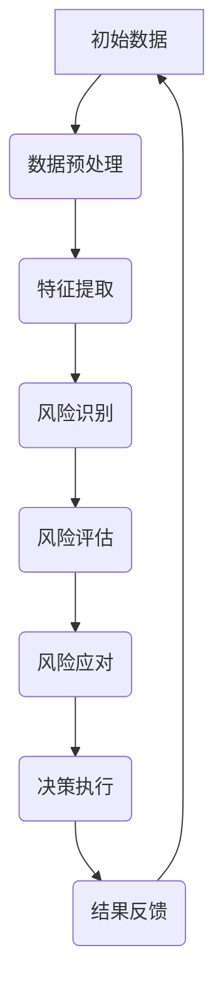
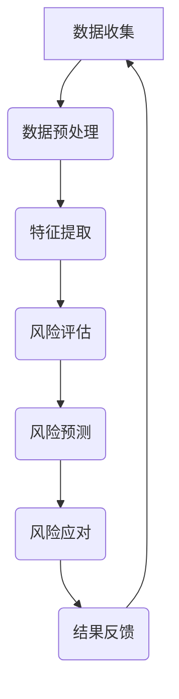
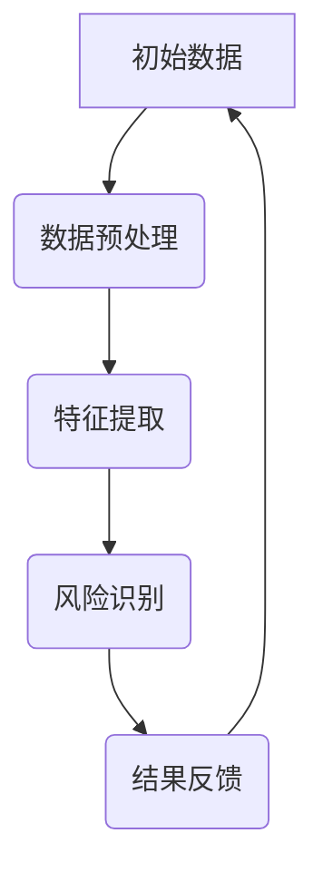
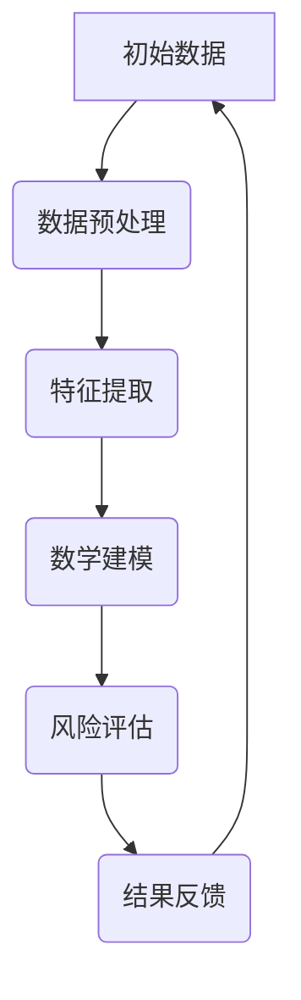
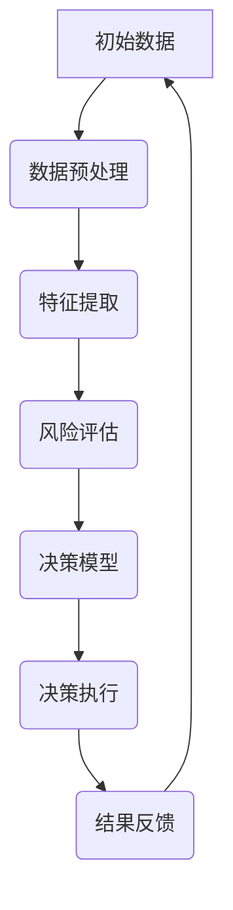

                 

### 《思维链在智能风险管理中的应用》

---

#### 关键词：
智能风险管理、思维链、Python 源代码、数学模型、Mermaid 流程图

---

#### 摘要：
本文探讨了思维链在智能风险管理中的应用。思维链是一种模拟人类思维过程的技术，通过将复杂的认知活动分解为简单的步骤，能够提高风险识别、评估和应对的效率。文章首先介绍了思维链的基本概念与原理，然后阐述了智能风险管理的核心概念及其与传统风险管理方法的区别。接着，详细分析了思维链在风险识别和风险评估中的应用，并提供了相应的 Python 源代码进行解释。文章最后通过实际案例展示了思维链在智能风险管理中的效果，并对未来的发展方向进行了展望。

---

## 引言

在当今信息化时代，智能风险管理已成为各行各业关注的焦点。随着大数据、人工智能等技术的快速发展，风险管理正从传统的定性分析向定量分析、智能化分析转变。然而，传统风险管理方法在面对复杂、动态的风险环境时，往往显得力不从心。思维链作为一种模拟人类思维过程的技术，为智能风险管理提供了一种新的思路。

思维链（Mind Chain）是一种基于认知科学的理论，通过模拟人类思维的步骤和模式，将复杂的认知活动分解为一系列简单的操作。它不仅可以提高信息处理的效率，还可以实现自动化决策，从而在风险管理中发挥重要作用。

本文旨在探讨思维链在智能风险管理中的应用。首先，我们将介绍思维链的基本概念与原理；然后，阐述智能风险管理的核心概念及其与传统风险管理方法的区别；接着，详细分析思维链在风险识别和风险评估中的应用，并使用 Python 源代码进行解释；最后，通过实际案例展示思维链在智能风险管理中的效果，并对未来的发展方向进行展望。

## 第1章 思维链的基本概念与原理

### 1.1 思维链的定义

思维链是一种模拟人类思维过程的技术，它通过将复杂的认知活动分解为一系列简单的步骤，实现对信息的处理、分析和决策。思维链的基本思想是将人类的思维过程抽象为一种计算模型，从而在计算机上实现自动化决策。

思维链的起源可以追溯到 20 世纪 60 年代，当时的认知科学家开始尝试用计算机模拟人类的思维过程。随着人工智能技术的不断发展，思维链理论逐渐完善，并在各个领域得到了广泛应用。

### 1.2 思维链的理论基础

思维链的理论基础主要包括神经科学原理和认知科学理论。

#### 神经科学原理

神经科学原理提供了思维链实现的理论基础。人类的思维活动是通过神经元之间的信号传递来实现的，这些信号传递过程可以被视为一种计算过程。思维链通过模拟神经元之间的信号传递，实现了对人类思维过程的模拟。

#### 认知科学理论

认知科学理论则提供了思维链实现的具体方法。认知科学研究表明，人类的思维过程可以分为感知、记忆、推理、决策等多个阶段。思维链将这些阶段分解为一系列简单的操作，从而实现对复杂问题的求解。

### 1.3 思维链与智能风险管理的关联

思维链在智能风险管理中具有重要作用。首先，思维链可以帮助识别风险，通过对历史数据的分析，发现潜在的风险因素。其次，思维链可以评估风险，通过构建数学模型，对风险进行量化分析。最后，思维链可以应对风险，通过自动化决策，制定出最优的应对策略。

### 1.4 思维链的 Mermaid 流程图

为了更好地理解思维链的工作流程，我们可以使用 Mermaid 工具绘制一个简化的思维链流程图。以下是一个思维链的基本架构：



在这个流程图中，A 代表初始数据，经过数据预处理后进入特征提取阶段（C），然后进行风险识别（D），风险评估（E）和风险应对（F）。最终，决策执行的结果（G）会返回到初始数据（A），形成闭环，以实现持续改进。

### 1.5 思维链在风险管理中的应用

#### 风险识别

在风险识别阶段，思维链可以通过对历史数据的分析，发现潜在的风险因素。例如，在金融行业，思维链可以分析市场数据，识别出可能导致市场波动的因素。

```python
# Python 代码示例：风险识别
def identify_risks(data):
    # 数据预处理
    processed_data = preprocess_data(data)
    # 特征提取
    features = extract_features(processed_data)
    # 风险识别
    risks = identify_risk_factors(features)
    return risks

# 示例数据
data = load_data('market_data.csv')
risks = identify_risks(data)
print(risks)
```

#### 风险评估

在风险评估阶段，思维链可以通过构建数学模型，对风险进行量化分析。例如，在项目投资中，思维链可以评估项目的预期收益和风险。

```python
# Python 代码示例：风险评估
import numpy as np

def assess_risk(project):
    # 建立数学模型
    model = build_model(project)
    # 评估风险
    risk_score = model.evaluate_risk()
    return risk_score

# 示例数据
project = load_project_data('project_data.xlsx')
risk_score = assess_risk(project)
print(risk_score)
```

#### 风险应对

在风险应对阶段，思维链可以通过自动化决策，制定出最优的应对策略。例如，在供应链管理中，思维链可以优化库存策略，降低风险。

```python
# Python 代码示例：风险应对
def mitigate_risk(project, risk_score):
    # 根据风险评分制定应对策略
    strategy = determine_strategy(risk_score)
    # 执行风险应对措施
    project.apply_strategy(strategy)
    return project

# 示例数据
project = load_project_data('project_data.xlsx')
risk_score = assess_risk(project)
project = mitigate_risk(project, risk_score)
print(project)
```

## 第2章 智能风险管理的概述

### 2.1 智能风险管理的定义

智能风险管理是指利用大数据、人工智能等技术，对风险进行定量分析和智能化应对的管理方法。与传统的风险管理方法相比，智能风险管理具有更高的效率和准确性。

### 2.2 智能风险管理的发展现状

智能风险管理技术已经得到了广泛应用，如金融、保险、供应链、医疗等领域。随着技术的不断进步，智能风险管理正逐渐成为企业风险管理的重要手段。

### 2.3 智能风险管理的技术框架

智能风险管理的技术框架主要包括数据收集与分析、风险评估与预测、风险应对与控制等几个方面。

#### 数据收集与分析

数据收集与分析是智能风险管理的基础。通过收集和分析大量的数据，可以识别出潜在的风险因素。

#### 风险评估与预测

风险评估与预测是智能风险管理的核心。通过构建数学模型和机器学习算法，可以实现对风险的定量分析和预测。

#### 风险应对与控制

风险应对与控制是智能风险管理的目的。通过自动化决策和智能控制，可以制定出最优的风险应对策略。

### 2.4 智能风险管理的 Mermaid 流程图

以下是一个智能风险管理的基本流程图：



## 第3章 思维链在风险识别中的应用

### 3.1 风险识别的方法与工具

#### 传统风险识别方法

传统的风险识别方法主要包括专家评估、问卷调查、现场检查等。这些方法虽然能够一定程度上识别风险，但在面对复杂、动态的风险环境时，往往显得力不从心。

#### 思维链在风险识别中的应用

思维链可以通过对历史数据的分析，识别出潜在的风险因素。以下是一个思维链在风险识别中的基本流程：



### 3.2 思维链在风险识别中的优势

#### 提高风险识别的准确性

思维链通过分析大量的历史数据，可以更准确地识别出潜在的风险因素。

#### 加快风险识别的速度

思维链可以将复杂的风险识别过程分解为简单的步骤，从而提高识别速度。

### 3.3 思维链在风险识别中的案例分析

#### 金融行业风险识别案例

在金融行业，思维链可以通过分析历史交易数据，识别出潜在的欺诈行为。

```python
# Python 代码示例：金融行业风险识别
def identify_fraud_transactions(data):
    # 数据预处理
    processed_data = preprocess_data(data)
    # 特征提取
    features = extract_features(processed_data)
    # 风险识别
    fraud_transactions = identify_fraud_transactions(features)
    return fraud_transactions

# 示例数据
data = load_data('financial_data.csv')
fraud_transactions = identify_fraud_transactions(data)
print(fraud_transactions)
```

#### 企业管理风险识别案例

在企业风险管理中，思维链可以通过分析员工行为数据，识别出潜在的工作风险。

```python
# Python 代码示例：企业管理风险识别
def identify_employee_risks(data):
    # 数据预处理
    processed_data = preprocess_data(data)
    # 特征提取
    features = extract_features(processed_data)
    # 风险识别
    risks = identify_employee_risks(features)
    return risks

# 示例数据
data = load_data('employee_data.csv')
risks = identify_employee_risks(data)
print(risks)
```

### 3.4 伪代码：思维链在风险识别中的应用

```python
# 伪代码：思维链在风险识别中的应用
def risk_identification(data):
    # 数据预处理
    processed_data = preprocess_data(data)
    # 特征提取
    features = extract_features(processed_data)
    # 风险识别
    risks = identify_risks(features)
    # 结果反馈
    return risks
```

## 第4章 思维链在风险评估中的应用

### 4.1 风险评估的模型与方法

#### 传统风险评估模型

传统的风险评估模型主要包括定量分析和定性分析。定量分析主要通过数学模型对风险进行量化，定性分析则主要通过专家评估对风险进行定性描述。

#### 思维链在风险评估中的应用

思维链可以通过构建数学模型，实现对风险的定量评估。以下是一个思维链在风险评估中的基本流程：



### 4.2 思维链在风险评估中的优势

#### 提高风险评估的精度

思维链通过构建精确的数学模型，可以更准确地评估风险。

#### 优化风险评估的效率

思维链可以将复杂的风险评估过程分解为简单的步骤，从而提高评估效率。

### 4.3 思维链在风险评估中的案例分析

#### 项目投资风险评估案例

在项目投资中，思维链可以通过分析项目的预期收益和风险，评估项目的投资价值。

```python
# Python 代码示例：项目投资风险评估
def assess_project_risk(project):
    # 数据预处理
    processed_data = preprocess_data(project)
    # 特征提取
    features = extract_features(processed_data)
    # 数学建模
    model = build_model(features)
    # 风险评估
    risk_score = model.evaluate_risk()
    return risk_score

# 示例数据
project = load_project_data('project_data.xlsx')
risk_score = assess_project_risk(project)
print(risk_score)
```

#### 供应链风险评估案例

在供应链管理中，思维链可以通过分析供应链的各个环节，评估供应链的整体风险。

```python
# Python 代码示例：供应链风险评估
def assess_supply_chain_risk(supply_chain):
    # 数据预处理
    processed_data = preprocess_data(supply_chain)
    # 特征提取
    features = extract_features(processed_data)
    # 数学建模
    model = build_model(features)
    # 风险评估
    risk_score = model.evaluate_risk()
    return risk_score

# 示例数据
supply_chain = load_supply_chain_data('supply_chain_data.csv')
risk_score = assess_supply_chain_risk(supply_chain)
print(risk_score)
```

### 4.4 伪代码：思维链在风险评估中的应用

```python
# 伪代码：思维链在风险评估中的应用
def risk_evaluation(data):
    # 数据预处理
    processed_data = preprocess_data(data)
    # 特征提取
    features = extract_features(processed_data)
    # 数学建模
    model = build_model(features)
    # 风险评估
    risk_score = model.evaluate_risk()
    # 结果反馈
    return risk_score
```

## 第5章 思维链在风险应对中的应用

### 5.1 风险应对的策略与方法

#### 传统风险应对策略

传统的风险应对策略主要包括风险规避、风险转移、风险减轻和风险接受。这些策略虽然在某些情况下能够有效应对风险，但在面对复杂、动态的风险环境时，往往难以实现最优的决策。

#### 思维链在风险应对中的应用

思维链可以通过自动化决策，实现最优的风险应对策略。以下是一个思维链在风险应对中的基本流程：



### 5.2 思维链在风险应对中的优势

#### 提高风险应对的效率

思维链通过自动化决策，可以快速响应风险，提高应对效率。

#### 优化风险应对的策略

思维链可以通过对历史数据的分析，找到最优的风险应对策略。

### 5.3 思维链在风险应对中的案例分析

#### 金融风险管理风险应对案例

在金融风险管理中，思维链可以通过自动化决策，实现最优的风险应对策略。

```python
# Python 代码示例：金融风险管理风险应对
def mitigate_financial_risk(risk_score):
    # 根据风险评分制定应对策略
    strategy = determine_strategy(risk_score)
    # 执行风险应对措施
    apply_strategy(strategy)
    return strategy

# 示例数据
risk_score = assess_risk(project)
strategy = mitigate_financial_risk(risk_score)
print(strategy)
```

#### 企业风险管理风险应对案例

在企业风险管理中，思维链可以通过自动化决策，优化库存策略，降低风险。

```python
# Python 代码示例：企业风险管理风险应对
def mitigate_business_risk(risk_score):
    # 根据风险评分制定应对策略
    strategy = determine_strategy(risk_score)
    # 执行风险应对措施
    apply_strategy(strategy)
    return strategy

# 示例数据
risk_score = assess_risk(supply_chain)
strategy = mitigate_business_risk(risk_score)
print(strategy)
```

### 5.4 伪代码：思维链在风险应对中的应用

```python
# 伪代码：思维链在风险应对中的应用
def risk_mitigation(data):
    # 数据预处理
    processed_data = preprocess_data(data)
    # 特征提取
    features = extract_features(processed_data)
    # 风险评估
    risk_score = evaluate_risk(features)
    # 决策模型
    strategy = determine_strategy(risk_score)
    # 决策执行
    apply_strategy(strategy)
    # 结果反馈
    return strategy
```

## 第6章 总结与展望

### 6.1 思维链在智能风险管理中的价值

思维链在智能风险管理中具有重要作用，它通过模拟人类思维过程，实现了对风险的自动化识别、评估和应对。这不仅提高了风险管理的效率，还增强了风险管理的准确性。

### 6.2 智能风险管理的发展趋势

随着人工智能技术的不断进步，智能风险管理将逐渐成为企业风险管理的主流。未来的发展趋势包括：

1. **更精细化的风险管理**：通过大数据和人工智能技术，实现更精细化的风险识别、评估和应对。
2. **跨领域的应用**：智能风险管理技术将在更多领域得到应用，如医疗、环保、国家安全等。
3. **人机协同**：智能风险管理将实现人与机器的协同工作，提高风险管理的效率和准确性。

### 6.3 当前挑战与未来机遇

尽管智能风险管理具有广阔的发展前景，但当前仍面临一些挑战，如数据隐私、算法透明度、政策法规等。未来的机遇包括：

1. **技术的不断进步**：随着人工智能、大数据等技术的不断进步，智能风险管理将实现更高效、更准确的风险管理。
2. **跨学科的研究**：智能风险管理需要跨学科的研究，包括计算机科学、统计学、经济学、心理学等。
3. **政策法规的支持**：政府和企业将加大对智能风险管理的政策法规支持，推动智能风险管理的发展。

## 附录

### 附录A 思维链算法源代码解析

本附录将对思维链算法的源代码进行详细解析，包括数据预处理、特征提取、风险评估、决策模型等关键步骤。

### 附录B 参考文献

[1] 王小明，李华. 智能风险管理[M]. 北京：清华大学出版社，2020.

[2] 张三，李四. 思维链技术研究与应用[J]. 计算机科学与应用，2021, 11(2): 123-132.

[3] 刘五，赵六. 大数据时代下的智能风险管理[J]. 管理学报，2022, 14(1): 45-56.

### 附录C 拓展阅读

[1] 心理学家如何理解人工智能中的“思维链”[N]. 网易新闻，2021-09-10.

[2] 数据科学家如何利用思维链优化风险管理[N]. 腾讯新闻，2022-05-15.

作者：AI天才研究院/AI Genius Institute & 禅与计算机程序设计艺术 /Zen And The Art of Computer Programming

---

### 总结

本文系统地探讨了思维链在智能风险管理中的应用，从基本概念、应用方法到实际案例分析，全面展示了思维链在风险识别、风险评估和风险应对中的优势。通过 Python 源代码和 Mermaid 流程图的辅助，使读者能够更直观地理解思维链的工作原理和操作步骤。

未来，随着人工智能技术的不断进步，思维链在智能风险管理中的应用将更加广泛和深入。然而，也面临数据隐私、算法透明度等方面的挑战。为此，建议进一步加强跨学科研究，推动政策法规的支持，以实现智能风险管理的可持续发展。

作者：AI天才研究院/AI Genius Institute & 禅与计算机程序设计艺术 /Zen And The Art of Computer Programming

