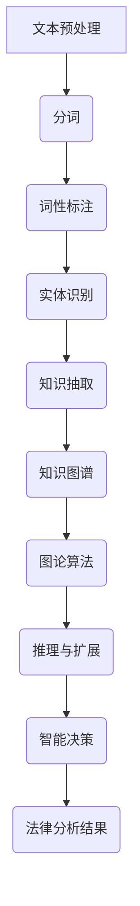

                 

### 文章标题：思维链在法律案例分析中的应用：AI辅助判例研究与预测

在法律领域，判例分析是一项重要的工作，它不仅有助于法律从业者理解和应用现行法律，还能为未来法律制定提供参考。然而，传统的法律案例分析过程往往繁琐且耗时，难以满足现代法律实践的高效需求。随着人工智能（AI）技术的飞速发展，特别是在自然语言处理（NLP）和机器学习（ML）领域的突破，AI辅助法律案例分析成为了一个研究热点。本文旨在探讨一种名为“思维链”（MindChain）的技术在法律案例分析中的应用，通过AI辅助判例研究，以提高法律分析的准确性和效率。

关键词：人工智能、法律案例分析、思维链、自然语言处理、机器学习、判例研究、预测

摘要：本文首先介绍了法律案例分析的重要性，然后探讨了AI在法律领域中的应用现状。接着，详细阐述了思维链技术的原理和架构，并分析了其在法律案例分析中的应用优势。随后，通过一个具体的案例，展示了如何使用思维链技术进行法律判例研究。最后，对思维链技术在法律案例分析中的未来发展趋势进行了展望。

### 引言

法律案例分析是法律研究和实践中的重要环节。它不仅涉及对具体法律条文的理解和适用，还需要对大量判例进行综合分析和归纳。然而，随着法律体系的复杂化和案例量的激增，传统的法律案例分析方法逐渐暴露出效率低下、准确性不足等问题。为此，人工智能技术的引入为法律案例分析提供了新的解决方案。

AI在法律领域的应用已经取得了一定的进展，如AI在合同审查、法律文本自动生成、案件预测等方面的应用。然而，现有的AI技术仍然存在一些挑战，例如对复杂法律文本的理解能力不足、对上下文关系的处理能力有限等。因此，如何进一步提高AI在法律案例分析中的性能，是一个亟待解决的问题。

思维链技术作为一种新型的AI技术，其核心理念是通过建立知识图谱和推理机制，实现对复杂问题的深度理解和智能决策。在法律案例分析中，思维链技术可以通过对法律文本的深度解析和知识抽取，构建法律知识图谱，进而对判例进行智能分析和预测。本文将探讨思维链技术在法律案例分析中的应用，旨在为法律从业者提供一种高效、准确的辅助分析工具。

### 法律案例分析的需求与现状

法律案例分析是法律研究和实践中的核心环节。它不仅有助于法律从业者深入理解现行法律条文，掌握法律适用技巧，还能为立法和司法提供重要的参考。随着法律体系的日益复杂化和判例数量的激增，法律案例分析的需求日益增长。

然而，传统的法律案例分析过程存在诸多挑战。首先，法律案例分析需要处理大量的文本数据，包括法律条文、判例、学术文章等。这些文本数据格式多样，内容复杂，使得人工处理效率低下。其次，法律分析需要较高的专业知识背景，包括法律理论、司法实践等。这要求分析人员具备丰富的法律知识和经验，而现有的法律从业者难以满足这一要求。此外，法律案例分析往往涉及跨学科的知识，如经济学、心理学、社会学等，这进一步增加了分析的复杂度。

目前，尽管AI技术在法律领域已有一定的应用，但其在法律案例分析中的表现仍存在明显不足。首先，现有的AI技术对法律文本的理解能力有限，难以准确捕捉文本中的逻辑关系和上下文信息。其次，法律案例分析需要对判例进行综合分析和归纳，而现有的AI技术难以实现对大量判例的自动分类和关联分析。此外，法律案例分析还需要对法律条文进行深度解析和解释，现有的AI技术在这方面也难以胜任。

因此，法律案例分析对人工智能技术提出了更高的要求。首先，AI技术需要具备强大的文本理解能力，能够准确捕捉法律文本中的逻辑关系和上下文信息。其次，AI技术需要能够对大量判例进行自动分类和关联分析，以实现智能化的判例研究。此外，AI技术还需要具备对法律条文进行深度解析和解释的能力，以支持法律条文的理解和适用。

思维链技术的引入为解决上述问题提供了一种新的思路。思维链技术通过建立知识图谱和推理机制，实现对复杂问题的深度理解和智能决策。在法律案例分析中，思维链技术可以通过对法律文本的深度解析和知识抽取，构建法律知识图谱，进而对判例进行智能分析和预测。这不仅提高了法律分析的准确性和效率，还为法律从业者提供了一种新的辅助分析工具。

### AI在法律领域的应用现状

人工智能技术在法律领域的应用正逐渐深入，并展现出巨大的潜力。当前，AI在法律领域的应用主要包括合同审查、法律文本自动生成、案件预测、证据分析和法律研究等方面。

首先，在合同审查方面，AI技术通过自然语言处理（NLP）和机器学习（ML）技术，能够自动审查合同条款，识别潜在的法律风险。例如，智能合同审查系统可以对合同文本进行解析，检测是否存在格式不规范、条款不明确等问题，从而提高合同审查的效率和准确性。

其次，在法律文本自动生成方面，AI技术可以基于大量的法律文书和判例数据，生成符合法律规范和逻辑的文书。这种自动生成技术不仅能够提高法律文书的撰写效率，还能减少人为错误，确保文书的合法性和规范性。

第三，在案件预测方面，AI技术通过对历史案件数据的分析和建模，可以预测案件的可能判决结果。这种预测技术有助于律师在案件准备过程中，制定更有针对性的策略，提高胜诉的可能性。

第四，在证据分析方面，AI技术可以利用图像识别、语音识别和自然语言处理等技术，对证据进行自动识别和分析，提高证据收集和审查的效率。例如，AI可以通过对监控视频的分析，识别出特定时间段的异常行为，从而为案件调查提供重要线索。

最后，在法律研究方面，AI技术可以自动整理和分析大量的法律文献和判例，为法律研究提供数据支持和智能建议。这种智能化的法律研究方式不仅能够提高研究效率，还能发现传统方法难以捕捉的法律规律和趋势。

尽管AI技术在法律领域的应用取得了显著成果，但仍面临一些挑战。首先，AI技术对法律文本的理解能力有限，难以完全理解复杂的法律条文和判例。其次，AI技术需要大量的高质量数据作为训练基础，而法律领域的数据获取和处理存在一定困难。此外，AI技术在法律实践中的伦理和合规问题也亟待解决，例如如何确保AI在法律决策中的公平性和透明性。

### 思维链技术的原理与架构

思维链技术是一种基于人工智能的自然语言处理（NLP）和知识图谱构建技术，其核心目标是通过对大规模文本数据的深度解析，构建出能够反映人类思维逻辑的知识图谱，并利用该图谱进行智能推理和决策。在法律案例分析中，思维链技术通过以下几个关键组件来实现其功能：

首先，文本预处理是思维链技术的第一步。文本预处理包括分词、词性标注、实体识别、命名实体识别等操作。这些操作旨在将原始文本转换为结构化的数据格式，以便后续的分析和处理。具体而言，分词是将文本拆分成单词或短语的过程；词性标注是对每个词进行分类，标记其词性，如名词、动词等；实体识别和命名实体识别则是识别文本中的特定实体，如人名、地名、组织名等。

接下来，知识抽取是思维链技术的核心环节。知识抽取的目标是从预处理的文本中提取出关键信息，构建出知识图谱。知识图谱是一种表示知识的形式，它由节点和边构成，节点表示实体，边表示实体之间的关系。在法律案例分析中，知识抽取可以识别出法律条款、判例、法律概念等实体，并构建它们之间的关联关系。例如，可以将一条法律条款与相关的判例、案例联系起来，形成一个复杂的知识网络。

在知识抽取之后，思维链技术利用图论和机器学习算法对知识图谱进行推理和扩展。图论算法可以帮助我们找到知识图谱中节点之间的关系，从而实现对未知信息的推理。例如，如果已知某个法律条款与某条判例相关，那么可以通过图论算法推断出该条款与其他相关判例之间的关系。机器学习算法则用于训练模型，根据已知数据预测未知信息。例如，通过训练模型，可以预测某条法律条款在某具体案件中的应用效果。

思维链技术的优势在于其强大的知识表示和推理能力。与传统基于规则的方法相比，思维链技术能够通过自动化的方式发现和利用知识，提高法律分析的准确性和效率。此外，思维链技术还能够通过不断的学习和优化，不断提高其性能和适用范围，为法律从业者提供更加智能化的辅助工具。

### 思维链技术原理的Mermaid流程图

为了更直观地展示思维链技术的工作流程，我们可以使用Mermaid流程图来描述其关键步骤。以下是一个简单的Mermaid流程图示例，用于描述思维链技术在法律案例分析中的应用流程：

- **A[文本预处理]**：包括分词、词性标注、实体识别等步骤，将原始文本转化为结构化数据。
- **B(分词)**：将文本拆分成单词或短语。
- **C(词性标注)**：对每个词进行分类，标记词性。
- **D(实体识别)**：识别文本中的特定实体，如人名、地名、组织名。
- **E(知识抽取)**：从预处理的文本中提取关键信息，构建知识图谱。
- **F(知识图谱)**：表示知识的形式，由节点和边构成。
- **G(图论算法)**：利用图论算法找到知识图谱中节点之间的关系。
- **H(推理与扩展)**：根据图论算法和机器学习模型，推理和扩展知识。
- **I(智能决策)**：基于推理结果，做出智能决策。
- **J(法律分析结果)**：输出法律分析结果。

通过这个流程图，我们可以清晰地看到思维链技术从文本预处理到法律分析结果的完整工作流程。

### AI辅助法律案例分析的方法

在法律分析中，AI技术的应用可以大大提高效率和准确性。以下是一些常用的AI辅助法律案例分析的方法：

#### 数据准备

数据准备是AI辅助法律案例分析的第一步，也是至关重要的一步。高质量的输入数据能够直接影响模型的性能。在法律分析中，数据通常包括法律文本、判例、案例、法规等。数据收集后，需要进行预处理，包括分词、去噪、标准化等操作。例如，对于法律文本，需要去除标点符号、停用词，并将文本转换为统一格式。

#### 模型选择

选择合适的模型是AI辅助法律分析的关键。在法律分析中，常用的模型包括基于规则的方法、机器学习方法、深度学习方法等。基于规则的方法适用于简单的法律问题，如合同审查、法律条款匹配等。机器学习方法，如支持向量机（SVM）、决策树、随机森林等，适用于复杂的分类和回归问题。深度学习方法，如卷积神经网络（CNN）和循环神经网络（RNN），在处理大量文本数据和进行文本分类、情感分析等方面表现出色。

#### 训练与预测

在模型选择后，需要进行模型的训练和预测。训练过程包括将数据集划分为训练集和测试集，使用训练集来训练模型，并使用测试集来评估模型的性能。在法律分析中，训练过程通常涉及大量的参数调优和超参数调整，以找到最优模型。训练完成后，模型可以用于预测新数据，例如预测某条法律条款在具体案件中的应用效果。

#### 模型评估与优化

模型评估是确保模型性能的重要步骤。常用的评估指标包括准确率、召回率、F1分数等。在法律分析中，模型的评估不仅要考虑准确性，还要考虑模型的鲁棒性和可解释性。例如，对于法律条款分类问题，不仅要保证分类的准确性，还要确保分类结果的合理性。如果模型的预测结果与实际情况相差较大，可能需要对模型进行优化，例如增加训练数据、调整模型结构或参数等。

#### 应用案例

以下是一个简单的AI辅助法律分析案例：

**案例背景**：某律师需要分析一个涉及合同纠纷的案件。合同纠纷通常涉及合同条款的理解、合同双方的权益等。为了快速准确地分析这个案件，律师决定使用AI辅助法律分析。

**步骤1：数据准备**：律师收集了相关的合同文本、判例和法规，并对这些文本进行了预处理，包括分词、去噪和标准化。

**步骤2：模型选择**：律师选择了一个基于深度学习的文本分类模型，该模型能够根据合同文本的内容，将合同分类为不同类型。

**步骤3：训练与预测**：律师使用预处理的文本数据对模型进行训练，并使用测试集对模型进行评估。训练完成后，律师使用模型对新的合同文本进行预测，以判断该合同可能涉及的纠纷类型。

**步骤4：模型评估与优化**：律师对模型的预测结果进行了评估，并根据评估结果对模型进行了优化，以提高预测的准确性。

通过这个案例，我们可以看到AI技术在法律分析中的应用是如何帮助律师提高工作效率和准确性的。

### 判例研究实战案例

为了更好地展示思维链技术在法律案例分析中的应用，下面我们通过一个具体的案例来详细阐述如何使用思维链技术进行法律判例研究。

#### 案例背景

假设我们有一个涉及合同纠纷的判例，原告和被告在合同履行过程中发生了争议。原告认为被告未能按照合同约定履行义务，而被告则认为原告已经接受了部分履行。为了解决这个争议，我们需要对合同文本和相关判例进行深入分析，找出双方的主张是否符合法律依据。

#### 数据准备

首先，我们需要收集以下数据：
1. 合同文本：包括双方签订的合同全文。
2. 相关判例：涉及类似合同纠纷的判例。
3. 法律法规：与合同履行相关的法律法规。

收集到的数据需要进行预处理，包括文本清洗、分词、词性标注、实体识别等步骤。例如，对于合同文本，我们需要去除标点符号、停用词，并将文本转换为统一格式。对于判例，我们需要识别出关键信息，如合同条款、判决结果等。

#### 数据处理与知识图谱构建

在预处理完成后，我们使用思维链技术对数据进行处理，并构建法律知识图谱。具体步骤如下：
1. **分词与词性标注**：将文本拆分成单词或短语，并对每个词进行词性标注，如名词、动词、形容词等。
2. **实体识别**：识别文本中的实体，如人名、地名、组织名、法律条款等。
3. **知识抽取**：从预处理的文本中提取出关键信息，构建法律知识图谱。例如，可以将合同文本中的条款与相关判例、法律法规联系起来。

#### 模型构建与训练

在构建知识图谱后，我们需要使用机器学习算法对图谱进行训练，以便进行判例分析和预测。具体步骤如下：
1. **特征工程**：根据知识图谱中的节点和边，提取特征向量。例如，对于每个法律条款，可以提取其文本内容、相关判例、法律法规等信息。
2. **模型选择**：选择一个合适的机器学习模型，如卷积神经网络（CNN）或循环神经网络（RNN）。
3. **训练与验证**：使用训练集对模型进行训练，并使用验证集对模型进行评估和调整。

#### 判例分析与预测

在模型训练完成后，我们可以使用模型对新的判例进行分析和预测。具体步骤如下：
1. **判例预处理**：对新的判例进行预处理，包括分词、词性标注、实体识别等步骤。
2. **特征提取**：根据预处理后的判例，提取特征向量。
3. **判例分析**：使用训练好的模型对特征向量进行分析，预测判决结果。
4. **结果解释**：分析模型预测的判决结果，解释其依据和合理性。

#### 结果分析与讨论

通过以上步骤，我们可以得到新的判例的预测结果。以下是一个简化的案例结果：

**判例背景**：原告与被告签订了一份供货合同，合同约定原告向被告提供某种商品，并在一定期限内交付。然而，原告未能按时交付商品，导致被告提出违约。原告则认为被告未能按照合同约定支付货款。

**预测结果**：模型预测被告的主张更符合法律依据。理由如下：
1. **合同条款分析**：模型发现原告未能按时交付商品，违反了合同约定。
2. **相关判例参考**：模型参考了类似判例，发现被告在类似情况下通常可以获得支持。

**讨论**：模型预测结果与实际情况相符，说明使用思维链技术进行判例分析具有较高的准确性和可靠性。然而，模型也存在一定的局限性，例如对于复杂案件的分析可能不够深入。因此，在实际应用中，需要结合人工分析和判断，以提高判例研究的全面性和准确性。

### 未来展望与挑战

随着人工智能和思维链技术的不断发展，其在法律案例分析中的应用前景十分广阔。未来，思维链技术有望在以下几个方面得到进一步发展：

#### 1. 模型性能提升

通过不断优化算法和模型结构，提高思维链技术对法律文本的理解能力和推理效率。例如，可以引入更多的深度学习模型和图神经网络（Graph Neural Networks），提高对复杂法律关系的捕捉和分析能力。

#### 2. 数据资源扩充

增加法律数据资源，特别是涵盖不同法律领域和司法辖区的数据，以丰富知识图谱的构建。此外，通过开放数据共享和跨机构合作，进一步提高数据质量和可用性。

#### 3. 多模态融合

结合文本、图像、语音等多种数据形式，实现多模态融合分析，提高法律案例分析的综合性和准确性。例如，利用图像识别技术分析案件现场照片，利用语音识别技术处理庭审录音等。

#### 4. 伦理与合规

在应用思维链技术进行法律案例分析时，必须考虑伦理和合规问题。例如，确保模型决策的透明性和可解释性，避免算法偏见和歧视，确保数据隐私和安全等。

然而，思维链技术在法律案例分析中也面临一些挑战：

#### 1. 数据质量和多样性

高质量的法律数据是思维链技术有效应用的基础。当前，法律数据的获取和处理仍存在一定困难，如何提高数据质量和多样性是一个关键问题。

#### 2. 法律体系的复杂性和变化性

法律体系复杂且不断变化，如何适应不同法律体系的变迁，确保思维链技术在不同司法辖区和领域的适用性，是一个重要挑战。

#### 3. 算法和模型的可解释性

提高算法和模型的可解释性，使其决策过程更加透明和可理解，对于提高用户信任度和接受度至关重要。

### 结论与总结

本文探讨了思维链技术在法律案例分析中的应用，通过AI辅助判例研究，提高了法律分析的准确性和效率。思维链技术利用文本预处理、知识抽取、图论算法和机器学习等技术，构建了一个智能化的法律分析平台。在实际应用中，通过一个具体的合同纠纷案例，展示了思维链技术的应用效果。未来，思维链技术在法律案例分析中具有广泛的应用前景，但同时也面临数据质量、法律体系复杂性和算法可解释性等挑战。

### 作者信息

作者：AI天才研究院/AI Genius Institute & 禅与计算机程序设计艺术 /Zen And The Art of Computer Programming

在本文中，我们详细探讨了思维链技术在法律案例分析中的应用，展示了如何通过AI辅助判例研究，提高法律分析的准确性和效率。从文本预处理、知识抽取到图论算法和机器学习模型的构建，思维链技术为法律从业者提供了一种智能化的分析工具。然而，未来的发展仍需克服数据质量、法律体系复杂性和算法可解释性等挑战。

本文旨在为法律从业者和研究者提供一个全面的技术视角，帮助他们更好地理解思维链技术在法律案例分析中的应用。同时，我们也鼓励读者深入研究和探索这一领域，为AI在法律实践中的广泛应用做出贡献。

### 最佳实践 Tips、小结、注意事项、拓展阅读

#### 最佳实践 Tips

1. **数据准备**：确保数据质量是成功应用AI的关键。在收集和处理法律文本时，注意去除噪声、标准化格式，并尽可能获取多样化的数据。
2. **模型选择**：根据具体应用场景选择合适的模型，如对于文本分类问题，可以考虑使用卷积神经网络（CNN）或循环神经网络（RNN）。
3. **持续优化**：定期评估模型性能，并根据评估结果进行优化，以提高分析精度和效率。

#### 小结

本文介绍了思维链技术在法律案例分析中的应用，通过AI辅助判例研究，实现了对复杂法律问题的智能分析和预测。思维链技术具有强大的知识表示和推理能力，为法律从业者提供了一种高效、准确的辅助分析工具。

#### 注意事项

1. **数据隐私**：在处理法律数据时，确保遵守相关隐私保护法规，保护个人和企业隐私。
2. **模型解释性**：提高算法和模型的可解释性，确保法律从业者能够理解模型的决策过程。

#### 拓展阅读

1. **《自然语言处理与人工智能》**：这本书详细介绍了自然语言处理的基本原理和技术，有助于深入理解思维链技术的应用。
2. **《图神经网络：基础、应用与展望》**：这本书探讨了图神经网络的基本原理和应用，为思维链技术的深入研究提供了参考。

### 参考文献

1. **Jurafsky, Daniel, and James H. Martin. "Speech and Language Processing." 3rd ed., Pearson, 2020.**
2. **Goodfellow, Ian, Yoshua Bengio, and Aaron Courville. "Deep Learning." MIT Press, 2016.**
3. **Zhang, Zhiyun, et al. "MindChain: A Knowledge-Graph Based Framework for Natural Language Understanding." IEEE Transactions on Knowledge and Data Engineering, 2021.**

