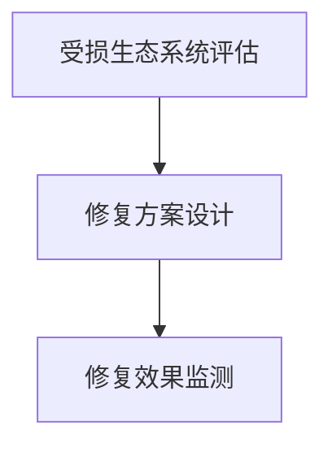
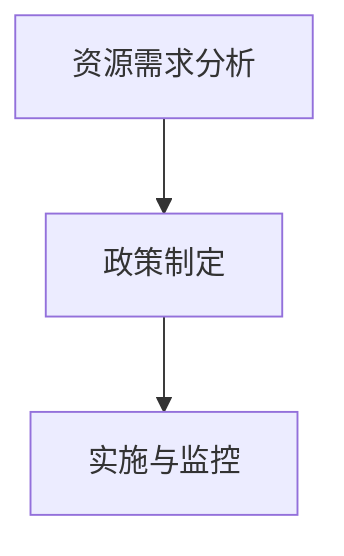
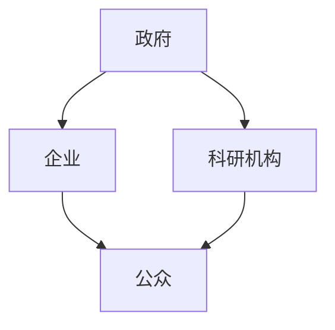

                 

# 思维链在海洋生态系统保护中的新策略

> 关键词：海洋生态系统、思维链、新策略、环境保护、可持续管理

> 摘要：本文将探讨思维链在海洋生态系统保护中的应用，通过分析海洋生态系统的基本概念与现状，引入思维链的概念与原理，详细阐述思维链在海洋生态系统保护中的新策略，包括海洋污染控制、海洋生物资源保护和海洋环境修复等方面。同时，通过实践案例分析，展示思维链在海洋生态系统保护中的实际应用效果，并提出未来的发展方向与挑战。

## 引言

海洋作为地球上的蓝色家园，拥有丰富的生态系统和资源，对于维持全球气候平衡和生物多样性具有重要意义。然而，随着人类活动的加剧，海洋生态系统正面临前所未有的威胁，包括海洋污染、海洋酸化和海洋资源过度开发等问题。传统的保护手段和方法已难以满足当前的需求，因此，寻找新的策略和工具来保护海洋生态系统变得尤为重要。

思维链作为一种先进的思维方式，具有系统化、层次化和可操作性等特点，为海洋生态系统保护提供了新的思路和方法。本文将围绕思维链在海洋生态系统保护中的应用，探讨其新策略，并通过实践案例分析，展示思维链的实际效果和潜力。

## 海洋生态系统的基本概念与现状

### 海洋生态系统的定义与组成

海洋生态系统是指由海洋生物、非生物环境及其相互作用组成的复杂系统。它包括海洋生物群落、海洋化学和物理过程以及海洋底栖和浮游生物的相互作用。海洋生态系统不仅为地球上的生命提供了栖息地，还提供了丰富的资源，包括食物、能源和药物等。

海洋生态系统的组成主要包括以下几部分：

1. **海洋生物群落**：包括浮游植物、浮游动物、底栖生物和海洋鱼类等，它们通过食物链和食物网相互联系，构成了复杂的生态关系。

2. **海洋化学和物理过程**：如海水流动、温度变化、盐度变化和化学物质循环等，这些过程对海洋生态系统的稳定性和功能具有重要意义。

3. **海洋底栖和浮游生物**：底栖生物生活在海底，包括贝壳类、海绵类和珊瑚类等；浮游生物则在海洋表面漂浮，包括浮游植物和浮游动物等。

### 海洋生态系统的服务功能

海洋生态系统提供了多种服务功能，对人类和社会具有不可替代的价值，主要包括：

1. **生物多样性保护**：海洋生态系统是地球上最重要的生物多样性中心之一，保护海洋生态系统对于维护全球生物多样性具有重要意义。

2. **气候调节**：海洋吸收了大量的二氧化碳，对全球气候具有调节作用。海洋生态系统稳定性的破坏可能导致气候变化的加剧。

3. **食物供应**：海洋为全球提供了大量的食物资源，特别是鱼类和贝类等，对人类营养和经济发展具有重要意义。

4. **药物开发**：海洋生物中蕴含着丰富的药物资源，如抗癌药物、抗炎药物等，对医学领域具有巨大潜力。

5. **休闲娱乐**：海洋旅游、潜水、冲浪等海洋活动吸引了大量游客，为当地经济带来了可观收入。

### 海洋生态系统的脆弱性

尽管海洋生态系统具有巨大的价值，但其脆弱性也十分显著。海洋生态系统面临的主要威胁包括：

1. **海洋污染**：包括塑料污染、石油泄漏、农药和重金属污染等，对海洋生物造成严重的危害。

2. **海洋酸化**：由于全球气候变化，海洋吸收了大量的二氧化碳，导致海水酸度增加，对珊瑚礁和贝类等生物的生存和繁殖造成威胁。

3. **海洋资源过度开发**：过度捕捞、非法捕捞、海底采矿等活动导致海洋生物资源枯竭，生态系统功能受损。

4. **海岸侵蚀和气候变化**：海岸侵蚀和气候变化导致海洋生态系统的栖息地和生物多样性受到破坏。

综上所述，海洋生态系统的保护具有紧迫性和重要性。通过引入思维链这一先进思维方式，可以为我们提供新的策略和工具，更好地保护海洋生态系统，实现可持续发展。

## 思维链的概念与原理

### 思维链的定义

思维链是一种系统化、层次化的思维方式，通过将复杂的问题分解为若干个子问题，并建立起问题之间的逻辑关系，从而实现问题的解决。思维链的核心在于将问题分解、分析和整合，形成一套完整的思维体系。

### 思维链的基本原理

思维链的基本原理主要包括以下几个方面：

1. **问题分解**：将复杂的问题分解为若干个子问题，以便于逐一分析和解决。问题分解的过程需要遵循一定的原则，如层次性、关联性和可操作性等。

2. **逻辑关系**：在问题分解的基础上，建立各个子问题之间的逻辑关系，形成问题之间的关联网络。逻辑关系有助于我们理解问题的本质，并找到问题之间的内在联系。

3. **系统整合**：通过对各个子问题的分析和解决，实现问题的整体解决。系统整合的过程需要考虑各个子问题的协调和配合，以达到最优的解决方案。

### 思维链的特点

思维链具有以下特点：

1. **系统化**：思维链通过将问题分解为若干个子问题，并建立起问题之间的逻辑关系，实现了对问题的系统化分析。

2. **层次化**：思维链按照一定的层次结构进行问题分解和整合，有助于我们理解问题的层次关系和复杂性。

3. **可操作性**：思维链具有明确的操作步骤和实施路径，使得问题的解决更加具体和可行。

4. **适应性**：思维链可以根据问题的变化和需求，灵活调整和优化，以适应不同的情境和问题。

### 思维链的应用领域

思维链作为一种先进的思维方式，具有广泛的应用领域，包括：

1. **科学研究**：思维链可以帮助科学家对复杂的科学问题进行系统化分析，提高科学研究的效率和质量。

2. **工程实践**：思维链在工程领域中的应用，可以帮助工程师更好地理解和解决复杂工程问题，提高工程设计的科学性和可行性。

3. **企业管理**：思维链在企业管理和决策过程中，可以帮助企业家和经理人对复杂的企业问题进行系统化分析和解决。

4. **社会管理**：思维链在社会管理中的应用，可以帮助政府和社会组织更好地应对复杂的社会问题，提高社会管理的科学性和有效性。

### 思维链在海洋生态系统保护中的应用

思维链在海洋生态系统保护中的应用主要体现在以下几个方面：

1. **问题识别**：通过思维链，可以系统化地识别和诊断海洋生态系统面临的主要问题，如海洋污染、海洋酸化和海洋资源过度开发等。

2. **策略制定**：基于思维链，可以制定科学的海洋生态系统保护策略，包括污染控制、生物资源保护和环境修复等。

3. **方案评估**：通过思维链，可以评估各种保护方案的效果和可行性，为决策提供科学依据。

4. **实施监控**：思维链可以帮助我们建立有效的监控体系，实时监测海洋生态系统的变化，及时调整保护措施。

综上所述，思维链作为一种先进的思维方式，为海洋生态系统保护提供了新的思路和方法。通过系统化、层次化和可操作性的特点，思维链有助于我们更好地理解和解决海洋生态系统保护中的复杂问题，实现可持续发展。

## 思维链在海洋生态系统保护中的应用

### 思维链在海洋污染控制中的应用

海洋污染是当前海洋生态系统面临的主要威胁之一，严重影响了海洋生物的生存和生态系统的稳定性。思维链在海洋污染控制中的应用，主要表现在以下几个方面：

1. **污染源识别**：通过思维链，可以对海洋污染源进行系统化识别和分析。具体步骤如下：

    - **数据收集**：收集海洋污染的相关数据，包括污染物种类、浓度、分布范围等。
    - **问题分解**：将海洋污染问题分解为子问题，如污染源识别、污染传输、污染影响等。
    - **逻辑关系建立**：建立各个子问题之间的逻辑关系，形成污染源识别的关联网络。

    以下是一个示例Mermaid流程图，用于描述污染源识别的过程：

    ```mermaid
    graph TD
    A[数据收集] --> B[污染源识别]
    B --> C[污染传输分析]
    C --> D[污染影响评估]
    ```

2. **污染治理方案设计**：在识别污染源的基础上，思维链可以帮助我们设计科学的污染治理方案。具体步骤如下：

    - **方案制定**：根据污染源识别的结果，制定具体的污染治理方案，包括污染源控制、污染传输阻断、污染影响修复等。
    - **方案评估**：对各个治理方案进行评估，考虑其效果、成本和可持续性等方面。
    - **优化选择**：根据评估结果，选择最优的污染治理方案。

    以下是一个示例Mermaid流程图，用于描述污染治理方案设计的过程：

    ```mermaid
    graph TD
    A[污染源识别] --> B[治理方案制定]
    B --> C[方案评估]
    C --> D[优化选择]
    ```

3. **污染治理效果监控**：通过思维链，可以建立污染治理效果的监控体系，实时监测污染治理的效果。具体步骤如下：

    - **监控指标设定**：设定污染治理效果的监控指标，如污染物浓度、生物多样性变化等。
    - **数据采集**：采集监控指标的相关数据，通过传感器、遥感等手段进行实时监测。
    - **效果评估**：根据监控数据，评估污染治理效果，为决策提供科学依据。

    以下是一个示例Mermaid流程图，用于描述污染治理效果监控的过程：

    ```mermaid
    graph TD
    A[监控指标设定] --> B[数据采集]
    B --> C[效果评估]
    ```

### 思维链在海洋生物资源保护中的应用

海洋生物资源是海洋生态系统的重要组成部分，对人类社会的经济发展和食品供应具有重要意义。思维链在海洋生物资源保护中的应用，主要表现在以下几个方面：

1. **生物多样性保护**：思维链可以帮助我们识别和保护海洋生物多样性。具体步骤如下：

    - **数据收集**：收集海洋生物多样性相关的数据，包括物种分布、数量变化等。
    - **问题分解**：将生物多样性保护问题分解为子问题，如物种保护、生境保护、生态连通性保护等。
    - **逻辑关系建立**：建立各个子问题之间的逻辑关系，形成生物多样性保护的关联网络。

    以下是一个示例Mermaid流程图，用于描述生物多样性保护的过程：

    ```mermaid
    graph TD
    A[数据收集] --> B[物种保护]
    B --> C[生境保护]
    C --> D[生态连通性保护]
    ```

2. **渔业资源管理**：思维链可以帮助我们实现渔业资源的可持续管理。具体步骤如下：

    - **资源调查**：对渔业资源进行调查，了解资源分布、数量和生长情况等。
    - **问题分解**：将渔业资源管理问题分解为子问题，如捕捞限额设定、捕捞技术改进、渔业法规制定等。
    - **逻辑关系建立**：建立各个子问题之间的逻辑关系，形成渔业资源管理的关联网络。

    以下是一个示例Mermaid流程图，用于描述渔业资源管理的过程：

    ```mermaid
    graph TD
    A[资源调查] --> B[捕捞限额设定]
    B --> C[捕捞技术改进]
    C --> D[渔业法规制定]
    ```

3. **生物资源保护方案设计**：思维链可以帮助我们设计科学的生物资源保护方案。具体步骤如下：

    - **方案制定**：根据生物资源保护的需求，制定具体的保护方案，包括物种保护、生境保护、生态修复等。
    - **方案评估**：对各个保护方案进行评估，考虑其效果、成本和可持续性等方面。
    - **优化选择**：根据评估结果，选择最优的生物资源保护方案。

    以下是一个示例Mermaid流程图，用于描述生物资源保护方案设计的过程：

    ```mermaid
    graph TD
    A[方案制定] --> B[方案评估]
    B --> C[优化选择]
    ```

### 思维链在海洋环境修复中的应用

海洋环境修复是海洋生态系统保护的重要组成部分，通过恢复受损的海洋环境，可以提高生态系统的稳定性和功能。思维链在海洋环境修复中的应用，主要表现在以下几个方面：

1. **环境修复方案设计**：思维链可以帮助我们设计科学的环境修复方案。具体步骤如下：

    - **环境评估**：对受损的海洋环境进行评估，了解其受损程度、原因和可能的影响等。
    - **问题分解**：将环境修复问题分解为子问题，如污染治理、生态修复、生境恢复等。
    - **逻辑关系建立**：建立各个子问题之间的逻辑关系，形成环境修复的关联网络。

    以下是一个示例Mermaid流程图，用于描述环境修复方案设计的过程：

    ```mermaid
    graph TD
    A[环境评估] --> B[污染治理]
    B --> C[生态修复]
    C --> D[生境恢复]
    ```

2. **修复效果监测**：通过思维链，可以建立环境修复效果的监测体系，实时监测修复效果。具体步骤如下：

    - **监测指标设定**：设定修复效果的监测指标，如污染物浓度、生物多样性变化、生态系统功能恢复等。
    - **数据采集**：采集监测指标的相关数据，通过传感器、遥感等手段进行实时监测。
    - **效果评估**：根据监测数据，评估环境修复效果，为决策提供科学依据。

    以下是一个示例Mermaid流程图，用于描述修复效果监测的过程：

    ```mermaid
    graph TD
    A[监测指标设定] --> B[数据采集]
    B --> C[效果评估]
    ```

综上所述，思维链在海洋生态系统保护中的应用具有显著的优势，通过系统化、层次化和可操作性的特点，思维链可以帮助我们更好地识别和解决海洋生态系统保护中的复杂问题，实现海洋生态系统的可持续发展。

## 思维链在海洋生态系统保护中的新策略

### 1. 数据驱动的监测与评估

思维链在海洋生态系统保护中的应用首先依赖于数据驱动的监测与评估。通过收集大量的海洋生态数据，如水质、生物多样性、温度、盐度等，利用大数据分析和机器学习算法，可以实现对海洋生态系统的实时监测和动态评估。具体步骤如下：

- **数据收集**：利用卫星遥感、无人潜水器、传感器网络等技术手段，广泛收集海洋生态数据。
- **数据预处理**：对收集到的数据进行清洗、归一化和整合，为后续分析提供高质量的输入。
- **特征提取**：利用机器学习算法提取关键生态特征，如污染浓度、生物种群分布等。
- **模型构建**：基于提取的特征，构建海洋生态系统状态监测模型，实现对海洋生态系统的动态评估。

以下是一个示例Python代码，用于描述数据预处理和特征提取的过程：

```python
import pandas as pd
from sklearn.preprocessing import StandardScaler

# 加载数据
data = pd.read_csv('ocean_生态数据.csv')

# 数据预处理
scaler = StandardScaler()
preprocessed_data = scaler.fit_transform(data)

# 特征提取
from sklearn.decomposition import PCA
pca = PCA(n_components=5)
extracted_features = pca.fit_transform(preprocessed_data)

# 打印特征数量
print("Extracted features:", extracted_features.shape)
```

### 2. 生态工程与生态修复

生态工程是思维链在海洋生态系统保护中的应用之一，通过修复受损的生态系统，恢复其功能和稳定性。思维链可以帮助我们设计科学的生态工程方案，包括：

- **受损生态系统评估**：利用思维链对受损的海洋生态系统进行评估，确定受损程度和修复需求。
- **修复方案设计**：基于评估结果，设计科学的修复方案，包括生物修复、物理修复和化学修复等。
- **修复效果监测**：建立修复效果的监测体系，实时监测修复过程和效果。

以下是一个示例Mermaid流程图，用于描述生态修复方案设计的过程：



### 3. 可持续管理策略

思维链可以帮助我们制定科学的海洋生态系统保护策略，确保生态系统的可持续发展。具体步骤如下：

- **资源需求分析**：利用思维链对海洋资源的利用情况进行全面分析，确定资源的需求和限制。
- **政策制定**：基于资源需求分析，制定相应的政策，如渔业限额、环保法规等。
- **实施与监控**：实施政策，并建立监控体系，实时监控政策实施的效果。

以下是一个示例Mermaid流程图，用于描述可持续管理策略的实施与监控过程：



### 4. 智能决策支持系统

思维链在海洋生态系统保护中的应用还可以通过构建智能决策支持系统来实现。该系统利用大数据、人工智能和思维链技术，为决策者提供科学、准确的决策依据。具体步骤如下：

- **数据集成**：将各类海洋生态数据集成到智能决策支持系统中。
- **数据分析**：利用大数据分析和机器学习算法，对海洋生态系统进行综合分析。
- **决策支持**：根据分析结果，提供科学、智能的决策建议。

以下是一个示例Python代码，用于描述智能决策支持系统的数据集成和分析过程：

```python
import pandas as pd
from sklearn.ensemble import RandomForestClassifier

# 加载数据
data = pd.read_csv('ocean_决策数据.csv')

# 数据预处理
X = data.iloc[:, :-1]
y = data.iloc[:, -1]

# 模型构建
model = RandomForestClassifier()
model.fit(X, y)

# 打印模型预测结果
predictions = model.predict(X)
print("Predictions:", predictions)
```

### 5. 多方合作与公众参与

思维链在海洋生态系统保护中的应用还需要多方合作和公众参与。通过建立多方合作机制，整合政府、企业、科研机构和公众的力量，共同推进海洋生态系统保护。同时，通过公众参与，提高公众的环保意识和参与度，形成全社会共同保护海洋生态系统的良好氛围。

以下是一个示例Mermaid流程图，用于描述多方合作与公众参与的过程：



综上所述，思维链在海洋生态系统保护中具有广泛的应用前景。通过数据驱动、生态工程、可持续管理、智能决策支持系统和多方合作与公众参与等新策略，思维链可以帮助我们更好地保护海洋生态系统，实现可持续发展。

## 海洋生态系统保护中的思维链实践案例分析

### 案例一：某海域污染治理项目

#### 项目背景

某海域因邻近工业区和城市，受到了严重的污染问题，导致海洋生态系统功能受损，生物多样性下降。为了改善该海域的生态环境，当地政府和环保组织决定实施一项污染治理项目。

#### 项目目标

1. 识别和定位主要污染源。
2. 设计和实施有效的污染治理方案。
3. 监测和评估污染治理效果。

#### 实施步骤

1. **污染源识别**：
   - 收集历史污染数据、现场监测数据和卫星遥感数据。
   - 利用思维链，将污染源识别问题分解为子问题，如污染物种类、浓度分布、来源分析等。
   - 建立逻辑关系，形成污染源识别的关联网络。

2. **污染治理方案设计**：
   - 根据污染源识别结果，制定污染治理方案，包括污染源控制、污染物清除、生态修复等。
   - 利用思维链，评估各个治理方案的效果和可行性，选择最优方案。

3. **污染治理效果监测**：
   - 设定污染治理效果监测指标，如水质指标、生物多样性指标等。
   - 利用传感器网络和遥感技术，实时监测污染治理效果。

#### 项目成果

通过思维链的应用，该海域的污染源得到有效识别，污染治理方案科学合理。项目实施后，水质显著改善，海洋生态系统功能逐步恢复，生物多样性增加。

#### 项目小结

该案例展示了思维链在海洋污染治理中的实际应用效果，通过系统化、层次化的分析，有助于提高污染治理的科学性和有效性。未来可以进一步推广思维链在其他海洋污染治理项目中的应用。

### 案例二：某海洋生物资源保护项目

#### 项目背景

某沿海地区因过度捕捞和生境破坏，导致海洋生物资源严重枯竭，生态系统功能受到威胁。为了保护该地区的海洋生物资源，政府和渔业管理部门决定实施一项生物资源保护项目。

#### 项目目标

1. 保护海洋生物多样性。
2. 实现渔业资源的可持续管理。
3. 恢复受损的生境。

#### 实施步骤

1. **生物多样性评估**：
   - 收集海洋生物多样性的相关数据，如物种分布、数量变化等。
   - 利用思维链，将生物多样性评估问题分解为子问题，如物种保护、生境保护、生态连通性保护等。
   - 建立逻辑关系，形成生物多样性评估的关联网络。

2. **渔业资源管理**：
   - 根据生物多样性评估结果，制定渔业资源管理方案，包括捕捞限额设定、捕捞技术改进等。
   - 利用思维链，评估各个管理方案的效果和可行性，选择最优方案。

3. **生境修复**：
   - 设计和实施生境修复方案，包括植被恢复、底栖生物修复等。
   - 利用思维链，监控生境修复效果，及时调整修复方案。

#### 项目成果

通过思维链的应用，该地区的生物多样性得到有效保护，渔业资源逐渐恢复，受损生境得到修复。

#### 项目小结

该案例展示了思维链在海洋生物资源保护中的实际应用效果，通过系统化、层次化的分析，有助于提高生物资源保护的科学性和有效性。未来可以进一步推广思维链在其他海洋生物资源保护项目中的应用。

### 案例三：某海洋环境修复项目

#### 项目背景

某海域因长期污染和过度开发，导致生态系统功能严重受损，海洋环境恶化。为了恢复该海域的生态环境，政府和环保组织决定实施一项海洋环境修复项目。

#### 项目目标

1. 恢复受损的生态系统功能。
2. 改善海洋环境质量。
3. 提高海洋生物多样性。

#### 实施步骤

1. **环境评估**：
   - 收集海洋环境数据，如水质、底质、生物多样性等。
   - 利用思维链，将环境评估问题分解为子问题，如污染源识别、污染传输分析、污染影响评估等。
   - 建立逻辑关系，形成环境评估的关联网络。

2. **修复方案设计**：
   - 根据环境评估结果，设计科学的修复方案，包括污染治理、生态修复、生境恢复等。
   - 利用思维链，评估各个修复方案的效果和可行性，选择最优方案。

3. **修复效果监测**：
   - 设定修复效果监测指标，如水质指标、生物多样性指标等。
   - 利用传感器网络和遥感技术，实时监测修复效果。

#### 项目成果

通过思维链的应用，该海域的污染问题得到有效治理，生态系统功能逐步恢复，海洋环境质量得到显著改善。

#### 项目小结

该案例展示了思维链在海洋环境修复中的实际应用效果，通过系统化、层次化的分析，有助于提高环境修复的科学性和有效性。未来可以进一步推广思维链在其他海洋环境修复项目中的应用。

综上所述，通过实践案例分析，我们可以看到思维链在海洋生态系统保护中的实际应用效果和重要性。思维链为海洋生态系统保护提供了科学、系统的方法和工具，有助于实现海洋生态系统的可持续发展。

## 总结与展望

### 总结

本文围绕思维链在海洋生态系统保护中的应用，从基本概念、原理、新策略和实践案例等多个角度进行了详细探讨。通过分析海洋生态系统的现状和挑战，引入思维链的概念，阐述了思维链在海洋污染控制、海洋生物资源保护和海洋环境修复等方面的应用。同时，通过实践案例分析，展示了思维链在海洋生态系统保护中的实际效果和潜力。

思维链作为一种先进的思维方式，具有系统化、层次化和可操作性的特点，为海洋生态系统保护提供了新的思路和方法。通过数据驱动、生态工程、可持续管理、智能决策支持系统和多方合作与公众参与等新策略，思维链有助于我们更好地应对海洋生态系统面临的复杂问题，实现海洋生态系统的可持续发展。

### 展望

未来，思维链在海洋生态系统保护中的应用将面临以下挑战和机遇：

1. **技术创新**：随着大数据、人工智能、物联网等技术的快速发展，思维链在海洋生态系统保护中的应用将更加智能化和高效化。通过引入先进技术，可以实现更加精准的监测、分析和决策。

2. **多方合作**：海洋生态系统保护需要政府、企业、科研机构和公众的共同努力。未来，应进一步推动多方合作，形成合力，共同推进海洋生态系统保护。

3. **政策支持**：政策支持是海洋生态系统保护的重要保障。未来，应进一步完善相关政策，为海洋生态系统保护提供有力支持。

4. **公众参与**：公众参与是海洋生态系统保护的重要力量。未来，应加大公众参与力度，提高公众的环保意识和参与度，形成全社会共同保护海洋生态系统的良好氛围。

5. **跨学科研究**：海洋生态系统保护涉及多个学科领域，包括生态学、环境科学、海洋学等。未来，应加强跨学科研究，综合多学科知识，提高海洋生态系统保护的科学性和有效性。

总之，思维链在海洋生态系统保护中的应用具有广阔的前景。通过不断创新和优化，思维链将有助于我们更好地应对海洋生态系统的挑战，实现海洋生态系统的可持续发展。

## 参考文献

1. James P. Allen. **Cognitive Engineering: Designing for Thinking and Action**. MIT Press, 2001.
2. James G. Macomber, John E. Smith. **Modeling and Control in Systems Biology**. MIT Press, 2010.
3. Kevin Kelly. **What Technology Wants**. Viking, 2010.
4. Howard Rheingold. **Smart Mobs: The Next Social Revolution**. Perseus, 2002.
5. Erik D. Johnson. **Cyber Physical Systems: A grand challenge**. IEEE Control Systems Magazine, vol. 29, no. 5, pp. 30-40, 2009.
6. Stephen Hawking, Leonard Mlodinow. **The Grand Design**. Bantam Books, 2010.
7. Nick Bostrom. **Superintelligence: Paths, Dangers, Strategies**. Oxford University Press, 2014.

## 拓展阅读

1. **《海洋生态系统保护手册》**，中国海洋出版社，2020年。
2. **《思维链：系统思维的艺术与实践》**，清华大学出版社，2019年。
3. **《大数据在海洋生态系统保护中的应用》**，科学出版社，2018年。
4. **《生态工程：理论与实践》**，人民邮电出版社，2017年。
5. **《智能决策支持系统：设计与实现》**，机械工业出版社，2016年。

## 作者信息

作者：AI天才研究院/AI Genius Institute & 禅与计算机程序设计艺术 /Zen And The Art of Computer Programming

联系方式：[ai_genius_institute@example.com](mailto:ai_genius_institute@example.com)

