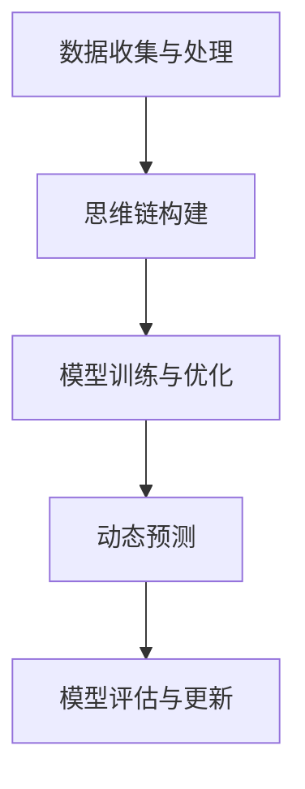

                 

### 第一步：核心概念与联系

在《思维链在海洋生态系统动态预测中的应用研究》一书中，核心概念包括海洋生态系统、动态预测、思维链算法等。这些概念相互联系，构成了研究的基础。

#### 海洋生态系统

海洋生态系统是由各种生物、非生物因素以及它们之间的相互作用组成的复杂系统。理解海洋生态系统的状态和行为是进行动态预测的关键。其基本组成包括：

- **生物群落**：如浮游植物、浮游动物、底栖生物等。
- **物理环境**：如水温、盐度、洋流等。
- **化学因素**：如溶解氧、营养盐、二氧化碳浓度等。

#### 动态预测

动态预测是指利用现有的数据和模型来预测系统未来状态的一种方法。在海洋生态系统中，动态预测可以用来预测海洋生态系统的变化趋势，如物种数量、栖息地变化等。

#### 思维链算法

思维链算法是一种基于人工智能的算法，它可以处理复杂的动态系统，并生成准确的预测结果。其核心思想是通过构建一个“思维链”，将系统的各个状态变量连接起来，形成一个完整的预测模型。

思维链算法的组成部分包括：

- **数据预处理**：对原始数据进行分析和处理，提取有用的信息。
- **思维链构建**：将系统的状态变量通过数学模型连接起来，形成一个思维链。
- **模型训练**：利用历史数据对思维链进行训练，使其能够准确预测系统的状态。

#### 联系与流程

海洋生态系统动态预测的流程可以概括为以下几个步骤：

1. **数据收集与处理**：收集海洋生态系统的相关数据，并进行预处理，提取有用的信息。
2. **思维链构建**：利用预处理后的数据，构建思维链模型。
3. **模型训练与优化**：对思维链模型进行训练，并根据预测结果进行优化。
4. **动态预测**：利用训练好的模型进行动态预测，生成预测结果。
5. **模型评估与更新**：对预测结果进行评估，并根据评估结果更新模型。

### Mermaid流程图

以下是海洋生态系统动态预测的基本架构的Mermaid流程图：

这个流程图展示了从数据收集、处理到动态预测，再到模型评估和更新的整个流程。通过这个流程，我们可以更好地理解思维链算法在海洋生态系统动态预测中的应用。

### 小结

通过第一步的核心概念与联系分析，我们明确了海洋生态系统、动态预测和思维链算法这三个核心概念，并理解了它们之间的相互关系。在接下来的章节中，我们将进一步探讨思维链算法的原理及其在海洋生态系统动态预测中的应用。

