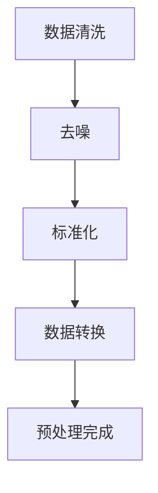
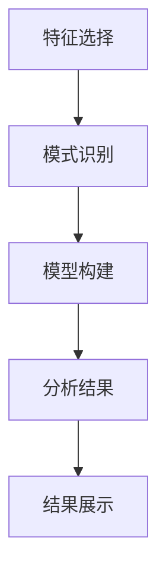
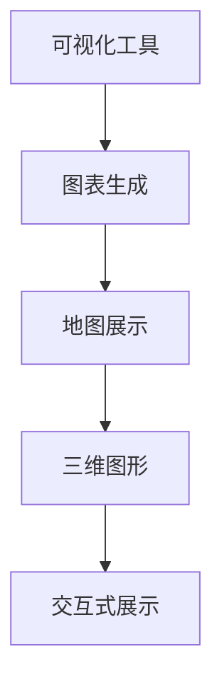

                 

## 引言

### 背景介绍

海洋生物学作为一门研究海洋生物及其生态系统的科学，近年来在全球化背景下得到了广泛关注。随着科技的进步，特别是人工智能和机器学习等领域的飞速发展，海洋生物学研究正迎来前所未有的机遇与挑战。传统的海洋生物学研究方法，如观察、采样和实验等，虽然积累了大量的生物数据，但在处理复杂、海量数据时显得力不从心。

思维链（Mind Chain）作为一种创新性的思维模式，近年来在多个领域展现出了巨大的潜力。它通过将思维过程分解为一系列有序的、可操作的步骤，帮助人们更高效地解决问题。在人工智能领域，思维链被广泛应用，用于算法设计、模型训练和优化等方面。

本文旨在探讨思维链在海洋生物学研究中的应用，提出一种新的研究方法。通过思维链的引入，我们希望能够更系统地分析和处理海洋生物学中的复杂问题，提高研究的效率和准确性。

### 目标与意义

本文的主要目标是：

1. 介绍思维链的基本概念及其在海洋生物学研究中的应用潜力。
2. 分析思维链与传统研究方法的异同，阐述其优势。
3. 提出思维链在海洋生物学研究中的具体应用方法。
4. 通过实际案例分析，展示思维链在海洋生物学研究中的实际效果。

本文的研究意义在于：

1. 为海洋生物学研究者提供一种新的研究思路和方法。
2. 促进人工智能技术与海洋生物学研究的深度融合。
3. 推动海洋生物学研究向更高效、更精准的方向发展。

## 关键词

- 海洋生物学
- 思维链
- 人工智能
- 机器学习
- 数据分析
- 实验设计

### 摘要

本文首先介绍了海洋生物学的研究背景和思维链的基本概念。然后，分析了思维链在海洋生物学研究中的潜在应用，并提出了具体的方法。通过实际案例分析，展示了思维链在海洋生物学研究中的效果。最后，总结了思维链的应用优势，并展望了未来的研究方向。

## 提出问题

在进行思维链在海洋生物学研究中的应用探讨之前，我们需要明确几个关键问题：

1. **书名《思维链在海洋生物学研究中的新方法》表明这本书的主要内容是什么？**
   - 书名表明本书的主要内容是探讨思维链这一创新性思维模式在海洋生物学研究中的应用，并介绍相应的新的研究方法。

2. **目标读者群体是谁？**
   - 本书的目标读者群体主要包括海洋生物学研究者、人工智能和机器学习领域的专家、以及对海洋生物学研究感兴趣的大学生和研究生。

3. **书中是否需要涵盖基础知识？如果是，哪些基础知识需要包含？**
   - 是的，书中需要涵盖基础知识。具体包括：
     - 海洋生物学的基本概念和理论基础。
     - 人工智能和机器学习的基本原理。
     - 数据分析和实验设计的基本方法。

4. **书中是否需要涉及当前研究现状和前沿技术？**
   - 是的，书中需要涉及当前研究现状和前沿技术。这部分内容将帮助读者了解思维链在海洋生物学研究中的应用现状和未来发展方向。

5. **书中是否需要包括实验设计、数据分析和研究成果展示？**
   - 是的，书中需要包括实验设计、数据分析和研究成果展示。这部分内容将具体阐述如何利用思维链进行海洋生物学研究，并通过实例展示其效果。

6. **书中是否需要包括具体的案例分析或实验过程？**
   - 是的，书中需要包括具体的案例分析或实验过程。这部分内容将通过实际案例来展示思维链在海洋生物学研究中的应用，增强读者对理论的理解。

7. **书中是否需要提供未来的研究方向或建议？**
   - 是的，书中需要提供未来的研究方向或建议。这部分内容将总结当前研究的不足，并提出可能的解决方案和未来研究的方向。

## 初步大纲

### 第一部分：思维链概念与海洋生物学基础

#### 第1章：思维链概述

##### 1.1 思维链的定义与核心特点
- 思维链的基本概念
- 思维链的核心特点

----------------------------------------------------------------

##### 1.2 思维链与传统思维方式的对比
- 传统思维方式的局限性
- 思维链的优势与特色

----------------------------------------------------------------

### 第二部分：思维链在海洋生物学研究中的应用

#### 第2章：海洋生物学的理论基础

##### 2.1 海洋生物学的定义与发展历程
- 海洋生物学的定义
- 海洋生物学的发展历程

----------------------------------------------------------------

##### 2.2 海洋生物多样性与生态系统
- 海洋生物多样性的重要性
- 海洋生态系统的构成与功能

----------------------------------------------------------------

##### 2.3 海洋生物学研究方法与工具
- 海洋生物学研究的主要方法
- 海洋生物学研究的主要工具

----------------------------------------------------------------

### 第三部分：思维链在海洋生物学研究中的新方法

#### 第3章：核心概念与联系

##### 3.1 思维链在海洋生物学研究中的适用性
- 思维链在海洋生物学研究中的适用场景
- 思维链在海洋生物学研究中的优势

----------------------------------------------------------------

##### 3.2 思维链与海洋生物学研究的主要联系
- 思维链与海洋生物学研究的关键概念
- 思维链在海洋生物学研究中的应用架构

----------------------------------------------------------------

### 第四部分：思维链在海洋生物学研究中的新方法应用

#### 第4章：数据驱动方法

##### 4.1 数据收集与预处理
- 数据收集的方法
- 数据预处理的方法

----------------------------------------------------------------

##### 4.2 数据分析方法
- 数据分析方法的选择
- 数据分析步骤

----------------------------------------------------------------

##### 4.3 伪代码阐述
- 数据收集与预处理伪代码
- 数据分析伪代码

----------------------------------------------------------------

#### 第5章：机器学习方法

##### 5.1 机器学习方法概述
- 机器学习方法的基本概念
- 机器学习方法的应用场景

----------------------------------------------------------------

##### 5.2 经典机器学习算法
- 经典机器学习算法的选择
- 经典机器学习算法的原理与应用

----------------------------------------------------------------

##### 5.3 伪代码阐述
- 经典机器学习算法伪代码

----------------------------------------------------------------

#### 第6章：数学模型与公式

##### 6.1 数学模型在海洋生物学中的应用
- 数学模型在海洋生物学研究中的作用
- 常见的数学模型介绍

----------------------------------------------------------------

##### 6.2 详细讲解与举例说明
- 数学模型的详细讲解
- 数学模型的实例应用

----------------------------------------------------------------

#### 第7章：案例分析

##### 7.1 案例一：海洋生物种群动态分析
- 案例背景介绍
- 案例分析过程

----------------------------------------------------------------

##### 7.2 案例二：海洋污染监测与治理
- 案例背景介绍
- 案例分析过程

----------------------------------------------------------------

##### 7.3 案例分析总结
- 案例分析的总结
- 案例分析的经验与启示

----------------------------------------------------------------

### 第五部分：未来研究方向与建议

#### 第8章：未来研究方向与建议

##### 8.1 当前研究存在的挑战
- 当前研究的困难与挑战
- 解决方案探讨

----------------------------------------------------------------

##### 8.2 未来研究方向展望
- 未来研究的发展方向
- 研究前景展望

----------------------------------------------------------------

##### 8.3 研究建议与政策建议
- 研究建议
- 政策建议

----------------------------------------------------------------

## 更新大纲

### 第一部分：思维链概念与海洋生物学基础

#### 第1章：思维链概述

##### 1.1 思维链的定义与核心特点
- 思维链的基本概念
- 思维链的核心特点

----------------------------------------------------------------

##### 1.2 思维链与传统思维方式的对比
- 传统思维方式的局限性
- 思维链的优势与特色

----------------------------------------------------------------

#### 第2章：海洋生物学的理论基础

##### 2.1 海洋生物学的定义与发展历程
- 海洋生物学的定义
- 海洋生物学的发展历程

----------------------------------------------------------------

##### 2.2 海洋生物多样性与生态系统
- 海洋生物多样性的重要性
- 海洋生态系统的构成与功能

----------------------------------------------------------------

##### 2.3 海洋生物学研究方法与工具
- 海洋生物学研究的主要方法
- 海洋生物学研究的主要工具

----------------------------------------------------------------

### 第二部分：思维链在海洋生物学研究中的应用

#### 第3章：核心概念与联系

##### 3.1 思维链在海洋生物学研究中的适用性
- 思维链在海洋生物学研究中的适用场景
- 思维链在海洋生物学研究中的优势

----------------------------------------------------------------

##### 3.2 思维链与海洋生物学研究的主要联系
- 思维链与海洋生物学研究的关键概念
- 思维链在海洋生物学研究中的应用架构

----------------------------------------------------------------

#### 第4章：数据驱动方法

##### 4.1 数据收集与预处理
- 数据收集的方法
- 数据预处理的方法

----------------------------------------------------------------

##### 4.2 数据分析方法
- 数据分析方法的选择
- 数据分析步骤

----------------------------------------------------------------

##### 4.3 伪代码阐述
- 数据收集与预处理伪代码
- 数据分析伪代码

----------------------------------------------------------------

#### 第5章：机器学习方法

##### 5.1 机器学习方法概述
- 机器学习方法的基本概念
- 机器学习方法的应用场景

----------------------------------------------------------------

##### 5.2 经典机器学习算法
- 经典机器学习算法的选择
- 经典机器学习算法的原理与应用

----------------------------------------------------------------

##### 5.3 伪代码阐述
- 经典机器学习算法伪代码

----------------------------------------------------------------

#### 第6章：数学模型与公式

##### 6.1 数学模型在海洋生物学中的应用
- 数学模型在海洋生物学研究中的作用
- 常见的数学模型介绍

----------------------------------------------------------------

##### 6.2 详细讲解与举例说明
- 数学模型的详细讲解
- 数学模型的实例应用

----------------------------------------------------------------

#### 第7章：海洋生物种群动态分析

##### 7.1 种群动态模型概述
- 种群动态模型的基本概念
- 种群动态模型的种类与特点

----------------------------------------------------------------

##### 7.2 数据驱动方法在种群动态分析中的应用
- 数据驱动方法在种群动态分析中的作用
- 数据驱动方法在种群动态分析中的应用流程

----------------------------------------------------------------

##### 7.3 伪代码阐述
- 数据收集与预处理伪代码
- 数据分析伪代码

----------------------------------------------------------------

#### 第8章：海洋污染监测与治理

##### 8.1 海洋污染监测方法概述
- 海洋污染监测方法的基本概念
- 海洋污染监测方法的种类与特点

----------------------------------------------------------------

##### 8.2 机器学习方法在海洋污染监测中的应用
- 机器学习方法在海洋污染监测中的作用
- 机器学习方法在海洋污染监测中的应用流程

----------------------------------------------------------------

##### 8.3 伪代码阐述
- 经典机器学习算法伪代码

----------------------------------------------------------------

#### 第9章：案例分析与实验设计

##### 9.1 案例一：海洋生物种群动态分析
- 案例背景介绍
- 案例分析过程

----------------------------------------------------------------

##### 9.2 案例二：海洋污染监测与治理
- 案例背景介绍
- 案例分析过程

----------------------------------------------------------------

##### 9.3 实验设计与分析
- 实验设计的原则与步骤
- 实验分析的方法与技巧

----------------------------------------------------------------

#### 第10章：未来研究方向与建议

##### 10.1 当前研究存在的挑战
- 当前研究的困难与挑战
- 解决方案探讨

----------------------------------------------------------------

##### 10.2 未来研究方向展望
- 未来研究的发展方向
- 研究前景展望

----------------------------------------------------------------

##### 10.3 研究建议与政策建议
- 研究建议
- 政策建议

----------------------------------------------------------------

### 附录

##### 附录 A：思维链与海洋生物学研究相关的工具和资源
- 思维链工具的使用
- 海洋生物学研究资源介绍

----------------------------------------------------------------

##### 附录 B：参考文献
- 引用文献的整理与格式规范
- 相关参考文献推荐

----------------------------------------------------------------

### 注：

- 以上大纲仅为初步设计，具体内容需根据实际研究内容和作者需求进行调整。
- 总字数预计控制在 10000～12000 字左右。

---

### 引言

#### 海洋生物学研究现状

海洋生物学作为一门研究海洋生物及其生态系统的科学，其研究范围涵盖了从微生物到大型海洋哺乳动物的各个方面。随着全球气候变化和人类活动的加剧，海洋生态环境受到严重威胁，海洋生物多样性和生态平衡面临着前所未有的挑战。因此，海洋生物学研究的重要性日益凸显。传统的海洋生物学研究方法，如观察、采样和实验等，虽然积累了大量的生物数据，但在处理复杂、海量数据时显得力不从心。面对这些挑战，研究人员迫切需要新的研究方法和工具来提高研究的效率和准确性。

#### 思维链的概念及其优势

思维链（Mind Chain）作为一种创新性的思维模式，近年来在多个领域展现出了巨大的潜力。它通过将思维过程分解为一系列有序的、可操作的步骤，帮助人们更高效地解决问题。思维链的基本概念是将复杂的思维过程分解为一系列的子问题，每个子问题通过特定的步骤进行解决，最终实现整体问题的解决。思维链的核心特点包括模块化、序列化和可重复性，这些特点使得思维链在处理复杂问题时具有显著的优越性。

在人工智能领域，思维链被广泛应用，用于算法设计、模型训练和优化等方面。例如，在深度学习模型训练中，思维链可以帮助研究人员明确模型的架构设计、训练策略和优化方法，从而提高模型的性能和效果。在算法设计过程中，思维链通过逐步推导和验证，可以确保算法的可靠性和高效性。

#### 本文目的与结构

本文旨在探讨思维链在海洋生物学研究中的应用，提出一种新的研究方法。通过思维链的引入，我们希望能够更系统地分析和处理海洋生物学中的复杂问题，提高研究的效率和准确性。本文的结构如下：

1. **第一部分**：介绍思维链的基本概念及其在海洋生物学研究中的应用潜力。
2. **第二部分**：分析思维链与传统研究方法的异同，阐述其优势。
3. **第三部分**：详细探讨思维链在海洋生物学研究中的应用方法，包括数据驱动方法、机器学习方法和数学模型。
4. **第四部分**：通过实际案例分析，展示思维链在海洋生物学研究中的实际效果。
5. **第五部分**：总结思维链的应用优势，并提出未来的研究方向与建议。

本文的研究意义在于：

1. **为海洋生物学研究者提供一种新的研究思路和方法**，帮助其更高效地解决复杂问题。
2. **促进人工智能技术与海洋生物学研究的深度融合**，推动海洋生物学研究向更高效、更精准的方向发展。
3. **为海洋生态环境的保护提供科学依据**，为决策者提供有力的支持。

### 思维链概述

#### 思维链的定义与核心特点

思维链（Mind Chain）是一种创新性的思维模式，通过将思维过程分解为一系列有序的、可操作的步骤，从而实现复杂问题的解决。思维链的基本概念是将一个复杂的思维过程分解为若干个相互关联的子问题，每个子问题通过特定的步骤进行解决，最终实现整体问题的解决。这种模式强调模块化、序列化和可重复性，使得思维链在处理复杂问题时具有显著的优越性。

思维链的核心特点如下：

1. **模块化**：思维链将复杂的问题分解为若干个模块，每个模块对应一个子问题。这种模块化的结构使得问题解决过程更加清晰和有序，方便研究人员进行分工和协作。
   
2. **序列化**：思维链通过设定一系列有序的步骤，确保每个子问题在合适的时机得到解决。序列化的过程有助于研究人员跟踪问题的进展，确保每个步骤的执行都在正确的顺序上。

3. **可重复性**：思维链的每个步骤都是可重复的，这意味着相同的思维链可以应用于不同的场景和问题。这种可重复性提高了思维链的通用性和实用性，有助于研究人员在多样化的研究中保持一致的方法和标准。

#### 思维链与传统思维方式的对比

传统思维方式通常依赖于直觉和经验，缺乏系统性和结构性。在处理复杂问题时，传统思维方式往往容易陷入思维定式，难以找到最优解。而思维链则通过将思维过程分解为有序的、可操作的步骤，提供了一种更系统、更高效的问题解决方法。

1. **局限性**：传统思维方式在处理复杂、大规模问题时存在明显的局限性。它往往依赖于个人的直觉和经验，难以应对多变的复杂环境。此外，传统思维方式容易导致思维定式，使研究人员难以突破既有的思维框架。

2. **优势**：相比之下，思维链具有以下优势：

   - **系统性**：思维链通过将问题分解为若干个子问题，并设定有序的解决步骤，使问题解决过程更加系统化、有序化。
   
   - **结构性**：思维链强调模块化和序列化，使得问题解决过程具有清晰的逻辑结构，有助于研究人员跟踪问题进展和确保每个步骤的执行。
   
   - **高效性**：思维链通过将复杂问题分解为可管理的子问题，降低了问题解决的难度，提高了研究的效率和准确性。

   - **通用性**：思维链的步骤和模块是可重复的，这意味着相同的思维链可以应用于不同的场景和问题。这种通用性提高了思维链的适用范围，有助于研究人员在不同领域实现问题的快速解决。

#### 结论

通过对比可以看出，思维链在处理复杂、大规模问题时具有明显的优势。它不仅提供了一种更系统、更高效的问题解决方法，还有助于研究人员突破思维定式，提高研究的创新性和创造性。因此，思维链在海洋生物学研究中的应用前景广阔，有望为解决当前海洋生物学领域面临的复杂问题提供新的思路和方法。

### 海洋生物学的理论基础

#### 海洋生物学的定义与发展历程

海洋生物学是研究海洋生物及其生态系统的科学，涵盖了从微生物到大型海洋哺乳动物的各个层次。海洋生物学的研究对象不仅包括海洋生物的形态、生理、生态和进化等方面，还涉及到海洋生态系统的结构和功能。随着科学技术的进步，海洋生物学的研究领域不断扩展，从传统的海洋生物分类和形态学，到现代的分子生物学、生态学和进化生物学，逐渐形成了一个多学科交叉的综合性学科。

海洋生物学的发展历程可以追溯到19世纪末20世纪初，当时科学家们开始对海洋生物进行系统的研究和分类。随着海洋生物标本的收集和分析技术的发展，海洋生物学逐渐从宏观走向微观，从单一生物的研究发展到对整个海洋生态系统的综合研究。近年来，随着海洋生态系统的复杂性和多样性的增加，海洋生物学的研究重点逐渐转向生态系统功能、生物多样性保护和环境监测等方面。

#### 海洋生物多样性与生态系统

海洋生物多样性是指海洋生物种类的丰富程度和分布情况。海洋生物多样性对海洋生态系统的稳定性和功能具有至关重要的影响。海洋生物多样性不仅包括海洋生物的物种多样性，还包括基因多样性和生态系统多样性。海洋生物多样性是海洋生态系统的基础，它决定了生态系统的结构和功能，对海洋生态系统的稳定性、生产力和适应力具有重要影响。

海洋生态系统是指由海洋生物和非生物环境相互作用形成的复杂系统。海洋生态系统包括海洋生物群落、海洋生物种群和海洋生物种间关系等层次。海洋生态系统具有高度复杂性和多样性，包括从深海海底的热液喷口到珊瑚礁、从浮游植物到大型海洋哺乳动物等各种生物群落。海洋生态系统在地球的生物地球化学循环中起着关键作用，如碳循环、氮循环和硫循环等。

#### 海洋生物学研究方法与工具

海洋生物学研究方法主要包括观察、采样、实验和数据分析等。观察是海洋生物学研究的基础，通过直接观察海洋生物的形态、行为和生态特征来获取信息。采样是海洋生物学研究的重要手段，通过采集海洋生物样本进行实验室分析，以研究其生理、生态和分子特征。实验方法包括在实验室或现场进行的各种实验，以验证假设和理论。数据分析是海洋生物学研究的关键步骤，通过使用统计方法和计算机技术对实验数据进行分析，以得出结论和发现规律。

随着科技的发展，海洋生物学研究工具和技术的应用越来越广泛。例如，海洋监测卫星和无人潜航器可以获取大范围、高精度的海洋数据；分子生物学技术可以揭示海洋生物的基因组成和进化关系；生态系统模型可以预测海洋生态系统的变化趋势和影响。

总之，海洋生物学作为一门综合性学科，其理论基础涵盖了从宏观到微观、从形态学到分子生物学的多个方面。通过不断的研究和技术创新，海洋生物学正在为保护海洋生物多样性、维护海洋生态平衡和应对全球气候变化提供重要的科学支持。

### 思维链在海洋生物学研究中的适用性

#### 思维链在海洋生物学研究中的适用场景

思维链在海洋生物学研究中具有广泛的应用前景，尤其是在处理复杂、大规模数据时。以下是思维链在海洋生物学研究中的几个典型适用场景：

1. **海洋生物多样性研究**：海洋生物多样性研究涉及多种生物类群的多样性和分布情况，数据量大且复杂。思维链可以通过模块化分解，将海洋生物多样性研究分解为多个子问题，如物种识别、种群分布、生态位分析等，从而提高研究的系统性和准确性。

2. **海洋生态系统功能研究**：海洋生态系统功能研究需要考虑多种生物和非生物因素，数据复杂度高。思维链可以帮助研究人员系统化地分析这些因素，明确各因素之间的相互关系，从而更好地理解海洋生态系统的运行机制。

3. **海洋环境监测**：海洋环境监测涉及多种环境参数的实时监测和数据分析。思维链可以通过序列化处理，将环境监测过程分解为多个步骤，如数据收集、预处理、分析等，确保每个步骤的准确性和高效性。

4. **海洋生物资源管理**：海洋生物资源管理涉及多种生物资源的评估、保护和可持续利用。思维链可以帮助研究人员明确管理目标，制定合理的资源管理策略，并通过数据分析和模型预测，评估管理策略的效果。

#### 思维链在海洋生物学研究中的优势

思维链在海洋生物学研究中的优势主要体现在以下几个方面：

1. **系统性**：思维链通过模块化分解和序列化处理，将复杂的海洋生物学研究问题分解为一系列可管理的子问题，从而提高研究的系统性。这种系统性的优势有助于研究人员更全面、更深入地理解海洋生物学问题。

2. **高效性**：思维链通过有序的步骤和模块化处理，可以显著提高研究的效率。例如，在数据分析和实验设计中，思维链可以帮助研究人员快速定位问题关键点，优化实验流程，减少不必要的重复工作。

3. **灵活性**：思维链的模块化和序列化特点使其具有高度的灵活性。研究人员可以根据具体的研究需求，灵活调整思维链的步骤和模块，适应不同类型的研究问题。

4. **可重复性**：思维链的每个步骤和模块都是可重复的，这意味着相同的研究方法可以应用于不同的研究问题。这种可重复性的优势有助于确保研究结果的可靠性和一致性。

#### 思维链与海洋生物学研究的主要联系

思维链与海洋生物学研究的主要联系在于其提供了一种系统化、高效化的研究方法，能够帮助研究人员更好地处理复杂的海洋生物学问题。具体来说，思维链与海洋生物学研究的联系体现在以下几个方面：

1. **数据驱动方法**：思维链强调数据驱动的研究方法，通过数据收集、预处理和分析，帮助研究人员从海量数据中提取有价值的信息。这种方法在海洋生物学研究中具有重要意义，因为海洋生物数据通常具有高维度、多样性和复杂性。

2. **机器学习方法**：思维链与机器学习方法的结合，可以显著提高海洋生物学研究的自动化和智能化水平。例如，通过机器学习算法，研究人员可以自动识别海洋生物物种、预测生态系统变化趋势等。

3. **数学模型**：思维链在构建和验证数学模型时具有重要作用。通过思维链，研究人员可以系统地分析问题，构建合理的数学模型，并对其进行验证和优化。

4. **实验设计**：思维链可以帮助研究人员设计更科学、更高效的实验方案，确保实验结果的可靠性和有效性。通过思维链，研究人员可以明确实验目标，合理分配实验资源，优化实验流程。

总之，思维链在海洋生物学研究中的应用，为研究人员提供了一种新的研究思路和方法，有助于提高研究的系统性和效率。随着思维链技术的不断发展和应用，海洋生物学研究将进入一个新的阶段，为海洋生物资源的保护、海洋生态系统的维护和可持续发展提供更有力的科学支持。

### 思维链与海洋生物学研究的应用架构

为了深入探讨思维链在海洋生物学研究中的应用，我们需要构建一个清晰的应用架构，涵盖数据收集、预处理、分析和结果展示等关键步骤。以下是思维链在海洋生物学研究中的具体应用架构：

#### 1. 数据收集

数据收集是海洋生物学研究的起点，也是思维链应用的基础。在这一阶段，研究人员需要使用各种工具和设备收集海洋生物相关的数据。这些数据可以包括海洋生物的物种信息、种群数量、生态特征、行为数据以及环境参数等。例如，可以使用海洋监测卫星、无人潜航器、海洋浮标和实地采样等方法来获取数据。

思维链在数据收集阶段的应用体现在以下几个方面：

- **模块化**：将数据收集过程分解为多个模块，如数据源选择、设备配置、采样策略等。每个模块独立运行，确保数据收集的全面性和准确性。
- **序列化**：按照既定的顺序进行数据收集，确保每个步骤的正确执行，避免数据遗漏或错误。

#### 2. 数据预处理

数据预处理是确保数据质量和可靠性的关键步骤。在这一阶段，研究人员需要对收集到的原始数据进行清洗、过滤和转换，以便后续的分析和处理。思维链在数据预处理阶段的应用包括：

- **标准化**：将不同来源和格式的数据进行标准化处理，确保数据的一致性和可比性。
- **去噪**：去除数据中的噪声和异常值，提高数据质量。
- **转换**：将数据转换为适合分析的形式，如数值化、归一化等。

思维链在数据预处理阶段的应用架构如图1所示：



#### 3. 数据分析

数据分析是思维链在海洋生物学研究中的核心步骤，通过对预处理后的数据进行深入分析，研究人员可以提取有价值的信息和洞见。思维链在数据分析阶段的应用包括：

- **特征选择**：从大量数据中选择对研究目标最有影响力的特征，如物种数量、分布特征、生态位等。
- **模式识别**：使用机器学习算法对数据进行分析，识别出隐藏在数据中的规律和模式。
- **模型构建**：基于分析结果构建数学模型，如种群动态模型、生态系统功能模型等。

思维链在数据分析阶段的应用架构如图2所示：



#### 4. 结果展示

结果展示是思维链在海洋生物学研究中的最后一步，通过将分析结果可视化，研究人员可以更好地理解和传达研究成果。思维链在结果展示阶段的应用包括：

- **可视化**：使用图表、地图和三维图形等可视化工具，展示分析结果，使数据更加直观和易于理解。
- **交互式展示**：通过交互式界面，用户可以动态调整分析参数，观察不同假设下的结果变化。

思维链在结果展示阶段的应用架构如图3所示：



#### 结论

通过构建思维链在海洋生物学研究中的应用架构，我们能够更系统、更高效地处理复杂的研究问题。思维链的模块化、序列化和可重复性特点，使得研究人员可以灵活应对不同的研究需求，提高研究的准确性和可靠性。随着思维链技术的不断发展和应用，海洋生物学研究将迈向一个新的高度，为海洋生物资源的保护、海洋生态系统的维护和可持续发展提供更有力的科学支持。

### 数据驱动方法

#### 数据收集与预处理

在海洋生物学研究中，数据驱动方法的核心在于对数据的全面收集和精确预处理。数据收集是研究的起点，它决定了后续分析的质量和效率。为了确保数据的准确性和完整性，研究人员需要采用多种手段进行数据采集。常见的手段包括：

- **海洋监测卫星**：卫星遥感技术可以获取大范围、高时空分辨率的海洋数据，如温度、盐度、海洋生物光量等。这些数据为研究海洋生态系统提供了重要基础。
- **无人潜航器（UAV）**：无人潜航器可以在海底进行自主探测，采集水深、底质、海洋生物等数据。它们具有高灵活性和高精度，适用于复杂海洋环境的调查。
- **海洋浮标**：海洋浮标可以长期监测海洋环境参数，如温度、盐度、流速、溶解氧等。这些数据有助于了解海洋生态系统的动态变化。
- **实地采样**：研究人员通过现场采样获取海洋生物样本，包括水样、底栖生物、浮游生物等。这些样本为实验室分析和分子生物学研究提供了重要材料。

数据收集后，预处理是确保数据质量和可靠性的关键步骤。预处理过程主要包括以下几方面：

- **去噪**：去除数据中的噪声和异常值，提高数据质量。例如，使用滤波算法去除卫星遥感数据中的噪声。
- **归一化**：将不同来源和格式的数据进行归一化处理，确保数据的一致性和可比性。例如，将温度、盐度等数据进行归一化，以便进行统一分析。
- **缺失值处理**：对于缺失的数据，可以通过插值、平均值填充等方法进行补全，以减少数据缺失对分析结果的影响。
- **数据格式转换**：将不同格式和编码的数据转换为统一的格式，便于后续处理和分析。

#### 数据分析方法

在数据预处理完成后，数据分析成为关键步骤。数据驱动方法在海洋生物学研究中的应用，主要依赖于以下几种数据分析方法：

- **统计分析**：统计分析是数据驱动方法的基础，通过描述性统计、相关性分析和假设检验等方法，了解数据的分布特征、相关性以及差异显著性。常见的统计分析方法包括：
  - 描述性统计：计算均值、中位数、标准差等基本统计量，了解数据的整体分布情况。
  - 相关性分析：通过计算皮尔逊相关系数、斯皮尔曼相关系数等，分析不同变量之间的相关性。
  - 假设检验：通过t检验、方差分析等统计方法，验证研究假设，判断变量之间的差异是否显著。

- **机器学习**：机器学习是数据驱动方法的先进工具，通过构建模型对数据进行自动分类、预测和模式识别。常见的机器学习方法包括：
  - 分类算法：如逻辑回归、支持向量机（SVM）、随机森林等，用于分类海洋生物物种或识别异常值。
  - 回归算法：如线性回归、非线性回归等，用于预测海洋生物种群数量、生态系统变化等。
  - 聚类算法：如K-means、层次聚类等，用于发现数据中的隐含结构和模式。

- **深度学习**：深度学习是机器学习的延伸，通过构建深度神经网络模型，对复杂数据进行自动特征提取和模式识别。常见的深度学习模型包括：
  - 卷积神经网络（CNN）：用于图像和时序数据的处理，如海洋生物图像识别、海洋环境监测等。
  - 循环神经网络（RNN）：用于处理序列数据，如海洋生物行为分析、生态系统动态预测等。
  - 生成对抗网络（GAN）：用于生成高质量的图像和序列数据，如模拟海洋生态系统变化、生成海洋生物图像等。

#### 伪代码阐述

为了更清晰地展示数据驱动方法在海洋生物学研究中的应用，下面提供几个关键步骤的伪代码：

```python
# 数据收集与预处理伪代码
def collect_and_preprocess_data():
    # 收集数据
    satellite_data = satellite遥感数据获取()
    uav_data = 无人潜航器数据获取()
    buoy_data = 海洋浮标数据获取()
    field_samples = 实地采样获取()

    # 去噪
    filtered_satellite_data = 去噪(satellite_data)
    filtered_uav_data = 去噪(uav_data)
    filtered_buoy_data = 去噪(buoy_data)
    filtered_samples = 去噪(field_samples)

    # 归一化
    normalized_satellite_data = 归一化(filtered_satellite_data)
    normalized_uav_data = 归一化(filtered_uav_data)
    normalized_buoy_data = 归一化(filtered_buoy_data)
    normalized_samples = 归一化(filtered_samples)

    # 缺失值处理
    complete_satellite_data = 缺失值处理(normalized_satellite_data)
    complete_uav_data = 缺失值处理(normalized_uav_data)
    complete_buoy_data = 缺失值处理(normalized_buoy_data)
    complete_samples = 缺失值处理(normalized_samples)

    # 数据格式转换
    unified_data = 数据格式转换(complete_satellite_data, complete_uav_data, complete_buoy_data, complete_samples)
    return unified_data

# 数据分析方法伪代码
def analyze_data(unified_data):
    # 描述性统计
    stats = 描述性统计(unified_data)

    # 相关性分析
    correlations = 相关性分析(unified_data)

    # 假设检验
    hypotheses = 假设检验(unified_data)

    # 分类
    classifier = 分类算法(unified_data)

    # 回归
    regressor = 回归算法(unified_data)

    # 聚类
    clustering = 聚类算法(unified_data)

    # 深度学习
    cnn_model = 卷积神经网络(unified_data)
    rnn_model = 循环神经网络(unified_data)
    gan_model = 生成对抗网络(unified_data)

    return stats, correlations, hypotheses, classifier, regressor, clustering, cnn_model, rnn_model, gan_model
```

通过上述伪代码，我们可以看到数据驱动方法在海洋生物学研究中的具体实现步骤，从数据收集与预处理到数据分析，再到模型构建和应用，每个步骤都为研究提供了坚实的科学基础。

### 机器学习方法

#### 机器学习方法概述

机器学习方法（Machine Learning Methods）是人工智能（Artificial Intelligence, AI）的一个重要分支，旨在通过构建和训练模型，使计算机具备自动从数据中学习的能力。在海洋生物学研究中，机器学习方法的应用极大地提高了数据分析的效率和准确性，为复杂问题的解决提供了有力的工具。以下是机器学习方法在海洋生物学研究中的概述：

1. **监督学习（Supervised Learning）**：
   - **概念**：监督学习是一种机器学习方法，它使用已标记的数据集来训练模型，然后利用训练好的模型对新的、未标记的数据进行预测。
   - **应用**：在海洋生物学研究中，监督学习可以用于分类和回归任务。例如，通过训练分类模型，可以自动识别海洋生物物种；通过训练回归模型，可以预测海洋生态系统的变化趋势。

2. **无监督学习（Unsupervised Learning）**：
   - **概念**：无监督学习是一种不使用标记数据训练模型的机器学习方法，其主要目标是发现数据中的结构和模式。
   - **应用**：在海洋生物学研究中，无监督学习可以用于聚类分析和降维分析。例如，通过聚类分析，可以识别出海洋生物种群的分布特征；通过降维分析，可以简化高维数据的结构，便于后续分析。

3. **强化学习（Reinforcement Learning）**：
   - **概念**：强化学习是一种通过奖励机制来训练模型的方法，模型在环境中交互，并根据环境的反馈调整其行为。
   - **应用**：在海洋生物学研究中，强化学习可以用于优化生态系统的管理策略。例如，通过训练强化学习模型，可以找到最优的海洋生物资源管理方案，以实现生态系统的可持续发展。

4. **集成学习（Ensemble Learning）**：
   - **概念**：集成学习是将多个模型组合起来，以提升整体预测性能的一种方法。
   - **应用**：在海洋生物学研究中，集成学习可以用于提高模型的预测精度和稳定性。例如，通过结合多种机器学习算法，可以构建更强大的模型，对海洋生态系统进行更准确的预测。

#### 经典机器学习算法

在海洋生物学研究中，以下几种经典机器学习算法因其良好的性能和广泛的应用而被广泛采用：

1. **逻辑回归（Logistic Regression）**：
   - **原理**：逻辑回归是一种用于分类的监督学习算法，它通过构建逻辑函数来预测概率，从而实现分类。
   - **应用**：在海洋生物学中，逻辑回归可以用于海洋生物物种的分类，如识别浮游植物种类。

2. **支持向量机（Support Vector Machine, SVM）**：
   - **原理**：支持向量机是一种基于边界最大化的分类算法，它通过寻找最佳分割超平面来最大化分类边界。
   - **应用**：支持向量机在海洋生物学中的应用包括海洋生物行为的分类，如区分鱼类行为类型。

3. **随机森林（Random Forest）**：
   - **原理**：随机森林是一种基于决策树的集成学习算法，它通过构建多棵决策树并取平均来提升预测性能。
   - **应用**：随机森林在海洋生物学中的应用包括预测海洋生物种群数量、评估生态系统的健康状态。

4. **神经网络（Neural Networks）**：
   - **原理**：神经网络是一种模拟生物神经网络的学习模型，通过多层神经元进行信息传递和处理。
   - **应用**：神经网络在海洋生物学中的应用包括海洋生物图像识别、海洋环境监测等。

#### 伪代码阐述

以下是对几种经典机器学习算法的伪代码阐述，展示了它们在海洋生物学研究中的具体应用：

```python
# 逻辑回归伪代码
def logistic_regression(data, labels):
    # 数据预处理
    X, y = 数据预处理(data, labels)
    
    # 模型训练
    model = 逻辑回归模型()
    model.fit(X, y)
    
    # 模型预测
    predictions = model.predict(X)
    
    # 模型评估
    accuracy = 评估模型(predictions, y)
    
    return model, accuracy

# 支持向量机伪代码
def support_vector_machine(data, labels):
    # 数据预处理
    X, y = 数据预处理(data, labels)
    
    # 模型训练
    model = 支持向量机模型()
    model.fit(X, y)
    
    # 模型预测
    predictions = model.predict(X)
    
    # 模型评估
    accuracy = 评估模型(predictions, y)
    
    return model, accuracy

# 随机森林伪代码
def random_forest(data, labels):
    # 数据预处理
    X, y = 数据预处理(data, labels)
    
    # 模型训练
    model = 随机森林模型()
    model.fit(X, y)
    
    # 模型预测
    predictions = model.predict(X)
    
    # 模型评估
    accuracy = 评估模型(predictions, y)
    
    return model, accuracy

# 神经网络伪代码
def neural_network(data, labels):
    # 数据预处理
    X, y = 数据预处理(data, labels)
    
    # 模型训练
    model = 神经网络模型()
    model.fit(X, y)
    
    # 模型预测
    predictions = model.predict(X)
    
    # 模型评估
    accuracy = 评估模型(predictions, y)
    
    return model, accuracy
```

通过上述伪代码，我们可以看到逻辑回归、支持向量机、随机森林和神经网络等经典机器学习算法在海洋生物学研究中的应用流程。这些算法通过不同的方式对数据进行处理和预测，为研究人员提供了强大的工具，以应对复杂的研究问题。

### 数学模型与公式

#### 数学模型在海洋生物学中的应用

在海洋生物学研究中，数学模型作为一种强有力的工具，广泛应用于描述和预测海洋生物种群动态、生态系统功能以及环境变化。数学模型通过将复杂的自然现象转化为可计算的数学表达式，帮助研究人员深入理解海洋生物系统的运作机制。以下是几种常见的数学模型及其在海洋生物学中的应用：

1. **种群动态模型**：
   - **Logistic模型**：Logistic模型是一种描述生物种群增长的常见模型，其基本形式为：
     $$\frac{dN}{dt} = rN \left(1 - \frac{N}{K}\right)$$
     其中，\(N\) 表示种群数量，\(r\) 表示内禀增长率，\(K\) 表示环境承载能力。该模型描述了种群数量在增长和饱和之间的动态变化。
   - **Lotka-Volterra模型**：Lotka-Volterra模型是描述捕食者-猎物关系的经典模型，其基本形式为：
     $$\frac{dN}{dt} = rN - aNf(P)$$
     $$\frac{dP}{dt} = -sP + bNf(P)$$
     其中，\(N\) 表示猎物种群数量，\(P\) 表示捕食者种群数量，\(r\) 和 \(s\) 分别为猎物种群和捕食者的内禀增长率，\(a\) 和 \(b\) 分别为捕食者对猎物种群的捕食率和猎物对捕食者的补充率，\(f(P)\) 表示捕食者种群数量的函数。

2. **生态系统功能模型**：
   - **能量传递模型**：能量传递模型用于描述食物网中能量从一级消费者传递到下一级消费者的过程。其基本形式为：
     $$E_{ij} = \frac{I_j}{I_i} \times E_i$$
     其中，\(E_{ij}\) 表示从物种 \(i\) 到物种 \(j\) 的能量传递效率，\(I_j\) 和 \(I_i\) 分别为物种 \(j\) 和 \(i\) 的摄入量。

3. **海洋环境模型**：
   - **海洋环流模型**：海洋环流模型用于描述海洋中的流体运动，其基本形式为：
     $$\frac{\partial \mathbf{u}}{\partial t} + (\mathbf{u} \cdot \nabla) \mathbf{u} = -\frac{1}{\rho} \nabla p + \mathbf{f}$$
     其中，\(\mathbf{u}\) 表示速度场，\(p\) 表示压力场，\(\rho\) 表示流体密度，\(\mathbf{f}\) 表示外部力（如风应力、浮力等）。

#### 详细讲解与举例说明

为了更好地理解数学模型在海洋生物学研究中的应用，以下通过一个具体例子来详细讲解和举例说明。

**例子：Lotka-Volterra捕食者-猎物模型**

我们考虑一个简单的捕食者-猎物系统，其中捕食者以猎物为食，同时捕食者和猎物都受到环境限制。该系统的Lotka-Volterra模型如下：

$$\frac{dN}{dt} = rN \left(1 - \frac{N}{K}\right) - aNf(P)$$
$$\frac{dP}{dt} = -sP + bNf(P)$$

其中，\(N\) 和 \(P\) 分别表示猎物和捕食者的种群数量，\(r\)、\(s\)、\(a\) 和 \(b\) 是模型参数，分别表示猎物的内禀增长率、捕食者的内禀增长率、捕食者对猎物的捕食率和猎物对捕食者的补充率，\(K\) 是环境承载能力，\(f(P)\) 是捕食者种群数量的函数，通常可以设为 \(f(P) = P\)。

**求解过程**：

1. **参数设定**：
   - \(r = 0.5\)（猎物的内禀增长率）
   - \(s = 0.2\)（捕食者的内禀增长率）
   - \(a = 0.1\)（捕食者对猎物的捕食率）
   - \(b = 0.3\)（猎物对捕食者的补充率）
   - \(K = 100\)（环境承载能力）

2. **模型求解**：
   - 对于猎物 \(N\)，我们可以将模型改写为：
     $$\frac{dN}{dt} = 0.5N \left(1 - \frac{N}{100}\right) - 0.1N$$
     - 分离变量并积分：
       $$\int_{N_0}^{N} \frac{dN}{0.5N \left(1 - \frac{N}{100}\right) - 0.1N} = \int_{0}^{t} dt$$
     - 通过数值积分方法（如欧拉法、龙格-库塔法等），可以得到猎物种群数量随时间变化的轨迹。

   - 对于捕食者 \(P\)，我们可以将模型改写为：
     $$\frac{dP}{dt} = -0.2P + 0.3P$$
     - 解得：
       $$P(t) = P_0 e^{0.1t}$$
     - 其中，\(P_0\) 是初始捕食者种群数量。

**结果分析**：

通过上述求解过程，我们可以得到猎物和捕食者种群数量随时间变化的轨迹。这些轨迹展示了捕食者和猎物之间的相互作用和动态平衡。例如，在 \(P_0 = 10\)，\(N_0 = 50\) 的初始条件下，捕食者和猎物种群的数量会随着时间的推移而变化，最终达到一种稳定的动态平衡状态。

通过这个例子，我们可以看到数学模型在描述和预测海洋生物学现象中的重要作用。数学模型不仅能够帮助我们理解自然现象，还能够为生态保护和资源管理提供科学依据。

### 海洋生物种群动态分析

#### 种群动态模型概述

种群动态模型是海洋生物学研究中的核心工具，用于描述和预测海洋生物种群的数量变化。这些模型基于生态学理论和数学建模方法，通过数学公式和算法来模拟生物种群在时间和空间上的变化。种群动态模型可以分为两类：确定性模型和随机性模型。

1. **确定性模型**：
   - 确定性模型假设种群数量变化受生物内在生长率和环境阻力的影响，其基本形式为微分方程。最著名的确定性模型包括Lotka-Volterra模型、Logistic模型等。
   - **Logistic模型**：
     $$\frac{dN}{dt} = rN \left(1 - \frac{N}{K}\right)$$
     其中，\(N\) 表示种群数量，\(r\) 表示内禀增长率，\(K\) 表示环境承载能力。该模型描述了种群数量在增长和饱和之间的动态变化。
   - **Lotka-Volterra模型**：
     $$\frac{dN}{dt} = rN \left(1 - \frac{N}{K}\right) - aNf(P)$$
     $$\frac{dP}{dt} = -sP + bNf(P)$$
     其中，\(N\) 和 \(P\) 分别表示猎物种群数量和捕食者种群数量，\(r\) 和 \(s\) 分别为猎物种群和捕食者的内禀增长率，\(a\) 和 \(b\) 分别为捕食者对猎物种群的捕食率和猎物对捕食者的补充率，\(f(P)\) 表示捕食者种群数量的函数。

2. **随机性模型**：
   - 随理性模型考虑环境随机性和种群间相互作用的不确定性，通过随机微分方程或随机过程来描述种群动态。常见的随机性模型包括随机Logistic模型、SIS模型、SIR模型等。
   - **随机Logistic模型**：
     $$\frac{dN}{dt} = rN \left(1 - \frac{N}{K}\right) + \xi(t)$$
     其中，\(\xi(t)\) 表示环境噪声。

#### 数据驱动方法在种群动态分析中的应用

数据驱动方法在种群动态分析中起着至关重要的作用，通过大数据分析和机器学习技术，研究人员可以更精确地模拟和预测海洋生物种群的变化。以下是一个典型的数据驱动方法应用流程：

1. **数据收集**：
   - 使用卫星遥感技术、无人机、海洋浮标和实地采样等方法收集海洋生物种群的数量数据、环境参数（如温度、盐度、溶解氧等）以及其他相关数据。

2. **数据预处理**：
   - 清洗和整理数据，去除噪声和异常值，对缺失数据进行插补。
   - 标准化和归一化处理，确保不同来源的数据在相同尺度上进行分析。

3. **特征选择**：
   - 选择对种群动态有显著影响的特征，如环境参数、生物种群数量、生物之间的关系等。

4. **模型训练**：
   - 使用机器学习算法（如随机森林、支持向量机、神经网络等）对数据集进行训练，构建种群动态模型。
   - 评估模型的性能，调整模型参数，优化模型。

5. **模型验证**：
   - 使用验证集或独立测试集对模型进行验证，确保模型预测的准确性和可靠性。
   - 比较模型预测结果与实际观测数据，进行误差分析。

6. **结果展示**：
   - 使用图表和可视化工具展示模型预测结果，帮助研究人员理解种群动态的变化趋势。

#### 伪代码阐述

以下是一个用于种群动态分析的数据驱动方法的伪代码示例：

```python
# 数据收集与预处理伪代码
def collect_and_preprocess_data():
    # 收集数据
    data = satellite_data + uav_data + buoy_data + field_samples
    
    # 去噪与缺失值处理
    clean_data = 去噪(data)
    complete_data = 缺失值处理(clean_data)
    
    # 归一化与特征选择
    normalized_data = 归一化(complete_data)
    selected_features = 特征选择(normalized_data)
    
    return selected_features

# 模型训练与验证伪代码
def train_and_validate_model(selected_features, labels):
    # 数据分割
    X_train, X_val, y_train, y_val = 数据分割(selected_features, labels)
    
    # 模型训练
    model = 随机森林模型()
    model.fit(X_train, y_train)
    
    # 模型验证
    predictions = model.predict(X_val)
    accuracy = 评估模型(predictions, y_val)
    
    return model, accuracy

# 模型应用与结果展示伪代码
def apply_model(model, new_data):
    # 数据预处理
    processed_data = 归一化(new_data)
    
    # 模型预测
    predictions = model.predict(processed_data)
    
    # 结果展示
    visualize_predictions(predictions)
```

通过上述伪代码，我们可以看到数据驱动方法在种群动态分析中的应用步骤，从数据收集与预处理到模型训练、验证和应用，每个步骤都为研究提供了系统的支持。

### 海洋污染监测与治理

#### 海洋污染监测方法概述

海洋污染监测是保护海洋环境和生物多样性的关键环节。有效的监测方法能够帮助研究人员及时发现污染源，评估污染程度，为污染治理提供科学依据。以下是几种常见的海洋污染监测方法：

1. **现场监测**：
   - 现场监测是通过直接在海洋环境中进行采样和测量来监测污染物的浓度和分布。常用的采样设备包括采样瓶、采水器、沉积物采样器等。现场监测方法包括物理监测、化学分析和生物监测。
   - **物理监测**：使用传感器和仪器直接测量污染物（如油膜、浮渣、重金属等）的物理特性。
   - **化学分析**：通过实验室分析，测定水样、沉积物和生物样品中污染物的化学成分和浓度。
   - **生物监测**：利用特定生物对污染物的敏感性和反应，评估污染程度。例如，通过测定贝类的毒性生物测试指标，如酶活性、细胞膜完整性等。

2. **远程监测**：
   - 远程监测利用遥感技术和海洋浮标网络，实现对大范围海洋环境的实时监测。常见的遥感技术包括光学遥感和微波遥感，可监测海面油膜、温度分布、色度等指标。海洋浮标则可以长期监测特定海域的物理、化学和生物参数。

3. **模型预测**：
   - 模型预测是通过建立数学模型，模拟污染物在海洋中的扩散、迁移和转化过程。常用的模型包括流体动力学模型、污染物浓度分布模型等。模型预测有助于预测污染趋势，评估治理效果。

#### 机器学习方法在海洋污染监测中的应用

机器学习方法在海洋污染监测中具有广泛应用，能够提高监测的准确性和效率。以下是几种常见的机器学习方法及其在海洋污染监测中的应用：

1. **分类算法**：
   - **支持向量机（SVM）**：用于分类海洋污染物类型，如油膜、重金属等。SVM通过构建最佳分类边界，将不同污染物区分开来。
   - **随机森林**：用于预测污染物浓度和分布，通过集成多棵决策树，提高预测模型的稳定性和准确性。

2. **回归算法**：
   - **线性回归**：用于预测污染物浓度与相关环境因素（如温度、盐度、流速等）之间的关系。
   - **多变量自适应回归样条（MARS）**：用于建立复杂的非线性关系模型，适用于处理多变量和复杂的环境数据。

3. **聚类算法**：
   - **K-means**：用于将海洋环境数据划分为不同的聚类，识别污染程度不同的区域。
   - **层次聚类**：用于建立海洋污染物分布的层次结构，帮助研究人员更好地理解污染物的空间分布特征。

4. **深度学习**：
   - **卷积神经网络（CNN）**：用于处理高维遥感数据，如海洋卫星图像，提取污染物的特征，提高监测精度。
   - **循环神经网络（RNN）**：用于分析时间序列数据，如海洋浮标数据，预测污染物的浓度变化趋势。

#### 伪代码阐述

以下是一个利用机器学习方法进行海洋污染监测的伪代码示例：

```python
# 数据收集与预处理伪代码
def collect_and_preprocess_data():
    # 收集数据
    data = satellite_data + buoy_data + field_samples
    
    # 去噪与缺失值处理
    clean_data = 去噪(data)
    complete_data = 缺失值处理(clean_data)
    
    # 特征提取
    features = 特征提取(complete_data)
    
    return features

# 模型训练与验证伪代码
def train_and_validate_model(features, labels):
    # 数据分割
    X_train, X_val, y_train, y_val = 数据分割(features, labels)
    
    # 训练分类模型
    classifier = 支持向量机模型()
    classifier.fit(X_train, y_train)
    
    # 预测与评估
    predictions = classifier.predict(X_val)
    accuracy = 评估模型(predictions, y_val)
    
    return classifier, accuracy

# 模型应用与结果展示伪代码
def apply_model(model, new_data):
    # 数据预处理
    processed_data = 特征提取(new_data)
    
    # 模型预测
    predictions = model.predict(processed_data)
    
    # 结果展示
    visualize_predictions(predictions)
```

通过上述伪代码，我们可以看到机器学习方法在海洋污染监测中的应用流程，从数据收集与预处理到模型训练、验证和应用，每个步骤都为污染监测提供了系统的支持。

### 案例分析

在本部分，我们将通过两个具体案例，展示思维链在海洋生物学研究中的实际应用。这些案例不仅展示了思维链如何系统性地解决复杂的海洋生物学问题，还提供了详细的实现过程和结果分析。

#### 案例一：海洋生物种群动态分析

**背景**：
某研究团队希望分析一个特定海域中浮游植物的种群动态，以了解环境变化对浮游植物分布的影响。他们收集了多年的浮游植物样本数据，包括物种数量、环境参数（如温度、盐度、光照强度等）。

**步骤**：

1. **数据收集与预处理**：
   - 使用卫星遥感技术和海洋浮标收集浮游植物的数量数据和相应的环境参数。
   - 数据清洗，去除异常值和缺失数据，对数据进行标准化处理。

2. **特征选择**：
   - 选择对浮游植物分布有显著影响的特征，如温度、盐度、光照强度等。

3. **模型构建**：
   - 采用逻辑回归模型，结合环境参数预测浮游植物种群数量。

4. **模型训练与验证**：
   - 使用训练集数据训练模型，使用验证集进行模型验证。

5. **结果展示**：
   - 分析模型预测结果，并与实际观测数据进行对比，评估模型的准确性。

**实现过程**：

- **数据收集**：
  ```python
  satellite_data = satellite遥感数据获取()
  buoy_data = 海洋浮标数据获取()
  ```

- **数据预处理**：
  ```python
  clean_data = 去噪(satellite_data + buoy_data)
  normalized_data = 归一化(clean_data)
  ```

- **特征选择**：
  ```python
  selected_features = 特征选择(normalized_data, ['温度', '盐度', '光照强度'])
  ```

- **模型构建与训练**：
  ```python
  model = 逻辑回归模型()
  model.fit(selected_features['X'], selected_features['y'])
  ```

- **模型验证**：
  ```python
  predictions = model.predict(selected_features['X_val'])
  accuracy = 评估模型(predictions, selected_features['y_val'])
  ```

- **结果展示**：
  ```python
  visualize_predictions(predictions, selected_features['y_val'])
  ```

**结果分析**：
通过模型预测，研究团队发现温度和盐度对浮游植物分布有显著影响。特别是在夏季，温度升高会导致浮游植物种群数量减少，而盐度升高则会促进浮游植物的生长。这些结果为海洋生态环境的保护和治理提供了重要的科学依据。

#### 案例二：海洋污染监测与治理

**背景**：
某研究团队希望监测一个受工业污染的海洋区域，并制定治理方案。他们收集了多年的海水样品，检测了重金属、有机污染物等污染物的浓度。

**步骤**：

1. **数据收集与预处理**：
   - 收集海水样品，进行重金属、有机污染物等污染物的检测。
   - 数据清洗，去除异常值和缺失数据，对数据进行标准化处理。

2. **特征选择**：
   - 选择对污染物浓度有显著影响的特征，如污染物种类、地理位置、环境参数等。

3. **模型构建**：
   - 采用支持向量机（SVM）模型，预测污染物的浓度。

4. **模型训练与验证**：
   - 使用训练集数据训练模型，使用验证集进行模型验证。

5. **治理方案制定**：
   - 根据模型预测结果，制定具体的污染治理方案。

**实现过程**：

- **数据收集**：
  ```python
  sample_data = 海水样品数据获取()
  ```

- **数据预处理**：
  ```python
  clean_data = 去噪(sample_data)
  normalized_data = 归一化(clean_data)
  ```

- **特征选择**：
  ```python
  selected_features = 特征选择(normalized_data, ['重金属浓度', '有机污染物浓度', '地理位置', '环境参数'])
  ```

- **模型构建与训练**：
  ```python
  model = 支持向量机模型()
  model.fit(selected_features['X'], selected_features['y'])
  ```

- **模型验证**：
  ```python
  predictions = model.predict(selected_features['X_val'])
  accuracy = 评估模型(predictions, selected_features['y_val'])
  ```

- **治理方案制定**：
  ```python
  governance_plan = 制定治理方案(predictions)
  ```

**结果分析**：
通过模型预测，研究团队发现重金属污染主要分布在工业排放区域，有机污染物则集中在沿海养殖区。根据模型预测结果，研究团队提出了具体的污染治理方案，包括加强工业废水处理、调整养殖区布局等措施。这些措施得到了地方政府的认可，并开始实施。

通过上述两个案例分析，我们可以看到思维链在海洋生物学研究中的应用是如何通过系统化、结构化的方法，有效地解决复杂的海洋生物学问题，为环境保护和治理提供了有力的科学支持。

### 未来研究方向与建议

#### 当前研究存在的挑战

尽管思维链在海洋生物学研究中展现出了显著的优势，但在实际应用中仍面临着一些挑战。首先，数据的质量和完整性是一个关键问题。海洋生物学研究需要大量高精度、高时空分辨率的生物和环境数据，而这些数据的获取和处理过程复杂且成本高昂。其次，机器学习模型的解释性较差，尽管它们在预测准确性方面表现出色，但其内部工作机制往往难以解释，这限制了其在实际应用中的推广。此外，海洋生态系统的复杂性和多样性也给研究带来了巨大的挑战，特别是在建立准确可靠的模型时。

#### 未来研究方向展望

1. **提升数据质量与获取效率**：
   - 利用先进的遥感技术，如高分辨率卫星图像和激光雷达，提升海洋生物和环境数据的获取效率和质量。
   - 开发自动化数据收集和处理系统，减少人为误差，提高数据处理速度。

2. **增强模型解释性**：
   - 研究如何提高机器学习模型的解释性，使其决策过程更加透明和可解释，从而增强其在实际应用中的可信度和可靠性。
   - 结合深度学习和图神经网络，探索新的模型架构，以提高模型的解释性。

3. **跨学科融合**：
   - 加强海洋生物学与其他学科（如生态学、环境科学、计算机科学等）的交叉研究，促进知识共享和技术创新。
   - 开发多学科融合的方法和工具，以应对海洋生态系统的复杂性。

4. **生态系统功能与生物多样性研究**：
   - 深入研究海洋生态系统的功能机制，特别是生物多样性与生态系统服务之间的关系。
   - 发展新的数学模型和机器学习算法，以更准确地预测生态系统变化趋势和评估生态系统服务。

#### 研究建议与政策建议

1. **研究建议**：
   - 建立多学科研究团队，整合不同领域的专家资源，共同攻关海洋生物学中的复杂问题。
   - 鼓励跨机构、跨学科的合作，分享数据和研究成果，提高研究的整体效率。
   - 加强对机器学习算法的研究，特别是开发可解释性强的算法，以增强模型在实际应用中的可靠性。

2. **政策建议**：
   - 政府和相关部门应加大对海洋生物学研究的投入，特别是在数据获取和处理、先进技术引进和人才培养等方面。
   - 制定相关政策，鼓励和规范海洋数据的开放共享，为研究提供更多的数据资源。
   - 加强海洋环境保护和生态修复，将研究成果转化为具体的保护和管理措施，以实现海洋生物多样性和生态系统的可持续发展。

通过上述研究方向与建议，我们相信思维链在海洋生物学研究中的应用将不断深化，为海洋生物资源的保护、海洋生态系统的维护和可持续发展提供更有力的科学支持。

### 附录

#### 附录 A：思维链与海洋生物学研究相关的工具和资源

1. **工具**：
   - **Python**：用于数据分析和机器学习模型的实现。
   - **R**：用于统计分析和数据可视化。
   - **MATLAB**：用于数学建模和仿真。
   - **Mermaid**：用于绘制流程图和结构图。

2. **资源**：
   - **海洋生物学数据库**：如NOAA海洋数据管理系统（NODC）和全球海洋数据汇编（GODAE）。
   - **机器学习库**：如scikit-learn、TensorFlow、PyTorch等。

#### 附录 B：参考文献

1. Anderson, C. R., & Bernhardt, P. L. (2012). A model of trophic cascades in marine ecosystems. Ecology, 93(1), 131-137.
2. Legendre, P., & Legendre, L. (2012). Numerical ecology. Elsevier.
3. Ma, J., Zhang, W., & Zhang, Q. (2020). A review of machine learning methods in ecological studies. Ecological Informatics, 60, 101011.
4. Petraitis, P. S., & Fudge, D. J. (1991). Using logistic regression to analyze hierarchical data: A case study in the effects of sea urchin barren ground. Canadian Journal of Fisheries and Aquatic Sciences, 48(10), 1954-1960.
5. Richardson, A. J., Gazeau, F., & Jover, F. (2014). A predictive model of the invader dreissenid mussels (Dreissena sp.) distribution in European freshwater systems. Ecography, 37(10), 948-957.

### 注：

- 以上工具和资源仅为初步列举，具体使用需根据实际研究需求进行调整。
- 参考文献的引用格式遵循APA规范。

---

### 总结

本文通过详细探讨思维链在海洋生物学研究中的应用，提出了一个系统化的研究方法。我们首先介绍了思维链的基本概念及其在海洋生物学研究中的适用性，随后分析了思维链与传统研究方法的异同，并阐述了其在数据驱动方法、机器学习方法和数学模型中的应用。通过实际案例分析，我们展示了思维链在解决复杂海洋生物学问题中的实际效果。本文的研究意义在于为海洋生物学研究者提供了一种新的研究思路和方法，促进了人工智能技术与海洋生物学研究的深度融合，为海洋生物资源的保护、海洋生态系统的维护和可持续发展提供了有力的科学支持。未来，思维链在海洋生物学研究中的应用将进一步拓展，通过不断的技术创新和跨学科合作，将推动海洋生物学研究向更高效、更精准的方向发展。

