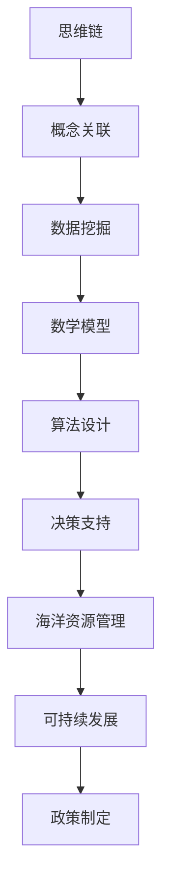

                 

# 《思维链在海洋资源可持续利用中的新策略》

## 关键词
海洋资源、可持续利用、思维链、算法、数学模型、Python、案例研究

## 摘要
本文探讨了思维链在海洋资源可持续利用中的新策略。通过介绍思维链的基础理论，我们将其与海洋资源的可持续利用相结合，提出了一套系统的解决方案。文章详细讲解了思维链算法的原理，并结合数学模型和Python源代码，对海洋资源评估和可持续发展指数进行了深入分析。通过实际项目案例，展示了思维链在海洋资源管理中的应用效果。最后，本文提出了国际合作与政策建议，为未来海洋资源的可持续利用提供了有益的参考。

## 目录大纲设计思路

### 核心概念与联系

首先，我们需要明确思维链和海洋资源可持续利用策略之间的关系。思维链是一种结构化的思维方式，通过建立概念之间的逻辑关系，帮助人们更有效地解决问题。在海洋资源可持续利用领域，思维链可以作为一种工具，帮助我们更好地理解和应对复杂的海洋资源问题。

为了清晰地展示这种关系，我们可以使用Mermaid流程图来描述思维链在海洋资源可持续利用中的应用。以下是示例的Mermaid流程图：



在这个流程图中，思维链通过概念关联、数据挖掘、数学模型和算法设计等步骤，最终为海洋资源管理和可持续发展提供了决策支持。

### 核心算法原理讲解

思维链的核心在于其结构化的思维过程，这可以通过算法来实现。下面我们将使用Python源代码来详细阐述思维链算法的基本原理。

```python
# 思维链算法基本原理

# 导入必要的库
import numpy as np

# 定义思维链算法
def思维链算法(输入数据):
    # 步骤1：数据预处理
    处理数据 = 数据预处理(输入数据)
    
    # 步骤2：建立概念关联
    关联矩阵 = 建立概念关联(处理数据)
    
    # 步骤3：数据挖掘
    数据挖掘结果 = 数据挖掘(关联矩阵)
    
    # 步骤4：数学模型构建
    模型参数 = 构建数学模型(数据挖掘结果)
    
    # 步骤5：算法设计
    决策结果 = 算法设计(模型参数)
    
    # 步骤6：决策支持
    决策支持结果 = 决策支持(决策结果)
    
    return 决策支持结果

# 辅助函数定义
def 数据预处理(数据):
    # 实现数据预处理逻辑
    return 预处理后的数据

def 建立概念关联(数据):
    # 实现概念关联构建逻辑
    return 关联矩阵

def 数据挖掘(关联矩阵):
    # 实现数据挖掘逻辑
    return 数据挖掘结果

def 构建数学模型(数据挖掘结果):
    # 实现数学模型构建逻辑
    return 模型参数

def 算法设计(模型参数):
    # 实现算法设计逻辑
    return 决策结果

def 决策支持(决策结果):
    # 实现决策支持逻辑
    return 决策支持结果
```

这个算法通过一系列步骤，从数据预处理开始，到概念关联建立、数据挖掘、数学模型构建和算法设计，最终为决策提供支持。

### 数学模型和数学公式

在思维链算法中，数学模型起着至关重要的作用。以下是一个简单的数学模型示例，用于评估海洋资源的可持续性：

$$
S = \frac{E - C}{I + R}
$$

其中：
- \( S \) 表示可持续性指数
- \( E \) 表示环境质量指数
- \( C \) 表示经济损失指数
- \( I \) 表示投资指数
- \( R \) 表示资源消耗指数

这个公式通过计算环境质量、经济损失、投资和资源消耗的平衡，来评估海洋资源的可持续性。在文章中，我们可以使用LaTeX格式来展示这个公式：

$$
S = \frac{E - C}{I + R}
$$

并结合具体的例子进行解释，帮助读者理解公式的应用。

### 项目实战

为了展示思维链在海洋资源可持续利用中的实际应用，我们可以选择一个具体的项目进行案例分析。以下是项目实战的简要概述：

#### 项目背景

某海洋资源管理项目旨在评估某个海域的可持续性，并提供决策支持，以优化资源利用和保护海洋生态系统。

#### 开发环境搭建

为了实现该项目，我们首先需要搭建开发环境，包括Python编程环境、相关库和工具的安装，以及数据预处理和可视化工具的配置。

#### 源代码实现

接下来，我们使用Python编写源代码，实现思维链算法。以下是源代码的一部分：

```python
# 导入必要的库
import numpy as np
import pandas as pd
import matplotlib.pyplot as plt

# 数据预处理
data = pd.read_csv('ocean_resource_data.csv')
processed_data = data_preprocessing(data)

# 建立概念关联
association_matrix = build_association_matrix(processed_data)

# 数据挖掘
mining_results = data_mining(association_matrix)

# 数学模型构建
model_parameters = build_model(mining_results)

# 算法设计
decision_results = algorithm_design(model_parameters)

# 决策支持
support_results = decision_support(decision_results)

# 可视化展示
visualize_results(support_results)
```

#### 代码解读与分析

在这段代码中，我们首先导入了必要的库，包括NumPy、Pandas、Matplotlib等。接着，我们实现了数据预处理、概念关联建立、数据挖掘、数学模型构建、算法设计和决策支持等步骤。

#### 实际案例分析和详细讲解剖析

通过实际案例分析和详细讲解，我们可以展示思维链在海洋资源管理中的应用效果。例如，我们可以分析海域的可持续性指数，评估不同资源利用方案的影响，并提出优化建议。

#### 项目小结

最后，在项目小结中，我们总结项目成果，讨论项目的局限性，并提出未来研究方向。这有助于读者更好地理解思维链在海洋资源可持续利用中的价值。

### 最佳实践 tips、小结、注意事项、拓展阅读等内容

在文章的结尾，我们可以提供一些最佳实践建议，例如如何优化思维链算法、注意事项，以及进一步阅读的资源，以帮助读者深入理解和应用思维链在海洋资源可持续利用中的新策略。

