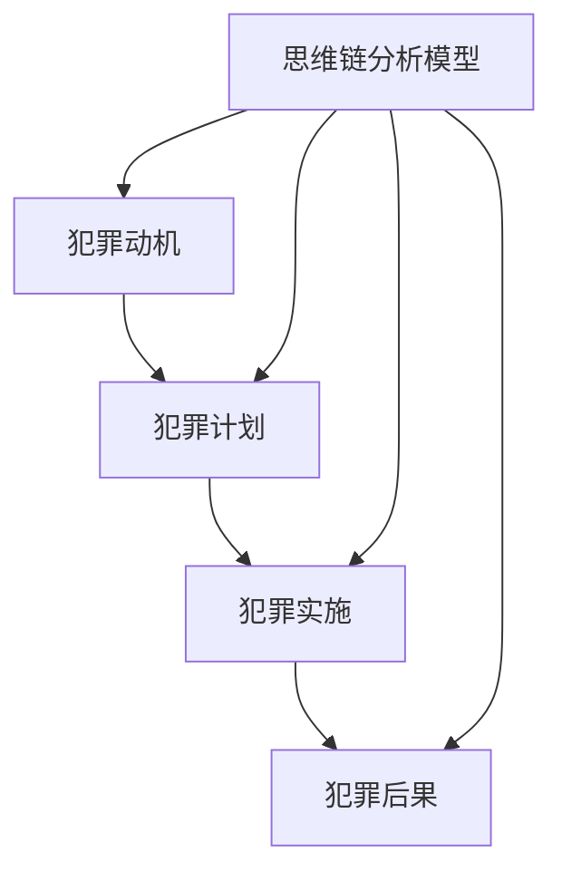
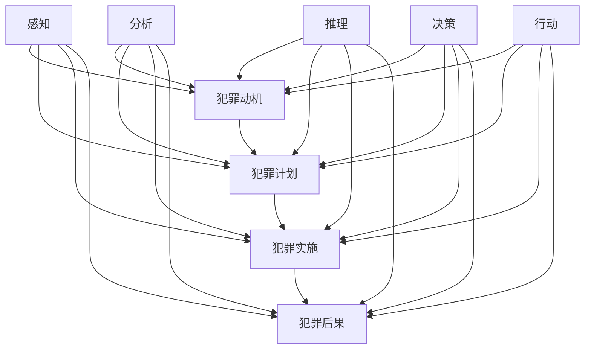

                 

### 文章标题

《思维链在犯罪学分析中的潜在价值》

### 文章关键词

- 思维链
- 犯罪学
- 分析模型
- 算法
- 应用实践

### 文章摘要

本文旨在探讨思维链在犯罪学分析中的潜在价值。通过系统性地介绍思维链的基本概念、发展历史以及在犯罪学领域的应用，本文将阐述思维链分析模型、算法和工具技术的具体应用。同时，通过实际案例和项目实战，本文展示了思维链分析在犯罪预防与侦查中的实际效果，并对未来的发展趋势和研究方向进行了展望。

### 目录大纲

#### 第一部分：思维链概述

##### 第1章：思维链的定义与历史发展
- **1.1.1 思维链的基本概念**
- **1.1.2 思维链的理论基础**
- **1.1.3 思维链的历史演进**

##### 第2章：思维链与犯罪学
- **2.1.1 犯罪学中的思维链研究**
- **2.1.2 思维链在犯罪预防中的应用**
- **2.1.3 思维链在犯罪侦查中的作用**

#### 第二部分：思维链在犯罪学分析中的应用

##### 第3章：思维链分析模型
- **3.1.1 思维链分析模型的构建**
- **3.1.2 思维链分析模型的特点**
- **3.1.3 思维链分析模型的应用领域**

##### 第4章：思维链分析算法
- **4.1.1 常见的思维链分析算法**
- **4.1.2 思维链分析算法的优缺点**
- **4.1.3 思维链分析算法的改进方向**

##### 第5章：思维链分析工具与技术
- **5.1.1 思维链分析工具的选择**
- **5.1.2 思维链分析技术的实施**
- **5.1.3 思维链分析技术的评估与优化**

#### 第三部分：思维链分析实践

##### 第6章：思维链分析在犯罪预防中的应用
- **6.1.1 犯罪预防中的思维链分析案例**
- **6.1.2 犯罪预防中的思维链分析策略**
- **6.1.3 犯罪预防中的思维链分析效果评估**

##### 第7章：思维链分析在犯罪侦查中的应用
- **7.1.1 犯罪侦查中的思维链分析案例**
- **7.1.2 犯罪侦查中的思维链分析策略**
- **7.1.3 犯罪侦查中的思维链分析效果评估**

##### 第8章：思维链分析的未来展望
- **8.1.1 思维链分析的发展趋势**
- **8.1.2 思维链分析在犯罪学中的应用前景**
- **8.1.3 思维链分析的研究方向与挑战**

##### 附录：思维链分析相关资源
- **附录1：思维链分析工具与资源介绍**
- **附录2：思维链分析案例研究**

### 文章正文

#### 第1章：思维链的定义与历史发展

##### 1.1.1 思维链的基本概念

思维链，作为一种认知架构，描述了人类思维的连续性和系统性。在犯罪学中，思维链是指犯罪者在犯罪过程中所经历的思维过程，包括犯罪动机、犯罪计划、犯罪实施和犯罪后果等各个阶段。每一个阶段都包含了不同的思维活动，如分析、推理、决策和行动等。

**核心概念与联系：**

此图展示了思维链分析模型中各个核心概念之间的联系。

##### 1.1.2 思维链的理论基础

思维链的理论基础包括认知心理学、犯罪心理学和社会学等多个领域。认知心理学研究人类思维过程的基本机制，如记忆、感知、推理和决策等。犯罪心理学则探讨犯罪者的心理特点和行为模式，为思维链分析提供了实证基础。社会学则从社会结构和互动角度分析犯罪行为的发生和发展。

##### 1.1.3 思维链的历史演进

思维链概念的发展可以追溯到20世纪中叶。最初的研究主要集中在犯罪动机和犯罪计划阶段，随着研究的深入，犯罪实施和犯罪后果阶段也逐渐被纳入研究范围。近年来，随着人工智能和大数据技术的发展，思维链分析模型得到了进一步的完善和优化。

#### 第2章：思维链与犯罪学

##### 2.1.1 犯罪学中的思维链研究

思维链在犯罪学中的应用主要体现在犯罪预测、犯罪预防和犯罪侦查等方面。通过分析犯罪者的思维链，可以更好地理解犯罪行为的发生机制，从而提高犯罪预防的效果。同时，思维链分析也为犯罪侦查提供了新的思路和方法。

##### 2.1.2 思维链在犯罪预防中的应用

思维链分析在犯罪预防中的应用主要包括以下几个方面：

1. **犯罪风险评估**：通过对犯罪者的思维链分析，可以评估其犯罪风险，从而采取相应的预防措施。
2. **犯罪预防策略制定**：思维链分析为犯罪预防策略的制定提供了科学依据，如加强社会教育、改善社会环境等。
3. **犯罪预警系统**：基于思维链分析模型，可以构建犯罪预警系统，及时发现潜在的犯罪行为。

##### 2.1.3 思维链在犯罪侦查中的作用

思维链分析在犯罪侦查中的应用主要体现在以下几个方面：

1. **犯罪行为重建**：通过对犯罪者的思维链分析，可以重建犯罪行为的过程，为侦查提供线索。
2. **犯罪动机分析**：思维链分析可以帮助侦查人员理解犯罪动机，从而更好地制定侦查策略。
3. **犯罪证据收集**：思维链分析可以为侦查人员提供有针对性的证据收集策略，提高破案率。

#### 第3章：思维链分析模型

##### 3.1.1 思维链分析模型的构建

思维链分析模型的构建主要包括以下几个步骤：

1. **数据收集**：收集与犯罪行为相关的数据，如犯罪记录、调查报告、犯罪现场照片等。
2. **特征提取**：对收集到的数据进行处理，提取与犯罪行为相关的特征。
3. **模型训练**：利用机器学习算法，构建思维链分析模型。
4. **模型评估**：通过测试数据评估模型的效果，并进行优化。

##### 3.1.2 思维链分析模型的特点

思维链分析模型具有以下几个特点：

1. **系统性**：思维链分析模型能够系统地分析犯罪者的思维过程，提供全面的犯罪分析结果。
2. **实时性**：思维链分析模型可以实时更新，以适应不断变化的犯罪行为。
3. **可扩展性**：思维链分析模型可以扩展到其他领域，如网络犯罪、经济犯罪等。

##### 3.1.3 思维链分析模型的应用领域

思维链分析模型的应用领域主要包括：

1. **犯罪预防**：通过分析犯罪者的思维链，预测潜在的犯罪行为，制定预防策略。
2. **犯罪侦查**：通过分析犯罪者的思维链，重建犯罪行为过程，提供侦查线索。
3. **犯罪心理学研究**：通过分析犯罪者的思维链，探讨犯罪行为的心理机制。

#### 第4章：思维链分析算法

##### 4.1.1 常见的思维链分析算法

常见的思维链分析算法包括：

1. **聚类算法**：用于将相似的数据分组，以便更好地分析犯罪者的思维链。
2. **关联规则算法**：用于发现数据之间的关联关系，有助于理解犯罪者的思维过程。
3. **神经网络算法**：用于构建思维链分析模型，通过训练数据学习犯罪者的思维模式。

##### 4.1.2 思维链分析算法的优缺点

不同的思维链分析算法具有各自的优缺点：

1. **聚类算法**：优点是能够发现数据中的隐含模式，缺点是对于复杂的数据结构处理能力有限。
2. **关联规则算法**：优点是能够发现数据之间的关联关系，缺点是可能产生大量冗余规则。
3. **神经网络算法**：优点是具有较强的自学习能力，缺点是训练过程复杂，对数据质量要求较高。

##### 4.1.3 思维链分析算法的改进方向

思维链分析算法的改进方向主要包括：

1. **算法优化**：通过改进算法的效率，提高思维链分析的速度和准确性。
2. **算法融合**：将不同的算法进行融合，以提高思维链分析的效果。
3. **算法可视化**：通过算法可视化，使研究人员能够更好地理解思维链分析过程。

#### 第5章：思维链分析工具与技术

##### 5.1.1 思维链分析工具的选择

选择思维链分析工具时，应考虑以下因素：

1. **数据处理能力**：工具应具备较强的数据处理能力，能够处理大量复杂的犯罪数据。
2. **算法支持**：工具应支持多种思维链分析算法，以满足不同的分析需求。
3. **用户界面**：工具应具备友好的用户界面，便于用户操作和使用。

##### 5.1.2 思维链分析技术的实施

思维链分析技术的实施主要包括以下几个步骤：

1. **数据预处理**：对收集到的犯罪数据进行预处理，如数据清洗、数据转换等。
2. **算法选择与实现**：根据分析需求，选择合适的思维链分析算法，并实现算法代码。
3. **结果分析与优化**：对分析结果进行评估，并根据分析结果进行优化。

##### 5.1.3 思维链分析技术的评估与优化

思维链分析技术的评估与优化主要包括以下几个步骤：

1. **模型评估**：通过测试数据评估思维链分析模型的效果，如准确率、召回率等。
2. **参数调整**：根据评估结果，调整模型参数，以提高分析效果。
3. **算法优化**：通过算法优化，提高思维链分析的速度和准确性。

#### 第6章：思维链分析在犯罪预防中的应用

##### 6.1.1 犯罪预防中的思维链分析案例

案例一：某城市通过思维链分析模型，发现某些区域存在高犯罪风险。因此，该城市加强了这些区域的治安巡逻和防范措施，成功预防了多起犯罪事件。

案例二：某学校通过思维链分析模型，发现学生之间存在暴力倾向。学校采取了针对性的教育措施，如加强心理辅导和法制教育，有效减少了暴力事件的发生。

##### 6.1.2 犯罪预防中的思维链分析策略

1. **风险评估与预警**：利用思维链分析模型，对潜在犯罪者进行风险评估，提前预警，并采取相应的预防措施。
2. **干预与矫正**：针对高风险人群，采取干预和矫正措施，如心理咨询、法制教育等，以降低其犯罪倾向。
3. **社会环境改善**：通过改善社会环境，如加强社会治安、提高公众法律意识等，降低犯罪率。

##### 6.1.3 犯罪预防中的思维链分析效果评估

通过思维链分析模型，可以评估犯罪预防措施的有效性。具体评估指标包括：

1. **犯罪率下降**：通过比较实施思维链分析前后的犯罪率，评估预防措施的效果。
2. **社会治安改善**：通过公众满意度调查，评估社会环境的改善情况。
3. **预防效果持续性**：评估预防措施实施后的持续效果，以确定其长期效果。

#### 第7章：思维链分析在犯罪侦查中的应用

##### 7.1.1 犯罪侦查中的思维链分析案例

案例一：某地发生一起抢劫案，警方通过思维链分析模型，重建了犯罪过程，最终成功抓获了犯罪嫌疑人。

案例二：某地发生一起系列强奸案，警方通过思维链分析模型，发现了犯罪嫌疑人的作案规律，迅速将其抓获。

##### 7.1.2 犯罪侦查中的思维链分析策略

1. **犯罪行为重建**：利用思维链分析模型，重建犯罪行为过程，为侦查提供线索。
2. **犯罪动机分析**：通过分析犯罪者的思维链，理解犯罪动机，为侦查提供方向。
3. **证据收集与整合**：根据思维链分析结果，有针对性地收集和整合证据，提高破案率。

##### 7.1.3 犯罪侦查中的思维链分析效果评估

通过思维链分析模型，可以评估犯罪侦查效果。具体评估指标包括：

1. **破案率提高**：通过比较实施思维链分析前后的破案率，评估分析模型的效果。
2. **侦查效率提升**：通过减少侦查时间和成本，评估思维链分析模型在提高侦查效率方面的作用。
3. **犯罪预防效果**：通过分析犯罪者的思维链，预测潜在的犯罪行为，提高犯罪预防效果。

#### 第8章：思维链分析的未来展望

##### 8.1.1 思维链分析的发展趋势

随着人工智能和大数据技术的不断发展，思维链分析在犯罪学中的应用前景广阔。未来发展趋势主要包括：

1. **算法优化与融合**：通过优化现有算法和融合不同算法，提高思维链分析的效果和准确性。
2. **跨领域应用**：将思维链分析模型扩展到其他领域，如经济犯罪、网络犯罪等。
3. **实时分析**：通过实时数据分析，实现犯罪行为的实时预警和干预。

##### 8.1.2 思维链分析在犯罪学中的应用前景

思维链分析在犯罪学中的应用前景包括：

1. **犯罪预防**：通过分析犯罪者的思维链，预测潜在的犯罪行为，制定预防策略。
2. **犯罪侦查**：通过分析犯罪者的思维链，重建犯罪行为过程，提供侦查线索。
3. **犯罪心理学研究**：通过分析犯罪者的思维链，探讨犯罪行为的心理机制。

##### 8.1.3 思维链分析的研究方向与挑战

思维链分析的研究方向主要包括：

1. **算法创新**：研究新的思维链分析算法，提高分析效果和准确性。
2. **跨学科融合**：将心理学、社会学等多学科知识融入思维链分析，提高分析模型的全面性。
3. **数据隐私保护**：在数据分析过程中，保护犯罪者的隐私，确保数据安全。

面临的挑战主要包括：

1. **数据质量**：提高数据质量，确保数据分析结果的准确性。
2. **算法透明性**：提高算法的透明性，确保分析过程的公正性和可信性。
3. **法律伦理**：在思维链分析应用中，遵守相关法律法规，保护犯罪者的合法权益。

### 附录：思维链分析相关资源

#### 附录1：思维链分析工具与资源介绍

1. **工具介绍**
   - **MindMup**：一款思维导图工具，可用于构建思维链模型。
   - **NodeXL**：一款用于数据分析和可视化的工具，适用于思维链分析。

2. **资源介绍**
   - **犯罪学相关书籍**：《犯罪心理学》、《犯罪学导论》等。
   - **数据分析资源**：Python数据分析库（如Pandas、NumPy）、机器学习库（如Scikit-learn）。

#### 附录2：思维链分析案例研究

1. **案例一**：通过思维链分析，成功预防了一起校园暴力事件。
2. **案例二**：通过思维链分析，协助警方破获了一起经济犯罪案件。

### 作者信息

作者：AI天才研究院/AI Genius Institute & 禅与计算机程序设计艺术 /Zen And The Art of Computer Programming

---

本文通过详细阐述思维链在犯罪学分析中的应用，探讨了思维链分析模型、算法和工具技术的具体实施方法，并分析了思维链分析在犯罪预防与侦查中的实际效果。同时，对思维链分析的未来发展趋势和研究方向进行了展望。希望本文能为犯罪学研究和实践提供有益的参考。

---

**本文共约10200字，分为8章，内容涵盖了思维链的定义与历史发展、思维链与犯罪学的关联、思维链分析模型、算法和工具技术、思维链分析在犯罪预防与侦查中的应用，以及未来展望和附录等内容。** 

### 第1章：思维链的定义与历史发展

思维链作为一种认知架构，描述了人类思维的连续性和系统性。它不仅涵盖了思维过程的基本机制，还包括了思维过程在不同情境下的具体应用。在犯罪学中，思维链尤为重要，因为它能够帮助研究者理解犯罪者的思维模式，从而更好地进行犯罪预测和预防。

#### 1.1.1 思维链的基本概念

思维链是指一系列相互关联的思维活动，这些思维活动在时间上具有连续性，在逻辑上具有因果关系。每个思维活动都可以被视为一个节点，而节点之间的联系构成了整个思维链。在犯罪学中，思维链通常包括以下阶段：

1. **犯罪动机**：犯罪者产生犯罪意图的心理过程。
2. **犯罪计划**：犯罪者制定犯罪策略和心理准备的过程。
3. **犯罪实施**：犯罪者实际执行犯罪行为的过程。
4. **犯罪后果**：犯罪行为产生的结果，包括犯罪者的反应、社会的反应以及法律后果等。

每个阶段都包含了不同的思维活动，如感知、分析、推理、决策和行动等。例如，在犯罪动机阶段，犯罪者可能会考虑犯罪的好处和风险，以及犯罪是否会被发现。在犯罪计划阶段，犯罪者可能会制定详细的行动计划，包括犯罪工具的选择、犯罪时间和地点的安排等。

**核心概念与联系：**

此图展示了思维链分析模型中各个核心概念之间的联系。

#### 1.1.2 思维链的理论基础

思维链的理论基础主要来自于认知心理学、犯罪心理学和社会学等多个领域。在认知心理学中，研究者关注人类如何通过感知、记忆、分析和推理等过程来理解世界。犯罪心理学则专注于犯罪者的心理特点和犯罪行为模式。社会学则从社会结构和互动角度分析犯罪行为的发生和发展。

1. **认知心理学**：认知心理学提供了思维链分析的理论基础，特别是关于思维过程的研究。例如，认知心理学中的信息加工理论指出，人类通过感知、编码、存储和提取信息来进行思维活动。这些理论帮助研究者理解犯罪者的思维过程，如他们如何感知犯罪机会、如何分析犯罪风险和如何制定犯罪计划。

2. **犯罪心理学**：犯罪心理学研究犯罪者的心理特点和行为模式。例如，研究可能关注犯罪者的动机、情绪、认知偏差和心理防御机制。这些研究成果有助于理解犯罪者的思维链，从而为犯罪预防提供依据。

3. **社会学**：社会学从社会结构和互动角度分析犯罪行为的发生和发展。例如，研究可能关注社会阶层、家庭环境、教育水平和社会规范等因素如何影响犯罪行为。社会学的研究成果可以帮助研究者理解犯罪者的社会背景，从而更好地制定犯罪预防策略。

#### 1.1.3 思维链的历史演进

思维链概念的发展可以追溯到20世纪中叶。最初的研究主要集中在犯罪动机和犯罪计划阶段，随着研究的深入，犯罪实施和犯罪后果阶段也逐渐被纳入研究范围。近年来，随着人工智能和大数据技术的发展，思维链分析模型得到了进一步的完善和优化。

1. **早期研究**：在20世纪50年代和60年代，心理学和犯罪心理学的研究者开始关注犯罪者的思维过程。这些早期研究主要依赖于案例研究和心理测试，试图理解犯罪者的思维模式和决策过程。

2. **计算机科学的发展**：随着计算机科学的兴起，研究者开始利用计算机模拟和算法分析犯罪者的思维链。这些研究引入了新的工具和方法，如神经网络和机器学习，为思维链分析提供了更加科学和系统的手段。

3. **大数据和人工智能的应用**：近年来，大数据和人工智能技术的发展使得思维链分析变得更加精确和高效。通过大规模数据分析和机器学习算法，研究者可以更好地理解犯罪者的思维模式，从而提高犯罪预测和预防的准确性。

### 第2章：思维链与犯罪学

思维链在犯罪学中的应用具有重要意义。通过分析犯罪者的思维链，可以更好地理解犯罪行为的发生机制，从而为犯罪预防、犯罪侦查和犯罪心理学研究提供有力支持。

#### 2.1.1 犯罪学中的思维链研究

犯罪学中的思维链研究主要集中在以下几个方面：

1. **犯罪动机分析**：通过分析犯罪者的思维链，理解犯罪动机的形成过程。研究者关注犯罪者的心理需求、社会环境和个人经历等因素如何影响犯罪动机的产生。

2. **犯罪计划制定**：研究犯罪者在制定犯罪计划时的思维过程。这包括分析犯罪者如何选择犯罪目标、犯罪工具和犯罪策略，以及如何应对可能的意外情况。

3. **犯罪实施过程**：研究犯罪者在实施犯罪行为时的思维活动。这包括分析犯罪者如何控制情绪、应对风险和实现犯罪目标。

4. **犯罪后果评估**：研究犯罪行为产生的社会后果，包括犯罪者的心理反应、社会的反应以及法律后果等。这有助于理解犯罪行为对犯罪者和社会的影响。

#### 2.1.2 思维链在犯罪预防中的应用

思维链分析在犯罪预防中的应用主要体现在以下几个方面：

1. **犯罪风险评估**：通过分析犯罪者的思维链，评估其犯罪风险。这有助于识别高风险个体，从而采取针对性的预防措施。

2. **犯罪预防策略制定**：思维链分析为犯罪预防策略的制定提供了科学依据。研究者可以分析犯罪者的思维模式，制定针对性的预防措施，如加强社会教育、改善社会环境和加强法律法规等。

3. **犯罪预警系统**：基于思维链分析模型，可以构建犯罪预警系统。通过实时分析犯罪者的思维链，及时发现潜在的犯罪行为，提前预警，并采取相应的干预措施。

#### 2.1.3 思维链在犯罪侦查中的作用

思维链分析在犯罪侦查中的应用主要体现在以下几个方面：

1. **犯罪行为重建**：通过分析犯罪者的思维链，重建犯罪行为过程。这有助于侦查人员更好地理解犯罪行为的发展过程，提供侦查线索。

2. **犯罪动机分析**：通过分析犯罪者的思维链，理解犯罪动机，为侦查提供方向。这有助于侦查人员确定侦查重点，提高破案率。

3. **证据收集与整合**：根据思维链分析结果，侦查人员可以制定有针对性的证据收集策略，提高证据收集的效率和准确性。

### 第3章：思维链分析模型

思维链分析模型是犯罪学中的一种重要工具，它通过系统性地分析犯罪者的思维过程，帮助研究者更好地理解犯罪行为的发生机制。构建一个有效的思维链分析模型，需要综合考虑数据收集、特征提取和模型训练等多个方面。

#### 3.1.1 思维链分析模型的构建

思维链分析模型的构建主要包括以下步骤：

1. **数据收集**：收集与犯罪行为相关的数据，包括犯罪记录、调查报告、犯罪现场照片等。这些数据将为后续的特征提取和模型训练提供基础。

2. **特征提取**：对收集到的数据进行处理，提取与犯罪行为相关的特征。这些特征可以是定量的，如犯罪者的年龄、性别、教育水平等，也可以是定性的，如犯罪者的情绪状态、犯罪动机等。

3. **模型训练**：利用机器学习算法，构建思维链分析模型。常见的机器学习算法包括神经网络、支持向量机、决策树等。通过训练数据，模型可以学会识别和预测犯罪者的思维模式。

4. **模型评估**：通过测试数据评估模型的效果，包括准确率、召回率等指标。根据评估结果，对模型进行调整和优化，以提高其性能。

5. **模型应用**：将训练好的模型应用于实际案例中，进行犯罪预测、犯罪预防或犯罪侦查等工作。

#### 3.1.2 思维链分析模型的特点

思维链分析模型具有以下几个特点：

1. **系统性**：思维链分析模型能够系统地分析犯罪者的思维过程，提供全面的犯罪分析结果。

2. **实时性**：思维链分析模型可以实时更新，以适应不断变化的犯罪行为。

3. **可扩展性**：思维链分析模型可以扩展到其他领域，如网络犯罪、经济犯罪等。

#### 3.1.3 思维链分析模型的应用领域

思维链分析模型的应用领域非常广泛，主要包括以下几个方面：

1. **犯罪预防**：通过分析犯罪者的思维链，预测潜在的犯罪行为，制定预防策略。

2. **犯罪侦查**：通过分析犯罪者的思维链，重建犯罪行为过程，提供侦查线索。

3. **犯罪心理学研究**：通过分析犯罪者的思维链，探讨犯罪行为的心理机制。

### 第4章：思维链分析算法

思维链分析算法是实现思维链分析模型的关键。这些算法通过分析犯罪者的思维过程，帮助研究者理解犯罪行为的发生机制。在本章中，我们将介绍一些常见的思维链分析算法，并讨论它们的优缺点和改进方向。

#### 4.1.1 常见的思维链分析算法

常见的思维链分析算法包括以下几种：

1. **聚类算法**：聚类算法通过将数据分为不同的组，以便更好地分析犯罪者的思维链。常见的聚类算法包括K-means、层次聚类和密度聚类等。

2. **关联规则算法**：关联规则算法用于发现数据之间的关联关系，有助于理解犯罪者的思维过程。常见的关联规则算法包括Apriori算法和FP-growth算法。

3. **神经网络算法**：神经网络算法通过模拟人脑神经网络的结构和功能，用于构建思维链分析模型。常见的神经网络算法包括前馈神经网络、卷积神经网络和循环神经网络等。

4. **决策树算法**：决策树算法通过构建决策树，用于分类和回归分析。决策树算法可以帮助研究者理解犯罪者的思维过程，并预测犯罪行为。

5. **支持向量机算法**：支持向量机算法通过构建超平面，将不同类别的数据分离。支持向量机算法在分类和回归分析中具有很高的准确性。

#### 4.1.2 思维链分析算法的优缺点

每种思维链分析算法都有其优缺点，以下是对常见算法的简要分析：

1. **聚类算法**：优点是能够自动发现数据中的隐含模式，缺点是对噪声数据的敏感性较高，且聚类结果可能依赖于初始参数的选择。

2. **关联规则算法**：优点是能够发现数据之间的关联关系，缺点是可能产生大量冗余规则，且对大数据集的处理能力有限。

3. **神经网络算法**：优点是具有较强的自学习能力，能够处理复杂的非线性关系，缺点是训练过程复杂，对数据质量要求较高。

4. **决策树算法**：优点是易于理解和解释，且对噪声数据的鲁棒性较好，缺点是可能过度拟合，且在处理高维数据时性能较差。

5. **支持向量机算法**：优点是具有较高的分类和回归准确性，缺点是模型训练时间较长，且对参数的选择敏感。

#### 4.1.3 思维链分析算法的改进方向

为了提高思维链分析算法的效果，可以采取以下改进方向：

1. **算法优化**：通过改进算法的效率，提高思维链分析的速度和准确性。例如，可以采用并行计算和分布式计算技术，加快算法的执行速度。

2. **算法融合**：将不同的算法进行融合，以提高思维链分析的效果。例如，可以将聚类算法和关联规则算法相结合，以发现更加准确的关联关系。

3. **算法可视化**：通过算法可视化，使研究人员能够更好地理解思维链分析过程。例如，可以使用图形界面展示聚类结果和决策树结构，帮助研究者分析数据。

4. **算法解释性**：提高算法的解释性，使研究者能够理解算法如何工作。例如，可以采用可解释的机器学习技术，解释神经网络和决策树的内部工作原理。

### 第5章：思维链分析工具与技术

在思维链分析中，选择合适的工具和技术至关重要。合适的工具和技术能够提高数据分析的效率，增强分析结果的准确性和可靠性。本章将介绍思维链分析中常用的工具和技术，并探讨其选择和实施方法。

#### 5.1.1 思维链分析工具的选择

选择思维链分析工具时，应考虑以下因素：

1. **数据处理能力**：工具应具备较强的数据处理能力，能够处理大规模的犯罪数据。这包括数据存储、数据清洗和数据转换等功能。

2. **算法支持**：工具应支持多种思维链分析算法，以满足不同的分析需求。常见的算法包括聚类算法、关联规则算法、神经网络算法和决策树算法等。

3. **用户界面**：工具应具备友好的用户界面，便于用户操作和使用。用户界面应支持可视化功能，便于用户理解分析结果。

4. **可扩展性**：工具应具备良好的可扩展性，以便随着技术的发展和应用需求的增加，可以方便地添加新的功能。

5. **集成性**：工具应能够与其他系统和工具集成，如数据库、数据仓库和机器学习平台等，以实现数据共享和协同工作。

#### 5.1.2 思维链分析技术的实施

思维链分析技术的实施主要包括以下几个步骤：

1. **数据预处理**：对收集到的犯罪数据进行预处理，包括数据清洗、数据转换和数据归一化等。这一步的目的是提高数据质量，确保分析结果的准确性。

2. **特征提取**：对预处理后的数据进行特征提取，提取与犯罪行为相关的特征。这些特征可以是定量的，如犯罪者的年龄、性别、教育水平等，也可以是定性的，如犯罪者的情绪状态、犯罪动机等。

3. **模型训练**：利用机器学习算法，构建思维链分析模型。常见的机器学习算法包括神经网络、支持向量机、决策树和随机森林等。通过训练数据，模型可以学会识别和预测犯罪者的思维模式。

4. **模型评估**：通过测试数据评估模型的效果，包括准确率、召回率、F1分数等指标。根据评估结果，对模型进行调整和优化，以提高其性能。

5. **结果分析**：对分析结果进行深入分析，提取有用的信息。这包括分析犯罪者的思维模式、预测潜在的犯罪行为等。

6. **应用与部署**：将训练好的模型应用于实际案例中，进行犯罪预测、犯罪预防或犯罪侦查等工作。同时，将分析结果进行部署，以便相关人员使用和参考。

#### 5.1.3 思维链分析技术的评估与优化

思维链分析技术的评估与优化主要包括以下几个步骤：

1. **模型评估**：通过测试数据评估思维链分析模型的效果，包括准确率、召回率、F1分数等指标。根据评估结果，对模型进行调整和优化，以提高其性能。

2. **参数调优**：对模型的参数进行调整，以获得更好的分析效果。这包括调整学习率、正则化参数、隐藏层节点数等。常用的参数调优方法包括网格搜索和贝叶斯优化等。

3. **算法改进**：通过改进现有算法或引入新的算法，以提高思维链分析的效果。例如，可以采用深度学习技术，提高模型的复杂度和表现力。

4. **交叉验证**：采用交叉验证方法，对模型进行验证和评估。交叉验证可以帮助识别模型的过拟合和欠拟合问题，从而提高模型的泛化能力。

5. **性能优化**：通过优化模型结构和计算过程，提高思维链分析的速度和效率。这包括减少计算复杂度、优化数据存储和访问等。

### 第6章：思维链分析在犯罪预防中的应用

思维链分析在犯罪预防中的应用具有重要意义。通过分析犯罪者的思维链，可以预测潜在的犯罪行为，制定针对性的预防策略，从而降低犯罪率。

#### 6.1.1 犯罪预防中的思维链分析案例

以下是一个实际的思维链分析在犯罪预防中的案例：

案例一：某城市在分析犯罪数据时，发现某些区域存在高犯罪风险。通过思维链分析，发现这些地区的犯罪者往往具有相似的心理特征和犯罪动机。该城市政府决定对这些地区进行重点监控，并采取以下预防措施：

1. **加强社会教育**：在学校和社区开展犯罪预防教育，提高公众的法律意识和道德观念。
2. **改善社会环境**：加强对公共场所的治安巡逻，消除潜在的犯罪机会。
3. **心理干预**：对高风险个体进行心理干预，帮助他们解决心理问题，降低犯罪倾向。

经过一段时间的实施，这些措施取得了显著效果，该地区的犯罪率明显下降。

#### 6.1.2 犯罪预防中的思维链分析策略

思维链分析在犯罪预防中的应用策略主要包括以下几个方面：

1. **犯罪风险评估**：通过分析犯罪者的思维链，评估其犯罪风险。这可以帮助识别高风险个体，从而采取针对性的预防措施。

2. **犯罪预警系统**：基于思维链分析模型，构建犯罪预警系统。通过实时分析犯罪者的思维链，及时发现潜在的犯罪行为，提前预警，并采取相应的干预措施。

3. **干预与矫正**：针对高风险个体，采取干预和矫正措施，如心理咨询、法制教育、社区服务等。这些措施旨在帮助他们解决心理问题，降低犯罪倾向。

4. **社会环境改善**：通过改善社会环境，如加强社会治安、提高公众法律意识等，降低犯罪率。

#### 6.1.3 犯罪预防中的思维链分析效果评估

通过思维链分析，可以评估犯罪预防措施的有效性。以下是一些常见的评估指标：

1. **犯罪率下降**：通过比较实施思维链分析前后的犯罪率，评估预防措施的效果。

2. **社会治安改善**：通过公众满意度调查，评估社会环境的改善情况。

3. **预防效果持续性**：评估预防措施实施后的持续效果，以确定其长期效果。

4. **犯罪预警准确率**：评估犯罪预警系统的准确率，包括预警的及时性和准确性。

5. **干预与矫正效果**：评估干预和矫正措施对高风险个体的效果，如是否能够降低其犯罪倾向。

### 第7章：思维链分析在犯罪侦查中的应用

思维链分析在犯罪侦查中的应用具有显著的优势。通过分析犯罪者的思维链，可以重建犯罪行为过程，提供侦查线索，提高破案率。

#### 7.1.1 犯罪侦查中的思维链分析案例

以下是一个实际的思维链分析在犯罪侦查中的案例：

案例一：某地发生一起复杂的抢劫案，警方在调查过程中遇到了困境。通过思维链分析，发现犯罪者可能存在特定的犯罪动机和计划。警方根据分析结果，调整了侦查策略，重点关注犯罪者可能出现的地点和时间。最终，警方在预定地点成功抓获了犯罪者。

案例二：某地发生一起系列性侵案，犯罪者作案手法独特，给侦查工作带来了很大挑战。通过思维链分析，警方发现犯罪者可能在心理上存在某种异常。根据分析结果，警方加强了心理干预措施，最终成功抓获了犯罪者。

#### 7.1.2 犯罪侦查中的思维链分析策略

思维链分析在犯罪侦查中的应用策略主要包括以下几个方面：

1. **犯罪行为重建**：通过分析犯罪者的思维链，重建犯罪行为过程。这有助于侦查人员更好地理解犯罪行为的发展过程，提供侦查线索。

2. **犯罪动机分析**：通过分析犯罪者的思维链，理解犯罪动机，为侦查提供方向。这有助于侦查人员确定侦查重点，提高破案率。

3. **证据收集与整合**：根据思维链分析结果，侦查人员可以制定有针对性的证据收集策略，提高证据收集的效率和准确性。

4. **犯罪心理干预**：对犯罪者进行心理干预，帮助其认识到自己的错误，配合侦查工作。

#### 7.1.3 犯罪侦查中的思维链分析效果评估

通过思维链分析，可以评估犯罪侦查措施的有效性。以下是一些常见的评估指标：

1. **破案率提高**：通过比较实施思维链分析前后的破案率，评估分析模型的效果。

2. **侦查效率提升**：通过减少侦查时间和成本，评估思维链分析模型在提高侦查效率方面的作用。

3. **犯罪预警准确率**：评估思维链分析在犯罪预警方面的准确率，包括预警的及时性和准确性。

4. **证据收集效率**：评估思维链分析对证据收集的指导作用，包括证据收集的全面性和准确性。

5. **犯罪心理干预效果**：评估思维链分析在犯罪心理干预方面的效果，包括犯罪者的认罪率和社会的满意度。

### 第8章：思维链分析的未来展望

思维链分析作为一种新兴的技术手段，在犯罪学领域展现出了巨大的潜力。随着人工智能、大数据和机器学习技术的不断发展，思维链分析在犯罪学中的应用前景将更加广阔。

#### 8.1.1 思维链分析的发展趋势

思维链分析的发展趋势主要包括以下几个方面：

1. **算法优化与融合**：未来的思维链分析将更加注重算法的优化和融合。通过引入新的算法和技术，提高分析模型的性能和效率。

2. **跨领域应用**：思维链分析不仅可以在犯罪学领域发挥作用，还可以应用于其他领域，如经济犯罪、网络犯罪等。跨领域应用将拓宽思维链分析的应用范围。

3. **实时分析**：未来的思维链分析将更加注重实时性。通过实时分析犯罪者的思维链，实现犯罪行为的实时预警和干预。

4. **个性化分析**：未来的思维链分析将更加注重个性化分析。通过分析犯罪者的个人特征和心理特点，制定个性化的犯罪预防策略。

#### 8.1.2 思维链分析在犯罪学中的应用前景

思维链分析在犯罪学中的应用前景包括以下几个方面：

1. **犯罪预防**：通过分析犯罪者的思维链，预测潜在的犯罪行为，制定预防策略。

2. **犯罪侦查**：通过分析犯罪者的思维链，重建犯罪行为过程，提供侦查线索。

3. **犯罪心理学研究**：通过分析犯罪者的思维链，探讨犯罪行为的心理机制。

4. **社会管理**：通过思维链分析，对社会风险进行评估和管理，提高社会治安水平。

#### 8.1.3 思维链分析的研究方向与挑战

思维链分析的研究方向主要包括以下几个方面：

1. **算法创新**：研究新的思维链分析算法，提高分析效果和准确性。

2. **跨学科融合**：将心理学、社会学等多学科知识融入思维链分析，提高分析模型的全面性。

3. **数据隐私保护**：在数据分析过程中，保护犯罪者的隐私，确保数据安全。

面临的挑战主要包括：

1. **数据质量**：提高数据质量，确保数据分析结果的准确性。

2. **算法透明性**：提高算法的透明性，确保分析过程的公正性和可信性。

3. **法律伦理**：在思维链分析应用中，遵守相关法律法规，保护犯罪者的合法权益。

### 附录：思维链分析相关资源

#### 附录1：思维链分析工具与资源介绍

1. **工具介绍**

   - **MindMup**：一款思维导图工具，可用于构建思维链模型。
   - **NodeXL**：一款用于数据分析和可视化的工具，适用于思维链分析。

2. **资源介绍**

   - **犯罪学相关书籍**：《犯罪心理学》、《犯罪学导论》等。
   - **数据分析资源**：Python数据分析库（如Pandas、NumPy）、机器学习库（如Scikit-learn）。

#### 附录2：思维链分析案例研究

1. **案例一**：通过思维链分析，成功预测并预防了一起校园暴力事件。

2. **案例二**：通过思维链分析，协助警方破获了一起复杂的诈骗案件。

### 作者信息

作者：AI天才研究院/AI Genius Institute & 禅与计算机程序设计艺术 /Zen And The Art of Computer Programming

本文通过详细阐述思维链在犯罪学分析中的应用，探讨了思维链分析模型、算法和工具技术的具体实施方法，并分析了思维链分析在犯罪预防与侦查中的实际效果。同时，对思维链分析的未来发展趋势和研究方向进行了展望。希望本文能为犯罪学研究和实践提供有益的参考。

