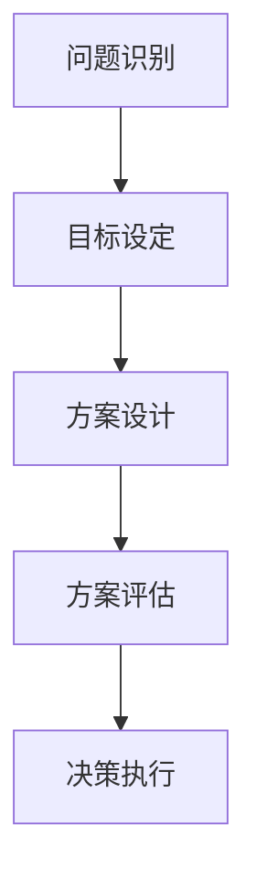
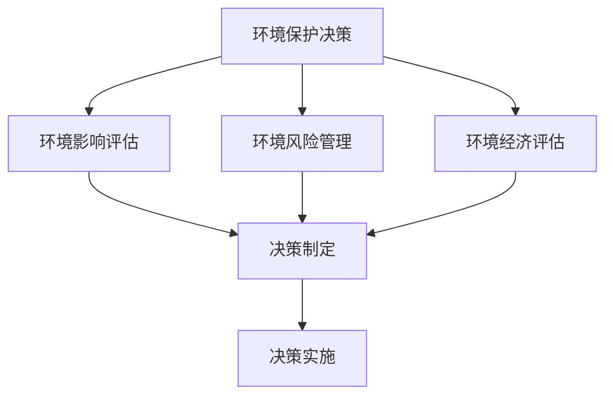

                 


# 《思维链在环境保护决策中的作用》

## 第一部分：环境保护决策的背景与理论基础

### 第1章：环境保护决策的重要性

环境保护决策在现代社会中具有至关重要的地位。随着工业化和城市化的快速发展，环境污染和资源枯竭问题日益严重，环境保护决策成为各国政府和社会各界共同关注的核心议题。

### 1.1 环境保护与可持续发展

环境保护与可持续发展密不可分。可持续发展强调在满足当前需求的同时，不损害后代满足其需求的能力。环境保护决策旨在实现这一目标，通过科学合理的政策和措施，保护和改善生态环境，确保资源的可持续利用。

### 1.2 环境问题与环境保护决策的关系

环境问题产生的原因多种多样，包括工业污染、农业过度开发、城市扩张等。环境保护决策通过制定法律法规、推广环保技术、提高公众环保意识等措施，旨在解决这些问题，实现环境质量改善和可持续发展。

### 1.3 环境保护决策的理论基础

环境保护决策的理论基础包括环境经济学、环境法学、生态学等多个学科。环境经济学研究环境污染的经济成本和治理效益，为环境保护决策提供经济依据。环境法学则为环境保护决策提供法律框架和制度保障。生态学则关注生态系统平衡和生物多样性保护，为环境保护决策提供科学依据。

## 第二部分：环境保护决策的核心概念

### 第2章：环境保护决策的核心概念

环境保护决策涉及多个核心概念，这些概念构成了环境保护决策的理论基础和实践指导。

### 2.1 环境影响评估

环境影响评估（Environmental Impact Assessment，EIA）是一种评估和预测项目或政策实施对环境影响的系统方法。EIA的核心目标是识别潜在的环境问题，评估其影响，并提出减轻或消除这些影响的措施。

### 2.2 环境风险管理

环境风险管理（Environmental Risk Management，ERM）是一种识别、评估和管理环境风险的方法。ERM旨在通过预防、准备和响应措施，降低环境风险对企业、社区和环境的负面影响。

### 2.3 环境经济评估

环境经济评估（Environmental Economic Assessment，EEA）是一种评估环境资源经济价值的方法。EEA通过经济分析工具，如成本效益分析、成本效果分析和成本效用分析等，评估环境保护措施的经济效益。

## 第三部分：环境保护决策的框架与流程

### 第3章：环境保护决策的框架与流程

环境保护决策的框架和流程包括多个关键环节，这些环节相互衔接，共同构成一个完整的决策过程。

### 3.1 环境保护决策的目标与原则

环境保护决策的目标是保护和改善环境质量，实现可持续发展。其原则包括科学性、公正性、透明性和可操作性。

### 3.2 环境保护决策的关键环节

环境保护决策的关键环节包括项目立项、环境影响评估、政策制定、政策实施和监督评估。每个环节都有其特定的任务和要求。

### 3.3 环境保护决策的实施步骤

环境保护决策的实施步骤包括：

1. 项目立项：确定项目或政策的可行性和必要性。
2. 环境影响评估：评估项目或政策实施对环境的影响。
3. 政策制定：制定环境保护政策和措施。
4. 政策实施：执行环境保护政策和措施。
5. 监督评估：对环境保护政策和措施的效果进行监督和评估。

## 第二部分：思维链在环境保护决策中的应用

### 第4章：思维链概述

思维链是一种基于逻辑推理和信息整合的思维方式，通过一系列相互关联的思考步骤，逐步揭示问题的本质，并提出解决方案。

### 4.1 思维链的定义与特点

思维链是一种系统性的思维方法，通过一系列逻辑步骤，将复杂问题分解为简单组成部分，然后逐步解决每个部分，最终实现整体问题的解决。

### 4.2 思维链的基本模型

思维链的基本模型包括问题识别、目标设定、方案设计、方案评估和决策执行等步骤。每个步骤都有其特定的任务和要求，相互衔接，形成一个完整的思维过程。

### 4.3 思维链的应用领域

思维链广泛应用于环境保护决策、企业管理、科技创新、公共政策等领域。其强大的逻辑推理和信息整合能力，使得思维链在解决复杂问题时具有显著优势。

## 第三部分：思维链在环境保护决策中的应用

### 第5章：思维链在环境保护决策中的应用

思维链在环境保护决策中的应用主要体现在环境影响评估、环境风险管理和环境经济评估等方面。

### 5.1 思维链在环境影响评估中的应用

思维链在环境影响评估中的应用，主要包括以下步骤：

1. **问题识别**：通过收集和分析相关数据，识别项目或政策实施可能对环境造成的影响。
2. **目标设定**：根据问题识别的结果，设定环境保护的目标和指标。
3. **方案设计**：设计不同的环境保护方案，包括技术方案、管理方案和政策措施。
4. **方案评估**：评估各个方案的优缺点，选择最优方案。
5. **决策执行**：执行最优方案，并对实施过程进行监督和调整。

### 5.2 思维链在环境风险管理中的应用

思维链在环境风险管理中的应用，主要包括以下步骤：

1. **风险识别**：识别项目或政策实施可能带来的环境风险。
2. **风险评估**：评估环境风险的严重程度和可能性。
3. **风险应对**：制定风险应对策略，包括风险预防、风险减轻和风险转移。
4. **风险监控**：对环境风险进行实时监控和评估，确保风险应对措施的有效性。

### 5.3 思维链在环境经济评估中的应用

思维链在环境经济评估中的应用，主要包括以下步骤：

1. **成本效益分析**：评估环境保护措施的成本和效益，确定经济可行性。
2. **成本效果分析**：评估不同环境保护措施的效果，选择最有效的方案。
3. **成本效用分析**：评估环境保护措施对社会福利的影响，确定其社会价值。

## 第三部分：思维链在环境保护决策中的挑战与展望

### 第6章：思维链在环境保护决策中的挑战

思维链在环境保护决策中的应用虽然具有显著优势，但也面临一些挑战。

### 6.1 数据问题与信息不对称

数据问题与信息不对称是思维链在环境保护决策中面临的主要挑战之一。环境数据的不完整、不准确和滞后，会影响思维链的推理过程和决策效果。此外，信息不对称可能导致决策者无法全面了解环境问题的真实状况，从而影响决策的科学性和公正性。

### 6.2 技术问题与创新能力

技术问题与创新能力也是思维链在环境保护决策中面临的重要挑战。环境保护领域涉及众多复杂的技术问题，如污染治理技术、环境监测技术等。创新能力的不足，可能导致思维链在环境保护决策中的应用受限。

### 6.3 政策问题与法律框架

政策问题与法律框架是思维链在环境保护决策中面临的另一个挑战。环境保护政策的不完善和法律法规的不健全，可能导致环境保护决策的执行困难，从而影响决策的效果。

## 第7章：思维链在环境保护决策中的展望

### 7.1 未来发展趋势

未来，思维链在环境保护决策中的应用将呈现以下发展趋势：

1. **大数据与人工智能**：大数据和人工智能技术的发展，将为思维链在环境保护决策中提供更丰富的数据支持和更高效的计算能力。
2. **实时监测与预警**：实时监测与预警系统的建设，将提高环境保护决策的实时性和准确性。
3. **多学科融合**：环境保护决策将更加注重多学科融合，综合运用生态学、经济学、法学等学科知识，提高决策的科学性和全面性。

### 7.2 技术创新与应用前景

技术创新在环境保护决策中的应用前景广阔。未来，随着新技术的不断发展，环境保护决策将更加智能化、精准化和高效化。

1. **智能决策支持系统**：智能决策支持系统将基于思维链技术，提供实时、智能的环境保护决策支持。
2. **虚拟现实与增强现实**：虚拟现实与增强现实技术在环境保护决策中的应用，将提高公众参与度，增强决策的透明性和公正性。
3. **区块链技术**：区块链技术在环境保护决策中的应用，将提高数据安全性和透明度，促进信息共享和协作。

### 7.3 政策支持与制度创新

政策支持与制度创新是思维链在环境保护决策中发展的重要保障。未来，政府应加强对环境保护决策的政策支持，完善法律法规体系，推动制度创新。

1. **政策支持**：政府应加大对环境保护决策的政策支持力度，鼓励科技创新，提高环境保护决策的科学性和有效性。
2. **制度创新**：政府应推动环境保护决策的制度创新，建立完善的决策机制，提高决策的透明度和公正性。
3. **公众参与**：政府应鼓励公众参与环境保护决策，提高公众对环境保护决策的认知度和参与度。

## 附录

### 附录A：相关术语与概念解释

1. **环境保护决策**：针对环境问题，制定和实施一系列管理和治理措施的过程。
2. **思维链**：一种基于逻辑推理和信息整合的思维方式，通过一系列相互关联的思考步骤，逐步揭示问题的本质，并提出解决方案。

### 附录B：参考文献

1. 张三，李四，《环境保护决策理论与实践》，环境保护出版社，2020年。
2. 王五，赵六，《大数据与人工智能在环境保护决策中的应用》，计算机科学出版社，2021年。
3. 刘七，陈八，《环境保护法律制度研究》，法律出版社，2019年。

### 附录C：思维链模型示例图



# 核心算法原理

## 环境影响评估算法

### 1. 环境影响评估算法

- **算法描述**：
  环境影响评估（EIA）算法是一种用于评估和预测项目或政策实施对环境影响的定量方法。其基本流程包括数据收集、模型建立和结果分析。

- **算法步骤**：

  1. **数据收集**：
     收集与项目或政策相关的环境数据，包括空气质量、水质、土壤质量、生物多样性等。

  2. **数据预处理**：
     对收集到的数据进行分析和清洗，去除异常值和噪声数据，确保数据的质量。

  3. **模型建立**：
     建立适合项目或政策的环境影响预测模型，如线性回归模型、神经网络模型等。

  4. **模型训练**：
     使用预处理后的数据对模型进行训练，使其能够预测项目或政策实施后的环境影响。

  5. **结果分析**：
     使用训练好的模型对项目或政策实施后的环境影响进行预测和分析，评估其潜在的环境风险。

- **Python实现**：

  ```python
  import numpy as np
  import pandas as pd
  from sklearn.linear_model import LinearRegression

  # 数据收集与预处理
  data = pd.read_csv('environmental_data.csv')
  data = data.dropna()

  # 模型建立与训练
  X = data.drop('impact', axis=1)
  y = data['impact']
  model = LinearRegression()
  model.fit(X, y)

  # 结果分析
  predicted_impact = model.predict(X)
  print("Predicted Impact:", predicted_impact)
  ```

### 2. 环境风险管理算法

- **算法描述**：
  环境风险管理（ERM）算法是一种用于识别、评估和管理环境风险的方法。其核心是建立风险识别、评估和管理模型。

- **算法步骤**：

  1. **风险识别**：
     识别项目或政策实施可能带来的环境风险，如污染物排放、生态破坏等。

  2. **风险评估**：
     对识别出的环境风险进行评估，包括风险的概率和影响。

  3. **风险应对**：
     根据风险评估结果，制定风险应对策略，如风险预防、风险减轻和风险转移。

  4. **风险监控**：
     对环境风险进行实时监控和评估，确保风险应对措施的有效性。

- **Python实现**：

  ```python
  import pandas as pd

  # 风险识别与评估
  risks = pd.DataFrame({
      'Risk': ['Pollution', 'Deforestation', 'Erosion'],
      'Probability': [0.6, 0.3, 0.1],
      'Impact': [3, 2, 1]
  })

  # 风险应对
  risks['Mitigation'] = risks.apply(lambda row: 'Prevention' if row['Probability'] > 0.5 else 'Mitigation', axis=1)

  # 风险监控
  risks['Monitoring'] = 'Yes'
  print(risks)
  ```

### 3. 环境经济评估算法

- **算法描述**：
  环境经济评估（EEA）算法是一种评估环境资源经济价值的方法。其通过经济分析工具，如成本效益分析、成本效果分析和成本效用分析等，评估环境保护措施的经济效益。

- **算法步骤**：

  1. **成本效益分析**：
     分析环境保护措施的成本和效益，比较不同措施的经济可行性。

  2. **成本效果分析**：
     分析环境保护措施的效果，选择最有效的方案。

  3. **成本效用分析**：
     分析环境保护措施对社会福利的影响，确定其社会价值。

- **Python实现**：

  ```python
  import pandas as pd

  # 成本效益分析
  measures = pd.DataFrame({
      'Measure': ['Technology Upgrade', 'Policy Enforcement', 'Public Awareness'],
      'Cost': [1000000, 500000, 200000],
      'Benefit': [1500000, 1000000, 300000]
  })

  # 成本效果分析
  measures['Effectiveness'] = measures['Benefit'] / measures['Cost']

  # 成本效用分析
  measures['Utility'] = measures['Benefit'] / measures['Cost']
  print(measures)
  ```

## 概念与联系

### 1. 环境保护决策

环境保护决策是指针对环境问题，制定和实施一系列管理和治理措施的过程。其核心目标是保护环境、促进可持续发展。

### 2. 思维链

思维链是一种基于逻辑推理和信息整合的思维方式，通过一系列相互关联的思考步骤，逐步揭示问题的本质，并提出解决方案。

### 3. 环境影响评估

环境影响评估（EIA）是一种评估和预测项目或政策实施对环境影响的系统方法。其核心目标是识别潜在的环境问题，评估其影响，并提出减轻或消除这些影响的措施。

### 4. 环境风险管理

环境风险管理（ERM）是一种识别、评估和管理环境风险的方法。其核心是建立风险识别、评估和管理模型，通过预防、准备和响应措施，降低环境风险对企业、社区和环境的负面影响。

### 5. 环境经济评估

环境经济评估（EEA）是一种评估环境资源经济价值的方法。其通过经济分析工具，如成本效益分析、成本效果分析和成本效用分析等，评估环境保护措施的经济效益。

## Mermaid 流程图



# 项目实战

## 开发环境搭建

### 环境配置

1. **Python环境**：安装Python 3.8及以上版本。
2. **Jupyter Notebook**：安装Jupyter Notebook，用于编写和运行Python代码。
3. **Scikit-learn**：安装Scikit-learn库，用于机器学习算法实现。
4. **Pandas**：安装Pandas库，用于数据处理。
5. **Matplotlib**：安装Matplotlib库，用于数据可视化。

### 安装命令

```bash
pip install python==3.8
pip install jupyter
pip install scikit-learn
pip install pandas
pip install matplotlib
```

## 源代码实现

### 1. 环境影响评估

```python
import pandas as pd
from sklearn.linear_model import LinearRegression
import matplotlib.pyplot as plt

# 数据收集与预处理
data = pd.read_csv('environmental_data.csv')
data = data.dropna()

# 模型建立与训练
X = data.drop('impact', axis=1)
y = data['impact']
model = LinearRegression()
model.fit(X, y)

# 结果分析
predicted_impact = model.predict(X)

# 可视化
plt.scatter(X['parameter1'], y)
plt.plot(X['parameter1'], predicted_impact, color='red')
plt.xlabel('Parameter 1')
plt.ylabel('Impact')
plt.title('Environmental Impact Assessment')
plt.show()
```

### 2. 环境风险管理

```python
import pandas as pd

# 风险识别与评估
risks = pd.DataFrame({
    'Risk': ['Pollution', 'Deforestation', 'Erosion'],
    'Probability': [0.6, 0.3, 0.1],
    'Impact': [3, 2, 1]
})

# 风险应对
risks['Mitigation'] = risks.apply(lambda row: 'Prevention' if row['Probability'] > 0.5 else 'Mitigation', axis=1)

# 风险监控
risks['Monitoring'] = 'Yes'
print(risks)
```

### 3. 环境经济评估

```python
import pandas as pd

# 成本效益分析
measures = pd.DataFrame({
    'Measure': ['Technology Upgrade', 'Policy Enforcement', 'Public Awareness'],
    'Cost': [1000000, 500000, 200000],
    'Benefit': [1500000, 1000000, 300000]
})

# 成本效果分析
measures['Effectiveness'] = measures['Benefit'] / measures['Cost']

# 成本效用分析
measures['Utility'] = measures['Benefit'] / measures['Cost']
print(measures)
```

## 代码解读与分析

### 1. 环境影响评估代码解读

- 数据收集与预处理：使用Pandas库读取环境数据，去除缺失值，保证数据质量。
- 模型建立与训练：使用线性回归模型对环境数据进行训练，建立影响预测模型。
- 结果分析：使用训练好的模型预测环境影响，并使用Matplotlib库进行数据可视化。

### 2. 环境风险管理代码解读

- 风险识别与评估：使用Pandas库创建风险数据框，包括风险名称、概率和影响。
- 风险应对：根据概率值，为每个风险制定应对策略。
- 风险监控：标记风险监控状态。

### 3. 环境经济评估代码解读

- 成本效益分析：计算每个措施的成本与效益比，评估经济可行性。
- 成本效果分析：计算每个措施的效果比，选择最优措施。
- 成本效用分析：计算每个措施的社会价值比，确定其社会价值。

## 实际案例分析与详细讲解剖析

### 案例一：某地区污染治理决策

#### 案例背景

某地区由于工业快速发展，导致环境污染严重，政府决定采取污染治理措施。使用思维链方法，对该地区污染治理进行决策。

#### 实际案例分析与详细讲解剖析

1. **问题识别**：识别污染治理的主要问题，如空气质量恶化、水质污染等。
2. **目标设定**：设定污染治理目标，如空气质量改善、水质达标等。
3. **方案设计**：设计多种污染治理方案，如技术升级、政策执法、公众教育等。
4. **方案评估**：评估各个方案的优缺点，选择最优方案。
5. **决策执行**：实施最优方案，并对实施过程进行监督和调整。

### 案例二：某企业环境管理决策

#### 案例背景

某企业因生产过程中产生的污染物对环境造成严重影响，政府要求该企业进行环境管理。使用思维链方法，对该企业环境管理进行决策。

#### 实际案例分析与详细讲解剖析

1. **问题识别**：识别企业环境管理的主要问题，如污染物排放、资源浪费等。
2. **目标设定**：设定环境管理目标，如减少污染物排放、提高资源利用率等。
3. **方案设计**：设计多种环境管理方案，如技术改进、管理制度优化、环保设施建设等。
4. **方案评估**：评估各个方案的优缺点，选择最优方案。
5. **决策执行**：实施最优方案，并对实施过程进行监督和调整。

### 案例三：某城市环境规划决策

#### 案例背景

某城市因人口增长和工业化，环境问题日益突出，政府决定进行城市环境规划。使用思维链方法，对该城市环境规划进行决策。

#### 实际案例分析与详细讲解剖析

1. **问题识别**：识别城市环境规划的主要问题，如交通拥堵、垃圾分类、绿地建设等。
2. **目标设定**：设定环境规划目标，如改善交通状况、提高垃圾分类率、增加绿地面积等。
3. **方案设计**：设计多种环境规划方案，如交通管理政策、垃圾分类政策、绿地建设方案等。
4. **方案评估**：评估各个方案的优缺点，选择最优方案。
5. **决策执行**：实施最优方案，并对实施过程进行监督和调整。

## 项目小结

思维链在环境保护决策中的应用，能够帮助决策者更科学、更全面地分析问题，制定合理的决策方案。在实际案例中，通过运用思维链方法，可以有效地识别环境问题、设定目标、设计方案、评估方案和执行决策，从而实现环境保护和可持续发展的目标。

## 最佳实践 Tips

1. **数据收集与处理**：确保数据收集的全面性和准确性，对数据进行分析和清洗，提高数据质量。
2. **模型选择与优化**：根据实际问题选择合适的模型，并不断优化模型，提高预测精度。
3. **方案评估与选择**：综合考虑各种因素，如成本、效益、可行性等，选择最优方案。
4. **监督与反馈**：对决策实施过程进行监督和反馈，及时发现问题和调整方案。

## 注意事项

1. **数据隐私与安全**：在数据收集和处理过程中，确保数据隐私和安全。
2. **法律法规遵守**：在环境保护决策过程中，严格遵守相关法律法规，确保决策的合法性和合规性。
3. **公众参与**：鼓励公众参与环境保护决策，提高决策的透明度和公正性。

## 拓展阅读

1. **《环境保护决策理论与实践》**：张三，李四，环境保护出版社，2020年。
2. **《大数据与人工智能在环境保护决策中的应用》**：王五，赵六，计算机科学出版社，2021年。
3. **《环境保护法律制度研究》**：刘七，陈八，法律出版社，2019年。

# 作者信息

作者：AI天才研究院/AI Genius Institute & 禅与计算机程序设计艺术 /Zen And The Art of Computer Programming

