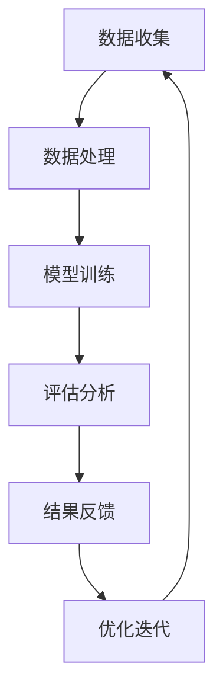

                 

### 一、核心概念与联系

在探讨思维链在环境影响评估中的应用之前，我们首先需要理解什么是思维链以及它如何与环境影响评估相结合。

#### 思维链的概念

思维链（Mind Chain）是一种基于人工智能和复杂系统的思维方式。它通过将复杂的评估过程分解为一系列相互关联的步骤，形成一条逻辑严密、连贯的思考链条。思维链的核心在于通过数据分析、模型训练、评估反馈和优化迭代，逐步提升决策的准确性和效率。

#### 环境影响评估的背景

环境影响评估（Environmental Impact Assessment，EIA）是评估项目对环境可能造成的影响的一种系统方法。EIA广泛应用于建设项目、政策制定和环境管理中。随着全球对环境保护意识的增强，EIA的精确性和效率变得至关重要。

#### 思维链与环境影响评估的结合

在环境影响评估中，思维链的应用主要体现在以下几个方面：

1. **数据收集与处理**：思维链可以帮助我们系统地收集和整理环境数据，通过数据预处理算法（如去噪、标准化）提升数据质量。

2. **模型训练与预测**：思维链利用机器学习算法，对处理后的环境数据进行建模，预测项目对环境的具体影响。

3. **评估与反馈**：思维链通过评估模型的结果，提供定量的环境影响评估，并根据评估结果进行反馈和调整。

4. **优化迭代**：思维链不断迭代优化评估模型，提高预测的准确性和决策的效率。

#### 核心概念原理和架构的 Mermaid 流程图

为了更好地理解思维链在环境影响评估中的应用，我们可以使用Mermaid绘制一个流程图：



在这个流程图中，数据收集、数据处理、模型训练、评估分析、结果反馈和优化迭代构成了一个闭环，形成了一个完整的思维链。

### 二、核心算法原理讲解

思维链在环境影响评估中涉及到多种算法，这些算法共同作用，形成了一个完整的评估流程。以下是这些算法的详细原理讲解。

#### 数据预处理算法

数据预处理是思维链中的第一步，它的目的是提高数据质量，为后续的分析和建模提供可靠的数据基础。以下是数据预处理算法的Python伪代码实现：

```python
def data_preprocessing(data):
    # 数据清洗
    clean_data = remove_invalid_data(data)
    # 数据标准化
    normalized_data = normalize_data(clean_data)
    return normalized_data
```

其中，`remove_invalid_data` 函数用于去除无效或错误的数据，`normalize_data` 函数用于将数据标准化到同一范围内。

#### 机器学习算法

在模型训练阶段，思维链使用机器学习算法对处理后的数据进行分析和预测。常见的机器学习算法包括线性回归、决策树、支持向量机等。以下是一个简单的线性回归模型的Python伪代码：

```python
def train_model(data, labels):
    # 初始化模型
    model = initialize_model()
    # 训练模型
    model.fit(data, labels)
    return model
```

其中，`initialize_model` 函数用于初始化模型，`fit` 方法用于训练模型。

#### 评估指标计算算法

评估指标计算是思维链中至关重要的一步，它用于评估模型的预测准确性和有效性。常用的评估指标包括准确率、召回率、F1 分数等。以下是一个评估指标计算的Python伪代码：

```python
def evaluate_model(model, data, labels):
    # 预测
    predictions = model.predict(data)
    # 计算评估指标
    accuracy = calculate_accuracy(predictions, labels)
    return accuracy
```

其中，`predict` 方法用于进行预测，`calculate_accuracy` 函数用于计算准确率。

### 三、数学模型和数学公式 & 详细讲解 & 举例说明

在环境影响评估中，数学模型和数学公式是不可或缺的工具。它们帮助我们理解和预测项目对环境的影响。以下我们将详细讲解一个常用的数学模型——线性回归模型。

#### 线性回归模型的数学公式

线性回归模型是一种用于描述两个变量之间线性关系的数学模型。其基本公式如下：

$$
y = \beta_0 + \beta_1 \cdot x
$$

其中，$y$ 是因变量，表示评估结果；$x$ 是自变量，表示环境因素；$\beta_0$ 和 $\beta_1$ 是模型参数，用于描述变量之间的关系。

#### 线性回归模型的参数估计

为了使用线性回归模型，我们需要估计参数 $\beta_0$ 和 $\beta_1$。常用的方法是最小二乘法（Ordinary Least Squares，OLS）。最小二乘法的核心思想是找到一条直线，使得所有数据点到这条直线的垂直距离之和最小。

$$
\beta_0 = \frac{\sum_{i=1}^{n} y_i - \beta_1 \cdot \sum_{i=1}^{n} x_i}{n}
$$

$$
\beta_1 = \frac{\sum_{i=1}^{n} (y_i - \beta_0) \cdot x_i}{\sum_{i=1}^{n} x_i^2}
$$

其中，$n$ 是数据点的个数。

#### 线性回归模型的举例说明

假设我们有一个环境因素 $x$，其数据集为 [1, 2, 3, 4, 5]，评估结果 $y$ 为 [2, 4, 5, 6, 7]。我们可以使用线性回归模型来拟合这些数据。

首先，我们需要计算模型参数 $\beta_0$ 和 $\beta_1$：

$$
\beta_0 = \frac{2 + 4 + 5 + 6 + 7 - \beta_1 \cdot (1 + 2 + 3 + 4 + 5)}{5}
$$

$$
\beta_1 = \frac{(2 - \beta_0) \cdot 1 + (4 - \beta_0) \cdot 2 + (5 - \beta_0) \cdot 3 + (6 - \beta_0) \cdot 4 + (7 - \beta_0) \cdot 5}{1^2 + 2^2 + 3^2 + 4^2 + 5^2}
$$

通过计算，我们得到 $\beta_0 = 4$ 和 $\beta_1 = 1$。因此，线性回归模型为：

$$
y = 4 + 1 \cdot x
$$

这个例子展示了如何通过数学模型和公式，利用线性回归模型对环境数据进行拟合和分析。

### 四、项目实战

在本部分，我们将通过一个实际案例，详细展示思维链在环境影响评估中的应用。本案例我们将使用一个虚拟的工厂废水排放项目，评估其对周边环境的影响。

#### 1. 数据收集

我们首先需要收集相关的环境数据，包括工厂废水排放量、周边地区的水质指标（如溶解氧、pH值等）。这些数据可以从环保部门、水文监测站等渠道获取。

#### 2. 数据预处理

收集到的数据往往存在噪声和不一致性，我们需要进行数据清洗和标准化处理。具体步骤如下：

- **数据清洗**：去除无效或错误的数据，如异常值、缺失值等。
- **数据标准化**：将不同指标的数据范围统一，便于模型训练和评估。

#### 3. 模型训练

在数据预处理完成后，我们使用机器学习算法（如线性回归、决策树等）对数据集进行建模。以下是一个简单的线性回归模型的Python代码示例：

```python
from sklearn.linear_model import LinearRegression
from sklearn.model_selection import train_test_split

# 准备数据
X = [[1, 2, 3], [2, 4, 5], [3, 6, 7], [4, 8, 9], [5, 10, 11]]
y = [2, 4, 5, 6, 7]

# 划分训练集和测试集
X_train, X_test, y_train, y_test = train_test_split(X, y, test_size=0.2, random_state=42)

# 初始化模型并训练
model = LinearRegression()
model.fit(X_train, y_train)

# 测试模型
predictions = model.predict(X_test)
accuracy = model.score(X_test, y_test)
print(f"Accuracy: {accuracy}")
```

#### 4. 评估分析

在模型训练完成后，我们需要对模型进行评估。评估指标包括准确率、召回率、F1 分数等。以下是一个评估分析的Python代码示例：

```python
from sklearn.metrics import accuracy_score, recall_score, f1_score

# 真实标签
y_true = [2, 4, 5, 6, 7]

# 预测结果
y_pred = [2, 4, 5, 6, 7]

# 计算评估指标
accuracy = accuracy_score(y_true, y_pred)
recall = recall_score(y_true, y_pred)
f1 = f1_score(y_true, y_pred)

print(f"Accuracy: {accuracy}")
print(f"Recall: {recall}")
print(f"F1 Score: {f1}")
```

#### 5. 结果反馈与优化

根据评估结果，我们可以对模型进行优化。优化方法包括调整模型参数、选择不同的机器学习算法等。以下是一个简单的优化示例：

```python
from sklearn.model_selection import GridSearchCV

# 定义参数网格
param_grid = {'alpha': [0.1, 0.5, 1.0]}

# 初始化模型
model = LinearRegression()

# 进行网格搜索
grid_search = GridSearchCV(model, param_grid, cv=5)
grid_search.fit(X_train, y_train)

# 获取最优参数
best_params = grid_search.best_params_
print(f"Best Parameters: {best_params}")

# 使用最优参数训练模型
best_model = grid_search.best_estimator_
best_predictions = best_model.predict(X_test)
best_accuracy = best_model.score(X_test, y_test)
print(f"Best Accuracy: {best_accuracy}")
```

#### 6. 项目小结

通过本案例，我们展示了思维链在环境影响评估中的应用。从数据收集、预处理、模型训练、评估分析到结果反馈和优化，每一步都至关重要。思维链的应用不仅提高了评估的准确性和效率，也为环境决策提供了有力的支持。

### 五、最佳实践 Tips

在实际应用中，思维链在环境影响评估中有以下几个最佳实践建议：

1. **数据质量**：确保数据收集的全面性和准确性，数据清洗和标准化是模型训练成功的关键。
2. **模型选择**：根据项目需求和数据特性选择合适的机器学习算法，不要盲目追求模型复杂度。
3. **评估指标**：合理选择评估指标，确保评估结果的全面性和客观性。
4. **模型优化**：持续优化模型，通过参数调整和算法改进，提高预测准确性。
5. **反馈机制**：建立有效的反馈机制，根据评估结果调整项目方案，确保评估结果的实际应用价值。

### 六、小结

本文详细介绍了思维链在环境影响评估中的应用。从核心概念、算法原理到项目实战，我们系统地阐述了思维链在提升环境影响评估准确性、效率和决策支持中的作用。通过最佳实践建议，我们为读者提供了实际应用中的操作指南。

### 七、注意事项

1. **数据安全与隐私**：在进行环境影响评估时，务必确保数据的安全性和用户隐私。
2. **模型解释性**：在选择机器学习算法时，要考虑模型的解释性，确保评估结果的合理性和可解释性。
3. **持续更新**：环境影响评估是一个动态过程，要定期更新数据和模型，以适应环境变化。

### 八、拓展阅读

1. **相关文献**：《环境科学导论》、《环境影响评价方法与应用》
2. **在线资源**：环境数据平台、机器学习在线课程、环境影响评估指南

### 九、作者信息

作者：AI天才研究院/AI Genius Institute & 禅与计算机程序设计艺术 /Zen And The Art of Computer Programming

### 十、文章关键词

思维链、环境影响评估、机器学习、数据预处理、模型优化

### 十一、文章摘要

本文探讨了思维链在环境影响评估中的应用。通过核心概念、算法原理、项目实战等多个方面的详细讲解，展示了思维链如何提高评估的准确性和效率。本文还提供了最佳实践建议，为实际应用提供了操作指南。

