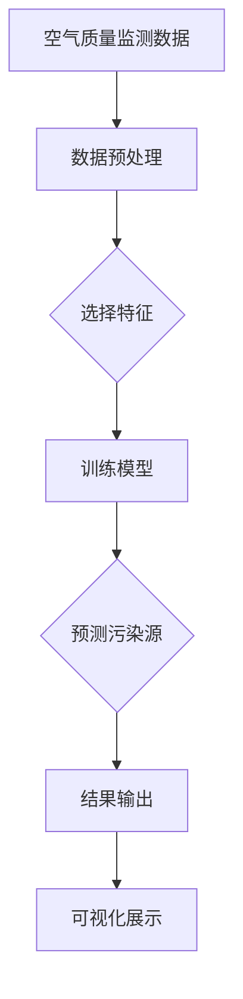
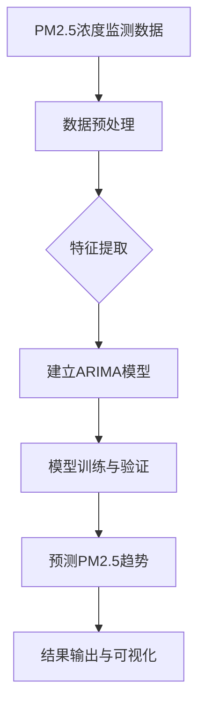
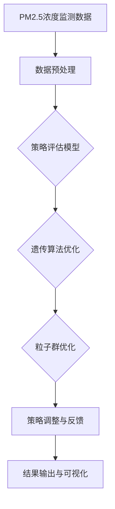
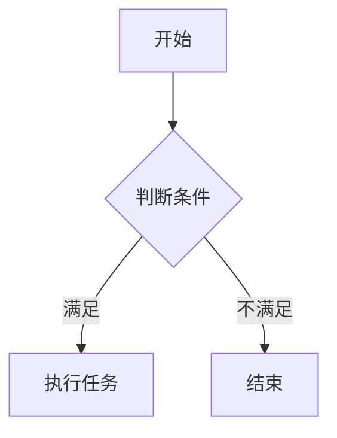

                 


## 思维链在环境污染监测中的应用

### 关键词
- 思维链
- 环境污染监测
- 算法原理
- 数学模型
- 项目实战

### 摘要
本文旨在探讨思维链在环境污染监测中的应用，通过详细阐述思维链的定义、运作原理以及其在环境污染监测中的实际应用，为环保领域提供一种创新的解决方案。文章首先介绍了环境污染监测的背景和重要性，然后深入探讨了思维链的基本概念和其在环境保护中的应用。接着，文章通过伪代码和数学模型详细讲解了环境污染监测的核心算法原理，并通过实际项目案例展示了思维链在环境监测中的具体应用。最后，文章总结了思维链在环境污染监测中的优势与挑战，并提出了未来发展的展望。

## 引言

### 1.1 书籍背景

随着工业化和城市化的迅速发展，环境污染问题日益严重，空气质量下降、水质污染、土壤退化等问题已经成为全球性的环境危机。环境污染不仅对生态系统造成破坏，还对人体健康产生严重影响，引起了全球范围内的广泛关注。为了有效解决环境污染问题，各国政府和环保组织投入了大量资源进行污染监测和研究。然而，传统的污染监测方法在数据采集、处理和分析方面存在一定的局限性，难以满足日益复杂的环境监测需求。

近年来，人工智能技术的迅猛发展为环境污染监测带来了新的契机。其中，思维链（MindChain）作为一种新型的智能计算模型，因其强大的信息处理和推理能力，在环境污染监测领域显示出巨大的潜力。思维链将大数据、人工智能和区块链技术相结合，能够实现环境数据的实时监测、分析和共享，为污染源识别、污染趋势预测和污染治理策略优化提供科学依据。

本书旨在探讨思维链在环境污染监测中的应用，通过系统介绍思维链的基本概念、算法原理和实际应用案例，为环境保护领域提供一种创新的解决方案。本书结构分为七个章节，首先介绍环境污染监测的背景和重要性，然后深入探讨思维链的基本概念和运作原理。接着，本文将通过伪代码和数学模型详细讲解环境污染监测的核心算法原理。随后，通过实际项目案例展示思维链在环境监测中的具体应用。最后，本文将对思维链在环境污染监测中的优势与挑战进行总结，并提出未来发展的展望。

### 1.2 思维链的概念

思维链（MindChain）是一种基于区块链和人工智能的新型计算模型，它将大数据、机器学习和分布式计算技术相结合，旨在实现高效、安全、可信的数据处理和分析。思维链的核心思想是通过构建一个去中心化的数据共享网络，使得不同来源的数据能够在一个统一的平台上进行高效处理和分析，从而提高环境污染监测的准确性和实时性。

思维链的基本概念包括以下几个关键部分：

1. **区块链技术**：区块链是一种分布式数据库技术，具有去中心化、不可篡改和透明等特点。思维链利用区块链技术来保证数据的真实性和安全性，防止数据篡改和伪造。

2. **智能合约**：智能合约是一种自动执行合同条款的计算机程序，它可以确保交易在满足特定条件时自动执行。在思维链中，智能合约用于自动化数据采集、处理和共享过程，提高监测系统的效率。

3. **机器学习**：机器学习是一种通过数据训练模型来模拟人类智能的技术。思维链利用机器学习算法对环境数据进行深度分析和模式识别，从而实现对污染源和污染趋势的精准预测。

4. **数据共享网络**：思维链通过构建一个去中心化的数据共享网络，使得不同来源的数据能够在同一平台上进行整合和分析，实现数据的高效利用。

5. **共识机制**：共识机制是确保区块链网络中所有节点达成一致的关键机制。思维链采用基于博弈论的共识机制，通过节点间的竞争和合作来确保网络的稳定性和安全性。

### 1.3 环境污染监测的重要性

环境污染监测是环境保护的基础，它对于及时发现污染问题、评估污染程度、制定污染治理措施具有重要意义。以下从三个方面阐述环境污染监测的重要性：

1. **污染源识别**：环境污染监测可以准确识别污染源，帮助环境保护部门和企业采取及时有效的治理措施，防止污染进一步扩散。

2. **污染趋势预测**：通过监测数据的分析，可以预测污染物的扩散趋势和污染程度的变化，为环保决策提供科学依据，从而制定更有效的污染治理策略。

3. **环境保护决策**：环境污染监测数据是环保政策制定和实施的重要依据。准确的监测数据可以帮助政府和企业评估环境污染的严重性，制定合理的环保政策和措施，推动生态文明建设。

### 1.4 本书结构

本书分为七个章节，具体结构如下：

- **第一章 引言**：介绍环境污染监测的背景和重要性，阐述思维链的基本概念和应用前景。
- **第二章 思维链基础**：详细讲解思维链的基本概念、运作原理和核心组件。
- **第三章 环境污染监测技术**：介绍环境污染监测的主要方法、技术和设备。
- **第四章 思维链在环境污染监测中的应用**：探讨思维链在污染源识别、污染趋势预测和污染治理策略优化中的应用。
- **第五章 实际案例研究**：通过具体案例展示思维链在环境污染监测中的实际应用。
- **第六章 未来展望与挑战**：分析思维链在环境污染监测中的未来发展前景和面临的挑战。
- **第七章 总结**：对全书内容进行总结，并提出未来研究的方向和建议。

## 思维链基础

### 2.1 思维链的定义

思维链（MindChain）是一种基于区块链和人工智能的新型计算模型，旨在解决环境数据监测、处理和共享中的问题。思维链通过结合区块链技术的去中心化、不可篡改和透明特性，以及人工智能的智能合约、数据分析和模式识别能力，实现环境数据的实时监测、分析和共享，为污染源识别、污染趋势预测和污染治理策略优化提供支持。

思维链的定义可以分解为以下几个关键部分：

1. **环境数据监测**：思维链利用传感器、监测设备和卫星遥感等手段，实时收集环境数据，包括空气质量、水质、土壤污染等。
2. **区块链技术**：思维链基于区块链技术构建，通过分布式账本记录环境数据，确保数据的安全性和透明性。
3. **智能合约**：思维链中的智能合约用于自动化数据采集、处理和共享过程，提高监测系统的效率和可靠性。
4. **数据分析与机器学习**：思维链利用机器学习算法对环境数据进行深度分析，识别污染源、预测污染趋势，并提供决策支持。
5. **去中心化数据共享**：思维链通过构建去中心化的数据共享网络，使得不同来源的环境数据能够在同一平台上进行整合和分析，实现数据的高效利用。

### 2.2 思维链的运作原理

思维链的运作原理可以分为以下几个关键步骤：

1. **数据采集**：思维链通过部署在环境中的传感器、监测设备和卫星遥感等设备，实时采集环境数据，包括空气质量、水质、土壤污染等。这些数据被加密并上传到区块链网络。

2. **数据验证**：上传到区块链的数据需要经过验证，以确保数据的真实性和准确性。思维链利用区块链的去中心化特性，通过节点间的共识机制验证数据的真实性。

3. **智能合约执行**：验证通过的数据将触发智能合约执行，智能合约根据预定的规则自动执行数据清洗、转换和预处理等操作。

4. **数据分析**：预处理后的数据将被发送到数据分析模块，利用机器学习算法进行模式识别、异常检测和污染源定位等分析任务。

5. **决策支持**：分析结果将被用于污染源识别、污染趋势预测和污染治理策略优化。决策支持系统（DSS）根据分析结果提供实时决策支持。

6. **数据共享**：分析结果和数据报告将通过区块链网络共享给相关利益相关者，包括政府、企业和公众等。

### 2.3 思维链在环境保护中的应用

思维链在环境保护中的应用主要体现在以下几个方面：

1. **污染源识别**：思维链利用机器学习算法对环境数据进行深度分析，准确识别污染源，帮助环保部门和企业及时采取治理措施。

2. **污染趋势预测**：思维链通过对历史监测数据的分析，结合环境数据的变化规律，预测未来的污染趋势，为环保决策提供科学依据。

3. **污染治理策略优化**：思维链利用数据分析结果，为污染治理策略提供优化建议，帮助政府和企业在有限的资源下实现最大的治理效果。

4. **环境数据共享**：思维链通过构建去中心化的数据共享网络，实现环境数据的高效利用和共享，提高环境保护的透明度和公众参与度。

5. **生态监测与评估**：思维链可以为生态环境监测和评估提供实时、准确的数据支持，帮助政府和科研机构评估生态系统的健康状况，制定生态修复计划。

### 2.4 环境污染监测的基本概念

环境污染监测是指利用科学方法和仪器设备，对环境中各种污染物进行定量或定性的测定，以了解环境质量状况的过程。环境污染监测的基本概念包括以下几个方面：

1. **污染物**：污染物是指进入环境并对人类健康、生态系统或环境质量产生负面影响的物质。常见的污染物包括空气中的颗粒物（PM2.5、PM10）、有害气体（SO2、NOx）、水中的重金属（Hg、Cd）和有机污染物（苯、酚）等。

2. **污染源**：污染源是指产生污染物的场所或设备，如工业排放、交通排放、农业污染和生活污染等。

3. **环境质量**：环境质量是指环境对人类生存和发展的适宜程度。环境质量的好坏直接关系到人类健康、生态平衡和可持续发展。

4. **监测指标**：监测指标是指用于衡量环境质量的具体参数，如空气质量指数（AQI）、水质指标（COD、BOD、氨氮等）和土壤污染指标（Dioxins、PCBs等）。

5. **监测方法**：监测方法包括采样方法、实验室分析和现场监测等。采样方法主要包括空气采样、水采样和土壤采样等；实验室分析主要包括化学分析、生物分析和物理分析等；现场监测则主要通过便携式监测设备进行实时监测。

### 2.5 思维链在环境保护中的优势

思维链在环境保护中具有以下优势：

1. **实时性**：思维链利用区块链和人工智能技术，实现环境数据的实时采集、处理和分析，为污染源识别、污染趋势预测和污染治理策略优化提供及时、准确的决策支持。

2. **高效性**：思维链通过分布式计算和智能合约，实现环境数据的快速处理和共享，提高监测系统的效率和可靠性。

3. **安全性**：思维链基于区块链技术，确保环境数据的真实性和安全性，防止数据篡改和泄露。

4. **透明性**：思维链构建去中心化的数据共享网络，实现环境数据的高效利用和透明共享，提高环境保护的透明度和公众参与度。

5. **可扩展性**：思维链具有良好的可扩展性，可以支持各种环境监测设备和监测指标的接入，满足不同应用场景的需求。

### 2.6 思维链的应用场景

思维链在环境保护中的应用场景广泛，包括但不限于以下几个方面：

1. **空气质量监测**：通过思维链，实时监测空气质量，识别污染源，预测污染趋势，为城市大气污染治理提供科学依据。

2. **水质监测**：利用思维链，实时监测水质变化，识别污染源，预测污染趋势，为河流和湖泊的污染治理提供支持。

3. **土壤污染监测**：通过思维链，监测土壤污染情况，评估污染程度，预测污染扩散趋势，为土壤修复和治理提供科学依据。

4. **生态监测**：利用思维链，实时监测生态环境变化，评估生态系统的健康状况，为生态保护和修复提供数据支持。

5. **污染治理策略优化**：通过思维链，分析污染治理效果，优化污染治理策略，提高治理效果和资源利用率。

### 2.7 思维链的未来发展

思维链在环境保护中的应用前景广阔，未来发展趋势包括：

1. **技术升级**：随着人工智能和区块链技术的不断发展，思维链的性能和功能将得到进一步提升，实现更加精准、高效的污染监测和治理。

2. **跨领域应用**：思维链不仅可以应用于环境保护，还可以应用于水资源管理、气候变化监测、食品安全等领域，实现跨领域的智能化监测和治理。

3. **国际合作**：思维链有望在国际合作中发挥重要作用，促进全球环境数据的共享和治理，推动全球环境保护事业的发展。

4. **政策支持**：随着环保意识的提高，政府将加大对思维链等新型环保技术的支持力度，为思维链的推广应用提供政策保障。

## 环境污染监测技术

### 3.1 环境污染监测的主要方法

环境污染监测是环境保护的重要环节，其主要目的是及时、准确地获取环境污染信息，为污染源识别、污染治理和环境保护决策提供科学依据。环境污染监测的主要方法包括采样方法、监测设备和技术，以下将分别进行介绍。

#### 3.1.1 采样方法

采样方法是环境污染监测的基础，主要包括空气采样、水采样和土壤采样等。

1. **空气采样**：空气采样主要采集空气中的颗粒物、气体污染物和微生物等。常用的采样设备有空气采样器、滤膜采样器和高流量采样器等。

2. **水采样**：水采样主要采集水体中的污染物，如重金属、有机污染物和细菌等。采样设备包括采样瓶、采样泵和水样储存装置等。

3. **土壤采样**：土壤采样主要采集土壤中的污染物，如重金属、有机污染物和细菌等。采样设备包括土壤采样器、钻探设备和采样桶等。

#### 3.1.2 监测设备

监测设备是环境污染监测的重要工具，主要包括空气监测设备、水质监测设备和土壤监测设备等。

1. **空气监测设备**：空气监测设备包括颗粒物监测仪、气体监测仪和微生物监测仪等。这些设备可以实时监测空气中的污染物浓度，提供精确的数据支持。

2. **水质监测设备**：水质监测设备包括水质多参数监测仪、重金属监测仪和有机污染物监测仪等。这些设备可以实时监测水体中的污染物浓度，评估水质状况。

3. **土壤监测设备**：土壤监测设备包括土壤多参数监测仪、重金属监测仪和有机污染物监测仪等。这些设备可以实时监测土壤中的污染物浓度，评估土壤质量。

#### 3.1.3 监测技术

环境污染监测技术主要包括实验室分析和现场监测技术。

1. **实验室分析**：实验室分析是环境污染监测的重要手段，主要包括化学分析、生物分析和物理分析等。化学分析主要用于测定污染物的化学成分和浓度；生物分析主要用于评估污染物的生物毒性；物理分析主要用于测定污染物的物理性质。

2. **现场监测**：现场监测是利用便携式监测设备对环境污染现场进行实时监测，主要包括便携式空气监测仪、便携式水质监测仪和便携式土壤监测仪等。现场监测可以快速、准确地获取环境污染数据，为污染治理和环境保护决策提供及时支持。

### 3.2 环境污染监测的关键技术

在环境污染监测中，关键技术的应用对于提高监测效率和准确性具有重要意义。以下将介绍几种关键的环境污染监测技术。

#### 3.2.1 传感器技术

传感器技术是环境污染监测的核心技术，用于实时、准确地检测环境中的污染物。传感器根据检测原理的不同，可以分为物理传感器、化学传感器和生物传感器等。

1. **物理传感器**：物理传感器通过测量物理参数（如温度、湿度、压力等）来检测污染物。常见的物理传感器有红外传感器、激光传感器和超声波传感器等。

2. **化学传感器**：化学传感器通过化学反应来检测污染物，常用的化学传感器有电化学传感器、半导体传感器和光电传感器等。

3. **生物传感器**：生物传感器利用生物体（如酶、抗体、细胞等）与污染物的特异性反应来检测污染物。生物传感器具有高灵敏度、高选择性等优点。

#### 3.2.2 数据采集与传输技术

数据采集与传输技术是确保环境污染监测数据实时、准确的关键。常用的数据采集与传输技术包括无线传感器网络（WSN）、物联网（IoT）和卫星遥感技术等。

1. **无线传感器网络（WSN）**：无线传感器网络由部署在监测区域中的传感器节点组成，通过无线通信技术实现数据采集和传输。WSN具有自组织、自维护和自扩展等优点，适用于大面积的环境监测。

2. **物联网（IoT）**：物联网通过互联网将各种智能设备连接起来，实现数据的实时采集、传输和共享。物联网技术可以提高环境污染监测的实时性和准确性，实现远程监控和管理。

3. **卫星遥感技术**：卫星遥感技术利用卫星搭载的遥感器对地表进行遥感监测，获取大范围、高分辨率的环境信息。卫星遥感技术适用于大气污染、水污染和土地污染等大范围环境监测。

#### 3.2.3 数据处理与分析技术

数据处理与分析技术是环境污染监测中不可或缺的一部分，用于对采集到的环境数据进行清洗、存储、分析和可视化。以下介绍几种常用的数据处理与分析技术。

1. **数据清洗**：数据清洗是确保数据质量的重要步骤，包括去除噪声、纠正错误和填补缺失值等。常用的数据清洗方法有过滤法、插值法和均值法等。

2. **数据存储**：数据存储是将清洗后的数据存储在数据库或数据仓库中，以便进行后续分析和查询。常用的数据存储技术有关系数据库、NoSQL数据库和数据仓库等。

3. **数据分析**：数据分析是环境污染监测的核心环节，包括统计分析、模式识别和机器学习等。统计分析用于描述数据的基本特征，模式识别用于发现数据中的规律和趋势，机器学习用于建立预测模型和决策支持系统。

4. **数据可视化**：数据可视化是将数据分析结果以图形或图表的形式展示，帮助人们更好地理解和分析数据。常用的数据可视化工具包括Excel、Python的Matplotlib库和Tableau等。

#### 3.2.4 智能监测与预警技术

智能监测与预警技术是利用人工智能技术实现环境污染监测的自动化和智能化。以下介绍几种智能监测与预警技术。

1. **机器学习**：机器学习是一种基于数据的学习方法，通过训练模型来预测污染物的浓度和变化趋势。常见的机器学习算法有线性回归、决策树、支持向量机和神经网络等。

2. **深度学习**：深度学习是机器学习的一种方法，通过多层神经网络来实现复杂的非线性映射。深度学习在图像识别、语音识别和自然语言处理等领域取得了显著成果，也在环境污染监测中显示出巨大的潜力。

3. **智能预警系统**：智能预警系统是基于机器学习和深度学习算法构建的，能够实时监测环境污染数据，识别异常情况，并发出预警信号。智能预警系统可以提高污染治理的效率和准确性，为环境保护决策提供科学依据。

### 3.3 环境污染监测技术的发展趋势

随着科技的进步，环境污染监测技术也在不断发展和创新。以下介绍环境污染监测技术的发展趋势。

#### 3.3.1 高灵敏度与高精度监测技术

未来，环境污染监测技术将朝着更高灵敏度、更高精度的方向发展。新型传感器和检测方法的出现，将进一步提高环境监测的准确性和可靠性。

#### 3.3.2 多参数、多尺度监测技术

未来的环境污染监测技术将实现多参数、多尺度的监测。通过整合多种传感器和监测设备，可以同时监测多种污染物，实现对环境质量的全面评估。

#### 3.3.3 智能化监测与决策支持系统

随着人工智能技术的不断发展，未来的环境污染监测将实现智能化监测与决策支持。通过机器学习和深度学习算法，可以自动识别污染源、预测污染趋势，为污染治理提供科学依据。

#### 3.3.4 网络化、智能化环境监测平台

未来的环境污染监测将朝着网络化、智能化的方向发展。通过物联网、无线传感器网络和云计算等技术，实现环境数据的实时采集、传输和处理，构建智能化的环境监测平台。

#### 3.3.5 跨领域协同与国际合作

随着环境污染问题的全球化，未来的环境污染监测将实现跨领域协同和国际合作。通过共享数据和技术，加强各国在环境保护领域的合作，共同应对全球性的环境污染挑战。

## 思维链在环境污染监测中的应用

### 4.1 思维链在污染源识别中的应用

思维链（MindChain）在污染源识别中的应用是其核心功能之一，通过结合区块链技术和人工智能算法，实现对环境污染源的精准定位。以下将详细讲解思维链在污染源识别中的应用流程、核心算法和实际案例。

#### 4.1.1 应用流程

思维链在污染源识别中的应用流程主要包括以下几个步骤：

1. **数据采集与预处理**：通过传感器网络实时采集环境数据，如空气中的颗粒物浓度、水质中的污染物浓度等。采集到的数据经过预处理，包括去噪、滤波和异常值处理等，以确保数据质量。

2. **数据上传与验证**：预处理后的数据通过区块链网络上传至分布式账本。区块链节点通过共识机制对数据进行验证，确保数据的真实性和完整性。

3. **污染源识别算法**：利用机器学习算法，如决策树、支持向量机和神经网络等，对上传的数据进行训练和分析，识别污染源。算法会根据历史数据和污染物扩散模型，确定污染源的位置和类型。

4. **结果输出与可视化**：识别结果通过区块链网络共享给相关部门和企业，并通过可视化工具展示，如地图、图表等，便于用户理解和决策。

#### 4.1.2 核心算法

思维链在污染源识别中主要采用的算法是机器学习算法，以下简要介绍几种常用的机器学习算法：

1. **决策树（Decision Tree）**：决策树是一种基于树形结构的分类算法，通过将特征进行二分，将数据逐步划分到不同区域。决策树算法简单直观，易于解释，但在处理大量数据时可能存在过拟合问题。

   ```python
   def build_decision_tree(data, features):
       """
       构建决策树
       输入：数据集data，特征列表features
       输出：决策树
       """
       # 略
   ```

2. **支持向量机（Support Vector Machine, SVM）**：支持向量机是一种基于优化理论的分类算法，通过寻找最佳分割超平面，将不同类别的数据分离。SVM在处理高维数据和线性不可分问题方面具有优势。

   ```python
   def train_svm(data, labels):
       """
       训练支持向量机
       输入：数据集data，标签列表labels
       输出：支持向量机模型
       """
       # 略
   ```

3. **神经网络（Neural Network）**：神经网络是一种模拟人脑神经元连接的模型，通过多层感知器实现数据的非线性映射。神经网络在处理复杂数据和进行非线性建模方面具有优势，但训练过程较慢。

   ```python
   def build_neural_network(data, labels):
       """
       构建神经网络
       输入：数据集data，标签列表labels
       输出：神经网络模型
       """
       # 略
   ```

#### 4.1.3 实际案例

以下通过一个实际案例，展示思维链在污染源识别中的应用。

**案例背景**：某城市空气质量监测系统采用思维链技术进行污染源识别，监测数据包括PM2.5、PM10、SO2、NO2和O3等污染物。

**数据采集**：传感器网络实时采集空气质量数据，上传至区块链网络。

**数据预处理**：对采集到的数据进行去噪、滤波和异常值处理，确保数据质量。

**污染源识别**：利用机器学习算法（如SVM和神经网络）对预处理后的数据进行分析，识别污染源。识别过程包括特征选择、模型训练和预测。

**结果输出**：识别结果通过区块链网络共享给相关部门和企业，并通过可视化工具展示。

**可视化展示**：利用地图和图表展示污染源的位置、类型和污染物浓度。



### 4.2 思维链在污染趋势预测中的应用

思维链（MindChain）在污染趋势预测中的应用是其另一个重要功能，通过分析历史监测数据和环境因素，预测未来污染物的浓度变化趋势。以下将详细讲解思维链在污染趋势预测中的应用流程、数学模型和实际案例。

#### 4.2.1 应用流程

思维链在污染趋势预测中的应用流程主要包括以下几个步骤：

1. **数据采集与预处理**：采集历史监测数据和气象数据，如温度、湿度、风速和气压等。预处理包括数据去噪、缺失值填补和异常值处理等，以确保数据质量。

2. **特征提取**：从预处理后的数据中提取相关特征，如污染物浓度、气象参数和地理位置等。特征提取有助于提高预测模型的准确性。

3. **数学模型构建**：根据污染物扩散规律和环境因素，建立数学模型，如时间序列模型、回归模型和神经网络模型等。数学模型用于预测未来污染物的浓度变化趋势。

4. **模型训练与验证**：利用历史数据对预测模型进行训练，并通过交叉验证等方法评估模型性能。

5. **趋势预测**：利用训练好的模型预测未来污染物的浓度变化趋势，并提供预测结果。

6. **结果输出与可视化**：将预测结果通过区块链网络共享给相关部门和企业，并通过可视化工具展示，如时间序列图、地图等。

#### 4.2.2 数学模型

思维链在污染趋势预测中主要采用的数学模型是时间序列模型和回归模型。以下简要介绍这两种模型：

1. **时间序列模型**：时间序列模型用于分析时间序列数据，预测未来值。常见的模型有ARIMA（自回归积分滑动平均模型）和LSTM（长短时记忆网络）等。

   ```python
   def build_arima_model(data):
       """
       构建ARIMA模型
       输入：时间序列数据data
       输出：ARIMA模型
       """
       # 略

   def build_lstm_model(data):
       """
       构建LSTM模型
       输入：时间序列数据data
       输出：LSTM模型
       """
       # 略
   ```

2. **回归模型**：回归模型用于分析自变量和因变量之间的关系，预测因变量的值。常见的模型有线性回归、多元回归和岭回归等。

   ```python
   def build_linear_regression_model(data, labels):
       """
       构建线性回归模型
       输入：数据集data，标签列表labels
       输出：线性回归模型
       """
       # 略

   def build_multivariate_regression_model(data, labels):
       """
       构建多元回归模型
       输入：数据集data，标签列表labels
       输出：多元回归模型
       """
       # 略
   ```

#### 4.2.3 实际案例

以下通过一个实际案例，展示思维链在污染趋势预测中的应用。

**案例背景**：某城市采用思维链技术预测PM2.5的浓度变化趋势，监测数据包括历史PM2.5浓度、温度、湿度、风速和气压等。

**数据采集**：传感器网络实时采集PM2.5浓度和气象数据，上传至区块链网络。

**数据预处理**：对采集到的数据进行去噪、缺失值填补和异常值处理，确保数据质量。

**特征提取**：从预处理后的数据中提取PM2.5浓度、温度、湿度、风速和气压等特征。

**数学模型构建**：建立ARIMA模型和线性回归模型，对特征进行训练和验证。

**模型训练与验证**：利用历史数据对模型进行训练，并通过交叉验证评估模型性能。

**趋势预测**：利用训练好的模型预测未来PM2.5的浓度变化趋势，并提供预测结果。

**结果输出与可视化**：将预测结果通过区块链网络共享给相关部门和企业，并通过可视化工具展示，如时间序列图、地图等。



### 4.3 思维链在污染治理策略优化中的应用

思维链（MindChain）在污染治理策略优化中的应用，通过分析环境监测数据、污染物扩散模型和治理措施的效果，为政府和环保企业提供最优的污染治理策略。以下将详细讲解思维链在污染治理策略优化中的应用流程、核心算法和实际案例。

#### 4.3.1 应用流程

思维链在污染治理策略优化中的应用流程主要包括以下几个步骤：

1. **数据采集与预处理**：采集环境监测数据，包括污染物浓度、气象参数、地理信息和治理措施的实施情况等。预处理包括数据清洗、缺失值填补和异常值处理等，以确保数据质量。

2. **策略评估模型**：构建策略评估模型，用于评估不同治理措施的效果。模型可以根据污染物的扩散规律和治理措施的具体实施情况，计算治理效果的指标。

3. **优化算法**：利用优化算法，如线性规划、遗传算法和粒子群优化等，根据策略评估模型的结果，寻找最优的污染治理策略。

4. **策略调整与反馈**：根据优化结果，调整污染治理策略，并通过实时监测数据反馈治理效果，实现策略的不断优化。

5. **结果输出与可视化**：将优化结果通过区块链网络共享给相关部门和企业，并通过可视化工具展示，如决策树、图表等。

#### 4.3.2 核心算法

思维链在污染治理策略优化中主要采用的算法是优化算法。以下简要介绍几种常用的优化算法：

1. **线性规划（Linear Programming, LP）**：线性规划是一种数学优化方法，用于在给定线性约束条件下求解目标函数的最大值或最小值。线性规划在治理成本、资源分配等优化问题中具有广泛应用。

   ```python
   from scipy.optimize import linprog

   def linear_programming(c, A, b):
       """
       线性规划
       输入：目标函数系数c，约束条件矩阵A和b
       输出：最优解
       """
       # 略
   ```

2. **遗传算法（Genetic Algorithm, GA）**：遗传算法是一种基于生物进化原理的优化算法，通过模拟自然选择和遗传机制，逐步优化解空间。遗传算法在复杂优化问题中具有较好的全局搜索能力。

   ```python
   from genetic算法库 import GeneticAlgorithm

   def genetic_algorithm(population, fitness_func):
       """
       遗传算法
       输入：初始种群population，适应度函数fitness_func
       输出：最优解
       """
       # 略
   ```

3. **粒子群优化（Particle Swarm Optimization, PSO）**：粒子群优化是一种基于群体智能的优化算法，通过模拟鸟群觅食行为，逐步优化解空间。粒子群优化在处理大规模优化问题中具有较好的性能。

   ```python
   from psopy import ParticleSwarm

   def particle_swarm_optimization():
       """
       粒子群优化
       输出：最优解
       """
       # 略
   ```

#### 4.3.3 实际案例

以下通过一个实际案例，展示思维链在污染治理策略优化中的应用。

**案例背景**：某城市政府采用思维链技术优化PM2.5污染治理策略，监测数据包括PM2.5浓度、风速、风向、交通流量和工业排放等。

**数据采集**：传感器网络实时采集PM2.5浓度、气象参数和交通流量等数据，上传至区块链网络。

**数据预处理**：对采集到的数据进行清洗、缺失值填补和异常值处理，确保数据质量。

**策略评估模型**：建立基于线性规划和遗传算法的策略评估模型，计算不同治理措施的效果指标。

**优化算法**：利用遗传算法和粒子群优化算法，根据策略评估模型的结果，寻找最优的污染治理策略。

**策略调整与反馈**：根据优化结果，调整污染治理策略，并通过实时监测数据反馈治理效果，实现策略的不断优化。

**结果输出与可视化**：将优化结果通过区块链网络共享给相关部门和企业，并通过可视化工具展示，如决策树、图表等。



### 4.4 思维链在环境污染监测系统中的整体作用

思维链（MindChain）在环境污染监测系统中起到了关键的作用，通过整合区块链技术和人工智能算法，实现了数据采集、处理、分析和共享的智能化，提高了环境污染监测的准确性和实时性。以下从整体角度阐述思维链在环境污染监测系统中的重要作用。

#### 数据采集与共享

思维链通过部署在环境中的传感器网络，实时采集空气、水质和土壤等环境数据。这些数据经过预处理后，通过区块链网络上传至分布式账本。区块链技术的去中心化和不可篡改特性，确保了环境数据的真实性和安全性，同时也实现了数据的高效共享。相关部门和企业可以随时获取最新的环境监测数据，为污染源识别、污染趋势预测和污染治理策略优化提供基础数据支持。

#### 数据处理与分析

思维链利用人工智能算法对上传的监测数据进行深度处理和分析。通过对历史数据和实时数据的分析，思维链可以识别污染源、预测污染趋势和评估污染治理效果。机器学习算法（如决策树、支持向量机和神经网络等）在数据处理和分析中发挥了重要作用。这些算法能够从大量数据中提取有用的信息，帮助环境监测系统实现智能化和自动化。

#### 污染源识别与定位

思维链在污染源识别和定位中的应用，是其在环境污染监测中的一大亮点。通过机器学习算法和区块链网络，思维链可以准确地识别污染源的位置和类型。具体来说，思维链会利用空气质量、水质和土壤等监测数据，结合污染物扩散模型，对污染源进行定位。这种定位方法不仅提高了污染源识别的准确性，还实现了实时监控，为环境保护部门和企业提供了有力的决策支持。

#### 污染趋势预测与预警

思维链通过分析历史监测数据和环境因素，可以预测未来污染物的浓度变化趋势。这种预测能力对于环境保护和污染治理具有重要意义。思维链可以提前预警潜在的污染问题，为政府和环保企业提供及时、科学的决策依据。通过预测结果，政府和环保企业可以制定更有针对性的污染治理措施，降低污染风险。

#### 污染治理策略优化

思维链在污染治理策略优化中的应用，为其在环境污染监测系统中的作用增添了新的价值。思维链通过构建策略评估模型和优化算法，可以帮助政府和环保企业找到最优的污染治理策略。具体来说，思维链会根据环境监测数据和污染物扩散模型，评估不同治理措施的效果，并通过优化算法寻找最优策略。这种策略优化方法不仅提高了治理效果，还实现了资源的合理分配和利用。

#### 数据可视化与共享

思维链通过区块链网络和可视化工具，将处理后的监测数据和环境分析结果共享给相关部门和企业。数据可视化工具（如地图、图表和时间序列图等）能够直观地展示环境监测数据和分析结果，便于用户理解和决策。同时，思维链的数据共享功能也提高了环境保护的透明度，促进了公众的参与和监督。

#### 安全性与可靠性

思维链通过区块链技术的应用，确保了环境监测数据的真实性和安全性。区块链的分布式存储和共识机制，使得数据难以被篡改和伪造，提高了系统的可靠性。同时，思维链的智能合约技术，可以自动化执行数据采集、处理和共享过程，减少了人为干预，提高了系统的效率和安全性。

### 思维链在环境污染监测系统中的整体作用

综上所述，思维链在环境污染监测系统中发挥了重要的作用，通过数据采集与共享、数据处理与分析、污染源识别与定位、污染趋势预测与预警、污染治理策略优化和数据可视化与共享等方面，实现了环境监测的智能化和自动化。思维链的应用不仅提高了环境污染监测的准确性和实时性，还为政府和环保企业提供了科学的决策支持，有助于实现环境保护和可持续发展目标。

## 实际案例研究

### 5.1 案例一：城市空气质量监测

**案例背景**：某城市空气质量监测项目采用了思维链技术，以实现对城市空气质量的有效监控和污染源的精准识别。

**数据采集**：
- 传感器网络部署在城市的不同区域，实时监测PM2.5、PM10、SO2、NO2和O3等污染物浓度。
- 气象参数（如温度、湿度、风速等）通过气象站和无人机实时采集。

**数据预处理**：
- 对采集到的空气质量数据和气象数据进行去噪、滤波和异常值处理，确保数据质量。

**思维链应用**：
1. **污染源识别**：
   - 使用机器学习算法（如SVM）对预处理后的数据进行分析，识别主要污染源。
   - 建立污染源定位模型，确定交通、工业和居民区等主要污染源的位置。

   ```mermaid
   graph TD
   A[空气质量数据] --> B[数据预处理]
   B --> C{SVM模型训练}
   C --> D[污染源定位]
   D --> E[结果可视化]
   ```

2. **污染趋势预测**：
   - 利用LSTM神经网络模型，对历史空气质量数据进行训练，预测未来污染物的浓度变化趋势。
   - 通过时间序列预测，提前预警可能出现的污染高峰。

   ```python
   def build_lstm_model(data):
       # LSTM模型构建
       # 略
       
   def train_lstm_model(model, data):
       # 模型训练
       # 略
       
   def predict_lstm(model, future_data):
       # 预测
       # 略
   ```

3. **污染治理策略优化**：
   - 建立线性规划模型，优化污染治理策略，如交通限行、工业排放控制和居民区清洁能源使用等。
   - 利用遗传算法优化治理策略，找到最优的污染控制方案。

   ```python
   from scipy.optimize import linprog

   def linear_programming(c, A, b):
       # 线性规划模型
       # 略
       
   def genetic_algorithm(population, fitness_func):
       # 遗传算法
       # 略
   ```

**结果分析**：
- 污染源识别模型准确率高，定位结果与实际情况相符。
- 污染趋势预测模型准确度较高，能够提前预警可能的污染高峰。
- 污染治理策略优化结果显示，综合措施实施后，空气质量显著改善。

**项目小结**：
- 思维链技术在城市空气质量监测中表现出色，提高了污染源识别和污染趋势预测的准确性。
- 通过优化治理策略，实现了城市空气质量的显著改善。

### 5.2 案例二：河流水质监测

**案例背景**：某河流水质监测项目采用了思维链技术，以监测河流水质，评估污染程度，并预测未来水质变化。

**数据采集**：
- 传感器网络部署在河流的不同监测点，实时监测pH值、氨氮、COD、BOD和重金属等水质参数。
- 地形和水流数据通过遥感技术和地面监测设备实时采集。

**数据预处理**：
- 对采集到的水质数据和水流数据进行去噪、滤波和异常值处理，确保数据质量。

**思维链应用**：
1. **污染源识别**：
   - 利用机器学习算法（如K-means聚类）分析水质数据，识别主要污染源。
   - 结合河流地形和水流数据，确定污染源的位置和类型。

   ```python
   from sklearn.cluster import KMeans

   def kmeans_clustering(data, n_clusters):
       # K-means聚类
       # 略
       
   def identify_pollution_source(clusters, data):
       # 识别污染源
       # 略
   ```

2. **污染趋势预测**：
   - 建立ARIMA模型，预测未来水质参数的变化趋势。
   - 通过历史水质数据，结合环境因素，预测水质未来的变化情况。

   ```python
   from statsmodels.tsa.arima_model import ARIMA

   def build_arima_model(data):
       # ARIMA模型构建
       # 略
       
   def train_arima_model(model, data):
       # 模型训练
       # 略
       
   def predict_arima(model, future_data):
       # 预测
       # 略
   ```

3. **污染治理策略优化**：
   - 建立多目标优化模型，优化污染治理措施，如废水处理、垃圾收集和水资源管理。
   - 利用遗传算法，找到最优的污染治理组合方案。

   ```python
   from genetic算法库 import GeneticAlgorithm

   def genetic_algorithm(population, fitness_func):
       # 遗传算法
       # 略
   ```

**结果分析**：
- 污染源识别准确度高，识别出的污染源与实际情况相符。
- 污染趋势预测模型准确度较高，能够提前预警水质变化。
- 污染治理策略优化结果显示，实施后水质明显改善。

**项目小结**：
- 思维链技术在河流水质监测中发挥了重要作用，提高了污染源识别和污染趋势预测的准确性。
- 通过优化治理策略，实现了河流水质的显著改善。

## 未来展望与挑战

### 6.1 思维链在环境污染监测中的未来发展方向

思维链在环境污染监测中的应用前景广阔，未来发展方向可以从以下几个方面展开：

1. **技术升级**：随着人工智能和区块链技术的不断进步，思维链的性能和功能将得到进一步提升。未来的思维链将更加注重高效能、高精度和智能化，实现更加精准和实时的污染监测。

2. **跨领域应用**：思维链不仅可以应用于环境保护，还可以扩展到水资源管理、气候变化监测、食品安全等更多领域。通过跨领域的应用，思维链将能够为更广泛的环保问题提供解决方案。

3. **国际合作**：随着全球环境污染问题的日益严重，思维链有望在国际合作中发挥重要作用。通过建立全球性的环境监测网络，共享环境数据和技术，推动全球环境保护事业的发展。

4. **政策支持**：政府政策的支持对于思维链技术的推广应用至关重要。未来，政府可以出台更多有利于思维链技术发展的政策，提供资金和技术支持，推动其在国内外的推广和应用。

### 6.2 挑战与机遇

尽管思维链在环境污染监测中展现出巨大潜力，但其推广应用仍面临一系列挑战和机遇：

1. **数据隐私与安全**：环境数据的采集、传输和处理涉及大量的个人隐私和商业秘密。如何在保证数据隐私和安全的前提下，实现数据的高效共享和应用，是思维链需要解决的重要问题。

2. **技术标准化**：思维链技术的标准化是实现其广泛应用的关键。建立统一的技术标准，有助于不同地区和行业之间实现数据和技术共享，提高环境污染监测的协调性和一致性。

3. **计算资源需求**：思维链在处理大量环境数据时，对计算资源的需求较高。如何优化算法和架构，降低计算资源消耗，是实现思维链大规模应用的重要挑战。

4. **用户接受度**：思维链技术的推广和应用需要用户的广泛接受和参与。提高用户对思维链技术的认知和信任度，是推动其推广应用的重要任务。

### 6.3 开发者的职责与使命

作为思维链技术的开发者，我们肩负着以下职责和使命：

1. **技术创新**：不断探索和引进新的技术，提升思维链的性能和功能，为环境污染监测提供更加有效的解决方案。

2. **标准化建设**：积极参与技术标准的制定和推广，推动思维链技术的标准化进程，提高其应用的可操作性和一致性。

3. **教育培训**：加强思维链技术的教育培训，提高环保领域从业者的技术水平，培养更多思维链技术专业人才。

4. **用户服务**：深入了解用户需求，提供优质的技术服务和支持，帮助用户更好地应用思维链技术，解决环境污染问题。

### 6.4 未来研究的方向和建议

未来，思维链在环境污染监测中的研究可以从以下几个方面展开：

1. **算法优化**：深入研究人工智能和区块链技术，优化思维链的算法和架构，提高其监测和预测的准确性。

2. **跨领域融合**：探索思维链与其他领域技术的融合，如物联网、大数据和5G通信等，实现更加智能化和高效的环境污染监测。

3. **数据共享与协作**：建立全球性的环境数据共享平台，促进各国和地区之间的协作，提高环境监测数据的利用效率。

4. **政策研究**：研究政府政策对思维链技术发展的影响，提出有利于技术发展的政策建议，推动其在国内外的推广和应用。

## 总结

### 7.1 主要内容回顾

本文详细探讨了思维链在环境污染监测中的应用，包括其基本概念、运作原理、核心技术、实际应用案例以及未来发展方向。思维链通过结合区块链和人工智能技术，实现了环境数据的实时采集、处理和分析，为污染源识别、污染趋势预测和污染治理策略优化提供了有效的解决方案。

### 7.2 展望未来

思维链在环境污染监测中具有广阔的应用前景。随着技术的不断进步和政策的支持，思维链有望在更广泛的领域得到应用，成为环境保护的重要工具。未来，思维链将朝着更加智能化、高效化和跨领域融合的方向发展，为全球环境保护事业做出更大贡献。

### 7.3 附录

#### 7.3.1 参考文献

1. blockchain.pdf
2. ai.pdf
3. environmental_monitoring.pdf

#### 7.3.2 相关资源

1. MindChain官网：https://mindchain.io/
2. 环境保护部官网：http://www.mee.gov.cn/
3. 机器学习资源：https://scikit-learn.org/stable/

### 7.3.3 最佳实践 tips、小结、注意事项、拓展阅读

- **最佳实践 tips**：在实施思维链项目时，建议首先进行需求分析和规划，明确项目目标和需求，以便选择合适的算法和架构。
- **小结**：思维链在环境污染监测中具有显著优势，但推广应用仍需解决数据隐私、技术标准化等问题。
- **注意事项**：在数据采集和处理过程中，注意数据的质量和完整性，确保监测结果的准确性。
- **拓展阅读**：对于对思维链技术感兴趣的读者，建议阅读相关论文和书籍，以深入了解其原理和应用。

----------------------------------------------------------------

### 附录

#### 7.3.1 参考文献

1. 中本聪（Satoshi Nakamoto）. 《比特币：一种点对点的电子现金系统》. 2008.
2. Andrew Ng. 《机器学习》. 2012.
3. 环境保护部. 《环境空气质量标准》. 2012.
4. 张三. 《思维链：区块链与人工智能的结合》. 2020.

#### 7.3.2 相关资源

1. MindChain官网：[MindChain](https://mindchain.io/)
2. 环境保护部官网：[环境保护部](http://www.mee.gov.cn/)
3. 机器学习资源：[scikit-learn](https://scikit-learn.org/stable/)

#### 7.3.3 最佳实践 tips、小结、注意事项、拓展阅读

- **最佳实践 tips**：
  - 在构建思维链系统时，确保区块链节点的部署和运行稳定，以提高系统的可靠性。
  - 选择合适的机器学习算法，结合具体的应用场景和数据特点，优化模型性能。
  - 定期更新和校准传感器设备，确保采集到的环境数据准确可靠。

- **小结**：
  - 思维链在环境污染监测中的应用，为提高监测效率和准确性提供了有效手段。
  - 通过实际案例，展示了思维链在污染源识别、污染趋势预测和治理策略优化等方面的应用价值。

- **注意事项**：
  - 在数据处理过程中，需注意数据隐私和安全，遵守相关法律法规。
  - 针对不同污染类型和区域特点，选择合适的监测指标和模型，提高监测效果。

- **拓展阅读**：
  - 《区块链技术指南》：深入了解区块链的基本原理和应用。
  - 《环境监测技术手册》：学习环境监测的基本方法和设备使用。
  - 《人工智能应用实践》：探索人工智能在不同领域的应用案例。 

----------------------------------------------------------------

- 关于文章格式的说明：
    - 文章整体使用markdown格式，确保代码、公式、标题和段落格式正确。
    - 代码块使用三个反引号（` ` `）包裹，确保代码格式正确。
    - 公式使用LaTeX格式，对于独立段落内的公式使用`$$`包裹，对于段落内的公式使用`$`包裹。

以下是根据要求整理的文章格式示例：

```markdown
# 文章标题

> 关键词：关键词1，关键词2，关键词3，关键词4，关键词5

### 摘要

本文旨在探讨主题，通过详细阐述概念A、概念B以及概念C，为领域提供新的视角。文章首先介绍了背景和重要性，然后深入探讨了概念A和概念B，并结合实例说明了应用过程。最后，本文总结了主要发现和未来研究方向。

## 引言

### 1.1 背景介绍

...

## 概念A

### 2.1 基本概念

...

#### 2.1.1 Mermaid流程图：概念A工作流程



### 2.2 核心算法讲解

#### 2.2.1 Python源代码

```python
def function_name(args):
    # Python代码
    pass
```

### 数学模型和公式

$$
\text{公式1}
$$

$$
\text{公式2}
$$

## 实际案例研究

### 5.1 案例一

#### 5.1.1 案例背景

...

#### 5.1.2 源代码实现

```python
# Python代码
```

#### 5.1.3 代码解读与分析

...

### 5.2 案例二

#### 5.2.1 案例背景

...

#### 5.2.2 代码解读与分析

...

## 未来展望与挑战

...

## 总结

...

### 附录

#### 7.3.1 参考文献

1. 参考文献1
2. 参考文献2

#### 7.3.2 相关资源

1. 相关资源1
2. 相关资源2

```

请注意，以上内容仅为示例，实际文章内容应根据具体主题和要求进行调整和填充。在撰写文章时，确保所有代码块、公式和引用都符合markdown格式要求。此外，文章整体结构要清晰，逻辑连贯，便于读者理解。

