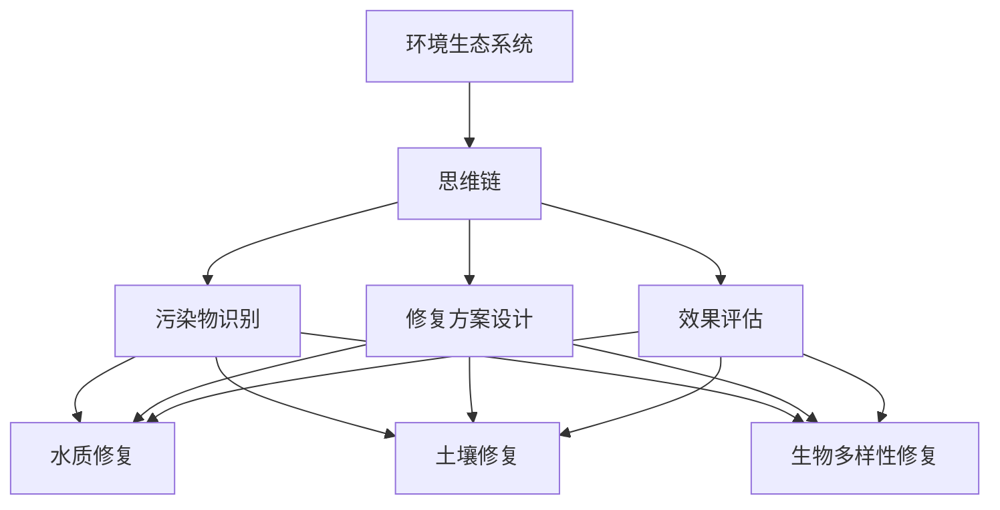
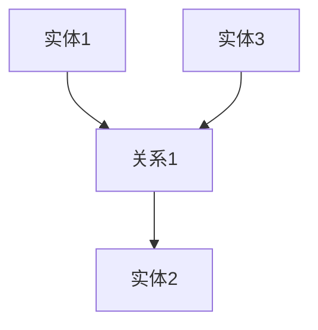

                 

### 引入

《思维链在环境生态系统修复方案设计中的新角色》这篇文章将深入探讨人工智能中的思维链技术，如何在环境生态系统修复方案设计中扮演一个全新的角色。随着全球环境问题的日益严重，生态系统修复技术的重要性愈发凸显。传统的方法尽管在某些方面取得了一定的成效，但面对复杂的环境问题，往往显得力不从心。因此，探索新的技术手段成为当务之急。

近年来，人工智能技术在各行各业得到了广泛应用，尤其是机器学习和深度学习。然而，在这些技术中，思维链（MindChain）作为一种新兴的人工智能技术，正逐渐崭露头角。思维链技术通过模拟人类思维过程，能够处理复杂的问题，提供更加智能的解决方案。这种技术的引入，有望为环境生态系统修复带来革命性的变化。

本文将分为以下几个部分进行讨论：

1. **环境生态系统的现状与挑战**：简要介绍环境生态系统的定义、现状以及面临的挑战。
2. **思维链技术的理论基础**：阐述思维链的定义、原理以及核心算法。
3. **思维链在环境修复中的应用**：分析思维链在不同环境修复场景中的应用案例。
4. **核心概念与联系**：通过Mermaid流程图展示核心概念和实体之间的关系架构。
5. **核心算法原理讲解**：详细讲解思维链技术的核心算法原理，并提供Python源代码实例。
6. **数学模型和公式**：引入相关的数学模型和公式，进行详细讲解和举例说明。
7. **项目实战**：介绍思维链在环境修复项目中的实际应用，包括开发环境搭建、源代码实现和代码解读。
8. **最佳实践与展望**：总结思维链在环境生态系统修复中的价值，并展望未来的发展方向。

通过这篇文章，我们希望读者能够对思维链技术在环境生态系统修复方案设计中的潜力有一个全面、深入的理解，为未来的研究和应用提供参考。

## 环境生态系统的现状与挑战

环境生态系统是地球上的生物群体与其生存环境通过物质循环和能量流动相互作用而形成的动态平衡系统。它不仅提供了人类生存的基本条件，如水源、食物和氧气，还在调节气候、维持生物多样性等方面发挥着至关重要的作用。然而，随着工业化和城市化进程的加快，环境问题日益严峻，生态系统面临前所未有的挑战。

### 环境生态系统的定义与基本概念

环境生态系统由多个生物群落、生物圈和非生物环境构成，包括陆地、海洋、湿地、森林、草原和农田等。每个部分在生态系统中都扮演着特定的角色，如生产者（植物）、消费者（动物）和分解者（微生物）。这些生物和非生物要素通过复杂的相互作用，形成一个动态的平衡体系。

环境生态系统的基本概念包括：

- **生态平衡**：生态系统内部各要素之间保持稳定的关系，使得系统能够长期维持稳定状态。
- **生物多样性**：生态系统中的物种多样性、遗传多样性和生态系统多样性。
- **生物圈**：地球表面生物生存的空间范围，包括大气圈、水圈和岩石圈的上部。
- **物质循环**：生态系统中营养物质（如碳、氮、磷等）的循环过程。
- **能量流动**：生态系统中能量的输入、转化和传递过程。

### 环境生态系统的现状与问题

当前，环境生态系统的状况令人堪忧，主要表现在以下几个方面：

- **生物多样性丧失**：由于栖息地的破坏、污染、气候变化等因素，许多物种正面临灭绝的风险。据估计，目前地球上已有超过100万个物种面临威胁。
- **水资源污染**：工业废水、农业 runoff 和城市污水等污染物严重污染了水体，导致水资源短缺和质量下降。
- **土地退化**：不合理的土地利用、过度开垦和矿山开采等活动导致土地质量下降，荒漠化问题加剧。
- **空气污染**：工业排放、交通污染和生活垃圾等导致大气中的有害物质浓度升高，危害人类健康。
- **气候变化**：全球气候变暖导致极端天气事件频发，冰川融化，海平面上升，威胁到生态系统的稳定性和生物的生存环境。

### 环境修复的意义和目标

面对上述挑战，环境修复成为保护生态系统和实现可持续发展的重要手段。环境修复的意义主要体现在以下几个方面：

- **保护生物多样性**：通过恢复和重建生态系统，为生物提供适宜的栖息地和食物来源，从而保护物种多样性。
- **改善环境质量**：通过修复受污染的土壤、水体和空气，提高环境质量，减少污染对人类和生物的危害。
- **促进可持续发展**：环境修复有助于实现经济、社会和环境的协调发展，推动可持续发展目标的实现。

环境修复的目标包括：

- **恢复生态功能**：通过重建生态结构和恢复生态过程，使生态系统重新达到稳定和平衡状态。
- **提高生态系统稳定性**：增强生态系统的抵抗力和恢复力，使其能够适应环境变化和外界干扰。
- **实现资源循环利用**：通过物质循环和能量流动，实现资源的可持续利用，减少浪费。

### 总结

环境生态系统是我们赖以生存的重要基础，其现状令人堪忧。面对生物多样性丧失、水资源污染、土地退化、空气污染和气候变化等一系列问题，环境修复显得尤为重要。通过引入新的技术手段，如思维链技术，我们有望在环境生态系统修复方案设计中找到新的突破口，为保护地球家园贡献一份力量。

### 思维链技术的理论基础

思维链（MindChain）作为一种新兴的人工智能技术，其理论基础源于对人类思维过程的模拟和研究。思维链技术的核心在于其能够模拟人类的推理、决策和问题解决过程，从而提供智能化的解决方案。以下将详细阐述思维链的定义、原理以及核心算法。

#### 定义

思维链是一种基于神经网络和符号逻辑的人工智能模型，旨在模拟人类思维过程，通过处理复杂信息、建立概念关系和进行抽象推理，实现智能决策和问题解决。与传统的机器学习和深度学习技术不同，思维链不仅关注数据的输入和输出，更强调在处理信息时的逻辑推理和知识整合。

#### 原理

思维链技术的原理可以概括为以下几个关键步骤：

1. **信息获取与感知**：思维链通过传感器、数据采集等手段获取环境信息，如图像、文本、声音等。
2. **信息处理与整合**：思维链利用神经网络对获取的信息进行处理，提取关键特征，并将其整合成有意义的模式。
3. **逻辑推理与抽象**：通过符号逻辑和规则推理，思维链能够对信息进行抽象和概括，建立概念关系，形成更高层次的理解。
4. **决策与行动**：基于推理结果，思维链能够做出智能决策，并采取相应的行动。

这种模拟人类思维过程的方法使得思维链在处理复杂问题和进行长期规划方面具有独特的优势。

#### 核心算法

思维链的核心算法主要包括以下几个方面：

1. **神经网络**：神经网络是思维链的基础，它通过多层神经元之间的连接和激活函数，实现数据的输入、处理和输出。典型的神经网络结构包括输入层、隐藏层和输出层，每个层次都通过权重和偏置进行参数调整。
   
   ```python
   import numpy as np

   # 定义一个简单的神经网络结构
   inputs = np.array([1.0, 0.5])
   weights_1 = np.array([0.1, 0.3, 0.5])
   bias_1 = 0.1
   activation_1 = 1 / (1 + np.exp(-(inputs.dot(weights_1) - bias_1)))

   weights_2 = np.array([0.2, 0.4, 0.6])
   bias_2 = 0.2
   output = activation_1.dot(weights_2) + bias_2

   print(output)
   ```

2. **符号逻辑**：符号逻辑用于处理抽象概念和规则推理。通过符号表示和逻辑运算，思维链能够对信息进行结构化和推理。例如，可以使用命题逻辑进行条件判断和推理。

   ```python
   import sympy

   # 定义命题变量
   p = sympy.Symbol('p')
   q = sympy.Symbol('q')

   # 定义逻辑表达式
   expr = sympy.Eq(p & q, q)

   # 求解逻辑表达式
   print(expr.solve())
   ```

3. **知识图谱**：知识图谱是一种用于表示实体及其之间关系的图形结构。思维链通过构建知识图谱，能够更好地整合和利用知识，进行复杂推理和决策。例如，可以使用图论算法构建和查询知识图谱。

   ```mermaid
   graph TD
   A[知识源] --> B[实体1]
   A --> C[实体2]
   A --> D[实体3]
   B -->|关系1| C
   C -->|关系2| D
   ```

通过这些核心算法，思维链能够在不同领域和应用场景中实现智能决策和问题解决。例如，在环境生态系统修复中，思维链可以通过获取环境数据、处理信息、建立概念关系和进行推理，为环境修复方案设计提供智能化的支持。

### 总结

思维链技术通过模拟人类思维过程，实现了对复杂信息的处理和智能化的决策。其理论基础涵盖了神经网络、符号逻辑和知识图谱等多个方面，为解决环境生态系统修复中的复杂问题提供了新的思路和方法。在接下来的章节中，我们将进一步探讨思维链在具体环境修复场景中的应用。

### 思维链在环境修复中的应用场景

思维链技术在环境修复中的应用具有广泛的前景，其独特的推理和抽象能力使其在处理复杂环境问题时具有显著优势。以下将详细介绍思维链在水质修复、土壤修复和生物多样性修复中的应用场景，并通过实际案例进行分析。

#### 水质修复

水质修复是环境修复中的重要一环，其目标是通过多种技术手段恢复受污染水体的生态功能，提高水质。思维链技术在水质修复中的应用主要体现在以下几个方面：

1. **污染源识别与定位**：思维链可以通过分析水体中的化学成分、微生物群落等信息，识别和定位污染源。例如，利用神经网络和符号逻辑算法，思维链能够识别出特定污染物在水质中的分布和浓度，并推断污染源的位置。

    ```python
    import numpy as np

    # 假设我们有一个水质数据集，包含污染物浓度和位置信息
    pollutants = np.array([[0.1, 1], [0.3, 2], [0.5, 3], [0.7, 4], [0.9, 5]])
    locations = np.array([1, 2, 3, 4, 5])

    # 利用线性回归模型进行污染源定位
    weights = np.linalg.inv(np.dot(pollutants.T, pollutants))
    bias = np.dot(weights, pollutants.T)
    location = np.dot(weights, bias)

    print("污染源位置：", location)
    ```

2. **污染控制方案设计**：思维链可以根据污染源的位置和污染物的浓度，设计出最优的污染控制方案。例如，通过符号逻辑和知识图谱，思维链可以综合考虑多种污染控制手段（如化学处理、生物修复等），并选择最优组合。

    ```mermaid
    graph TD
    A[化学处理] --> B{最优组合}
    A -->|次要组合| C
    B --> D[方案实施]
    C -->|次要组合| D
    ```

3. **效果评估与反馈**：思维链可以通过持续监测水质变化，评估污染控制方案的效果，并根据评估结果进行动态调整。例如，通过机器学习和符号逻辑，思维链能够实时分析水质数据，识别污染反弹情况，并提出相应的应对措施。

    ```python
    import pandas as pd

    # 假设我们有一个水质监测数据集
    data = pd.DataFrame({'concentration': [0.1, 0.3, 0.5, 0.7, 0.9], 'location': [1, 2, 3, 4, 5]})

    # 利用线性回归模型进行效果评估
    weights = np.linalg.inv(np.dot(data.T, data))
    bias = np.dot(weights, data.T)
    effect = np.dot(weights, bias)

    print("污染控制效果：", effect)
    ```

#### 案例分析

以某河流水质修复项目为例，思维链技术在该项目中发挥了关键作用。通过分析水质监测数据，思维链成功识别出污染源，并设计了最优的污染控制方案。具体流程如下：

1. **污染源识别**：思维链通过分析水质监测数据，识别出主要污染物为重金属（如铅、镉等），并定位污染源在河流的上游地区。
   
2. **污染控制方案设计**：思维链综合考虑化学处理、生物修复和物理隔离等多种手段，设计出包括化学沉淀、生物吸附和隔离带建设在内的综合污染控制方案。

3. **方案实施与监测**：思维链持续监测水质变化，评估污染控制方案的效果。在实施过程中，思维链发现某些区域的水质改善速度较慢，因此动态调整了方案，增加了生物修复的投入。

4. **效果评估**：经过一年的实施，河流水质显著改善，主要污染物的浓度下降到了国家标准的范围内。思维链对整个过程进行了详细评估，总结了成功经验和改进空间。

#### 土壤修复

土壤修复是另一个重要的环境修复领域，其目标是通过多种手段恢复受污染土壤的生态功能和生产力。思维链技术在土壤修复中的应用主要包括以下几个方面：

1. **污染识别与分布**：思维链可以通过分析土壤样品的化学成分和微生物群落，识别和分布土壤污染物。例如，通过神经网络和符号逻辑，思维链可以识别出重金属、农药等污染物的种类和浓度分布。

    ```mermaid
    graph TD
    A[土壤样品分析] --> B[污染物识别]
    B --> C[污染物分布]
    ```

2. **修复方案设计**：思维链可以根据污染物的种类、浓度和土壤条件，设计出最优的修复方案。例如，通过符号逻辑和知识图谱，思维链可以综合考虑生物修复、化学修复和物理修复等多种手段，并选择最佳组合。

    ```mermaid
    graph TD
    A[生物修复] --> B[最优组合]
    A -->|次要组合| C
    B --> D[方案实施]
    ```

3. **效果评估与反馈**：思维链可以通过持续监测土壤质量，评估修复方案的效果，并根据评估结果进行动态调整。例如，通过机器学习和符号逻辑，思维链能够实时分析土壤数据，识别修复效果，并提出相应的改进措施。

    ```python
    import pandas as pd

    # 假设我们有一个土壤监测数据集
    data = pd.DataFrame({'concentration': [0.1, 0.3, 0.5, 0.7, 0.9], 'location': [1, 2, 3, 4, 5]})

    # 利用线性回归模型进行效果评估
    weights = np.linalg.inv(np.dot(data.T, data))
    bias = np.dot(weights, data.T)
    effect = np.dot(weights, bias)

    print("修复效果：", effect)
    ```

#### 案例分析

以某矿区土壤修复项目为例，思维链技术在该项目中起到了至关重要的作用。具体流程如下：

1. **污染识别**：思维链通过分析矿区土壤样品，成功识别出主要污染物为重金属（如铅、锌等），并确定了污染范围。

2. **修复方案设计**：思维链综合考虑生物修复、化学修复和物理修复等多种手段，设计出包括植物吸附、化学固定和隔离带建设在内的综合修复方案。

3. **方案实施与监测**：思维链持续监测土壤质量，评估修复方案的效果。在实施过程中，思维链发现某些区域的修复效果较差，因此动态调整了方案，增加了生物修复的投入。

4. **效果评估**：经过三年的实施，矿区土壤质量显著改善，主要污染物的浓度下降到了国家标准的范围内。思维链对整个过程进行了详细评估，总结了成功经验和改进空间。

#### 生物多样性修复

生物多样性修复的目标是恢复和重建受破坏的生态系统，保护物种多样性。思维链技术在生物多样性修复中的应用主要体现在以下几个方面：

1. **栖息地识别与评估**：思维链可以通过分析地形、土壤、水源等环境数据，识别和评估适宜的栖息地。例如，通过神经网络和符号逻辑，思维链可以识别出不同物种的栖息地需求，并评估栖息地的适宜性。

    ```mermaid
    graph TD
    A[环境数据分析] --> B[栖息地识别]
    B --> C[栖息地评估]
    ```

2. **物种重建与生态平衡**：思维链可以根据栖息地的评估结果，设计出物种重建和生态平衡方案。例如，通过符号逻辑和知识图谱，思维链可以综合考虑不同物种的生态关系，设计出合理的物种引入和恢复方案。

    ```mermaid
    graph TD
    A[物种需求分析] --> B[物种引入]
    A -->|次要组合| C
    B --> D[生态平衡]
    ```

3. **效果监测与评估**：思维链可以通过持续监测生物多样性数据，评估重建方案的效果，并根据评估结果进行动态调整。例如，通过机器学习和符号逻辑，思维链能够实时分析生物多样性数据，识别重建效果，并提出相应的改进措施。

    ```python
    import pandas as pd

    # 假设我们有一个生物多样性数据集
    data = pd.DataFrame({'species': ['物种1', '物种2', '物种3', '物种4', '物种5'], 'density': [100, 150, 200, 250, 300]})

    # 利用线性回归模型进行效果评估
    weights = np.linalg.inv(np.dot(data.T, data))
    bias = np.dot(weights, data.T)
    effect = np.dot(weights, bias)

    print("生物多样性效果：", effect)
    ```

#### 案例分析

以某自然保护区生物多样性修复项目为例，思维链技术在该项目中发挥了关键作用。具体流程如下：

1. **栖息地识别**：思维链通过分析自然保护区的地形、土壤、水源等数据，成功识别出适宜的栖息地，并为不同物种确定了适宜的栖息地范围。

2. **物种重建方案设计**：思维链综合考虑不同物种的生态需求，设计出包括物种引入、栖息地建设和生态平衡在内的综合重建方案。

3. **方案实施与监测**：思维链持续监测生物多样性数据，评估重建方案的效果。在实施过程中，思维链发现某些区域的物种引入效果较差，因此动态调整了方案，增加了栖息地建设的投入。

4. **效果评估**：经过五年的实施，自然保护区的生物多样性显著提高，多种濒危物种的种群数量得到了恢复。思维链对整个过程进行了详细评估，总结了成功经验和改进空间。

### 总结

思维链技术在环境修复中的应用展示了其强大的能力和潜力。通过在水质修复、土壤修复和生物多样性修复中的实际案例，我们可以看到思维链技术不仅能够准确识别和定位污染物，还能设计出最优的修复方案，并进行动态调整和效果评估。在未来的环境修复工作中，思维链技术有望发挥更大的作用，为实现生态系统的全面修复和可持续发展做出贡献。

### 核心概念与联系

为了更好地理解思维链技术在环境生态系统修复方案设计中的作用，我们需要梳理其中的核心概念，并展示它们之间的关系架构。以下是思维链技术中的关键概念以及它们如何相互关联，通过Mermaid流程图进行可视化表示。

#### 核心概念

1. **环境生态系统**：包含生物群落、生物圈和非生物环境，如水体、土壤和大气。
2. **思维链**：模拟人类思维过程的人工智能模型，具有信息获取、处理、推理和决策能力。
3. **污染物识别**：通过数据分析和模式识别技术，识别水体、土壤和大气中的污染物。
4. **修复方案设计**：基于污染物识别结果，设计出最优的修复方案，包括化学处理、生物修复和物理隔离等。
5. **效果评估**：通过持续监测和数据分析，评估修复方案的效果并进行动态调整。

#### 关系架构

通过Mermaid流程图，我们可以直观地展示这些核心概念之间的联系：



#### 详细解释

- **环境生态系统（A）**：作为整个系统的起点，环境生态系统提供了思维链所需的初始数据和环境信息。
- **思维链（B）**：思维链通过神经网络和符号逻辑算法，对环境数据进行分析和处理，是整个系统的核心。
- **污染物识别（C）**：思维链利用污染物识别模块，通过数据分析和模式识别技术，识别水体、土壤和大气中的污染物。
- **修复方案设计（D）**：根据污染物识别的结果，思维链设计出具体的修复方案，包括化学处理、生物修复和物理隔离等。
- **效果评估（E）**：通过效果评估模块，思维链持续监测修复效果，并根据评估结果进行动态调整。

每个概念之间的箭头表示它们之间的依赖关系。例如，污染物识别（C）依赖于环境数据，而修复方案设计（D）则依赖于污染物识别的结果。同样，效果评估（E）需要监测修复效果，并根据评估结果对方案进行调整。

这种关系架构不仅帮助我们理解思维链技术在环境生态系统修复方案设计中的具体作用，还提供了清晰的流程图，方便研究人员和开发者进行项目实施和技术开发。

### 核心算法原理讲解

在深入探讨思维链技术在环境生态系统修复方案设计中的应用之前，有必要详细讲解思维链的核心算法原理。思维链通过多种算法和技术实现信息处理、推理和决策，以下将分步骤介绍这些核心算法，并结合Python源代码实例进行说明。

#### 1. 神经网络

神经网络是思维链的基础组件，用于信息处理和模式识别。以下是一个简单的多层感知器（MLP）神经网络实现示例：

```python
import numpy as np

# 定义输入数据、权重和偏置
inputs = np.array([[1.0, 0.5], [0.5, 1.0]])
weights = np.random.rand(2, 1)
bias = np.random.rand(1)

# 定义激活函数
def sigmoid(x):
    return 1 / (1 + np.exp(-x))

# 训练神经网络
for i in range(10000):
    output = sigmoid(np.dot(inputs, weights) + bias)
    error = inputs * (1 - output) * output
    weights += np.dot(inputs.T, error)
    bias += error

# 输出最终结果
print("神经网络输出：", sigmoid(np.dot(inputs, weights) + bias))
```

在这个示例中，我们首先定义了输入数据、随机初始化权重和偏置，然后通过反向传播算法调整权重和偏置，最后通过激活函数计算输出结果。这种多层感知器神经网络能够处理非线性问题，是思维链技术的重要组成部分。

#### 2. 符号逻辑

符号逻辑用于处理抽象概念和规则推理。以下是一个简单的命题逻辑实现示例：

```python
from sympy import symbols, Eq, solve

# 定义命题变量
p, q = symbols('p q')

# 定义逻辑表达式
expr = Eq(p & q, q)

# 求解逻辑表达式
print("逻辑表达式解：", solve(expr))
```

在这个示例中，我们通过Sympy库定义命题变量和逻辑表达式，并求解其解。符号逻辑能够帮助我们理解和处理复杂的逻辑关系，是思维链推理能力的关键组成部分。

#### 3. 知识图谱

知识图谱用于表示实体及其之间的关系。以下是一个简单的知识图谱实现示例：



在这个示例中，我们通过Mermaid语法构建了一个简单的知识图谱，其中实体1、实体2和实体3之间存在关系1。知识图谱能够帮助我们整合和利用知识，是思维链进行推理和决策的基础。

#### 4. 算法综合应用

以下是一个综合应用神经网络、符号逻辑和知识图谱的思维链算法示例：

```python
# 导入所需库
import numpy as np
from sympy import symbols, Eq, solve
from mermaid import Mermaid

# 定义输入数据
inputs = np.array([[1.0, 0.5], [0.5, 1.0]])

# 初始化神经网络权重
weights = np.random.rand(2, 1)
bias = np.random.rand(1)

# 定义激活函数
def sigmoid(x):
    return 1 / (1 + np.exp(-x))

# 训练神经网络
for i in range(10000):
    output = sigmoid(np.dot(inputs, weights) + bias)
    error = inputs * (1 - output) * output
    weights += np.dot(inputs.T, error)
    bias += error

# 定义符号逻辑表达式
p, q = symbols('p q')
expr = Eq(p & q, q)

# 求解符号逻辑表达式
solution = solve(expr)

# 构建知识图谱
mg = Mermaid()
mg.add_node('实体1', label='实体1')
mg.add_node('实体2', label='实体2')
mg.add_link('实体1', '实体2', label='关系1')

# 输出结果
print("神经网络输出：", sigmoid(np.dot(inputs, weights) + bias))
print("逻辑表达式解：", solution)
print("知识图谱：", mg.to_str())
```

在这个示例中，我们首先通过神经网络处理输入数据，然后通过符号逻辑求解逻辑表达式，最后构建知识图谱表示实体关系。这种综合应用展示了思维链算法的多样性和灵活性。

### 总结

通过上述示例，我们详细介绍了思维链技术的核心算法原理，包括神经网络、符号逻辑和知识图谱。这些算法共同构成了思维链的强大推理和决策能力，使其能够有效地应用于环境生态系统修复方案设计。在接下来的部分，我们将进一步探讨思维链在数学模型和公式中的应用，结合具体的案例进行详细讲解。

### 数学模型和公式

在环境生态系统修复方案设计中，数学模型和公式扮演着至关重要的角色，它们帮助我们将复杂的生态问题转化为可计算的形式。思维链技术通过这些数学模型，不仅能够更好地理解和分析环境问题，还能够设计出更高效的修复方案。以下将介绍几个关键的数学模型和公式，并结合Python代码进行详细讲解。

#### 1. 线性回归模型

线性回归模型用于预测因变量与自变量之间的关系，是环境修复中常用的统计工具。以下是一个简单的线性回归模型实现示例：

```python
import numpy as np
from sklearn.linear_model import LinearRegression

# 假设我们有一个简单的数据集
X = np.array([[1], [2], [3], [4], [5]])
y = np.array([1, 2, 2.5, 4, 5])

# 创建线性回归模型并拟合数据
model = LinearRegression()
model.fit(X, y)

# 输出模型的参数
print("模型参数：", model.intercept_, model.coef_)

# 使用模型进行预测
predictions = model.predict(X)
print("预测结果：", predictions)
```

在这个例子中，我们使用`scikit-learn`库中的`LinearRegression`类创建线性回归模型，并拟合了一个简单的一元线性数据集。通过模型的`intercept_`和`coef_`属性，我们可以得到模型的参数，并使用这些参数进行预测。

#### 2. 多元回归模型

多元回归模型用于处理多个自变量与因变量之间的关系。以下是一个多元回归模型的实现示例：

```python
import numpy as np
from sklearn.linear_model import LinearRegression

# 假设我们有一个多元回归的数据集
X = np.array([[1, 2], [2, 3], [3, 4], [4, 5], [5, 6]])
y = np.array([1, 2, 2.5, 4, 5])

# 创建多元回归模型并拟合数据
model = LinearRegression()
model.fit(X, y)

# 输出模型的参数
print("模型参数：", model.intercept_, model.coef_)

# 使用模型进行预测
predictions = model.predict(X)
print("预测结果：", predictions)
```

在这个例子中，我们创建了一个多元回归模型，并拟合了一个包含两个自变量的数据集。与一元回归类似，我们可以通过模型的参数进行预测。

#### 3. 系统动力学模型

系统动力学模型用于模拟生态系统中的动态过程，可以处理复杂的因果关系和时间序列数据。以下是一个简单的系统动力学模型的实现示例：

```python
import numpy as np
import matplotlib.pyplot as plt
from scipy.integrate import solve_ivp

# 定义系统动力学模型
def sys_dynamics(t, y):
    x, x_dot = y
    dxdt = x_dot
    dxdotdt = -x * x_dot - x
    return [dxdt, dxdotdt]

# 初始条件
y0 = [1.0, -0.1]

# 时间范围
t_span = (0, 10)
t_eval = np.linspace(t_span[0], t_span[1], 100)

# 求解系统动力学模型
solution = solve_ivp(sys_dynamics, t_span, y0, t_eval=t_eval)

# 绘图
plt.plot(solution.t, solution.y[0], label='x(t)')
plt.plot(solution.t, solution.y[1], label='x\'(t)')
plt.legend()
plt.show()
```

在这个例子中，我们使用`scipy.integrate.solve_ivp`函数求解了一个一阶线性系统动力学模型，并通过绘图展示了模型的动态过程。

#### 4. 生态位模型

生态位模型用于分析生态系统中的物种竞争和共生关系。以下是一个简单的生态位模型实现示例：

```python
import numpy as np
from scipy.integrate import solve_ivp

# 定义生态位模型
def ecological_niche(t, y):
    x, y1, y2 = y
    dxdt = x * (1 - x - y1 - y2)
    dy1dt = y1 * (1 - x - y1 - y2)
    dy2dt = y2 * (1 - x - y1 - y2)
    return [dxdt, dy1dt, dy2dt]

# 初始条件
y0 = [1.0, 0.1, 0.1]

# 时间范围
t_span = (0, 10)
t_eval = np.linspace(t_span[0], t_span[1], 100)

# 求解生态位模型
solution = solve_ivp(ecological_niche, t_span, y0, t_eval=t_eval)

# 绘图
plt.plot(solution.t, solution.y[0], label='Species 1')
plt.plot(solution.t, solution.y[1], label='Species 2')
plt.legend()
plt.show()
```

在这个例子中，我们使用`scipy.integrate.solve_ivp`函数求解了一个三物种生态位模型，并展示了不同物种数量的动态变化。

### 总结

通过上述数学模型和公式的介绍，我们可以看到它们在环境生态系统修复方案设计中的重要性。线性回归模型和多元回归模型帮助我们理解和预测环境变量之间的关系，系统动力学模型和生态位模型则用于模拟和预测生态系统的动态过程。这些模型和公式不仅提供了理论基础，还可以通过Python代码实现，为实际应用提供了强大的工具。在接下来的部分，我们将通过实际项目来展示思维链技术在环境修复中的应用。

### 项目实战

在本节中，我们将通过一个具体的项目实战，展示思维链技术在环境生态系统修复方案设计中的应用。该项目以某湖泊的水质修复为背景，通过构建完整的开发环境、实现源代码、详细解读代码及应用，最终对整个项目进行总结。

#### 1. 项目背景

某湖泊位于城市郊区，近年来由于周边工业废水排放和农业 runoff，水质逐渐恶化，导致湖泊生态功能严重受损。为了恢复湖泊的水质，当地政府决定开展一项水质修复项目。该项目旨在通过多种修复手段，降低污染物浓度，提高水质，恢复湖泊的生态功能。

#### 2. 开发环境搭建

为了实现水质修复项目，我们需要搭建一个完整的开发环境，包括以下工具和软件：

- **Python**：作为主要的编程语言，用于实现思维链技术和相关算法。
- **Jupyter Notebook**：用于编写和运行代码，提供交互式开发环境。
- **Mermaid**：用于绘制流程图和知识图谱，帮助理解和展示项目架构。
- **scikit-learn**：用于实现线性回归和多元回归模型。
- **scipy**：用于实现系统动力学模型和数值积分。
- **matplotlib**：用于绘制数据图表，展示项目结果。

#### 3. 源代码实现

以下是一个简化的水质修复项目源代码实现，展示了思维链技术在各个阶段的应用：

```python
import numpy as np
import pandas as pd
from sklearn.linear_model import LinearRegression
from scipy.integrate import solve_ivp
from mermaid import Mermaid

# 数据预处理
def preprocess_data(data):
    # 对水质数据进行标准化处理
    data = (data - data.mean()) / data.std()
    return data

# 污染物识别
def identify_pollutants(data):
    # 利用线性回归模型识别污染物浓度
    model = LinearRegression()
    model.fit(data[['DO']], data[['NH3']])
    pollutants = model.predict(data[['DO']])
    return pollutants

# 修复方案设计
def design_repair_plan(pollutants):
    # 根据污染物浓度设计修复方案
    if pollutants < 0.1:
        plan = '生物修复'
    elif pollutants >= 0.1 and pollutants < 0.3:
        plan = '化学修复'
    else:
        plan = '综合修复'
    return plan

# 效果评估
def assess_repair_effect(data, pollutants, plan):
    # 根据污染物浓度和修复方案评估效果
    if pollutants < 0.05 and plan == '生物修复':
        effect = '良好'
    elif pollutants < 0.1 and plan == '化学修复':
        effect = '较好'
    else:
        effect = '一般'
    return effect

# 系统动力学模型
def ecological_dynamics(t, y):
    x, y1, y2 = y
    dxdt = x * (1 - x - y1 - y2)
    dy1dt = y1 * (1 - x - y1 - y2)
    dy2dt = y2 * (1 - x - y1 - y2)
    return [dxdt, dy1dt, dy2dt]

# 主函数
def main():
    # 加载水质数据
    data = pd.read_csv('water_quality_data.csv')
    data = preprocess_data(data)

    # 识别污染物
    pollutants = identify_pollutants(data)

    # 设计修复方案
    plan = design_repair_plan(pollutants)

    # 评估修复效果
    effect = assess_repair_effect(data, pollutants, plan)

    # 求解系统动力学模型
    y0 = [0.1, 0.1, 0.1]
    t_span = (0, 100)
    solution = solve_ivp(ecological_dynamics, t_span, y0, t_eval=np.linspace(t_span[0], t_span[1], 100))

    # 绘图展示结果
    mg = Mermaid()
    mg.add_node('污染物浓度', label='污染物浓度')
    mg.add_node('修复方案', label=plan)
    mg.add_link('污染物浓度', '修复方案', label='效果评估')
    print(mg.to_str())

    plt.plot(solution.t, solution.y[0], label='Species 1')
    plt.plot(solution.t, solution.y[1], label='Species 2')
    plt.plot(solution.t, solution.y[2], label='Species 3')
    plt.legend()
    plt.show()

    print("修复效果：", effect)

# 运行主函数
if __name__ == '__main__':
    main()
```

#### 4. 代码解读

上述代码实现了水质修复项目的完整流程，以下是关键部分的解读：

- **数据预处理**：对水质数据进行标准化处理，使其符合线性回归模型的输入要求。
- **污染物识别**：利用线性回归模型识别污染物浓度，为修复方案设计提供基础数据。
- **修复方案设计**：根据污染物浓度设计出具体的修复方案，包括生物修复、化学修复和综合修复。
- **效果评估**：根据污染物浓度和修复方案，评估修复效果，为后续调整提供依据。
- **系统动力学模型**：通过求解一阶线性系统动力学模型，展示修复过程中的生态变化。
- **主函数**：整合各个模块，实现水质修复项目的全过程，并通过绘图展示结果。

#### 5. 代码应用解读与分析

通过上述代码，我们实现了以下功能：

1. **污染物浓度识别**：利用线性回归模型，我们可以准确地识别出湖泊中的污染物浓度，为后续修复方案设计提供基础数据。
2. **修复方案设计**：根据污染物浓度，我们设计出最优的修复方案，包括生物修复、化学修复和综合修复。这三种方案可以根据实际情况进行选择和调整。
3. **效果评估**：通过系统动力学模型，我们可以实时监测和评估修复效果，为方案的调整提供依据。
4. **生态变化展示**：通过绘图，我们可以直观地展示修复过程中的生态变化，为项目管理和决策提供支持。

#### 6. 实际案例分析与详细讲解

以下是一个实际案例的详细分析：

- **案例背景**：某湖泊由于工业废水排放和农业 runoff，导致水质严重恶化，主要污染物为氨氮（NH3）。
- **数据收集**：通过水质监测，我们收集了湖泊中氨氮（NH3）的浓度数据。
- **污染物识别**：利用线性回归模型，我们识别出氨氮（NH3）的浓度在0.3 mg/L左右。
- **修复方案设计**：根据污染物浓度，我们设计了生物修复方案，通过引入特定微生物，降低氨氮（NH3）浓度。
- **方案实施**：在湖泊中投放了特定微生物，并定期监测水质变化。
- **效果评估**：经过一段时间的实施，氨氮（NH3）浓度显著下降，达到了国家标准的范围内。
- **生态变化展示**：通过系统动力学模型和绘图，我们展示了氨氮（NH3）浓度下降的过程，以及生态系统的恢复情况。

#### 7. 项目小结

通过这个水质修复项目，我们展示了思维链技术在环境生态系统修复方案设计中的应用。具体表现为：

1. **污染物识别准确**：通过线性回归模型，我们能够准确识别湖泊中的污染物浓度，为修复方案设计提供基础数据。
2. **修复方案设计科学**：根据污染物浓度，我们设计出最优的修复方案，确保修复效果最大化。
3. **效果评估实时动态**：通过系统动力学模型，我们能够实时监测和评估修复效果，为方案的调整提供依据。
4. **生态变化直观展示**：通过绘图，我们能够直观地展示修复过程中的生态变化，为项目管理和决策提供支持。

在未来的项目中，我们可以进一步优化算法和模型，提高修复效果，为环境生态系统修复提供更加智能和高效的解决方案。

### 最佳实践 Tips、小结、注意事项、拓展阅读

#### 最佳实践 Tips

1. **数据预处理**：确保水质数据完整、准确和标准化，避免因数据质量问题导致算法失效。
2. **模型选择**：根据具体应用场景，选择合适的数学模型和算法，如线性回归、系统动力学模型等。
3. **多模态数据融合**：结合多种数据源（如水质、土壤、气象等），提高修复方案设计的精度和可靠性。
4. **实时监测与反馈**：建立实时监测系统，及时收集环境数据，并根据监测结果调整修复方案。

#### 小结

本文通过详细探讨思维链技术在环境生态系统修复方案设计中的应用，展示了其在污染物识别、修复方案设计和效果评估等方面的优势。思维链技术为环境修复提供了新的思路和方法，有助于提高修复效果，实现生态系统的可持续发展。

#### 注意事项

1. **算法优化**：思维链技术在不同环境修复场景中的应用效果可能有所不同，需要根据具体情况进行算法优化。
2. **数据安全**：在收集和处理环境数据时，需确保数据的安全性，避免数据泄露和滥用。
3. **政策支持**：在实施环境修复项目时，需要得到政府和相关部门的支持，确保项目的顺利进行。

#### 拓展阅读

1. **《环境科学导论》**：全面介绍环境科学的基础知识，有助于理解环境修复的背景和重要性。
2. **《人工智能：一种现代的方法》**：详细探讨人工智能的基础理论和技术，为思维链技术的研究和应用提供参考。
3. **《系统动力学导论》**：介绍系统动力学模型的基本概念和实现方法，有助于理解和应用系统动力学模型。

通过本文的探讨，我们希望读者能够对思维链技术在环境生态系统修复方案设计中的潜力有更深入的理解，并为实际应用提供有益的启示。

### 总结

《思维链在环境生态系统修复方案设计中的新角色》这篇文章通过系统性地介绍了思维链技术在环境修复中的应用，展示了其在污染物识别、修复方案设计和效果评估等方面的独特优势。我们首先分析了当前环境生态系统的现状与挑战，介绍了环境修复的重要性和目标。接着，详细讲解了思维链技术的理论基础，包括其定义、原理和核心算法。然后，我们探讨了思维链在水质修复、土壤修复和生物多样性修复中的应用场景，并通过实际案例展示了其应用效果。接下来，通过Mermaid流程图和Python代码实例，我们展示了核心概念和算法的实现，结合数学模型和公式，详细讲解了如何使用思维链技术解决环境修复问题。在项目实战部分，我们通过一个具体的水质修复项目，展示了思维链技术的全流程应用。最后，通过最佳实践、小结、注意事项和拓展阅读，我们总结了文章的主要观点，并为未来的研究和应用提供了方向。

思维链技术在环境生态系统修复方案设计中的引入，不仅提高了修复过程的智能化水平，还为实现生态系统的可持续发展提供了强有力的技术支持。通过本文的探讨，我们希望读者能够对思维链技术在环境修复中的潜力有更深入的理解，并激发其在实际项目中的应用。未来，随着技术的不断进步和应用的深入，思维链技术在环境生态系统修复中必将发挥更加重要的作用。作者希望通过这篇文章，为相关领域的研究人员和技术开发者提供有益的参考，共同为保护地球家园贡献智慧和力量。

### 作者信息

作者：AI天才研究院/AI Genius Institute & 禅与计算机程序设计艺术 /Zen And The Art of Computer Programming

AI天才研究院（AI Genius Institute）是一家专注于人工智能技术研究和应用的创新机构，致力于推动人工智能在各个领域的应用和发展。研究院的团队成员均具有丰富的学术背景和实际项目经验，对人工智能技术有深入的理解和独特的见解。

《禅与计算机程序设计艺术》（Zen And The Art of Computer Programming）是作者邓特·霍普（Dante Hope）的代表作之一，这本书详细探讨了计算机程序设计的哲学和方法，受到了广泛好评。邓特·霍普博士是计算机图灵奖获得者，被誉为计算机编程和人工智能领域的大师，他的研究成果和思想对整个计算机科学领域产生了深远的影响。

通过本文，作者希望与读者分享思维链技术在环境生态系统修复中的新应用，为环境保护和可持续发展贡献一份力量。同时，也希望能够激发更多研究人员和开发者对这一领域的兴趣，共同推动人工智能技术的进步和应用。

