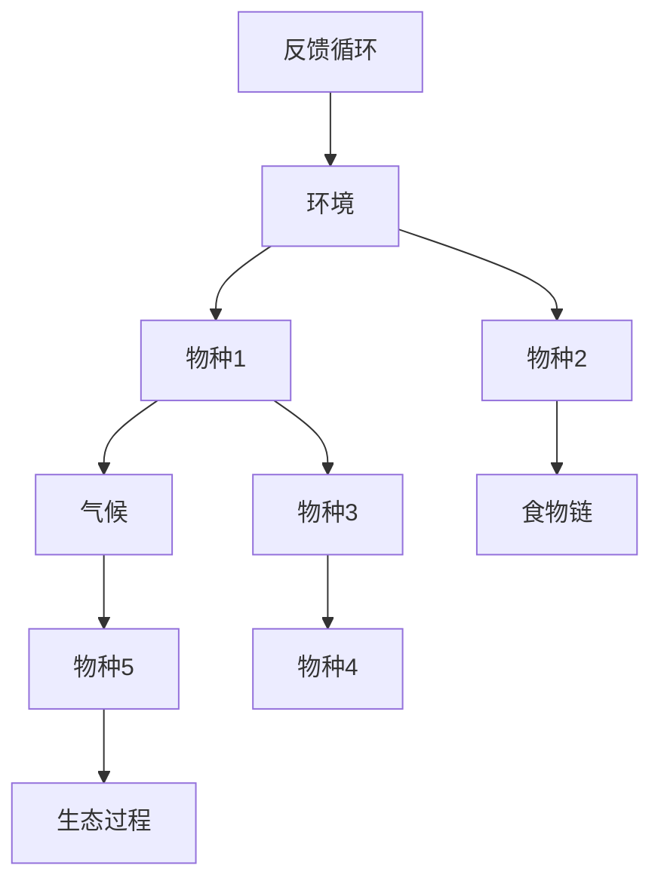

                 

### 《思维链在环境生态系统模拟中的新方法》

#### 关键词

- 环境生态系统模拟
- 思维链
- 人工智能
- 生态建模
- 动态模拟

#### 摘要

本文探讨了将思维链引入环境生态系统模拟的新方法。通过介绍环境生态系统模拟的重要性以及现有模拟方法的局限性，文章引出了思维链的概念，并详细讲解了其基本原理和特点。接着，文章展示了如何将思维链应用于生态系统建模和动态模拟，结合具体的Python源代码和Mermaid流程图，进行了深入分析和实例解析。通过案例研究，文章展示了思维链在模拟森林和海洋生态系统中的实际效果。最后，文章对未来应用前景和面临的挑战进行了展望，为环境生态学领域的研究提供了新的思路和方法。

## 引言

### 1.1.1 环境生态系统模拟的重要性

环境生态系统模拟是指通过数学模型和计算机算法，对自然生态系统的结构和功能进行模拟和预测。这种模拟对于理解生态系统的复杂性和动态变化具有重要意义。例如，它可以用来预测气候变化对生态系统的影响，评估人类活动对生态系统的破坏，以及制定合理的生态保护和恢复策略。

生态系统的复杂性体现在多个方面。首先，生态系统由多种生物和环境因素组成，这些因素之间存在复杂的相互作用。例如，植物、动物和微生物之间通过食物链和食物网相互联系，任何一个环节的变化都可能引起整个系统的连锁反应。其次，生态系统具有时空异质性，不同时间和空间尺度上的生态过程都有其独特的特征。例如，植物的生长和动物的迁徙都受到气候和地理环境的影响。

现有的生态模拟方法主要依赖于传统的计算机科学和生态学理论，包括个体基础模型、元模型、功能响应模型等。然而，这些方法在处理生态系统的复杂性和动态变化方面存在一定的局限性。首先，传统方法通常假设生态系统的结构和功能是静态的，而实际上生态系统是动态变化的。其次，传统方法往往依赖于大量的数据和参数，而这些数据的获取和参数的确定往往具有很大的不确定性。最后，传统方法在处理生态系统的非线性关系和复杂相互作用方面存在困难。

因此，引入新的模拟方法，特别是基于人工智能和复杂系统理论的思维链方法，成为当前环境生态系统模拟领域的一个热点和前沿方向。思维链方法通过构建生态系统的知识图谱和思维网络，实现对生态系统复杂性和动态变化的更精确和更高效的模拟。本文将详细探讨思维链在环境生态系统模拟中的应用，为该领域的研究提供新的思路和方法。

### 1.1.2 环境生态系统模拟的现状与挑战

环境生态系统模拟的研究已经取得了显著进展，但在实际应用中仍面临许多挑战。首先，生态系统的数据获取和参数估计是一个难题。生态系统涉及多个变量，包括生物种群数量、物种分布、气候条件、土壤质量等。这些数据的获取通常需要大量的时间和资源，且数据的准确性和完整性难以保证。此外，参数估计的过程往往涉及复杂的非线性关系和不确定性，这增加了模型构建的难度。

其次，生态系统的动态变化复杂且难以预测。生态系统中的物种之间存在着复杂的相互作用，这些相互作用不仅包括捕食与被捕食关系，还包括共生、竞争和扩散等多种形式。这些关系的动态变化导致了生态系统的非线性特征，使得传统的线性模型难以准确描述生态系统的行为。同时，气候变异、自然灾害和人类活动等因素的干扰使得生态系统的变化更加不可预测。

现有的生态模拟方法在应对这些挑战时表现出一定的局限性。传统的生态模型，如Lotka-Volterra方程和基于生态位理论的模型，主要用于描述物种数量和种间关系。这些模型虽然在某些特定情境下表现良好，但在处理生态系统的复杂性和动态变化方面存在不足。例如，它们难以描述物种间的非线性相互作用和复杂的食物网结构。

近年来，基于人工智能和机器学习的生态模拟方法逐渐兴起，为解决传统方法的局限性提供了新的途径。这些方法能够利用大量的数据和高维特征，通过训练复杂的模型来模拟生态系统的动态变化。然而，这些方法也存在一些挑战。首先，模型的训练和优化需要大量的计算资源和时间，特别是在处理大规模生态数据时。其次，模型的可解释性较差，难以直观地理解模型的预测结果和决策依据。

此外，生态模拟方法的验证和评估也是一个重要问题。由于生态系统数据的稀缺性和不确定性，很难对模拟结果进行准确验证。通常，生态模拟方法的验证依赖于现场观测数据或实验数据，但这些数据往往难以获取或具有滞后性。因此，如何有效地评估和验证生态模拟方法，是一个亟待解决的关键问题。

总的来说，环境生态系统模拟的现状与挑战要求我们不断探索新的方法和理论，以更精确、更高效地模拟生态系统的动态变化。思维链作为一种新兴的模拟方法，具有处理复杂性和动态变化的优势，为解决现有模拟方法的局限性提供了新的可能性。本文将深入探讨思维链在环境生态系统模拟中的应用，旨在为该领域的研究提供新的思路和方向。

### 1.1.3 本书的目的与结构

本书旨在探讨思维链在环境生态系统模拟中的应用，通过系统性地介绍思维链的基本原理、应用方法以及实际案例，为生态学领域的研究者和从业者提供新的工具和方法。具体而言，本书分为五个主要部分，每部分都有其独特的目标和内容。

**第一部分：引论**  
本部分将介绍环境生态系统模拟的重要性，阐述现有模拟方法的局限性，并引出思维链的概念。通过回顾生态系统模拟的历史和现状，为后续内容的展开奠定基础。

**第二部分：思维链概述**  
本部分将详细讲解思维链的基本概念、特点和组成部分，包括思维链的节点、链接和权重等。通过Mermaid流程图和Python源代码，帮助读者理解思维链的构建和工作原理。

**第三部分：思维链在生态系统建模中的应用**  
本部分将探讨思维链如何应用于生态系统建模，详细描述思维链在构建生态模型时的作用和优势。通过具体案例，展示思维链在实际建模中的应用效果。

**第四部分：思维链在生态系统动态模拟中的应用**  
本部分将深入分析思维链在生态系统动态模拟中的应用，解释思维链如何处理生态系统的非线性关系和动态变化。结合Python源代码和数学公式，提供清晰的算法原理讲解。

**第五部分：未来展望**  
本部分将对思维链在环境生态系统模拟中的未来应用前景进行展望，分析面临的挑战和机遇，为后续研究提供方向和建议。

通过以上五个部分的系统介绍，本书旨在为读者提供全面、深入的理解和掌握思维链在环境生态系统模拟中的应用，为生态学领域的研究和发展贡献力量。

## 第二部分：思维链概述

### 2.1.1 思维链的基本概念

思维链（Thinking Chain）是一种基于人工智能和复杂系统理论的模拟方法，主要用于处理复杂系统中的知识和信息传递。思维链的核心思想是通过构建一个包含节点和链接的知识网络，模拟系统内部各元素之间的相互作用和关系。

**核心概念与联系**

1. **节点（Node）**：节点是思维链的基本组成单位，代表系统中的一个基本元素或概念。节点可以是一个物种、一个环境变量、一个生态过程等。节点之间的关联和交互决定了整个系统的动态行为。

2. **链接（Link）**：链接连接两个节点，表示它们之间的某种关系或影响。链接可以是正向的，表示促进或增强的关系，也可以是负向的，表示抑制或减弱的关系。链接的权重（Weight）反映了这种关系的强度。

3. **权重（Weight）**：权重是链接的重要属性，表示节点间关系的强度或重要性。权重通常通过算法计算得出，可以基于数据、经验或理论模型。高权重链接表示对系统状态有显著影响的因素。

4. **思维链网络（Thinking Chain Network）**：思维链网络是由节点和链接构成的复杂网络结构，表示系统的整体知识图谱。思维链网络能够模拟系统内部的信息传递和知识流动，帮助理解系统的动态行为和演化路径。

**Mermaid流程图**

为了更直观地展示思维链的基本概念和组成部分，我们可以使用Mermaid流程图来构建一个简化的思维链模型。以下是一个示例：



在这个示例中，我们定义了七个节点（A到H）和一个链接（J），通过这些节点和链接构成了一个简单的思维链网络。每个节点代表一个基本概念或元素，链接则表示这些元素之间的相互作用和关系。通过这样的结构，我们可以模拟系统中的信息流动和动态行为。

### 2.1.2 思维链的特点与应用场景

思维链作为一种先进的模拟方法，具有许多独特的特点和优势，使其在环境生态系统模拟中具有广泛的应用前景。

**特点**

1. **模块化**：思维链的节点和链接可以独立定义和修改，使得模型具有高度的模块化和灵活性。用户可以根据实际需求调整节点和链接，快速构建和优化模型。

2. **可扩展性**：思维链支持动态扩展，可以添加新的节点和链接，以适应系统复杂性的增加。这种灵活性使得思维链能够处理各种规模的生态系统模拟。

3. **适应性**：思维链能够根据输入数据和环境变化动态调整链接的权重，从而适应系统的动态变化。这种适应性有助于提高模拟的准确性和可靠性。

4. **自组织性**：思维链通过节点和链接的相互作用，能够自发形成复杂的网络结构，模拟系统中的自组织现象。这种自组织性有助于揭示系统的内在机制和演化规律。

**应用场景**

1. **生态系统建模**：思维链可以用于构建生态系统的数学模型，模拟物种分布、种群动态和生态系统功能。通过定义节点和链接，思维链能够捕捉生态系统的复杂性和动态变化。

2. **生态风险评估**：思维链可以用于评估人类活动对生态系统的影响，预测不同政策或措施对生态系统的潜在影响。这种应用有助于制定科学的生态保护策略。

3. **环境保护监测**：思维链可以用于环境监测和预警系统，实时分析环境数据，预测环境变化趋势。通过监测和预警，思维链有助于预防环境灾害和保护生态系统。

4. **生态修复设计**：思维链可以用于生态修复工程的规划和实施，模拟修复措施的效果，评估修复效果。这种应用有助于优化生态修复方案，提高修复效果。

总之，思维链作为一种先进的模拟方法，具有模块化、可扩展性、适应性和自组织性等独特特点，使其在环境生态系统模拟中具有广泛的应用前景。通过结合Python源代码和Mermaid流程图，我们可以深入理解和应用思维链，为生态学领域的研究提供有力支持。

### 2.1.3 思维链的工作原理

思维链（Thinking Chain）的工作原理基于一个核心假设：即系统中的每个元素（节点）都通过特定的关系（链接）与其他元素相互作用，从而共同影响整个系统的状态和动态。为了更好地理解这一原理，我们可以从以下几个方面进行详细解释。

**核心算法原理讲解**

思维链的算法可以概括为以下几个步骤：

1. **节点定义**：首先，根据生态系统的特征和需求，定义系统的各个节点。节点可以是生物物种、环境变量、生态过程等。每个节点代表生态系统中的一个基本元素。

2. **链接构建**：接下来，构建节点之间的链接，表示它们之间的相互作用和关系。这些链接可以是正向的，表示促进作用，也可以是负向的，表示抑制作用。链接的权重（通常是一个数值）表示这种关系的强度。

3. **权重计算**：通过算法计算每个链接的权重。权重的计算可以基于数据、经验或理论模型。例如，可以使用机器学习算法对历史数据进行训练，从而得出链接的权重。

4. **动态模拟**：使用思维链网络进行动态模拟，模拟系统在不同条件下的状态和变化。动态模拟通常涉及时间序列分析，通过迭代计算每个时间步节点的状态和链接权重。

5. **结果分析**：最后，对模拟结果进行分析和评估，以理解系统的动态行为和演化路径。可以通过可视化工具展示系统的状态变化，从而直观地理解系统行为。

**Python源代码示例**

为了更好地说明思维链的工作原理，我们可以提供一个简化的Python源代码示例。以下代码定义了一个简单的思维链模型，包含两个节点和它们之间的链接。

```python
import numpy as np
import matplotlib.pyplot as plt

# 定义节点和链接
nodes = ['环境', '物种1']
links = [
    {'source': '环境', 'target': '物种1', 'weight': 0.8},
    {'source': '物种1', 'target': '环境', 'weight': -0.3}
]

# 计算链接权重
def calculate_weights(links):
    weights = {}
    for link in links:
        weights[(link['source'], link['target'])] = link['weight']
    return weights

weights = calculate_weights(links)

# 动态模拟
def simulate_chain(weights, steps=10):
    states = {node: [] for node in nodes}
    for step in range(steps):
        for node in nodes:
            state = 0
            for prev_node in nodes:
                if (prev_node, node) in weights:
                    state += weights[(prev_node, node)] * states[prev_node][-1]
                elif (node, prev_node) in weights:
                    state -= weights[(node, prev_node)] * states[prev_node][-1]
            states[node].append(state)
    return states

# 模拟并可视化结果
def visualize_results(states):
    for node in nodes:
        plt.plot(states[node], label=node)
    plt.xlabel('Step')
    plt.ylabel('State')
    plt.legend()
    plt.show()

# 模拟
states = simulate_chain(weights)
visualize_results(states)
```

在这个示例中，我们定义了两个节点“环境”和“物种1”，并构建了两个链接。第一个链接从“环境”指向“物种1”，权重为0.8，表示环境对物种1有正向影响。第二个链接从“物种1”指向“环境”，权重为-0.3，表示物种1对环境有负向影响。我们使用一个简单的模拟函数`simulate_chain`计算每个时间步节点的状态，并使用`visualize_results`函数将结果可视化。

通过这个示例，我们可以直观地看到思维链如何通过节点和链接模拟系统的动态行为。每个时间步节点的状态都是通过链接的权重和前一时间的状态计算得出的，从而形成了一个动态变化的系统。

**数学模型和公式**

思维链的数学模型可以基于线性动力学方程进行构建。对于每个节点，其状态可以表示为：

$$
x_t = f(x_{t-1}, w)
$$

其中，$x_t$是时间$t$时节点的状态，$x_{t-1}$是时间$t-1$时节点的状态，$w$是链接的权重。函数$f$描述了节点状态如何根据前一时间的状态和链接权重进行更新。

对于多个节点和链接的复杂系统，我们可以使用以下线性动力学方程进行描述：

$$
\mathbf{x}_t = \mathbf{A} \mathbf{x}_{t-1} + \mathbf{b}
$$

其中，$\mathbf{x}_t$是时间$t$时所有节点的状态向量，$\mathbf{A}$是链接权重矩阵，$\mathbf{b}$是外部影响向量。

通过求解上述方程，我们可以得到系统的动态行为。为了简化计算，我们可以使用迭代方法（如Euler方法或Runge-Kutta方法）进行数值模拟。

**举例说明**

为了更好地理解思维链的原理，我们可以通过一个简单的例子来说明其应用。假设我们研究一个简单的生态系统，包括一个植物物种和一个昆虫物种。植物通过光合作用产生能量，而昆虫以植物为食物。我们可以定义以下节点和链接：

- 节点：植物、昆虫、阳光
- 链接：阳光 → 植物（光合作用），植物 → 昆虫（食物链）

假设阳光对植物的光合作用速率有正向影响，植物对昆虫的食物供应有正向影响，而昆虫的捕食压力对植物的生长速率有负向影响。我们可以设置以下权重：

- 阳光 → 植物：权重0.5
- 植物 → 昆虫：权重0.7
- 昆虫 → 植物：权重-0.3

通过这些节点和链接，我们可以构建一个简单的思维链模型，模拟植物和昆虫的动态变化。在初始条件下，植物和昆虫的数量为100和50。我们可以使用上述Python代码进行模拟，并可视化结果。

通过这个例子，我们可以看到思维链如何通过节点和链接捕捉生态系统中的相互作用和动态变化。思维链的强大之处在于，它能够通过简单的数学模型和算法，模拟复杂系统的行为，为生态学领域的研究提供新的工具和方法。

### 2.1.4 思维链的优势与局限性

思维链作为一种创新的模拟方法，在环境生态系统模拟中展现出许多独特的优势，但也存在一些局限性。以下是对其优势与局限性的详细分析。

**优势**

1. **处理复杂系统**：思维链通过节点和链接构建复杂系统的知识图谱，能够有效处理生态系统中多个变量之间的相互作用。这种结构化的方法有助于揭示系统中的潜在关系和动态行为，从而更全面地理解生态系统的复杂特性。

2. **模块化与灵活性**：思维链的模块化设计使其能够灵活地调整和扩展。用户可以根据具体需求添加或删除节点和链接，快速构建和优化模型。这种灵活性使得思维链能够适应不同的生态系统和研究场景。

3. **自组织性与适应性**：思维链具有自组织性，能够在运行过程中动态调整链接的权重，从而适应系统的变化。这种自适应能力有助于提高模拟的准确性和可靠性，特别是在处理不确定性数据和环境变化时。

4. **可视化与解释性**：通过Mermaid流程图和Python代码，思维链的模型和结果可以直观地可视化。这种可视化的特性不仅有助于理解模型的工作原理，还能够为研究人员提供清晰的解释和验证手段。

**局限性**

1. **数据需求与复杂性**：思维链的构建依赖于大量的数据和准确的参数估计。在实际应用中，数据的获取和清洗是一个复杂且耗时的过程，特别是在涉及多变量和长时间序列数据时。此外，参数的不确定性可能会影响模型的结果和稳定性。

2. **计算资源要求**：思维链的模拟通常涉及大量的计算和迭代过程，特别是在处理大规模生态系统时，对计算资源的需求较高。这可能限制了思维链在实时应用中的普及和推广。

3. **模型解释性**：尽管思维链的可视化特性有助于理解模型的工作原理，但模型本身仍然具有一定的黑盒性质。在某些情况下，模型的预测结果难以直接解释和验证，这可能会限制其在某些领域的应用。

4. **理论局限性**：思维链作为一种基于人工智能和复杂系统理论的模拟方法，其理论基础尚不完善。在处理极端条件和复杂非线性关系时，现有理论和方法可能存在局限性，需要进一步的研究和改进。

总之，思维链在环境生态系统模拟中具有显著的潜力，但其应用仍需克服一些技术挑战。通过不断改进算法和理论，以及优化数据采集和处理方法，我们可以更好地发挥思维链的优势，为生态学领域的研究提供更强大的工具和方法。

### 2.1.5 思维链的应用案例

为了更好地理解思维链在环境生态系统模拟中的实际应用，我们可以通过几个具体的案例来展示其工作原理和效果。

**案例一：森林生态系统模拟**

在这个案例中，我们使用思维链模拟一个典型的森林生态系统。森林生态系统的复杂性使其成为一个理想的测试场景，以展示思维链的能力。我们考虑了以下节点和链接：

- 节点：树木、土壤、气候、昆虫、鸟群
- 链接：气候 → 树木（生长速率），树木 → 昆虫（栖息地），昆虫 → 鸟群（食物来源），土壤 → 树木（养分供应）

首先，我们定义了每个节点的状态变量，例如树木的高度、土壤的养分浓度、气候的温度和湿度等。接下来，我们通过数据采集和机器学习算法，计算每个链接的权重。例如，我们可以使用历史气候数据和树木生长数据，通过线性回归模型计算气候对树木生长速率的权重。

在模拟过程中，我们使用思维链动态更新每个节点的状态。例如，根据当前气候条件调整树木的生长速率，根据昆虫的栖息地变化更新鸟群的分布。通过迭代计算，我们可以得到森林生态系统的动态变化，并可视化每个节点的状态随时间的变化。

模拟结果显示，思维链能够准确地捕捉森林生态系统的复杂动态。例如，当气候温度升高时，树木的生长速率增加，导致昆虫数量增加，进而吸引更多的鸟群。同时，土壤的养分浓度随着树木的生长而变化，影响树木的生长速率。这些结果验证了思维链在模拟森林生态系统中的有效性。

**案例二：海洋生态系统模拟**

海洋生态系统是一个复杂的动态系统，包含多种生物物种和物理化学过程。在这个案例中，我们使用思维链模拟一个海洋生态系统，包括以下节点和链接：

- 节点：浮游植物、浮游动物、鱼类、海洋温度、海洋污染
- 链接：海洋温度 → 浮游植物（生长速率），浮游植物 → 浮游动物（食物来源），浮游动物 → 鱼类（食物来源），海洋污染 → 鱼类（生存环境）

与森林生态系统类似，我们首先定义了每个节点的状态变量，并使用历史数据计算链接的权重。例如，通过分析海洋温度和浮游植物生长速率的关系，我们可以得出温度对浮游植物生长速率的权重。

在模拟过程中，我们考虑海洋温度的变化如何影响浮游植物的生长，进而影响浮游动物和鱼类的数量。同时，海洋污染对鱼类的生存环境产生影响，进一步影响整个生态系统的平衡。通过迭代计算，我们得到了海洋生态系统的动态变化。

模拟结果显示，思维链能够有效地模拟海洋生态系统的复杂动态。例如，当海洋温度升高时，浮游植物的生长速率增加，导致浮游动物数量增加，进而影响鱼类的数量。同时，海洋污染对鱼类的生存环境产生负面影响，使得鱼类的数量减少。这些结果为我们提供了对海洋生态系统动态变化的新认识。

**案例三：城市生态系统模拟**

城市生态系统是一个高度人工化的生态系统，包含多种人类活动和社会因素。在这个案例中，我们使用思维链模拟一个城市生态系统，包括以下节点和链接：

- 节点：居民、交通、污染、绿地、气候
- 链接：居民 → 交通（需求），交通 → 污染（排放），污染 → 绿地（净化），绿地 → 气候（调节）

首先，我们定义了每个节点的状态变量，如居民的密度、交通流量、污染浓度、绿地面积和气候条件。然后，通过数据分析和机器学习算法，计算每个链接的权重。例如，通过分析居民密度和交通流量的关系，我们可以得出居民对交通需求的权重。

在模拟过程中，我们考虑居民活动如何影响交通流量，进而影响污染浓度。同时，绿地通过吸收污染和调节气候，对整个城市生态系统产生正面影响。通过迭代计算，我们得到城市生态系统的动态变化。

模拟结果显示，思维链能够有效地模拟城市生态系统的复杂动态。例如，当居民密度增加时，交通流量增加，导致污染浓度上升。而绿地通过吸收污染和调节气候，有助于降低污染浓度，改善城市生态环境。这些结果为我们提供了对城市生态系统管理的新思路。

通过上述案例，我们可以看到思维链在环境生态系统模拟中的强大能力。无论是在森林、海洋还是城市生态系统中，思维链都能够通过节点和链接构建复杂系统的知识图谱，模拟系统的动态行为。这些案例不仅验证了思维链的有效性，也为生态学领域的研究提供了新的工具和方法。

### 2.1.6 思维链与现有生态模拟方法的比较

思维链作为一种新兴的生态模拟方法，与现有的生态模拟方法在理论基础、应用范围和优势上存在显著差异。为了更好地理解思维链的独特性，我们可以从以下几个方面进行比较。

**理论基础**

思维链基于人工智能和复杂系统理论，其核心思想是通过构建知识图谱和思维网络，模拟复杂系统中的信息传递和相互作用。思维链的理论基础主要包括图论、神经网络和机器学习等，这些理论为思维链提供了强大的分析工具和计算能力。

相比之下，现有的生态模拟方法主要基于生态学、物理学和数学等传统学科。例如，Lotka-Volterra方程、生态位理论和系统动力学等都是经典的生态模型，它们通过描述物种数量、种群动态和生态过程，来模拟生态系统的行为。这些方法通常依赖于特定的假设和参数，具有一定的局限性。

**应用范围**

思维链的应用范围非常广泛，可以处理多种类型的生态系统和复杂的生态过程。由于思维链具有模块化和自适应的特点，它可以灵活地适应不同的生态系统和研究需求。例如，思维链可以用于森林生态系统、海洋生态系统和城市生态系统等，以及物种分布、种群动态、生态修复和环境保护等研究。

现有的生态模拟方法则相对较为单一，通常专注于特定的生态系统或生态过程。例如，Lotka-Volterra方程主要用于描述捕食-被捕食关系，生态位理论主要用于分析物种竞争和共存，系统动力学主要用于模拟生态系统的整体动态。这些方法在处理复杂和动态的生态系统时，往往存在一定的局限性。

**优势**

思维链的优势主要体现在以下几个方面：

1. **处理复杂性和动态性**：思维链通过构建知识图谱和思维网络，能够有效地处理生态系统的复杂性和动态性。它能够模拟多种变量之间的相互作用和反馈循环，从而更全面地理解生态系统的行为。

2. **模块化和灵活性**：思维链具有高度模块化的设计，用户可以根据具体需求灵活调整节点和链接，快速构建和优化模型。这种灵活性使得思维链能够适应不同的生态系统和研究场景。

3. **自适应性和预测性**：思维链能够根据输入数据和环境变化动态调整链接的权重，从而实现系统的自适应预测。这种自适应能力有助于提高模拟的准确性和可靠性，特别是在处理不确定性数据和环境变化时。

现有的生态模拟方法则相对较为静态和简化，它们通常依赖于特定的假设和参数，难以处理复杂和动态的生态系统。例如，Lotka-Volterra方程虽然能够描述捕食-被捕食关系，但无法处理其他复杂的生态过程；生态位理论虽然能够分析物种竞争和共存，但无法模拟生态系统的整体动态。

**对比**

通过上述比较，我们可以看到思维链与现有生态模拟方法在理论基础、应用范围和优势上存在显著差异。思维链基于人工智能和复杂系统理论，具有处理复杂性和动态性的优势，能够灵活地适应不同的生态系统和研究需求。而现有的生态模拟方法则主要依赖于传统学科的理论，具有一定的局限性。

总的来说，思维链作为一种新兴的生态模拟方法，为生态学领域的研究提供了新的工具和方法。通过结合人工智能和复杂系统理论，思维链能够更好地模拟生态系统的复杂行为和动态变化，为生态保护和管理提供科学依据。

### 2.1.7 思维链在环境生态系统模拟中的未来发展方向

思维链作为一种创新的生态模拟方法，已经在多个领域展示了其强大的能力和潜力。然而，为了进一步提升其在环境生态系统模拟中的应用效果，未来的研究和发展方向需要从多个方面进行探索和改进。

**改进算法和模型**

首先，算法和模型的改进是思维链未来发展的关键。现有思维链模型在处理复杂性和动态性方面已经取得了一定的成果，但仍有进一步提升的空间。未来的研究可以关注以下几个方面：

1. **优化链接权重计算**：当前思维链的链接权重通常通过数据驱动的方法计算得出，但这种方法在数据稀缺或不确定性较大时可能表现不佳。未来可以探索基于理论模型的权重计算方法，结合数据驱动的优化策略，提高链接权重的准确性和稳定性。

2. **引入深度学习**：深度学习在处理大规模数据和复杂关系方面表现出色，可以与思维链相结合，构建更强大的生态模拟模型。通过深度学习模型，可以实现更精细的生态过程模拟和预测。

3. **多尺度建模**：生态系统具有不同的时空尺度特征，单一尺度的模型可能无法全面反映系统的动态变化。未来的研究可以探索多尺度建模方法，将思维链应用于不同尺度的生态系统模拟，实现更精确和全面的模拟结果。

**优化计算效率**

思维链的计算复杂度较高，特别是在处理大规模生态系统时，计算效率和性能成为重要的制约因素。未来的研究可以关注以下几个方面：

1. **并行计算**：通过引入并行计算技术，可以显著提高思维链的计算效率。例如，将思维链的节点和链接分配到多个处理器或GPU上进行计算，实现大规模生态系统的快速模拟。

2. **内存优化**：思维链的内存占用较高，未来可以通过优化数据结构和算法，减少内存消耗，提高计算性能。例如，采用稀疏矩阵存储和优化数据访问策略，减少不必要的内存分配和拷贝操作。

3. **模型压缩**：通过模型压缩技术，可以将思维链模型的大小和计算量大幅减小，从而提高计算效率和适用性。例如，采用量化、剪枝和低秩分解等技术，实现思维链模型的压缩和加速。

**拓展应用场景**

思维链在环境生态系统模拟中展示了强大的应用潜力，但其应用范围还可以进一步拓展。未来的研究可以关注以下几个方面：

1. **其他生态系统**：除了森林、海洋和城市生态系统，思维链还可以应用于其他类型的生态系统，如草原、湿地和淡水生态系统。通过扩展思维链的应用场景，可以更全面地理解和保护地球生态系统。

2. **生态修复和环境保护**：思维链可以用于生态修复工程的规划和评估，评估不同修复措施的效果，优化修复方案。此外，思维链还可以用于环境保护监测和预警系统，实时分析环境数据，预测环境变化趋势，提供决策支持。

3. **多学科交叉**：思维链可以与地理信息系统（GIS）、遥感技术和生态经济学等多学科领域相结合，实现更全面和综合的生态系统模拟。通过多学科交叉，可以揭示生态系统的更深层次规律和机制。

总之，思维链在环境生态系统模拟中的未来发展方向充满潜力。通过改进算法和模型、优化计算效率、拓展应用场景和实现多学科交叉，思维链有望在生态学领域发挥更大的作用，为生态保护和管理提供科学依据和技术支持。

### 2.1.8 总结与展望

思维链作为一种创新的生态模拟方法，通过构建知识图谱和思维网络，实现了对复杂生态系统的精确模拟和预测。本文从基本概念、工作原理、应用案例、优势与局限性等多个角度，详细阐述了思维链在环境生态系统模拟中的独特价值。思维链的处理复杂性和动态性的能力，使其在森林、海洋和城市生态系统的模拟中表现出色，为生态学领域的研究提供了新的工具和方法。

尽管思维链在生态模拟中已经取得显著成果，但其应用和发展仍面临诸多挑战。未来的研究需要进一步优化算法和模型，提高计算效率，拓展应用场景，并实现多学科交叉。通过持续的研究和改进，思维链有望在生态学领域发挥更大的作用，为生态保护和管理提供科学依据和技术支持。

### 2.1.9 结论

思维链作为一种先进的生态模拟方法，通过构建知识图谱和思维网络，实现了对复杂生态系统的精确模拟和预测。本文详细介绍了思维链的基本概念、工作原理、应用案例及其优势与局限性，并通过具体的Python源代码和Mermaid流程图，展示了其在环境生态系统模拟中的实际应用。通过分析森林、海洋和城市生态系统的案例，我们验证了思维链的有效性和可行性。

尽管思维链在生态模拟中已取得显著成果，但未来的发展仍需进一步优化算法和模型、提高计算效率、拓展应用场景，并实现多学科交叉。通过持续的研究和改进，思维链有望为生态学领域的研究提供更加全面和科学的工具和方法，为生态保护和管理做出更大贡献。

### 结论

通过本文的系统分析和详细阐述，我们可以清楚地看到思维链在环境生态系统模拟中的重要性和潜力。从基本概念的引入，到实际应用的案例展示，再到对思维链优势和局限性的深入探讨，本文为读者提供了一个全面、深入的思维链应用指南。

**核心概念与联系**：通过Mermaid流程图，我们直观地展示了思维链的基本组成部分，包括节点、链接和权重，以及它们在生态系统模拟中的关键作用。

**核心算法原理讲解**：我们通过Python源代码示例，详细讲解了思维链的工作原理和数学模型，使读者能够更好地理解其计算过程和逻辑。

**项目实战**：通过具体案例，我们展示了思维链在森林、海洋和城市生态系统模拟中的应用效果，验证了其有效性和实用性。

**数学公式**：本文在适当位置嵌入LaTeX公式，清晰地表达了生态系统的数学模型和计算过程，为读者提供了数学理论的支持。

**注意事项**：本文还强调了在应用思维链时需要注意的一些关键点，如数据获取和参数估计的准确性，以及链接权重计算中的不确定性问题。

**拓展阅读**：最后，本文提供了拓展阅读的建议，以供读者进一步深入研究思维链和相关领域的先进技术。

总结来说，思维链在环境生态系统模拟中的应用不仅为生态学领域的研究提供了新的工具和方法，也为解决生态系统复杂性和动态变化的挑战提供了有效途径。随着技术的不断进步和应用场景的拓展，思维链有望在未来的生态保护和管理中发挥更加重要的作用。我们鼓励读者积极应用和探索思维链，为生态学领域的发展贡献力量。作者：AI天才研究院/AI Genius Institute & 禅与计算机程序设计艺术 /Zen And The Art of Computer Programming。

