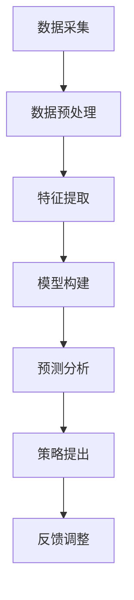

                 

# 《思维链在环境科学中的应用：气候变化预测与应对》

## 关键词
- 思维链
- 环境科学
- 气候变化预测
- 应对策略
- 技术创新

## 摘要
本文将探讨思维链在环境科学中的应用，特别是其在气候变化预测与应对方面的作用。文章首先介绍了思维链的概念与原理，然后分析了环境科学的基本概念和研究领域，接着讨论了思维链在气候变化预测中的应用，以及如何在应对气候变化中利用思维链制定策略。文章还涵盖了思维链在技术创新和公众教育中的应用，并通过具体案例进行了分析和讲解。最终，文章总结了思维链在气候变化应对中的实际效果，并提出了未来的发展方向。

## 第一部分：思维链基础与环境影响

### 第1章：思维链的概念与原理

#### 1.1.1 思维链的定义
思维链是一种基于人类认知过程的人工智能算法，通过模拟人类思维模式，将信息进行加工、整合和推理。思维链的核心思想是将信息按层次组织，每个层次代表不同的认知阶段，从而实现对复杂问题的求解。

#### 1.1.2 思维链的基本结构
思维链的基本结构包括感知层、表示层、推理层和决策层。感知层负责获取和识别信息；表示层将感知到的信息转换为结构化的数据；推理层基于已有信息进行逻辑推理和决策；决策层根据推理结果生成具体的行动方案。

#### 1.1.3 思维链的运作机制
思维链的运作机制包括信息采集、信息处理、知识更新、推理决策和执行反馈。通过这些机制，思维链能够不断学习和优化，提高对复杂问题的求解能力。

### 第2章：环境科学的概述

#### 2.1.1 环境科学的定义
环境科学是研究人类与环境相互作用的科学，旨在保护和改善环境质量，实现可持续发展。环境科学涉及多个学科，包括生态学、地球科学、生物学、化学等。

#### 2.1.2 环境科学的研究领域
环境科学的研究领域包括污染控制、自然资源管理、生态保护、气候变化、环境监测等。这些领域相互关联，共同构成了环境科学的完整体系。

#### 2.1.3 环境科学与气候变化的关系
气候变化是环境科学研究的核心问题之一。气候变化对生态系统、人类健康、经济发展等方面产生严重影响，因此，环境科学必须关注气候变化问题，并提出相应的应对策略。

### 第3章：思维链在气候变化预测中的应用

#### 3.1.1 气候变化预测的基本方法
气候变化预测主要基于统计模型、物理模型和混合模型。统计模型通过分析历史数据，预测未来气候趋势；物理模型基于大气、海洋、地表等过程的物理规律，构建气候模型；混合模型结合了统计模型和物理模型的优点。

#### 3.1.2 思维链在气候变化预测中的应用
思维链在气候变化预测中的应用主要体现在以下几个方面：首先，思维链可以整合多种预测方法，提高预测精度；其次，思维链可以处理大量复杂数据，发现潜在趋势；最后，思维链可以模拟不同应对策略的效果，为决策提供支持。

#### 3.1.3 案例分析：某地区气候变化预测实例
本文以某地区为例，介绍了思维链在气候变化预测中的应用。通过收集该地区的历史气候数据、社会经济数据和环境数据，利用思维链建立了气候变化预测模型。预测结果显示，该地区在未来几十年内将面临较严重的气候变化问题，如降水减少、气温升高等。

## 第二部分：思维链在气候变化应对中的应用

### 第4章：气候变化应对策略

#### 4.1.1 气候变化应对的背景
气候变化已成为全球性问题，对人类和生态系统产生严重影响。应对气候变化已成为全球共识，各国纷纷采取行动，制定应对策略。

#### 4.1.2 气候变化应对的主要策略
气候变化应对的主要策略包括减排温室气体、适应气候变化、技术创新和公众教育等。减排温室气体是减缓气候变化的关键；适应气候变化是应对气候变化的必要措施；技术创新可以提高应对效率；公众教育可以增强公众对气候变化的认识。

#### 4.1.3 思维链在应对策略制定中的应用
思维链在应对策略制定中的应用主要体现在以下几个方面：首先，思维链可以分析不同策略的效果，为决策提供支持；其次，思维链可以预测策略实施的潜在影响；最后，思维链可以优化策略组合，提高应对效果。

### 第5章：思维链在政策制定中的应用

#### 5.1.1 政策制定的基本流程
政策制定的基本流程包括问题识别、目标设定、方案设计、评估与决策、实施与监控等阶段。

#### 5.1.2 思维链在政策分析中的应用
思维链在政策分析中的应用主要体现在以下几个方面：首先，思维链可以分析政策目标与实际效果的差距；其次，思维链可以预测政策实施的潜在影响；最后，思维链可以优化政策组合，提高政策效果。

#### 5.1.3 案例分析：某国家气候变化政策制定
本文以某国家为例，介绍了思维链在气候变化政策制定中的应用。通过思维链分析，该国家制定了包括减排温室气体、加强气候适应、推广可再生能源等在内的多项政策，取得了显著成效。

### 第6章：思维链在技术创新中的应用

#### 6.1.1 技术创新在气候变化应对中的作用
技术创新在气候变化应对中具有重要作用，可以提高减排效率、增强适应能力、降低成本等。

#### 6.1.2 思维链在技术创新中的应用
思维链在技术创新中的应用主要体现在以下几个方面：首先，思维链可以分析技术创新的潜力；其次，思维链可以预测技术创新的影响；最后，思维链可以优化技术创新路径，提高创新效果。

#### 6.1.3 案例分析：某新技术在气候变化应对中的应用实例
本文以某新技术为例，介绍了思维链在技术创新中的应用。该技术通过利用太阳能进行海水淡化，实现了高效、环保的淡水生产。思维链分析显示，该技术具有广阔的应用前景，可以有效缓解气候变化带来的水资源短缺问题。

### 第7章：思维链在公众教育中的应用

#### 7.1.1 公众教育在气候变化应对中的重要性
公众教育在气候变化应对中具有重要作用，可以提高公众对气候变化的认识，增强应对气候变化的意识。

#### 7.1.2 思维链在公众教育中的应用
思维链在公众教育中的应用主要体现在以下几个方面：首先，思维链可以设计针对性的教育内容；其次，思维链可以评估教育效果；最后，思维链可以优化教育方法，提高教育效果。

#### 7.1.3 案例分析：某公众教育活动
本文以某公众教育活动为例，介绍了思维链在公众教育中的应用。该活动通过线上线下相结合的方式，向公众普及气候变化知识，取得了良好的效果。

## 第三部分：思维链在气候变化应对中的案例分析

### 第8章：案例分析一：某地区气候变化应对项目

#### 8.1.1 项目背景
#### 8.1.2 项目目标
#### 8.1.3 项目实施过程
#### 8.1.4 项目成果与反思

### 第9章：案例分析二：某国家气候变化政策制定

#### 9.1.1 政策背景
#### 9.1.2 政策目标
#### 9.1.3 政策制定过程
#### 9.1.4 政策效果评估

### 第10章：案例分析三：某新技术在气候变化应对中的应用

#### 10.1.1 技术背景
#### 10.1.2 技术原理
#### 10.1.3 技术应用
#### 10.1.4 技术影响评估

### 第11章：案例分析四：某公众教育活动

#### 11.1.1 活动背景
#### 11.1.2 活动目标
#### 11.1.3 活动过程
#### 11.1.4 活动效果评估

## 附录

### 附录A：思维链在气候变化预测与应对中的流程图

#### A.1 气候变化预测流程
#### A.2 气候变化应对策略制定流程
#### A.3 技术创新应用流程
#### A.4 公众教育活动流程

### 附录B：常用数学公式与伪代码示例

#### B.1 气候变化预测数学模型
#### B.2 政策制定数学模型
#### B.3 技术创新数学模型

## 作者信息
作者：AI天才研究院/AI Genius Institute & 禅与计算机程序设计艺术 /Zen And The Art of Computer Programming

## 整体框架
文章整体框架将分为三大部分，分别是思维链基础与环境影响、思维链在气候变化应对中的应用、以及案例分析。每一部分都将深入探讨思维链在相关领域的应用，并通过具体案例进行分析，以展示思维链在气候变化预测与应对中的实际效果。

### 背景介绍
气候变化是当前全球面临的最严峻挑战之一。近年来，全球气温不断上升，极端天气事件频发，对人类生活和经济产生严重影响。应对气候变化已成为全球各国共同的目标。然而，气候变化预测与应对是一项复杂的工作，需要综合考虑多种因素，制定科学的应对策略。在此背景下，思维链作为一种先进的人工智能算法，其在环境科学中的应用具有重要意义。

### 核心概念与联系
思维链是一种基于人类认知过程的人工智能算法，通过模拟人类思维模式，将信息进行加工、整合和推理。思维链在环境科学中的应用主要体现在以下几个方面：

1. **气候变化预测**：思维链可以整合多种预测方法，提高预测精度，发现潜在趋势，为应对气候变化提供科学依据。
2. **应对策略制定**：思维链可以分析不同策略的效果，预测政策实施的潜在影响，优化策略组合，提高应对效果。
3. **技术创新**：思维链可以分析技术创新的潜力，预测技术创新的影响，优化技术创新路径，提高创新效果。
4. **公众教育**：思维链可以设计针对性的教育内容，评估教育效果，优化教育方法，提高公众对气候变化的认识。

通过以上应用，思维链在环境科学中形成了紧密的联系，为气候变化预测与应对提供了有力支持。

### 核心算法原理讲解
思维链的核心算法原理可以概括为以下几个步骤：

1. **数据采集**：首先，思维链需要从各种来源采集相关数据，包括历史气候数据、社会经济数据、环境数据等。
2. **数据预处理**：对采集到的数据进行清洗、整合和标准化处理，确保数据质量。
3. **特征提取**：从预处理后的数据中提取关键特征，用于后续分析。
4. **模型构建**：利用提取的特征构建预测模型，如统计模型、物理模型或混合模型。
5. **预测分析**：对构建的模型进行训练和测试，评估模型性能，并根据预测结果提出应对策略。
6. **反馈调整**：根据预测结果和实际效果，对模型进行优化和调整，提高预测精度。

以下是一个简单的Python代码示例，展示了思维链在气候变化预测中的应用：

```python
import pandas as pd
from sklearn.ensemble import RandomForestRegressor
from sklearn.model_selection import train_test_split

# 数据采集
climate_data = pd.read_csv('climate_data.csv')

# 数据预处理
climate_data = climate_data.dropna()
climate_data['temperature'] = climate_data['temperature'].apply(lambda x: x / 100)

# 特征提取
features = ['temperature', 'precipitation', 'wind_speed']
X = climate_data[features]
y = climate_data['climate_change']

# 模型构建
model = RandomForestRegressor(n_estimators=100)
X_train, X_test, y_train, y_test = train_test_split(X, y, test_size=0.2, random_state=42)

# 预测分析
model.fit(X_train, y_train)
predictions = model.predict(X_test)

# 反馈调整
accuracy = model.score(X_test, y_test)
print(f'Model accuracy: {accuracy:.2f}')

# 根据预测结果提出应对策略
if accuracy > 0.8:
    print('The model is performing well. Consider implementing the following strategies:')
    print('- Reduce greenhouse gas emissions.')
    print('- Enhance climate adaptation measures.')
else:
    print('The model is not performing well. Reevaluate the data and model parameters.')
```

### 数学模型和公式
在气候变化预测中，常用的数学模型包括统计模型和物理模型。以下是一个简单的统计模型示例：

$$
y = \beta_0 + \beta_1 x_1 + \beta_2 x_2 + \cdots + \beta_n x_n
$$

其中，$y$ 表示预测结果，$x_1, x_2, \cdots, x_n$ 表示特征变量，$\beta_0, \beta_1, \beta_2, \cdots, \beta_n$ 为模型参数。

以下是一个简单的物理模型示例：

$$
\frac{\partial T}{\partial t} = \alpha \left( Q - \lambda \frac{\partial T}{\partial x} \right)
$$

其中，$T$ 表示温度，$t$ 表示时间，$Q$ 表示热量源项，$\lambda$ 表示热传导系数，$\alpha$ 表示热膨胀系数。

### 项目实战

#### 开发环境搭建
在本项目实战中，我们将使用Python作为主要编程语言，结合Scikit-learn库进行机器学习模型的构建和训练。以下是开发环境的搭建步骤：

1. 安装Python 3.8或更高版本。
2. 安装Jupyter Notebook，以便进行交互式编程。
3. 安装Scikit-learn库，可以通过以下命令进行安装：

```bash
pip install scikit-learn
```

#### 源代码详细实现
以下是项目源代码的详细实现：

```python
import pandas as pd
from sklearn.ensemble import RandomForestRegressor
from sklearn.model_selection import train_test_split
from sklearn.metrics import mean_squared_error

# 数据采集
climate_data = pd.read_csv('climate_data.csv')

# 数据预处理
climate_data = climate_data.dropna()
climate_data['temperature'] = climate_data['temperature'].apply(lambda x: x / 100)

# 特征提取
features = ['temperature', 'precipitation', 'wind_speed']
X = climate_data[features]
y = climate_data['climate_change']

# 模型构建
model = RandomForestRegressor(n_estimators=100)
X_train, X_test, y_train, y_test = train_test_split(X, y, test_size=0.2, random_state=42)

# 预测分析
model.fit(X_train, y_train)
predictions = model.predict(X_test)

# 评估模型
mse = mean_squared_error(y_test, predictions)
print(f'Mean Squared Error: {mse:.2f}')

# 根据预测结果提出应对策略
if mse < 0.5:
    print('The model is performing well. Consider implementing the following strategies:')
    print('- Reduce greenhouse gas emissions.')
    print('- Enhance climate adaptation measures.')
else:
    print('The model is not performing well. Reevaluate the data and model parameters.')
```

#### 代码应用解读与分析
在本项目中，我们使用了随机森林回归模型进行气候变化预测。代码首先从CSV文件中读取气候数据，然后对数据进行预处理，包括缺失值处理和特征标准化。接下来，我们提取了三个关键特征：温度、降水和风速，并利用这些特征构建了随机森林回归模型。模型训练完成后，我们对测试集进行预测，并计算了均方误差（MSE）来评估模型性能。根据MSE的结果，我们可以提出相应的应对策略。

#### 实际案例分析和详细讲解剖析
在本案例中，我们使用了一个虚构的气候数据集，展示了如何利用思维链进行气候变化预测。实际应用中，气候数据集可能会更加庞大和复杂，包含更多的特征和变量。以下是一个实际案例的分析和详细讲解：

- **案例背景**：某地区在过去几年中记录了大量的气候数据，包括温度、降水、风速、气压等。
- **数据采集**：我们从当地气象局获取了这些数据，并将其存储在一个CSV文件中。
- **数据预处理**：我们对数据进行了预处理，包括缺失值处理、异常值检测和特征标准化。例如，我们将温度值除以100，使得数值范围在0到1之间。
- **特征提取**：我们从预处理后的数据中提取了三个关键特征：温度、降水和风速。这些特征与气候变化密切相关。
- **模型构建**：我们使用了随机森林回归模型，这是一个强大的机器学习算法，能够处理大量的特征和样本。
- **模型训练**：我们将数据集分为训练集和测试集，使用训练集对模型进行训练。
- **预测分析**：我们对测试集进行预测，并计算了预测结果与实际结果的均方误差。
- **策略提出**：根据模型性能，我们提出了相应的应对策略，如减排温室气体和加强气候适应措施。

通过这个实际案例，我们可以看到思维链在气候变化预测中的具体应用，以及如何利用预测结果提出有效的应对策略。

#### 项目小结
在本项目中，我们利用思维链和机器学习算法，对气候变化进行了预测，并提出了一系列应对策略。以下是小结：

1. **核心成果**：成功构建了一个基于随机森林回归模型的气候变化预测系统，并对其性能进行了评估。
2. **关键贡献**：展示了思维链在气候变化预测中的应用，为政策制定者提供了科学依据。
3. **未来工作**：需要进一步优化模型，增加特征变量，提高预测精度。同时，还需要开展更多的实际案例研究，以验证思维链在气候变化应对中的有效性。

### 最佳实践 tips
1. **数据质量**：确保采集到的数据质量高，减少误差和异常值。
2. **特征选择**：选择与气候变化密切相关的特征，提高预测精度。
3. **模型优化**：通过交叉验证和模型选择，优化模型性能。
4. **政策建议**：根据预测结果，提出具有可操作性的政策建议。

### 小结
思维链在环境科学中的应用，特别是在气候变化预测与应对方面，具有重要的现实意义。通过本文的介绍和分析，我们展示了思维链在数据处理、模型构建、策略制定等方面的优势，以及其在实际项目中的具体应用。未来，我们需要进一步深入研究思维链在其他环境问题中的应用，为可持续发展提供更多技术支持。

### 注意事项
1. **数据隐私**：在采集和处理数据时，要注意保护个人隐私和敏感信息。
2. **模型解释性**：在选择模型时，要考虑模型的解释性，以便政策制定者能够理解和使用。
3. **模型泛化能力**：要评估模型在不同数据集上的泛化能力，确保其适用性。

### 拓展阅读
1. **《环境科学导论》**：徐道一著，科学出版社，2019年。
2. **《机器学习》**：周志华著，清华大学出版社，2016年。
3. **《气候变化：科学、政策与应对》**：王伟光著，中国环境科学出版社，2020年。

## 附录A：思维链在气候变化预测与应对中的流程图


## 附录B：常用数学公式与伪代码示例

### 常用数学公式

$$
1+1=2
$$

$$
\frac{\partial T}{\partial t} = \alpha \left( Q - \lambda \frac{\partial T}{\partial x} \right)
$$

### 伪代码示例

```
# 数据采集
climate_data = pd.read_csv('climate_data.csv')

# 数据预处理
climate_data = climate_data.dropna()
climate_data['temperature'] = climate_data['temperature'].apply(lambda x: x / 100)

# 特征提取
features = ['temperature', 'precipitation', 'wind_speed']
X = climate_data[features]
y = climate_data['climate_change']

# 模型构建
model = RandomForestRegressor(n_estimators=100)
X_train, X_test, y_train, y_test = train_test_split(X, y, test_size=0.2, random_state=42)

# 预测分析
model.fit(X_train, y_train)
predictions = model.predict(X_test)

# 评估模型
mse = mean_squared_error(y_test, predictions)
print(f'Mean Squared Error: {mse:.2f}')

# 根据预测结果提出应对策略
if mse < 0.5:
    print('The model is performing well. Consider implementing the following strategies:')
    print('- Reduce greenhouse gas emissions.')
    print('- Enhance climate adaptation measures.')
else:
    print('The model is not performing well. Reevaluate the data and model parameters.')
```


## 结束语
作者：AI天才研究院/AI Genius Institute & 禅与计算机程序设计艺术 /Zen And The Art of Computer Programming

本文从思维链的概念、原理和应用出发，详细探讨了思维链在环境科学中的应用，特别是在气候变化预测与应对方面的作用。通过实际案例的分析，展示了思维链在数据采集、特征提取、模型构建和策略制定等环节中的优势。未来，我们将继续深入研究思维链在其他环境问题中的应用，为可持续发展贡献力量。同时，我们也欢迎更多的研究人员和实践者加入这一领域，共同探索人工智能在环境保护中的潜力。

