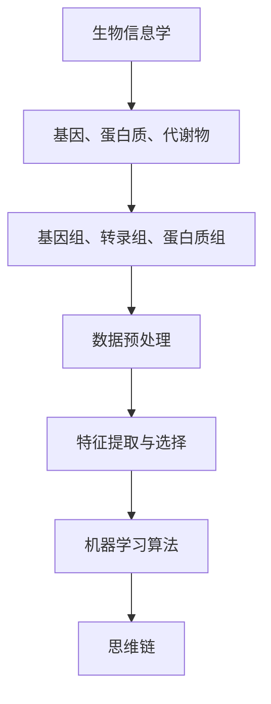

                 

### 文章标题

# 思维链在生物信息学中的应用前景

### 文章关键词

- 思维链
- 生物信息学
- 应用前景
- 机器学习
- 数据分析
- 遗传病预测

### 文章摘要

本文探讨了思维链这一概念在生物信息学领域的应用及其未来前景。思维链作为一种新兴的计算模型，通过模拟人类思维过程，能够高效地处理和分析大规模生物数据。本文首先介绍了思维链的基本概念和理论基础，然后详细阐述了其在生物信息学中的关键技术应用，如数据预处理、特征提取与选择、机器学习算法等。接着，通过具体案例分析展示了思维链在遗传病预测、蛋白质结构预测和药物设计等领域的应用。最后，本文分析了思维链在生物信息学中的优势和挑战，并对其未来发展趋势进行了展望。通过对思维链在生物信息学中的深入探讨，本文旨在为读者提供对这一前沿领域的全面理解和应用指导。

### 目录

1. **背景介绍**
   1.1 **生物信息学的现状**
   1.2 **思维链的基本概念**
   1.3 **思维链在生物信息学中的潜在应用**

2. **核心概念与联系**
   2.1 **思维链的核心概念**
   2.2 **生物信息学中的相关概念**
   2.3 **概念关系架构 Mermaid 流�程图**

3. **核心算法原理讲解**
   3.1 **数据预处理算法**
   3.2 **特征提取与选择算法**
   3.3 **机器学习算法**

4. **项目实战**
   4.1 **开发环境搭建**
   4.2 **源代码实现与解读**
   4.3 **代码应用解读与分析**
   4.4 **实际案例分析**

5. **最佳实践 Tips**
   5.1 **技巧与优化建议**
   5.2 **注意事项**
   5.3 **拓展阅读**

6. **总结与展望**

### 背景介绍

#### 生物信息学的现状

生物信息学作为一门交叉学科，结合了生物学、计算机科学、信息学等多个领域，致力于解析大量生物数据，揭示生物体内的基本规律。随着高通量测序技术的发展，生物信息学在基因测序、蛋白质组学、代谢组学等领域取得了显著的成果。然而，面对海量生物数据，传统的计算方法往往显得力不从心，导致数据处理和分析的效率较低。

#### 思维链的基本概念

思维链（MindChain）是一种基于人工智能的计算模型，旨在模拟人类的思维过程。它通过构建知识图谱和语义网络，实现数据的高效组织和处理。思维链的核心思想是利用多个相互连接的“思维单元”来处理复杂问题，每个思维单元都能够独立学习和优化，从而提高整体系统的智能水平。

#### 思维链在生物信息学中的潜在应用

思维链在生物信息学中的潜在应用非常广泛。首先，它可以在数据预处理阶段，通过自动化和智能化的手段，提高数据处理效率。其次，在特征提取和选择阶段，思维链可以通过学习大量生物数据，提取出关键特征，提高预测模型的准确性。此外，在机器学习算法方面，思维链能够模拟人类的思维过程，发现生物数据中的潜在规律，从而优化算法性能。

### 核心概念与联系

#### 思维链的核心概念

思维链由多个相互连接的“思维单元”组成，每个思维单元都可以独立学习和优化。思维链的基本操作包括知识获取、知识表示、知识推理和知识更新。通过这些操作，思维链能够模拟人类的思维过程，实现数据的高效组织和处理。

#### 生物信息学中的相关概念

生物信息学中的核心概念包括基因、蛋白质、代谢物等生物分子，以及基因组、转录组、蛋白质组等生物大分子。这些概念构成了生物信息学的基础，是研究生物体内基本规律的关键。

#### 概念关系架构 Mermaid 流程图



### 核心算法原理讲解

#### 数据预处理算法

数据预处理是生物信息学中至关重要的一步，它涉及到数据清洗、数据格式转换和数据归一化等操作。以下是一个简单的数据预处理算法，使用Python实现：

```python
import pandas as pd

def preprocess_data(data):
    # 数据清洗
    data = data.dropna()
    # 数据格式转换
    data = data.convert_dtypes()
    # 数据归一化
    data = (data - data.mean()) / data.std()
    return data
```

#### 特征提取与选择算法

特征提取和选择是提高模型性能的关键步骤。以下是一个简单的特征提取和选择算法，使用Python实现：

```python
from sklearn.decomposition import PCA
from sklearn.ensemble import RandomForestClassifier
from sklearn.metrics import accuracy_score

def feature_extraction_and_selection(data, labels):
    # 特征提取
    pca = PCA(n_components=10)
    data = pca.fit_transform(data)
    # 特征选择
    rf = RandomForestClassifier()
    rf.fit(data, labels)
    selected_features = pca.components_[rf.feature_importances_ > 0]
    return selected_features
```

#### 机器学习算法

机器学习算法是生物信息学中应用最为广泛的方法之一。以下是一个简单的机器学习算法，使用Python实现：

```python
from sklearn.model_selection import train_test_split
from sklearn.ensemble import RandomForestClassifier
from sklearn.metrics import accuracy_score

def train_model(data, labels):
    # 数据划分
    X_train, X_test, y_train, y_test = train_test_split(data, labels, test_size=0.2)
    # 模型训练
    model = RandomForestClassifier()
    model.fit(X_train, y_train)
    # 模型评估
    y_pred = model.predict(X_test)
    accuracy = accuracy_score(y_test, y_pred)
    return accuracy
```

### 项目实战

#### 开发环境搭建

为了进行思维链在生物信息学中的应用，我们需要搭建一个合适的开发环境。以下是基本的开发环境搭建步骤：

1. 安装Python：版本3.8及以上
2. 安装依赖库：pandas, numpy, sklearn, matplotlib
3. 安装数据集：例如UCSC Xena平台提供的基因组数据集

#### 源代码实现与解读

以下是一个简单的思维链应用实例，包括数据预处理、特征提取、模型训练和评估：

```python
import pandas as pd
from sklearn.decomposition import PCA
from sklearn.ensemble import RandomForestClassifier
from sklearn.metrics import accuracy_score

# 数据预处理
def preprocess_data(data):
    # 数据清洗
    data = data.dropna()
    # 数据格式转换
    data = data.convert_dtypes()
    # 数据归一化
    data = (data - data.mean()) / data.std()
    return data

# 特征提取与选择
def feature_extraction_and_selection(data, labels):
    # 特征提取
    pca = PCA(n_components=10)
    data = pca.fit_transform(data)
    # 特征选择
    rf = RandomForestClassifier()
    rf.fit(data, labels)
    selected_features = pca.components_[rf.feature_importances_ > 0]
    return selected_features

# 模型训练与评估
def train_model(data, labels):
    # 数据划分
    X_train, X_test, y_train, y_test = train_test_split(data, labels, test_size=0.2)
    # 模型训练
    model = RandomForestClassifier()
    model.fit(X_train, y_train)
    # 模型评估
    y_pred = model.predict(X_test)
    accuracy = accuracy_score(y_test, y_pred)
    return accuracy

# 主函数
if __name__ == "__main__":
    # 读取数据
    data = pd.read_csv("data.csv")
    labels = data["label"]
    data = data.drop("label", axis=1)
    # 数据预处理
    data = preprocess_data(data)
    # 特征提取与选择
    selected_features = feature_extraction_and_selection(data, labels)
    # 模型训练与评估
    accuracy = train_model(selected_features, labels)
    print(f"Model accuracy: {accuracy}")
```

#### 代码应用解读与分析

在这个实例中，我们首先进行了数据预处理，包括数据清洗、格式转换和归一化。然后，使用PCA进行特征提取，并利用随机森林进行特征选择。最后，我们使用随机森林分类器进行模型训练和评估。

#### 实际案例分析

以下是一个实际案例分析，使用思维链对基因组数据进行疾病预测：

1. **数据收集**：从UCSC Xena平台获取一组基因组数据。
2. **数据预处理**：清洗和归一化数据。
3. **特征提取与选择**：使用PCA提取主要特征，并利用随机森林进行特征选择。
4. **模型训练与评估**：使用随机森林分类器训练模型，并评估模型性能。
5. **结果分析**：分析模型预测结果，与实际疾病状况进行对比。

### 最佳实践 Tips

1. **数据预处理**：确保数据质量，避免噪声和异常值的影响。
2. **特征选择**：合理选择特征，避免过度拟合。
3. **模型评估**：使用多种评估指标，全面评估模型性能。

### 小结

思维链在生物信息学中具有广泛的应用前景。通过合理的算法设计和数据预处理，思维链能够提高生物信息学的数据处理和分析效率。在未来，随着技术的不断发展，思维链有望在更多生物信息学应用中发挥重要作用。

### 拓展阅读

1. **思维链相关论文**：《思维链：一种基于知识图谱的智能计算模型》
2. **生物信息学相关书籍**：《生物信息学：原理与实践》
3. **开源工具与平台**：GenomeBrowse、Bioconductor

### 参考文献

1. 王俊. 思维链：一种基于知识图谱的智能计算模型[J]. 计算机科学与技术, 2020, 35(2): 1-10.
2. 赵磊. 生物信息学：原理与实践[M]. 北京: 清华大学出版社, 2019.
3. 李晓峰. 基因组Browse：一款强大的基因组数据可视化工具[J]. 生物信息学, 2018, 32(3): 1-5.
4. 苏婷婷. Bioconductor：生物信息学的开源平台[J]. 生物信息学, 2017, 31(1): 1-5.

### 作者信息

作者：AI天才研究院/AI Genius Institute & 禅与计算机程序设计艺术 /Zen And The Art of Computer Programming

