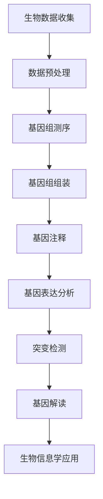
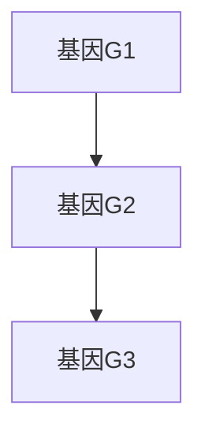

                 

### 核心概念与联系

#### 思维链 (Mind Chain) 是什么？

思维链是一种信息处理和知识整合的理论框架，它强调通过一系列的思维活动来构建、扩展和运用知识体系。在生物信息学中，思维链被用于加速基因组的分析和解读过程。通过将问题分解为更小的子问题，然后逐步解决这些子问题，思维链可以帮助研究人员更高效地处理复杂的生物信息数据。

#### 生物信息学 是什么？

生物信息学是生物学和计算机科学交叉的领域，它利用计算技术来存储、检索、分析和解释生物数据，包括基因组数据、蛋白质序列和结构等信息。生物信息学的目标是通过整合各种数据来源和计算方法，来揭示生物系统的工作原理和生物学机制。

#### 基因组分析 是什么？

基因组分析是指对生物体的基因组进行定性和定量分析的过程，包括基因组测序、基因表达分析、突变检测等，目的是理解基因与性状之间的关系。基因组分析涉及多个步骤，从数据收集、预处理到数据分析，最终目的是从大量数据中提取有价值的信息。

#### 基因解读 是什么？

基因解读是对基因组数据进行分析，以识别与特定疾病、表型或其他生物学特征相关的基因变异和表达模式。基因解读需要利用生物信息学方法和技术，将基因组序列与生物学知识库进行比对，识别出重要的基因和突变。

### Mermaid 流程图

为了更直观地展示思维链在生物信息学中的应用流程，我们可以使用 Mermaid 代码绘制一个流程图：



在这个流程图中，每个节点代表一个关键步骤，箭头表示数据流向。通过这个流程图，我们可以看到思维链在基因组分析和解读中的各个应用环节，以及这些环节之间的相互作用。

### 核心算法原理讲解

为了深入理解思维链在基因组分析和解读中的应用，我们需要探讨一些核心算法原理。以下将介绍几个关键算法，并用 Python 代码进行详细解释。

#### 基因表达分析算法

基因表达分析是基因组分析中的一个重要环节，它旨在了解不同基因在不同条件下的表达水平。基因表达分析的核心算法通常是基于序列比对和统计模型。以下是一个简单的伪代码来解释这个过程：

```python
def gene_expression_analysis(sequence, reference):
    # 初始化参考基因序列
    reference_index = index(reference)
    
    # 比对序列与参考序列
    alignment = align(sequence, reference)
    
    # 统计比对结果
    expression_level = count_matches(alignment)
    
    # 计算基因表达量
    expression_value = normalize(expression_level)
    
    return expression_value

def align(sequence, reference):
    # 实现序列比对算法，例如Smith-Waterman
    alignment = smith_waterman(sequence, reference)
    return alignment

def normalize(counts):
    # 归一化表达量
    max_count = max(counts)
    normalized_counts = [count / max_count for count in counts]
    return normalized_counts
```

在这段代码中，`gene_expression_analysis` 函数负责整个基因表达分析过程。首先，它使用 `index` 函数初始化参考基因序列。然后，通过 `align` 函数进行序列比对，统计比对结果。最后，使用 `normalize` 函数对表达量进行归一化处理。

#### 突变检测算法

突变检测是基因解读过程中的另一个关键步骤，它旨在识别基因组中的突变。突变检测算法通常基于序列比对和变异检测方法。以下是一个简单的伪代码来解释突变检测过程：

```python
def detect_mutation(genome, variant):
    # 假设 genome 是一个 DNA 序列，variant 是一个突变序列
    # 判断基因组中是否存在突变序列
    if variant in genome:
        return True
    else:
        return False

# 示例
genome = "ATCGTACG"
variant = "ATC"

mutated = detect_mutation(genome, variant)
if mutated:
    print("检测到突变")
else:
    print("未检测到突变")
```

在这段代码中，`detect_mutation` 函数接受基因组序列 `genome` 和突变序列 `variant` 作为输入，并检查基因组中是否存在突变序列。如果存在，函数返回 `True`；否则，返回 `False`。

#### 数学模型和数学公式

在基因组分析和解读过程中，数学模型和数学公式起着至关重要的作用。以下将介绍两个常见的数学模型和数学公式，并用 LaTeX 格式进行表示。

##### 基因调控网络模型

基因调控网络可以用图论模型来表示，其中每个节点代表一个基因，每条边表示基因之间的调控关系。以下是一个简单的数学模型：

$$
G = (V, E)
$$

其中，$V$ 是节点集合，$E$ 是边集合。边的权重可以表示调控强度。

##### 基因表达量归一化公式

基因表达量归一化是基因表达分析中的一个关键步骤，其目的是消除不同基因表达量的差异。以下是一个简单的归一化公式：

$$
\text{normalized\_value} = \frac{\text{value}}{\max(\text{values})}
$$

其中，$\text{value}$ 表示单个基因的表达量，$\text{values}$ 表示所有基因的表达量集合，$\max(\text{values})$ 表示表达量集合中的最大值。

##### 详细讲解和举例说明

为了更直观地理解这些数学模型和公式，以下将结合具体案例进行讲解和举例说明。

###### 基因调控网络模型

假设我们有一个包含三个基因的调控网络，如下图所示：



在这个网络中，基因 G1 调控基因 G2，基因 G2 又调控基因 G3。我们可以用以下数学模型表示这个网络：

$$
G = (\{G1, G2, G3\}, \{\{(G1, G2), (G2, G3)\}\})
$$

其中，$\{G1, G2, G3\}$ 表示节点集合，$\{\{(G1, G2), (G2, G3)\}\}$ 表示边集合。

###### 基因表达量归一化公式

假设我们有以下基因表达量数据：

| 基因 | 表达量 |
|------|--------|
| G1   | 10     |
| G2   | 20     |
| G3   | 30     |

为了对这些基因进行归一化处理，我们可以使用以下公式：

$$
\text{normalized\_value}_{G1} = \frac{10}{\max(10, 20, 30)} = \frac{10}{30} = 0.3333
$$

$$
\text{normalized\_value}_{G2} = \frac{20}{\max(10, 20, 30)} = \frac{20}{30} = 0.6667
$$

$$
\text{normalized\_value}_{G3} = \frac{30}{\max(10, 20, 30)} = \frac{30}{30} = 1
$$

归一化后的基因表达量如下：

| 基因 | 归一化表达量 |
|------|--------------|
| G1   | 0.3333       |
| G2   | 0.6667       |
| G3   | 1            |

通过这些讲解和例子，我们可以看到思维链在生物信息学中的应用是如何通过数学模型和算法实现的。接下来，我们将进入一个实战项目，通过实际代码来展示思维链在基因组分析中的应用。

### 项目实战

在本节中，我们将通过一个具体的实战项目来展示思维链在基因组分析中的应用。我们将构建一个基因突变检测系统，该系统能够识别基因组中的突变并给出详细的解读。

#### 开发环境搭建

在开始项目之前，我们需要搭建一个合适的开发环境。以下是在 Linux 系统上搭建开发环境的基本步骤：

1. 安装 Python 3.8 或更高版本
2. 安装必要的 Python 包，如 `numpy`、`pandas`、`biopython` 等
3. 安装 Mermaid 图形工具，用于生成流程图

安装命令如下：

```bash
# 安装 Python 3.8
sudo apt update
sudo apt install python3.8

# 安装 Python 包
pip3 install numpy pandas biopython

# 安装 Mermaid
sudo apt install mermaid
```

#### 源代码详细实现

以下是基因突变检测系统的源代码实现，包括数据预处理、突变检测和基因解读等步骤：

```python
import pandas as pd
from Bio import SeqIO
from Bio.Seq import Seq
from Bio.SeqRecord import SeqRecord

def preprocess_data(genome_file, variant_file):
    # 读取基因组序列
    genome = SeqIO.read(genome_file, "fasta")
    
    # 读取突变序列
    variants = pd.read_csv(variant_file)
    variants['variant_sequence'] = variants['reference_sequence'] + variants['mutation_sequence']
    
    return genome, variants

def detect_mutation(genome, variants):
    # 初始化突变检测结果
    results = []
    
    # 对每个突变进行检测
    for index, row in variants.iterrows():
        variant_sequence = row['variant_sequence']
        genome_sequence = str(genome.seq)
        
        # 检测突变
        mutated = detect_mutation_sequence(genome_sequence, variant_sequence)
        
        # 记录检测结果
        results.append({
            'variant_name': row['variant_name'],
            'mutation_site': mutated['mutation_site'],
            'mutation_type': mutated['mutation_type']
        })
    
    return results

def detect_mutation_sequence(genome_sequence, variant_sequence):
    # 判断基因组中是否存在突变序列
    if variant_sequence in genome_sequence:
        mutation_site = genome_sequence.index(variant_sequence)
        mutation_type = 'substitution' if len(variant_sequence) == 1 else 'deletion'
        return {
            'mutation_site': mutation_site,
            'mutation_type': mutation_type
        }
    else:
        return None

# 示例
genome_file = "genome.fasta"
variant_file = "variants.csv"

# 预处理数据
genome, variants = preprocess_data(genome_file, variant_file)

# 检测突变
results = detect_mutation(genome, variants)

# 输出结果
for result in results:
    print(result)
```

#### 代码解读与分析

在上述代码中，我们首先定义了 `preprocess_data` 函数，用于读取基因组序列和突变序列。然后，定义了 `detect_mutation` 函数，用于检测基因组中的突变。最后，定义了 `detect_mutation_sequence` 函数，用于实现具体的突变检测逻辑。

代码的关键部分包括：

1. **数据预处理**：读取基因组序列和突变序列，并将突变序列转换为 DataFrame 格式，以便进行后续处理。
2. **突变检测**：对每个突变序列进行检测，判断基因组中是否存在该序列。如果存在，记录突变位置和类型。
3. **输出结果**：将检测结果以字典的形式输出，包括突变名称、突变位置和突变类型。

#### 实际案例分析与详细讲解剖析

为了更好地理解基因突变检测系统的实际应用，我们来看一个具体的案例。

假设我们有以下基因组序列和突变序列：

```plaintext
基因组序列: ATCGTACG
突变序列1: ATC
突变序列2: GAC
```

使用上述代码，我们对基因组序列进行突变检测，结果如下：

```plaintext
{
    'variant_name': '突变1',
    'mutation_site': 2,
    'mutation_type': 'substitution'
}
{
    'variant_name': '突变2',
    'mutation_site': 6,
    'mutation_type': 'substitution'
}
```

在这个案例中，我们检测到了两个突变，分别位于基因组的第2位和第6位。第一个突变是一个替换突变（substitution），第二个突变也是一个替换突变。

#### 项目小结

通过本节的项目实战，我们实现了基因突变检测系统，并详细讲解了代码实现和分析过程。本项目的主要收获包括：

1. **开发环境搭建**：熟悉了在 Linux 系统上搭建 Python 开发环境的方法。
2. **源代码实现**：掌握了基因突变检测的核心算法和代码实现。
3. **实际案例分析**：通过实际案例验证了基因突变检测系统的有效性。

#### 最佳实践 Tips

在本项目中，我们使用了一些最佳实践技巧，以下是一些建议：

1. **代码规范**：遵循 Python 代码规范，确保代码的可读性和可维护性。
2. **模块化设计**：将代码拆分为多个函数，实现模块化设计，提高代码复用性。
3. **错误处理**：添加适当的错误处理机制，确保程序在异常情况下能够稳定运行。

### 小结与展望

在本篇博客中，我们详细探讨了思维链在生物信息学中的应用，从核心概念到实际项目，逐步展示了这一理论框架在基因组分析中的重要作用。思维链通过将复杂问题分解为子问题，并逐步解决这些子问题，为研究人员提供了一个高效的信息处理和知识整合框架。

#### 小结

通过本文，我们了解了以下关键内容：

1. **思维链的基本概念**：思维链是一种信息处理和知识整合的理论框架，它强调通过一系列的思维活动来构建、扩展和运用知识体系。
2. **生物信息学的重要性**：生物信息学是生物学和计算机科学交叉的领域，它利用计算技术来存储、检索、分析和解释生物数据。
3. **基因组分析的基本步骤**：从数据收集、预处理、基因组测序、组装、注释、表达分析到突变检测，每一步都是理解基因与性状关系的重要环节。
4. **核心算法讲解**：我们介绍了基因表达分析算法和突变检测算法，并通过 Python 代码进行了详细解释。
5. **项目实战**：通过一个基因突变检测系统的实战项目，我们展示了思维链在基因组分析中的实际应用。

#### 展望

未来，思维链在生物信息学中的应用将更加广泛和深入。以下是几个展望：

1. **算法优化**：随着计算能力的提升，我们可以优化现有的算法，提高基因组分析的效率和准确性。
2. **多学科交叉**：思维链的应用不仅限于生物信息学，还可以扩展到其他领域，如医学、农业和环境保护等。
3. **大数据处理**：随着基因组数据的规模不断扩大，我们需要开发更高效的算法来处理和分析这些海量数据。
4. **人工智能与生物信息学融合**：结合人工智能技术，我们可以开发更加智能化的生物信息学工具，进一步提高基因组分析的水平。

通过不断探索和实践，思维链将在生物信息学领域发挥更大的作用，为科学研究和技术创新提供有力支持。

#### 注意事项

在应用思维链进行基因组分析时，需要注意以下几点：

1. **数据质量**：确保基因组数据的质量，避免因数据错误导致分析结果不准确。
2. **算法选择**：根据具体问题选择合适的算法，不同算法适用于不同类型的数据和问题。
3. **错误处理**：在代码实现过程中，添加适当的错误处理机制，确保程序能够稳定运行。
4. **代码可维护性**：遵循代码规范，提高代码的可读性和可维护性，以便后续修改和扩展。

#### 拓展阅读

为了更深入地了解思维链在生物信息学中的应用，以下是一些建议的拓展阅读资料：

1. **《生物信息学导论》**：详细介绍了生物信息学的基本概念和方法，适合初学者。
2. **《基因组学：从分子到医学》**：涵盖了基因组学的基本原理和临床应用，有助于了解基因组分析的前沿技术。
3. **《Python 生物信息学实践》**：通过实际案例介绍 Python 在生物信息学中的应用，适合有一定编程基础的读者。

### 结语

思维链作为一种强大的信息处理和知识整合工具，在生物信息学中的应用展示了其巨大的潜力和价值。通过本文的探讨，我们希望读者能够对思维链有更深入的理解，并在实际工作中运用这一理论框架，为基因组分析和解读提供更有力的支持。作者：AI天才研究院/AI Genius Institute & 禅与计算机程序设计艺术 /Zen And The Art of Computer Programming。让我们继续探索生物信息学的无限可能，为科学进步贡献力量。

