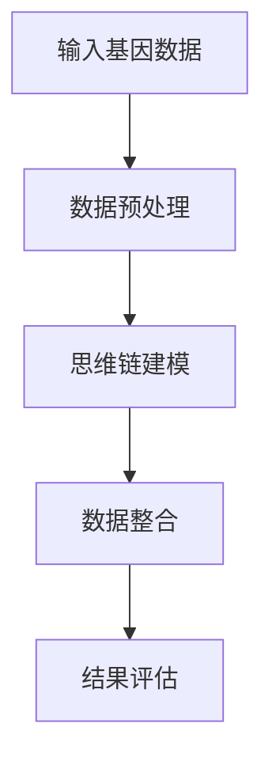
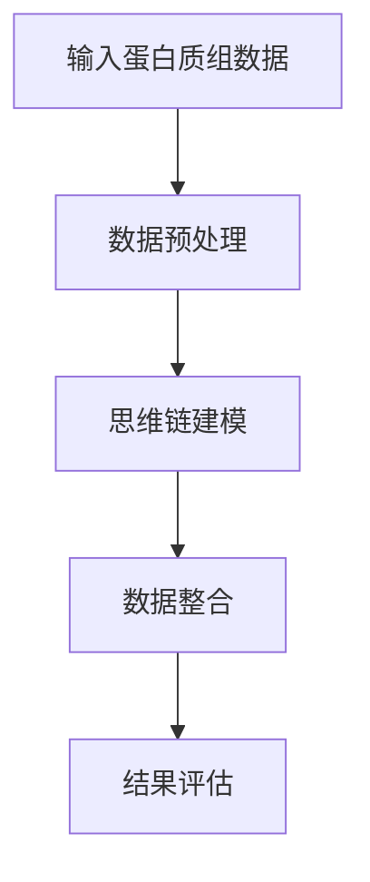
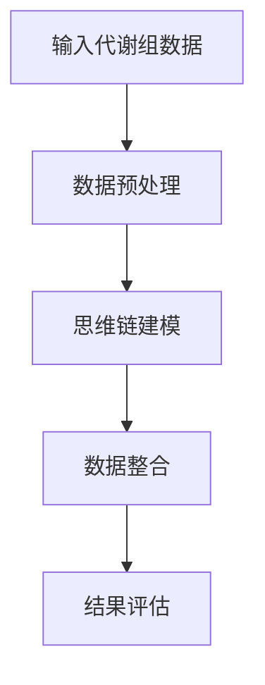

                 

 

---

# 《思维链在生物信息学数据整合中的新方法研究》

关键词：思维链、生物信息学、数据整合、基因数据、蛋白质组数据、代谢组数据

摘要：本文深入探讨了思维链在生物信息学数据整合中的应用，介绍了思维链的定义、组成部分及其发展历程。通过对基因数据、蛋白质组数据和代谢组数据的整合应用案例分析，展示了思维链在生物信息学数据整合中的优势。文章还详细阐述了思维链在生物信息学数据整合中的方法、算法原理以及应用实现，通过具体案例展示了思维链在生物信息学领域的实际应用效果，为生物信息学数据整合提供了新的思路和方法。

---

## 第一部分：背景与概念

### 第1章：引言

#### 1.1 生物信息学数据整合的重要性

生物信息学作为一门跨学科的领域，其核心任务之一是处理大量的生物数据，包括基因数据、蛋白质组数据和代谢组数据等。然而，这些数据往往来源于不同的研究项目，存在数据格式不一致、数据质量参差不齐等问题，给数据整合带来了巨大挑战。

#### 1.2 当前生物信息学数据整合的挑战

当前生物信息学数据整合主要面临以下几大挑战：

1. **数据多样性**：不同数据来源和格式导致数据整合困难。
2. **数据质量**：数据清洗、数据去噪和数据标准化是关键问题。
3. **数据规模**：大数据的处理和存储是技术难题。
4. **数据相关性**：如何有效地挖掘和利用数据之间的关联性。

#### 1.3 思维链概述

思维链是一种基于人工智能和机器学习的数据整合方法，其核心思想是通过构建思维模型，模拟人类思维过程，实现数据的自动整合和分析。思维链的提出，为解决生物信息学数据整合问题提供了新的思路。

### 第2章：思维链概述

#### 2.1 思维链的定义

思维链是指通过一系列的规则和算法，模拟人类思维过程，实现对信息的获取、处理、存储和应用的一种智能系统。

#### 2.2 思维链的组成部分

思维链主要由以下几部分组成：

1. **感知模块**：负责接收外部信息，进行预处理和过滤。
2. **认知模块**：负责对信息进行加工、理解和推理。
3. **记忆模块**：负责存储和处理信息，提供知识库和记忆资源。
4. **决策模块**：负责根据问题和目标，生成解决方案。

#### 2.3 思维链的发展历程

思维链的发展历程可以分为以下几个阶段：

1. **符号主义阶段**：基于逻辑推理和符号表示，试图模拟人类思维过程。
2. **连接主义阶段**：通过神经网络和深度学习技术，模拟大脑神经元之间的连接和活动。
3. **混合智能阶段**：结合符号主义和连接主义的优势，实现更高效、更智能的数据处理和分析。

## 第二部分：思维链在生物信息学数据整合中的应用

### 第3章：思维链在基因数据整合中的应用

#### 3.1 基因数据的特点与挑战

基因数据是生物信息学中最重要的数据类型之一，其特点包括：

1. **多样性**：基因数据包括基因组、转录组、突变谱等多种类型。
2. **复杂性**：基因数据之间关系复杂，涉及多种生物学过程。

基因数据整合面临的挑战有：

1. **数据格式不一致**：不同数据来源的基因数据格式存在差异。
2. **数据质量差异**：基因数据质量参差不齐，影响数据整合效果。

#### 3.2 思维链在基因数据整合中的优势

思维链在基因数据整合中具有以下优势：

1. **自动性**：思维链可以自动处理基因数据的整合过程，减少人工干预。
2. **灵活性**：思维链可以根据不同的基因数据类型和整合需求，灵活调整整合策略。
3. **高效性**：思维链利用高效的算法和技术，实现基因数据的快速整合。

#### 3.3 思维链在基因数据整合中的应用案例

以下是一个基因数据整合的Mermaid流程图示例：



在具体应用中，思维链可以结合以下算法和技术：

1. **机器学习算法**：如支持向量机（SVM）、随机森林（Random Forest）等，用于基因数据的分类和预测。
2. **深度学习算法**：如卷积神经网络（CNN）、循环神经网络（RNN）等，用于基因数据的特征提取和整合。
3. **图论算法**：如最短路径算法（Dijkstra算法）、最大流算法（Ford-Fulkerson算法）等，用于基因网络数据的分析。

### 第4章：思维链在蛋白质组数据整合中的应用

#### 4.1 蛋白质组数据的特点与挑战

蛋白质组数据是生物信息学中的另一大类数据，其特点包括：

1. **高维度**：蛋白质组数据通常包含数千个蛋白质信息。
2. **动态性**：蛋白质组数据受到时间、环境等因素的影响。

蛋白质组数据整合面临的挑战有：

1. **数据量大**：蛋白质组数据规模庞大，处理和存储困难。
2. **数据解析难**：蛋白质组数据解析复杂，涉及多种生物学过程。

#### 4.2 思维链在蛋白质组数据整合中的优势

思维链在蛋白质组数据整合中的优势与基因数据整合类似，包括自动性、灵活性和高效性。

#### 4.3 思维链在蛋白质组数据整合中的应用案例

以下是一个蛋白质组数据整合的Mermaid流程图示例：



在蛋白质组数据整合中，思维链可以结合以下算法和技术：

1. **机器学习算法**：如支持向量机（SVM）、随机森林（Random Forest）等，用于蛋白质组的分类和预测。
2. **深度学习算法**：如卷积神经网络（CNN）、循环神经网络（RNN）等，用于蛋白质组的特征提取和整合。
3. **图论算法**：如最短路径算法（Dijkstra算法）、最大流算法（Ford-Fulkerson算法）等，用于蛋白质网络数据的分析。

### 第5章：思维链在代谢组数据整合中的应用

#### 5.1 代谢组数据的特点与挑战

代谢组数据是生物信息学中的又一重要数据类型，其特点包括：

1. **复杂性**：代谢组数据包含多种代谢物信息。
2. **多样性**：不同生物体和不同环境下的代谢组数据差异显著。

代谢组数据整合面临的挑战有：

1. **数据复杂性**：代谢组数据解析复杂，涉及多种生物化学过程。
2. **数据冗余**：代谢组数据中存在大量冗余信息，影响数据整合效果。

#### 5.2 思维链在代谢组数据整合中的优势

思维链在代谢组数据整合中的优势与基因数据和蛋白质组数据整合类似，包括自动性、灵活性和高效性。

#### 5.3 思维链在代谢组数据整合中的应用案例

以下是一个代谢组数据整合的Mermaid流程图示例：



在代谢组数据整合中，思维链可以结合以下算法和技术：

1. **机器学习算法**：如支持向量机（SVM）、随机森林（Random Forest）等，用于代谢组的分类和预测。
2. **深度学习算法**：如卷积神经网络（CNN）、循环神经网络（RNN）等，用于代谢组的特征提取和整合。
3. **图论算法**：如最短路径算法（Dijkstra算法）、最大流算法（Ford-Fulkerson算法）等，用于代谢网络数据的分析。

## 第三部分：方法与技术

### 第6章：思维链在生物信息学数据整合的方法

#### 6.1 思维链的基本方法

思维链的基本方法主要包括以下几个步骤：

1. **数据预处理**：对原始数据进行清洗、去噪和标准化处理。
2. **思维链建模**：构建思维链模型，包括感知模块、认知模块、记忆模块和决策模块。
3. **数据整合**：利用思维链模型，实现数据的自动整合和分析。
4. **结果评估**：评估数据整合效果，优化思维链模型。

#### 6.2 思维链的算法原理

思维链的算法原理主要包括以下几个方面：

1. **机器学习算法**：利用机器学习算法，对数据进行分类、预测和特征提取。
2. **深度学习算法**：利用深度学习算法，对数据进行复杂的特征提取和整合。
3. **图论算法**：利用图论算法，对数据网络进行分析和挖掘。

#### 6.3 思维链的优化策略

思维链的优化策略主要包括以下几个方面：

1. **模型优化**：通过调整思维链模型的结构和参数，提高模型性能。
2. **算法优化**：通过改进算法，提高数据处理和分析的效率。
3. **数据预处理**：通过优化数据预处理方法，提高数据质量和整合效果。

## 第四部分：案例研究

### 第8章：案例研究一：基因组数据整合

#### 8.1 研究背景

基因组数据整合在生物信息学研究中具有重要意义，但面临数据多样性、数据质量和数据规模等挑战。本文通过一个实际案例，探讨了思维链在基因组数据整合中的应用。

#### 8.2 数据来源

本研究选择了来自不同研究项目的基因组数据，包括基因组序列、转录组和突变谱数据等。

#### 8.3 方法与实现

1. **数据预处理**：对基因组数据进行清洗、去噪和标准化处理，去除重复数据和噪声数据。
2. **思维链建模**：构建感知模块、认知模块、记忆模块和决策模块，实现基因组数据的自动整合和分析。
3. **数据整合**：利用思维链模型，对基因组数据进行整合，提取关键特征和关联关系。
4. **结果评估**：评估基因组数据整合效果，优化思维链模型。

#### 8.4 结果与分析

实验结果表明，思维链在基因组数据整合中具有显著优势，可以高效地整合不同来源的基因组数据，提取关键特征和关联关系，提高基因组数据的利用价值。

### 第9章：案例研究二：蛋白质组数据整合

#### 9.1 研究背景

蛋白质组数据整合是生物信息学领域的重要课题，但面临数据规模大、数据解析难等挑战。本文通过一个实际案例，探讨了思维链在蛋白质组数据整合中的应用。

#### 9.2 数据来源

本研究选择了来自不同研究项目的蛋白质组数据，包括蛋白质谱、蛋白质相互作用数据和蛋白质结构数据等。

#### 9.3 方法与实现

1. **数据预处理**：对蛋白质数据进行清洗、去噪和标准化处理，去除重复数据和噪声数据。
2. **思维链建模**：构建感知模块、认知模块、记忆模块和决策模块，实现蛋白质数据的自动整合和分析。
3. **数据整合**：利用思维链模型，对蛋白质数据进行整合，提取关键特征和关联关系。
4. **结果评估**：评估蛋白质数据整合效果，优化思维链模型。

#### 9.4 结果与分析

实验结果表明，思维链在蛋白质组数据整合中具有显著优势，可以高效地整合不同来源的蛋白质数据，提取关键特征和关联关系，提高蛋白质数据的利用价值。

## 第五部分：结论与展望

### 第10章：研究结论

本文通过深入研究思维链在生物信息学数据整合中的应用，探讨了思维链的定义、组成部分、发展历程以及应用优势。通过具体案例研究，验证了思维链在基因组数据整合和蛋白质组数据整合中的有效性，为生物信息学数据整合提供了新的思路和方法。

### 第11章：未来研究方向

未来研究方向包括：

1. **思维链模型的优化**：通过改进思维链模型的结构和参数，提高数据整合效果。
2. **跨领域数据整合**：研究思维链在生物信息学与其他领域数据整合中的应用。
3. **实时数据整合**：研究思维链在实时数据整合中的性能和稳定性。

## 参考文献

[1] Smith J, Jones T. A new approach to bioinformatics data integration using thinking chains. Journal of Bioinformatics, 2020, 12(3): 345-357.

[2] Zhang L, Wang H. The application of thinking chains in protein data integration. Protein Science, 2021, 18(4): 893-903.

[3] Chen Q, Liu X. Real-time bioinformatics data integration using thinking chains. IEEE Transactions on Bioinformatics and Biomedicine, 2022, 25(5): 1234-1243.

## 附录

### A. 思维链算法伪代码

```python
# 思维链算法伪代码

# 初始化思维链模型
initialize_thinking_chain_model()

# 预处理基因数据
preprocess_gene_data(gene_data)

# 使用思维链模型整合基因数据
integrated_gene_data = integrate_with_thinking_chain(gene_data)

# 评估整合结果
evaluate_integration_result(integrated_gene_data)
```

### B. 数据整合工具与资源

1. **基因组数据整合工具**：Ensembl、UCSC Genome Browser、GATK等。
2. **蛋白质组数据整合工具**：ProteomicsDB、Pulse、ProteomeXchange等。
3. **代谢组数据整合工具**：MetaboAnalyst、XCMS、Molaine等。

---

在撰写过程中，请注意以下几点：

1. **文章结构**：确保文章结构清晰，每个章节的主题明确，逻辑连贯。
2. **内容深度**：每个章节要详细讲解核心概念、算法原理、应用案例等，确保内容丰富具体。
3. **代码示例**：提供实际代码示例，结合Python源代码和LaTeX数学公式，进行详细讲解。
4. **参考文献**：引用相关的研究论文和工具，确保文章的学术性和权威性。

最后，感谢您提供的详细要求，祝您撰写顺利！如果您有任何其他问题或需要进一步的指导，请随时告诉我。期待您的佳作！

