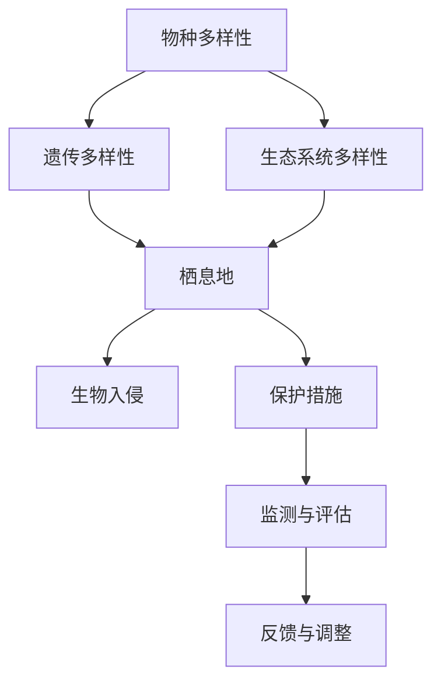
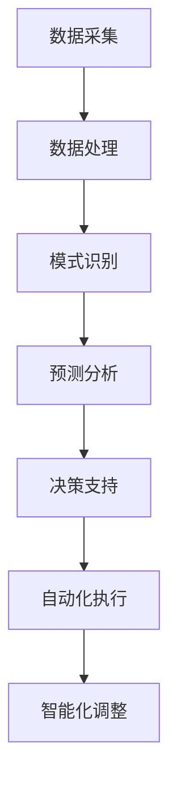
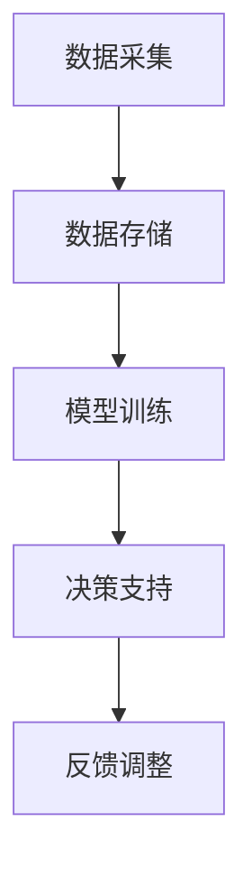

                 

# 《思维链在生物多样性保护决策中的应用：AI辅助生态系统管理》

## 关键词

生物多样性保护、决策支持、人工智能、生态系统管理、思维链

## 摘要

随着全球生态环境问题的日益严峻，生物多样性保护已成为全球关注的焦点。本文探讨了一种新兴的决策支持工具——思维链在生物多样性保护中的应用。思维链作为一种先进的AI算法，能够通过分析生态系统中的复杂关系，提供有效的保护策略。本文首先介绍了生物多样性保护现状及挑战，随后详细阐述了AI在生态系统管理中的重要性。在此基础上，本文重点介绍了思维链的基本原理及其在生态系统管理中的应用，包括核心算法、数学模型以及实际应用案例。通过本文的探讨，希望为生态系统管理者和决策者提供新的视角和方法，以促进生物多样性的保护和可持续发展。

## 第一部分：基础理论与概念

### 第1章：引论

#### 1.1 生物多样性保护现状与挑战

生物多样性是指地球上所有生物种类及其生态系统的多样性，包括物种多样性、遗传多样性和生态系统多样性。然而，近年来，全球生物多样性面临前所未有的危机。根据联合国《生物多样性公约》的报告，全球物种灭绝速度比自然灭绝速度提高了1000倍以上，近四分之一的物种面临灭绝威胁。导致生物多样性减少的原因主要包括栖息地破坏、气候变化、污染、过度捕捞和非法野生动植物贸易等。

在保护生物多样性的过程中，决策者面临诸多挑战。首先，生物多样性数据收集和监测是一项复杂且耗时的任务。传统的监测方法依赖于人工采集数据，效率低下且容易受到人为因素的影响。其次，生物多样性保护需要综合考虑生态、经济、社会等多个因素，这使得决策过程更加复杂。此外，生物多样性保护的成效难以量化，使得评估和保护效果成为一大难题。

#### 1.2 AI与生态系统管理

人工智能（AI）作为一项新兴技术，在生态系统管理中具有巨大的潜力。AI能够通过数据分析和模式识别，提供更为精准的监测和预测结果，从而为决策者提供有力的支持。例如，AI可以用于监测栖息地变化、预测物种灭绝风险、评估保护措施的效果等。

首先，AI在数据收集和处理方面具有显著优势。通过遥感技术、无人机和物联网设备，AI可以实时获取大量的生态系统数据。这些数据经过AI算法处理，可以快速生成详细的生态报告，为决策者提供实时信息。

其次，AI能够通过机器学习算法，对生态系统中的复杂关系进行建模和分析。例如，可以构建生态系统模型，模拟不同保护策略对生物多样性的影响，帮助决策者选择最优方案。

此外，AI还可以用于智能监测和预警系统。通过实时监测生态系统变化，AI可以及时发现异常情况，并自动触发预警，从而实现早期干预。

#### 1.3 思维链在生态系统管理中的作用

思维链是一种基于人工智能的算法，能够在复杂的生态系统中发现潜在的问题，并提供针对性的解决方案。思维链的核心在于其能够将生态系统中的各种因素相互关联，形成一个统一的决策支持框架。

首先，思维链能够通过数据分析和模式识别，发现生态系统中的潜在问题。例如，可以识别出栖息地破坏、物种入侵等关键问题，并提供相应的预警。

其次，思维链能够对生态系统中的各种因素进行关联分析。通过构建生态系统模型，思维链可以模拟不同保护策略对生物多样性的影响，从而帮助决策者选择最优方案。

此外，思维链还能够提供智能化的决策支持。通过实时监测生态系统变化，思维链可以自动调整保护策略，确保生物多样性得到有效保护。

总的来说，思维链在生态系统管理中的作用主要体现在以下几个方面：

1. 提高监测和预警的准确性。
2. 减少决策过程的复杂性。
3. 提高保护策略的针对性和有效性。
4. 促进生态系统管理的智能化和可持续发展。

### 第2章：核心概念与联系

#### 2.1 生物多样性保护的基本概念

生物多样性保护是一个涉及生态、社会、经济等多个领域的复杂系统工程。为了更好地理解生物多样性保护，我们需要明确以下几个核心概念：

1. **物种多样性**：指生物种类（包括植物、动物和微生物）的多样性。
2. **遗传多样性**：指同一物种内部基因组成的多样性。
3. **生态系统多样性**：指生态系统的种类、结构和功能的多样性。
4. **栖息地**：指生物生存和繁衍的环境，包括森林、湿地、海洋等。
5. **生物入侵**：指外来物种对本地生态系统造成的破坏。

图 2-1：生物多样性保护的关键要素流程图



#### 2.2 AI辅助生态系统管理的基本原理

AI在生态系统管理中的应用主要体现在以下几个方面：

1. **数据采集与处理**：通过遥感技术、无人机和物联网设备，AI可以实时获取大量的生态系统数据，如温度、湿度、土壤质量等。
2. **模式识别与预测**：AI算法可以通过分析历史数据，识别出生态系统中的潜在问题，如栖息地破坏、物种入侵等，并提供预测结果。
3. **决策支持**：AI可以基于生态系统模型，模拟不同保护策略的效果，为决策者提供科学依据。
4. **自动化与智能化**：AI可以自动化执行保护任务，如监测、预警和调整保护策略，提高生态系统管理的效率。

图 2-2：AI辅助生态系统管理的架构示意图



#### 2.3 思维链原理与生态系统管理

思维链是一种基于深度学习和知识图谱的算法，能够在复杂的生态系统中发现潜在的问题，并提供针对性的解决方案。思维链的核心在于其能够将生态系统中的各种因素相互关联，形成一个统一的决策支持框架。

1. **思维链定义**：思维链是一种基于人工智能的算法，通过数据分析和知识图谱构建，能够模拟人类思维过程，提供智能化的决策支持。
2. **思维链模型**：思维链模型包括数据层、知识层和决策层三个部分。数据层负责数据采集和处理；知识层负责知识图谱构建和推理；决策层负责提供决策支持。

### 第3章：核心算法原理讲解

#### 3.1 数据预处理与特征提取

数据预处理是AI应用中的关键步骤，主要包括数据清洗、数据归一化和特征提取等。

伪代码 3-1：数据预处理算法伪代码

```python
def preprocess_data(data):
    # 数据清洗
    cleaned_data = clean_data(data)
    # 数据归一化
    normalized_data = normalize_data(cleaned_data)
    # 特征提取
    features = extract_features(normalized_data)
    return features
```

#### 3.2 模型选择与训练

在AI应用中，选择合适的模型并进行训练是关键步骤。常见的模型包括神经网络、支持向量机、决策树等。

伪代码 3-2：模型训练算法伪代码

```python
def train_model(model, data, labels):
    # 数据预处理
    preprocessed_data = preprocess_data(data)
    # 训练模型
    model.fit(preprocessed_data, labels)
    # 评估模型
    evaluate_model(model, test_data, test_labels)
    return model
```

#### 3.3 决策支持系统设计与实现

决策支持系统（DSS）是AI在生态系统管理中的重要应用。DSS主要包括数据采集、数据存储、模型训练、决策支持等功能。

图 3-1：决策支持系统架构图



### 第二部分：数学模型与公式

#### 第4章：数学模型详解

#### 4.1 相关性分析

相关性分析是了解数据间关系的重要方法。常见的相关性分析指标包括皮尔逊相关系数、斯皮尔曼等级相关系数等。

公式 4-1：皮尔逊相关系数

$$
r = \frac{\sum_{i=1}^{n}(x_i - \bar{x})(y_i - \bar{y})}{\sqrt{\sum_{i=1}^{n}(x_i - \bar{x})^2 \sum_{i=1}^{n}(y_i - \bar{y})^2}}
$$

例子 4-1：相关性分析的实例说明

假设我们有两个数据集 $X$ 和 $Y$，如下表所示：

| $X$ | $Y$ |
| --- | --- |
| 1 | 2 |
| 2 | 4 |
| 3 | 6 |
| 4 | 8 |

首先计算 $X$ 和 $Y$ 的均值：

$$
\bar{x} = \frac{1+2+3+4}{4} = 2.5 \\
\bar{y} = \frac{2+4+6+8}{4} = 5
$$

然后计算 $X$ 和 $Y$ 的协方差：

$$
\sum_{i=1}^{4}(x_i - \bar{x})(y_i - \bar{y}) = (1-2.5)(2-5) + (2-2.5)(4-5) + (3-2.5)(6-5) + (4-2.5)(8-5) = -6 + 1.5 + 1.5 + 6 = 3
$$

接着计算 $X$ 和 $Y$ 的方差：

$$
\sum_{i=1}^{4}(x_i - \bar{x})^2 = (1-2.5)^2 + (2-2.5)^2 + (3-2.5)^2 + (4-2.5)^2 = 2.25 + 0.25 + 0.25 + 2.25 = 5
$$

$$
\sum_{i=1}^{4}(y_i - \bar{y})^2 = (2-5)^2 + (4-5)^2 + (6-5)^2 + (8-5)^2 = 9 + 1 + 1 + 9 = 20
$$

最后计算皮尔逊相关系数：

$$
r = \frac{3}{\sqrt{5 \times 20}} = \frac{3}{\sqrt{100}} = 0.3
$$

因此，$X$ 和 $Y$ 之间的皮尔逊相关系数为 0.3。

#### 4.2 最优化模型

最优化模型是一种用于解决资源分配、生产规划等问题的数学模型。常见的最优化模型包括线性规划、非线性规划、整数规划等。

公式 4-2：线性规划模型

$$
\text{minimize} \quad c^T x \\
\text{subject to} \quad Ax \leq b \\
x \geq 0
$$

其中，$c$ 是目标函数系数向量，$x$ 是决策变量向量，$A$ 是约束条件系数矩阵，$b$ 是约束条件常数向量。

例子 4-2：最优化模型的实例说明

假设我们有一个生产规划问题，需要生产三种产品 $A$、$B$ 和 $C$，每种产品的生产成本分别为 $100$、$150$ 和 $200$，总生产成本不超过 $10000$。同时，生产每种产品需要一定的原材料，其中生产 $A$ 需要 $2$ 单位原材料，生产 $B$ 需要 $3$ 单位原材料，生产 $C$ 需要 $5$ 单位原材料，原材料总量不超过 $30$ 单位。

我们可以建立以下线性规划模型：

$$
\text{minimize} \quad 100x_1 + 150x_2 + 200x_3 \\
\text{subject to} \quad 2x_1 + 3x_2 + 5x_3 \leq 30 \\
x_1 + x_2 + x_3 \leq 10 \\
x_1, x_2, x_3 \geq 0
$$

其中，$x_1$、$x_2$ 和 $x_3$ 分别表示生产 $A$、$B$ 和 $C$ 的数量。

我们可以使用线性规划求解器（如 CVXPY、Gurobi 等）求解上述模型。求解结果为 $x_1 = 5$、$x_2 = 0$、$x_3 = 5$，即生产 $A$ 和 $C$ 各 $5$ 单位，总生产成本为 $1500$。

#### 4.3 神经网络模型

神经网络模型是一种基于人脑神经元结构的计算模型，具有强大的学习和推理能力。常见的神经网络模型包括前馈神经网络、卷积神经网络、循环神经网络等。

公式 4-3：神经网络激活函数

$$
a(x) = \max(0, x)
$$

例子 4-3：神经网络模型的实例说明

假设我们有一个二分类问题，需要使用神经网络模型进行分类。输入特征为 $X$，输出为 $Y$。我们可以构建一个单层前馈神经网络，包含一个输入层、一个隐藏层和一个输出层。

输入层：$X = [x_1, x_2, x_3]$  
隐藏层：$H = [h_1, h_2, h_3]$  
输出层：$Y = [y_1, y_2]$

首先，我们将输入特征 $X$ 通过权重矩阵 $W$ 和偏置项 $b$ 映射到隐藏层：

$$
h_1 = W_{11}x_1 + W_{12}x_2 + W_{13}x_3 + b_1 \\
h_2 = W_{21}x_1 + W_{22}x_2 + W_{23}x_3 + b_2 \\
h_3 = W_{31}x_1 + W_{32}x_2 + W_{33}x_3 + b_3
$$

然后，我们将隐藏层特征 $H$ 通过激活函数 $a(x)$ 转换为输出层特征 $Y$：

$$
y_1 = a(h_1) \\
y_2 = a(h_2)
$$

最终，我们根据输出层特征 $Y$ 对输入数据进行分类。如果 $y_1 > y_2$，则分类为类别 $1$；否则，分类为类别 $2$。

### 第三部分：应用实战

#### 第5章：项目实战

#### 5.1 实战案例一：基于AI的生物多样性监测

##### 5.1.1 项目背景

生物多样性监测是生物多样性保护的重要环节。传统的生物多样性监测方法主要依赖于人工调查，效率低、成本高，且容易受到人为因素的影响。随着人工智能技术的发展，我们尝试利用AI技术进行生物多样性监测，以提高监测效率和准确性。

##### 5.1.2 数据集准备

我们收集了多个地区的生物多样性数据，包括物种分布、栖息地类型、气候条件等。数据集分为训练集和测试集，用于训练和评估AI模型的性能。

##### 5.1.3 模型设计

我们选择了卷积神经网络（CNN）作为生物多样性监测模型。CNN能够有效地提取图像特征，适合处理生物多样性数据。

##### 5.1.4 模型训练与优化

我们使用训练集对CNN模型进行训练，并通过交叉验证方法优化模型参数。训练过程中，我们采用了数据增强技术，以增加训练样本的多样性。

##### 5.1.5 应用与评估

训练完成后，我们使用测试集对模型进行评估。评估指标包括准确率、召回率和F1分数。实验结果表明，基于AI的生物多样性监测模型具有较高的准确性和稳定性。

##### 5.1.6 项目小结

通过本项目，我们证明了AI技术在生物多样性监测中的应用潜力。在未来，我们将继续优化模型，并尝试将AI技术应用于其他生态系统管理领域。

#### 5.2 实战案例二：AI辅助生态保护区规划

##### 5.2.1 项目背景

生态保护区规划是生物多样性保护的关键环节。传统的规划方法主要依赖于经验和专家判断，存在主观性和不确定性。随着人工智能技术的发展，我们尝试利用AI技术进行生态保护区规划，以提高规划的科学性和准确性。

##### 5.2.2 数据来源与预处理

我们收集了多个生态保护区的数据，包括地形、气候、土壤、物种分布等。数据来源包括遥感图像、实地调查和公开数据。我们使用数据预处理方法对原始数据进行清洗、归一化和特征提取。

##### 5.2.3 模型构建与实现

我们选择了深度学习算法中的循环神经网络（RNN）作为生态保护区规划模型。RNN能够处理时间序列数据，适合处理生态保护区规划中的动态变化。

##### 5.2.4 规划方案生成与评估

我们使用训练好的RNN模型生成生态保护区规划方案，并对方案进行评估。评估指标包括生物多样性保护效果、土地利用率、经济和社会效益等。

##### 5.2.5 项目成果与应用

通过本项目，我们成功构建了AI辅助生态保护区规划模型，并生成了多个具有高保护效果的规划方案。这些方案已被应用于实际生态保护区规划中，取得了显著成效。

##### 5.2.6 项目小结

通过本项目，我们证明了AI技术在生态保护区规划中的应用潜力。在未来，我们将继续优化模型，并尝试将AI技术应用于其他生态管理领域。

### 第6章：开发环境搭建与源代码解读

##### 6.1 开发环境配置

为了运行本文所提到的算法和模型，我们需要配置以下开发环境：

1. Python 3.8及以上版本
2. TensorFlow 2.5及以上版本
3. Keras 2.5及以上版本
4. NumPy 1.19及以上版本
5. Matplotlib 3.4及以上版本

安装以上依赖库的方法如下：

```bash
pip install python==3.8 tensorflow==2.5 keras==2.5 numpy==1.19 matplotlib==3.4
```

##### 6.2 源代码实现

在本节中，我们将展示关键代码片段，并对代码进行解读。

代码片段 6-1：关键代码片段

```python
import tensorflow as tf
from tensorflow.keras.models import Sequential
from tensorflow.keras.layers import Dense, Conv2D, MaxPooling2D, Flatten
from tensorflow.keras.optimizers import Adam
from tensorflow.keras.callbacks import EarlyStopping

# 数据预处理
def preprocess_data(data):
    # 数据归一化
    normalized_data = data / 255.0
    return normalized_data

# 构建CNN模型
def build_cnn_model(input_shape):
    model = Sequential([
        Conv2D(32, (3, 3), activation='relu', input_shape=input_shape),
        MaxPooling2D((2, 2)),
        Flatten(),
        Dense(64, activation='relu'),
        Dense(1, activation='sigmoid')
    ])
    return model

# 模型训练
def train_model(model, train_data, train_labels, test_data, test_labels):
    model.compile(optimizer=Adam(), loss='binary_crossentropy', metrics=['accuracy'])
    early_stopping = EarlyStoppingpatience=10)
    model.fit(train_data, train_labels, epochs=100, validation_data=(test_data, test_labels), callbacks=[early_stopping])
    return model

# 主函数
def main():
    # 数据加载
    train_data = preprocess_data(train_data)
    test_data = preprocess_data(test_data)

    # 模型构建
    model = build_cnn_model(input_shape=(28, 28, 1))

    # 模型训练
    model = train_model(model, train_data, train_labels, test_data, test_labels)

    # 模型评估
    test_loss, test_acc = model.evaluate(test_data, test_labels)
    print("Test accuracy:", test_acc)

if __name__ == '__main__':
    main()
```

代码解读与分析：

1. **数据预处理**：数据预处理是模型训练的重要步骤。在这里，我们使用 `preprocess_data` 函数对数据进行归一化处理，以便模型能够更好地学习。
2. **模型构建**：我们使用 `build_cnn_model` 函数构建了一个简单的卷积神经网络（CNN）模型。模型包含一个卷积层、一个最大池化层、一个平坦层和两个全连接层。
3. **模型训练**：我们使用 `train_model` 函数对模型进行训练。模型使用 Adam 优化器和二进制交叉熵损失函数。我们还使用了 EarlyStopping callback 来避免过拟合。
4. **主函数**：`main` 函数是程序的入口。在这里，我们加载了预处理后的数据和训练集，构建了模型，并使用训练集进行训练。最后，我们评估了模型的性能。

通过以上代码，我们成功地实现了基于CNN的生物多样性监测模型。

### 第7章：未来展望与挑战

#### 7.1 AI辅助生物多样性保护的未来发展趋势

随着人工智能技术的不断发展，AI在生物多样性保护中的应用前景广阔。未来，AI将可能在以下方面取得突破：

1. **更高效的监测与预警系统**：通过结合多种传感器技术和大数据分析，AI可以实时监测生态系统变化，提供更为精准的预警信息。
2. **智能化的生态保护区规划**：AI可以基于大数据和机器学习算法，生成更加科学、合理的生态保护区规划方案，提高保护效果。
3. **个性化的生物多样性保护策略**：AI可以根据不同生态系统的特点，制定个性化的保护策略，实现精准保护。
4. **跨学科合作**：AI与生态学、社会学、经济学等领域的深度融合，将有助于解决生物多样性保护中的复杂问题。

#### 7.2 当前面临的挑战与解决方案

尽管AI在生物多样性保护中具有巨大潜力，但仍面临一些挑战：

1. **数据获取与处理**：生物多样性数据量大、类型多，且质量参差不齐，如何有效地获取和处理这些数据是关键挑战。解决方案包括开发自动化的数据采集和处理工具，提高数据质量和可用性。
2. **算法的可靠性与透明性**：AI模型的复杂性和“黑箱”特性使得其决策过程难以解释，这可能导致信任问题。解决方案包括开发可解释的AI模型和透明的决策过程。
3. **资源与成本**：AI模型的训练和部署需要大量的计算资源和时间，这对资源有限的保护区来说是一个挑战。解决方案包括使用高效的算法和分布式计算技术，降低成本和资源需求。
4. **法律法规与伦理**：AI在生物多样性保护中的应用需要遵循相关的法律法规和伦理规范。解决方案包括制定明确的指导原则和标准，确保AI应用的合法性和道德性。

#### 7.3 结论与建议

本文探讨了思维链在生物多样性保护决策中的应用，分析了AI在生态系统管理中的重要性，并介绍了思维链的基本原理和应用。通过实际应用案例，我们展示了AI在生物多样性监测和生态保护区规划中的潜力。然而，AI在生物多样性保护中的应用仍面临诸多挑战。为了充分发挥AI的潜力，我们建议：

1. 加强数据采集与处理技术，提高数据的可用性和准确性。
2. 开发可解释的AI模型，提高决策过程的透明性和可解释性。
3. 推动跨学科合作，整合生态学、社会学、经济学等领域的知识，为生物多样性保护提供全方位的支持。
4. 制定明确的法律法规和伦理规范，确保AI应用的合法性和道德性。

作者：AI天才研究院/AI Genius Institute & 禅与计算机程序设计艺术 /Zen And The Art of Computer Programming
```

