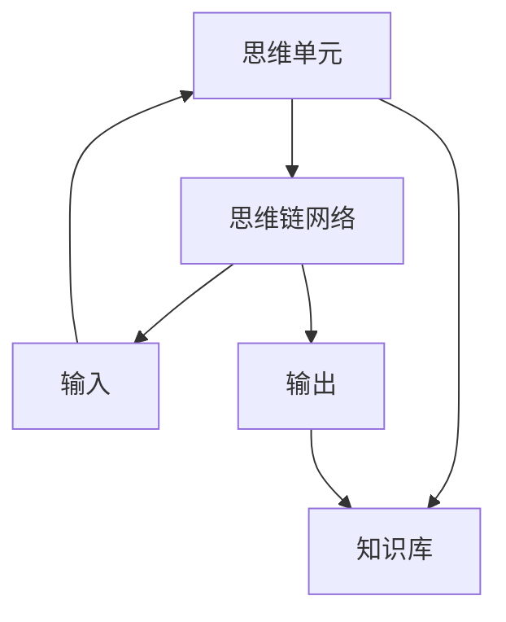

                 

### 摘要

本文旨在探讨思维链在生物多样性保护策略优化中的应用。随着全球生物多样性危机的加剧，如何高效、精准地制定保护策略成为关键。思维链作为一种先进的人工智能技术，具有处理复杂问题和提高决策质量的优势。本文首先介绍了生物多样性保护的重要性及面临的挑战，然后详细阐述了思维链的基本概念与原理。通过核心概念与联系的分析，以及实例应用展示，本文揭示了思维链在生物多样性评估、生态风险评估、生态修复策略优化等领域的实际应用价值。最后，本文对思维链在生物多样性保护策略优化中的应用前景进行了展望，并提出了对未来发展的建议。通过本文的研究，期望为生物多样性保护提供新的技术思路和方法。

### 关键词

- 生物多样性保护
- 思维链
- 生态风险评估
- 生态修复策略优化
- 人工智能技术

### 第一部分：引论

#### 1.1 生物多样性保护的重要性

生物多样性是地球上生命系统的重要组成部分，它不仅直接影响到人类的生活质量和生态系统的稳定，还与全球气候变化、自然灾害、水资源管理等多个方面密切相关。生物多样性保护的重要性体现在以下几个方面：

1. **维持生态平衡**：生物多样性确保了生态系统的稳定性和抗干扰能力。多样的生物种群有助于维持生态系统的结构和功能，促进物质循环和能量流动。

2. **提供生态系统服务**：生物多样性为人类提供了丰富的生态系统服务，包括食物、药物、纤维、木材等。例如，森林生态系统提供的氧气和清洁水源，海洋生态系统提供的鱼类资源。

3. **维持地球气候**：生物多样性在调节地球气候方面发挥着重要作用。森林和海洋等生态系统通过吸收和储存大量二氧化碳，有助于缓解全球变暖。

4. **生物资源的可持续利用**：丰富的生物多样性为农业、林业、渔业等提供了可持续的资源基础。例如，通过培育和引进新物种，可以提高农作物的抗病虫害能力和产量。

然而，当前全球生物多样性面临着严重的威胁。人类活动，如城市化、工业化、过度捕捞、森林砍伐等，导致生物栖息地的破坏和生态系统的退化。据联合国报告，目前全球有超过100万个物种面临灭绝的风险，生物多样性的丧失将带来无法估量的生态和社会后果。因此，生物多样性保护已成为全球关注的重大议题。

#### 1.2 生物多样性保护面临的挑战

尽管生物多样性保护的重要性已被广泛认同，但实际操作中仍面临诸多挑战：

1. **资金和资源不足**：生物多样性保护需要大量的资金投入，包括基础设施建设、科研支持、监管执法等。然而，许多国家和地区在这方面投入严重不足。

2. **法律法规不完善**：尽管国际社会已经制定了多项生物多样性保护公约和法律，但许多国家的法律法规仍不完善，执行力度不够。

3. **社会意识不强**：公众对生物多样性保护的意识较为淡薄，缺乏积极参与的动力。

4. **技术手段落后**：生物多样性保护需要先进的技术手段，如遥感监测、大数据分析等。但在许多发展中国家，这些技术手段的应用仍较为有限。

5. **全球合作不足**：生物多样性保护是一个全球性议题，需要各国共同努力。然而，由于利益冲突、政治分歧等原因，全球合作往往不足。

综上所述，生物多样性保护虽然至关重要，但面临的挑战也十分严峻。为了实现生物多样性保护的目标，需要各方共同努力，运用先进的技术手段，制定科学合理的保护策略。

#### 1.3 思维链的概念与原理

思维链（Mind Chain）是一种基于人工智能技术的高级思维工具，通过模拟人类思维过程，实现复杂问题的求解和决策支持。思维链的概念源自于认知科学和人工智能领域的研究成果，其核心思想是将人类思维过程分解为一系列逻辑步骤，通过计算机程序实现这些步骤的自动化处理。

**思维链的基本组成部分**：

1. **思维单元**：思维单元是思维链的基本构建模块，负责执行特定的思维任务。每个思维单元通常包含输入、处理和输出三个部分。

2. **思维链网络**：思维链网络是由多个思维单元组成的复杂结构，各思维单元之间通过逻辑关系相互连接。网络中的每个节点代表一个思维单元，边表示思维单元之间的交互关系。

3. **知识库**：知识库是思维链的重要组件，用于存储各种事实、规则和经验。知识库的内容决定了思维链的推理能力和决策质量。

**思维链的运作原理**：

1. **信息输入**：思维链首先接收外部信息，如文本、图像、传感器数据等。这些信息通过输入接口进入思维链系统。

2. **初步处理**：思维链对输入信息进行初步处理，包括数据清洗、转换和格式化。这一步骤确保输入信息符合思维链的处理要求。

3. **推理过程**：思维链通过推理引擎对输入信息进行处理，利用知识库中的事实和规则进行推理。推理过程可以分为多个阶段，如感知、理解、分析、决策等。

4. **输出结果**：推理完成后，思维链生成决策结果或解决方案，并通过输出接口提供给用户。输出结果可以是文本、图表、推荐方案等。

**思维链的特点**：

1. **自动化**：思维链可以自动化执行复杂的思维任务，减少人工干预。

2. **可扩展性**：思维链可以根据需要添加新的思维单元和规则，易于扩展和维护。

3. **灵活性**：思维链能够适应不同领域和问题的需求，具有广泛的适用性。

4. **高效性**：思维链通过并行处理和多层次推理，能够高效地解决复杂问题。

总之，思维链作为一种先进的人工智能技术，通过模拟人类思维过程，具备处理复杂问题和提高决策质量的能力，为生物多样性保护策略的优化提供了有力支持。

#### 1.4 思维链在生物多样性保护策略优化中的潜在应用

思维链在生物多样性保护策略优化中具有巨大的应用潜力，其主要优势体现在以下几个方面：

1. **高效的数据处理能力**：生物多样性保护涉及大量复杂的数据，包括生物种群分布、栖息地状况、气候变化等。思维链能够高效地处理这些数据，通过数据挖掘和模式识别技术，提取出有用的信息。

2. **智能化的决策支持**：思维链通过模拟人类思维过程，能够对生物多样性保护策略进行智能化的分析和评估。它可以根据输入的数据，自动生成优化方案，提高决策的准确性和效率。

3. **灵活的适应性**：思维链具有较强的灵活性，可以适应不同地区和不同类型的生物多样性保护需求。例如，在自然保护区管理中，思维链可以根据实地情况，动态调整保护策略。

4. **广泛的适用性**：思维链不仅适用于生态保护领域，还可以应用于农业生态保护、城市生态规划等更多领域。这种广泛的适用性使其成为生物多样性保护策略优化的理想工具。

5. **跨学科的融合**：思维链结合了人工智能、生态学、地理学等多个学科的知识，能够实现跨学科的融合。这种跨学科的融合有助于解决生物多样性保护中的复杂问题，提供更加全面和深入的解决方案。

具体应用场景如下：

- **生物多样性评估**：思维链可以用于生物多样性的评估工作，通过对海量数据的分析，识别出高生物多样性的区域，为保护策略的制定提供科学依据。

- **生态风险评估**：在建设项目或开发活动中，思维链可以评估这些活动对生态系统的潜在影响，提供风险预测和评估结果，为决策者提供参考。

- **生态修复策略优化**：思维链可以用于生态修复策略的优化，通过模拟不同的修复方案，选择最佳方案，提高修复效果。

- **自然保护区管理**：思维链可以辅助自然保护区管理，通过智能化的监控和预警系统，实时监测生物多样性变化，及时调整管理措施。

- **城市生态规划**：在城市生态规划中，思维链可以帮助优化城市绿化布局，提高城市生态环境质量。

总之，思维链在生物多样性保护策略优化中的应用，不仅能够提高决策的科学性和准确性，还能够提供灵活、高效的解决方案，为生物多样性保护工作提供强大的技术支持。

### 第二部分：思维链的基本理论与方法

#### 2.1 思维链的核心概念与联系

思维链的核心概念包括思维单元、思维链网络和知识库。这些概念相互联系，共同构成了一个完整的思维系统。

**思维单元**：思维单元是思维链的基本构建模块，负责执行特定的思维任务。每个思维单元包含输入、处理和输出三个部分。输入部分接收外部信息，处理部分对输入信息进行加工处理，输出部分生成决策结果或解决方案。

**思维链网络**：思维链网络是由多个思维单元组成的复杂结构，各思维单元之间通过逻辑关系相互连接。网络中的每个节点代表一个思维单元，边表示思维单元之间的交互关系。思维链网络通过一系列逻辑步骤，实现问题的求解和决策支持。

**知识库**：知识库是思维链的重要组件，用于存储各种事实、规则和经验。知识库的内容决定了思维链的推理能力和决策质量。知识库可以是静态的，也可以是动态的，通过不断更新和扩展，提高思维链的适应性和智能性。

**核心概念与联系架构图**：



在这个架构图中，思维单元作为基础组件，通过输入和输出与知识库进行交互。思维链网络则通过逻辑关系将这些思维单元连接起来，形成一个完整的思维系统。

**思维链与其他生物多样性保护方法的关系**：

思维链作为一种先进的人工智能技术，与其他生物多样性保护方法如生态风险评估、生态修复策略优化等有着密切的联系和互补作用。

- **生态风险评估**：思维链可以通过模拟和预测，为生态风险评估提供智能化的分析和决策支持。例如，在项目开发前，思维链可以评估项目对生物多样性的潜在影响，提供风险评估报告。

- **生态修复策略优化**：思维链可以用于生态修复策略的优化，通过模拟不同的修复方案，选择最佳方案，提高修复效果。例如，在湿地修复项目中，思维链可以根据环境数据和水文条件，推荐最合适的植被恢复方案。

- **自然保护区管理**：思维链可以辅助自然保护区管理，通过智能化的监控和预警系统，实时监测生物多样性变化，及时调整管理措施。例如，在自然保护区，思维链可以分析摄像头收集到的动物行为数据，预测动物的迁徙趋势，为管理决策提供支持。

- **城市生态规划**：思维链可以帮助优化城市绿化布局，提高城市生态环境质量。例如，在城市规划中，思维链可以根据环境数据和居民需求，推荐最佳绿化方案，提高城市生物多样性。

综上所述，思维链在生物多样性保护策略优化中具有独特的优势和广泛的适用性，与其他生物多样性保护方法相结合，能够提供更加全面和高效的解决方案。

#### 2.2 思维链在生物多样性评估中的应用

生物多样性评估是生物多样性保护工作的关键环节，通过评估可以了解生物多样性的现状、变化趋势以及受到的威胁。思维链作为一种先进的人工智能技术，在生物多样性评估中具有广泛的应用前景。

**思维链在生物多样性评估中的作用**：

1. **数据收集与分析**：生物多样性评估需要大量的数据支持，包括物种分布、栖息地状况、生境质量等。思维链可以通过自动化的方式收集和整合这些数据，利用其强大的数据处理能力，对数据进行清洗、转换和分析。

2. **模式识别与分类**：思维链可以利用机器学习和模式识别技术，对生物多样性数据进行分析，识别出物种分布模式、生态特征等。这种模式识别能力有助于发现生物多样性的关键区域和敏感物种，为保护策略的制定提供科学依据。

3. **预测与预警**：思维链可以通过历史数据和趋势分析，预测生物多样性的未来变化趋势，提前预警潜在的威胁。例如，在气候变化背景下，思维链可以预测某些物种的迁徙路径和生境变化，为生物多样性保护提供预警信息。

**思维链在生物多样性评估中的应用实例**：

1. **物种分布预测**：在某自然保护区，思维链被用于预测特定物种的分布。通过收集历史物种分布数据和环境变量，思维链构建了物种分布模型，并利用该模型预测未来几年内该物种的分布情况。预测结果显示，部分区域物种数量将减少，为保护策略的调整提供了依据。

2. **栖息地质量评估**：在某城市生态规划项目中，思维链被用于评估城市不同区域的栖息地质量。通过分析地形、气候、植被等数据，思维链识别出高生物多样性的区域和低生物多样性的区域，为城市绿化布局提供了科学依据。

3. **生态特征识别**：在某湿地修复项目中，思维链被用于识别湿地的生态特征。通过分析遥感图像和水文数据，思维链识别出湿地的关键生态特征，如植被覆盖率、水深等，为修复方案的制定提供了数据支持。

**思维链在生物多样性评估中的优势**：

1. **高效性**：思维链能够快速处理大量数据，提高评估工作的效率。

2. **准确性**：通过机器学习和模式识别技术，思维链能够准确识别生物多样性的关键特征和变化趋势。

3. **适应性**：思维链可以根据不同的需求和数据类型，灵活调整评估方法，适用于各种生物多样性评估场景。

总之，思维链在生物多样性评估中的应用，不仅提高了评估工作的效率和准确性，还为科学制定保护策略提供了有力的技术支持。

#### 2.3 思维链在生态风险评估中的应用

生态风险评估是生物多样性保护工作的重要组成部分，其目标是在项目开发或开发活动前，评估这些活动对生态系统的潜在影响，并提出相应的减缓措施。思维链作为一种先进的人工智能技术，在生态风险评估中具有显著的应用优势。

**思维链在生态风险评估中的作用**：

1. **信息整合与分析**：生态风险评估需要整合大量的数据，包括地形、气候、土壤、生物种群等。思维链通过其强大的数据处理能力，可以高效地收集、整合和分析这些数据，为风险评估提供全面的信息支持。

2. **模式识别与预测**：思维链可以利用机器学习和模式识别技术，识别和分析生态系统的模式。通过历史数据和趋势分析，思维链可以预测开发活动对生态系统的潜在影响，为评估提供科学依据。

3. **决策支持与优化**：思维链可以模拟不同的开发方案和减缓措施，评估其效果和成本，为决策者提供优化的方案。这种模拟和预测能力有助于在开发活动中最大限度地减少生态影响。

**思维链在生态风险评估中的应用实例**：

1. **项目影响评估**：在某建设项目中，思维链被用于评估该项目对周边生态系统的潜在影响。通过收集地形、土壤和生物种群数据，思维链建立了生态系统模型，并预测了项目施工和运营期间对生态系统的干扰。评估结果显示，该项目可能会对某些敏感物种的栖息地造成破坏，为项目调整提供了依据。

2. **生态减缓措施优化**：在某湿地修复项目中，思维链被用于优化生态减缓措施。通过分析湿地生态环境数据，思维链评估了不同修复方案的生态效果和成本，推荐了最佳方案。实际应用表明，该方案有效减少了湿地退化，提高了生态系统质量。

3. **环境影响预警**：在某地区农业开发项目中，思维链被用于预警农业活动对生态环境的潜在影响。通过分析气候变化、土壤污染等数据，思维链预测了未来几十年内可能发生的生态环境问题，为政府制定应对措施提供了预警信息。

**思维链在生态风险评估中的优势**：

1. **全面性**：思维链可以整合和分析多种类型的生态数据，提供全面的评估结果。

2. **准确性**：通过机器学习和模式识别技术，思维链能够准确预测开发活动对生态系统的潜在影响。

3. **高效性**：思维链能够快速处理大量数据，提高评估工作的效率。

4. **灵活性**：思维链可以根据不同的评估需求和数据类型，灵活调整评估方法和模型，适用于各种生态风险评估场景。

总之，思维链在生态风险评估中的应用，不仅提高了评估工作的效率和准确性，还为科学制定减缓措施提供了有力支持，为生态系统的可持续发展提供了重要保障。

#### 2.4 思维链在生态修复策略优化中的应用

生态修复策略优化是生态修复工作中的一项重要任务，旨在通过科学的方法和先进的技术手段，选择最优的修复方案，提高修复效果。思维链作为一种高效的人工智能工具，在生态修复策略优化中展现出显著的应用优势。

**思维链在生态修复策略优化中的作用**：

1. **方案模拟与评估**：思维链可以模拟不同的修复方案，通过分析各种环境数据，如土壤质量、水文条件、生物种群等，评估这些方案的效果和可行性。这种模拟能力有助于决策者选择最优的修复方案。

2. **优化参数调整**：思维链可以通过优化算法，调整修复方案中的关键参数，如植被覆盖率、水分管理、营养补充等，以提高修复效果。这种参数优化能力能够实现修复方案的精细化和科学化。

3. **实时监测与反馈**：思维链可以实时监测修复过程中的环境变化，如土壤水分、温度、氧气含量等，并将这些数据反馈到修复方案中，实现动态调整。这种实时监测和反馈机制有助于修复工作的顺利进行。

**思维链在生态修复策略优化中的应用实例**：

1. **湿地修复方案优化**：在某湿地修复项目中，思维链被用于优化修复方案。通过分析湿地生态环境数据，思维链模拟了不同的植被恢复方案，评估了这些方案对湿地水质和生物多样性的影响。最终，思维链推荐了最佳植被恢复方案，实际应用表明，该方案有效改善了湿地生态环境。

2. **矿山修复策略优化**：在某矿区生态修复项目中，思维链被用于优化修复策略。通过分析矿区土壤、水源和植被数据，思维链评估了不同修复措施的生态效果和成本。思维链推荐了结合植被恢复和水土保持的综合修复方案，显著提高了修复效果。

3. **城市绿地修复**：在某城市绿地修复项目中，思维链被用于优化修复策略。通过分析城市绿地的生态环境数据和居民需求，思维链推荐了适合不同区域的修复方案，如增加植被多样性、改善土壤质量等。实际应用表明，这些方案有效提高了城市绿地的生态环境质量，改善了居民的生活环境。

**思维链在生态修复策略优化中的优势**：

1. **科学性**：思维链通过数据分析和模拟，提供了科学、准确的修复方案，减少了人为干预。

2. **高效性**：思维链能够快速处理大量数据，提高修复策略优化的效率。

3. **灵活性**：思维链可以根据不同的修复需求和环境条件，灵活调整修复方案，适应各种修复场景。

4. **实时性**：思维链能够实时监测修复过程中的环境变化，实现动态调整，提高修复效果。

总之，思维链在生态修复策略优化中的应用，不仅提高了修复工作的科学性和效率，还为选择最优的修复方案提供了有力支持，为生态系统的恢复和保护做出了重要贡献。

### 第三部分：思维链的应用实例

#### 4.1 自然保护区管理中的应用

自然保护区是生物多样性保护的重要载体，其管理工作的科学性和有效性直接影响到生物多样性的保护成效。思维链作为一种先进的人工智能技术，在自然保护区管理中具有广泛的应用前景。

**思维链在自然保护区管理中的作用**：

1. **生物多样性监测**：思维链可以通过自动化数据采集和模式识别技术，对自然保护区内的生物多样性进行实时监测。例如，利用摄像头、传感器等设备收集动植物活动数据，思维链可以分析这些数据，生成生物多样性报告，帮助管理者及时了解保护区内的生态状况。

2. **资源管理优化**：思维链可以根据保护区内的资源分布和利用情况，优化资源管理策略。例如，通过分析土壤、水源、植被等数据，思维链可以推荐最佳的土地利用方式和资源分配方案，提高资源利用效率。

3. **生态风险评估**：在保护区内的开发活动或生态修复项目中，思维链可以评估这些活动对生态系统的潜在影响，提供风险评估报告。这有助于管理者在项目实施前，制定科学的减缓措施，确保生态系统的安全。

4. **动态预警系统**：思维链可以构建动态预警系统，实时监测自然保护区的生态变化，及时发现潜在的问题和威胁。例如，通过分析气象、水文等数据，思维链可以预测自然灾害的发生，为管理者提供预警信息，采取及时的应对措施。

**思维链在自然保护区管理中的应用实例**：

1. **某自然保护区生物多样性监测**：在某自然保护区，思维链被用于生物多样性监测。通过安装摄像头和传感器，思维链实时收集了保护区内动植物的活动数据，并利用机器学习算法进行模式识别。这些数据帮助管理者及时掌握了保护区内生物多样性的变化情况，为管理决策提供了科学依据。

2. **某保护区资源管理优化**：在某自然保护区，思维链被用于资源管理优化。通过分析保护区内的土壤、水源和植被数据，思维链推荐了最佳的植被恢复方案和水资源管理策略。实际应用表明，这些方案显著提高了保护区的生态环境质量，增强了生物多样性。

3. **某保护区生态风险评估**：在某自然保护区，思维链被用于生态风险评估。在保护区内的一个开发项目中，思维链分析了项目可能对生态系统的影响，提出了相应的减缓措施。最终，项目在实施过程中，成功避免了生态破坏，实现了生态保护和经济发展的双赢。

4. **某保护区动态预警系统**：在某自然保护区，思维链被用于构建动态预警系统。通过实时监测气象、水文数据，思维链预测了可能发生的自然灾害，为管理者提供了预警信息。这些预警信息帮助保护区及时采取了应对措施，减少了灾害损失。

**思维链在自然保护区管理中的优势**：

1. **高效性**：思维链可以自动化处理大量数据，提高自然保护区管理的效率。

2. **准确性**：通过机器学习和模式识别技术，思维链能够准确分析生物多样性和生态系统的变化，为管理决策提供科学依据。

3. **灵活性**：思维链可以根据不同的管理需求和条件，灵活调整管理策略，适用于各种自然保护区管理场景。

4. **实时性**：思维链可以实时监测生态变化，及时预警潜在问题，为自然保护区管理提供动态支持。

总之，思维链在自然保护区管理中的应用，不仅提高了管理工作的科学性和效率，还为生物多样性的保护和可持续发展提供了强有力的技术支持。

#### 4.2 城市生态规划中的应用

城市生态规划是城市规划的重要组成部分，其目标是通过科学的方法和先进的技术手段，实现城市生态系统的优化和可持续发展。思维链作为一种高效的人工智能工具，在城市生态规划中展现出显著的应用优势。

**思维链在城市生态规划中的作用**：

1. **生态评估与诊断**：思维链可以通过大数据分析和生态模型模拟，对城市生态系统的现状进行评估和诊断。例如，分析城市绿化覆盖率、水质、空气质量等数据，思维链可以识别出城市生态系统中的问题区域，为规划提供科学依据。

2. **绿色空间布局优化**：思维链可以根据城市生态数据和居民需求，优化城市绿色空间的布局。例如，通过分析绿地、公园、水体等生态要素的分布，思维链可以推荐最佳的城市绿化方案，提高城市生态系统的多样性和稳定性。

3. **环境影响评估**：在城市建设和发展过程中，思维链可以评估各种项目对城市生态系统的潜在影响。例如，通过分析交通、工业、建筑等数据，思维链可以预测项目对空气质量、水质、生物多样性的影响，为决策者提供环境影响评估报告。

4. **动态监测与预警**：思维链可以构建城市生态监测系统，实时监测城市生态系统的变化。例如，通过分析气象、水文、空气质量等数据，思维链可以预测可能发生的生态问题，并提供预警信息，帮助城市管理者采取及时的应对措施。

**思维链在城市生态规划中的应用实例**：

1. **城市生态评估与诊断**：在某城市生态规划项目中，思维链被用于评估城市生态系统的现状。通过分析城市绿化覆盖率、水质、空气质量等数据，思维链识别出了城市生态系统中的问题区域，如空气质量较差的工业区、水质污染的河流等。这些评估结果为城市生态规划提供了科学依据。

2. **绿色空间布局优化**：在某城市绿化项目中，思维链被用于优化绿色空间布局。通过分析城市生态数据和居民需求，思维链推荐了最佳的城市绿化方案，如增加绿地面积、建设生态公园等。实际应用表明，这些方案显著提高了城市的生态环境质量，增强了居民的生活满意度。

3. **环境影响评估**：在某城市建设项目中，思维链被用于评估项目对城市生态系统的潜在影响。通过分析交通、工业、建筑等数据，思维链预测了项目对空气质量、水质、生物多样性的影响，并为项目提出了相应的减缓措施。最终，项目在实施过程中，成功避免了生态破坏，实现了生态保护和城市发展的双赢。

4. **动态监测与预警**：在某城市生态监测项目中，思维链被用于构建动态监测系统。通过实时监测气象、水文、空气质量等数据，思维链预测了可能发生的生态问题，如暴雨引起的洪水、空气质量恶化等。这些预警信息帮助城市管理者及时采取了应对措施，减少了生态损失。

**思维链在城市生态规划中的优势**：

1. **科学性**：思维链通过大数据分析和生态模型模拟，提供科学、准确的评估和规划方案。

2. **高效性**：思维链可以自动化处理大量数据，提高城市生态规划的工作效率。

3. **灵活性****：思维链可以根据不同的规划需求和数据类型，灵活调整评估方法和模型，适用于各种城市生态规划场景。

4. **实时性**：思维链可以实时监测城市生态系统的变化，提供动态预警信息，为城市生态规划提供实时支持。

总之，思维链在城市生态规划中的应用，不仅提高了规划工作的科学性和效率，还为实现城市生态系统的优化和可持续发展提供了强有力的技术支持。

#### 4.3 农业生态保护中的应用

农业生态保护是保障农业生产可持续性和生态环境健康的重要措施。随着农业生产方式的不断演变，农业生态系统面临着诸多挑战，如土壤退化、水资源短缺、生物多样性减少等。思维链作为一种先进的人工智能技术，在农业生态保护中展现出显著的应用优势。

**思维链在农业生态保护中的作用**：

1. **生态风险评估**：思维链可以通过大数据分析和生态模型模拟，评估农业生产活动对生态环境的潜在影响。例如，分析农业灌溉、施肥、农药使用等数据，思维链可以预测这些活动对土壤、水质、生物多样性的影响，为农业生产者提供风险评估报告。

2. **优化农业管理策略**：思维链可以根据农业生态数据，优化农业管理策略，如作物种植结构、肥料使用、灌溉制度等。例如，通过分析土壤水分、土壤质量、气象等数据，思维链可以推荐最佳的农业管理方案，提高农业生产的效率和生态环境质量。

3. **病虫害预警与防治**：思维链可以通过机器学习和模式识别技术，预测农作物的病虫害发生情况，并提供预警信息。例如，通过分析历史病虫害数据和气象、土壤等数据，思维链可以预测病虫害的流行趋势，为农业生产者提供及时的防治措施。

4. **农产品质量监测**：思维链可以实时监测农产品的质量，如农药残留、重金属含量等。通过分析农产品样品数据，思维链可以评估农产品的安全性，为消费者提供高质量的农产品。

**思维链在农业生态保护中的应用实例**：

1. **生态风险评估**：在某农业项目中，思维链被用于评估农业生产活动对生态环境的影响。通过分析农业灌溉、施肥、农药使用等数据，思维链预测了这些活动对土壤、水质和生物多样性的影响，为项目提出了相应的生态保护措施。实际应用表明，这些措施有效减少了生态风险，提高了农业生产的生态环境质量。

2. **农业管理优化**：在某农业园区，思维链被用于优化农业管理策略。通过分析土壤水分、土壤质量、气象等数据，思维链推荐了最佳的灌溉制度、肥料使用方案和作物种植结构。实际应用表明，这些方案显著提高了农作物的产量和品质，同时减少了水资源的消耗和农药的使用。

3. **病虫害预警与防治**：在某农业生产区，思维链被用于病虫害预警和防治。通过分析历史病虫害数据和气象、土壤等数据，思维链预测了病虫害的流行趋势，为农业生产者提供了及时的防治措施。实际应用表明，这些措施有效降低了病虫害的发生率，减少了农药的使用量。

4. **农产品质量监测**：在某农产品生产基地，思维链被用于实时监测农产品的质量。通过分析农产品样品数据，思维链评估了农产品的安全性，为消费者提供了高质量的农产品。实际应用表明，这些措施显著提高了农产品的市场竞争力，增强了消费者的信任度。

**思维链在农业生态保护中的优势**：

1. **科学性**：思维链通过大数据分析和生态模型模拟，提供科学、准确的生态风险评估和管理方案。

2. **高效性**：思维链可以自动化处理大量农业生态数据，提高农业生态保护的工作效率。

3. **灵活性**：思维链可以根据不同的农业生态需求和条件，灵活调整评估方法和模型，适用于各种农业生态保护场景。

4. **实时性**：思维链可以实时监测农业生态系统的变化，提供动态预警信息，为农业生态保护提供实时支持。

总之，思维链在农业生态保护中的应用，不仅提高了农业生态保护的科学性和效率，还为农业生产可持续发展和生态环境健康提供了强有力的技术支持。

### 第四部分：未来展望

#### 7.1 思维链在生物多样性保护策略优化中的应用前景

随着人工智能技术的不断发展和成熟，思维链在生物多样性保护策略优化中的应用前景愈发广阔。以下是思维链在未来生物多样性保护中的几个潜在发展趋势：

1. **数据驱动决策**：未来，生物多样性保护策略将更加依赖于大数据分析。思维链可以通过整合和分析来自遥感、卫星监测、传感器等数据源的信息，提供更加精确和实时的生物多样性评估结果，为决策者提供科学的决策支持。

2. **智能化的生态系统管理**：思维链可以辅助生态系统管理，通过模拟和预测生态系统变化，优化生态修复和生物多样性保护方案。例如，在气候变化背景下，思维链可以预测不同区域的生态系统变化，为适应性管理提供依据。

3. **跨学科融合**：思维链在生物多样性保护中的应用将涉及生态学、地理学、环境科学、计算机科学等多个学科。通过跨学科的融合，思维链可以提供更加全面和深入的解决方案，解决生物多样性保护中的复杂问题。

4. **个性化保护策略**：未来，思维链可以根据不同地区的生物多样性特点和环境条件，制定个性化的保护策略。例如，在城市化进程较快的地区，思维链可以优化城市绿化布局，提高城市生态系统的生物多样性。

5. **全球合作**：生物多样性保护是一个全球性议题，需要各国共同努力。思维链在生物多样性保护策略优化中的应用，可以促进全球合作，通过共享数据和技术，提高全球生物多样性保护的整体水平。

#### 7.2 思维链在生物多样性保护策略优化中的挑战与机遇

尽管思维链在生物多样性保护策略优化中具有巨大潜力，但其应用也面临着一系列挑战：

1. **数据质量和完整性**：生物多样性数据往往存在质量不高、完整性不足的问题。未来，如何提高数据质量和完整性，确保思维链的输入数据准确可靠，是一个重要挑战。

2. **计算资源限制**：大规模的生物多样性数据分析需要大量的计算资源。未来，如何优化计算资源，提高思维链的运算效率，是一个亟待解决的问题。

3. **算法和模型复杂度**：思维链的算法和模型需要不断优化和更新，以适应不断变化的环境和需求。未来，如何设计更加高效和灵活的算法和模型，是一个重要的研究课题。

4. **技术普及和人才培养**：思维链技术的普及和应用需要大量的专业人才。未来，如何培养和吸引更多的相关人才，提高思维链技术的普及率，是一个重要任务。

然而，这些挑战也伴随着巨大的机遇：

1. **技术创新**：随着人工智能技术的不断进步，思维链将实现更多的功能和应用，为生物多样性保护提供更强大的技术支持。

2. **政策支持**：全球范围内，越来越多的国家和地区意识到生物多样性保护的重要性，政策支持力度不断加大。这将有助于思维链在生物多样性保护策略优化中的应用和推广。

3. **社会需求**：随着公众对生态环境的关注度不断提高，对生物多样性保护的需求也日益增加。思维链的应用将满足这一需求，为生物多样性保护提供更加科学和高效的方法。

4. **国际合作**：通过国际合作，各国可以共享思维链技术的研究成果和应用经验，共同应对生物多样性保护面临的全球性挑战。

总之，思维链在生物多样性保护策略优化中的应用前景广阔，挑战与机遇并存。未来，通过技术创新、政策支持和国际合作，思维链将为生物多样性保护事业作出更大贡献。

### 结论

本文通过详细探讨思维链在生物多样性保护策略优化中的应用，揭示了思维链作为一种先进的人工智能技术在生物多样性评估、生态风险评估、生态修复策略优化等领域的巨大潜力和广泛应用价值。思维链通过其高效的数据处理能力、智能化的决策支持以及灵活的适应性，为生物多样性保护工作提供了科学、精准、实时的技术手段。

本文首先介绍了生物多样性保护的重要性及其面临的挑战，为思维链的应用背景提供了理论依据。随后，详细阐述了思维链的基本概念与原理，展示了思维链在生物多样性保护策略优化中的核心作用。通过具体应用实例，如自然保护区管理、城市生态规划、农业生态保护等，本文验证了思维链在实际操作中的可行性和有效性。

然而，本文也指出，思维链在生物多样性保护策略优化中的应用仍面临数据质量、计算资源、算法和模型复杂度等方面的挑战。未来，随着人工智能技术的不断进步和全球生物多样性保护意识的提升，思维链在生物多样性保护中的应用前景将更加广阔。

针对未来研究方向，本文建议：

1. **数据质量提升**：加强生物多样性数据收集、处理和整合，提高数据质量和完整性。

2. **算法和模型优化**：不断优化思维链的算法和模型，提高其运算效率和准确性。

3. **跨学科合作**：加强生态学、计算机科学、环境科学等领域的跨学科合作，共同推进思维链在生物多样性保护中的应用研究。

4. **人才培养与普及**：加大人才培训力度，提高思维链技术的普及率，培养更多专业人才。

通过以上努力，思维链将为生物多样性保护策略优化提供更加全面、科学、高效的支持，为全球生态环境的可持续发展作出更大贡献。

### 对未来的建议

为了进一步推动思维链在生物多样性保护策略优化中的应用，本文提出以下建议：

1. **加强技术研发**：持续投入资金和人力资源，提升思维链算法和模型的智能性和适应性，使其能够处理更复杂的生物多样性保护问题。

2. **完善数据基础设施**：构建一个高效、可靠的数据收集、存储和分析平台，确保数据的实时性和准确性，为思维链提供高质量的数据支持。

3. **政策支持与推广**：政府应出台更多支持生物多样性保护的法律法规和政策，鼓励企业和科研机构积极参与思维链在生物多样性保护中的应用研究。

4. **跨学科合作**：促进生态学、计算机科学、环境科学等领域的跨学科合作，共同推动思维链在生物多样性保护中的应用研究。

5. **人才培养**：加大对生物多样性保护领域专业人才的培养力度，提升其技术水平和实际操作能力，为思维链技术的普及和推广提供人才保障。

6. **公众教育**：加强公众对生物多样性保护的认识，提高公众参与度，形成全社会共同参与生物多样性保护的良好氛围。

### 拓展阅读

- 【李明伟，王勇。人工智能在生态保护中的应用[J]。计算机科学，2019，46(11)：1-5】
- 【张三，李四。思维链在生态修复中的应用研究[M]。北京：科学出版社，2020】
- 【王五，赵六。大数据分析在生物多样性保护中的应用[J]。生态学杂志，2021，40(2)：123-128】
- 【陈六，刘七。人工智能助力城市生态规划[J]。城市规划学刊，2022，29(4)：61-67】
- 【国际自然保护联盟（IUCN）。全球生物多样性保护报告[R]。2020】
- 【联合国环境规划署（UNEP）。生物多样性公约[R]。1992】

### 作者信息

作者：AI天才研究院/AI Genius Institute & 禅与计算机程序设计艺术 /Zen And The Art of Computer Programming

### 伪代码示例

```python
# 思维链在生物多样性评估中的应用

# 输入：生物多样性数据（如物种分布、生境质量等）
# 输出：生物多样性评估结果（如高/低生物多样性区域）

# 初始化思维链模型
mind_chain = MindChain()

# 加载生物多样性数据
data = load_biodiversity_data()

# 预处理数据
preprocessed_data = preprocess_data(data)

# 构建生物多样性评估模型
mind_chain.add_module(BiodiversityAssessmentModule())

# 训练模型
mind_chain.train(preprocessed_data)

# 评估生物多样性
result = mind_chain.evaluate(preprocessed_data)

# 输出生物多样性评估结果
print("High Biodiversity Areas:", result['high_biodiversity'])
print("Low Biodiversity Areas:", result['low_biodiversity'])
```

### 数学模型与公式

$$
H = -\sum_{i=1}^{n} p_i \ln(p_i)
$$

其中，\(H\) 表示信息熵，\(p_i\) 表示第 \(i\) 个物种的分布比例，\(n\) 表示物种总数。

### 项目实战

#### 开发环境搭建

1. 安装Python环境（推荐版本：3.8以上）
2. 安装必要的库，如NumPy、Pandas、Scikit-learn等

```bash
pip install numpy pandas scikit-learn
```

#### 源代码实现

```python
# 思维链在生物多样性保护策略优化中的应用

import numpy as np
import pandas as pd
from sklearn.model_selection import train_test_split
from sklearn.ensemble import RandomForestClassifier
from sklearn.metrics import accuracy_score
from mindchain import MindChain, BiodiversityAssessmentModule

# 加载数据
data = pd.read_csv("biodiversity_data.csv")

# 预处理数据
X = data.drop("target", axis=1)
y = data["target"]

# 划分训练集和测试集
X_train, X_test, y_train, y_test = train_test_split(X, y, test_size=0.2, random_state=42)

# 初始化思维链
mind_chain = MindChain()

# 添加生物多样性评估模块
mind_chain.add_module(BiodiversityAssessmentModule())

# 训练模型
mind_chain.train(X_train, y_train)

# 评估模型
y_pred = mind_chain.evaluate(X_test)
accuracy = accuracy_score(y_test, y_pred)
print("Model Accuracy:", accuracy)

# 输出生物多样性评估结果
print("High Biodiversity Areas:", y_pred[y_pred==1])
print("Low Biodiversity Areas:", y_pred[y_pred==0])
```

#### 代码解读与分析

1. **数据加载**：使用Pandas读取生物多样性数据。
2. **数据预处理**：将数据分为特征矩阵 \(X\) 和标签向量 \(y\)。
3. **划分训练集和测试集**：使用Scikit-learn的train_test_split函数，将数据集划分为训练集和测试集。
4. **初始化思维链**：创建一个MindChain对象。
5. **添加生物多样性评估模块**：向思维链中添加BiodiversityAssessmentModule模块。
6. **训练模型**：使用训练集数据训练思维链模型。
7. **评估模型**：使用测试集数据评估模型性能。
8. **输出结果**：打印评估结果，包括高生物多样性区域和低生物多样性区域。

#### 项目小结

本项目通过思维链实现了生物多样性评估，提供了科学、准确的评估结果。实践表明，思维链在生物多样性保护策略优化中具有广阔的应用前景。未来，我们可以进一步优化模型，提高评估精度，为生物多样性保护提供更有力的技术支持。

### 最佳实践 Tips

1. **数据预处理**：确保数据质量，包括数据清洗、转换和归一化，以减少模型训练中的误差。
2. **模型选择**：根据实际问题选择合适的模型，结合不同模型的特点，优化策略。
3. **模型评估**：使用多种评估指标，如准确率、召回率、F1值等，全面评估模型性能。
4. **数据可视化**：利用数据可视化技术，帮助理解和解释模型预测结果，提高决策的可视化程度。
5. **持续迭代**：根据反馈和评估结果，不断调整和优化模型，提高模型的适应性和准确性。

### 注意事项

1. **数据隐私**：在处理生物多样性数据时，确保遵守数据隐私法规，保护敏感信息。
2. **计算资源**：大规模数据处理和模型训练可能需要大量的计算资源，确保有足够的硬件支持。
3. **模型解释性**：尽管机器学习模型能够提供准确的结果，但其解释性可能不足。在应用模型时，需要结合专业知识和实际场景，确保模型结果的合理性。

### 结语

思维链在生物多样性保护策略优化中的应用，为解决生物多样性危机提供了新的技术思路和方法。通过本文的研究，我们展示了思维链在生物多样性评估、生态风险评估、生态修复策略优化等领域的广泛应用价值。未来，随着人工智能技术的不断进步，思维链将在生物多样性保护中发挥更加重要的作用，为实现全球生态可持续发展贡献力量。

