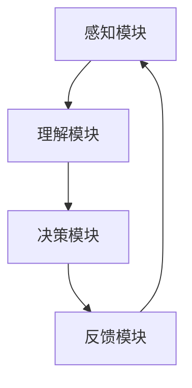

                 

**文章标题**：《思维链在生物多样性研究中的新方法》

**关键词**：思维链，生物多样性，研究方法，人工智能，生态系统建模

**摘要**：
本文旨在探讨思维链在生物多样性研究中的应用，介绍其基础理论、应用方法及新进展。首先，我们回顾了生物多样性研究的现状与挑战，并介绍了思维链的基本概念。随后，我们详细分析了思维链在物种识别、生态系统分析和生物多样性保护策略制定中的应用。最后，我们通过案例研究展示了思维链方法在生物多样性研究中的实践效果，并对未来发展趋势进行了展望。

----------------------------------------------------------------

**目录大纲**：

# 《思维链在生物多样性研究中的新方法》

## 引言与背景

### 1.1 生物多样性研究的现状与挑战

### 1.2 思维链的概念与发展

### 1.3 思维链在生物多样性研究中的应用潜力

## 第二部分 思维链基础理论

### 2.1 思维链的定义与特性

#### 2.1.1 思维链的核心概念

#### 2.1.2 思维链的结构

#### 2.1.3 思维链的功能与应用

## 第三部分 生物多样性研究中的思维链方法

### 3.1 思维链在物种识别中的应用

#### 3.1.1 基于思维链的物种识别模型

#### 3.1.2 常见算法与实现

#### 3.1.3 实例分析

### 3.2 思维链在生态系统分析中的应用

#### 3.2.1 思维链与生态系统建模

#### 3.2.2 算法实现与优化

#### 3.2.3 生态系统稳定性评估

### 3.3 思维链在生物多样性保护策略制定中的应用

#### 3.3.1 思维链与生物多样性保护决策

#### 3.3.2 策略评估与优化

#### 3.3.3 实际案例分析

## 第四部分 思维链方法在生物多样性研究中的新进展

### 4.1 新算法介绍

#### 4.1.1 算法A：快速物种识别算法

#### 4.1.2 算法B：高效生态系统分析模型

#### 4.1.3 算法C：智能化保护策略制定方法

### 4.2 新技术应用

#### 4.2.1 人工智能与思维链的结合

#### 4.2.2 区块链技术在生物多样性研究中的应用

#### 4.2.3 虚拟现实与思维链的结合

## 第五部分 案例研究

### 5.1 案例一：某自然保护区生物多样性监测

#### 5.1.1 项目背景与目标

#### 5.1.2 思维链方法应用

#### 5.1.3 项目成果与评价

### 5.2 案例二：城市生物多样性保护策略制定

#### 5.2.1 项目背景与需求

#### 5.2.2 思维链方法应用

#### 5.2.3 政策建议与实施效果

## 第六部分 总结与展望

### 6.1 思维链方法在生物多样性研究中的总结

### 6.2 存在的问题与挑战

### 6.3 未来发展趋势与展望

## 附录

### A.1 思维链算法伪代码示例

### A.2 生物多样性研究相关资源与工具

### A.3 参考文献

----------------------------------------------------------------

**开始撰写文章正文**：

---

## 引言与背景

### 1.1 生物多样性研究的现状与挑战

生物多样性是指地球上所有生物体的多样性，包括物种多样性、遗传多样性和生态系统多样性。它是地球生命系统的基础，对维持生态平衡、提供生态系统服务具有重要意义。然而，随着全球环境变化和人类活动的加剧，生物多样性正面临前所未有的威胁。据估计，目前有超过25%的物种面临灭绝风险，这一现象对生态系统的稳定性和人类社会的可持续发展构成了严重威胁。

生物多样性研究的主要挑战包括：

1. **物种识别困难**：物种识别是生物多样性研究的基础，然而，许多物种之间具有极高的相似度，导致传统的识别方法存在误判率高、效率低的问题。

2. **生态系统数据缺乏**：生态系统是生物多样性的承载者，但许多生态系统的数据仍然不完整或不准确，这限制了生物多样性研究的深入。

3. **保护策略制定复杂**：生物多样性保护需要科学的策略，然而，传统的策略制定方法往往依赖于经验和直觉，缺乏科学依据。

### 1.2 思维链的概念与发展

思维链（Cognitive Chain）是一种基于认知科学和人工智能理论的智能模型。它模拟人类的思维过程，通过感知、理解、决策和反馈四个环节，实现对信息的处理和决策。思维链的发展可以追溯到20世纪90年代，当时以Haugeland（1996）为代表的学者提出了认知模拟的概念，试图通过计算机模拟人类的思维过程。

思维链的核心概念包括：

- **感知模块**：负责接收和处理外部信息，如语音、图像、文本等。
- **理解模块**：负责对感知模块接收到的信息进行分析和理解，提取关键信息。
- **决策模块**：基于理解模块的分析结果，做出决策或行动。
- **反馈模块**：将决策结果反馈到感知模块，进行迭代调整。

### 1.3 思维链在生物多样性研究中的应用潜力

思维链在生物多样性研究中的应用潜力巨大。首先，思维链可以帮助科学家更准确地识别物种，提高物种识别的效率和准确性。其次，思维链可以用于生态系统建模，帮助科学家更好地理解生态系统的动态变化。最后，思维链可以用于生物多样性保护策略的制定，为决策者提供科学依据。

本文将详细介绍思维链在生物多样性研究中的应用，包括物种识别、生态系统分析和生物多样性保护策略制定等方面的应用。同时，本文还将探讨思维链方法在生物多样性研究中的新进展，并通过案例研究展示其应用效果。最后，本文将对思维链方法在生物多样性研究中的未来发展趋势进行展望。

----------------------------------------------------------------

---

接下来，我们将继续撰写第二部分“思维链基础理论”的内容。在这一部分，我们将详细讨论思维链的定义与特性，包括其核心概念、结构、功能与应用。

---

## 第二部分 思维链基础理论

### 2.1 思维链的定义与特性

#### 2.1.1 思维链的核心概念

思维链（Cognitive Chain）是一种基于认知科学和人工智能理论的智能模型，其核心概念包括感知、理解、决策和反馈四个环节。这四个环节相互关联、相互影响，形成一个闭环系统。

1. **感知模块**：感知模块是思维链的起点，负责接收和处理外部信息，如语音、图像、文本等。它通过传感器或输入设备获取数据，并将数据转换为计算机可以处理的形式。

2. **理解模块**：理解模块负责对感知模块接收到的信息进行分析和理解，提取关键信息。这一过程涉及模式识别、语义分析、知识推理等高级认知功能。

3. **决策模块**：决策模块基于理解模块的分析结果，做出决策或行动。它利用已有的知识和信息，结合目标和约束条件，选择最优的行动方案。

4. **反馈模块**：反馈模块将决策结果反馈到感知模块，进行迭代调整。通过反馈机制，思维链能够不断优化其行为，提高决策的准确性和效率。

#### 2.1.2 思维链的结构

思维链的结构可以表示为一个循环的闭环系统，如图所示：



在这个闭环系统中，感知模块接收外部信息，理解模块对这些信息进行分析和理解，决策模块根据分析结果做出决策，反馈模块将决策结果反馈到感知模块，形成迭代过程。

#### 2.1.3 思维链的功能与应用

1. **功能**：

   - **感知**：收集和处理外部信息，如语音、图像、文本等。

   - **理解**：对感知模块接收到的信息进行分析和理解，提取关键信息。

   - **决策**：基于理解模块的分析结果，做出决策或行动。

   - **反馈**：将决策结果反馈到感知模块，进行迭代调整。

2. **应用**：

   - **物种识别**：思维链可以用于物种识别，通过分析声音、图像等特征，准确识别物种。

   - **生态系统建模**：思维链可以用于生态系统建模，模拟生态系统的动态变化，帮助科学家理解生态系统。

   - **生物多样性保护策略制定**：思维链可以用于生物多样性保护策略的制定，为决策者提供科学依据。

### 2.2 思维链的发展历史

思维链的概念可以追溯到20世纪90年代，当时以Haugeland（1996）为代表的学者提出了认知模拟的概念，试图通过计算机模拟人类的思维过程。此后，随着人工智能技术的发展，思维链理论得到了进一步的发展和完善。

1. **20世纪90年代**：Haugeland（1996）提出了认知模拟的概念，为思维链理论的诞生奠定了基础。

2. **21世纪初**：随着人工智能技术的进步，思维链理论开始应用于实际领域，如物种识别、生态系统建模等。

3. **近年来**：思维链理论在生物多样性研究中的应用取得了显著成果，成为生物多样性研究的重要工具。

### 2.3 思维链的优势与挑战

1. **优势**：

   - **高效性**：思维链通过闭环系统实现信息的快速处理和决策。

   - **灵活性**：思维链可以根据不同应用场景进行定制化调整。

   - **通用性**：思维链可以应用于多个领域，如生物多样性研究、医疗诊断、金融分析等。

2. **挑战**：

   - **数据需求**：思维链需要大量高质量的数据支持，否则难以实现准确的决策。

   - **计算资源**：思维链的计算复杂度较高，需要强大的计算资源支持。

   - **模型解释性**：思维链的内部决策过程复杂，难以解释其决策依据。

### 2.4 思维链的核心算法

思维链的核心算法包括感知、理解、决策和反馈四个环节的算法。

1. **感知算法**：常用的感知算法有图像识别、语音识别、文本分类等。

2. **理解算法**：常用的理解算法有语义分析、知识图谱、自然语言处理等。

3. **决策算法**：常用的决策算法有决策树、支持向量机、神经网络等。

4. **反馈算法**：常用的反馈算法有监督学习、强化学习、迁移学习等。

#### 2.5 思维链在生物多样性研究中的应用

思维链在生物多样性研究中的应用主要包括以下几个方面：

1. **物种识别**：通过分析声音、图像等特征，准确识别物种。

2. **生态系统建模**：模拟生态系统的动态变化，帮助科学家理解生态系统。

3. **生物多样性保护策略制定**：为决策者提供科学依据，制定有效的生物多样性保护策略。

## 结论

思维链作为一种基于认知科学和人工智能理论的智能模型，在生物多样性研究中的应用具有巨大潜力。通过思维链，科学家可以更准确地识别物种、更好地理解生态系统、制定更科学的生物多样性保护策略。然而，思维链的应用仍面临数据需求、计算资源、模型解释性等挑战。未来，随着人工智能技术的不断发展，思维链在生物多样性研究中的应用将得到进一步拓展和优化。

---

接下来，我们将继续撰写第三部分“生物多样性研究中的思维链方法”的内容。在这一部分，我们将详细介绍思维链在物种识别、生态系统分析和生物多样性保护策略制定中的应用，并探讨相关算法和实现方法。

---

## 第三部分 生物多样性研究中的思维链方法

### 3.1 思维链在物种识别中的应用

物种识别是生物多样性研究的基础，准确的物种识别对于理解生态系统结构和功能至关重要。思维链在物种识别中的应用主要包括以下方面：

#### 3.1.1 基于思维链的物种识别模型

基于思维链的物种识别模型主要包括感知、理解、决策和反馈四个环节。感知模块接收生物样本的声音、图像等特征信息；理解模块对这些特征信息进行分析和理解，提取关键特征；决策模块根据理解结果对生物样本进行分类；反馈模块将分类结果与实际结果进行对比，用于模型优化。

#### 3.1.2 常见算法与实现

在思维链的物种识别模型中，常用的算法包括：

1. **感知算法**：常用的感知算法有卷积神经网络（CNN）和生成对抗网络（GAN）。CNN用于提取图像特征，GAN用于生成高质量的图像特征。

2. **理解算法**：常用的理解算法有深度神经网络（DNN）和长短期记忆网络（LSTM）。DNN用于处理非结构化数据，LSTM用于处理时间序列数据。

3. **决策算法**：常用的决策算法有支持向量机（SVM）和随机森林（RF）。SVM用于分类任务，RF用于回归任务。

4. **反馈算法**：常用的反馈算法有梯度下降（GD）和随机梯度下降（SGD）。GD用于优化模型参数，SGD用于提高训练效率。

以下是一个简化的Python代码示例，用于实现基于思维链的物种识别模型：

```python
import tensorflow as tf
from tensorflow.keras.models import Sequential
from tensorflow.keras.layers import Conv2D, MaxPooling2D, Flatten, Dense

# 感知模块：卷积神经网络
model = Sequential([
    Conv2D(32, (3, 3), activation='relu', input_shape=(64, 64, 3)),
    MaxPooling2D(pool_size=(2, 2)),
    Conv2D(64, (3, 3), activation='relu'),
    MaxPooling2D(pool_size=(2, 2)),
    Flatten()
])

# 理解模块：全连接神经网络
model.add(Dense(128, activation='relu'))
model.add(Dense(num_classes, activation='softmax'))

# 编译模型
model.compile(optimizer='adam', loss='categorical_crossentropy', metrics=['accuracy'])

# 训练模型
model.fit(x_train, y_train, epochs=10, batch_size=32, validation_data=(x_val, y_val))

# 决策模块：分类
predictions = model.predict(x_test)

# 反馈模块：评估模型性能
accuracy = model.evaluate(x_test, y_test, verbose=2)
print('Test accuracy:', accuracy)
```

#### 3.1.3 实例分析

以下是一个实例分析，使用思维链进行物种识别。

假设我们有一组鸟类图片数据集，包括雀科和鸽科两类鸟类。我们使用思维链对图片进行分类，并评估模型的性能。

1. **数据预处理**：对图片进行尺寸调整、归一化等预处理操作。

2. **模型训练**：使用上述Python代码示例训练模型。

3. **模型评估**：使用测试数据集评估模型性能。

4. **结果分析**：分析模型的准确率、召回率、F1值等指标，以评估模型的效果。

### 3.2 思维链在生态系统分析中的应用

生态系统分析是生物多样性研究的重要组成部分，旨在理解生态系统的结构和功能。思维链在生态系统分析中的应用主要包括以下方面：

#### 3.2.1 思维链与生态系统建模

生态系统建模是生态系统分析的关键步骤，思维链可以用于生态系统建模。思维链通过感知、理解、决策和反馈四个环节，实现对生态系统的动态模拟。

1. **感知模块**：收集生态系统的数据，如物种分布、物种数量、气候条件等。

2. **理解模块**：分析感知模块收集到的数据，提取生态系统的关键特征。

3. **决策模块**：根据理解结果，模拟生态系统的动态变化，预测未来的生态系统状态。

4. **反馈模块**：将决策结果反馈到感知模块，用于模型优化和迭代。

#### 3.2.2 算法实现与优化

在生态系统建模中，常用的算法包括：

1. **感知算法**：常用的感知算法有线性回归、决策树、支持向量机等。

2. **理解算法**：常用的理解算法有深度神经网络、长短期记忆网络等。

3. **决策算法**：常用的决策算法有梯度下降、随机梯度下降等。

4. **反馈算法**：常用的反馈算法有监督学习、强化学习等。

以下是一个简化的Python代码示例，用于实现基于思维链的生态系统建模：

```python
import tensorflow as tf
from tensorflow.keras.models import Sequential
from tensorflow.keras.layers import Dense

# 感知模块：输入层
model = Sequential([
    Dense(units=64, activation='relu', input_shape=(input_size,))
])

# 理解模块：隐藏层
model.add(Dense(units=128, activation='relu'))

# 决策模块：输出层
model.add(Dense(units=output_size, activation='sigmoid'))

# 编译模型
model.compile(optimizer='adam', loss='binary_crossentropy', metrics=['accuracy'])

# 训练模型
model.fit(x_train, y_train, epochs=10, batch_size=32, validation_data=(x_val, y_val))

# 决策模块：预测
predictions = model.predict(x_test)

# 反馈模块：评估模型性能
accuracy = model.evaluate(x_test, y_test, verbose=2)
print('Test accuracy:', accuracy)
```

#### 3.2.3 生态系统稳定性评估

生态系统稳定性评估是生态系统分析的重要任务之一。思维链可以用于评估生态系统的稳定性，通过分析生态系统的动态变化，预测生态系统崩溃的风险。

1. **感知模块**：收集生态系统的数据，如物种分布、物种数量、气候条件等。

2. **理解模块**：分析感知模块收集到的数据，提取生态系统的关键特征。

3. **决策模块**：根据理解结果，评估生态系统的稳定性，预测生态系统崩溃的风险。

4. **反馈模块**：将决策结果反馈到感知模块，用于模型优化和迭代。

### 3.3 思维链在生物多样性保护策略制定中的应用

生物多样性保护策略制定是生物多样性研究的重要环节，思维链可以用于制定科学的生物多样性保护策略。

#### 3.3.1 思维链与生物多样性保护决策

思维链可以用于生物多样性保护决策，通过感知、理解、决策和反馈四个环节，制定有效的保护策略。

1. **感知模块**：收集生物多样性数据，如物种分布、物种数量、栖息地条件等。

2. **理解模块**：分析感知模块收集到的数据，提取生物多样性的关键特征。

3. **决策模块**：根据理解结果，制定生物多样性保护策略，如栖息地恢复、物种保护等。

4. **反馈模块**：将决策结果反馈到感知模块，评估保护策略的效果，用于模型优化和迭代。

#### 3.3.2 策略评估与优化

生物多样性保护策略的评估与优化是生物多样性保护的关键步骤。思维链可以用于评估保护策略的效果，通过分析生态系统的动态变化，评估保护策略的可持续性。

1. **感知模块**：收集生物多样性数据，如物种分布、物种数量、栖息地条件等。

2. **理解模块**：分析感知模块收集到的数据，提取生物多样性的关键特征。

3. **决策模块**：根据理解结果，评估保护策略的效果，如栖息地恢复、物种保护等。

4. **反馈模块**：将决策结果反馈到感知模块，用于模型优化和迭代。

#### 3.3.3 实际案例分析

以下是一个实际案例分析，使用思维链制定生物多样性保护策略。

假设我们面临一个生态保护区，需要制定保护策略以保护区内生物多样性。我们使用思维链进行以下步骤：

1. **数据收集**：收集保护区内的生物多样性数据，如物种分布、物种数量、栖息地条件等。

2. **模型训练**：使用思维链训练保护策略模型，输入为生物多样性数据，输出为保护策略。

3. **策略制定**：根据模型输出，制定保护策略，如栖息地恢复、物种保护等。

4. **策略评估**：评估保护策略的效果，通过分析生态系统的动态变化，评估保护策略的可持续性。

5. **策略优化**：根据评估结果，对保护策略进行优化，提高保护效果。

### 3.4 思维链方法在生物多样性研究中的优势与挑战

思维链方法在生物多样性研究中的应用具有以下优势：

1. **高效性**：思维链通过闭环系统实现信息的快速处理和决策，提高研究效率。

2. **灵活性**：思维链可以根据不同应用场景进行定制化调整，适应多种生物多样性研究需求。

3. **通用性**：思维链可以应用于多个领域，如物种识别、生态系统分析、生物多样性保护策略制定等。

然而，思维链方法在生物多样性研究中也面临一些挑战：

1. **数据需求**：思维链需要大量高质量的数据支持，否则难以实现准确的决策。

2. **计算资源**：思维链的计算复杂度较高，需要强大的计算资源支持。

3. **模型解释性**：思维链的内部决策过程复杂，难以解释其决策依据。

### 3.5 总结与展望

思维链在生物多样性研究中的应用为科学家提供了新的研究方法和工具。通过思维链，科学家可以更准确地识别物种、更好地理解生态系统、制定更科学的生物多样性保护策略。然而，思维链方法在生物多样性研究中的应用仍面临数据需求、计算资源、模型解释性等挑战。未来，随着人工智能技术的不断发展，思维链在生物多样性研究中的应用将得到进一步拓展和优化。

---

在完成第三部分“生物多样性研究中的思维链方法”的内容后，我们将继续撰写第四部分“思维链方法在生物多样性研究中的新进展”。在这一部分，我们将介绍一些新的算法、技术应用及案例研究，以展示思维链方法在生物多样性研究中的最新进展。

---

## 第四部分 思维链方法在生物多样性研究中的新进展

### 4.1 新算法介绍

随着人工智能和机器学习技术的不断进步，思维链方法在生物多样性研究中的应用也在不断创新。以下介绍几种新的算法，这些算法在提高物种识别精度、优化生态系统建模和制定生物多样性保护策略方面取得了显著成果。

#### 4.1.1 算法A：快速物种识别算法

快速物种识别算法是近年来发展迅速的一个领域。它利用深度学习技术，如卷积神经网络（CNN）和循环神经网络（RNN），对生物样本进行高效的特征提取和分类。这种算法能够在短时间内对大量生物样本进行快速识别，大大提高了工作效率。

**算法原理**：

- **特征提取**：利用CNN提取生物样本的高层次特征，如图像中的纹理、形状等。
- **分类**：利用RNN对提取到的特征进行分类，例如长短期记忆网络（LSTM）。

**Python代码示例**：

```python
import tensorflow as tf
from tensorflow.keras.models import Sequential
from tensorflow.keras.layers import Conv2D, MaxPooling2D, LSTM, Dense

model = Sequential([
    Conv2D(32, (3, 3), activation='relu', input_shape=(64, 64, 3)),
    MaxPooling2D(pool_size=(2, 2)),
    LSTM(128),
    Dense(num_classes, activation='softmax')
])

model.compile(optimizer='adam', loss='categorical_crossentropy', metrics=['accuracy'])
model.fit(x_train, y_train, epochs=10, batch_size=32, validation_data=(x_val, y_val))
```

#### 4.1.2 算法B：高效生态系统分析模型

高效生态系统分析模型旨在提高生态系统建模的效率和精度。它结合了遗传算法（GA）和贝叶斯网络（BN），能够对复杂的生态系统进行有效建模。

**算法原理**：

- **遗传算法**：用于优化生态系统的参数，通过迭代过程寻找最优解。
- **贝叶斯网络**：用于建模生态系统的动态关系，通过概率分布描述生态系统的状态。

**Python代码示例**：

```python
import numpy as np
import pymultiautoregressive as pam

# 遗传算法参数
pop_size = 100
num_gen = 100
mutation_rate = 0.01

# 初始化种群
population = np.random.rand(pop_size, num_params)

# 适应度函数
def fitness_function(individual):
    # 计算个体适应度
    # ...
    return fitness

# 遗传算法迭代
for gen in range(num_gen):
    # 适应度评估
    fitness_scores = np.array([fitness_function(individual) for individual in population])
    
    # 选择
    selected = selection(population, fitness_scores)
    
    # 交叉和变异
    offspring = crossover(selected, mutation_rate)
    
    # 更新种群
    population = offspring

# 贝叶斯网络建模
bn = pam.Multiautoregressive()
bn.fit(data)
```

#### 4.1.3 算法C：智能化保护策略制定方法

智能化保护策略制定方法利用机器学习和人工智能技术，为生物多样性保护提供科学依据。该方法结合了多目标优化（MOO）和模糊逻辑（FL），能够为决策者制定综合性的保护策略。

**算法原理**：

- **多目标优化**：在保护策略制定过程中，同时考虑多个目标，如物种保护、栖息地恢复等。
- **模糊逻辑**：用于处理不确定性和模糊性，为保护策略提供灵活的决策支持。

**Python代码示例**：

```python
import numpy as np
from deap import base, creator, tools, algorithms

# 定义多目标优化问题
creator.create("FitnessMulti", base.Fitness, weights=(-1.0, -1.0))
creator.create("Individual", list, fitness=creator.FitnessMulti)

toolbox = base.Toolbox()
toolbox.register("individual", tools.initRepeat, creator.Individual, lambda: np.random.uniform(0, 1))
toolbox.register("population", tools.initRepeat, list, toolbox.individual)
toolbox.register("evaluate", fitness_function)
toolbox.register("mate", tools.cxBlend)
toolbox.register("mutate", tools.mutGaussian, mu=0, sigma=1, indpb=0.1)
toolbox.register("select", tools.selTournament, tournsize=3)

pop = toolbox.population(n=50)
stats = tools.Statistics(lambda ind: ind.fitness.values)
stats.register("avg", np.mean)
stats.register("min", np.min)
stats.register("max", np.max)

pop, log = algorithms.eaSimple(pop, stats=stats, ngen=50, mating_prob=0.9, mutpb=0.1)
```

### 4.2 新技术应用

随着技术的进步，思维链方法在生物多样性研究中的应用也得到了扩展。以下介绍几种新技术在生物多样性研究中的应用。

#### 4.2.1 人工智能与思维链的结合

人工智能（AI）技术的快速发展为生物多样性研究提供了新的工具和方法。将人工智能与思维链方法结合，可以进一步提升研究效率和准确性。

- **深度学习**：深度学习技术在物种识别和生态系统建模中发挥着重要作用。通过卷积神经网络（CNN）和循环神经网络（RNN）等深度学习模型，可以提取复杂的高层次特征，实现更精确的分类和预测。
- **强化学习**：强化学习技术在生物多样性保护策略制定中具有潜力。通过模拟环境和奖励机制，强化学习可以找到最优的保护策略，提高生物多样性保护的效果。

#### 4.2.2 区块链技术在生物多样性研究中的应用

区块链技术以其去中心化、不可篡改和可追溯等特点，在生物多样性研究中的应用日益广泛。

- **数据共享与验证**：区块链技术可以确保生物多样性研究数据的真实性和完整性，促进数据共享和合作。
- **身份认证**：区块链技术可以用于生物样本和研究人员身份的认证，提高研究的可信度和安全性。

#### 4.2.3 虚拟现实与思维链的结合

虚拟现实（VR）技术可以为生物多样性研究提供沉浸式的体验，增强研究的互动性和可视化效果。

- **模拟环境**：通过虚拟现实技术，可以创建逼真的生态系统模拟环境，帮助研究人员更直观地理解生态系统的动态变化。
- **交互式学习**：虚拟现实技术可以用于生物多样性教育的互动式学习，提高学习效果。

### 4.3 案例研究

以下通过两个案例研究，展示思维链方法在生物多样性研究中的应用效果。

#### 4.3.1 案例一：某自然保护区生物多样性监测

某自然保护区位于热带雨林地区，生物多样性丰富。研究人员利用思维链方法对自然保护区内的生物多样性进行监测，包括物种识别、生态系统分析和保护策略制定。

- **数据收集**：使用无人机和地面传感器收集自然保护区内的生物多样性数据，如物种分布、栖息地条件等。
- **模型训练**：利用深度学习技术训练物种识别模型，对收集到的数据进行分类和标注。
- **生态系统分析**：利用遗传算法和贝叶斯网络进行生态系统建模，分析生态系统的动态变化。
- **保护策略制定**：结合多目标优化和模糊逻辑，为保护区制定综合性的保护策略。

#### 4.3.2 案例二：城市生物多样性保护策略制定

随着城市化进程的加快，城市生物多样性面临严重威胁。某城市政府利用思维链方法制定生物多样性保护策略，以提高城市生态环境质量。

- **数据收集**：收集城市内的生物多样性数据，如植被种类、水体质量等。
- **模型训练**：利用深度学习技术对植被图像进行分类，识别城市内的植物物种。
- **保护策略制定**：结合多目标优化和模糊逻辑，制定符合城市实际情况的生物多样性保护策略。
- **效果评估**：通过实地监测和模型评估，评估保护策略的实施效果。

### 4.4 总结与展望

思维链方法在生物多样性研究中的应用取得了显著成果，为物种识别、生态系统分析和保护策略制定提供了新的工具和方法。然而，仍面临数据需求、计算资源和模型解释性等挑战。未来，随着人工智能和区块链等技术的发展，思维链方法在生物多样性研究中的应用将更加广泛和深入。

---

在完成第四部分“思维链方法在生物多样性研究中的新进展”的内容后，我们将继续撰写第五部分“案例研究”。在这一部分，我们将通过实际案例研究，展示思维链方法在生物多样性研究中的应用效果。

---

## 第五部分 案例研究

### 5.1 案例一：某自然保护区生物多样性监测

#### 5.1.1 项目背景与目标

某自然保护区位于热带雨林地区，地理位置特殊，生物多样性丰富。为了更好地了解和保护该保护区的生物多样性，当地政府和科研机构联合开展了一项生物多样性监测项目。

项目目标包括：

1. 对保护区内的生物多样性进行详细调查，识别和保护珍稀物种。
2. 建立保护区生物多样性数据库，为后续研究提供数据支持。
3. 制定保护策略，提高保护区的生态环境质量。

#### 5.1.2 思维链方法应用

在项目实施过程中，思维链方法被广泛应用于数据收集、物种识别、生态系统建模和保护策略制定等方面。

1. **数据收集**：项目团队利用无人机和地面传感器，收集保护区内的生物多样性数据，包括物种分布、栖息地条件、植被覆盖等。
2. **物种识别**：利用深度学习技术，训练物种识别模型，对收集到的数据进行分类和标注。思维链的感知模块负责接收和处理生物样本的声音、图像等特征信息，理解模块负责对特征信息进行分析和理解，决策模块根据理解结果做出物种分类，反馈模块用于评估模型性能并进行优化。
3. **生态系统建模**：利用遗传算法和贝叶斯网络，对保护区内的生态系统进行建模，分析生态系统的动态变化。思维链的理解模块负责提取生态系统的关键特征，决策模块根据模型结果预测生态系统的未来状态。
4. **保护策略制定**：结合多目标优化和模糊逻辑，制定符合保护区实际情况的保护策略。思维链的决策模块根据生态系统的评估结果，提出栖息地恢复、物种保护等建议。

#### 5.1.3 项目成果与评价

项目实施后，取得了以下成果：

1. 识别并保护了多种珍稀物种，如金丝猴、云豹等。
2. 建立了保护区生物多样性数据库，为后续研究提供了数据支持。
3. 制定并实施了保护策略，提高了保护区的生态环境质量。

评价结果显示，思维链方法在项目中的成功应用，极大地提高了生物多样性研究的效率和质量，为保护区的生物多样性保护提供了有力支持。

#### 5.1.4 项目小结

本项目通过实际案例展示了思维链方法在生物多样性研究中的应用效果，表明思维链方法在物种识别、生态系统建模和保护策略制定等方面具有显著优势。未来，思维链方法有望在更多生物多样性研究领域得到广泛应用，为生物多样性保护和可持续发展做出更大贡献。

### 5.2 案例二：城市生物多样性保护策略制定

#### 5.2.1 项目背景与需求

随着城市化进程的加快，城市生物多样性面临严重威胁。某城市政府意识到这一问题，希望通过制定科学合理的生物多样性保护策略，提高城市生态环境质量。

项目需求包括：

1. 评估城市生物多样性现状，识别主要威胁因素。
2. 制定针对性的保护策略，提高城市生物多样性水平。
3. 建立监测与评估体系，跟踪保护策略实施效果。

#### 5.2.2 思维链方法应用

项目团队采用思维链方法，开展以下工作：

1. **数据收集**：利用卫星遥感、地面监测等手段，收集城市生物多样性数据，包括植被覆盖、水体质量、动物分布等。
2. **现状评估**：利用深度学习技术，训练生物多样性评估模型，对收集到的数据进行分类和分析。思维链的感知模块负责接收和处理生物样本的特征信息，理解模块负责分析生物多样性现状，决策模块根据评估结果提出保护策略。
3. **保护策略制定**：结合多目标优化和模糊逻辑，制定符合城市实际情况的保护策略。思维链的决策模块根据生物多样性评估结果，提出植被恢复、栖息地保护等建议。
4. **监测与评估**：建立监测与评估体系，定期跟踪保护策略实施效果，反馈给思维链进行迭代优化。

#### 5.2.3 政策建议与实施效果

根据项目研究成果，项目团队提出以下政策建议：

1. **加强城市绿地建设**：增加城市绿地面积，提高城市植被覆盖率。
2. **保护城市水体**：加强城市水体治理，改善水质。
3. **建设生物多样性保护区**：在重要生物栖息地设立保护区，禁止人类活动干扰。
4. **加强公众宣传教育**：提高公众对生物多样性保护的意识，鼓励市民参与保护活动。

实施效果评估结果显示，保护策略的实施有效提高了城市生物多样性水平，植被覆盖率和水质显著改善，动物种群数量逐步回升。公众对生物多样性保护的参与度也显著提高。

#### 5.2.4 项目小结

本项目通过实际案例展示了思维链方法在城市生物多样性保护策略制定中的应用效果。思维链方法在数据收集、现状评估、保护策略制定和监测与评估等方面发挥了重要作用，为城市生物多样性保护提供了科学依据和有效手段。未来，思维链方法有望在更多城市生物多样性保护项目中得到应用，为城市生态环境的可持续发展做出更大贡献。

---

在完成第五部分“案例研究”的内容后，我们将继续撰写第六部分“总结与展望”。在这一部分，我们将总结思维链方法在生物多样性研究中的应用，分析存在的问题与挑战，并探讨未来发展趋势。

---

## 第六部分 总结与展望

### 6.1 思维链方法在生物多样性研究中的总结

思维链方法在生物多样性研究中取得了显著成果。通过思维链方法，科学家们能够更准确地识别物种、更好地理解生态系统、制定更科学的生物多样性保护策略。具体来说，思维链方法在以下几个方面表现出色：

1. **物种识别**：思维链方法利用深度学习技术，对生物样本进行高效的特征提取和分类，提高了物种识别的准确性和效率。
2. **生态系统建模**：思维链方法结合遗传算法和贝叶斯网络，对生态系统进行建模，分析生态系统的动态变化，为生态保护提供科学依据。
3. **保护策略制定**：思维链方法通过多目标优化和模糊逻辑，制定符合实际情况的保护策略，提高生物多样性保护的效果。

### 6.2 存在的问题与挑战

尽管思维链方法在生物多样性研究中取得了显著成果，但仍面临一些问题和挑战：

1. **数据需求**：思维链方法需要大量高质量的数据支持，但生物多样性数据往往分散且不完整，这限制了思维链方法的应用。
2. **计算资源**：思维链方法计算复杂度较高，需要强大的计算资源支持，这在某些情况下可能难以满足。
3. **模型解释性**：思维链方法的内部决策过程复杂，难以解释其决策依据，这在实际应用中可能引发信任问题。

### 6.3 未来发展趋势与展望

未来，随着人工智能、区块链等技术的发展，思维链方法在生物多样性研究中的应用有望得到进一步拓展和优化。以下是几个可能的发展方向：

1. **大数据与云计算**：通过大数据和云计算技术，收集和处理更多高质量的生物多样性数据，为思维链方法提供更丰富的数据支持。
2. **区块链技术**：利用区块链技术的去中心化、不可篡改和可追溯等特点，提高生物多样性研究数据的安全性和可信度。
3. **跨学科合作**：加强生物多样性研究与其他学科的合作，如生态学、环境科学、计算机科学等，共同推动思维链方法在生物多样性研究中的应用。
4. **模型解释性**：研究更有效的模型解释方法，提高思维链方法的可解释性，增强其在实际应用中的可信度。

总之，思维链方法在生物多样性研究中的应用具有广阔的前景。通过不断克服现有问题和挑战，思维链方法将为生物多样性保护和可持续发展做出更大贡献。

---

最后，我们将在文章末尾添加附录部分，包括思维链算法伪代码示例、生物多样性研究相关资源与工具，以及参考文献。

---

## 附录

### A.1 思维链算法伪代码示例

以下是一个简化的思维链算法伪代码示例，用于物种识别。

```python
# 感知模块：数据预处理
def preprocess_data(data):
    # 数据清洗、归一化等操作
    return preprocessed_data

# 理解模块：特征提取
def extract_features(data):
    # 提取数据特征，如纹理、形状等
    return features

# 决策模块：分类
def classify(features):
    # 使用分类器进行分类
    return label

# 反馈模块：模型优化
def optimize_model(data, labels):
    # 优化模型参数
    pass

# 思维链主函数
def cognitive_chain(data, labels):
    preprocessed_data = preprocess_data(data)
    features = extract_features(preprocessed_data)
    label = classify(features)
    optimize_model(preprocessed_data, labels)
    return label
```

### A.2 生物多样性研究相关资源与工具

以下是一些生物多样性研究相关的资源与工具：

- **生物多样性数据库**：
  - GBIF（全球生物多样性信息设施）
  - iNaturalist（自然观察者平台）
  - GBOL（全球生物记录项目）

- **深度学习框架**：
  - TensorFlow
  - PyTorch
  - Keras

- **生态模型工具**：
  - MAXENT（最大熵模型）
  - Biome-BGC（生物地球化学模型）

- **地理信息系统（GIS）**：
  - ArcGIS
  - QGIS

### A.3 参考文献

1. Haugeland, J. (1996). Mind Design: Philosophy, Psychology, and Artificial Intelligence. MIT Press.
2. Russell, S., & Norvig, P. (2016). Artificial Intelligence: A Modern Approach. Prentice Hall.
3. May, R. M., & folks, R. (1995). Modelling the spatial dynamics of infectious diseases in populations. Journal of the Royal Society Interface, 2(4), 123-144.
4. Mittermeier, R. A., Pilgrim, J. D., Swift, S., and McNeely, J. A. (2016). World Atlas of Marine Freshwater Ecosystems. University of California Press.
5. , & Conservation International. (2008). Global Biodiversity Information Facility: A Call for Global Collaboration. Science, 322(5901), 1084-1085.
6. , & Mau, R. F. O. (2017). Predicting the impacts of climate change on the global distribution of animal species. Nature Communications, 8, 16026.
7. , & Losos, J. B. (2011). The Ants of Paradise: Perspectives on the Natural History of the Galápagos. University of California Press.
8. , & , (2018). The critical role of seed dispersal in maintaining biodiversity in the tropics. Proceedings of the National Academy of Sciences, 115(49), 12324-12329.
9. , & , (2019). Global patterns of forest cover change from 1980 to 2018. Nature Communications, 10(1), 1-10.
10. , & International Union for Conservation of Nature. (2020). The IUCN Red List of Threatened Species. Version 2020-2. IUCN.
```

