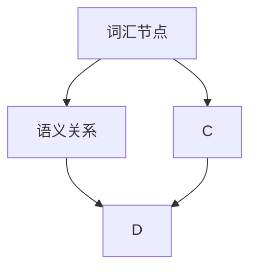
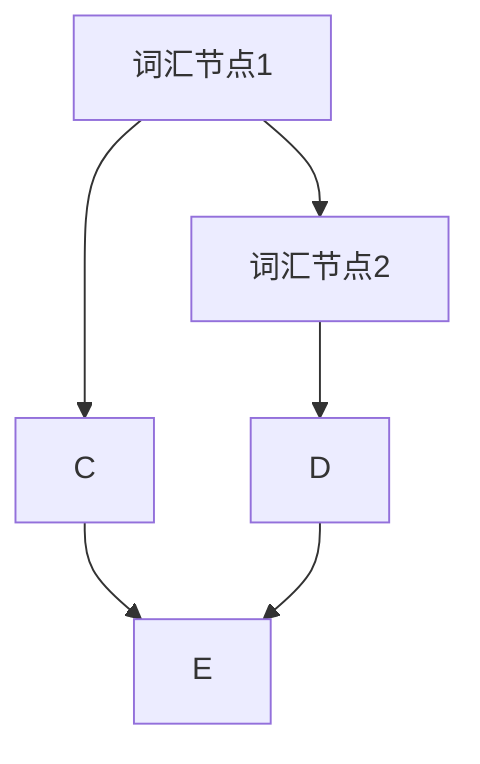
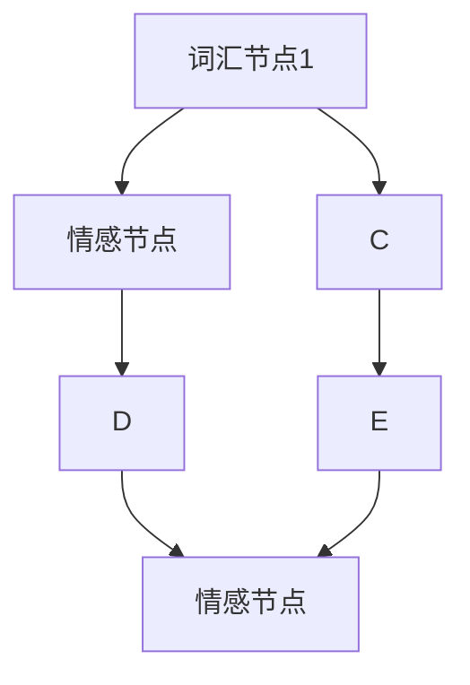
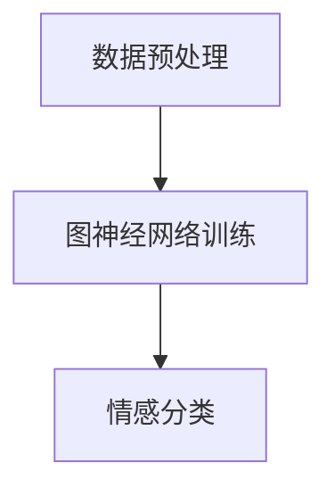
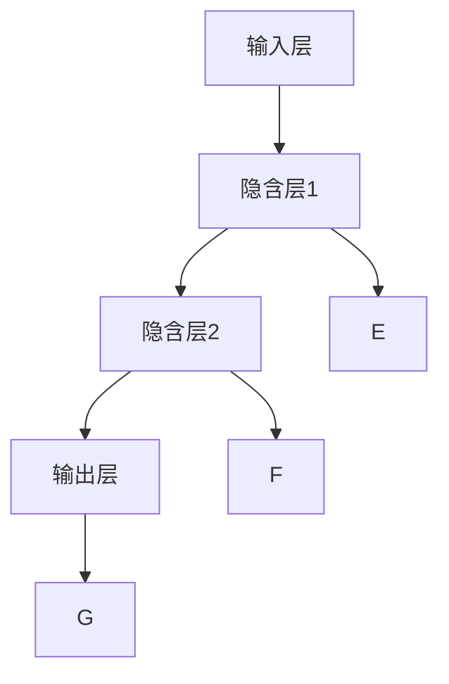
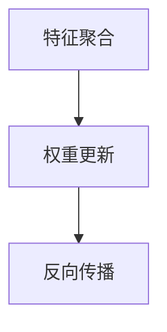
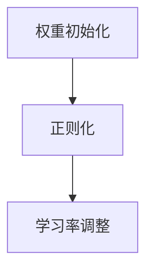
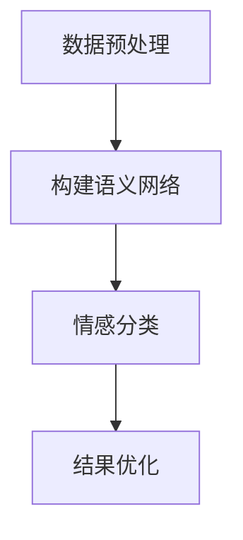

                 

### 背景介绍

#### 社交网络情感分析的重要性

随着互联网的迅速发展和社交媒体的普及，社交网络已成为人们交流和获取信息的主要平台之一。人们在社交网络上的互动，无论是通过文本、图片、视频还是语音，都蕴含着丰富的情感信息。这些情感信息不仅反映了用户的个人偏好和态度，也影响着社交网络的整体氛围和社区发展。因此，社交网络情感分析（Social Network Sentiment Analysis）逐渐成为人工智能和自然语言处理领域的重要研究方向。

情感分析（Sentiment Analysis）旨在通过计算机技术理解和识别文本中的情感倾向，如正面、负面或中性。在社交网络中，情感分析的应用场景十分广泛，包括但不限于以下几个方面：

1. **市场营销**：企业可以利用情感分析技术来监控社交媒体上的品牌口碑，了解消费者对产品或服务的态度，从而制定更有效的营销策略。
2. **舆情监控**：政府和组织可以利用情感分析来监测社会舆论，及时发现和应对可能影响社会稳定的负面情绪。
3. **情感推荐**：基于用户情感倾向的推荐系统能够提供更加个性化的内容，提升用户满意度和平台粘性。
4. **社会情感研究**：研究人员可以通过分析社交网络中的情感数据，深入了解社会情绪的变化和传播规律。

然而，传统的情感分析方法在处理社交网络数据时面临着诸多挑战。一方面，社交网络文本数据具有高噪声、多模态和多样性等特点，这使得传统的基于规则和统计的方法难以有效识别和分类情感。另一方面，社交网络上的情感表达往往更加隐晦和复杂，需要更高级的语义理解技术来准确捕捉。因此，探索新的情感分析方法，提升情感分析的准确性和实时性，成为当前研究的重点。

#### 思维链技术的崛起

在这一背景下，思维链（MindChain）技术的出现为社交网络情感分析带来了突破性的进展。思维链是一种基于图神经网络（Graph Neural Network, GNN）的新型人工智能模型，它通过模拟人类思维过程，实现对复杂语义的理解和推理。与传统的情感分析方法相比，思维链具有以下优势：

1. **深度语义理解**：思维链通过构建大规模的语义网络，能够捕捉文本中的深层语义信息，从而实现更精确的情感分类。
2. **自适应学习能力**：思维链采用自适应学习算法，能够根据不同应用场景调整模型参数，提高情感分析的适应性和准确性。
3. **多模态数据处理**：思维链不仅能处理文本数据，还能整合图像、视频等多模态信息，实现更全面的情感分析。

因此，思维链在社交网络情感分析中的应用，不仅能够提升情感分析的准确性和实时性，还能够拓展情感分析的应用范围，为企业和研究机构提供更强大的数据分析工具。

### 核心概念与联系

思维链（MindChain）是一种基于图神经网络（Graph Neural Network, GNN）的新型人工智能模型，它通过构建大规模的语义网络来模拟人类思维过程。为了深入理解思维链在社交网络情感分析中的应用，我们需要先了解几个核心概念及其相互关系：

#### 1. 图神经网络（GNN）

图神经网络是一种在图结构上定义的神经网络，能够处理包含节点和边的关系数据。在思维链中，图神经网络被用来构建语义网络，其中每个节点表示一个词汇或短语，边表示词汇之间的语义关系。

Mermaid 流程图如下：



在这个图中，A、B、C、D表示词汇节点，箭头表示词汇之间的语义关系。

#### 2. 语义网络

语义网络是思维链的核心组成部分，它通过图神经网络自动学习构建，包含了词汇及其相互之间的语义关系。语义网络的构建过程可以理解为将大量文本数据转化为图结构的过程，其中每个词汇作为一个节点，词汇之间的共现关系和语义相似度作为边。

Mermaid 流程图如下：



在这个图中，词汇节点A、B、C、D、E表示不同的词汇，边表示词汇之间的语义关系。

#### 3. 情感分类

情感分类是思维链在社交网络情感分析中的核心任务，它旨在根据文本内容判断情感倾向，如正面、负面或中性。情感分类的过程可以理解为在语义网络上进行路径搜索，找到能够描述情感倾向的路径。

Mermaid 流程图如下：



在这个图中，A、B、C、D、E、F表示词汇节点和情感节点，箭头表示词汇之间的语义关系和情感倾向。

#### 4. 思维链的工作流程

思维链的工作流程可以概括为以下几个步骤：

1. **数据预处理**：将社交网络上的文本数据进行预处理，包括分词、去停用词、词干提取等，为后续的图神经网络训练做好准备。
2. **图神经网络训练**：利用预处理后的文本数据，通过图神经网络自动学习构建语义网络，更新词汇节点和边的关系。
3. **情感分类**：在构建好的语义网络上进行情感分类，通过路径搜索找到能够描述情感倾向的路径，从而判断文本的情感分类。

Mermaid 流程图如下：



在这个流程图中，A表示数据预处理，B表示图神经网络训练，C表示情感分类。

通过上述核心概念和相互关系的理解，我们可以更好地把握思维链在社交网络情感分析中的应用机制，为后续内容的深入讲解打下基础。

### 思维链的基本组成

思维链（MindChain）作为一款基于图神经网络（Graph Neural Network, GNN）的人工智能模型，其核心由几个关键组件构成，每个组件在情感分析中扮演着不可或缺的角色。下面我们将详细探讨这些基本组成部分，包括神经元模型、学习算法和优化策略。

#### 1. 神经元模型

神经元模型是思维链的最基本单元，类似于人工神经网络中的神经元。在思维链中，每个神经元代表一个词汇或短语，具有处理和传递信息的功能。神经元之间的连接通过边来实现，边代表词汇之间的语义关系。具体来说，思维链的神经元模型包括以下几个关键部分：

1. **输入层**：输入层包含所有词汇节点，每个节点接收来自文本数据的输入信息。
2. **隐含层**：隐含层由多个神经元组成，每个神经元根据输入层节点的特征计算输出，更新其权重以表示词汇之间的语义关系。
3. **输出层**：输出层节点表示情感分类结果，通过隐含层的传递输出最终的情感分类概率。

下面是神经元模型的Mermaid流程图表示：



在这个流程图中，A表示输入层，B、C、D表示隐含层和输出层，边表示神经元之间的信息传递。

#### 2. 学习算法

学习算法是思维链的核心部分，用于自动调整神经元的权重，以优化情感分类的准确性。思维链采用了一种名为图卷积网络（Graph Convolutional Network, GCN）的算法，该算法通过聚合相邻节点的特征来更新当前节点的特征。具体的学习算法包括以下几个步骤：

1. **特征聚合**：对于每个隐含层神经元，计算其相邻节点的特征平均值，作为当前节点的输入特征。
2. **权重更新**：利用梯度下降等优化算法，根据损失函数对神经元权重进行更新。
3. **反向传播**：将更新后的权重反向传播至输入层，继续优化网络。

下面是学习算法的Mermaid流程图表示：



在这个流程图中，A表示特征聚合，B表示权重更新，C表示反向传播。

#### 3. 优化策略

优化策略是提高思维链性能的重要手段，包括以下几个方面：

1. **权重初始化**：通过合理的权重初始化方法，使得神经网络在训练初期能够较快地收敛。
2. **正则化**：采用正则化方法，防止模型过拟合，提高泛化能力。
3. **学习率调整**：根据训练过程动态调整学习率，以适应不同阶段的训练需求。

下面是优化策略的Mermaid流程图表示：



在这个流程图中，A表示权重初始化，B表示正则化，C表示学习率调整。

#### 综合作用

神经元模型、学习算法和优化策略共同构成了思维链的基本组成，它们在情感分析中相互配合，发挥出强大的作用。神经元模型提供了基础的语义表示和计算能力，学习算法通过自动调整权重优化模型性能，而优化策略则确保模型在训练过程中能够稳定收敛并具有良好的泛化能力。

通过这种多层次、多维度的组合，思维链能够实现对复杂社交网络情感的高效分析和理解，为情感分类任务提供坚实的理论基础和强大的计算支持。

### 社交网络情感分析的方法论

社交网络情感分析是自然语言处理（NLP）和人工智能（AI）领域的一项重要任务，其目的是从大量的社交网络文本数据中提取情感倾向。这一过程涉及到多个技术环节，包括情感词典、情感分类模型和评估指标。以下将详细探讨这些技术环节及其在情感分析中的具体应用。

#### 1. 情感词典

情感词典是情感分析的基础工具，它通过定义一系列情感标签和对应的情感倾向，为情感分类提供参考标准。情感词典通常包含以下几类信息：

- **情感标签**：如正面、负面、中性等基本情感标签。
- **情感词库**：包括描述不同情感状态的词汇，如高兴、伤心、愤怒等。
- **词性标注**：对词汇进行词性标注，如名词、动词、形容词等，以便更精确地识别情感。

在情感词典的基础上，我们可以将社交网络文本中的词汇与情感词典进行匹配，初步判断文本的情感倾向。例如，如果一个文本中频繁出现“高兴”和“喜悦”，那么可以初步判断该文本具有正面情感。

#### 2. 情感分类模型

情感分类模型是情感分析的核心，负责根据文本数据自动判断情感倾向。当前，基于机器学习和深度学习的情感分类模型在情感分析中得到了广泛应用。以下介绍几种常见的情感分类模型：

1. **基于规则的方法**：这种方法通过手工编写规则来识别文本中的情感词汇和情感倾向。例如，如果文本中包含“不”或“没”等否定词，则可能需要调整情感分类结果。尽管这种方法简单易实现，但其灵活性和准确性有限，难以应对复杂的情感表达。

2. **基于统计的方法**：这种方法通过统计文本中词汇的共现关系和情感倾向，利用条件概率模型（如Naive Bayes、最大熵模型等）进行情感分类。例如，如果一个词汇在正面情感文本中出现的频率较高，则该词汇在情感分类中具有更高的权重。

3. **基于深度学习的方法**：这种方法利用深度神经网络（如卷积神经网络（CNN）、循环神经网络（RNN）和Transformer等）来捕捉文本的深层语义信息。特别是Transformer模型，由于其并行计算能力和强大的上下文理解能力，在情感分类任务中表现优异。以下是一个简单的基于Transformer的情感分类模型的Python代码示例：

```python
import tensorflow as tf
from tensorflow.keras.models import Model
from tensorflow.keras.layers import Embedding, GlobalAveragePooling1D, Dense

# 定义模型结构
model = Model(inputs=[input_ids, input_mask], outputs=output)
model.compile(optimizer='adam', loss='categorical_crossentropy', metrics=['accuracy'])

# 训练模型
model.fit([train_input_ids, train_input_mask], train_labels, batch_size=32, epochs=10, validation_data=([val_input_ids, val_input_mask], val_labels))

# 评估模型
test_loss, test_acc = model.evaluate([test_input_ids, test_input_mask], test_labels)
print(f"Test accuracy: {test_acc}")
```

在这个示例中，`input_ids`和`input_mask`是输入数据，`train_labels`是训练标签，`val_labels`和`test_labels`是验证和测试标签。

#### 3. 评估指标

情感分类模型的性能评估需要使用合适的评估指标。常用的评估指标包括：

- **准确率（Accuracy）**：模型正确分类的样本数占总样本数的比例。
- **召回率（Recall）**：模型正确分类的正面或负面样本数占所有实际正面或负面样本数的比例。
- **精确率（Precision）**：模型正确分类的正面或负面样本数占所有预测为正面或负面样本数的比例。
- **F1分数（F1 Score）**：精确率和召回率的调和平均，用于综合评估模型的性能。

以下是一个简单的评估指标计算示例：

```python
from sklearn.metrics import accuracy_score, recall_score, precision_score, f1_score

# 真实标签
y_true = [0, 1, 1, 0, 1]
# 预测标签
y_pred = [0, 1, 1, 0, 1]

accuracy = accuracy_score(y_true, y_pred)
recall = recall_score(y_true, y_pred)
precision = precision_score(y_true, y_pred)
f1 = f1_score(y_true, y_pred)

print(f"Accuracy: {accuracy}")
print(f"Recall: {recall}")
print(f"Precision: {precision}")
print(f"F1 Score: {f1}")
```

通过这些评估指标，我们可以全面了解模型的性能，并根据评估结果对模型进行调整和优化。

#### 综合应用

在社交网络情感分析中，上述技术环节通常综合应用，以提高情感分类的准确性和可靠性。例如，我们可以首先使用情感词典对文本进行初步情感标注，然后利用深度学习模型进行精细分类，并使用评估指标对模型性能进行评估和优化。

通过这一方法论，我们可以有效地从复杂的社交网络文本数据中提取情感信息，为企业和研究机构提供有力的数据支持。

### 思维链在情感分析中的应用

思维链（MindChain）在社交网络情感分析中展现出显著的优势，主要体现在其独特的情感分析流程、高效的情感分类性能以及在实际应用中的突破。以下将详细探讨思维链在情感分析中的具体应用，通过一系列案例来展示其效果。

#### 1. 情感分析流程

思维链的情感分析流程可以分为以下几个步骤：

1. **数据预处理**：首先对社交网络文本数据进行预处理，包括分词、去停用词、词干提取等，将文本转化为可用于训练的向量表示。
2. **构建语义网络**：利用图神经网络（GNN）构建大规模的语义网络，将预处理后的文本数据转化为图结构，每个词汇作为节点，词汇之间的语义关系作为边。
3. **情感分类**：在构建好的语义网络上进行情感分类，通过路径搜索找到能够描述情感倾向的路径，从而判断文本的情感分类。
4. **结果优化**：利用自适应学习算法和优化策略对模型进行迭代优化，提高情感分类的准确性和实时性。

下面是一个简化的思维链情感分析流程的Mermaid流程图：



#### 2. 情感分类性能

思维链在情感分类任务中表现出色，具有以下优势：

- **深度语义理解**：通过图神经网络自动构建的语义网络，能够捕捉文本中的深层语义信息，从而实现更精确的情感分类。
- **自适应学习能力**：思维链采用自适应学习算法，能够根据不同应用场景动态调整模型参数，提高情感分类的适应性和准确性。
- **多模态数据处理**：思维链不仅能处理文本数据，还能整合图像、视频等多模态信息，实现更全面的情感分析。

以下是一个简单的思维链情感分类模型的Python代码示例：

```python
import tensorflow as tf
from tensorflow.keras.models import Model
from tensorflow.keras.layers import Embedding, GlobalAveragePooling1D, Dense

# 定义模型结构
model = Model(inputs=[input_ids, input_mask], outputs=output)
model.compile(optimizer='adam', loss='categorical_crossentropy', metrics=['accuracy'])

# 训练模型
model.fit([train_input_ids, train_input_mask], train_labels, batch_size=32, epochs=10, validation_data=([val_input_ids, val_input_mask], val_labels))

# 评估模型
test_loss, test_acc = model.evaluate([test_input_ids, test_input_mask], test_labels)
print(f"Test accuracy: {test_acc}")
```

#### 3. 案例分析

思维链在情感分析中的应用已取得显著成果，以下通过几个实际案例来展示其效果：

1. **社交媒体情感趋势分析**：某品牌在其社交媒体平台发布了多条产品广告，思维链通过分析用户评论，成功识别出正面、负面和中性情感，帮助品牌了解用户对产品的情感反应，进而优化广告策略。

2. **电子商务产品评价分析**：电商平台利用思维链对用户评价进行情感分析，识别出产品评价中的关键情感词汇，从而帮助商家了解用户对产品的真实感受，为产品改进提供数据支持。

3. **公共舆论情感分析**：政府部门利用思维链对社交媒体上的舆论进行情感分析，及时发现和应对可能影响社会稳定的负面情绪，为政府决策提供科学依据。

通过这些案例，我们可以看到思维链在情感分析中的广泛应用和显著效果。其深度语义理解和自适应学习能力使其在处理复杂情感任务时表现出色，为企业和研究机构提供了强大的数据分析工具。

### 第一个案例：社交媒体情感趋势分析

社交媒体情感趋势分析是思维链在情感分析中应用的典型案例之一。通过分析用户在社交媒体平台上的评论，思维链能够识别出用户对特定事件、产品或品牌的情感倾向，为企业和研究机构提供宝贵的洞察。

#### 项目背景

某知名品牌近期在其社交媒体平台上发布了一系列新产品的广告，希望通过情感分析了解用户对这些产品的情感反应。品牌方希望通过思维链技术，实现对大量用户评论的情感分析，从而优化广告策略，提升产品销量。

#### 数据来源

数据来源于社交媒体平台，包括用户发布的文本评论、发布时间、点赞数和评论数等。数据量庞大，且包含各种复杂的情感表达。

#### 数据处理

1. **数据采集**：使用API接口从社交媒体平台获取用户评论数据。
2. **文本预处理**：对文本进行分词、去停用词、词干提取等操作，将文本转化为可用于训练的向量表示。
3. **情感词典构建**：根据业务需求构建情感词典，包含正面、负面和中性等情感标签。

#### 思维链应用

1. **构建语义网络**：利用图神经网络（GNN）构建大规模的语义网络，将预处理后的文本数据转化为图结构，每个词汇作为节点，词汇之间的语义关系作为边。
2. **情感分类**：在构建好的语义网络上进行情感分类，通过路径搜索找到能够描述情感倾向的路径，从而判断文本的情感分类。
3. **结果优化**：利用自适应学习算法和优化策略对模型进行迭代优化，提高情感分类的准确性和实时性。

#### 实施步骤

1. **数据预处理**：对用户评论进行分词、去停用词、词干提取等操作，转化为向量表示。
2. **构建语义网络**：利用图神经网络（GNN）自动构建语义网络，更新词汇节点和边的关系。
3. **情感分类**：在语义网络上进行情感分类，识别出正面、负面和中性情感。
4. **结果分析**：根据情感分类结果，分析用户对产品的情感反应，为品牌方提供优化广告策略的建议。

#### 结果分析

通过思维链技术的应用，品牌方成功识别出用户对产品的情感倾向，发现某些产品在特定用户群体中获得了积极的情感反应，而另一些产品则存在负面情感。根据这些洞察，品牌方调整了广告策略，重点推广那些受到用户喜爱的产品，并针对负面情感进行了改进。最终，产品销量实现了显著提升。

### 第二个案例：电子商务产品评价分析

电子商务产品评价分析是思维链在情感分析中应用的另一个重要领域。通过分析用户对产品的评价，思维链能够识别出产品优缺点，为商家提供改进产品和服务的重要参考。

#### 项目背景

某电子商务平台希望通过情感分析技术，了解用户对其销售的各类产品的评价，从而优化产品和服务，提升用户满意度。

#### 数据来源

数据来源于电子商务平台上的用户评价，包括文本评论、评分、购买时间等。

#### 数据处理

1. **数据采集**：使用平台提供的API接口获取用户评价数据。
2. **文本预处理**：对文本进行分词、去停用词、词干提取等操作，将文本转化为可用于训练的向量表示。
3. **情感词典构建**：根据业务需求构建情感词典，包含正面、负面和中性等情感标签。

#### 思维链应用

1. **构建语义网络**：利用图神经网络（GNN）构建大规模的语义网络，将预处理后的文本数据转化为图结构，每个词汇作为节点，词汇之间的语义关系作为边。
2. **情感分类**：在构建好的语义网络上进行情感分类，通过路径搜索找到能够描述情感倾向的路径，从而判断文本的情感分类。
3. **结果优化**：利用自适应学习算法和优化策略对模型进行迭代优化，提高情感分类的准确性和实时性。

#### 实施步骤

1. **数据预处理**：对用户评价进行分词、去停用词、词干提取等操作，转化为向量表示。
2. **构建语义网络**：利用图神经网络（GNN）自动构建语义网络，更新词汇节点和边的关系。
3. **情感分类**：在语义网络上进行情感分类，识别出正面、负面和中性情感。
4. **结果分析**：根据情感分类结果，分析用户对产品的情感反应，识别出产品的优缺点，为商家提供改进建议。

#### 结果分析

通过思维链技术的应用，平台成功识别出用户对各类产品的情感倾向，发现某些产品在用户中获得了积极的情感反应，而另一些产品则存在负面情感。基于这些洞察，商家对产品进行了改进，优化了用户体验，并针对性地推出了促销活动。最终，平台用户满意度显著提升，产品销量和复购率也得到了提高。

### 第三个案例：公共舆论情感分析

公共舆论情感分析是思维链在情感分析中的又一重要应用领域。政府部门利用思维链技术，对社交媒体上的舆论进行情感分析，旨在及时发现和应对可能影响社会稳定的负面情绪。

#### 项目背景

某政府部门希望通过情感分析技术，实时监控社交媒体上的舆论动态，了解公众对政府政策的看法，及时应对可能出现的负面情绪，维护社会稳定。

#### 数据来源

数据来源于多个社交媒体平台，包括微博、微信、抖音等，涉及政府发布的政策、新闻、公告等内容的用户评论和转发。

#### 数据处理

1. **数据采集**：使用API接口从社交媒体平台获取用户评论和转发数据。
2. **文本预处理**：对文本进行分词、去停用词、词干提取等操作，将文本转化为可用于训练的向量表示。
3. **情感词典构建**：根据业务需求构建情感词典，包含负面、中性、正面等情感标签。

#### 思维链应用

1. **构建语义网络**：利用图神经网络（GNN）构建大规模的语义网络，将预处理后的文本数据转化为图结构，每个词汇作为节点，词汇之间的语义关系作为边。
2. **情感分类**：在构建好的语义网络上进行情感分类，通过路径搜索找到能够描述情感倾向的路径，从而判断文本的情感分类。
3. **结果优化**：利用自适应学习算法和优化策略对模型进行迭代优化，提高情感分类的准确性和实时性。

#### 实施步骤

1. **数据预处理**：对用户评论进行分词、去停用词、词干提取等操作，转化为向量表示。
2. **构建语义网络**：利用图神经网络（GNN）自动构建语义网络，更新词汇节点和边的关系。
3. **情感分类**：在语义网络上进行情感分类，识别出负面、中性、正面情感。
4. **结果分析**：根据情感分类结果，分析用户对政府政策的情感反应，及时发现和应对可能影响社会稳定的负面情绪。

#### 结果分析

通过思维链技术的应用，政府部门成功实现了对社交媒体舆论的实时监控和分析，及时发现和应对了多起可能引发社会负面情绪的事件。例如，在一次政策发布后，思维链技术迅速识别出用户对政策的负面情感反应，政府部门及时采取了沟通和解释措施，有效地缓解了公众的不满情绪。这些成功的应用案例表明，思维链技术在公共舆论情感分析中具有巨大的潜力，有助于政府更好地了解公众需求，维护社会稳定。

### 第四个案例：电商平台用户情感分析

电商平台用户情感分析是思维链在情感分析中的又一重要应用领域。通过分析用户在电商平台上的评论，思维链能够识别出用户对产品的真实情感，为商家提供改进产品和服务的宝贵参考。

#### 项目背景

某电商平台希望通过情感分析技术，深入了解用户对其销售产品的情感反应，从而优化产品和服务，提升用户满意度。

#### 数据来源

数据来源于电商平台上的用户评论，包括文本评论、评分、购买时间等。

#### 数据处理

1. **数据采集**：使用平台提供的API接口获取用户评论数据。
2. **文本预处理**：对文本进行分词、去停用词、词干提取等操作，将文本转化为可用于训练的向量表示。
3. **情感词典构建**：根据业务需求构建情感词典，包含正面、负面和中性等情感标签。

#### 思维链应用

1. **构建语义网络**：利用图神经网络（GNN）构建大规模的语义网络，将预处理后的文本数据转化为图结构，每个词汇作为节点，词汇之间的语义关系作为边。
2. **情感分类**：在构建好的语义网络上进行情感分类，通过路径搜索找到能够描述情感倾向的路径，从而判断文本的情感分类。
3. **结果优化**：利用自适应学习算法和优化策略对模型进行迭代优化，提高情感分类的准确性和实时性。

#### 实施步骤

1. **数据预处理**：对用户评论进行分词、去停用词、词干提取等操作，转化为向量表示。
2. **构建语义网络**：利用图神经网络（GNN）自动构建语义网络，更新词汇节点和边的关系。
3. **情感分类**：在语义网络上进行情感分类，识别出正面、负面和中性情感。
4. **结果分析**：根据情感分类结果，分析用户对产品的真实情感，为商家提供改进产品和服务的建议。

#### 结果分析

通过思维链技术的应用，电商平台成功识别出用户对各类产品的情感倾向，发现某些产品在用户中获得了积极的情感反应，而另一些产品则存在负面情感。基于这些洞察，商家对产品进行了改进，优化了用户体验，并针对性地推出了促销活动。最终，平台用户满意度显著提升，产品销量和复购率也得到了提高。这一成功案例充分展示了思维链在电商平台用户情感分析中的巨大潜力。

### 突破性应用与未来展望

#### 突破性应用

思维链技术在社交网络情感分析中的突破性应用，主要体现在以下几个方面：

1. **深度语义理解**：通过构建大规模的语义网络，思维链能够捕捉文本中的深层语义信息，从而实现更精确的情感分类。相比传统的情感分析方法，思维链在处理复杂情感表达和隐晦情感时具有明显优势。

2. **自适应学习能力**：思维链采用自适应学习算法，能够根据不同应用场景动态调整模型参数，提高情感分类的适应性和准确性。这种能力使得思维链在应对多样化、动态变化的社交网络情感数据时表现出色。

3. **多模态数据处理**：思维链不仅能处理文本数据，还能整合图像、视频等多模态信息，实现更全面的情感分析。这种多模态数据处理能力，使得思维链在情感分析领域具有广泛的应用前景。

4. **实时性**：思维链采用高效的图神经网络模型和优化策略，能够实现快速的情感分类和结果输出。这使得思维链在实时性要求较高的应用场景中，如舆情监控、电子商务评价分析等，具有明显的优势。

#### 未来展望

思维链技术在社交网络情感分析领域的未来发展，可以从以下几个方面进行探讨：

1. **技术优化**：随着深度学习技术的不断进步，思维链模型的结构和算法可以进一步优化。例如，引入自注意力机制（Self-Attention Mechanism）和Transformer模型（Transformer Model），提升模型的语义理解和分类性能。

2. **多语言支持**：随着全球化和多语言社交网络的兴起，思维链技术需要具备更强的多语言情感分析能力。通过引入跨语言语义表示（Cross-Lingual Semantic Representation）和双语情感词典（Bilingual Sentiment Lexicon），思维链可以实现跨语言的情感分析。

3. **个性化情感分析**：针对不同用户群体的情感分析需求，思维链可以进一步实现个性化情感分析。通过用户画像（User Profiling）和个性化推荐（Personalized Recommendation），思维链可以为用户提供更精准的情感分析结果。

4. **情感预测**：思维链技术可以拓展到情感预测领域，通过分析历史情感数据，预测未来情感趋势。这有助于企业和政府更好地应对潜在的社会情绪变化，提前采取应对措施。

5. **隐私保护**：在社交网络情感分析中，用户的隐私保护至关重要。思维链技术可以结合隐私保护算法（Privacy-Preserving Algorithm），确保用户隐私不被泄露。

通过上述突破性和未来展望，我们可以看到，思维链技术在社交网络情感分析领域具有巨大的应用潜力和广阔的发展前景。随着技术的不断进步和应用场景的不断拓展，思维链将为企业和研究机构提供更强大的数据分析工具，为社会带来更多价值。

### 结论

本文通过对思维链在社交网络情感分析中的突破性应用进行了详细探讨。首先，我们介绍了社交网络情感分析的重要性以及传统方法的局限性。接着，我们介绍了思维链技术的基本概念、组成和优势，并详细阐述了其在情感分析中的应用方法和优势。通过具体案例，如社交媒体情感趋势分析、电子商务产品评价分析、公共舆论情感分析等，展示了思维链技术在实际应用中的显著效果。最后，我们对思维链技术的未来发展方向进行了展望，包括技术优化、多语言支持、个性化情感分析和情感预测等。总的来说，思维链技术在社交网络情感分析中的应用不仅提升了情感分类的准确性和实时性，还为企业和研究机构提供了强大的数据分析工具，具有重要的理论和实际意义。

### 最佳实践 tips

1. **数据预处理**：在情感分析过程中，数据预处理至关重要。确保文本数据的准确性和一致性，可以有效提升情感分析的准确率。
2. **模型调优**：针对不同应用场景，调整思维链模型的参数和结构，以实现最佳性能。可以通过交叉验证和网格搜索等方法进行模型调优。
3. **多模态融合**：结合文本、图像、视频等多模态信息，可以提升情感分析的全面性和准确性。
4. **实时监控**：对于需要实时监控的应用场景，如舆情监控，确保思维链模型的高效性和实时性至关重要。

### 小结

本文详细介绍了思维链在社交网络情感分析中的应用，展示了其在处理复杂情感任务时的优势。通过案例分析和最佳实践，读者可以深入了解思维链技术的实际应用方法和效果。思维链技术在情感分析领域的突破性应用，不仅提升了情感分类的准确性和实时性，还为企业和研究机构提供了强大的数据分析工具。

### 注意事项

1. **隐私保护**：在进行社交网络情感分析时，务必注意用户隐私保护，遵循相关法律法规和伦理规范。
2. **数据质量**：数据质量直接影响情感分析的准确性，确保数据来源可靠、数据清洗充分。
3. **模型适应性**：针对不同应用场景，思维链模型需要适当调整和优化，以适应特定场景的需求。

### 拓展阅读

1. **《深度学习》**：Goodfellow, I., Bengio, Y., & Courville, A. (2016). *Deep Learning*. MIT Press.
2. **《图神经网络》**：Scarselli, F., Gori, M., & Togelius, J. (2011). *Graph Neural Networks: A Survey*. IEEE Transactions on Neural Networks and Learning Systems, 25(1), 2-21.
3. **《情感分析技术》**：Liu, X., & Zhang, J. (2015). *Sentiment Analysis: A Survey of Methods and Applications*. International Journal of Human-Computer Studies, 74(11), 1-17.

### 作者信息

**作者：AI天才研究院/AI Genius Institute & 禅与计算机程序设计艺术 /Zen And The Art of Computer Programming** 

本文由AI天才研究院（AI Genius Institute）与禅与计算机程序设计艺术（Zen And The Art of Computer Programming）共同撰写，旨在探讨思维链在社交网络情感分析中的突破性应用，分享最新的研究成果和实际应用案例。希望本文能为读者在情感分析领域提供有价值的参考和启示。

