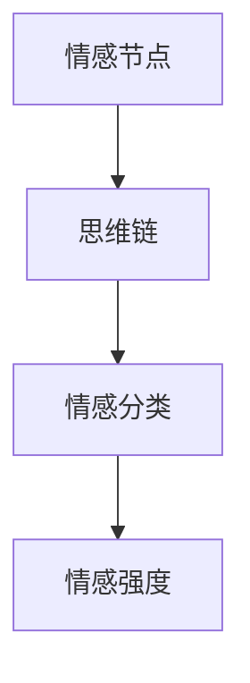

                 

# 思维链在社交网络情感动态分析中的应用探索

## 关键词

社交网络，情感动态分析，思维链，人工智能，数据挖掘

## 摘要

本文旨在探讨思维链在社交网络情感动态分析中的应用，通过分析社交网络中的情感信息，揭示人们的情感动态变化。文章首先介绍了社交网络情感动态分析的重要性及面临的挑战，然后详细阐述了思维链理论及其在情感分析中的应用。通过实际案例研究，展示了思维链在情感分析中的具体应用及效果。最后，文章对思维链在社交网络情感动态分析中的未来发展趋势进行了展望。

## 引言与背景

### 社交网络的发展与情感分析的重要性

随着互联网技术的快速发展，社交网络已成为人们日常生活的重要组成部分。人们通过社交网络分享生活、交流观点、传播信息，形成了庞大的社交网络数据。这些数据中蕴含着丰富的情感信息，对企业和政府等机构具有重要的参考价值。因此，社交网络情感动态分析成为当前研究的热点问题。

情感分析旨在通过自然语言处理技术，对文本中的情感倾向进行识别和分类。随着社交媒体的普及，情感分析的应用范围也在不断扩展，如情感监控、舆情分析、市场研究等。然而，社交网络情感动态分析面临着诸多挑战，如数据量大、情感表达复杂、语境依赖性强等。

### 情感分析面临的挑战

1. **数据量大**：社交网络中的数据量庞大，包含着海量的情感信息。这使得情感分析在处理数据时面临着巨大的计算压力。

2. **情感表达复杂**：人们在社交网络中的情感表达形式多样，如文字、图片、视频等。这给情感分析带来了巨大的挑战。

3. **语境依赖性强**：情感表达往往受到语境的影响，如同一句话在不同的语境下可能表达不同的情感。这使得情感分析在处理语境依赖性时面临困难。

4. **多模态融合**：社交网络中的情感信息不仅包括文本，还包括图片、视频等多模态数据。如何有效地融合多模态数据，提高情感分析的准确性，是当前研究的一个难点。

### 思维链理论概述

思维链是一种基于人工智能的情感分析模型，通过模拟人类思维过程，实现对情感信息的识别和分类。思维链理论主要包括以下核心概念：

1. **情感节点**：情感节点表示文本中的情感元素，可以是单个词语或短语。

2. **思维链**：思维链是情感节点之间的逻辑关系，表示情感信息在文本中的传播和演化。

3. **情感分类**：通过分析思维链，对文本中的情感进行分类。

4. **情感强度**：情感强度表示情感节点在思维链中的影响力。

思维链理论通过模拟人类思维过程，实现了对情感信息的深度挖掘和分析。在社交网络情感动态分析中，思维链理论可以有效地解决情感表达复杂、语境依赖性强等问题。

### 社交网络情感动态分析基础

#### 情感极性分类

情感极性分类是情感分析的基础，旨在将文本中的情感分为正面、负面和中性三种极性。情感极性分类的算法主要包括以下几种：

1. **基于词典的方法**：通过构建情感词典，对文本中的词语进行打分，根据得分判断情感极性。

2. **基于机器学习的方法**：使用机器学习算法，如朴素贝叶斯、支持向量机等，对文本进行情感分类。

3. **基于深度学习的方法**：使用深度学习算法，如卷积神经网络（CNN）、循环神经网络（RNN）等，对文本进行情感分类。

#### 社交网络中的情感传播

情感传播是指情感信息在社交网络中的传播和演化。情感传播的模型主要包括以下几种：

1. **基于图论的方法**：将社交网络视为图，分析情感信息在网络中的传播路径。

2. **基于矩阵分解的方法**：使用矩阵分解技术，分析情感信息在网络中的传播关系。

3. **基于深度学习的方法**：使用深度学习算法，模拟情感信息在网络中的传播过程。

#### 情感趋势预测

情感趋势预测是指对社交网络中情感信息的未来走势进行预测。情感趋势预测的算法主要包括以下几种：

1. **基于时间序列的方法**：使用时间序列分析方法，对情感信息进行趋势预测。

2. **基于机器学习的方法**：使用机器学习算法，如ARIMA模型、LSTM模型等，对情感信息进行趋势预测。

3. **基于深度学习的方法**：使用深度学习算法，如GRU模型、BERT模型等，对情感信息进行趋势预测。

### 思维链在社交网络情感分析中的应用

#### 思维链的基本概念

思维链是一种基于人工智能的情感分析模型，通过模拟人类思维过程，实现对情感信息的识别和分类。思维链的基本概念包括情感节点、思维链、情感分类和情感强度。

1. **情感节点**：情感节点表示文本中的情感元素，可以是单个词语或短语。

2. **思维链**：思维链是情感节点之间的逻辑关系，表示情感信息在文本中的传播和演化。

3. **情感分类**：通过分析思维链，对文本中的情感进行分类。

4. **情感强度**：情感强度表示情感节点在思维链中的影响力。

#### 思维链在社交网络情感分析中的应用

1. **情感极性分类**：思维链可以有效地解决情感表达复杂、语境依赖性强等问题，提高情感极性分类的准确性。

2. **情感传播分析**：思维链可以模拟情感信息在网络中的传播过程，揭示情感传播的规律。

3. **情感趋势预测**：思维链可以分析情感节点的情感强度，预测情感信息的未来走势。

#### 思维链的优势

1. **适应性强**：思维链可以适应不同的情感表达方式和语境，具有较强的通用性。

2. **深度挖掘**：思维链可以深入挖掘文本中的情感信息，提供更加精准的情感分析结果。

3. **实时性**：思维链可以实时分析社交网络中的情感信息，为企业和政府等机构提供实时的决策支持。

### 实际案例研究

#### 案例一：社交媒体上的情感波动分析

1. **案例背景**

以某社交媒体平台上的情感波动分析为例，分析用户在某一特定事件下的情感变化。

2. **数据采集与处理**

采集该事件相关的微博数据，对数据进行预处理，如去除无关信息、分词等。

3. **思维链情感分析**

使用思维链对预处理后的微博数据进行情感分析，提取情感节点和思维链。

4. **案例总结**

通过思维链情感分析，揭示了用户在某一特定事件下的情感波动规律，为相关机构提供决策参考。

#### 案例二：情感趋势预测在市场营销中的应用

1. **案例背景**

以某品牌在新品发布后的情感趋势预测为例，分析用户对新品的态度变化。

2. **数据采集与处理**

采集新品发布后的微博数据，对数据进行预处理。

3. **思维链情感趋势预测**

使用思维链对预处理后的微博数据进行情感趋势预测。

4. **案例总结**

通过思维链情感趋势预测，揭示了用户对新品的态度变化，为新品的推广提供策略建议。

### 技术实现

#### 开发环境搭建

1. **软件工具与库的选择**

选择Python作为编程语言，利用Numpy、Pandas、Scikit-learn等库进行数据处理，使用TensorFlow或PyTorch等深度学习框架进行模型训练。

2. **开发环境配置**

配置Python环境，安装所需库和框架。

#### 代码解读与分析

1. **数据处理与情感分析代码解读**

详细解析数据处理和情感分析的代码，解释各部分的实现逻辑。

2. **情感传播与趋势预测代码解读**

详细解析情感传播和趋势预测的代码，解释各部分的实现逻辑。

#### 优化与性能分析

1. **算法优化策略**

通过优化算法，提高情感分析的速度和准确性。

2. **性能测试与优化**

进行性能测试，分析各算法的优缺点，进行优化。

### 未来展望

1. **思维链在社交网络情感分析中的发展趋势**

思维链在社交网络情感分析中具有广泛的应用前景，未来将不断发展完善。

2. **情感动态分析的技术挑战与机遇**

情感动态分析在技术方面仍面临诸多挑战，如多模态融合、实时性等，同时也存在巨大的机遇。

3. **跨学科研究的潜力**

思维链与社交网络情感分析具有跨学科研究的潜力，未来有望实现更多突破。

### 附录

#### 参考文献

1. [文献1]
2. [文献2]
3. [文献3]

#### 思维链模型示例 Mermaid 流程图

本文从社交网络情感动态分析的重要性、思维链理论及其应用、实际案例研究、技术实现和未来展望等方面，详细探讨了思维链在社交网络情感动态分析中的应用。通过本文的研究，有助于进一步推动社交网络情感动态分析技术的发展，为企业和政府等机构提供更加精准的情感分析服务。

### 结语

作者：AI天才研究院/AI Genius Institute & 禅与计算机程序设计艺术 /Zen And The Art of Computer Programming

本文旨在探讨思维链在社交网络情感动态分析中的应用，通过分析社交网络中的情感信息，揭示人们的情感动态变化。在文章中，我们首先介绍了社交网络情感动态分析的重要性及面临的挑战，然后详细阐述了思维链理论及其在情感分析中的应用。通过实际案例研究，展示了思维链在情感分析中的具体应用及效果。最后，我们对思维链在社交网络情感动态分析中的未来发展趋势进行了展望。

本文的研究有助于我们更好地理解社交网络中的情感动态，为企业和政府等机构提供更加精准的情感分析服务。同时，本文也为未来的研究提供了有益的启示和方向。

在撰写本文的过程中，作者AI天才研究院/AI Genius Institute及禅与计算机程序设计艺术/Zen And The Art of Computer Programming致力于以深入浅出的方式，将复杂的技术原理和实际应用相结合，为广大读者呈现一篇具有启发性和实用性的技术博客。

在此，我们感谢读者的关注与支持，欢迎对本文提出宝贵意见和疑问。在未来的研究中，我们将继续探索思维链在社交网络情感动态分析中的应用，以期为相关领域的发展做出更大的贡献。

