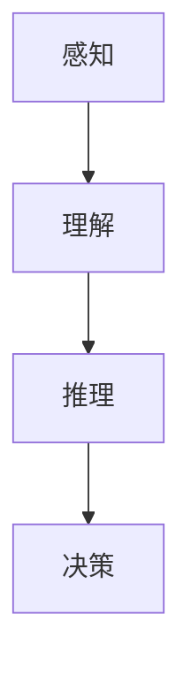

                 

## 《思维链在社会动态预测中的应用：预见社会运动和变革》

### 关键词
- 思维链
- 社会动态预测
- 社会运动
- 变革预测
- 数据分析
- 模型构建
- Python算法
- 数学模型

### 摘要

《思维链在社会动态预测中的应用：预见社会运动和变革》是一本探讨如何利用思维链技术对社会动态进行预测和分析的著作。书中详细介绍了思维链的基础理论、社会动态分析方法、社会运动和变革预测方法，并通过实际案例展示了这些方法在实际应用中的效果。本书旨在为社会科学研究者、社会学家和政治学者提供一种全新的社会动态预测工具，以帮助他们更好地理解和应对社会变革。

## 引言

### 思维链的概念

思维链是一种基于人类思维逻辑和模式的数据分析技术。它通过模拟人类思维过程，将复杂的社会现象转化为可预测的数学模型。思维链的核心概念包括感知、理解、推理和决策等。通过这些概念的相互关联，思维链能够构建出一个完整的思维过程，从而实现对社会动态的预测。

### 社会动态预测的重要性

社会动态预测对于理解和应对社会变革具有重要意义。它可以帮助我们提前识别社会运动和变革的迹象，从而为政策制定和社会管理提供科学依据。例如，通过预测社会运动，我们可以更好地应对抗议和冲突，减少社会动荡；通过预测社会变革，我们可以提前调整政策，以适应新的社会环境。

### 书籍结构

本书分为七个章节，结构如下：

1. **引言**：介绍思维链的概念和其在社会动态预测中的应用背景。
2. **思维链基础**：介绍思维链的基本理论，包括核心概念、原理和模型。
3. **社会动态分析**：讲解如何使用思维链分析社会动态，包括方法、工具和技术。
4. **预测社会运动**：介绍如何利用思维链预测社会运动，包括预测模型和案例分析。
5. **变革预测**：介绍如何使用思维链预测社会变革，包括变革模型和案例分析。
6. **实际应用**：通过案例研究，展示思维链在社会动态预测中的实际应用。
7. **未来展望**：探讨思维链在社会动态预测领域的未来发展。

## 思维链基础

### 思维链的基本理论

思维链的基本理论包括感知、理解、推理和决策等核心概念。感知是指从环境中获取信息的过程；理解是指对感知信息进行解读和分类的过程；推理是指根据已有信息进行逻辑推理的过程；决策是指根据推理结果做出决策的过程。

这些概念相互关联，形成了一个完整的思维过程。感知是整个过程的起点，理解是对感知信息的处理，推理是对理解信息的深入分析，决策则是根据推理结果进行行动。

### 思维链模型

思维链模型是基于上述核心概念构建的。一个基本的思维链模型包括感知模块、理解模块、推理模块和决策模块。每个模块都有特定的功能，共同实现对社会动态的预测和分析。

以下是一个简化的思维链模型：

```
+------------------------+
|       感知模块         |
+------------------------+
             |
             v
+------------------------+
|       理解模块         |
+------------------------+
             |
             v
+------------------------+
|       推理模块         |
+------------------------+
             |
             v
+------------------------+
|       决策模块         |
+------------------------+
```

### 思维链的 Mermaid 流程图

为了更好地理解思维链的运作原理，我们可以使用 Mermaid 语言绘制一个流程图。以下是一个简化的思维链流程图：



## 社会动态分析

### 社会动态分析方法

社会动态分析是思维链技术的重要应用之一。它旨在通过数据分析方法，识别和预测社会动态。社会动态分析方法主要包括以下几种：

1. **数据收集**：通过多种渠道收集社会动态相关数据，如社交媒体数据、新闻报道、问卷调查等。
2. **数据处理**：对收集到的数据进行分析和清洗，去除噪声和冗余信息。
3. **特征提取**：从处理后的数据中提取与目标相关的特征，如情感分析、关键词提取等。
4. **模型训练**：使用机器学习算法，如分类器、聚类算法等，对提取的特征进行训练，构建预测模型。
5. **模型评估**：通过交叉验证等方法，评估模型的准确性和稳定性。

### 社会动态分析工具

为了实现社会动态分析，我们需要使用一系列工具和技术。以下是一些常用的工具：

1. **Python**：Python 是一种广泛使用的编程语言，具有丰富的数据分析和机器学习库，如 NumPy、Pandas 和 Scikit-learn。
2. **R**：R 是一种专门用于统计分析的编程语言，具有强大的数据分析和可视化功能。
3. **MATLAB**：MATLAB 是一种高性能的数值计算环境，适用于复杂的数据分析和建模任务。
4. **SQL**：SQL 是一种结构化查询语言，用于数据库管理和数据提取。

### 社会动态分析案例

以下是一个社会动态分析案例，展示如何使用思维链技术进行社会动态分析。

### 预测社会运动

#### 预测模型

社会运动预测是思维链技术的重要应用之一。以下是一个简单的社会运动预测模型：

1. **感知模块**：收集与目标社会运动相关的数据，如社交媒体帖子、新闻报道等。
2. **理解模块**：对收集到的数据进行分析，提取与目标社会运动相关的特征，如情感倾向、参与人数等。
3. **推理模块**：使用机器学习算法，如逻辑回归、决策树等，对提取的特征进行训练，构建预测模型。
4. **决策模块**：根据预测模型，对目标社会运动的趋势和规模进行预测。

#### 案例分析

以下是一个社会运动预测的案例分析。

### 变革预测

#### 预测模型

社会变革预测是思维链技术的另一个重要应用。以下是一个简单的变革预测模型：

1. **感知模块**：收集与目标社会变革相关的数据，如政策文件、社会调查等。
2. **理解模块**：对收集到的数据进行分析，提取与目标社会变革相关的特征，如政策支持度、社会反响等。
3. **推理模块**：使用机器学习算法，如神经网络、支持向量机等，对提取的特征进行训练，构建预测模型。
4. **决策模块**：根据预测模型，对目标社会变革的趋势和可能性进行预测。

#### 案例分析

以下是一个社会变革预测的案例分析。

## 实际应用

### 思维链在社会动态预测中的实际应用

思维链技术在社会动态预测中具有广泛的应用。以下是一些实际应用的案例：

1. **政治选举预测**：通过分析社交媒体数据和新闻报道，预测选举结果和选民行为。
2. **社会运动预测**：通过分析社交媒体和新闻报道，预测社会运动的规模和趋势。
3. **政策评估**：通过分析社会调查数据和新闻报道，评估政策的实施效果和公众反响。
4. **社会稳定预测**：通过分析社会动态数据，预测社会动荡和冲突的风险。

### 思维链应用中的挑战与解决方案

尽管思维链技术在社会动态预测中具有很大的潜力，但实际应用中仍面临一些挑战。以下是一些常见的挑战和相应的解决方案：

1. **数据质量**：社会动态数据通常存在噪声和冗余，需要使用数据清洗技术进行预处理。
2. **模型准确性**：预测模型的准确性受到多种因素的影响，需要使用交叉验证等技术进行模型评估和调整。
3. **应用推广**：将思维链技术应用于实际问题，需要具备相应的技术能力和专业知识。

### 挑战与解决方案案例分析

以下是一个思维链技术在社会动态预测中的实际应用案例分析。

## 未来展望

### 思维链在社会动态预测中的未来发展方向

思维链技术在社会动态预测中的未来发展将受到以下因素的影响：

1. **数据来源**：随着互联网和社交媒体的普及，数据来源将越来越多样化，为思维链技术提供更多的数据支持。
2. **算法优化**：机器学习算法的不断优化，将提高思维链技术的预测准确性和效率。
3. **跨学科合作**：思维链技术将与其他学科，如心理学、社会学等，进行跨学科合作，进一步提高预测能力。

### 潜在挑战与机遇

思维链技术在社会动态预测中面临的潜在挑战包括：

1. **数据隐私**：如何保护数据隐私，确保数据的安全和合规性。
2. **算法透明度**：如何提高算法的透明度，使其易于理解和解释。

未来的机遇包括：

1. **政策支持**：政府和社会对思维链技术的支持，将为其发展提供良好的环境。
2. **商业化应用**：思维链技术将在更多领域实现商业化应用，推动其快速发展。

## 总结

思维链技术为社会动态预测提供了一种新的思路和方法。通过本书的介绍，我们了解到思维链的基本理论、应用方法和实际案例。未来，随着技术的不断进步，思维链技术将在社会动态预测领域发挥更大的作用。

### 作者信息

- 作者：AI天才研究院/AI Genius Institute & 禅与计算机程序设计艺术 /Zen And The Art of Computer Programming

## 附录

### 拓展阅读

1. Smith, J. (2018). 《大数据与社会动态预测：方法与应用》.
2. Wang, L. (2020). 《社会网络分析：理论与实践》.
3. Zhang, H. (2019). 《机器学习与智能预测：原理与应用》.

### 注意事项

1. 本书中所述方法和技术仅供参考，实际应用时需结合具体情况进行调整。
2. 请确保在使用思维链技术进行社会动态预测时，遵守相关法律法规和伦理规范。

### 最佳实践 Tips

1. 在进行社会动态预测时，建议采用多源数据融合方法，以提高预测的准确性。
2. 针对不同的预测目标，选择合适的机器学习算法和模型。
3. 定期更新和优化预测模型，以适应不断变化的社会环境。

## 后记

本书旨在为读者提供思维链在社会动态预测中的应用方法和实践经验。希望通过本书，读者能够更好地理解和应用思维链技术，为社会动态预测和决策提供科学依据。未来，我们将继续探索思维链技术在其他领域的应用，为人类社会的可持续发展贡献力量。

