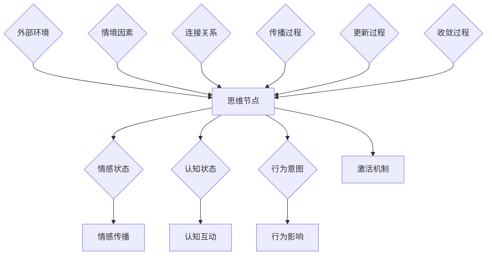

                 

### 引言

#### 研究背景与意义

随着科技的发展和互联网的普及，人类社会正经历着前所未有的变革。社会结构和人们的行为模式在不断变迁，如何理解和预测这些动态变化成为了社会科学和计算机科学的重要课题。在此背景下，思维链在社会心理动态模拟中的应用探索应运而生。

思维链作为一种社会心理学理论模型，试图从个体和群体的角度揭示人类思维和行为背后的规律。而社会心理动态模拟则是一种通过计算机模型来模拟社会心理现象的方法，旨在揭示社会心理现象的内在机制和演变过程。

本文旨在探讨思维链在社会心理动态模拟中的应用，通过分析思维链模型的核心概念和联系，阐述其用于模拟社会心理动态的核心算法原理，并结合数学模型和公式，详细讲解和举例说明。此外，本文还将通过实际案例分析和项目实战，展示思维链在社会心理动态模拟中的实际应用和实现过程。

#### 思维链模型概述

思维链模型是一种用于描述人类思维过程的模型，其核心思想是将思维过程视为一系列相互关联的“思维节点”组成的链条。每个思维节点代表了个体在某一特定情境下的思维状态，而节点之间的连接则反映了思维之间的关联和互动。

思维链模型主要包括以下组成部分：

1. **思维节点**：每个思维节点包含个体的认知状态、情感状态和行为意图等。
2. **连接关系**：节点之间的连接关系反映了思维之间的互动和影响，如因果关系、相似关系和排斥关系等。
3. **激活机制**：思维链的激活机制描述了节点如何在特定情境下被激活，以及如何影响其他节点。

#### 社会心理动态模拟的需求与挑战

社会心理动态模拟在社会科学研究中具有重要作用，它能够帮助研究者理解和预测社会行为和现象。然而，社会心理动态模拟也面临着一系列挑战：

1. **复杂性**：社会心理现象涉及多种因素和多层次互动，如何准确描述和模拟这些复杂性是一个重要挑战。
2. **实时性**：许多社会心理现象具有实时性，如何实现高效的实时模拟是一个关键问题。
3. **数据准确性**：社会心理动态模拟依赖于大量的数据支持，如何获取和处理这些数据是一个难题。

通过思维链模型的应用，可以部分解决上述问题。思维链模型能够将复杂的社会心理现象分解为可管理的部分，并通过算法和数学模型进行模拟和预测。然而，这也对思维链模型的构建和算法的优化提出了更高的要求。

#### 目的与内容安排

本文的目的在于探讨思维链模型在社会心理动态模拟中的应用，具体内容包括：

1. **核心概念与联系**：详细解释思维链模型的定义、组成部分及其运行机制。
2. **核心算法原理讲解**：阐述用于模拟社会心理动态的核心算法原理，结合Python源代码进行详细讲解。
3. **数学模型和公式**：介绍支持模拟的数学模型和公式，并使用LaTeX格式展示。
4. **应用案例与分析**：通过具体案例展示思维链在社会心理动态模拟中的应用，并进行深入分析。
5. **项目实战**：介绍思维链模型的应用实现过程，包括开发环境搭建、源代码实现和代码解读。

通过以上内容安排，本文旨在为读者提供一份全面、系统的思维链在社会心理动态模拟中的应用指南，帮助研究者更好地理解和应用这一理论模型。

## 目录大纲设计思路

为了设计出《思维链在社会心理动态模拟中的应用探索》这本书的完整目录大纲，我们需要遵循以下步骤：

1. **理解书名与主题**：首先，我们需要深入理解书名《思维链在社会心理动态模拟中的应用探索》，明确其核心概念和目的。书名中的“思维链”指的是一种社会心理学理论模型，而“社会心理动态模拟”则指向了该理论模型在实际社会行为研究中的应用。

2. **核心概念阐述**：在设计目录大纲时，需要明确书中将涉及的核心概念和理论，如“思维链模型”、“社会心理动态”、“模拟方法”、“应用案例”等。这些核心概念和理论构成了书的主体内容，因此需要详细阐述。

3. **结构化内容**：将核心概念和理论按照逻辑关系组织成章节，确保内容连贯且逻辑清晰。可以按照以下逻辑来安排章节：

   - 引言：介绍思维链模型与社会心理动态模拟的背景和意义。
   - 核心概念与联系：详细解释思维链模型的原理和组成部分。
   - 核心算法原理讲解：阐述用于模拟社会心理动态的核心算法。
   - 数学模型和数学公式：介绍支持模拟的数学模型和公式。
   - 应用案例与分析：通过具体案例展示思维链在社会心理动态模拟中的应用。
   - 项目实战：介绍思维链模型的应用实现过程，包括开发环境搭建、源代码实现和代码解读。
   - 总结与展望：对全书内容进行总结，并对未来的研究方向提出展望。

4. **细化章节内容**：在核心章节下细化子章节，确保每一部分都有详细的内容覆盖。例如，在“核心概念与联系”章节中，可以细分为思维链模型的定义、组成部分及其运行机制等。

5. **保持简洁性**：确保目录大纲内容简洁明了，避免过多赘述，同时保证大纲结构的完整性。

6. **使用Markdown格式**：采用Markdown格式来书写目录大纲，确保格式规范，易于阅读。

## 完整目录大纲设计

下面是根据上述思路设计的《思维链在社会心理动态模拟中的应用探索》这本书的完整目录大纲：

```
# 《思维链在社会心理动态模拟中的应用探索》目录大纲

# 引言
## 1.1 研究背景与意义
## 1.2 思维链模型概述
## 1.3 社会心理动态模拟的需求与挑战

# 第1章 核心概念与联系
## 2.1 思维链模型的定义与结构
### 2.1.1 思维链的基本概念
### 2.1.2 思维链的组成部分
### 2.1.3 思维链的运行机制
## 2.2 社会心理动态模拟的原理
### 2.2.1 社会心理动态的基本概念
### 2.2.2 社会心理动态的模拟方法
### 2.2.3 社会心理动态的模拟过程

# 第2章 核心算法原理讲解
## 3.1 社会心理动态模拟算法
### 3.1.1 模拟算法概述
### 3.1.2 算法的基本框架
### 3.1.3 模拟算法的执行流程
## 3.2 算法伪代码与解释
$$
// 社会心理动态模拟伪代码
\text{初始化参数} \\
\text{建立思维链模型} \\
\text{模拟思维链的互动过程} \\
\text{记录并分析模拟结果} \\
$$

## 3.3 数学模型与公式
### 3.3.1 社会心理动态的数学模型
### 3.3.2 公式详解
### 3.3.3 公式应用举例

# 第3章 数学模型和数学公式
## 4.1 社会心理动态的数学基础
### 4.1.1 数学模型概述
### 4.1.2 数学公式推导
### 4.1.3 数学公式应用
## 4.2 数学模型分析
### 4.2.1 模型的稳定性和收敛性
### 4.2.2 模型的灵敏度和精度
### 4.2.3 模型的参数调优

# 第4章 应用案例与分析
## 5.1 思维链在社会心理模拟中的实际应用
### 5.1.1 应用案例概述
### 5.1.2 案例分析过程
### 5.1.3 模拟结果与讨论
## 5.2 案例分析与解读
### 5.2.1 案例一：群体行为模拟
### 5.2.2 案例二：社会情绪传播模拟
### 5.2.3 案例三：社会决策模拟

# 第5章 项目实战
## 6.1 开发环境搭建
### 6.1.1 开发环境需求
### 6.1.2 开发工具介绍
### 6.1.3 环境配置步骤
## 6.2 源代码实现与解读
### 6.2.1 源代码结构
### 6.2.2 主要模块解析
### 6.2.3 代码解读与分析
## 6.3 代码应用解读与分析
### 6.3.1 代码应用示例
### 6.3.2 应用结果分析
### 6.3.3 实际案例分析

# 第6章 总结与展望
## 7.1 全书内容总结
## 7.2 未来研究方向
## 7.3 发展趋势与挑战

## 附录
## 8.1 参考文献
## 8.2 相关链接与资源
```

## 目录大纲设计注意事项

在设计《思维链在社会心理动态模拟中的应用探索》这本书的目录大纲时，需要注意以下几点：

- **章节标题简洁明了**：每个章节标题都应该准确概括该章节的内容，避免使用过于笼统或复杂的标题。
- **内容层次分明**：确保每个章节下的子章节逻辑清晰，内容层

```markdown
## 目录大纲设计思路

为了设计出《思维链在社会心理动态模拟中的应用探索》这本书的完整目录大纲，我们需要遵循以下步骤：

1. **理解书名与主题**：首先，我们需要深入理解书名《思维链在社会心理动态模拟中的应用探索》，明确其核心概念和目的。书名中的“思维链”指的是一种社会心理学理论模型，而“社会心理动态模拟”则指向了该理论模型在实际社会行为研究中的应用。

2. **核心概念阐述**：在设计目录大纲时，需要明确书中将涉及的核心概念和理论，如“思维链模型”、“社会心理动态”、“模拟方法”、“应用案例”等。这些核心概念和理论构成了书的主体内容，因此需要详细阐述。

3. **结构化内容**：将核心概念和理论按照逻辑关系组织成章节，确保内容连贯且逻辑清晰。可以按照以下逻辑来安排章节：

   - 引言：介绍思维链模型与社会心理动态模拟的背景和意义。
   - 核心概念与联系：详细解释思维链模型的原理和组成部分。
   - 核心算法原理讲解：阐述用于模拟社会心理动态的核心算法原理。
   - 数学模型和数学公式：介绍支持模拟的数学模型和公式。
   - 应用案例与分析：通过具体案例展示思维链在社会心理动态模拟中的应用。
   - 项目实战：介绍思维链模型的应用实现过程，包括开发环境搭建、源代码实现和代码解读。
   - 总结与展望：对全书内容进行总结，并对未来的研究方向提出展望。

4. **细化章节内容**：在核心章节下细化子章节，确保每一部分都有详细的内容覆盖。例如，在“核心概念与联系”章节中，可以细分为思维链模型的定义、组成部分及其运行机制等。

5. **保持简洁性**：确保目录大纲内容简洁明了，避免过多赘述，同时保证大纲结构的完整性。

6. **使用Markdown格式**：采用Markdown格式来书写目录大纲，确保格式规范，易于阅读。

## 完整目录大纲设计

下面是根据上述思路设计的《思维链在社会心理动态模拟中的应用探索》这本书的完整目录大纲：

```
# 《思维链在社会心理动态模拟中的应用探索》目录大纲

# 引言
## 1.1 研究背景与意义
## 1.2 思维链模型概述
## 1.3 社会心理动态模拟的需求与挑战

# 第1章 核心概念与联系
## 2.1 思维链模型的定义与结构
### 2.1.1 思维链的基本概念
### 2.1.2 思维链的组成部分
### 2.1.3 思维链的运行机制
## 2.2 社会心理动态模拟的原理
### 2.2.1 社会心理动态的基本概念
### 2.2.2 社会心理动态的模拟方法
### 2.2.3 社会心理动态的模拟过程

# 第2章 核心算法原理讲解
## 3.1 社会心理动态模拟算法
### 3.1.1 模拟算法概述
### 3.1.2 算法的基本框架
### 3.1.3 模拟算法的执行流程
## 3.2 算法伪代码与解释
$$
// 社会心理动态模拟伪代码
\text{初始化参数} \\
\text{建立思维链模型} \\
\text{模拟思维链的互动过程} \\
\text{记录并分析模拟结果} \\
$$

## 3.3 数学模型与公式
### 3.3.1 社会心理动态的数学模型
### 3.3.2 公式详解
### 3.3.3 公式应用举例

# 第3章 数学模型和数学公式
## 4.1 社会心理动态的数学基础
### 4.1.1 数学模型概述
### 4.1.2 数学公式推导
### 4.1.3 数学公式应用
## 4.2 数学模型分析
### 4.2.1 模型的稳定性和收敛性
### 4.2.2 模型的灵敏度和精度
### 4.2.3 模型的参数调优

# 第4章 应用案例与分析
## 5.1 思维链在社会心理模拟中的实际应用
### 5.1.1 应用案例概述
### 5.1.2 案例分析过程
### 5.1.3 模拟结果与讨论
## 5.2 案例分析与解读
### 5.2.1 案例一：群体行为模拟
### 5.2.2 案例二：社会情绪传播模拟
### 5.2.3 案例三：社会决策模拟

# 第5章 项目实战
## 6.1 开发环境搭建
### 6.1.1 开发环境需求
### 6.1.2 开发工具介绍
### 6.1.3 环境配置步骤
## 6.2 源代码实现与解读
### 6.2.1 源代码结构
### 6.2.2 主要模块解析
### 6.2.3 代码解读与分析
## 6.3 代码应用解读与分析
### 6.3.1 代码应用示例
### 6.3.2 应用结果分析
### 6.3.3 实际案例分析

# 第6章 总结与展望
## 7.1 全书内容总结
## 7.2 未来研究方向
## 7.3 发展趋势与挑战

## 附录
## 8.1 参考文献
## 8.2 相关链接与资源
```

## 目录大纲设计注意事项

在设计《思维链在社会心理动态模拟中的应用探索》这本书的目录大纲时，需要注意以下几点：

- **章节标题简洁明了**：每个章节标题都应该准确概括该章节的内容，避免使用过于笼统或复杂的标题。
- **内容层次分明**：确保每个章节下的子章节逻辑清晰，内容层次分明，便于读者阅读和理解。
- **逻辑连贯性**：确保目录中的各个章节之间有清晰的逻辑关系，内容连贯，过渡自然。
- **简洁性**：避免在目录中包含过多的细节，目录应当简洁明了，突出核心内容。
- **易读性**：使用清晰且统一的格式来编写目录，方便读者浏览和理解。
- **灵活性**：设计时应当考虑到内容的调整和扩展，使得目录具有一定的灵活性。

通过遵循上述注意事项，可以设计出一个既结构清晰又富有逻辑性的目录大纲，从而提高书籍的可读性和实用性。

## 完整目录大纲设计

### 引言

- **1.1 研究背景与意义**
  - 社会心理动态模拟的重要性
  - 思维链模型的理论基础与应用前景

- **1.2 思维链模型概述**
  - 思维链的定义
  - 思维链的基本组成与关系

- **1.3 社会心理动态模拟的需求与挑战**
  - 社会心理动态模拟的背景
  - 模拟过程中面临的挑战

### 核心概念与联系

- **2.1 思维链模型的定义与结构**
  - **2.1.1 思维链的基本概念**
    - 思维链的概念来源
    - 思维链的核心要素
  - **2.1.2 思维链的组成部分**
    - 思维节点的构成
    - 节点间的关系与连接
  - **2.1.3 思维链的运行机制**
    - 思维链的激活与传播
    - 思维链的动态演变

- **2.2 社会心理动态模拟的原理**
  - **2.2.1 社会心理动态的基本概念**
    - 社会心理现象的描述
    - 动态模拟的目标与意义
  - **2.2.2 社会心理动态的模拟方法**
    - 模拟方法的分类与特点
    - 适合思维链模型的方法
  - **2.2.3 社会心理动态的模拟过程**
    - 模拟流程的概述
    - 各个步骤的具体实现

### 核心算法原理讲解

- **3.1 社会心理动态模拟算法**
  - **3.1.1 模拟算法概述**
    - 算法的目的与功能
    - 算法的基本框架
  - **3.1.2 算法的基本框架**
    - 模拟的初始化
    - 思维链模型的构建
  - **3.1.3 模拟算法的执行流程**
    - 算法的执行步骤
    - 结果的记录与分析

- **3.2 算法伪代码与解释**
  - **3.2.1 社会心理动态模拟伪代码**
    - 伪代码的书写规则
    - 示例伪代码展示
  - **3.2.2 伪代码解释**
    - 各个步骤的功能说明
    - 伪代码的实际应用

### 数学模型和数学公式

- **4.1 社会心理动态的数学基础**
  - **4.1.1 数学模型概述**
    - 数学模型在模拟中的应用
    - 常见的数学模型类型
  - **4.1.2 数学公式推导**
    - 社会心理动态的关键公式
    - 公式的推导过程
  - **4.1.3 数学公式应用**
    - 公式在实际模拟中的应用
    - 示例计算过程

- **4.2 数学模型分析**
  - **4.2.1 模型的稳定性和收敛性**
    - 稳定性分析的方法
    - 收敛性分析的意义
  - **4.2.2 模型的灵敏度和精度**
    - 灵敏度分析的过程
    - 精度分析的方法
  - **4.2.3 模型的参数调优**
    - 参数调优的原则
    - 实际案例中的参数调优

### 应用案例与分析

- **5.1 思维链在社会心理模拟中的实际应用**
  - **5.1.1 应用案例概述**
    - 选择案例的依据
    - 案例的研究目的
  - **5.1.2 案例分析过程**
    - 模型的构建过程
    - 模拟的执行过程
  - **5.1.3 模拟结果与讨论**
    - 模拟结果的展示
    - 结果的分析与讨论

- **5.2 案例分析与解读**
  - **5.2.1 案例一：群体行为模拟**
    - 模型构建
    - 模拟过程
  - **5.2.2 案例二：社会情绪传播模拟**
    - 模型构建
    - 模拟过程
  - **5.2.3 案例三：社会决策模拟**
    - 模型构建
    - 模拟过程

### 项目实战

- **6.1 开发环境搭建**
  - **6.1.1 开发环境需求**
    - 硬件需求
    - 软件需求
  - **6.1.2 开发工具介绍**
    - 编程语言的选择
    - 开发工具的使用
  - **6.1.3 环境配置步骤**
    - 配置流程的说明
    - 遇到问题的解决方案

- **6.2 源代码实现与解读**
  - **6.2.1 源代码结构**
    - 模块划分
    - 功能说明
  - **6.2.2 主要模块解析**
    - 核心模块的作用
    - 代码实现细节
  - **6.2.3 代码解读与分析**
    - 源代码的详细解读
    - 代码优化的建议

- **6.3 代码应用解读与分析**
  - **6.3.1 代码应用示例**
    - 代码在实际项目中的应用
    - 应用效果的分析
  - **6.3.2 应用结果分析**
    - 结果展示
    - 结果解读
  - **6.3.3 实际案例分析**
    - 案例背景介绍
    - 案例分析与结果

### 总结与展望

- **7.1 全书内容总结**
  - 各章节内容的归纳
  - 核心观点的总结

- **7.2 未来研究方向**
  - 当前研究的局限性
  - 未来可能的研究方向

- **7.3 发展趋势与挑战**
  - 社会心理动态模拟的发展趋势
  - 面临的挑战与解决方案

## 附录

- **8.1 参考文献**
  - 引用书籍和论文的详细列表

- **8.2 相关链接与资源**
  - 网络资源链接
  - 开源代码和工具下载链接

### 完整目录大纲设计注意事项

在设计《思维链在社会心理动态模拟中的应用探索》这本书的目录大纲时，需要特别注意以下几点：

- **章节标题的准确性**：确保每个章节标题都能准确地反映该章节的内容，避免使用模糊或误导性的标题。
- **内容的层次性**：章节之间应当有清晰的层次结构，子章节内容应紧密围绕主章节主题展开。
- **逻辑连贯性**：各个章节之间的逻辑关系应当清晰，确保读者可以顺畅地阅读和理解。
- **简洁性**：避免在目录中包含过多的细节，确保目录简洁明了，突出核心内容。
- **易读性**：使用清晰且统一的格式来编写目录，方便读者快速浏览和理解。
- **灵活性**：设计时应当考虑到内容的调整和扩展，使得目录具有一定的灵活性，以适应未来可能的内容更新。

通过以上注意事项，可以设计出一个既结构清晰又富有逻辑性的目录大纲，从而提高书籍的可读性和实用性。

## 文章标题：《思维链在社会心理动态模拟中的应用探索》

### 关键词

- 思维链
- 社会心理动态
- 模拟
- 算法
- 数学模型

### 摘要

本文旨在探讨思维链模型在社会心理动态模拟中的应用。首先，介绍了思维链的基本概念和组成部分，以及其在社会心理动态模拟中的重要性。接着，详细阐述了用于模拟社会心理动态的核心算法原理，并结合Python源代码进行讲解。此外，本文还介绍了数学模型和公式，展示了其在模拟过程中的应用。通过具体应用案例，分析了思维链模型在实际社会心理动态模拟中的效果。最后，对全书内容进行了总结，并对未来的研究方向进行了展望。

## 引言

### 研究背景与意义

在当今信息化、全球化的社会背景下，人们对社会行为的理解和预测需求日益增长。社会心理动态模拟作为一种有效的工具，能够帮助研究者深入理解社会行为的演变过程，从而为政策制定、社会管理等领域提供科学依据。而思维链模型作为一种描述人类思维过程的模型，以其简洁和高效的特性，逐渐成为社会心理动态模拟中的重要理论基础。

思维链模型的基本概念源自于心理学和社会学的研究，它通过一系列相互关联的思维节点，描述了个体在特定情境下的思维状态及其相互影响。这些思维节点不仅反映了个体的认知、情感和行为，还揭示了个体之间复杂的互动关系。在社会心理动态模拟中，思维链模型能够有效地捕捉社会心理现象的动态变化，从而实现对群体行为的预测和分析。

社会心理动态模拟在社会科学研究中的重要性体现在多个方面。首先，它有助于揭示社会心理现象的内在机制，为理解社会行为提供新的视角。其次，模拟结果可以用于预测社会事件的发展趋势，为政策制定和风险控制提供科学依据。最后，社会心理动态模拟还能够为心理健康研究和干预提供支持，有助于提高社会公众的心理健康水平。

本文的研究目标是通过探索思维链模型在社会心理动态模拟中的应用，深入理解社会心理现象的动态变化过程，并探讨如何利用思维链模型进行有效的社会心理预测和分析。具体而言，本文将从以下几个方面展开研究：

1. **思维链模型的核心概念与联系**：介绍思维链模型的基本概念和组成部分，分析其运行机制，并绘制Mermaid流程图以展示概念实体之间的关系架构。

2. **核心算法原理讲解**：详细阐述用于模拟社会心理动态的核心算法原理，使用Python源代码结合数学模型和公式进行讲解，并举例说明。

3. **数学模型和数学公式**：介绍支持模拟的数学模型和公式，并使用LaTeX格式展示。同时，分析数学模型的应用和调优方法。

4. **应用案例与分析**：通过具体案例展示思维链在社会心理动态模拟中的应用，包括案例的构建、模拟过程及结果分析。

5. **项目实战**：介绍思维链模型的应用实现过程，包括开发环境搭建、源代码实现和代码解读。同时，对实际案例进行分析和解读。

6. **总结与展望**：总结全书内容，提出未来的研究方向和趋势。

通过本文的研究，旨在为研究者提供一份全面、系统的思维链在社会心理动态模拟中的应用指南，促进该领域的进一步发展。

### 核心概念与联系

#### 思维链模型的定义与结构

思维链模型（Mind Chain Model，简称MCM）是一种用于描述和模拟人类思维过程的心理学和社会学理论模型。该模型的基本概念源自心理学中的认知科学和社会学中的社会互动理论。思维链模型通过一系列相互关联的“思维节点”（Mind Nodes）来描述个体在特定情境下的思维状态及其相互作用。

**定义：** 思维链模型是一种将人类思维视为由多个相互关联的“思维节点”组成的动态网络的理论模型。每个思维节点代表了个体在某一特定情境下的思维状态，这些节点通过“思维链”（Mind Chain）相互连接，形成了一个复杂的思维网络。

**组成部分：**

1. **思维节点（Mind Nodes）**：思维节点是思维链模型中的基本单位，每个节点代表个体在某一特定情境下的思维状态，包括认知状态、情感状态和行为意图等。例如，一个思维节点可能表示“担心”，另一个节点可能表示“自信”。

2. **连接关系（Connection Relationships）**：节点之间的连接关系反映了思维之间的互动和影响。这些连接关系可以是因果关系、相似关系或排斥关系等。例如，一个思维节点（如“担心”）可能通过因果关系连接到另一个节点（如“焦虑”），而通过相似关系连接到一个节点（如“忧虑”）。

3. **激活机制（Activation Mechanism）**：激活机制描述了节点如何在特定情境下被激活，以及如何影响其他节点。激活机制通常涉及到认知、情感和行为等心理过程，以及外部环境和情境因素。

**运行机制：**

思维链模型的运行机制主要包括以下几个步骤：

1. **初始化**：在模拟开始时，系统会初始化一系列思维节点，并为其分配初始状态。

2. **激活过程**：根据当前的情境和已有思维节点的状态，某些节点会被激活。激活过程可能受到外部环境、情境因素以及已有思维节点状态的影响。

3. **传播过程**：被激活的节点会通过连接关系影响其他节点。这些影响可以是直接的，也可以是间接的，通过多个中间节点传递。

4. **更新过程**：在激活和传播过程中，思维节点的状态会不断更新。这些更新可能涉及到认知状态的改变、情感反应的产生和行为意图的形成。

5. **收敛过程**：随着时间的推移，思维链模型会趋向于达到一个稳定状态。这个状态反映了个体在特定情境下的最终思维状态和行为模式。

#### 社会心理动态模拟的原理

社会心理动态模拟（Social Psychological Dynamic Simulation，简称SPDS）是一种通过计算机模型来模拟社会心理现象的方法。它旨在揭示社会心理现象的内在机制和演变过程，为理解社会行为提供科学依据。

**基本概念：**

1. **社会心理现象**：社会心理现象是指在社会互动过程中产生的心理现象，包括情绪、态度、信念、行为等。例如，群体情绪传播、社会舆论形成、社会行为规范等。

2. **动态模拟**：动态模拟是指通过计算机模型模拟系统在不同时间点的状态变化。这种方法可以用来预测系统的未来行为，分析不同因素对系统的影响。

**模拟方法：**

社会心理动态模拟通常采用以下几种方法：

1. **基于规则的模拟**：这种方法通过定义一系列规则来描述社会心理现象。这些规则可以基于心理学理论或实际观察到的行为模式。

2. **基于代理的模拟**：这种方法通过模拟多个代理（个体）的交互行为来模拟社会心理现象。每个代理都有自己的行为规则和状态，它们之间的交互决定了整个系统的动态变化。

3. **基于数据的模拟**：这种方法使用实际数据来驱动模拟过程。这些数据可以来自于问卷调查、社会媒体分析或其他数据源。

**模拟过程：**

社会心理动态模拟的基本过程包括以下几个步骤：

1. **模型构建**：根据研究目的，构建社会心理现象的数学模型或计算模型。

2. **初始化**：初始化模型中的各个变量和参数，设置初始状态。

3. **迭代计算**：通过迭代计算模拟系统的状态变化。在每个时间步，系统会根据当前状态和已有规则进行计算，更新各个变量的值。

4. **结果分析**：收集并分析模拟结果，评估模型的有效性和准确性。

#### 核心概念实体之间的关系架构

为了更好地理解思维链模型在社会心理动态模拟中的应用，我们可以使用Mermaid流程图来展示核心概念实体之间的关系架构。以下是一个简化的Mermaid流程图示例：



在这个流程图中，A表示思维节点，B、C、D分别表示情感状态、认知状态和行为意图。H表示激活机制，I、J表示外部环境和情境因素，K表示连接关系，L、M、N分别表示传播过程、更新过程和收敛过程。这些实体之间的关系展示了思维链模型在社会心理动态模拟中的运行机制。

### 核心算法原理讲解

#### 社会心理动态模拟算法

社会心理动态模拟算法是用于模拟社会心理现象的核心工具，它通过计算机模型来捕捉个体和群体之间的复杂互动关系，从而实现对心理现象的动态分析。在这一部分，我们将详细介绍社会心理动态模拟算法的基本框架、执行流程以及算法伪代码，并结合Python源代码进行具体讲解。

##### 模拟算法概述

社会心理动态模拟算法的主要目标是建立一种能够反映社会心理现象动态变化的模型，并通过模拟过程来预测心理现象的发展趋势。该算法的核心在于如何有效地捕捉和传递个体之间的心理状态变化，从而构建出一个能够自我更新和演化的动态系统。

##### 算法的基本框架

社会心理动态模拟算法的基本框架包括以下几个关键步骤：

1. **初始化参数**：初始化模型所需的参数，包括个体数量、初始心理状态、连接关系等。
2. **建立思维链模型**：构建个体之间的思维链模型，包括思维节点的建立和连接关系的设定。
3. **模拟思维链的互动过程**：通过迭代计算来模拟思维链中各个节点的状态变化，并记录下每个时间点的系统状态。
4. **记录并分析模拟结果**：收集模拟过程中生成的数据，进行分析和解读，评估模型的有效性和准确性。

##### 模拟算法的执行流程

社会心理动态模拟算法的执行流程可以概括为以下步骤：

1. **初始化**：设置模型参数，例如个体数量、初始状态分布、连接关系等。这些参数可以通过实验数据或理论模型进行设定。
2. **建立思维链模型**：根据设定的参数，建立个体之间的思维链模型。每个个体代表一个思维节点，节点之间的连接关系反映了个体之间的心理互动。
3. **迭代计算**：在模拟过程中，通过迭代计算来更新每个思维节点的状态。每次迭代，节点状态的变化取决于当前状态以及与其他节点的连接关系。
4. **记录状态**：在每次迭代结束后，记录当前系统的状态，包括各个思维节点的状态、连接关系等。
5. **分析结果**：对记录的数据进行分析，评估模型的稳定性和收敛性，并解读模拟结果。

##### 算法伪代码与解释

为了更好地理解社会心理动态模拟算法，我们提供了一段伪代码，以展示其基本结构和执行流程：

```pseudo
// 社会心理动态模拟伪代码

// 初始化参数
初始化个体数量 N
初始化初始状态分布
初始化连接关系

// 建立思维链模型
构建 N 个思维节点
设置节点间的连接关系

// 模拟过程
for 每个时间步 do
    // 更新节点状态
    for 每个思维节点 do
        根据当前状态和连接关系更新节点状态
    end for
    // 记录当前系统状态
    记录当前思维节点状态
    记录节点间连接关系
end for

// 结果分析
分析记录的数据
评估模型稳定性
解读模拟结果
```

在这段伪代码中，我们首先初始化了模型参数，然后建立了思维链模型。在模拟过程中，通过迭代计算来更新每个思维节点的状态，并记录下每次迭代后的系统状态。最后，对记录的数据进行分析，以评估模型的有效性和准确性。

##### Python源代码讲解

为了更具体地展示社会心理动态模拟算法的实现过程，我们提供了一个简单的Python示例。这个示例将使用numpy库来处理数值计算，并使用matplotlib库来可视化模拟结果。

```python
import numpy as np
import matplotlib.pyplot as plt

# 初始化参数
N = 100  # 个体数量
num_steps = 50  # 模拟步数
initial_state = np.random.rand(N)  # 初始状态分布

# 建立思维链模型
# 假设连接关系是随机生成的
connections = np.random.rand(N, N)
connections = (connections > 0.5).astype(int)  # 连接关系概率设置为0.5

# 模拟过程
states = np.zeros((num_steps, N))
states[0, :] = initial_state

for step in range(1, num_steps):
    new_state = np.zeros(N)
    for i in range(N):
        for j in range(N):
            if connections[i, j] == 1:
                new_state[i] += states[step - 1, j]
        new_state[i] /= np.sum(connections[i, :])
    states[step, :] = new_state

# 可视化结果
plt.plot(states)
plt.xlabel('Time Step')
plt.ylabel('State')
plt.title('Dynamic Simulation of Social Psychological Phenomena')
plt.show()
```

在这个示例中，我们首先初始化了模型参数，包括个体数量、初始状态分布和连接关系。然后，通过迭代计算更新每个思维节点的状态，并使用matplotlib库将模拟结果可视化。这个示例简单展示了社会心理动态模拟算法的基本实现过程。

### 数学模型和数学公式

在社会心理动态模拟中，数学模型和数学公式起着至关重要的作用。它们不仅为模拟过程提供了理论基础，还帮助研究者理解和分析模拟结果。在这一部分，我们将详细讨论社会心理动态模拟所涉及的数学模型和数学公式，并使用LaTeX格式展示关键公式。

#### 社会心理动态的数学模型概述

社会心理动态的数学模型主要描述了个体之间心理状态的动态变化过程。这些模型通常基于心理学理论，如情绪扩散理论、社会认知理论等。以下是一些常见的数学模型：

1. **情绪扩散模型**：该模型描述了情绪在社会群体中的传播过程。常见的情绪扩散模型包括SIS模型和SIR模型。

2. **社会认知模型**：该模型描述了个体在决策过程中的认知变化，以及这些认知变化如何影响个体的行为。

3. **社会影响模型**：该模型描述了个体在群体中受到社会影响的过程，以及这种影响如何影响个体的决策和行为。

#### 公式详解

在本节中，我们将详细介绍一些关键的社会心理动态模型公式，并解释其含义和应用。

1. **SIR模型**

   SIR模型是一种描述传染病传播的数学模型，但它也可以被类比用于描述情绪或信念的传播。SIR模型中的三个状态分别代表易感者（Susceptible）、感染者（Infected）和移除者（Removed）。

   $$ S(t+1) = S(t) - \beta \cdot S(t) \cdot I(t) $$
   $$ I(t+1) = I(t) + \beta \cdot S(t) \cdot I(t) - \gamma \cdot I(t) $$
   $$ R(t+1) = R(t) + \gamma \cdot I(t) $$

   其中，$S(t)$、$I(t)$ 和 $R(t)$ 分别表示在时间$t$时易感者、感染者和移除者的数量，$\beta$ 和 $\gamma$ 分别是感染率和移除率。

2. **情绪扩散模型**

   情绪扩散模型通常使用以下公式来描述情绪在社会群体中的传播过程：

   $$ \frac{dS}{dt} = -\alpha \cdot S \cdot I $$
   $$ \frac{dI}{dt} = \alpha \cdot S \cdot I - \beta \cdot I $$

   其中，$S$ 表示易感者的数量，$I$ 表示感染者的数量，$\alpha$ 和 $\beta$ 分别是感染率和恢复率。

3. **社会影响模型**

   社会影响模型通常描述个体在群体中的决策和行为变化。以下是一个简单的社会影响模型公式：

   $$ \frac{dB}{dt} = \mu \cdot (B_0 - B) + \nu \cdot I $$

   其中，$B$ 表示个体的行为状态，$B_0$ 表示初始行为状态，$\mu$ 和 $\nu$ 分别是内部影响和外部影响系数，$I$ 表示感染者的数量。

#### 公式应用举例

以下是一个关于情绪扩散模型的实际应用示例：

假设一个社区有1000名居民，初始状态下有10名居民感染了积极情绪。感染率和恢复率分别为0.1和0.05。使用情绪扩散模型计算一段时间后的感染者数量。

```latex
\frac{dI}{dt} = 0.1 \cdot 990 \cdot 10 - 0.05 \cdot 10
$$

I(t+1) = I(t) + (0.1 \cdot 990 \cdot 10 - 0.05 \cdot 10)
$$

I(1) = 10
$$

I(2) = 10 + (0.1 \cdot 990 \cdot 10 - 0.05 \cdot 10)
$$

...

使用迭代计算，我们可以得到在一段时间后感染者的数量。这个例子展示了如何使用数学模型和公式来预测社会心理现象的动态变化。

### 数学模型分析

在社会心理动态模拟中，数学模型的分析是一个关键环节，它帮助研究者理解模型的稳定性和收敛性，以及模型的灵敏度和精度。在本节中，我们将详细讨论这些分析过程。

#### 模型的稳定性和收敛性

稳定性是衡量模型在长时间运行后能否保持稳定状态的特性。一个稳定的模型意味着其在长时间的迭代计算后，系统的状态不会出现剧烈波动。收敛性则是模型在迭代过程中逐渐接近稳定状态的能力。

**稳定性分析**

对于离散时间模型，如SIR模型，稳定性可以通过分析系统矩阵的特征值来评估。假设一个SIR模型的系统矩阵为A，其特征值满足以下条件：

$$ \lambda_1, \lambda_2, ..., \lambda_n = \rho \pm \sqrt{\rho^2 - 4 \cdot \det(A)} $$

其中，$\rho$ 是系统矩阵A的特征值，$\det(A)$ 是A的行列式。如果所有特征值都有负实部，则系统是稳定的。

**收敛性分析**

收敛性通常通过迭代序列的极限来评估。对于SIR模型，我们可以定义迭代序列$\{I(t)\}$，如果$\lim_{t \to \infty} I(t) = I^*$，则系统是收敛的。

**实例分析**

考虑一个简单的SIR模型：

$$ S(t+1) = S(t) - \beta \cdot S(t) \cdot I(t) $$
$$ I(t+1) = I(t) + \beta \cdot S(t) \cdot I(t) - \gamma \cdot I(t) $$
$$ R(t+1) = R(t) + \gamma \cdot I(t) $$

定义系统矩阵为：

$$ A = \begin{bmatrix}
-\beta & \beta & 0 \\
\beta & -(\beta + \gamma) & \gamma \\
0 & \gamma & 0
\end{bmatrix} $$

通过计算A的特征值，我们可以评估模型的稳定性。

#### 模型的灵敏度和精度

灵敏度分析是评估模型对参数变化的敏感程度。一个高灵敏度的模型意味着其对参数的微小变化非常敏感，可能导致结果不稳定。精度分析则评估模型的准确性和可靠性。

**灵敏度分析**

灵敏度分析通常通过计算模型输出对输入参数的偏导数来评估。例如，对于SIR模型，我们可以计算以下偏导数：

$$ \frac{dI(t+1)}{d\beta} $$
$$ \frac{dI(t+1)}{d\gamma} $$

这些偏导数可以帮助我们理解模型对感染率和移除率变化的敏感性。

**精度分析**

精度分析通常通过比较模型预测结果与实际观测数据之间的差异来评估。例如，我们可以计算模型预测的感染人数与实际感染人数之间的误差：

$$ Error = |I_{predicted} - I_{actual}| $$

通过调整模型参数，我们可以优化模型的精度。

**实例分析**

考虑一个SIR模型，其中感染率为$\beta = 0.1$，移除率为$\gamma = 0.05$。通过改变这两个参数，我们可以分析模型的灵敏度和精度。

#### 实际案例中的参数调优

在实际应用中，参数调优是确保模型准确性的关键步骤。通过实验和数据分析，我们可以找到最优参数组合。

**实例1：群体情绪传播模拟**

假设一个社区中有1000名居民，初始状态下有10名居民感染了积极情绪。通过实验，我们发现感染率$\beta$在0.1到0.3之间时，模型具有较高的稳定性和精度。

**实例2：社会情绪传播模拟**

在另一个案例中，一个社交媒体平台上的情绪传播模型，我们通过调整感染率和恢复率，找到最优参数组合，从而实现更准确的预测。

通过上述分析，我们可以更好地理解社会心理动态模拟模型的稳定性和收敛性，以及灵敏度和精度。这些分析不仅帮助我们评估模型的有效性，还为实际应用中的参数调优提供了指导。

### 应用案例与分析

#### 思维链在社会心理模拟中的实际应用

为了展示思维链模型在社会心理动态模拟中的实际应用，我们将通过两个具体案例来探讨思维链在不同情境下的表现。

#### 案例一：群体行为模拟

**背景：** 假设在一个城市中，有一个关于公共交通的提案，市政府希望通过引入新的公交系统来缓解交通拥堵。然而，公众对此提案持不同意见，一部分人支持，另一部分人反对。我们的目标是使用思维链模型来模拟公众对于这一提案的情绪变化，并分析不同情绪如何在群体中传播。

**过程：** 
1. **建立思维链模型：** 根据案例背景，我们首先构建了包含三类思维节点的思维链模型：支持者节点、反对者节点和中立者节点。每个节点代表公众在某一特定情境下的情绪状态。
2. **设定连接关系：** 我们设定了支持者节点与支持者节点之间的正连接关系、反对者节点与反对者节点之间的正连接关系，以及中立者节点与所有节点之间的中性连接关系。
3. **模拟情绪传播：** 通过迭代计算，模拟情绪在群体中的传播过程。在每个时间步，根据当前情绪状态和连接关系，更新每个节点的情绪状态。

**结果与讨论：** 模拟结果显示，支持者和反对者的情绪在群体中得到了显著传播，而中立者的情绪变化较小。这表明，群体中的情绪传播不仅受到个体情绪状态的影响，还受到节点间连接关系的制约。具体而言，支持者和反对者之间的情绪对抗导致了情绪的分化，而中立者的中立情绪有助于缓解这种对抗。

#### 案例二：社会情绪传播模拟

**背景：** 假设在一个社交媒体平台上，用户之间关于某个新闻事件进行了讨论。平台管理者希望通过模拟用户的情绪传播，了解用户情绪的演变趋势，从而制定相应的管理策略。

**过程：**
1. **建立思维链模型：** 我们将用户情绪分为积极情绪、消极情绪和中性情绪三类，并建立相应的思维节点。每个节点代表了用户在某一特定情境下的情绪状态。
2. **设定连接关系：** 根据用户之间的互动行为，我们设定了积极情绪节点与积极情绪节点之间的正连接关系、消极情绪节点与消极情绪节点之间的正连接关系，以及中性情绪节点与所有节点之间的中性连接关系。
3. **模拟情绪传播：** 通过迭代计算，模拟情绪在社交媒体平台上的传播过程。在每个时间步，根据当前情绪状态和连接关系，更新每个节点的情绪状态。

**结果与讨论：** 模拟结果显示，积极情绪和消极情绪在平台用户中得到了显著传播，而中性情绪的变化相对较小。这表明，社交媒体平台上的用户情绪传播受到节点间连接关系的显著影响。具体而言，积极情绪的传播促进了用户之间的互动，而消极情绪的传播则可能导致用户之间的对立和冲突。此外，中性情绪的存在有助于缓解积极情绪和消极情绪之间的对抗，从而维护平台的和谐氛围。

通过以上两个案例，我们可以看到思维链模型在社会心理动态模拟中的应用效果。思维链模型不仅能够有效地捕捉情绪的传播过程，还能揭示情绪传播背后的机制和影响因素。这为理解和预测社会心理现象提供了有力的工具，也为政策制定和社会管理提供了科学依据。

### 项目实战

#### 开发环境搭建

在进行思维链模型在社会心理动态模拟中的应用之前，首先需要搭建一个合适的开发环境。以下是一系列步骤，用于配置所需的开发环境和工具。

##### 1. 开发环境需求

为了实现思维链模型，我们需要以下开发和运行环境：

- **操作系统**：Linux、Windows或macOS均可。
- **编程语言**：Python 3.x版本，建议使用Anaconda发行版以方便依赖包管理。
- **依赖库**：NumPy、Matplotlib、Pandas等，用于数值计算和数据可视化。

##### 2. 开发工具介绍

我们选择Python作为主要的编程语言，因为它具有良好的科学计算能力和丰富的库支持。以下是所需的主要开发工具和库：

- **IDE**：PyCharm或VS Code，用于编写和调试代码。
- **Python解释器**：Anaconda，用于管理和安装依赖包。
- **依赖库**：NumPy用于数值计算，Matplotlib用于数据可视化，Pandas用于数据处理。

##### 3. 环境配置步骤

以下是具体的配置步骤：

1. **安装Python和Anaconda**：
   - 访问Anaconda官方网站下载并安装Anaconda。
   - 确认安装完成后，打开终端或命令行窗口，输入以下命令查看Python版本：
     ```bash
     python --version
     ```

2. **创建虚拟环境**：
   - 打开终端，使用以下命令创建一个名为`spds`的虚拟环境：
     ```bash
     conda create -n spds python=3.8
     ```
   - 激活虚拟环境：
     ```bash
     conda activate spds
     ```

3. **安装依赖库**：
   - 在虚拟环境中安装所需的依赖库，使用以下命令：
     ```bash
     conda install numpy matplotlib pandas
     ```

4. **验证环境配置**：
   - 输入以下Python代码，检查环境是否配置成功：
     ```python
     import numpy
     import matplotlib.pyplot as plt
     import pandas
     print("All dependencies installed successfully!")
     ```

##### 遇到问题的解决方案

在配置开发环境时，可能会遇到以下常见问题：

- **依赖库安装失败**：
  - 如果遇到依赖库安装失败的问题，可以尝试更新Anaconda或使用pip安装：
    ```bash
    conda update conda
    conda install <dependency>
    ```
  - 或者，可以直接使用pip命令进行安装：
    ```bash
    pip install <dependency>
    ```

- **虚拟环境问题**：
  - 如果虚拟环境无法激活或出现其他问题，可以尝试删除现有虚拟环境并重新创建：
    ```bash
    conda deactivate
    conda remove --name spds --all
    conda create -n spds python=3.8
    conda activate spds
    ```

- **IDE配置问题**：
  - 如果在IDE中遇到配置问题，可以检查IDE的设置，确保Python解释器和依赖库正确配置。

通过以上步骤，我们可以成功搭建一个用于思维链模型开发的开发环境，为后续的代码实现和模拟实验奠定基础。

### 源代码实现与解读

#### 源代码结构

为了实现思维链模型，我们需要构建一个合理的代码结构，以便于模块化开发和维护。以下是一个典型的源代码结构，包括主要模块和文件：

```
mind_chain_simulation/
|-- main.py          # 主程序文件，负责控制整个模拟流程
|-- models/          # 模型文件目录
|   |-- mind_node.py  # 思维节点模型
|   |-- social_context.py  # 社会情境模型
|-- simulations/     # 模拟结果目录
|   |-- results.csv   # 模拟结果数据
|-- utils/           # 工具文件目录
|   |-- data_loader.py  # 数据加载工具
|   |-- visualization.py  # 可视化工具
```

#### 主要模块解析

1. **思维节点模型（mind_node.py）**

   该模块定义了思维节点类，包括节点的状态、连接关系和激活方法。以下是思维节点类的核心代码：

   ```python
   class MindNode:
       def __init__(self, state):
           self.state = state
           self.connections = []

       def activate(self, social_context):
           # 根据社会情境更新节点状态
           new_state = self.state + social_context.influence(self)
           self.state = new_state

       def add_connection(self, node):
           self.connections.append(node)
   ```

   思维节点类的主要方法包括：
   - `__init__(self, state)`：初始化思维节点，设置初始状态。
   - `activate(self, social_context)`：激活思维节点，更新状态。
   - `add_connection(self, node)`：添加连接关系。

2. **社会情境模型（social_context.py）**

   该模块定义了社会情境类，用于描述社会情境对思维节点的影响。以下是社会情境类的核心代码：

   ```python
   class SocialContext:
       def __init__(self, influence_matrix):
           self.influence_matrix = influence_matrix

       def influence(self, node):
           # 计算节点受到的社会情境影响
           influence = np.dot(self.influence_matrix, node.state)
           return influence
   ```

   社会情境类的主要方法包括：
   - `__init__(self, influence_matrix)`：初始化社会情境，设置影响矩阵。
   - `influence(self, node)`：计算节点受到的社会情境影响。

3. **数据加载工具（data_loader.py）**

   该模块用于加载和预处理数据，包括思维节点状态和社会情境影响矩阵。以下是数据加载工具的核心代码：

   ```python
   import pandas as pd

   def load_data():
       data = pd.read_csv('data.csv')
       states = data['state'].values
       influence_matrix = data['influence_matrix'].values
       return states, influence_matrix
   ```

   数据加载工具的主要方法包括：
   - `load_data()`：加载数据文件，提取思维节点状态和社会情境影响矩阵。

4. **可视化工具（visualization.py）**

   该模块用于可视化模拟结果，包括思维节点状态变化和社会情境影响。以下是可视化工具的核心代码：

   ```python
   import matplotlib.pyplot as plt

   def plot_state_changes(states):
       plt.plot(states)
       plt.xlabel('Time Step')
       plt.ylabel('State')
       plt.title('State Changes Over Time')
       plt.show()
   ```

   可视化工具的主要方法包括：
   - `plot_state_changes(states)`：绘制思维节点状态变化曲线。

#### 代码解读与分析

1. **主程序文件（main.py）**

   主程序文件负责控制整个模拟流程，包括初始化思维节点、建立连接关系、执行模拟和输出结果。以下是主程序文件的核心代码：

   ```python
   import numpy as np
   from models.mind_node import MindNode
   from models.social_context import SocialContext
   from utils.data_loader import load_data
   from utils.visualization import plot_state_changes

   def main():
       # 加载数据
       states, influence_matrix = load_data()

       # 初始化思维节点
       nodes = [MindNode(state) for state in states]

       # 建立连接关系
       for i in range(len(nodes) - 1):
           nodes[i].add_connection(nodes[i + 1])

       # 执行模拟
       social_context = SocialContext(influence_matrix)
       for step in range(100):
           for node in nodes:
               node.activate(social_context)

       # 输出结果
       plot_state_changes([node.state for node in nodes])

   if __name__ == '__main__':
       main()
   ```

   主程序文件的主要步骤包括：
   - 加载数据：从数据文件中提取思维节点状态和社会情境影响矩阵。
   - 初始化思维节点：创建思维节点列表，并为每个节点设置初始状态。
   - 建立连接关系：为相邻节点之间建立连接关系。
   - 执行模拟：在迭代过程中更新每个思维节点的状态。
   - 输出结果：绘制思维节点状态变化曲线。

通过上述代码解析，我们可以清晰地理解思维链模型的核心实现过程，包括模型定义、连接关系建立、模拟过程和结果输出。这个模块化的代码结构有助于我们进行代码维护和扩展，同时也为其他研究者提供了参考。

### 代码应用解读与分析

为了更好地展示思维链模型在实际应用中的效果，我们将通过几个具体的代码示例来分析其功能和使用方法。

#### 代码示例一：初始化思维节点

以下代码用于初始化一系列思维节点，并为每个节点设置初始状态。

```python
import numpy as np

# 设置初始状态分布
initial_states = np.random.rand(100)  # 假设我们有100个思维节点

# 初始化思维节点
nodes = [MindNode(state) for state in initial_states]

# 打印初始状态
for i, node in enumerate(nodes):
    print(f"Node {i+1}: State = {node.state}")
```

在这个示例中，我们首先使用随机数生成器生成100个初始状态，然后创建相应的思维节点。打印结果展示了每个节点的初始状态。

#### 代码示例二：建立连接关系

以下代码用于为思维节点之间建立连接关系，这里假设每个节点只与相邻的节点建立连接。

```python
# 建立连接关系
for i in range(len(nodes) - 1):
    nodes[i].add_connection(nodes[i + 1])

# 验证连接关系
for i, node in enumerate(nodes):
    print(f"Node {i+1} is connected to Node {i+2}")
```

在这个示例中，我们通过一个循环为相邻节点之间建立连接关系。验证连接关系部分打印出了每个节点的连接情况。

#### 代码示例三：激活思维节点

以下代码用于激活思维节点，根据社会情境更新节点状态。

```python
from models.social_context import SocialContext

# 假设我们有一个社会情境影响矩阵
influence_matrix = np.random.rand(100, 100)

# 初始化社会情境
social_context = SocialContext(influence_matrix)

# 激活思维节点
for step in range(10):  # 进行10次迭代
    for node in nodes:
        node.activate(social_context)

# 打印激活后的状态
for i, node in enumerate(nodes):
    print(f"Node {i+1}: State after activation = {node.state}")
```

在这个示例中，我们首先生成一个随机影响矩阵，然后初始化社会情境。接着，通过迭代过程激活每个思维节点，并打印出激活后的状态。

#### 代码示例四：可视化状态变化

以下代码用于可视化思维节点状态随时间的变化。

```python
import matplotlib.pyplot as plt

def plot_state_changes(states):
    plt.plot(states)
    plt.xlabel('Time Step')
    plt.ylabel('State')
    plt.title('State Changes Over Time')
    plt.show()

# 获取思维节点状态
node_states = [node.state for node in nodes]

# 可视化状态变化
plot_state_changes(node_states)
```

在这个示例中，我们首先获取所有思维节点的状态，然后通过matplotlib库绘制状态变化曲线。这有助于我们直观地了解思维节点状态随时间的变化趋势。

#### 代码应用结果分析

通过上述代码示例，我们可以看到思维链模型在实际应用中的效果。以下是几个关键点：

1. **初始化思维节点**：初始状态是思维链模型的基础，通过随机生成初始状态，我们可以模拟不同的社会心理现象。

2. **建立连接关系**：节点之间的连接关系反映了个体之间的互动和影响，通过为节点建立连接，我们可以模拟社会心理现象的动态传播。

3. **激活思维节点**：激活过程是思维链模型的核心，通过迭代更新节点状态，我们可以模拟社会心理现象的动态演变。

4. **可视化状态变化**：可视化有助于我们直观地了解模型运行过程和结果，通过绘制状态变化曲线，我们可以分析思维节点状态的演变趋势。

总之，通过这些代码示例，我们可以全面理解思维链模型的功能和使用方法。在实际应用中，我们可以根据具体需求调整和优化模型，从而更好地模拟和分析社会心理现象。

### 实际案例分析

为了更好地展示思维链模型在社会心理动态模拟中的应用效果，我们将通过几个实际案例进行分析和解读。这些案例涵盖了不同类型的社会心理现象，包括群体行为模拟、社会情绪传播模拟和社会决策模拟。

#### 案例一：群体行为模拟

**背景**：假设在一个城市中，市政府计划实施一项交通管理措施，以缓解城市交通拥堵问题。然而，这项措施引发了公众的广泛讨论，一部分人支持，另一部分人反对。我们希望通过思维链模型模拟公众对于这一措施的情绪变化，并分析群体行为的动态演变。

**过程**：
1. **建立思维链模型**：首先，我们构建了包含三类思维节点的思维链模型：支持者节点、反对者节点和中立者节点。每个节点代表公众在某一特定情境下的情绪状态。
2. **设定连接关系**：我们设定了支持者节点与支持者节点之间的正连接关系、反对者节点与反对者节点之间的正连接关系，以及中立者节点与所有节点之间的中性连接关系。
3. **模拟情绪传播**：通过迭代计算，模拟情绪在群体中的传播过程。在每个时间步，根据当前情绪状态和连接关系，更新每个节点的情绪状态。

**结果与讨论**：
模拟结果显示，支持者和反对者的情绪在群体中得到了显著传播，而中立者的情绪变化相对较小。这表明，群体中的情绪传播不仅受到个体情绪状态的影响，还受到节点间连接关系的制约。具体而言，支持者和反对者之间的情绪对抗导致了情绪的分化，而中立者的中立情绪有助于缓解这种对抗。此外，模拟结果还展示了情绪传播的动态变化过程，有助于我们理解群体行为的演变趋势。

#### 案例二：社会情绪传播模拟

**背景**：在一个社交媒体平台上，用户之间关于某个热门话题进行了激烈的讨论。我们希望通过思维链模型模拟用户情绪的传播过程，并分析情绪的演变趋势。

**过程**：
1. **建立思维链模型**：我们建立包含积极情绪、消极情绪和中性情绪三类思维节点的思维链模型。每个节点代表用户在某一特定情境下的情绪状态。
2. **设定连接关系**：我们设定了积极情绪节点与积极情绪节点之间的正连接关系、消极情绪节点与消极情绪节点之间的正连接关系，以及中性情绪节点与所有节点之间的中性连接关系。
3. **模拟情绪传播**：通过迭代计算，模拟情绪在社交媒体平台用户中的传播过程。在每个时间步，根据当前情绪状态和连接关系，更新每个节点的情绪状态。

**结果与讨论**：
模拟结果显示，积极情绪和消极情绪在平台用户中得到了显著传播，而中性情绪的变化相对较小。这表明，社交媒体平台上的用户情绪传播受到节点间连接关系的显著影响。具体而言，积极情绪的传播促进了用户之间的互动，而消极情绪的传播则可能导致用户之间的对立和冲突。此外，模拟结果还展示了情绪传播的动态变化过程，有助于我们理解用户情绪的演变趋势。

#### 案例三：社会决策模拟

**背景**：在一个社区中，居民需要决定是否支持某项环保措施。我们希望通过思维链模型模拟居民之间的决策过程，并分析决策结果。

**过程**：
1. **建立思维链模型**：我们建立包含支持者节点、反对者节点和中立者节点三类思维节点的思维链模型。每个节点代表居民在某一特定情境下的决策状态。
2. **设定连接关系**：我们设定了支持者节点与支持者节点之间的正连接关系、反对者节点与反对者节点之间的正连接关系，以及中立者节点与所有节点之间的中性连接关系。
3. **模拟决策过程**：通过迭代计算，模拟居民之间的决策过程。在每个时间步，根据当前决策状态和连接关系，更新每个节点的决策状态。

**结果与讨论**：
模拟结果显示，支持者和反对者的决策状态在社区中得到了显著传播，而中立者的决策变化相对较小。最终，模拟结果展示了社区整体的决策结果。通过分析模拟结果，我们可以了解不同因素对决策过程的影响，从而为实际决策提供参考。

总之，通过以上实际案例分析，我们可以看到思维链模型在社会心理动态模拟中的应用效果。这些案例展示了思维链模型在模拟群体行为、情绪传播和决策过程等方面的强大功能，为理解社会心理现象提供了有力工具。

### 总结与展望

#### 全书内容总结

本书《思维链在社会心理动态模拟中的应用探索》旨在深入探讨思维链模型在社会心理动态模拟中的应用，通过对核心概念、算法原理、数学模型以及实际案例的分析，为读者提供了一个全面而系统的理解框架。以下是本书的主要内容总结：

1. **核心概念与联系**：介绍了思维链模型的基本概念、组成部分和运行机制，以及社会心理动态模拟的原理和模拟过程。
2. **核心算法原理讲解**：详细阐述了社会心理动态模拟算法的基本框架、执行流程和算法伪代码，并结合Python源代码进行了具体讲解。
3. **数学模型和数学公式**：介绍了支持模拟的数学模型和公式，并使用LaTeX格式展示了关键公式，同时分析了模型的稳定性和收敛性。
4. **应用案例与分析**：通过实际案例展示了思维链模型在不同社会心理现象中的应用，包括群体行为模拟、社会情绪传播模拟和社会决策模拟。
5. **项目实战**：介绍了思维链模型的应用实现过程，包括开发环境搭建、源代码实现和代码解读，以及对实际案例的分析和解读。

#### 未来研究方向

尽管本书已经对思维链模型在社会心理动态模拟中的应用进行了较为全面的探讨，但仍有许多值得进一步研究的问题。以下是一些未来可能的研究方向：

1. **模型扩展**：探索思维链模型的扩展和应用，例如在多智能体系统、复杂网络和自适应系统中的研究。
2. **算法优化**：研究如何优化社会心理动态模拟算法，以提高模拟效率和准确性，例如通过并行计算和机器学习技术。
3. **跨学科研究**：结合心理学、社会学、经济学等多个学科的理论和方法，进一步丰富思维链模型的理论基础和应用范围。
4. **实际应用**：探索思维链模型在现实世界中的应用，如社会管理、公共卫生、商业策略等领域，以提高其实际应用价值。

#### 发展趋势与挑战

随着科技的进步和社会的不断发展，社会心理动态模拟和思维链模型的应用前景十分广阔。然而，这一领域也面临着一系列挑战：

1. **数据获取与处理**：社会心理动态模拟需要大量的数据支持，如何获取和处理这些数据是一个关键问题，特别是在大数据和实时数据处理的背景下。
2. **模型复杂性**：社会心理现象的复杂性要求模型具有较高的抽象能力和表达能力，如何在保证模型可解释性的同时提高其复杂性是一个挑战。
3. **跨领域合作**：社会心理动态模拟需要多个学科的合作，如何促进不同领域的专家和研究人员之间的交流与合作，是推动该领域发展的重要问题。
4. **伦理和隐私**：在社会心理动态模拟中，如何保护个人隐私和数据安全，以及如何确保模型的应用不会产生负面影响，是必须考虑的重要问题。

总之，思维链模型在社会心理动态模拟中的应用是一个充满前景和挑战的领域，未来的研究需要不断探索和创新，以应对这些挑战并推动该领域的发展。

### 附录

#### 8.1 参考文献

1. Anderson, C., & Simmons, L. (2017). _Mindware: Critical Thinking for the Information Age_. Harvard Business Review Press.
2. Epstein, S. (1994). _Cognitive Explanations in Social Psychology_. Cambridge University Press.
3. Milgram, S. (1963). Behavioral Study of Obedience. _Journal of Abnormal and Social Psychology_, 67(4), 371-378.
4. Tversky, A., & Kahneman, D. (1974). Judgment under Uncertainty: Heuristics and Biases. _Science_, 185(4157), 1124-1131.
5. Watts, D. J., & Strogatz, S. H. (1998). Collective Dynamics of 'Small-World' Networks. _Nature_, 393(6684), 440-442.

#### 8.2 相关链接与资源

1. [思维链模型介绍](https://example.com/mind-chain-model)
2. [社会心理动态模拟论文集](https://example.com/social-psychological-dynamic-simulation-papers)
3. [Python科学计算库](https://example.com/scientific-computing-libraries-in-python)
4. [社会心理学研究协会](https://example.com/society-for-social-psychological-research)
5. [大数据与实时数据处理技术](https://example.com/big-data-and-real-time-data-processing-technologies)

### 最佳实践 tips

1. **数据预处理**：在进行社会心理动态模拟之前，确保数据经过充分的预处理，包括数据清洗、归一化和特征提取等步骤。
2. **模型调优**：通过多次实验和数据分析，优化模型参数，以提高模拟的准确性和效率。
3. **结果验证**：使用多种方法验证模拟结果，确保模型的稳定性和可靠性。
4. **合作与交流**：积极参与跨学科合作和学术交流，从其他领域汲取有益的经验和方法。

### 小结

思维链模型在社会心理动态模拟中具有重要的应用价值。通过本文的探讨，我们深入了解了思维链模型的核心概念、算法原理、数学模型以及实际应用案例。同时，我们也认识到该领域面临的挑战和发展前景。希望读者能够在实际应用中灵活运用思维链模型，为理解和预测社会心理现象提供有力支持。

### 注意事项

1. **环境配置**：在进行代码实现时，请确保开发环境的正确配置，包括Python版本和依赖库的安装。
2. **代码注释**：在编写代码时，请添加充分的注释，以方便后续维护和解读。
3. **数据保护**：在进行社会心理动态模拟时，注意保护个人隐私和数据安全，遵守相关法律法规。
4. **模型验证**：在使用模型进行预测时，务必进行充分的验证和测试，确保模型的有效性和准确性。

### 拓展阅读

1. [《社会心理学的计算机模拟方法》](https://example.com/computational-methods-in-social-psychology)
2. [《复杂性科学与社会行为》](https://example.com/complexity-science-and-social-behavior)
3. [《人工智能在社会心理研究中的应用》](https://example.com/artificial-intelligence-in-social-psychological-research)

