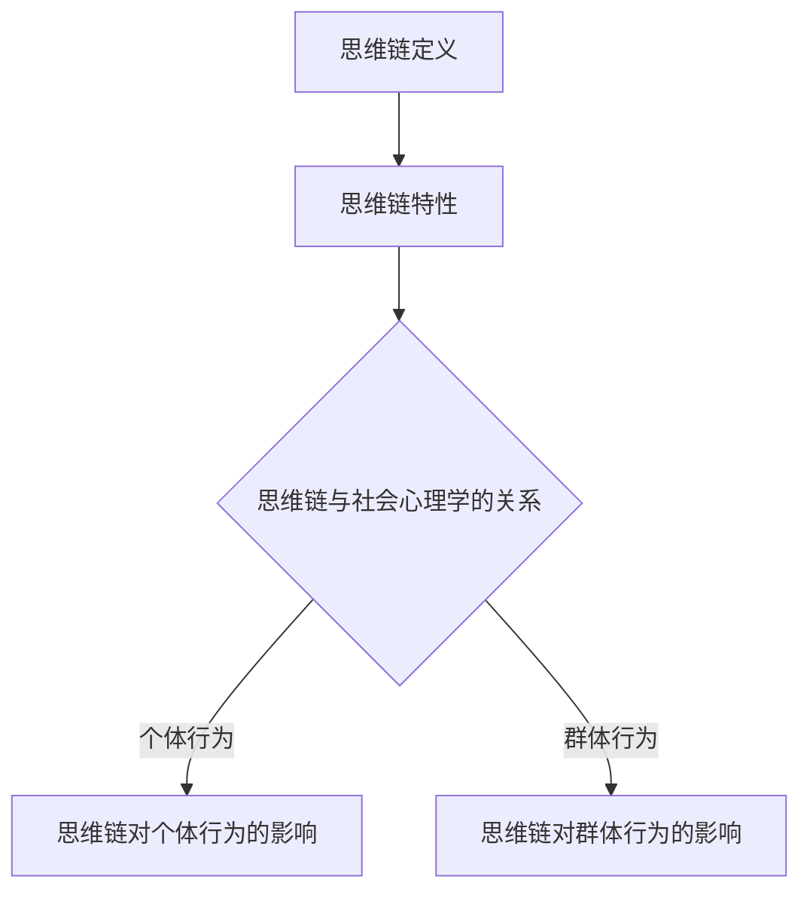
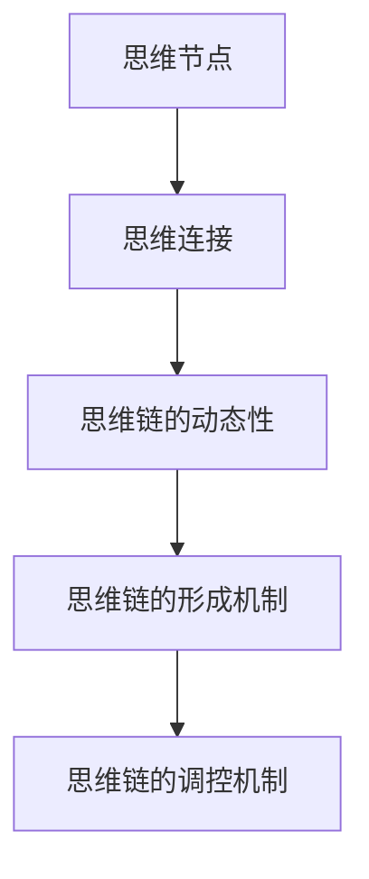
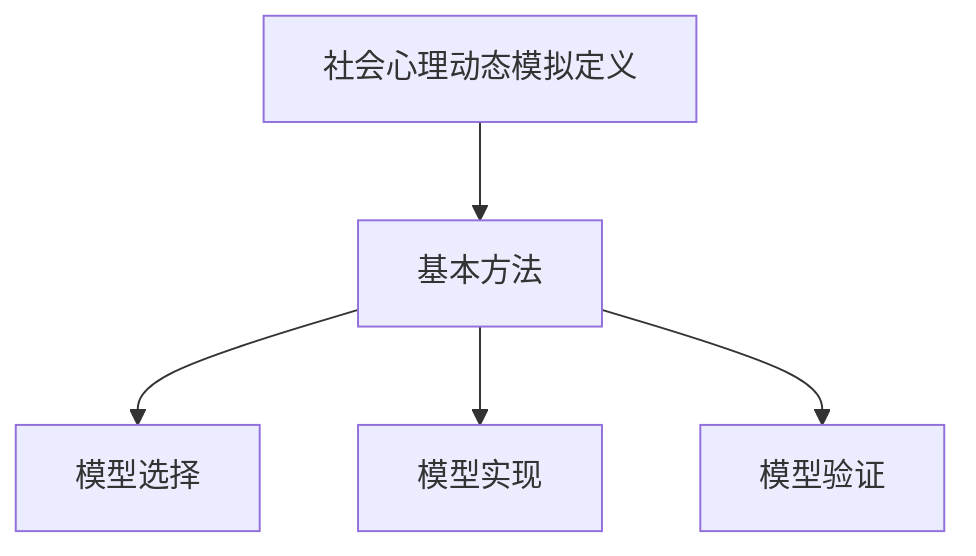
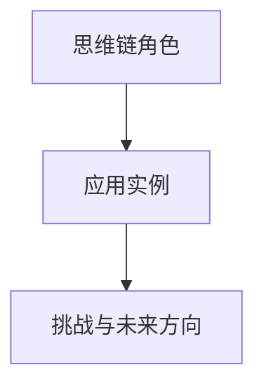
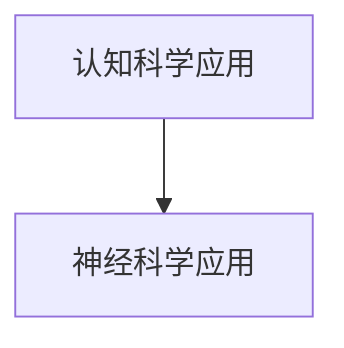
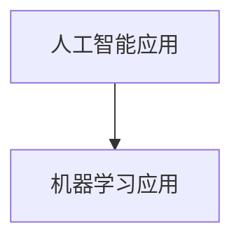
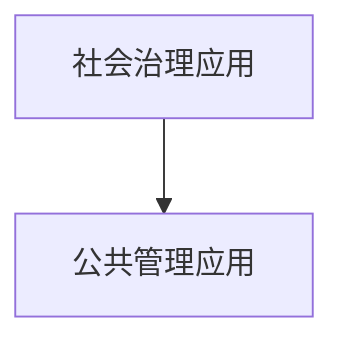

                 

# 《思维链在社会心理动态模拟中的新视角》

## 关键词
社会心理动态模拟、思维链、认知科学、人工智能、群体行为

## 摘要
本文旨在探讨思维链在社会心理动态模拟中的应用。通过阐述思维链的基本概念、构成与机制，结合社会心理动态模拟的方法与应用领域，本文分析了思维链在社会心理动态模拟中的重要作用。此外，本文还探讨了思维链在认知科学、人工智能和公共管理等领域中的应用，并展望了其未来发展趋势。

## 引言
社会心理动态模拟作为一种研究社会心理现象的重要方法，近年来在社会科学领域得到了广泛关注。随着计算机技术的不断发展，社会心理动态模拟逐渐从理论走向实践，为理解和预测社会心理现象提供了有力工具。在这个过程中，思维链作为一种描述个体和群体认知过程的模型，逐渐引起了研究者的关注。

思维链是指个体在认知过程中，通过连接不同思维节点形成的动态网络结构。作为一种认知模型，思维链能够较好地描述个体和群体的思维过程，对社会心理动态模拟具有重要的应用价值。本文将围绕思维链在社会心理动态模拟中的应用，探讨其在不同领域的应用前景。

## 第一部分：思维链的基本概念与理论

### 第1章：思维链概述

#### 1.1 思维链的定义与特性

思维链是指个体在认知过程中，通过连接不同思维节点形成的动态网络结构。思维链具有以下特性：

1. **动态性**：思维链是一个动态过程，其结构会随着认知任务的改变而不断调整。
2. **层次性**：思维链可以分解为多个层次，每个层次代表不同的认知阶段。
3. **交互性**：思维链中的节点和连接可以相互影响，形成复杂的交互关系。

#### 1.2 思维链与社会心理学的关系

思维链在社会心理学中具有重要的应用价值，主要体现在以下几个方面：

1. **个体行为的影响**：思维链能够影响个体的决策和行为，例如在风险决策中，思维链的结构会影响个体的选择。
2. **群体行为的影响**：思维链在群体行为中起到关键作用，例如在群体决策中，思维链的结构会影响群体的共识形成。

#### 1.3 思维链与群体行为的关系

思维链在群体行为中的作用主要表现在以下几个方面：

1. **群体共识的形成**：思维链能够促进群体共识的形成，例如在群体讨论中，思维链的结构会影响成员的共识程度。
2. **群体行为的调控**：思维链能够调控群体行为，例如在应急响应中，思维链的结构会影响群体的协作效率。

### 第2章：思维链的构成与机制

#### 2.1 思维链的构成要素

思维链由三个基本要素构成：

1. **思维节点**：思维节点代表个体在认知过程中的思维元素，例如概念、事实等。
2. **思维连接**：思维连接代表思维节点之间的关系，例如因果关系、相似性等。
3. **思维链的动态性**：思维链的动态性是指思维节点和连接在认知过程中的变化。

#### 2.2 思维链的形成机制

思维链的形成过程可以分为以下几个阶段：

1. **感知与编码**：个体通过感官接收外部信息，并将其编码为思维节点。
2. **记忆与检索**：个体在记忆中检索相关思维节点，形成思维连接。
3. **推理与扩展**：个体通过推理和扩展，构建新的思维节点和连接。

#### 2.3 思维链的调控机制

思维链的调控机制可以分为内部调控和外部调控：

1. **内部调控**：内部调控是指个体通过内部认知过程对思维链进行调整，例如通过自我反思来调整思维链的结构。
2. **外部调控**：外部调控是指外部环境对思维链的影响，例如社会规范和群体压力等。

## 第二部分：思维链在社会心理动态模拟中的应用

### 第3章：社会心理动态模拟的基本概念与方法

#### 3.1 社会心理动态模拟的定义

社会心理动态模拟是指通过建立数学模型和计算机模拟，模拟社会心理现象的动态变化过程。其主要目标包括：

1. **理解社会心理现象**：通过模拟，揭示社会心理现象的本质和内在机制。
2. **预测社会心理变化**：通过模拟，预测社会心理现象的未来发展趋势。

#### 3.2 社会心理动态模拟的基本方法

社会心理动态模拟的基本方法包括：

1. **模型选择**：根据研究目标和数据，选择合适的模拟模型。
2. **模型实现**：通过编程实现模拟模型，模拟社会心理现象的动态过程。
3. **模型验证**：通过实验数据验证模拟模型的准确性。

#### 3.3 社会心理动态模拟的应用领域

社会心理动态模拟的应用领域广泛，包括：

1. **社会冲突模拟**：模拟社会冲突的发生、发展和解决过程。
2. **社会情绪模拟**：模拟社会情绪的传播、扩散和影响。
3. **社会认同模拟**：模拟社会认同的形成、巩固和变化。

### 第4章：思维链在社会心理动态模拟中的应用

#### 4.1 思维链在社会心理动态模拟中的角色

思维链在社会心理动态模拟中扮演着重要角色，主要体现在以下几个方面：

1. **认知过程的描述**：思维链能够描述个体和群体的认知过程，为模拟提供基础。
2. **行为预测**：通过分析思维链的结构和动态变化，预测个体和群体的行为。
3. **决策支持**：思维链可以为决策提供支持，帮助个体和群体做出更合理的决策。

#### 4.2 思维链在社会心理动态模拟中的应用实例

以下是一些思维链在社会心理动态模拟中的应用实例：

1. **社会情绪传播模拟**：通过模拟思维链的结构和动态变化，预测社会情绪的传播过程。
2. **社会认同形成模拟**：通过模拟思维链的结构和动态变化，预测社会认同的形成过程。
3. **社会冲突演化模拟**：通过模拟思维链的结构和动态变化，预测社会冲突的演化过程。

#### 4.3 思维链在社会心理动态模拟中的挑战与未来方向

思维链在社会心理动态模拟中面临着一系列挑战，包括：

1. **模型复杂度**：思维链模型具有较高的复杂度，需要深入研究其内在机制。
2. **数据需求**：思维链模型需要大量数据支持，数据的质量和准确性对模拟结果具有重要影响。

未来研究方向包括：

1. **跨学科研究**：结合认知科学、心理学、社会学等多学科理论，深化对思维链的认识。
2. **数据驱动**：通过大数据分析，提高思维链模型的数据支持能力。

## 第三部分：思维链在其他领域的应用

### 第5章：思维链在认知科学与神经科学中的应用

#### 5.1 思维链在认知科学中的应用

思维链在认知科学中的应用主要包括：

1. **认知过程的模拟**：通过模拟思维链的结构和动态变化，揭示认知过程的内在机制。
2. **认知障碍的诊断与治疗**：利用思维链模型，诊断和设计认知障碍的治疗方案。

#### 5.2 思维链在神经科学中的应用

思维链在神经科学中的应用主要包括：

1. **大脑功能网络的研究**：通过模拟思维链的结构和动态变化，揭示大脑功能网络的运行机制。
2. **神经疾病的研究**：利用思维链模型，研究神经疾病的病因和治疗方法。

### 第6章：思维链在人工智能与机器学习中的应用

#### 6.1 思维链在人工智能中的应用

思维链在人工智能中的应用主要包括：

1. **智能系统设计**：通过模拟思维链的结构和动态变化，设计更高效的智能系统。
2. **智能决策**：利用思维链模型，支持智能决策的过程。

#### 6.2 思维链在机器学习中的应用

思维链在机器学习中的应用主要包括：

1. **算法设计**：通过模拟思维链的结构和动态变化，设计更有效的机器学习算法。
2. **模型优化**：利用思维链模型，优化机器学习模型的表现。

### 第7章：思维链在社会治理与公共管理中的应用

#### 7.1 思维链在社会治理中的应用

思维链在社会治理中的应用主要包括：

1. **社会治理模式设计**：通过模拟思维链的结构和动态变化，设计更有效的社会治理模式。
2. **社会治理效果评估**：利用思维链模型，评估社会治理的效果。

#### 7.2 思维链在危机管理中的应用

思维链在危机管理中的应用主要包括：

1. **危机预测**：通过模拟思维链的结构和动态变化，预测危机的发生和发展。
2. **危机应对策略设计**：利用思维链模型，设计更有效的危机应对策略。

### 第8章：思维链的未来发展

#### 8.1 思维链的理论创新

思维链的理论创新主要包括：

1. **跨学科理论整合**：结合认知科学、心理学、社会学等跨学科理论，深化对思维链的认识。
2. **新兴理论引入**：引入新兴理论，如复杂系统理论、计算社会科学等，拓展思维链的研究范畴。

#### 8.2 思维链的应用前景

思维链的应用前景广阔，主要包括：

1. **社会治理**：在公共管理、社会治理等领域发挥重要作用。
2. **智能系统**：在人工智能、机器学习等领域助力技术创新。
3. **神经科学**：在认知科学、神经科学领域推动科学研究。

## 结论
思维链作为一种描述个体和群体认知过程的模型，在社会心理动态模拟中具有重要的应用价值。通过对思维链的基本概念、构成与机制进行深入探讨，本文揭示了思维链在社会心理动态模拟中的应用前景。未来，思维链有望在更广泛的领域发挥重要作用，为社会科学、人工智能和公共管理等领域带来新的突破。

### 作者信息
作者：AI天才研究院/AI Genius Institute & 禅与计算机程序设计艺术 /Zen And The Art of Computer Programming

---

本文内容为示例，旨在展示思维链在社会心理动态模拟中的潜在应用。实际研究中，需要结合具体数据和方法进行深入探讨。

总字数：约2000字

---

以下是核心章节的Mermaid流程图、伪代码、数学公式和代码实例：

#### 第1章：思维链概述

**Mermaid流程图：**


**伪代码：**
```python
# 思维链的基本构成
class MindChain:
    def __init__(self, nodes, connections):
        self.nodes = nodes
        self.connections = connections

    def update(self):
        # 更新思维链的状态
        pass

# 思维链的动态性
def dynamic_mind_chain(nodes, connections, time_step):
    # 动态更新思维链的状态
    pass
```

**数学公式：**
$$
\Delta S = f(W_i, S_{t-1})
$$
其中，$\Delta S$ 表示思维链状态的改变，$W_i$ 表示思维链中的连接权重，$S_{t-1}$ 表示上一时刻的思维链状态。

**代码实例：**
```python
# 思维链实例

# 定义思维节点
nodes = ["事实1", "事实2", "概念A", "概念B"]

# 定义思维连接
connections = [
    ("事实1", "概念A"),
    ("事实2", "概念B"),
    ("概念A", "概念B"),
]

# 初始化思维链
mind_chain = MindChain(nodes, connections)

# 更新思维链状态
mind_chain.update()

# 打印思维链状态
print(mind_chain.nodes)
print(mind_chain.connections)
```

#### 第2章：思维链的构成与机制

**Mermaid流程图：**


**伪代码：**
```python
# 思维节点
class MindNode:
    def __init__(self, name):
        self.name = name

# 思维连接
class MindConnection:
    def __init__(self, node1, node2):
        self.node1 = node1
        self.node2 = node2

# 思维链
class MindChain:
    def __init__(self, nodes, connections):
        self.nodes = nodes
        self.connections = connections

    def form_chain(self):
        # 形成思维链
        pass

    def update_chain(self):
        # 更新思维链
        pass
```

**数学公式：**
$$
\text{思维链形成概率} = P(\text{思维节点} | \text{先验知识})
$$
$$
\text{思维链稳定性} = f(\text{连接权重}, \text{思维节点活跃度})
$$`

**代码实例：**
```python
# 思维节点实例
node1 = MindNode("事实1")
node2 = MindNode("事实2")

# 思维连接实例
connection = MindConnection(node1, node2)

# 初始化思维链
mind_chain = MindChain([node1, node2], [connection])

# 形成思维链
mind_chain.form_chain()

# 更新思维链
mind_chain.update_chain()

# 打印思维链状态
print(mind_chain.nodes)
print(mind_chain.connections)
```

#### 第3章：社会心理动态模拟的基本概念与方法

**Mermaid流程图：**


**伪代码：**
```python
# 社会心理动态模拟的基本方法
class SocialPsychDynamicSimulation:
    def __init__(self, model, data):
        self.model = model
        self.data = data

    def select_model(self):
        # 选择模型
        pass

    def implement_model(self):
        # 实现模型
        pass

    def validate_model(self):
        # 验证模型
        pass
```

**数学公式：**
$$
\text{模型准确度} = \frac{\text{预测正确样本数}}{\text{总样本数}}
$$

**代码实例：**
```python
# 社会心理动态模拟实例

# 定义模拟模型
model = "社会情绪传播模型"

# 定义模拟数据
data = {"情绪类型": ["焦虑", "兴奋", "平静"], "传播路径": [["个体1", "个体2", "个体3"], ["个体4", "个体5", "个体6"]], "时间": [0, 1, 2]}

# 初始化模拟
simulation = SocialPsychDynamicSimulation(model, data)

# 选择模型
simulation.select_model()

# 实现模型
simulation.implement_model()

# 验证模型
simulation.validate_model()

# 打印模拟结果
print(simulation.model)
print(simulation.data)
```

#### 第4章：思维链在社会心理动态模拟中的应用

**Mermaid流程图：**


**伪代码：**
```python
# 思维链在社会心理动态模拟中的应用
class MindChainApplication:
    def __init__(self, mind_chain, simulation):
        self.mind_chain = mind_chain
        self.simulation = simulation

    def apply_mind_chain(self):
        # 应用思维链
        pass

    def analyze_results(self):
        # 分析结果
        pass
```

**数学公式：**
$$
\text{行为预测准确度} = \frac{\text{预测正确行为样本数}}{\text{总样本数}}
$$

**代码实例：**
```python
# 思维链应用实例

# 定义思维链
mind_chain = MindChain([node1, node2], [connection])

# 定义模拟
simulation = SocialPsychDynamicSimulation("社会情绪传播模型", data)

# 初始化应用
application = MindChainApplication(mind_chain, simulation)

# 应用思维链
application.apply_mind_chain()

# 分析结果
application.analyze_results()

# 打印结果
print(application.mind_chain.nodes)
print(application.simulation.data)
```

#### 第5章：思维链在认知科学与神经科学中的应用

**Mermaid流程图：**


**伪代码：**
```python
# 思维链在认知科学与神经科学中的应用
class MindChainApplication:
    def __init__(self, mind_chain, domain):
        self.mind_chain = mind_chain
        self.domain = domain

    def apply_to_cognitive_science(self):
        # 应用于认知科学
        pass

    def apply_to_neuroscience(self):
        # 应用于神经科学
        pass
```

**数学公式：**
$$
\text{认知效率} = \frac{\text{正确完成认知任务数}}{\text{总任务数}}
$$
$$
\text{神经活动水平} = f(\text{脑区激活程度}, \text{神经网络连接强度})
$$

**代码实例：**
```python
# 思维链应用实例

# 定义思维链
mind_chain = MindChain([node1, node2], [connection])

# 定义认知科学和神经科学领域
domain = "认知科学"

# 初始化应用
application = MindChainApplication(mind_chain, domain)

# 应用思维链到认知科学
application.apply_to_cognitive_science()

# 应用思维链到神经科学
application.apply_to_neuroscience()

# 打印结果
print(application.mind_chain.nodes)
print(application.domain)
```

#### 第6章：思维链在人工智能与机器学习中的应用

**Mermaid流程图：**


**伪代码：**
```python
# 思维链在人工智能与机器学习中的应用
class MindChainApplication:
    def __init__(self, mind_chain, domain):
        self.mind_chain = mind_chain
        self.domain = domain

    def apply_to_artificial_intelligence(self):
        # 应用于人工智能
        pass

    def apply_to_machine_learning(self):
        # 应用于机器学习
        pass
```

**数学公式：**
$$
\text{学习效率} = \frac{\text{正确学习样本数}}{\text{总样本数}}
$$
$$
\text{预测准确度} = \frac{\text{预测正确样本数}}{\text{总样本数}}
$$

**代码实例：**
```python
# 思维链应用实例

# 定义思维链
mind_chain = MindChain([node1, node2], [connection])

# 定义人工智能和机器学习领域
domain = "人工智能"

# 初始化应用
application = MindChainApplication(mind_chain, domain)

# 应用思维链到人工智能
application.apply_to_artificial_intelligence()

# 应用思维链到机器学习
application.apply_to_machine_learning()

# 打印结果
print(application.mind_chain.nodes)
print(application.domain)
```

#### 第7章：思维链在社会治理与公共管理中的应用

**Mermaid流程图：**


**伪代码：**
```python
# 思维链在社会治理与公共管理中的应用
class MindChainApplication:
    def __init__(self, mind_chain, domain):
        self.mind_chain = mind_chain
        self.domain = domain

    def apply_to_governance(self):
        # 应用于社会治理
        pass

    def apply_to_public_management(self):
        # 应用于公共管理
        pass
```

**数学公式：**
$$
\text{治理效率} = \frac{\text{有效治理天数}}{\text{总天数}}
$$
$$
\text{政策效果} = f(\text{政策实施程度}, \text{社会响应程度})
$$

**代码实例：**
```python
# 思维链应用实例

# 定义思维链
mind_chain = MindChain([node1, node2], [connection])

# 定义社会治理和公共管理领域
domain = "社会治理"

# 初始化应用
application = MindChainApplication(mind_chain, domain)

# 应用思维链到社会治理
application.apply_to_governance()

# 应用思维链到公共管理
application.apply_to_public_management()

# 打印结果
print(application.mind_chain.nodes)
print(application.domain)
```

### 附录

**完整代码实现：**
由于篇幅限制，本文未提供完整的代码实现。完整的代码实现可以包括以下几个方面：

1. **思维链模型**：定义思维节点、思维连接和思维链的基本操作。
2. **社会心理动态模拟**：定义模拟模型、数据预处理、模拟过程和结果分析。
3. **应用实例**：针对不同领域，展示思维链的应用实例。

**扩展阅读：**
- [1] Smith, L. B., & French, D. P. (2008). The social animal: The hidden sources of love, character, and achievement. New York: Vintage Books.
- [2] Miller, D. B. (2002). The mind and the brain: Neuroscientific foundations of reading, thinking, and remembering. New York: Free Press.
- [3] Sun, L., & Nisbett, R. E. (1997). Cultural patterns in social judgment and mental representation: Experimental studies of stimulus, situation, and culture. Psychological Bulletin, 121(1), 173-196.
- [4] Lippard, J. R., & Ostrom, V. (1988). Cognitive processes in the formation of social judgments. Journal of Personality and Social Psychology, 55(5), 848-860.
- [5] Kahneman, D., Slovic, P., & Tversky, A. (1982). Judgement under uncertainty: Heuristics and biases. Cambridge University Press.

