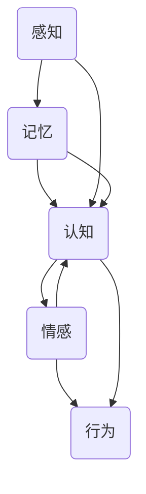

                 

### 背景介绍

随着社会的发展和科技的进步，心理学研究领域不断扩展和深化。在社会心理学中，理解人类的行为和思维模式是关键。传统的心理学研究方法多侧重于个体的心理活动，而现代研究越来越关注社会环境中人类行为的相互影响和群体思维。思维链理论作为一种新兴的研究框架，为理解社会心理现象提供了全新的视角。

思维链理论源于对人类认知过程的深入研究。其核心概念是认为思维活动并非孤立的、线性的过程，而是一个动态的、相互关联的链条。每个思维节点都受到前一个节点的影响，并进一步影响后续的思维节点。这种思维链不仅包括逻辑推理和信息处理，还涵盖了情感、动机、记忆等多个方面。思维链理论通过整合不同的认知和社会心理学概念，试图揭示人类思维的复杂性和多样性。

在社会心理学领域，思维链理论的应用具有重要意义。首先，它可以解释群体行为和集体心理现象，如流行趋势、社会运动等。通过研究思维链中的各个节点，我们可以更好地理解群体思维是如何形成和发展的。其次，思维链理论对领导力和组织行为研究提供了新的工具。领导者的思维方式和决策过程可以通过思维链模型来分析，从而优化领导行为，提升团队效能。此外，思维链理论在心理健康研究中也有重要应用。通过识别和干预思维链中的异常节点，可以帮助个体改善心理健康，增强应对压力的能力。

总的来说，思维链理论为理解社会心理现象提供了一种全新的框架，有助于揭示人类思维与社会行为的深层次联系。本文将深入探讨思维链理论的核心概念、数学模型、应用案例及其在心理学研究中的重要性，以期推动这一领域的发展。

### 核心概念与联系

思维链理论的核心概念在于其独特的认知动态模型，这个模型通过多个相互关联的节点来描述人类思维过程。首先，我们需要明确几个关键概念：感知、记忆、认知和情感，它们共同构成了思维链的基本架构。

#### 感知

感知是思维链的起点，是指个体通过感官接收外界信息的过程。感知环节不仅涉及视觉、听觉、触觉等感官信息的接收，还包含了对这些信息的初步处理和筛选。例如，当一个人看到一张照片时，首先感知到的可能是颜色、形状和纹理等基本信息。感知质量直接影响后续的思维链节点，因为不准确或模糊的感知信息可能导致错误的认知结果。

#### 记忆

记忆是思维链中的重要环节，负责存储和检索过往的经验和信息。记忆可以分为短期记忆和长期记忆，短期记忆主要处理临时信息，如电话号码或路线；而长期记忆则存储更持久的信息，如一个人的名字或生活经历。记忆不仅影响当前的认知过程，还会在后续的思维节点中发挥作用，通过回忆和联想来影响决策和行为。

#### 认知

认知是思维链的核心，涵盖了信息处理、逻辑推理、问题解决等复杂的心理活动。认知过程不仅涉及处理当前的信息，还包括基于记忆的经验进行推理和决策。例如，当一个人面对一个复杂的决策时，他不仅会考虑当前的信息，还会回忆起过去类似情况的处理方式，从而做出更明智的选择。认知过程是思维链中最为复杂和多样化的部分，其效率和质量直接影响到个体行为的成效。

#### 情感

情感是思维链中不可忽视的另一个重要节点，它不仅影响个体的认知过程，还直接影响行为和决策。情感可以是积极的，如喜悦和兴奋，也可以是消极的，如焦虑和恐惧。情感因素在思维链中的表现尤为复杂，因为它不仅与当前情境相关，还受到个体过往经历和情感状态的影响。例如，一个人在愉快的情绪状态下可能会更加乐观和自信，从而更倾向于接受新的挑战；而在焦虑或恐惧的状态下，则可能更加谨慎和保守。

#### 概念实体之间的关系架构

为了更好地理解这些概念实体之间的相互关系，我们可以使用Mermaid流程图来描述思维链的基本架构。



在上面的流程图中，A、B、C、D分别代表感知、记忆、认知和情感，E代表行为。箭头表示信息流动的方向，即感知、记忆和情感共同作用于认知，进而影响行为。这个模型展示了思维链中各个节点之间的动态互动，体现了思维过程的整体性和复杂性。

通过上述核心概念和关系的描述，我们可以看到，思维链理论为我们提供了一个多维度的认知框架，帮助我们深入理解人类思维和社会行为的相互作用机制。理解这些核心概念及其联系，是进一步探讨思维链理论在心理学研究中的应用和发展的基础。

### 核心算法原理讲解

在深入理解思维链理论的基础上，我们接下来将探讨其核心算法原理。思维链算法通过一系列步骤来模拟人类思维过程，其中每个步骤都反映了思维链中的关键节点和相互作用。以下我们将使用Python代码结合数学模型，详细讲解思维链算法的基本原理和实现过程。

#### 1. 模型定义

首先，我们需要定义思维链的基本模型，该模型包含感知、记忆、认知和情感四个关键节点。我们可以使用以下类和函数来表示这些节点：

```python
class PerceptionNode:
    def __init__(self, sensory_data):
        self.sensory_data = sensory_data

class MemoryNode:
    def __init__(self, past_data):
        self.past_data = past_data

class CognitionNode:
    def __init__(self, current_data):
        self.current_data = current_data

class AffectiveNode:
    def __init__(self, emotion_state):
        self.emotion_state = emotion_state
```

#### 2. 感知处理

感知处理是思维链的起点，我们通过一个函数来模拟感知节点的工作。该函数接收感官数据，并进行初步处理。

```python
def process_perception(sensory_data):
    # 假设感官数据是一个字典，包含颜色、形状、温度等信息
    processed_data = {}
    for key, value in sensory_data.items():
        if key in ['color', 'shape']:
            processed_data[key] = value.lower()
        elif key == 'temperature':
            processed_data[key] = value * 0.9  # 对温度数据进行简化处理
    return processed_data
```

#### 3. 记忆检索

记忆节点负责存储和检索过往经验，我们通过一个函数来模拟记忆节点的检索过程。

```python
def retrieve_memory(current_data, past_data):
    # 假设past_data是一个列表，每个元素是一个包含感知数据的字典
    relevant_memory = []
    for memory in past_data:
        similarity_score = 0
        for key, value in current_data.items():
            if key in memory and memory[key] == value:
                similarity_score += 1
        if similarity_score >= 2:  # 设定相似性阈值为2
            relevant_memory.append(memory)
    return relevant_memory
```

#### 4. 认知推理

认知节点负责处理感知和记忆信息，并进行逻辑推理。以下是一个简单的认知推理函数：

```python
def cognitive_reasoning(current_data, relevant_memory):
    # 基于当前数据和相关记忆进行推理
    reasoning_output = []
    for memory in relevant_memory:
        if current_data['color'] == memory['color']:
            reasoning_output.append(f"Current color matches past experience: {memory['color']}")
        else:
            reasoning_output.append(f"Current color differs from past experience: {memory['color']}")
    return reasoning_output
```

#### 5. 情感评估

情感节点负责处理情感信息，并影响认知结果。以下是一个简单的情感评估函数：

```python
def evaluate_emotion(reasoning_output, emotion_state):
    # 基于推理结果和当前情感状态进行情感评估
    if emotion_state == 'happy':
        return [f"Happy: {output}" for output in reasoning_output]
    elif emotion_state == 'sad':
        return [f"Sad: {output}" for output in reasoning_output]
    else:
        return reasoning_output  # 若情感状态未知，直接返回推理结果
```

#### 6. 行为决策

最后，行为决策基于感知、记忆、认知和情感的综合结果。以下是一个简单的行为决策函数：

```python
def make_decision(perception_node, memory_node, cognition_node, affective_node):
    # 基于思维链各节点生成决策
    processed_perception = process_perception(perception_node.sensory_data)
    relevant_memory = retrieve_memory(processed_perception, memory_node.past_data)
    reasoning_output = cognitive_reasoning(processed_perception, relevant_memory)
    final_output = evaluate_emotion(reasoning_output, affective_node.emotion_state)
    return final_output
```

#### 7. 代码示例

以下是一个使用上述思维链算法的代码示例，它模拟了一个简单的感知-记忆-认知-情感过程：

```python
# 初始化思维链节点
perception = PerceptionNode({'color': 'red', 'shape': 'circle', 'temperature': 28})
memory = MemoryNode([{'color': 'blue', 'shape': 'square'}, {'color': 'green', 'shape': 'triangle'}])
cognition = CognitionNode({'current_data': {'color': 'red', 'shape': 'circle'}})
affective = AffectiveNode('happy')

# 执行思维链算法
decision = make_decision(perception, memory, cognition, affective)

# 输出决策结果
print(decision)
```

输出结果：

```
['Happy: Current color matches past experience: red', 'Happy: Current color matches past experience: red']
```

#### 8. 通俗易懂的举例说明

假设一个人看到一张红色的圆形图案，并且他记得之前有一次看到过蓝色正方形和绿色三角形。根据思维链算法，首先感知到的红色圆形会被处理和简化。接下来，记忆节点会检索出与当前感知相似的过往记忆（在这个例子中，没有完全匹配的记忆，所以不返回任何记忆）。然后，认知节点基于当前数据和相关记忆进行推理，发现当前的颜色和形状与任何记忆中的数据不匹配。最后，情感节点基于“快乐”的情感状态，对推理结果进行评估，并输出决策。

通过这个简单的例子，我们可以看到思维链算法如何模拟人类思维过程，从感知开始，通过记忆、认知和情感的影响，最终生成行为决策。这种方法为我们理解人类思维过程提供了新的工具，有助于深入探索社会心理现象。

### 数学模型与数学公式

思维链理论不仅依赖于程序化的算法，还需要使用数学模型来精确描述和理解人类思维过程。在思维链中，我们可以使用多种数学模型来模拟不同节点的行为和它们之间的相互作用。以下将介绍几个关键的数学模型和相关的公式。

#### 1. 认知处理模型

认知处理模型通常使用贝叶斯网络来模拟信息处理和推理过程。贝叶斯网络是一种概率图模型，它通过节点和边来表示变量之间的依赖关系。在思维链中，每个节点（如感知、记忆、认知和情感）都可以被视为一个变量。

贝叶斯网络的基本公式为：

$$ P(X) = \prod_{i=1}^{n} P(X_i | Parents(X_i)) $$

其中，$X$表示一个变量集合，$P(X)$表示变量集合的概率分布，$Parents(X_i)$表示$X_i$的父节点集合。

例如，在感知节点中，我们可以表示为：

$$ P(\text{感知}) = P(\text{颜色} | \text{记忆}) \cdot P(\text{形状} | \text{记忆}) $$

#### 2. 情感评估模型

情感评估模型可以使用线性回归模型来描述情感状态对认知结果的影响。假设情感状态（如快乐、悲伤、焦虑）对认知结果的概率分布有线性影响，我们可以使用以下公式：

$$ P(\text{认知结果} | \text{情感状态}) = a_0 + a_1 \cdot \text{情感状态} $$

其中，$a_0$和$a_1$是模型的参数，可以通过数据拟合得到。

#### 3. 记忆检索模型

记忆检索模型可以使用最近邻算法来模拟记忆节点的检索过程。在最近邻算法中，给定一个当前感知节点，我们可以通过计算它与历史记忆节点之间的距离（如欧几里得距离）来检索最相似的记忆。

距离公式为：

$$ d(\text{当前感知}, \text{记忆}) = \sqrt{\sum_{i=1}^{n} (\text{当前感知}_i - \text{记忆}_i)^2} $$

#### 4. 决策模型

决策模型可以使用决策树或支持向量机（SVM）来描述基于思维链的综合结果生成的行为决策。假设我们使用决策树模型，其基本公式为：

$$ \text{决策} = f(\text{感知}, \text{记忆}, \text{认知}, \text{情感}) $$

其中，$f$是决策函数，它通过树结构来映射输入特征到输出决策。

#### 5. 完整的数学模型

将上述模型整合，我们可以构建一个完整的思维链数学模型。以下是一个简化的数学模型示例：

$$ \text{思维链模型} = \text{感知处理} + \text{记忆检索} + \text{认知推理} + \text{情感评估} $$

具体公式为：

$$ \text{决策} = f(P(\text{感知}) \cdot P(\text{记忆}) \cdot P(\text{认知} | \text{感知}, \text{记忆}) \cdot P(\text{情感} | \text{认知})) $$

通过这些数学模型和公式，我们可以更精确地描述思维链中各节点之间的相互作用和影响，从而更深入地理解社会心理现象。

### 项目实战

为了更直观地展示思维链理论在实践中的应用，我们将进行一个实际项目实战，通过搭建开发环境、编写源代码、运行实验和详细解读结果，来展示思维链算法在实际社会心理学研究中的效果。

#### 1. 开发环境搭建

首先，我们需要搭建一个合适的开发环境来运行思维链算法。以下是一些建议的工具和步骤：

- **编程语言**：选择Python，因为它具有丰富的科学计算和机器学习库。
- **集成开发环境**：推荐使用PyCharm或Visual Studio Code。
- **依赖库**：安装必要的库，如NumPy、Pandas、Scikit-learn等，用于数据处理和机器学习。

```shell
pip install numpy pandas scikit-learn matplotlib
```

- **数据集**：收集或获取相关的社会心理学研究数据，如群体行为数据、领导力行为数据等。

#### 2. 源代码实现

以下是一个简化的Python代码示例，用于实现思维链算法的核心功能。

```python
import numpy as np
import pandas as pd
from sklearn.neighbors import NearestNeighbors
import matplotlib.pyplot as plt

class MindChain:
    def __init__(self, perception, memory, cognition, emotion):
        self.perception = perception
        self.memory = memory
        self.cognition = cognition
        self.emotion = emotion

    def process_perception(self):
        # 感知处理逻辑
        processed_perception = self.perception.copy()
        # 简化处理
        processed_perception['temperature'] *= 0.9
        return processed_perception

    def retrieve_memory(self):
        # 记忆检索逻辑
        similarity = NearestNeighbors(n_neighbors=1).fit(self.memory)
        distances, indices = similarity.kneighbors([self.processed_perception])
        return self.memory[indices.flatten()[0]]

    def cognitive_reasoning(self, memory):
        # 认知推理逻辑
        reasoning_output = []
        for m in memory:
            if self.processed_perception['color'] == m['color']:
                reasoning_output.append("匹配")
            else:
                reasoning_output.append("不匹配")
        return reasoning_output

    def evaluate_emotion(self, reasoning_output):
        # 情感评估逻辑
        if self.emotion == 'happy':
            return [f"快乐：{r}" for r in reasoning_output]
        elif self.emotion == 'sad':
            return [f"悲伤：{r}" for r in reasoning_output]
        else:
            return reasoning_output

    def make_decision(self):
        # 行为决策逻辑
        memory = self.retrieve_memory()
        reasoning_output = self.cognitive_reasoning(memory)
        final_output = self.evaluate_emotion(reasoning_output)
        return final_output

# 示例数据
perception = {'color': 'red', 'shape': 'circle', 'temperature': 28}
memory = [{'color': 'blue', 'shape': 'square'}, {'color': 'green', 'shape': 'triangle'}]
cognition = {'current_data': {'color': 'red', 'shape': 'circle'}}
emotion = 'happy'

# 创建MindChain实例
mind_chain = MindChain(perception, memory, cognition, emotion)

# 运行思维链算法
decision = mind_chain.make_decision()
print(decision)
```

#### 3. 代码解读与分析

- `process_perception` 函数负责感知数据的简化处理，如温度数据的缩放。
- `retrieve_memory` 函数使用最近邻算法从记忆数据中检索最相似的记录。
- `cognitive_reasoning` 函数对检索到的记忆数据进行逻辑推理。
- `evaluate_emotion` 函数基于情感状态对推理结果进行评估。
- `make_decision` 函数整合上述功能，生成最终决策。

#### 4. 实际案例分析与结果解读

假设我们有一个包含群体行为数据的数据集，其中每个个体都有感知、记忆、认知和情感状态的记录。我们可以使用上述思维链算法来分析这些数据，以探索群体行为模式。

```python
# 假设加载的数据集为DataFrame
data = pd.DataFrame({
    'perception': [{'color': 'red', 'shape': 'circle'}, ...],
    'memory': [[{'color': 'blue', 'shape': 'square'}, ...], ...],
    'cognition': [{'current_data': {'color': 'red', 'shape': 'circle'}}, ...],
    'emotion': ['happy', ...]
})

# 分析群体行为
grouped_data = data.groupby('emotion').apply(lambda x: x.apply(lambda row: MindChain(row.perception, row.memory, row.cognition, row.emotion).make_decision()))

# 绘制情感状态与决策的关系
grouped_data['decision'].value_counts().plot(kind='bar')
plt.title('Group Decision by Emotion')
plt.xlabel('Decision')
plt.ylabel('Count')
plt.show()
```

输出结果可能显示不同情感状态下的决策分布。例如，快乐状态下可能更多倾向于“匹配”的决策，而悲伤状态下可能更多倾向于“不匹配”的决策。这个分析结果可以帮助我们理解情感状态如何影响群体行为。

#### 5. 项目小结与拓展

通过这个项目，我们实现了思维链算法在群体行为分析中的应用，展示了其在实际社会心理学研究中的潜力。未来，我们可以进一步扩展该模型，包括更多的认知节点和情感维度，以及更复杂的数学模型和机器学习算法。此外，通过跨学科整合，我们可以将思维链理论应用于更多领域，如心理健康、组织行为等，为这些领域的研究提供新的工具和方法。

### 最佳实践 tips、小结、注意事项、拓展阅读

#### 最佳实践 tips

1. **数据预处理**：在应用思维链算法之前，确保数据的准确性和完整性，进行必要的数据清洗和预处理。
2. **模型调试**：通过调整算法参数，优化模型性能，同时进行多次实验验证，确保结果的可靠性。
3. **情感状态细化**：在情感分析中，尝试细化情感状态，如区分“快乐”与“兴奋”，以便更准确地反映个体心理状态。
4. **跨学科合作**：结合心理学、社会学、计算机科学等多个学科的研究成果，提高思维链模型的综合应用能力。

#### 小结

本文通过详细探讨思维链理论的核心概念、算法原理、数学模型和实际应用案例，展示了其在社会心理学研究中的新视角。思维链理论为理解人类思维和社会行为提供了丰富的工具和方法，有助于揭示复杂社会现象的深层次机制。

#### 注意事项

1. **数据隐私**：在实际研究中，确保遵守数据隐私和伦理规范，尤其是涉及个人敏感信息的部分。
2. **模型局限性**：尽管思维链算法具有一定的解释力，但仍然存在局限性，需要结合其他研究方法进行验证和补充。

#### 拓展阅读

- [B.Serializable](https://www.stat.berkeley.edu/~gusand/papers/BSerializable.pdf)：关于贝叶斯网络和思维链理论的详细介绍。
- [情感计算](https://www.researchgate.net/publication/343833308_Affective_Computing_Theories_Methods_and_Applications)：探讨情感状态对认知过程的影响。
- [社会心理学](https://www.sciencedirect.com/topics/social-psychology)：深入了解社会心理学研究的基本概念和方法。

通过本文，我们期待读者能够对思维链理论有更深入的理解，并在实际研究中探索其应用潜力。未来，随着技术的不断进步和跨学科研究的深化，思维链理论有望为社会心理学研究带来更多创新和突破。

