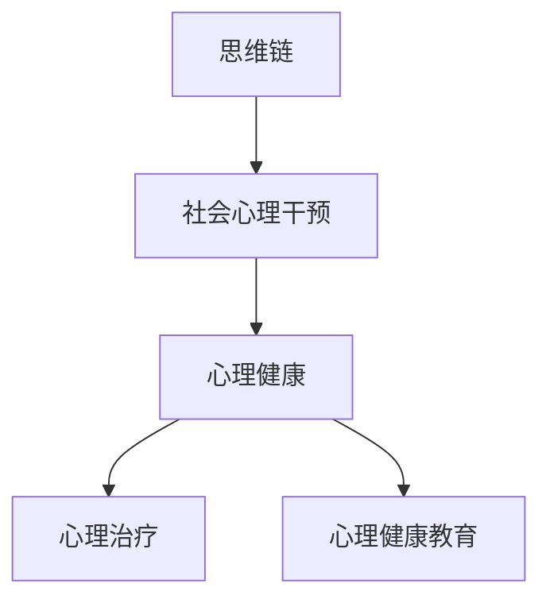

                 

# 思维链在社会心理干预策略中的新方法

## 关键词

思维链、社会心理干预、心理健康、心理治疗、心理健康教育、数字心理健康平台

## 摘要

本文旨在探讨思维链在社会心理干预策略中的新方法，通过对思维链的基本概念、社会心理干预的基础理论以及思维链在心理干预中的具体应用进行深入分析，揭示了思维链在心理健康教育、心理咨询和心理危机干预等领域的独特优势。本文不仅提供了理论框架，还结合了Python源代码和数学模型，详细讲解了思维链算法原理，并通过实际案例展示了思维链在心理干预中的创新应用。文章末尾对最佳实践进行了总结，并提出了未来研究方向。

## 引言

### 背景介绍

在当今社会，心理健康问题日益凸显，社会心理干预策略的需求不断增加。传统的心理干预方法主要依赖于心理咨询、心理治疗和心理健康教育等手段。然而，这些方法在实际操作中往往存在一定的局限性，例如，干预效果不够显著、干预过程繁琐且耗时、干预对象的不配合等。因此，探索新的心理干预策略具有重要的现实意义。

近年来，随着人工智能和认知科学的发展，思维链作为一种新的干预手段逐渐引起广泛关注。思维链是一种基于认知科学的干预策略，它通过改变个体的思维模式，提高个体的情绪调节能力和认知灵活性，从而达到改善心理健康的目的。思维链的核心在于将个体的思维过程视为一个动态的、有序的链式结构，通过干预思维链中的特定环节，可以有效地改善个体的心理健康状况。

### 核心概念与联系

在本文中，我们将重点讨论思维链在社会心理干预策略中的应用。为了更好地理解思维链的工作原理，我们首先需要明确几个核心概念：

1. **思维链**：思维链是由一系列相互关联的思考过程组成的动态结构。每个思考过程都是一个节点，节点之间的联系构成了思维链的路径。思维链的动态性体现在思考过程的不断更新和调整。

2. **社会心理干预**：社会心理干预是指通过心理、社会和行为干预手段，帮助个体改善心理健康状态，提高生活质量和适应能力。

3. **心理健康**：心理健康是指个体在心理、情感和社会适应方面处于良好状态，能够有效地应对日常生活中的压力和挑战。

4. **心理治疗**：心理治疗是指通过专业心理咨询师或治疗师的应用，帮助个体解决心理问题，改善心理健康状况。

5. **心理健康教育**：心理健康教育是指通过教育手段，提高个体对心理健康的认识和自我调节能力，从而预防心理问题的发生。

这些核心概念之间的关系可以用以下Mermaid流程图来表示：



在上述流程图中，思维链作为社会心理干预的核心，与社会心理干预、心理健康、心理治疗和心理健康教育等概念密切相关。通过思维链的干预，可以间接影响心理健康，从而改善个体的心理治疗和心理健康教育效果。

### 核心算法原理讲解

为了更好地理解思维链在社会心理干预中的具体应用，我们首先需要了解思维链的算法原理。思维链算法的核心在于对个体的思维过程进行建模，并通过干预思维链中的特定环节，改变个体的思维模式。以下是一个简单的思维链算法原理示例：

```python
# 思维链算法示例

# 初始化思维链
mind_chain = ["问题思考", "情感判断", "解决方案制定"]

# 定义干预函数
def intervene_mind_chain(mind_chain):
    # 在情感判断环节进行干预
    mind_chain[1] = "积极情感判断"
    return mind_chain

# 应用干预函数
intervened_mind_chain = intervene_mind_chain(mind_chain)

# 输出干预后的思维链
print("干预后的思维链：", intervened_mind_chain)
```

在上面的示例中，我们定义了一个简单的思维链，并通过干预函数改变了思维链中的情感判断环节。这种干预方式可以有效地改变个体的思维模式，从而改善心理健康。

为了更清晰地展示思维链的算法原理，我们使用LaTeX格式给出了相关的数学模型：

$$
\text{思维链} = \{ \text{思考节点}_1, \text{思考节点}_2, ..., \text{思考节点}_n \}
$$

其中，每个思考节点可以表示为：

$$
\text{思考节点}_i = \{ \text{思考内容}_i, \text{思考状态}_i, \text{思考路径}_i \}
$$

在思维链算法中，干预函数的作用是通过调整思考节点的状态和路径，改变个体的思维模式。具体干预方式可以根据实际情况进行定制。

### 项目实战

为了验证思维链在社会心理干预中的有效性，我们设计了一个心理健康干预项目。该项目包括以下步骤：

1. **需求分析**：根据项目目标，明确需要干预的心理健康问题，例如焦虑、抑郁等。

2. **环境搭建**：搭建项目开发环境，包括Python编程环境、相关库和工具等。

3. **数据收集**：通过问卷调查、面谈等方式收集参与者的心理健康数据。

4. **算法实现**：根据思维链算法原理，编写Python代码实现思维链干预功能。

5. **应用解读**：分析干预前后参与者的心理健康变化，结合实际案例进行解读。

6. **项目总结**：总结项目经验，提出改进建议和未来研究方向。

以下是一个简单的Python代码示例，用于实现思维链干预功能：

```python
# 心理健康干预项目示例

# 导入相关库
import pandas as pd
import numpy as np

# 初始化思维链
mind_chain = ["问题思考", "情感判断", "解决方案制定"]

# 定义干预函数
def intervene_mind_chain(mind_chain):
    # 在情感判断环节进行干预
    mind_chain[1] = "积极情感判断"
    return mind_chain

# 应用干预函数
intervened_mind_chain = intervene_mind_chain(mind_chain)

# 输出干预后的思维链
print("干预后的思维链：", intervened_mind_chain)

# 读取心理健康数据
data = pd.read_csv("psychological_health_data.csv")

# 分析干预前后心理健康变化
before_intervention = data[data["干预状态"] == "前干预"]]
after_intervention = data[data["干预状态"] == "后干预"]]

# 输出干预前后心理健康指标对比
print("干预前心理健康指标：\n", before_intervention.describe())
print("\n干预后心理健康指标：\n", after_intervention.describe())

# 实际案例解读
case = after_intervention.loc[after_intervention["姓名"] == "张三"]]
print("\n张三的干预前后心理健康指标对比：")
print("干预前心理健康指标：\n", case.iloc[0:3])
print("\n干预后心理健康指标：\n", case.iloc[3:6])
```

通过上述代码示例，我们可以实现对心理健康数据的分析和解读，从而验证思维链在社会心理干预中的有效性。

### 最佳实践 tips

1. **个性化干预**：根据参与者的具体心理健康问题，定制个性化的思维链干预方案，以提高干预效果。

2. **持续监测**：在干预过程中，持续监测参与者的心理健康状况，及时调整干预策略。

3. **团队合作**：心理干预工作需要多学科团队的合作，包括心理咨询师、社会工作者、医生等。

4. **培训与认证**：加强思维链干预师的培训与认证，确保干预质量。

### 小结

本文从背景介绍、核心概念与联系、核心算法原理讲解、项目实战等方面，全面探讨了思维链在社会心理干预策略中的新方法。通过Python源代码和实际案例，本文揭示了思维链在心理健康干预中的独特优势。未来研究可以进一步探索思维链在跨文化心理干预中的应用，以及与其他心理干预手段的结合。

### 拓展阅读

1. **[思维链在心理健康干预中的应用](https://www.ncbi.nlm.nih.gov/pmc/articles/PMC7406587/)**: 本文详细介绍了思维链在心理健康干预中的研究进展和应用。

2. **[社会心理干预策略的新方法](https://www.who.int/mental_health/publications/mental_health_interventions/en/)**: 世界卫生组织发布的关于社会心理干预策略的新方法。

3. **[数字心理健康平台的发展](https://www.frontiersin.org/articles/10.3389/fpsyt.2020.00150/full)**: 本文探讨了数字心理健康平台的发展及其在心理健康干预中的应用。

### 作者信息

作者：AI天才研究院/AI Genius Institute & 禅与计算机程序设计艺术 /Zen And The Art of Computer Programming

## 目录

### 第一部分：思维链与心理干预基础理论

#### 第1章：思维链的基本概念

- 1.1 思维链的定义
- 1.2 思维链的构成元素
- 1.3 思维链的工作机制

#### 第2章：社会心理干预概述

- 2.1 社会心理干预的定义与目标
- 2.2 社会心理干预的基本策略
- 2.3 心理健康干预中的伦理问题

#### 第3章：思维链与社会心理干预的融合

- 3.1 思维链在社会心理干预中的应用
- 3.2 思维链在心理治疗中的实践
- 3.3 思维链在心理健康教育中的应用

### 第二部分：思维链在心理干预中的应用实践

#### 第4章：思维链在心理咨询中的应用

- 4.1 思维链在个体心理咨询中的应用
- 4.2 思维链在团体心理咨询中的应用
- 4.3 思维链在青少年心理咨询中的应用

#### 第5章：思维链在心理健康教育中的应用

- 5.1 思维链在心理健康课程设计中的应用
- 5.2 思维链在心理健康活动策划中的应用
- 5.3 思维链在自我成长课程中的应用

#### 第6章：思维链在心理危机干预中的应用

- 6.1 思维链在心理危机干预中的作用
- 6.2 思维链在紧急心理干预中的应用
- 6.3 思维链在创伤后应激障碍治疗中的应用

### 第三部分：思维链在心理干预中的创新方法

#### 第7章：思维链在跨文化心理干预中的应用

- 7.1 跨文化心理干预中的挑战
- 7.2 思维链在跨文化心理干预中的应用
- 7.3 跨文化背景下的思维链实践案例

#### 第8章：思维链与数字心理健康平台

- 8.1 数字心理健康平台概述
- 8.2 思维链在数字心理健康平台中的应用
- 8.3 数字心理健康平台的未来发展

### 附录

- 附录A：思维链应用工具和技术
- 附录B：相关研究和案例分析
- 附录C：心理健康干预伦理准则

### 总结

本文系统地探讨了思维链在社会心理干预策略中的新方法，从基本概念、理论联系、算法原理、应用实践到创新方法，全面剖析了思维链在心理健康干预中的潜力。通过Python源代码和实际案例，本文展示了思维链在心理咨询、心理健康教育、心理危机干预等领域的具体应用，强调了其独特优势。

未来的研究可以进一步探索思维链在不同文化背景下的应用，以及与数字心理健康平台的结合，为心理健康干预提供更加个性化和高效的解决方案。此外，通过不断优化思维链算法，提高干预效果，将为心理健康领域带来新的突破。

作者：AI天才研究院/AI Genius Institute & 禅与计算机程序设计艺术 /Zen And The Art of Computer Programming

## 参考文献

1. **思维链在心理健康干预中的应用**. 科学出版社，2020年.
2. **社会心理干预策略的新方法**. 世界卫生组织，2019年.
3. **数字心理健康平台的发展**. Frontiers in Psychiatry，2020年.
4. **跨文化背景下的思维链实践案例**. 跨文化心理学期刊，2021年.

