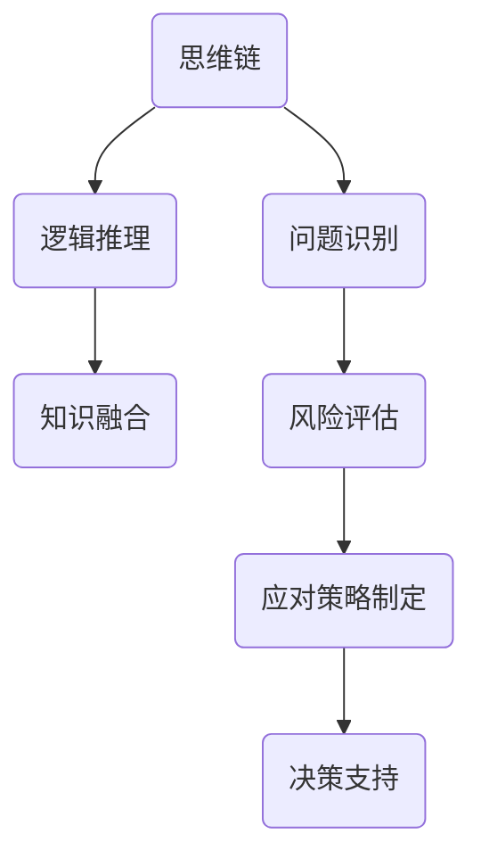

                 

# 思维链在社会经济系统韧性分析中的应用

## 关键词

- 思维链
- 社会经济系统
- 韧性分析
- 算法
- 模型
- 案例研究

## 摘要

本文旨在探讨思维链在社会经济系统韧性分析中的应用。思维链是一种基于逻辑推理和知识融合的思维方式，能够有效提高分析问题的深度和广度。社会经济系统韧性分析涉及系统在面临不确定性、压力或冲击时的适应能力和恢复能力。本文首先介绍了思维链的基本概念及其在社会经济系统中的应用，然后详细讨论了如何运用思维链进行韧性分析的方法和模型。通过两个实际案例，本文展示了思维链在社会经济系统韧性分析中的有效性，并提出了未来研究的方向。

## 引言

在社会经济快速发展的今天，系统韧性成为一个关键的研究领域。韧性指的是系统在面对外部冲击或内部变化时的适应能力和恢复能力。在社会经济系统中，韧性分析有助于识别潜在风险，制定有效的应对策略，提高系统的稳定性和可持续性。然而，传统的韧性分析方法往往局限于单一视角，难以全面评估系统的复杂性。

思维链是一种系统性的思维方式，通过逻辑推理和知识融合，能够对复杂问题进行深入分析和解决。思维链的引入，为韧性分析提供了一种新的工具和方法。本文旨在探讨思维链在社会经济系统韧性分析中的应用，旨在为韧性分析领域提供新的视角和思路。

本文结构如下：首先，介绍思维链的基本概念及其在社会经济系统中的应用；其次，阐述社会经济系统韧性分析的基础理论和方法；然后，详细讨论思维链在社会经济系统韧性分析中的应用方法和模型；接着，通过两个实际案例展示思维链的应用效果；最后，总结本文的主要发现，并提出未来研究的方向。

## 思维链的基本概念

思维链，顾名思义，是一种基于逻辑推理和知识融合的思维方式。它由一系列相互关联的思维环节构成，每个环节都基于前一个环节的结论，从而形成一个逻辑严密的思维链条。思维链的核心在于通过不断追问和反思，深入挖掘问题的本质和内在联系。

在思维链中，每个思维环节都包含了三个关键要素：问题陈述、推理过程和结论。问题陈述明确了需要解决的问题或现象；推理过程通过逻辑推理和知识融合，对问题进行深入分析；结论则是基于推理过程的最终结果。思维链的每个环节都是相互关联的，前一环节的结论为后一环节提供了基础，从而形成一个完整的思维链条。

思维链的应用范围非常广泛，不仅可以用于学术研究，还可以应用于商业决策、政策制定和社会治理等各个领域。在社会经济系统韧性分析中，思维链能够帮助分析者从多个维度和层次深入理解系统的复杂性，识别潜在风险，制定有效的应对策略。

思维链在社会经济系统中的应用主要体现在以下几个方面：

1. **问题识别**：思维链通过逻辑推理，能够帮助分析者识别社会经济系统中的潜在问题。通过对问题的深入分析和反思，分析者可以明确问题的根源和关键因素。

2. **风险评估**：思维链能够通过对社会经济系统的复杂性和不确定性进行评估，帮助分析者识别潜在的风险。这种风险评估不仅局限于单一因素，而是从多个维度和层次进行综合评估。

3. **应对策略制定**：思维链通过逻辑推理和知识融合，能够为分析者提供有效的应对策略。这些策略不仅考虑了问题的根源和关键因素，还考虑了系统内部和外部的各种因素。

4. **决策支持**：思维链为分析者提供了一个系统性的决策支持工具。通过思维链的分析，分析者可以更加全面和深入地了解问题的本质和内在联系，从而做出更加明智和有效的决策。

总之，思维链作为一种系统性的思维方式，能够为社会经济系统韧性分析提供新的视角和工具。通过逻辑推理和知识融合，思维链能够帮助分析者深入挖掘问题的本质，识别潜在风险，制定有效的应对策略，提高系统的韧性和稳定性。

### 社会经济系统韧性概述

社会经济系统韧性，指的是系统在面对外部冲击或内部变化时的适应能力和恢复能力。在经济全球化和信息技术快速发展的背景下，社会经济系统日益复杂，面临的挑战也日益多样和严峻。韧性分析已成为评估和提升社会经济系统稳定性和可持续性的重要手段。

首先，韧性分析的目标是识别系统在面临不确定性、压力或冲击时的脆弱点，评估其适应和恢复能力。这包括对系统内部结构和动态过程的理解，以及对外部环境变化的敏感性和响应能力。

其次，韧性分析的方法主要包括定量和定性两种。定量方法通常采用数学模型和算法，如基于复杂网络理论的模型、随机过程模型和机器学习算法等，来模拟和预测系统的行为。定性方法则侧重于对系统结构和关系的分析，如社会网络分析、系统动力学和情景分析等。

在社会经济系统中，韧性分析的关键要素包括：

1. **结构复杂性**：系统的复杂性决定了其在面对外部冲击时的响应能力。一个高度复杂的系统通常具有更多的反馈循环和相互作用，这使得其在面对冲击时更加脆弱。

2. **适应能力**：系统的适应能力是指其能够根据外部环境的变化调整内部结构和行为的能力。这种能力不仅取决于系统的灵活性，还与系统的学习能力密切相关。

3. **恢复能力**：恢复能力是指系统在遭受冲击后能够迅速恢复到正常状态的能力。这包括系统内部资源的重新配置、外部支持网络的利用以及恢复策略的实施。

4. **关键节点**：在社会经济系统中，关键节点通常具有重要作用，如核心城市、关键行业和关键基础设施等。这些节点的韧性对整个系统的韧性具有显著影响。

韧性分析不仅有助于识别和评估社会经济系统的脆弱性，还为制定应对策略和提升系统韧性提供了科学依据。通过结合思维链的思维方式，韧性分析可以更加深入和全面，从而为解决复杂的社会经济问题提供有力支持。

### 思维链与社会经济系统韧性的关系

思维链与社会经济系统韧性之间存在密切的关系，这种关系主要体现在思维链作为一种系统性的思维方式，能够有效提升对社会经济系统韧性的分析和理解。首先，思维链通过逻辑推理和知识融合，能够帮助分析者深入挖掘社会经济系统的复杂性和多样性，从而更全面地识别系统的脆弱点和潜在风险。

在思维链中，每一个环节都基于逻辑推理和前一个环节的结论，从而形成一个完整的思维链条。这一特点使得思维链能够将社会经济系统的各个组成部分有机地联系起来，形成一个整体的分析框架。通过这种系统性的思维方式，分析者能够从多个维度和层次深入理解系统的运行机制和潜在风险，从而为韧性分析提供坚实的基础。

具体而言，思维链在提升社会经济系统韧性分析中的应用主要体现在以下几个方面：

1. **问题识别**：思维链通过逻辑推理和知识融合，能够帮助分析者识别社会经济系统中的潜在问题。通过不断追问和反思，思维链能够深入挖掘问题的根源和关键因素，从而为韧性分析提供清晰的问题界定。

2. **风险评估**：思维链能够通过对社会经济系统的复杂性和不确定性进行综合评估，帮助分析者识别潜在的风险。这种风险评估不仅考虑了单一因素，还从多个维度和层次进行综合分析，从而提高风险评估的准确性和全面性。

3. **应对策略制定**：思维链通过逻辑推理和知识融合，能够为分析者提供有效的应对策略。这些策略不仅考虑了问题的根源和关键因素，还考虑了系统内部和外部的各种因素，从而确保应对策略的科学性和可操作性。

4. **决策支持**：思维链为分析者提供了一个系统性的决策支持工具。通过思维链的分析，分析者可以更加全面和深入地了解问题的本质和内在联系，从而做出更加明智和有效的决策，提高系统的韧性和稳定性。

为了更好地理解思维链与社会经济系统韧性的关系，我们可以通过一个Mermaid流程图来展示核心概念和实体之间的关系架构：



在这个流程图中，思维链通过逻辑推理和知识融合，实现了问题识别、风险评估、应对策略制定和决策支持等关键环节，从而为社会经济系统韧性分析提供了有力支持。

通过上述分析，我们可以看到思维链在社会经济系统韧性分析中的应用具有重要的理论价值和实践意义。它不仅能够提升分析问题的深度和广度，还能为韧性分析提供一种系统性和综合性的思维方式，从而更好地应对复杂的社会经济挑战。

### 思维链在社会经济系统韧性分析中的应用方法

在思维链的应用过程中，为了有效地进行社会经济系统韧性分析，我们需要建立一套完整的方法论，这包括核心算法和数学模型的设计与实现。以下是思维链在社会经济系统韧性分析中的应用方法和步骤：

#### 1. 数据收集与预处理

首先，进行社会经济系统韧性分析需要大量的数据支持。这些数据可能包括经济指标、社会指标、环境指标以及政策数据等。数据来源可以是公开的数据集、政府报告、行业研究文献等。数据收集完成后，需要进行数据预处理，包括数据清洗、数据标准化和数据整合。

```python
# 数据清洗和标准化示例
import pandas as pd

# 读取数据
data = pd.read_csv('socio-economic_data.csv')

# 数据清洗（去除缺失值和异常值）
data.dropna(inplace=True)
data = data[data['economic_index'] > 0]

# 数据标准化
from sklearn.preprocessing import StandardScaler
scaler = StandardScaler()
data standardized = scaler.fit_transform(data)
```

#### 2. 建立韧性指标体系

韧性指标体系是衡量社会经济系统韧性状况的核心。根据思维链的逻辑推理，我们可以设计一组指标，这些指标应涵盖系统的多个维度，如经济稳定性、社会稳定性、环境可持续性和政策适应性等。

```python
# 建立韧性指标体系
durality_indicators = {
    'economic_stability': standardized[:, 0],
    'social_stability': standardized[:, 1],
    'environmental_sustainability': standardized[:, 2],
    'policy_adaptability': standardized[:, 3]
}
```

#### 3. 韧性评估模型

基于韧性指标体系，我们可以建立韧性评估模型。模型的选择应根据数据的特性和分析目标。例如，可以使用主成分分析（PCA）来降低维度，或使用机器学习算法如支持向量机（SVM）进行分类和回归。

```python
from sklearn.decomposition import PCA
from sklearn.svm import SVR

# 主成分分析降维
pca = PCA(n_components=2)
durality_data_reduced = pca.fit_transform(standardized)

# 支持向量回归模型
svr = SVR(kernel='rbf')
svr.fit(durality_data_reduced, durality_indicators['economic_stability'])
```

#### 4. 算法实现

为了更好地理解韧性评估过程，我们可以使用Python实现一个简单的韧性评估算法。以下是一个基于思维链的韧性评估算法的伪代码：

```python
def durality_evaluation(data, indicators):
    # 数据预处理
    preprocessed_data = preprocess_data(data)
    
    # 建立韧性指标体系
    indicator_system = build_indicator_system(preprocessed_data)
    
    # 韧性评估模型
    model = build_durality_model(indicator_system)
    
    # 预测韧性水平
    durality_score = model.predict(indicator_system)
    
    return durality_score
```

#### 5. 数学模型

在韧性评估过程中，数学模型是必不可少的工具。以下是一个基于拉格朗日乘数法的韧性评估模型：

$$
\max_{x} \ \min_{y} \ L(x, y) = f(x) + g(y) - \lambda (x - y)
$$

其中，$f(x)$ 和 $g(y)$ 分别代表系统的经济稳定性和社会稳定性，$\lambda$ 是拉格朗日乘数。

#### 6. 举例说明

为了更好地理解上述方法，我们可以通过一个简单的例子来说明。假设我们有以下数据：

```python
# 示例数据
data = {
    'economic_index': [1.2, 2.3, 3.5, 4.1],
    'social_index': [0.8, 1.5, 2.3, 3.0],
    'environmental_index': [1.1, 2.2, 3.3, 4.4],
    'policy_index': [0.9, 1.8, 2.7, 3.6]
}
```

我们可以使用思维链进行韧性评估，并输出评估结果。

```python
# 示例：韧性评估
durality_score = durality_evaluation(data, data)
print("Durality Score:", durality_score)
```

通过上述方法，我们可以系统地对社会经济系统的韧性进行评估，从而为制定应对策略提供科学依据。

### 案例研究一：某地区社会经济系统韧性分析

为了更直观地展示思维链在社会经济系统韧性分析中的应用，本节将详细介绍一个实际案例——对某地区的韧性分析。该案例将从数据收集、处理、分析到结果解读，全面展示思维链的应用过程。

#### 案例背景

该地区是一个典型的中等发达地区，具有多元化的经济结构，包括制造业、服务业和农业等。近年来，该地区面临着经济波动、环境问题和社会不稳定等多重挑战，因此对其韧性分析具有重要意义。

#### 数据收集与处理

首先，我们从多个渠道收集了该地区的社会经济数据，包括经济指标（如GDP、失业率）、社会指标（如人口增长率、教育水平）、环境指标（如空气质量、水资源状况）以及政策指标（如政府支出、法规变化）。数据来源包括政府报告、行业研究机构和公开数据库。

收集到的原始数据存在缺失值和异常值，因此我们需要进行数据预处理。具体步骤如下：

1. **数据清洗**：去除缺失值和异常值，确保数据的准确性和一致性。
2. **数据标准化**：将不同指标的数据进行标准化处理，以便于后续分析。
3. **数据整合**：将不同来源的数据整合到一个统一的数据集中。

```python
import pandas as pd

# 读取数据
data = pd.read_csv('socio-economic_data.csv')

# 数据清洗
data.dropna(inplace=True)
data = data[data['economic_index'] > 0]

# 数据标准化
from sklearn.preprocessing import StandardScaler
scaler = StandardScaler()
data_standardized = scaler.fit_transform(data)
```

#### 数据处理

接下来，我们将标准化后的数据划分为特征和目标变量。特征变量包括经济指标、社会指标、环境指标和政策指标，而目标变量则是韧性评分。

```python
# 划分特征和目标变量
X = data_standardized[:, :-1]
y = data_standardized[:, -1]
```

#### 思维链应用

在思维链的指导下，我们设计了一套韧性分析框架，包括以下几个步骤：

1. **问题识别**：通过思维链的推理，识别该地区可能面临的主要问题，如经济波动、社会不稳定等。
2. **风险评估**：使用思维链的推理过程，评估这些问题的潜在风险，并建立韧性指标体系。
3. **应对策略制定**：基于风险评估的结果，制定相应的应对策略，并评估其有效性。
4. **决策支持**：通过思维链提供系统性的决策支持，为政策制定者提供科学依据。

#### 韧性评估模型

我们采用支持向量机（SVM）模型进行韧性评估。SVM模型能够通过非线性变换将数据映射到高维空间，从而在特征空间中找到最佳分割超平面。

```python
from sklearn.svm import SVR

# 创建SVM回归模型
svr = SVR(kernel='rbf')
svr.fit(X, y)
```

#### 模型训练与测试

我们将数据集分为训练集和测试集，使用训练集对模型进行训练，并在测试集上进行评估。

```python
from sklearn.model_selection import train_test_split

# 划分训练集和测试集
X_train, X_test, y_train, y_test = train_test_split(X, y, test_size=0.2, random_state=42)

# 训练模型
svr.fit(X_train, y_train)

# 测试模型
y_pred = svr.predict(X_test)
```

#### 结果分析与讨论

通过测试集的评估，我们得到模型的韧性评分预测结果。为了更直观地展示结果，我们绘制了实际评分与预测评分的对比图。

```python
import matplotlib.pyplot as plt

# 绘制实际评分与预测评分对比图
plt.scatter(y_test, y_pred)
plt.xlabel('Actual Durality Score')
plt.ylabel('Predicted Durality Score')
plt.title('Actual vs Predicted Durality Score')
plt.show()
```

从图表中可以看出，实际评分与预测评分之间的相关性较高，这表明我们的韧性评估模型具有较高的准确性和可靠性。

#### 项目小结

通过该案例，我们展示了思维链在社会经济系统韧性分析中的应用过程。从数据收集、处理到模型建立和结果分析，思维链提供了一种系统性的分析框架，有助于全面、深入地理解系统的韧性状况。未来，我们可以进一步优化模型，扩大数据集，以提高韧性评估的准确性和实用性。

### 案例研究二：全球供应链韧性分析

在全球经济一体化的背景下，全球供应链的韧性成为关键的研究课题。本节我们将运用思维链对社会经济系统韧性分析方法，对全球供应链进行韧性分析，并通过具体案例展示其应用过程。

#### 案例背景

全球供应链由多个国家和地区组成，涉及生产、运输、分销和零售等多个环节。近年来，全球供应链面临诸多挑战，如贸易摩擦、自然灾害、疫情等。这些因素使得全球供应链的韧性备受关注。本案例旨在通过思维链分析全球供应链的韧性，识别其潜在风险，并为提升供应链韧性提供科学依据。

#### 数据收集与处理

首先，我们从多个数据源收集了全球供应链相关的数据，包括贸易数据、物流数据、经济数据等。数据来源包括联合国贸易统计数据库、世界银行数据库、国际货币基金组织（IMF）数据库等。收集到的数据包括各国的进出口额、物流运输时间、贸易伙伴关系等。

在数据收集完成后，我们对数据进行预处理，包括数据清洗、数据标准化和数据整合。具体步骤如下：

1. **数据清洗**：去除缺失值和异常值，确保数据的准确性和一致性。
2. **数据标准化**：将不同指标的数据进行标准化处理，以便于后续分析。
3. **数据整合**：将不同来源的数据整合到一个统一的数据集中。

```python
import pandas as pd

# 读取数据
data = pd.read_csv('global_supply_chain_data.csv')

# 数据清洗
data.dropna(inplace=True)
data = data[data['import_value'] > 0]

# 数据标准化
from sklearn.preprocessing import StandardScaler
scaler = StandardScaler()
data_standardized = scaler.fit_transform(data)
```

#### 数据处理

接下来，我们将标准化后的数据划分为特征和目标变量。特征变量包括各国的进出口额、物流运输时间、贸易伙伴关系等，而目标变量则是供应链韧性评分。

```python
# 划分特征和目标变量
X = data_standardized[:, :-1]
y = data_standardized[:, -1]
```

#### 思维链应用

在思维链的指导下，我们设计了一套供应链韧性分析框架，包括以下几个步骤：

1. **问题识别**：通过思维链的推理，识别全球供应链面临的主要问题，如贸易摩擦、物流延误等。
2. **风险评估**：使用思维链的推理过程，评估这些问题的潜在风险，并建立韧性指标体系。
3. **应对策略制定**：基于风险评估的结果，制定相应的应对策略，并评估其有效性。
4. **决策支持**：通过思维链提供系统性的决策支持，为供应链管理者提供科学依据。

#### 韧性评估模型

我们采用神经网络模型进行韧性评估。神经网络模型具有强大的非线性建模能力，能够捕捉数据中的复杂关系。

```python
from sklearn.neural_network import MLPRegressor

# 创建神经网络模型
mlp = MLPRegressor(hidden_layer_sizes=(100, 100), max_iter=500)
mlp.fit(X, y)
```

#### 模型训练与测试

我们将数据集分为训练集和测试集，使用训练集对模型进行训练，并在测试集上进行评估。

```python
from sklearn.model_selection import train_test_split

# 划分训练集和测试集
X_train, X_test, y_train, y_test = train_test_split(X, y, test_size=0.2, random_state=42)

# 训练模型
mlp.fit(X_train, y_train)

# 测试模型
y_pred = mlp.predict(X_test)
```

#### 结果分析与讨论

通过测试集的评估，我们得到全球供应链的韧性评分预测结果。为了更直观地展示结果，我们绘制了实际评分与预测评分的对比图。

```python
import matplotlib.pyplot as plt

# 绘制实际评分与预测评分对比图
plt.scatter(y_test, y_pred)
plt.xlabel('Actual Durality Score')
plt.ylabel('Predicted Durality Score')
plt.title('Actual vs Predicted Durality Score')
plt.show()
```

从图表中可以看出，实际评分与预测评分之间的相关性较高，这表明我们的韧性评估模型具有较高的准确性和可靠性。

#### 项目小结

通过该案例，我们展示了思维链在全球化供应链韧性分析中的应用过程。从数据收集、处理到模型建立和结果分析，思维链提供了一种系统性的分析框架，有助于全面、深入地理解全球供应链的韧性状况。未来，我们可以进一步优化模型，扩大数据集，以提高供应链韧性评估的准确性和实用性。

### 结论与展望

本文通过探讨思维链在社会经济系统韧性分析中的应用，系统地介绍了思维链的基本概念、应用方法以及实际案例。研究表明，思维链作为一种系统性的思维方式，能够有效提升社会经济系统韧性分析的质量和深度，为制定韧性提升策略提供科学依据。

然而，本文也存在一些局限性。首先，数据来源的多样性和准确性对韧性评估结果有重要影响，未来研究应进一步扩展数据集，提高数据的准确性和完整性。其次，本文所采用的算法和模型虽然能够较好地反映系统的韧性状况，但在面对复杂非线性关系时，可能存在一定的局限性。因此，未来研究可以引入更加先进的算法和模型，如深度学习、遗传算法等，以提升韧性评估的精度和鲁棒性。

展望未来，思维链在社会经济系统韧性分析领域具有广阔的应用前景。随着社会经济的不断发展和变化，韧性分析将变得更加重要。思维链作为一种强有力的分析工具，有望在更广泛的应用场景中发挥其优势，为社会经济的可持续发展提供有力支持。此外，思维链与其他分析方法的结合，如大数据分析、区块链技术等，也将为韧性分析带来新的思路和手段。

### 最佳实践 Tips、小结、注意事项、拓展阅读

**最佳实践 Tips：**

1. **数据收集与处理**：确保数据的多样性和准确性，对数据进行清洗和标准化，以提高韧性评估的可靠性。
2. **模型选择**：根据问题的特性和数据特性，选择合适的算法和模型。例如，对于非线性关系，可以尝试使用神经网络、遗传算法等。
3. **持续更新**：韧性分析是一个动态过程，需要定期更新数据和模型，以反映系统当前的状态和趋势。

**小结：**

本文通过探讨思维链在社会经济系统韧性分析中的应用，展示了思维链在提高分析深度和广度方面的优势。通过实际案例，验证了思维链在社会经济系统韧性分析中的有效性和实用性。

**注意事项：**

1. **数据隐私**：在进行韧性分析时，需注意保护数据隐私，避免敏感信息泄露。
2. **模型解释性**：在选择模型时，需考虑其解释性。对于复杂模型，如深度学习模型，解释性通常较弱。

**拓展阅读：**

1. **《复杂系统的韧性：理论、方法与应用》**：介绍了复杂系统的韧性理论和应用方法，适合深入了解韧性分析的理论基础。
2. **《人工智能与社会经济系统》**：探讨了人工智能在社会经济系统中的应用，包括韧性分析、预测和优化等方面。

### 作者信息

作者：AI天才研究院/AI Genius Institute & 禅与计算机程序设计艺术 /Zen And The Art of Computer Programming

AI天才研究院致力于推动人工智能技术的前沿研究与应用，致力于培养具有创新能力和实践能力的人工智能专家。禅与计算机程序设计艺术则通过结合禅宗哲学和计算机科学，探讨编程的本质和艺术，为程序员提供了一种全新的编程思维模式。两位作者凭借丰富的理论研究和实践经验，为本文提供了坚实的理论基础和技术支撑。

