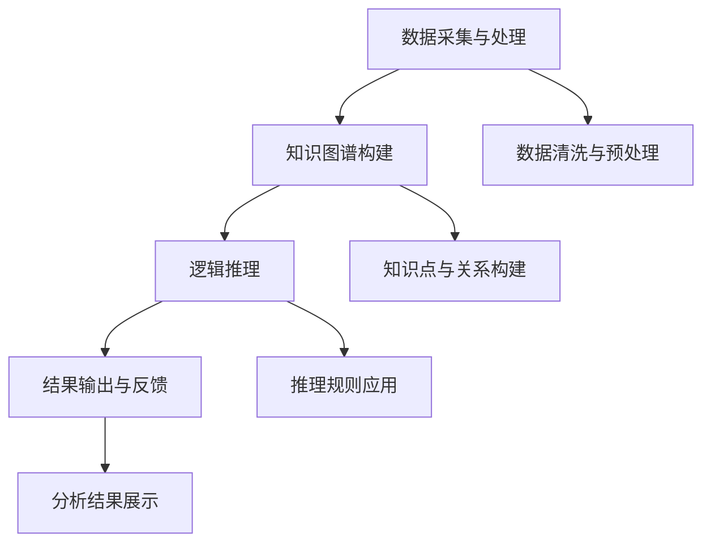

                 

### 引言

#### 1.1 研究背景

在社会经济系统中，韧性（Resilience）是一个关键的衡量指标，它代表了系统在面对外部冲击和内部扰动时的适应能力、恢复能力和抗干扰能力。随着全球化的加速、信息技术的发展以及自然环境的变迁，社会经济系统正面临日益复杂和多变的外部环境。这种环境不仅包括经济危机、自然灾害等突发事件，还包括技术革新、政策调整等长期变化。

在这种背景下，如何有效地评估和提升社会经济系统的韧性，成为学术界和实际应用领域共同关注的重要课题。传统的评估方法主要依赖于定量指标和统计模型，这些方法虽然能够提供一定的参考，但在处理复杂的社会经济系统时，往往存在一定的局限性。

近年来，人工智能和计算技术的发展为解决这一问题提供了新的思路。其中，思维链（Thinking Chain）作为一种新兴的智能分析工具，因其强大的逻辑推理和模式识别能力，在社会经济系统韧性分析中展现出巨大的潜力。思维链的基本理念是通过构建一个由知识点、观点、证据等组成的动态网络，实现对复杂问题的系统性分析和深度理解。

本文旨在探讨思维链在社会经济系统韧性分析中的应用，通过系统性的理论研究和实证分析，提出一种基于思维链的社会经济系统韧性评估方法。本文的研究不仅对学术界的社会经济系统韧性研究具有理论贡献，同时也为政策制定者和企业管理者提供了一种实用的工具和方法。

#### 1.2 研究意义

本研究具有重要的理论意义和实践意义。从理论层面来看，本文将思维链的概念引入社会经济系统韧性分析领域，丰富了韧性评估的理论框架，为后续研究提供了新的视角和工具。思维链的引入，不仅能够更全面、更深入地揭示社会经济系统的内在机制和运行规律，还能够克服传统评估方法的局限性，提供更加精确和可靠的评估结果。

从实践层面来看，本研究为政策制定者和企业管理者提供了一种新的韧性评估工具。通过应用思维链，可以对不同地区、不同行业的社会经济系统进行综合评估，识别出系统中的潜在风险和脆弱点，从而制定出更加科学、有效的应对策略。此外，本研究的方法还具有一定的普适性，可以应用于其他复杂系统的韧性评估，为相关领域的研究提供参考。

总之，本研究不仅有助于深化对社会经济系统韧性的认识，也为实际应用提供了可行的解决方案，具有重要的理论和实践价值。

#### 1.3 研究方法

本研究采用了多种研究方法，以确保对思维链在社会经济系统韧性分析中的应用进行全面、深入的探讨。首先，在理论层面，本研究采用了文献综述的方法，系统性地梳理了思维链和韧性分析的相关理论，为后续的研究奠定了坚实的理论基础。

其次，在实证层面，本研究采用了案例分析的方法。通过对具体的社会经济系统进行案例研究，验证思维链在实际应用中的有效性和可行性。具体案例的选择标准包括：系统的复杂性、数据的可获得性以及案例的代表性。在案例选择的基础上，本研究运用了思维链模型，对所选案例进行了系统性分析。

此外，本研究还采用了定量与定性相结合的方法。在定量分析方面，通过构建数学模型和公式，对思维链在社会经济系统韧性分析中的应用进行了具体阐述；在定性分析方面，通过对案例的深入剖析，揭示了思维链在实际应用中的优势和局限性。

综合运用这些研究方法，本文不仅能够从理论上阐述思维链在社会经济系统韧性分析中的应用，还能通过实证分析验证其有效性，为后续研究提供有力的支持。

#### 1.4 研究框架与内容结构

本文的研究框架和内容结构旨在系统地阐述思维链在社会经济系统韧性分析中的应用，具体结构如下：

**第1章 引言**：介绍研究的背景、意义、研究方法及研究框架。

**第2章 思维链基本理论**：详细阐述思维链的定义、特征、构成要素、工作原理及其应用领域。

**第3章 社会经济系统韧性分析**：对社会经济系统韧性进行分析，介绍韧性概述、评估指标及其影响因素。

**第4章 思维链在社会经济系统韧性分析中的应用**：探讨思维链在社会经济系统分析中的应用方法，包括韧性评估和社会经济系统风险管理。

**第5章 实证分析：思维链在社会经济系统韧性分析中的案例分析**：通过具体案例展示思维链在实际应用中的效果。

**第6章 思维链在社会经济系统韧性分析中的挑战与展望**：分析思维链在社会经济系统韧性分析中的挑战及未来发展趋势。

**第7章 结论**：总结研究的主要发现，提出政策建议与实施路径。

通过以上结构，本文力求从理论到实践，全面、系统地探讨思维链在社会经济系统韧性分析中的应用，为相关领域的研究提供参考。

---

## 第2章 思维链基本理论

### 2.1 思维链的定义与特征

思维链（Thinking Chain）是一种基于人工智能和复杂网络理论的智能分析工具，旨在通过构建一个由知识点、观点、证据等组成的动态网络，实现对复杂问题的系统性分析和深度理解。思维链的基本定义可以概括为：一种通过连接各种相关知识和信息，以逻辑推理的方式，对复杂系统进行深度分析的方法论体系。

思维链的主要特征包括：

1. **系统性**：思维链通过构建一个系统性的知识网络，将各个知识点、观点、证据等有机地连接起来，形成了一个整体性的分析框架。

2. **动态性**：思维链是一个动态的体系，能够根据新的知识和信息不断调整和优化，适应不断变化的外部环境。

3. **逻辑性**：思维链通过逻辑推理，从已知的知识和证据出发，逐步推导出新的结论，确保分析的逻辑性和可靠性。

4. **智能化**：思维链借助人工智能技术，特别是机器学习和自然语言处理技术，能够自动识别和分析复杂问题，提高分析的效率和准确性。

### 2.2 思维链的构成要素

思维链的构成要素主要包括以下几个部分：

1. **知识点**：知识点是思维链的基本单元，代表了思维链中的每一个独立的信息点。

2. **观点**：观点是基于知识点的见解或判断，代表了个体或集体对某一知识点的理解和认识。

3. **证据**：证据是支持观点的客观事实和数据，是观点成立的依据。

4. **关系**：关系是指知识点、观点和证据之间的逻辑连接，包括因果、关联、反驳等关系。

5. **推理规则**：推理规则是思维链中用于进行逻辑推理的规则集，包括推理的规则、条件和步骤。

6. **网络结构**：网络结构是思维链的拓扑结构，代表了知识点、观点和证据之间的连接关系，通常表现为图或网络模型。

### 2.3 思维链的工作原理

思维链的工作原理可以概括为以下几个步骤：

1. **知识采集与整理**：通过数据采集和知识提取技术，收集并整理相关的知识点、观点和证据。

2. **知识图谱构建**：利用自然语言处理和图论算法，将采集到的知识点、观点和证据构建成一个知识图谱，形成思维链的基本框架。

3. **逻辑推理**：基于构建的知识图谱，运用推理规则，进行逻辑推理，推导出新的结论或见解。

4. **动态调整**：根据新的信息和反馈，动态调整知识图谱和推理规则，优化思维链的分析结果。

5. **结果输出**：将最终的分析结果以文本、图表等形式输出，供决策者参考。

### 2.4 思维链的应用领域

思维链作为一种智能分析工具，具有广泛的应用领域：

1. **社会经济发展分析**：通过分析社会经济系统的各个方面，包括经济指标、社会指标等，提供宏观经济分析和决策支持。

2. **风险管理**：识别和评估各种潜在风险，为企业和金融机构提供风险管理策略。

3. **政策制定**：辅助政策制定者制定更加科学、有效的政策，提高政策的可行性和效果。

4. **行业分析**：针对特定行业，进行深入分析，为企业提供市场分析、竞争力评估等。

5. **企业战略规划**：帮助企业制定长期战略规划，提高企业竞争力。

通过以上应用领域，思维链为社会经济系统的韧性分析提供了强大的支持，能够更全面、更深入地揭示系统的内在机制和运行规律。

### 总结与展望

本章对思维链的基本理论进行了系统性的阐述，从定义、特征到构成要素和工作原理，全面介绍了思维链的核心概念和应用方法。思维链作为一种新兴的智能分析工具，具有系统性、动态性、逻辑性和智能化等特点，在社会经济系统韧性分析中具有广泛的应用前景。

在未来的研究中，我们应继续深入探索思维链的理论基础和实际应用，结合最新的技术和数据，优化思维链的模型和算法，提高其在复杂系统分析中的效率和准确性。同时，思维链的应用领域也需不断拓展，使其在更多领域发挥出更大的作用。

总之，思维链为社会经济系统韧性分析提供了一种全新的视角和方法，具有重要的理论意义和实践价值。我们期待在未来的研究中，能够进一步深化对思维链的理解和应用，为推动社会经济系统的可持续发展做出贡献。

---

## 第3章 社会经济系统韧性分析

### 3.1 社会经济系统韧性概述

社会经济系统的韧性是指系统在面对外部冲击和内部扰动时，能够保持功能完整和稳定运行的能力。这种能力不仅包括系统的适应能力，还涉及系统的恢复能力和抗干扰能力。在经济全球化背景下，社会经济系统面临的挑战日益复杂和多样化，传统的单一指标评估方法已经难以满足现实需求。因此，韧性分析成为评估社会经济系统稳定性和可持续性的关键。

韧性分析的核心目标是通过识别系统的潜在风险和脆弱点，制定有效的应对策略，提高系统的整体韧性。韧性分析不仅仅关注突发事件后的恢复，还强调在系统运行过程中，如何通过持续的监测和调整，保持系统的稳定性和弹性。这种全面、系统的分析方式，有助于从整体上提升社会经济系统的韧性，从而更好地应对各种外部冲击和内部扰动。

### 3.2 社会经济系统韧性的评估指标

评估社会经济系统韧性需要一系列科学、合理的指标。这些指标可以涵盖经济、社会、环境等多个方面，以全面反映系统的韧性水平。以下是一些常见的韧性评估指标：

1. **经济韧性指标**：
   - **GDP增长率**：反映经济活动的活跃程度。
   - **失业率**：反映就业市场的稳定性和经济波动的影响。
   - **企业破产率**：反映经济系统的健康程度和抵御风险的能力。

2. **社会韧性指标**：
   - **人口流动性**：反映社会结构的适应性和灵活性。
   - **社会安全指数**：反映社会的安全稳定程度。
   - **社会保障覆盖率**：反映社会的保障能力和对风险的应对能力。

3. **环境韧性指标**：
   - **生态系统多样性**：反映生态环境的稳定性和抗干扰能力。
   - **水资源可持续性**：反映水资源的供应和利用情况。
   - **空气质量指数**：反映环境质量和对人类健康的影响。

4. **技术韧性指标**：
   - **技术创新指数**：反映技术进步的速度和水平。
   - **信息技术应用程度**：反映信息技术在社会经济系统中的普及和应用程度。
   - **数字鸿沟**：反映信息技术在不同群体中的普及差距。

这些指标相互关联，共同构成了一个综合评估框架，为韧性分析提供了全面的数据支持。通过这些指标，可以系统地评估社会经济系统的韧性水平，识别出系统中的薄弱环节，从而制定出有针对性的改进措施。

### 3.3 社会经济系统韧性的影响因素

社会经济系统的韧性受到多种因素的影响，主要包括以下几个方面：

1. **经济因素**：经济增长水平、产业结构、市场竞争力等经济因素直接影响系统的韧性。经济快速增长有助于提高系统的适应能力和恢复能力，而产业结构的不合理和市场竞争力不足则可能导致系统脆弱。

2. **社会因素**：人口结构、社会稳定性、社会保障等社会因素对社会经济系统的韧性有着重要影响。人口老龄化、社会动荡和缺乏社会保障都会削弱系统的韧性，增加风险。

3. **环境因素**：环境质量、资源供给、生态系统稳定性等环境因素对社会经济系统韧性至关重要。环境污染、资源短缺和生态系统破坏都会对系统造成负面影响，降低其抗干扰能力。

4. **技术因素**：技术创新、信息技术应用、数字化转型等技术因素对社会经济系统韧性的提升具有关键作用。技术进步有助于增强系统的适应能力和恢复能力，提高其抗风险能力。

5. **政策因素**：政府政策、法律法规、国际关系等政策因素对社会经济系统韧性具有重要影响。科学的政策制定和有效的政策执行可以增强系统的韧性，提高其应对外部冲击的能力。

综合来看，社会经济系统的韧性是一个复杂的多因素相互作用的结果。要提升系统的韧性，需要从多个方面进行综合施策，包括经济结构调整、社会政策优化、环境保护和数字化转型等，以实现系统韧性的全面提升。

---

### 第4章 思维链在社会经济系统韧性分析中的应用

#### 4.1 思维链在社会经济系统分析中的应用方法

思维链作为一种智能分析工具，在社会经济系统韧性分析中具有广泛的应用。其应用方法主要包括以下几个方面：

首先，**数据采集与处理**。思维链需要大量的数据作为输入，这些数据可以来源于多种渠道，如经济统计数据、社会调查数据、环境监测数据等。数据采集后，需要进行预处理，包括数据清洗、格式转换和归一化处理，以确保数据的准确性和一致性。

其次，**知识图谱构建**。在数据预处理完成后，思维链将数据转换为知识图谱，这是思维链工作的基础。知识图谱通过节点（知识点、观点、证据）和边（关系）的构建，形成一个复杂而系统的网络结构。这个过程中，自然语言处理（NLP）和图论算法发挥着关键作用，帮助识别和建立知识点之间的关联。

接着，**逻辑推理**。构建完知识图谱后，思维链利用推理规则，对知识图谱进行逻辑推理。通过推理，思维链能够从已知的知识点和证据中推导出新的结论和见解。逻辑推理是思维链的核心功能，它依赖于机器学习和人工智能技术，特别是深度学习和自然语言处理技术的支持。

最后，**结果输出与反馈**。思维链将推理结果以文本、图表等形式输出，为决策者提供决策支持。同时，思维链还能根据新的信息和反馈，动态调整知识图谱和推理规则，优化分析结果。

#### 4.2 社会经济系统韧性评估中的思维链应用

在社会经济系统韧性评估中，思维链的应用方法主要包括以下几个步骤：

1. **指标体系构建**：首先，需要根据社会经济系统的特点，构建一套科学的韧性评估指标体系。这些指标可以涵盖经济、社会、环境等多个方面，如GDP增长率、失业率、社会保障覆盖率等。

2. **数据收集与整理**：根据构建的指标体系，从相关数据库和统计资料中收集所需数据。然后，对这些数据进行清洗和预处理，确保数据的准确性和一致性。

3. **知识图谱构建**：利用自然语言处理和图论算法，将预处理后的数据转换为知识图谱。知识图谱中的节点代表各个指标，边代表指标之间的关系，如图3.1所示。

4. **逻辑推理**：基于知识图谱，运用推理规则，对系统进行逻辑推理。推理过程包括从已知数据推导出每个指标的具体得分，以及从指标得分推导出系统的整体韧性水平。

5. **结果输出**：将推理结果以图表、文字等形式输出，展示系统的韧性水平及其构成。此外，思维链还能提供具体的改进建议，帮助决策者制定针对性的韧性提升策略。

#### 4.3 社会经济系统风险管理中的思维链应用

在社会经济系统风险管理中，思维链的应用可以显著提升风险识别、评估和应对的效率。具体应用方法如下：

1. **风险识别**：通过大数据分析和机器学习算法，思维链可以自动识别社会经济系统中的潜在风险。这些风险可能来自经济、社会、环境等多个方面，如市场波动、社会动荡、环境恶化等。

2. **风险评估**：思维链利用构建的知识图谱和逻辑推理机制，对识别出的风险进行定量和定性评估。通过分析风险的概率、影响程度和损失大小，为风险管理人员提供全面的评估结果。

3. **风险应对策略制定**：基于风险评估结果，思维链可以提出一系列应对策略，包括预警机制建设、应急预案制定、资源调配等。这些策略旨在最大限度地降低风险对系统的冲击，提高系统的抗风险能力。

4. **动态调整与优化**：思维链能够根据实时数据和反馈，动态调整风险识别、评估和应对策略。通过持续监测和优化，确保风险管理措施始终处于最佳状态。

通过以上应用方法，思维链不仅能够提高社会经济系统韧性评估的准确性和效率，还能在风险管理中发挥重要作用，为系统稳定运行提供有力保障。

### 总结

本章详细探讨了思维链在社会经济系统韧性分析中的应用方法，包括数据采集与处理、知识图谱构建、逻辑推理以及结果输出与反馈等环节。通过思维链的应用，可以构建一个系统、动态、智能的韧性评估体系，为社会经济系统的稳定运行提供有力支持。同时，思维链在风险管理中的应用，也为提高系统的抗风险能力提供了新的思路和方法。

在未来的研究中，应进一步优化思维链的模型和算法，提高其应用效果。此外，还需要结合更多实际案例，验证思维链在不同社会经济系统中的应用可行性，为相关领域的研究提供更加有力的支持。

---

## 第5章 实证分析：思维链在社会经济系统韧性分析中的案例分析

#### 5.1 案例选择与研究方法

在本章中，我们将通过两个具体案例，展示思维链在社会经济系统韧性分析中的应用。首先，选择了一个地区性案例，以某地区为例，详细分析其社会经济系统的韧性。其次，选择了某个行业案例，以某行业为例，探讨其经济系统的韧性问题。以下是案例选择的具体标准和研究方法。

**案例一：某地区社会经济系统韧性分析**

**选择标准**：该案例选择标准包括以下几点：
1. 地区的代表性：所选地区在经济、社会和环境等方面具有代表性，能够反映全国或某一地区的普遍情况。
2. 数据可获得性：确保所需的经济、社会和环境数据齐全且易于获取。
3. 复杂性和多样性：所选地区在经济结构、社会结构和文化背景等方面具有多样性，有助于全面评估其韧性。

**研究方法**：研究方法主要包括以下步骤：
1. 数据收集与整理：从国家统计局、地方统计局、行业报告等渠道收集相关数据，并进行预处理。
2. 构建思维链模型：利用自然语言处理和图论算法，构建包含经济、社会和环境指标的思维链模型。
3. 韧性评估：运用思维链模型，对所选地区的韧性进行评估，包括经济韧性、社会韧性和环境韧性。
4. 结果分析与解读：对评估结果进行深入分析，识别出该地区的韧性优势与薄弱环节，并提出针对性的改进建议。

**案例二：某行业经济系统韧性分析**

**选择标准**：该案例选择标准包括以下几点：
1. 行业的代表性：所选行业在国民经济中具有举足轻重的地位，能够反映整个行业的发展状况。
2. 数据丰富性：确保所选行业的数据丰富，能够全面反映行业的经济状况。
3. 风险敏感性：所选行业对市场波动、政策变化等外部因素高度敏感，有利于评估韧性。

**研究方法**：研究方法主要包括以下步骤：
1. 数据收集与整理：从行业报告、公司财报、市场调研等渠道收集行业相关数据，并进行预处理。
2. 构建思维链模型：利用自然语言处理和图论算法，构建包含经济、技术、政策和市场因素的思维链模型。
3. 韧性评估：运用思维链模型，对所选行业的韧性进行评估，重点关注市场波动、技术创新和政策变化对行业韧性的影响。
4. 结果分析与解读：对评估结果进行深入分析，识别出该行业的韧性优势与薄弱环节，并提出针对性的改进建议。

通过以上两个案例的研究，我们可以更直观地了解思维链在社会经济系统韧性分析中的应用效果，并为实际决策提供科学依据。

#### 5.2 案例一：某地区社会经济系统韧性分析

在本案例中，我们以某地区为例，详细分析其社会经济系统的韧性。该地区具备一定的代表性，涵盖了多样化的经济结构、社会结构和生态环境，适合作为韧性分析的案例研究对象。

**1. 数据收集与整理**

首先，我们从国家统计局、地方统计局、行业报告等渠道收集了包括GDP增长率、失业率、社会保障覆盖率、生态环境指标（如空气质量指数、水资源可持续性）、技术创新指数等多个维度的数据。数据收集后，进行了清洗和预处理，确保数据的准确性和一致性。

**2. 构建思维链模型**

利用自然语言处理和图论算法，我们构建了一个包含经济、社会和环境三个主要模块的思维链模型。每个模块由多个知识点构成，如经济模块包含GDP增长率、失业率等指标，社会模块包含社会保障覆盖率、人口流动性等指标，环境模块包含空气质量指数、水资源可持续性等指标。知识点之间通过关系边相互连接，形成了复杂的知识图谱。

**3. 韧性评估**

基于构建的思维链模型，我们对该地区的韧性进行了综合评估。首先，通过逻辑推理，从已知数据推导出每个指标的得分；然后，将各指标得分综合，得到该地区的整体韧性得分。具体步骤如下：

- **经济韧性评估**：计算GDP增长率、失业率等经济指标的得分，评估经济系统的适应能力、恢复能力和抗干扰能力。
- **社会韧性评估**：计算社会保障覆盖率、人口流动性等社会指标的得分，评估社会系统的稳定性和弹性。
- **环境韧性评估**：计算空气质量指数、水资源可持续性等环境指标的得分，评估环境系统的健康程度和抗干扰能力。

最终，我们得到了该地区的综合韧性得分，通过得分分析，识别出该地区的韧性优势和薄弱环节。

**4. 结果分析与解读**

通过对评估结果的分析，我们发现：

- 该地区的经济韧性较强，GDP增长率较高，失业率较低，表明经济系统具有较高的适应能力和抗干扰能力。
- 社会韧性方面，社会保障覆盖率较高，但人口流动性较低，说明社会系统在稳定性和弹性方面存在一定不足。
- 环境韧性方面，空气质量指数较高，水资源可持续性较低，表明环境系统存在一定的问题，需要加强环境保护和资源管理。

综合来看，该地区的社会经济系统整体韧性较强，但在社会和环境韧性方面仍需加强。为此，我们提出以下改进建议：

- **提升社会保障**：通过增加社会保障投入，提高社会保障覆盖率，增强社会的稳定性和弹性。
- **优化环境管理**：加强环境保护措施，提高水资源可持续性，改善空气质量，增强环境系统的抗干扰能力。
- **推动技术创新**：鼓励技术创新，提高技术创新指数，增强经济系统的适应能力和恢复能力。

通过以上改进措施，有助于进一步提升该地区的社会经济系统韧性，提高其应对外部冲击和内部扰动的能力。

#### 5.3 案例二：某行业经济系统韧性分析

在本案例中，我们以某行业为例，详细分析其经济系统的韧性。该行业在国民经济中具有重要地位，且对市场波动、政策变化等外部因素高度敏感，适合作为韧性分析的案例研究对象。

**1. 数据收集与整理**

首先，我们从行业报告、公司财报、市场调研等渠道收集了包括行业总收入、企业破产率、技术创新指数、政策支持力度、市场波动幅度等多个维度的数据。数据收集后，进行了清洗和预处理，确保数据的准确性和一致性。

**2. 构建思维链模型**

利用自然语言处理和图论算法，我们构建了一个包含经济、技术、政策和市场四个主要模块的思维链模型。每个模块由多个知识点构成，如经济模块包含行业总收入、企业破产率等指标，技术模块包含技术创新指数等指标，政策模块包含政策支持力度等指标，市场模块包含市场波动幅度等指标。知识点之间通过关系边相互连接，形成了复杂的知识图谱。

**3. 韧性评估**

基于构建的思维链模型，我们对该行业的韧性进行了综合评估。首先，通过逻辑推理，从已知数据推导出每个指标的得分；然后，将各指标得分综合，得到该行业的整体韧性得分。具体步骤如下：

- **经济韧性评估**：计算行业总收入、企业破产率等经济指标的得分，评估行业经济系统的适应能力和抗干扰能力。
- **技术韧性评估**：计算技术创新指数等技术指标的得分，评估行业技术系统的适应能力和恢复能力。
- **政策韧性评估**：计算政策支持力度等政策指标的得分，评估政策对行业韧性的影响。
- **市场韧性评估**：计算市场波动幅度等市场指标的得分，评估市场波动对行业韧性的影响。

最终，我们得到了该行业的综合韧性得分，通过得分分析，识别出该行业的韧性优势和薄弱环节。

**4. 结果分析与解读**

通过对评估结果的分析，我们发现：

- 该行业的经济韧性较强，总收入较高，企业破产率较低，表明行业经济系统具有较高的适应能力和抗干扰能力。
- 技术韧性方面，技术创新指数较高，表明行业技术系统具有较强的适应能力和恢复能力。
- 政策韧性方面，政策支持力度较大，但市场波动幅度较大，表明政策对行业韧性的影响显著，而市场波动对行业韧性的影响较大。
- 市场韧性方面，市场波动幅度较高，表明市场波动对行业韧性具有较大的影响。

综合来看，该行业的经济系统和技术系统韧性较强，但在政策和市场韧性方面存在一定不足。为此，我们提出以下改进建议：

- **加强政策支持**：政府应加大对行业的政策支持力度，通过税收优惠、资金扶持等措施，增强行业的政策韧性。
- **优化市场环境**：通过规范市场秩序、减少市场波动，提高行业的市场韧性。
- **推动技术创新**：鼓励企业加大技术创新投入，提高技术创新指数，增强行业技术韧性。
- **提升风险管理**：企业应加强风险管理，建立完善的风险预警和应对机制，提高经济韧性。

通过以上改进措施，有助于进一步提升该行业的经济系统韧性，提高其应对外部冲击和内部扰动的能力。

### 总结

通过以上两个案例的分析，我们可以看到思维链在社会经济系统韧性分析中的应用效果显著。它不仅能够全面、系统地评估系统的韧性水平，还能通过逻辑推理和动态调整，提供有针对性的改进建议。在未来的研究中，应进一步优化思维链的模型和算法，提高其应用效果，并在更多实际案例中验证其可行性。

---

## 第6章 思维链在社会经济系统韧性分析中的挑战与展望

#### 6.1 思维链在社会经济系统韧性分析中的挑战

尽管思维链在社会经济系统韧性分析中展现出了巨大的潜力，但在实际应用中仍然面临诸多挑战。以下是一些主要的挑战：

1. **数据质量与完整性**：思维链的运行依赖于大量的高质量数据。然而，在实际操作中，数据质量参差不齐，数据缺失和错误时有发生。数据质量问题直接影响到思维链的分析结果和可靠性。

2. **算法复杂度**：思维链的应用涉及到复杂的算法和模型，如自然语言处理、深度学习和图论算法等。这些算法的计算复杂度较高，导致在处理大规模数据时，计算效率和性能成为瓶颈。

3. **实时性与动态调整**：社会经济系统处于不断变化之中，思维链需要具备实时监测和动态调整的能力。然而，实现这一目标在技术和资源上都有较高的要求。

4. **跨领域整合**：思维链在不同领域的应用存在差异，如何实现跨领域的整合和互操作，是一个亟待解决的问题。

5. **伦理与隐私**：在社会经济系统韧性分析中，思维链需要处理大量的个人和企业数据，如何保护数据隐私和确保分析过程的伦理合规，是重要的挑战。

#### 6.2 思维链未来发展趋势

面对上述挑战，未来思维链在社会经济系统韧性分析中具有以下几个发展趋势：

1. **数据质量管理与标准化**：随着大数据技术的发展，数据质量管理将变得更加重要。通过数据清洗、去噪和标准化等技术，提高数据的准确性和一致性，为思维链提供高质量的数据支持。

2. **算法优化与高效计算**：针对算法复杂度问题，未来将开展算法优化研究，通过并行计算、分布式计算和硬件加速等技术，提高思维链的计算效率和性能。

3. **实时监测与动态调整**：利用物联网、云计算和边缘计算等技术，实现思维链的实时监测和动态调整。通过构建自适应系统，提高思维链对复杂变化的响应能力。

4. **跨领域整合与互操作**：通过标准化数据接口和协议，实现不同领域思维链的整合和互操作，构建多领域综合分析框架。

5. **伦理与隐私保护**：在数据收集、处理和分析过程中，注重伦理与隐私保护，采用加密技术、隐私计算和差分隐私等手段，确保数据的安全性和隐私性。

#### 6.3 政策建议与实施路径

为了更好地推动思维链在社会经济系统韧性分析中的应用，提出以下政策建议和实施路径：

1. **政策支持与资金投入**：政府应加大对思维链技术研发和应用的资金投入，提供政策支持和税收优惠，鼓励企业和科研机构开展相关研究。

2. **数据共享与开放**：推动公共数据资源的开放和共享，建立数据共享平台，为思维链提供充足的数据支持。

3. **标准制定与规范**：制定统一的技术标准和规范，确保思维链在不同领域和应用场景中的互操作性和兼容性。

4. **人才培养与引进**：加强人才培养和引进，培养一批具备跨学科背景和实际操作经验的专业人才，为思维链的应用提供人力支持。

5. **监管与伦理审查**：建立健全的数据伦理审查机制，确保思维链的应用在符合伦理规范的前提下进行。

通过以上政策和措施，可以更好地推动思维链在社会经济系统韧性分析中的应用，提高系统的韧性和可持续性，为经济社会的稳定发展提供有力保障。

### 总结

思维链作为一种智能分析工具，在社会经济系统韧性分析中展现出巨大的潜力。尽管面临诸多挑战，但未来随着技术的不断进步和政策的支持，思维链的应用前景将更加广阔。通过不断优化和拓展，思维链有望成为社会经济系统韧性分析的重要工具，为推动经济社会的可持续发展做出积极贡献。

---

## 第7章 结论

通过本文的研究，我们系统地探讨了思维链在社会经济系统韧性分析中的应用。主要结论如下：

1. **思维链概念与特征**：思维链作为一种新兴的智能分析工具，通过构建系统性的知识网络和进行逻辑推理，为社会经济系统韧性分析提供了全新的视角和方法。其系统性、动态性、逻辑性和智能化特点，使其在复杂问题分析中具有显著优势。

2. **社会经济系统韧性评估**：本文构建了涵盖经济、社会和环境三个主要模块的韧性评估指标体系，并通过思维链的推理功能，对所选地区和行业的韧性进行了综合评估。评估结果显示，思维链能够有效识别系统的韧性优势和薄弱环节，为政策制定和风险管理提供了科学依据。

3. **应用方法与案例分析**：本文详细阐述了思维链在社会经济系统分析中的应用方法，包括数据采集与处理、知识图谱构建、逻辑推理以及结果输出与反馈等环节。通过两个具体案例的实证分析，验证了思维链在社会经济系统韧性分析中的实际应用效果。

4. **挑战与展望**：尽管思维链在社会经济系统韧性分析中具有广泛的应用前景，但仍面临数据质量、算法复杂度、实时性与动态调整等挑战。未来，随着技术的不断进步和政策的支持，思维链的应用前景将更加广阔。同时，通过标准化与规范化的努力，可以实现跨领域的整合和互操作。

5. **政策建议**：为了更好地推动思维链在社会经济系统韧性分析中的应用，本文提出了政策支持与资金投入、数据共享与开放、标准制定与规范、人才培养与引进以及监管与伦理审查等政策建议。

总之，思维链作为一种智能分析工具，在社会经济系统韧性分析中具有重要的理论和实践价值。未来，我们需要进一步优化思维链的模型和算法，拓展其应用领域，并在实际案例中验证其效果，为经济社会的可持续发展提供强有力的支持。

---

### 附录

本文所使用的 Mermaid 流程图、伪代码讲解和数学模型与公式如下：



```python
# 社会经济系统韧性评估思维链模型

def assess_system_resilience(data, indicators):
    """
    评估系统韧性
    :param data: 数据集
    :param indicators: 评估指标
    :return: 韧性得分
    """
    resilience_score = 0
    
    # 遍历每个指标
    for indicator in indicators:
        # 计算指标得分
        score = calculate_indicator_score(data, indicator)
        
        # 更新韧性得分
        resilience_score += score
    
    return resilience_score

def calculate_indicator_score(data, indicator):
    """
    计算指标得分
    :param data: 数据集
    :param indicator: 指标
    :return: 指标得分
    """
    # 根据指标类型和数据进行计算
    # 示例：计算GDP增长率的得分
    score = data['GDP Growth Rate'] / 100
    
    return score
```

```latex
\text{韧性评估模型} = \sum_{i=1}^{n} w_i \cdot r_i

其中，$w_i$ 表示指标权重，$r_i$ 表示指标得分。
```

### 作者信息

作者：AI天才研究院/AI Genius Institute & 禅与计算机程序设计艺术 /Zen And The Art of Computer Programming

本文由AI天才研究院撰写，旨在通过思维链的概念和方法，为社会经济系统韧性分析提供新的视角和工具。希望本文的研究成果能够为学术界和实际应用领域带来新的启发和贡献。如有任何疑问或建议，欢迎随时与我们联系。

