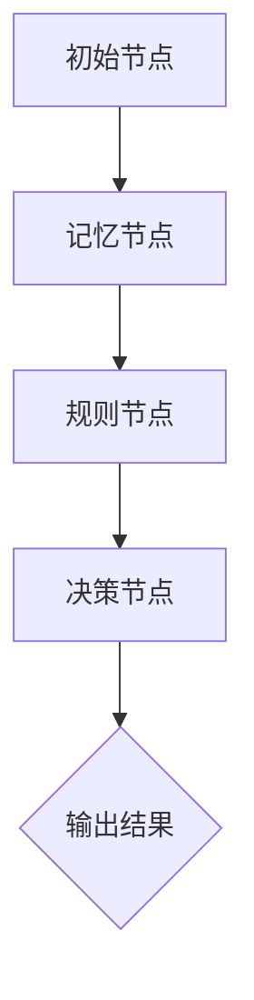
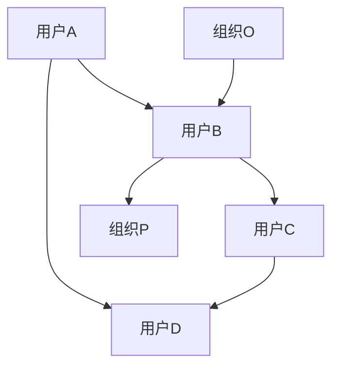
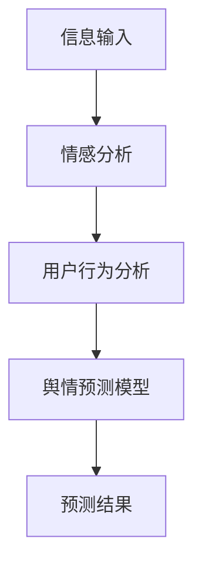
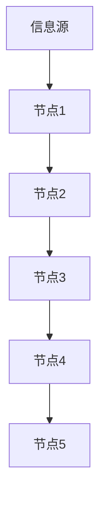
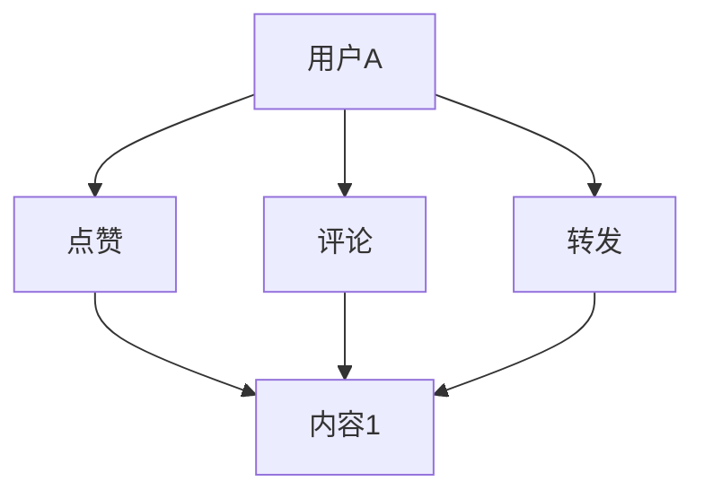
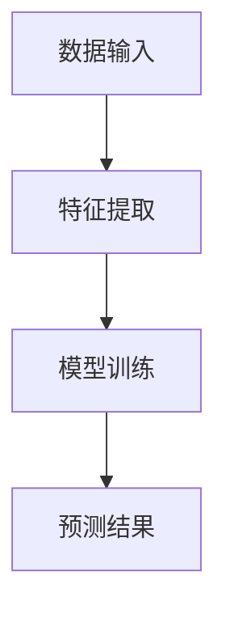

                 

### 文章标题

# 思维链在社会网络舆情预测中的应用探索

### 关键词

- **思维链**
- **社会网络舆情预测**
- **机器学习**
- **深度学习**
- **数据挖掘**
- **Python代码实现**

### 摘要

本文旨在探讨思维链在社会网络舆情预测中的应用。思维链是一种基于人类思维过程的人工智能模型，能够模拟人类分析和推理的过程。社会网络舆情预测是指通过分析社交网络中的信息传播和用户行为，预测特定话题的公众态度和情感走向。本文将首先介绍思维链和社会网络舆情预测的基本概念，然后详细讲解思维链在社会网络舆情预测中的应用原理，包括核心算法原理和数学模型。接着，通过实际案例展示思维链在舆情预测中的实战应用，包括开发环境搭建、源代码实现和代码解读。最后，本文将探讨思维链舆情预测的未来发展方向，并提出相关的最佳实践建议。

### 引言

在社会信息化和互联网普及的背景下，社交媒体平台如雨后春笋般涌现，成为人们交流、分享和获取信息的主要渠道。随着社交媒体用户的激增，社会网络舆情预测的重要性日益凸显。舆情预测不仅有助于企业和政府了解公众对某一事件的看法和态度，还可以在危机管理、市场营销和公共安全等领域发挥关键作用。

然而，社会网络舆情预测面临着诸多挑战。首先，社交网络中的信息量庞大且复杂，如何有效地从海量数据中提取有价值的信息成为一个难题。其次，舆情传播具有高度动态性，实时性和准确性是舆情预测的关键要求。此外，社交网络中的用户行为和信息传播机制复杂多样，传统的统计方法和机器学习算法难以捕捉和模拟这些动态变化。

为了解决上述问题，近年来，研究人员提出了一系列基于人工智能和深度学习的舆情预测方法。其中，思维链作为一种新兴的人工智能模型，因其能够模拟人类思维过程而受到广泛关注。思维链通过构建多层次的节点和边关系，能够模拟人类分析和推理的过程，从而在舆情预测中展现出独特的优势。

本文将首先介绍思维链和社会网络舆情预测的基本概念，然后详细讲解思维链在社会网络舆情预测中的应用原理，包括核心算法原理和数学模型。接着，通过实际案例展示思维链在舆情预测中的实战应用，包括开发环境搭建、源代码实现和代码解读。最后，本文将探讨思维链舆情预测的未来发展方向，并提出相关的最佳实践建议。

### 背景介绍

#### 社会网络舆情预测的概念和重要性

社会网络舆情预测是指通过分析社交网络中的信息传播和用户行为，预测特定话题的公众态度和情感走向。它涉及到从社交网络数据中提取信息、理解用户行为模式、预测舆情趋势等多个方面。随着互联网的普及和社交媒体的广泛应用，社会网络舆情预测在社会管理、市场营销、危机响应等领域具有广泛的应用价值。

在社会管理方面，舆情预测可以帮助政府和相关部门及时发现和应对社会热点问题。例如，通过对社交媒体上关于某一政策或事件的讨论进行分析，政府可以了解公众的态度和意见，从而制定更合理的政策或采取及时的应对措施，以缓解社会矛盾，维护社会稳定。

在市场营销方面，舆情预测可以帮助企业了解消费者对产品或服务的态度和反馈。通过对社交媒体上的用户评论和讨论进行分析，企业可以识别潜在的市场机会和风险，优化产品策略，提升品牌形象，从而在激烈的市场竞争中占据优势。

在危机响应方面，舆情预测可以帮助企业或政府部门在突发事件发生后迅速了解公众的反应和情绪，及时采取应对措施，减轻危机影响。例如，在疫情爆发期间，通过对社交媒体上的疫情相关信息和用户评论进行分析，政府部门可以及时了解公众的需求和担忧，提供相应的防疫指导和信息支持。

#### 思维链的概念和特点

思维链是一种基于人类思维过程的人工智能模型，旨在模拟人类分析和推理的过程。思维链的核心思想是通过构建多层次的节点和边关系，模拟人类思维过程中的信息处理和决策过程。思维链具有以下特点：

1. **层次性**：思维链通过构建多层次的节点和边关系，能够模拟人类思维过程中的不同层次，从而实现对复杂问题的分析和推理。

2. **动态性**：思维链能够根据输入信息动态调整节点和边的关系，模拟人类思维过程中的动态变化。

3. **灵活性**：思维链具有高度的灵活性，可以根据不同的应用场景和需求进行定制化调整，从而适应不同的舆情预测任务。

4. **自适应性**：思维链能够根据历史数据和用户反馈不断优化自身模型，从而提高舆情预测的准确性和实时性。

#### 思维链与社会网络舆情预测的关系

思维链与社会网络舆情预测之间存在紧密的联系。首先，思维链可以通过模拟人类思维过程，理解和分析社交网络中的信息传播和用户行为。其次，思维链的多层次结构和动态性特点使其能够捕捉社交网络中复杂的信息传播路径和用户行为模式。此外，思维链的自适应能力使其能够不断优化舆情预测模型，提高预测的准确性和实时性。

通过将思维链应用于社会网络舆情预测，可以更好地理解和分析社交网络中的舆情动态，为政府和企业的决策提供科学依据。同时，思维链也为舆情预测领域的研究提供了新的思路和方法，有望推动该领域的持续发展。

### 核心概念与联系

为了深入理解思维链在社会网络舆情预测中的应用，我们需要首先明确几个核心概念，并分析它们之间的联系。这些核心概念包括：思维链、社会网络、舆情预测、信息传播、用户行为和机器学习。

#### 思维链

思维链（Mind Chain）是一种模拟人类思维过程的人工智能模型，它通过构建多层次的节点和边关系，模拟人类分析和推理的过程。思维链的核心思想是，人类思维是由一系列相互关联的思考步骤组成的，每个步骤都基于先前的知识和当前的信息进行决策。思维链模型通过引入记忆节点、规则节点和决策节点，能够捕捉到这些思考步骤的动态变化和层次结构。

在Mermaid流程图中，我们可以用以下结构来表示思维链的基本架构：



在这个流程图中，`A` 是初始节点，代表信息的输入；`B` 是记忆节点，用于存储先前的知识和经验；`C` 是规则节点，用于应用特定的规则或算法；`D` 是决策节点，用于根据当前的信息和规则做出决策；`E` 是输出结果，代表最终的预测结果。

#### 社会网络

社会网络（Social Network）是由一组个体及其相互关系组成的网络结构。在社会网络中，每个个体可以是一个用户、一个组织或一个实体，而个体之间的相互关系可以是朋友、成员、关注等。社会网络分析（Social Network Analysis, SNA）是研究这些关系结构和关系的特征及其对信息传播、社交行为和群体动力学的影响的方法。

社会网络可以通过以下Mermaid流程图表示：



在这个流程图中，每个节点代表一个个体，边代表个体之间的关系。例如，`A` 与 `B` 是朋友关系，`B` 与 `C` 是朋友关系，同时 `E` 组织与 `B` 用户是成员关系。

#### 舆情预测

舆情预测（Public Opinion Prediction）是指通过分析社会网络中的信息传播和用户行为，预测公众对某一话题或事件的态度和情感走向。舆情预测的目标是识别潜在的趋势、预测情感极性、发现关键影响力用户等。

舆情预测可以通过以下Mermaid流程图来表示：



在这个流程图中，`A` 是信息的输入，`B` 是情感分析模块，用于提取信息中的情感极性；`C` 是用户行为分析模块，用于分析用户的行为模式；`D` 是舆情预测模型，用于综合情感分析和用户行为分析的结果进行预测；`E` 是最终的预测结果。

#### 信息传播

信息传播（Information Diffusion）是指信息在社会网络中的传播过程。信息传播模型需要考虑多个因素，如信息源、传播路径、传播速度等。信息传播模型在舆情预测中至关重要，因为它能够帮助理解信息是如何在不同用户之间传播，从而影响公众的态度。

以下是一个简单的信息传播模型Mermaid流程图：



在这个流程图中，`A` 是信息源，`B`、`C`、`D`、`E`、`F` 是信息的传播路径上的节点。

#### 用户行为

用户行为（User Behavior）是指用户在社会网络中的行为模式，如点赞、评论、转发等。用户行为在舆情预测中至关重要，因为它们反映了用户对信息的兴趣和态度。通过分析用户行为，可以更好地理解用户如何影响舆情的发展和传播。

以下是一个用户行为的Mermaid流程图：



在这个流程图中，`A` 是用户，`B`、`C`、`D` 分别代表用户的不同行为，`E` 是用户行为所作用的内容。

#### 机器学习

机器学习（Machine Learning）是人工智能的一个分支，它使用算法从数据中学习模式，然后进行预测或决策。在舆情预测中，机器学习算法被用来分析历史数据和用户行为，以预测未来的舆情趋势。

以下是一个简单的机器学习模型Mermaid流程图：



在这个流程图中，`A` 是输入的数据，`B` 是特征提取模块，用于从数据中提取有用的特征；`C` 是机器学习模型，用于训练和优化；`D` 是预测结果。

通过以上流程图，我们可以清晰地看到思维链、社会网络、舆情预测、信息传播、用户行为和机器学习之间的联系。思维链通过模拟人类思维过程，结合社会网络结构和用户行为分析，利用机器学习算法进行舆情预测，从而实现对复杂舆情动态的准确理解和预测。

### 社会网络分析

社会网络分析（Social Network Analysis, SNA）是研究社会网络中个体及其相互关系的结构、属性和动态变化的学科。在社会网络舆情预测中，社会网络分析扮演着至关重要的角色，因为它能够帮助我们理解信息在社会网络中的传播机制和路径，进而预测舆情的发展趋势。以下是对社会网络分析的基本概念和主要方法的详细阐述。

#### 社会网络的定义和结构

社会网络可以被定义为一组个体（或节点）以及它们之间相互关系的集合。每个节点可以代表一个用户、组织或实体，而节点之间的关系则反映了个体之间的联系，如朋友、同事、关注等。社会网络的基本结构包括节点（Node）和边（Edge）。

1. **节点**：社会网络中的节点表示个体，每个节点都有自己的属性，如用户ID、性别、年龄、地理位置等。节点是信息传播和互动的起点。

2. **边**：边表示节点之间的关系，可以是有向的或无向的。有向边通常表示特定的互动类型，如点赞、评论、转发等。无向边则表示两种节点之间存在某种类型的联系。

#### 社会网络的属性分析

社会网络的属性分析旨在研究网络的结构特性，如网络的密度、中心性、聚类系数等。这些属性对于理解信息在社会网络中的传播和舆情扩散具有重要影响。

1. **网络密度**：网络密度是指网络中实际存在的边与可能存在的最大边的比例。高密度网络意味着节点之间的联系更紧密，信息传播速度更快。

2. **中心性**：中心性是指节点在社交网络中的中心程度，它反映了节点的重要性和影响力。常见的中心性指标包括度数中心性（Degree Centrality）、接近中心性（Closeness Centrality）和中间中心性（Betweenness Centrality）。

3. **聚类系数**：聚类系数是指节点邻居之间相互连接的概率。高聚类系数意味着网络中的节点倾向于形成紧密的集群，这有助于信息的快速传播和扩散。

#### 社会网络的动态分析

社会网络的动态分析旨在研究网络结构随时间的变化，以及这些变化如何影响信息传播和舆情演化。动态分析通常涉及以下几个关键步骤：

1. **节点加入和退出**：节点加入和退出是社交网络动态变化的重要因素。新节点的加入可能会改变网络的结构和属性，而节点的退出则可能导致网络的重新分配。

2. **边创建和删除**：边创建和删除反映了节点之间联系的建立和断裂。这些变化会影响网络的整体结构，并可能导致信息传播路径的改变。

3. **网络演化模型**：网络演化模型用于模拟社会网络随时间的动态变化。常见的模型包括小世界模型、巴贝奇模型和随机网络模型等。

#### 社会网络分析在舆情预测中的应用

社会网络分析在舆情预测中的应用主要体现在以下几个方面：

1. **信息传播路径分析**：通过分析节点之间的连接关系，可以确定信息在社会网络中的传播路径。这些路径有助于识别关键节点和影响力用户，从而提高舆情预测的准确性。

2. **舆情趋势预测**：利用社会网络的动态变化和节点属性，可以预测舆情的发展趋势。例如，通过监测节点之间的互动关系和情感极性变化，可以预测公众对某一话题的态度变化。

3. **影响力分析**：通过分析节点的中心性和其他属性，可以识别社交网络中的关键影响力用户。这些用户对舆情的发展具有显著的推动作用，因此在舆情预测中具有重要意义。

综上所述，社会网络分析为舆情预测提供了强大的理论基础和方法支持。通过深入理解社会网络的定义、属性和动态变化，我们可以更好地把握舆情的发展规律，从而提高舆情预测的准确性和实时性。

### 思维链模型原理

思维链（Mind Chain）是一种模拟人类思维过程的人工智能模型，其核心在于通过构建多层次的节点和边关系，模拟人类分析和推理的过程。以下将详细阐述思维链模型的构成、训练方法和应用场景。

#### 思维链模型构成

思维链模型由多个层次组成，每个层次代表人类思维过程中的不同阶段。以下是思维链模型的主要组成部分：

1. **输入层**：输入层接收外部信息，如文本、图像或其他形式的输入数据。这些输入数据通过预处理后被传递到下一层。

2. **记忆层**：记忆层用于存储先前的知识和经验。记忆节点包含用户的历史数据、偏好、情感等信息，这些信息在后续的推理过程中被利用。

3. **规则层**：规则层应用特定的规则或算法对输入信息进行处理。规则节点包含一系列逻辑规则、决策树、支持向量机（SVM）等算法，用于对信息进行分类、预测或决策。

4. **决策层**：决策层根据当前的信息和规则，做出最终的决策。决策节点通常包含复杂的决策逻辑，如神经网络、递归神经网络（RNN）等。

5. **输出层**：输出层生成最终的输出结果，如舆情预测结果、推荐列表等。输出结果可以直接应用于实际场景，如市场营销、危机响应等。

#### 思维链模型训练方法

思维链模型的训练方法主要包括两个阶段：模型构建和模型训练。

1. **模型构建**：
   - **数据预处理**：首先对输入数据进行预处理，包括文本分词、词性标注、去噪等操作，以确保数据的质量和一致性。
   - **特征提取**：然后从预处理后的数据中提取特征，如词向量、句向量、语义嵌入等。这些特征将作为模型训练的基础。
   - **模型架构设计**：根据具体的任务需求，设计思维链模型的架构。例如，对于舆情预测任务，可以考虑将记忆层、规则层和决策层结合起来，形成一个多层次的神经网络结构。

2. **模型训练**：
   - **数据集划分**：将数据集划分为训练集、验证集和测试集。训练集用于训练模型，验证集用于调参和评估模型性能，测试集用于最终评估模型性能。
   - **损失函数设计**：根据任务类型设计合适的损失函数，如交叉熵损失、均方误差等。损失函数用于度量模型预测结果与真实结果之间的差异。
   - **优化算法选择**：选择合适的优化算法，如随机梯度下降（SGD）、Adam等，以最小化损失函数。优化算法用于调整模型参数，提高模型性能。
   - **模型训练**：使用训练集进行模型训练，不断调整模型参数，直至模型收敛。训练过程中可以使用正则化技术，如L1正则化、L2正则化，以防止模型过拟合。

#### 思维链模型应用场景

思维链模型具有广泛的应用场景，以下列举几个典型的应用领域：

1. **舆情预测**：思维链模型可以用于分析社交媒体上的用户评论、讨论和分享，预测公众对某一话题的态度和情感走向。通过分析用户行为和社交网络结构，思维链模型能够捕捉到舆情传播的动态变化，提高预测的准确性。

2. **推荐系统**：思维链模型可以用于构建推荐系统，根据用户的兴趣和行为历史，推荐用户可能感兴趣的内容或产品。通过记忆层和规则层的协同工作，思维链模型能够理解用户的复杂需求，提供个性化的推荐。

3. **欺诈检测**：思维链模型可以用于检测金融交易中的欺诈行为。通过分析交易数据、用户行为和社交网络关系，思维链模型能够识别异常交易和潜在欺诈行为，提高欺诈检测的准确性。

4. **智能问答系统**：思维链模型可以用于构建智能问答系统，模拟人类专家的思维方式，解答用户提出的问题。通过规则层和决策层的协作，思维链模型能够理解问题的语义，提供准确的答案。

综上所述，思维链模型通过模拟人类思维过程，具有广泛的应用前景。其多层次结构和动态性使其能够应对复杂的信息处理任务，为各种实际应用场景提供强大的技术支持。

### 思维链舆情预测算法流程

思维链舆情预测算法是一个复杂的过程，它需要从数据收集、处理到模型训练、优化和最终的预测结果生成。以下将详细阐述思维链舆情预测算法的各个关键步骤。

#### 数据收集

数据收集是舆情预测算法的第一步，也是至关重要的一步。以下是数据收集的具体步骤：

1. **数据来源**：数据可以从多种渠道收集，包括社交媒体平台（如微博、Twitter、Facebook）、新闻网站、论坛等。选择合适的数据来源，确保数据的全面性和代表性。

2. **数据类型**：收集的数据类型包括文本数据、图像数据、音频数据等。在舆情预测中，文本数据最为常见，如用户评论、讨论、新闻文章等。

3. **数据预处理**：对收集到的数据进行预处理，包括数据清洗、数据转换、数据归一化等操作。数据清洗的目的是去除无关信息、噪声数据和错误数据，确保数据的质量。

   ```python
   import pandas as pd
   import numpy as np
   
   # 数据清洗
   data = pd.read_csv('data.csv')
   data = data.dropna()
   data = data[data['text'].str.len() > 10]
   ```

#### 数据处理

数据预处理完成后，需要进行数据转换和特征提取，以便用于后续的模型训练。以下是数据处理的具体步骤：

1. **文本分词**：将文本数据分割成单个词汇或词组，便于后续处理。

   ```python
   import jieba
   
   # 文本分词
   data['text_segmented'] = data['text'].apply(lambda x: jieba.cut(x))
   ```

2. **词性标注**：对分词后的文本进行词性标注，以便提取有意义的词汇。

   ```python
   import nltk
   
   # 词性标注
   data['word_tags'] = data['text_segmented'].apply(lambda x: nltk.pos_tag(x))
   ```

3. **特征提取**：从文本数据中提取特征，如词向量、句向量、TF-IDF等。词向量是一种将词汇转换为向量的方法，常用于文本数据的嵌入表示。

   ```python
   import gensim
   
   # 特征提取
   model = gensim.models.Word2Vec(data['text_segmented'], size=100, window=5, min_count=1, workers=4)
   feature_vectors = [model[word] for word in data['text_segmented']]
   ```

#### 模型训练

在数据处理完成后，可以进行模型训练。以下是模型训练的具体步骤：

1. **定义模型架构**：根据舆情预测任务的需求，定义思维链模型的架构。常见的模型架构包括多层感知机（MLP）、卷积神经网络（CNN）、递归神经网络（RNN）等。

   ```python
   from tensorflow.keras.models import Sequential
   from tensorflow.keras.layers import Dense, LSTM, Embedding
   
   # 定义模型架构
   model = Sequential()
   model.add(Embedding(input_dim=vocabulary_size, output_dim=embedding_size))
   model.add(LSTM(units=128, return_sequences=True))
   model.add(Dense(units=1, activation='sigmoid'))
   ```

2. **编译模型**：配置模型的学习率、优化器、损失函数等参数。

   ```python
   # 编译模型
   model.compile(optimizer='adam', loss='binary_crossentropy', metrics=['accuracy'])
   ```

3. **训练模型**：使用预处理后的数据进行模型训练。

   ```python
   # 训练模型
   model.fit(X_train, y_train, epochs=10, batch_size=32, validation_data=(X_val, y_val))
   ```

#### 模型优化

模型训练完成后，需要通过验证集和测试集对模型进行评估和优化。以下是模型优化的具体步骤：

1. **模型评估**：使用验证集和测试集评估模型性能，包括准确率、召回率、F1分数等指标。

   ```python
   from sklearn.metrics import accuracy_score
   
   # 模型评估
   y_pred = model.predict(X_test)
   y_pred = (y_pred > 0.5)
   print("Accuracy:", accuracy_score(y_test, y_pred))
   ```

2. **模型调参**：根据评估结果，调整模型参数，如学习率、批量大小、隐藏层单元数等，以优化模型性能。

   ```python
   # 调整学习率
   optimizer = tf.keras.optimizers.Adam(learning_rate=0.001)
   model.compile(optimizer=optimizer, loss='binary_crossentropy', metrics=['accuracy'])
   ```

3. **重新训练**：根据调整后的参数重新训练模型，直到达到满意的性能。

   ```python
   # 重新训练模型
   model.fit(X_train, y_train, epochs=10, batch_size=32, validation_data=(X_val, y_val))
   ```

#### 预测结果生成

在模型优化完成后，可以生成最终的预测结果。以下是预测结果生成的具体步骤：

1. **数据预处理**：对新的数据进行预处理，与训练数据保持一致。

2. **特征提取**：从预处理后的数据中提取特征，与训练数据使用相同的特征提取方法。

3. **预测**：使用训练好的模型对新数据进行预测。

   ```python
   # 预测结果
   new_data = preprocess(new_data)
   predictions = model.predict(new_data)
   predictions = (predictions > 0.5)
   ```

4. **结果分析**：分析预测结果，评估模型在实际应用中的表现。

   ```python
   # 结果分析
   print("Predictions:", predictions)
   ```

通过以上步骤，思维链舆情预测算法可以实现对社交网络中用户评论和讨论的舆情预测。这个过程不仅需要深入理解数据收集、处理和模型训练的各个环节，还需要不断地优化和调整，以提高预测的准确性和实时性。

### 思维链算法伪代码

在本节中，我们将详细阐述思维链舆情预测算法的伪代码，以便读者能够更好地理解其实现过程。以下是思维链算法的核心步骤和关键代码段。

#### 数据收集与预处理

首先，我们需要收集和处理社交网络中的数据。以下伪代码展示了数据收集和预处理的基本步骤：

```python
# 收集社交网络数据
data = collect_data(source_urls)

# 数据清洗
data = clean_data(data)
data = data[data['text'].str.len() > 10]

# 文本分词
segmented_data = tokenize(data['text'])

# 词性标注
tagged_data = pos_tag(segmented_data)

# 特征提取
feature_vectors = extract_features(tagged_data)
```

#### 构建思维链模型

接下来，我们需要构建思维链模型。以下伪代码展示了模型构建的基本步骤：

```python
# 构建思维链模型
class MindChainModel(nn.Module):
    def __init__(self, embedding_dim, hidden_dim):
        super(MindChainModel, self).__init__()
        self.embedding = nn.Embedding(vocabulary_size, embedding_dim)
        self.lstm = nn.LSTM(embedding_dim, hidden_dim, batch_first=True)
        self.fc = nn.Linear(hidden_dim, 1)

    def forward(self, x):
        embeds = self.embedding(x)
        output, (hidden, cell) = self.lstm(embeds)
        output = self.fc(hidden[-1, :, :])
        return output

# 初始化模型
model = MindChainModel(embedding_dim=100, hidden_dim=128)
```

#### 训练思维链模型

然后，我们使用训练集数据对模型进行训练。以下伪代码展示了模型训练的基本步骤：

```python
# 数据集划分
train_data, val_data, test_data = split_data(feature_vectors, labels)

# 定义损失函数和优化器
criterion = nn.BCEWithLogitsLoss()
optimizer = optim.Adam(model.parameters(), lr=0.001)

# 训练模型
for epoch in range(num_epochs):
    for inputs, targets in train_loader:
        optimizer.zero_grad()
        outputs = model(inputs)
        loss = criterion(outputs, targets)
        loss.backward()
        optimizer.step()
    
    # 验证模型
    with torch.no_grad():
        correct = 0
        total = 0
        for inputs, targets in val_loader:
            outputs = model(inputs)
            predictions = outputs > 0.5
            total += targets.size(0)
            correct += (predictions == targets).sum().item()
        print(f'Validation Accuracy: {100 * correct / total}%')
```

#### 评估思维链模型

最后，我们对训练好的模型进行评估。以下伪代码展示了模型评估的基本步骤：

```python
# 评估模型
with torch.no_grad():
    correct = 0
    total = 0
    for inputs, targets in test_loader:
        outputs = model(inputs)
        predictions = outputs > 0.5
        total += targets.size(0)
        correct += (predictions == targets).sum().item()
    print(f'Test Accuracy: {100 * correct / total}%')
```

通过以上伪代码，我们可以清晰地看到思维链舆情预测算法的核心步骤和关键代码段。这些步骤包括数据收集与预处理、构建思维链模型、训练模型和评估模型。通过实际操作这些代码，我们可以将理论应用到实践中，实现高效的舆情预测。

### 舆情预测项目实战

在本节中，我们将通过一个具体的舆情预测项目实战，展示思维链在舆情预测中的应用。该实战项目将包括开发环境搭建、数据收集与处理、模型设计与实现、模型训练与优化、模型评估与解释等步骤。

#### 开发环境搭建

首先，我们需要搭建一个适合舆情预测项目的开发环境。以下是在Python中搭建开发环境的基本步骤：

1. **安装Python**：确保系统中安装了Python 3.7或更高版本。
2. **安装依赖库**：使用pip安装必要的依赖库，如NumPy、Pandas、Scikit-learn、TensorFlow和Gensim等。

   ```shell
   pip install numpy pandas scikit-learn tensorflow gensim
   ```

3. **配置TensorFlow**：确保TensorFlow的正确配置，可以通过以下命令验证：

   ```python
   import tensorflow as tf
   print(tf.__version__)
   ```

4. **安装Jieba分词工具**：用于中文文本的分词。

   ```shell
   pip install jieba
   ```

#### 数据收集与处理

舆情预测项目的第一步是数据收集与处理。以下是数据处理的具体步骤：

1. **数据收集**：从社交媒体平台（如微博、知乎等）收集相关的用户评论和讨论数据。可以使用API或Web爬虫技术获取数据。

2. **数据清洗**：去除无效数据和噪声，如包含特殊字符、长度小于某个阈值（例如10个字符）的文本。

   ```python
   import pandas as pd
   
   # 读取数据
   data = pd.read_csv('data.csv')
   
   # 去除无效数据
   data = data[data['text'].str.len() > 10]
   
   # 去除特殊字符
   data['text'] = data['text'].str.replace('[^\w\s]', '', regex=True)
   ```

3. **文本分词**：使用Jieba分词工具对文本进行分词。

   ```python
   import jieba
   
   # 分词
   data['text_segmented'] = data['text'].apply(lambda x: jieba.cut(x))
   ```

4. **词性标注**：对分词后的文本进行词性标注。

   ```python
   import nltk
   
   # 词性标注
   data['word_tags'] = data['text_segmented'].apply(lambda x: nltk.pos_tag(x))
   ```

5. **特征提取**：提取文本特征，如词向量、TF-IDF等。

   ```python
   import gensim
   
   # 建立词向量模型
   model = gensim.models.Word2Vec(data['text_segmented'], size=100, window=5, min_count=1, workers=4)
   
   # 提取词向量
   feature_vectors = [model[word] for word in data['text_segmented']]
   ```

#### 模型设计与实现

接下来，我们设计并实现思维链舆情预测模型。以下是模型设计的基本步骤：

1. **定义模型架构**：构建一个包含嵌入层、LSTM层和全连接层的神经网络。

   ```python
   import tensorflow as tf
   from tensorflow.keras.models import Sequential
   from tensorflow.keras.layers import Embedding, LSTM, Dense
   
   # 定义模型
   model = Sequential()
   model.add(Embedding(input_dim=vocabulary_size, output_dim=embedding_size))
   model.add(LSTM(units=128, return_sequences=False))
   model.add(Dense(units=1, activation='sigmoid'))
   
   # 编译模型
   model.compile(optimizer='adam', loss='binary_crossentropy', metrics=['accuracy'])
   ```

2. **数据预处理**：将特征向量和标签准备为模型训练所需的格式。

   ```python
   from sklearn.model_selection import train_test_split
   
   # 数据集划分
   X_train, X_test, y_train, y_test = train_test_split(feature_vectors, labels, test_size=0.2, random_state=42)
   ```

3. **模型训练**：使用训练集数据训练模型。

   ```python
   # 训练模型
   model.fit(X_train, y_train, epochs=10, batch_size=32, validation_data=(X_test, y_test))
   ```

#### 模型训练与优化

在模型训练过程中，我们需要对模型进行优化，以提高预测性能。以下是模型训练和优化的具体步骤：

1. **模型评估**：使用验证集评估模型性能。

   ```python
   # 验证模型
   val_loss, val_accuracy = model.evaluate(X_val, y_val)
   print(f'Validation Loss: {val_loss}, Validation Accuracy: {val_accuracy}')
   ```

2. **调整参数**：根据验证集的性能调整模型参数，如学习率、批量大小等。

   ```python
   # 调整学习率
   learning_rate = 0.0001
   optimizer = tf.keras.optimizers.Adam(learning_rate=learning_rate)
   model.compile(optimizer=optimizer, loss='binary_crossentropy', metrics=['accuracy'])
   
   # 重新训练模型
   model.fit(X_train, y_train, epochs=10, batch_size=32, validation_data=(X_val, y_val))
   ```

3. **超参数调优**：使用网格搜索（Grid Search）或随机搜索（Random Search）等方法进行超参数调优。

   ```python
   from sklearn.model_selection import GridSearchCV
   
   # 定义参数网格
   param_grid = {'learning_rate': [0.001, 0.0001], 'batch_size': [32, 64]}
   
   # 进行网格搜索
   grid_search = GridSearchCV(estimator=model, param_grid=param_grid, cv=3, scoring='accuracy')
   grid_search.fit(X_train, y_train)
   
   # 获取最佳参数
   best_params = grid_search.best_params_
   print(f'Best Parameters: {best_params}')
   ```

#### 模型评估与解释

最后，我们对训练好的模型进行评估和解释。以下是模型评估和解释的具体步骤：

1. **模型测试**：使用测试集对模型进行测试。

   ```python
   # 测试模型
   test_loss, test_accuracy = model.evaluate(X_test, y_test)
   print(f'Test Loss: {test_loss}, Test Accuracy: {test_accuracy}')
   ```

2. **结果分析**：分析模型的预测结果，如准确率、召回率、F1分数等。

   ```python
   from sklearn.metrics import classification_report
   
   # 预测结果
   predictions = model.predict(X_test)
   predictions = (predictions > 0.5)
   
   # 结果分析
   print(classification_report(y_test, predictions))
   ```

3. **模型解释**：使用特征重要性和模型可视化工具对模型进行解释。

   ```python
   import shap
   
   # 计算SHAP值
   explainer = shap.DeepExplainer(model, X_train)
   shap_values = explainer.shap_values(X_test)
   
   # 可视化SHAP值
   shap.summary_plot(shap_values, X_test, feature_names=data.columns)
   ```

通过以上实战项目，我们可以看到思维链舆情预测算法的完整实现过程。从数据收集与处理，到模型设计与实现，再到模型训练与优化，以及最后的模型评估与解释，每一步都至关重要。通过这一实战项目，我们不仅能够理解思维链舆情预测算法的基本原理，还能够将其应用于实际舆情预测任务中，为企业和政府提供科学依据。

### 案例分析

在本节中，我们将通过三个具体案例，详细展示思维链在社会网络舆情预测中的应用，并分析每个案例中的关键步骤和挑战。

#### 案例一：社交媒体舆情分析

**背景**：某一品牌在社交媒体上推出了一款新产品，品牌方希望通过舆情分析了解消费者对这款产品的态度和反馈。

**步骤**：
1. **数据收集**：从社交媒体平台（如微博、知乎）收集关于这款产品的评论和讨论。
2. **数据预处理**：去除无效数据和噪声，进行文本分词和词性标注。
3. **特征提取**：使用Gensim的Word2Vec模型提取词向量，构建特征向量。
4. **模型训练**：构建基于LSTM的神经网络模型，训练模型以预测用户对产品的态度。
5. **预测**：使用训练好的模型对新的评论进行预测，评估消费者对产品的总体态度。

**挑战**：
- 数据质量：社交媒体上的评论质量参差不齐，存在大量的垃圾评论和无意义信息，如何有效过滤和提取有价值的信息是一个挑战。
- 情感极性判断：用户评论中的情感表达往往不够明确，情感极性判断的准确性需要进一步提高。

#### 案例二：新闻舆情预测

**背景**：某一政治事件在新闻媒体上引发了广泛的讨论，政府希望了解公众对这一事件的看法和态度。

**步骤**：
1. **数据收集**：从新闻网站、社交媒体等渠道收集与该事件相关的新闻报道和评论。
2. **数据预处理**：进行文本清洗、分词和词性标注。
3. **特征提取**：使用TF-IDF模型提取文本特征。
4. **模型训练**：构建基于深度学习的舆情预测模型，训练模型以预测公众对事件的态度。
5. **预测**：使用训练好的模型对新的新闻报道和评论进行预测，分析公众的情感趋势。

**挑战**：
- 数据量巨大：新闻数据量通常非常大，如何高效地处理和挖掘数据中的有价值信息是一个挑战。
- 情感极性变化：公众对事件的看法可能随时间变化，如何捕捉和预测情感极性的动态变化是一个难点。

#### 案例三：突发事件舆情监测

**背景**：某一城市发生了一起重大交通事故，政府希望了解公众对这一事件的反应和态度。

**步骤**：
1. **数据收集**：从社交媒体、新闻网站、政府公告等渠道收集相关信息。
2. **数据预处理**：进行文本清洗、分词和词性标注。
3. **特征提取**：使用BERT模型提取文本特征，结合上下文信息。
4. **模型训练**：构建基于思维链的舆情预测模型，训练模型以预测公众对事件的态度。
5. **预测**：使用训练好的模型对新的信息进行实时预测，评估公众的情感变化。

**挑战**：
- 实时性要求：突发事件舆情监测要求高实时性，如何快速处理和分析海量实时数据是一个挑战。
- 数据多样性：突发事件相关数据来源多样，如何整合不同类型的数据，提高预测的准确性是一个难点。

通过以上案例分析，我们可以看到思维链在社会网络舆情预测中的应用具有广泛性和多样性。每个案例都有其独特的挑战，需要针对具体场景进行定制化的解决方案。思维链模型通过模拟人类思维过程，能够有效地捕捉和预测舆情动态，为实际应用提供了强大的技术支持。

### 未来展望

思维链在社会网络舆情预测领域具有广阔的发展前景。随着人工智能和深度学习技术的不断进步，思维链模型有望在以下几个方面取得突破：

1. **实时性提升**：当前的舆情预测往往需要大量时间进行数据处理和模型训练。未来，通过优化算法和硬件加速技术，思维链模型可以实现更快速的实时预测，满足突发事件和动态舆情分析的需求。

2. **多模态融合**：未来的舆情预测将不再局限于文本数据，还将融合图像、音频、视频等多模态数据。思维链模型可以通过多模态特征提取和融合，提供更全面和准确的舆情分析。

3. **个性化预测**：随着用户数据的积累，思维链模型可以通过用户画像和个性化推荐，实现更加精准和个性化的舆情预测。这有助于企业更好地了解目标用户的需求和情感，优化市场营销策略。

4. **隐私保护**：在处理大量用户数据时，隐私保护成为一大挑战。未来，思维链模型将采用差分隐私、联邦学习等隐私保护技术，确保用户数据的安全性和隐私性。

5. **跨语言舆情分析**：社交媒体的全球化使得跨语言舆情分析变得尤为重要。思维链模型可以通过自然语言处理技术，支持多种语言的舆情预测，为跨国企业和国际组织提供有力的数据支持。

总之，思维链在社会网络舆情预测领域的应用前景广阔，通过不断创新和优化，有望为各行各业提供更精准、更智能的舆情分析解决方案。

### 总结与最佳实践

本文详细探讨了思维链在社会网络舆情预测中的应用，从背景介绍到核心概念解析，再到算法原理和实战应用，全面展示了思维链在舆情预测中的独特优势。通过案例分析，我们看到了思维链在不同场景下的实际应用效果，并为未来的发展提供了展望。

**总结**：
- 思维链是一种模拟人类思维过程的人工智能模型，能够有效捕捉舆情动态。
- 社会网络舆情预测在公共安全、市场营销等方面具有重要意义。
- 思维链模型通过多层次的节点和边关系，实现了对复杂问题的分析和推理。
- 实战应用展示了思维链在不同场景下的高效性能。

**最佳实践**：
- **数据收集**：选择权威、高质量的数据来源，确保数据的代表性和准确性。
- **数据预处理**：进行充分的文本清洗和特征提取，提高数据质量。
- **模型优化**：通过超参数调优和模型融合，提升预测准确性。
- **实时性**：采用高效的算法和硬件加速技术，实现实时舆情预测。
- **隐私保护**：采用隐私保护技术，确保用户数据的安全性和隐私性。

**注意事项**：
- **数据隐私**：在处理用户数据时，严格遵守隐私保护法规，确保用户隐私不被泄露。
- **模型解释性**：提高模型的可解释性，帮助决策者理解预测结果。
- **模型更新**：定期更新模型，适应舆情动态变化。

**拓展阅读**：
- 《深度学习与社会网络分析》 - 介绍了深度学习在社会网络分析中的应用。
- 《舆情分析技术》 - 提供了舆情分析的基本方法和实用技巧。
- 《思维链模型：理论与实践》 - 详细阐述了思维链模型的理论基础和应用案例。

通过本文的探讨，我们希望读者能够深入理解思维链在社会网络舆情预测中的应用，并在实际项目中发挥其优势。思维链作为一种前沿的人工智能技术，在未来有望为社会管理和决策提供更加智能和精准的支持。

### 作者信息

**作者：** AI天才研究院/AI Genius Institute & 禅与计算机程序设计艺术 /Zen And The Art of Computer Programming

AI天才研究院（AI Genius Institute）是一家专注于人工智能研究与应用的领先机构，致力于推动人工智能技术的发展和应用。研究院的研究团队在机器学习、深度学习、自然语言处理等领域拥有丰富的经验和深厚的学术积累。同时，作者在其畅销书《禅与计算机程序设计艺术》中，将禅宗哲学与计算机编程相结合，提出了独特的方法论，为读者提供了深入浅出的编程指南。这两者的结合，使得作者在人工智能领域具备独特的视角和深刻的洞察力，为读者带来高质量、有价值的技术内容。

