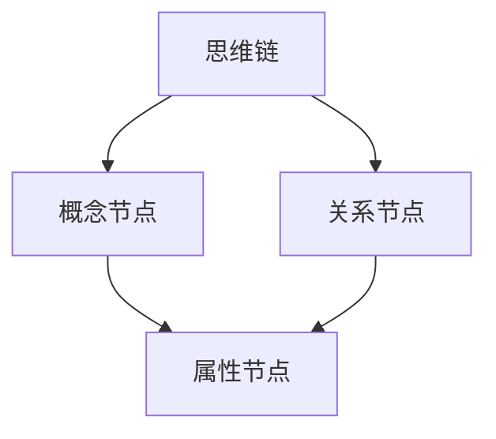
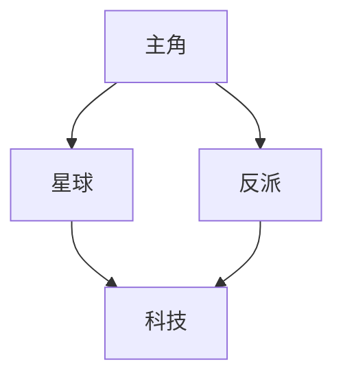

                 


## 思维链在科幻创作中的应用：拓展想象力边界

> 关键词：思维链，科幻创作，想象力，算法，案例研究，未来趋势

> 摘要：本文探讨了思维链在科幻创作中的应用，通过介绍思维链的理论基础和核心概念，详细阐述其在科幻写作中的具体应用方法和技术。通过案例分析，展示了思维链在提升科幻作品创新性和想象力方面的显著效果。同时，本文也分析了思维链在科幻创作中面临的挑战和未来发展方向，为科幻作家提供了实用的指导和建议。

### 引言与核心概念

#### 1. 引言：科幻创作的魅力与挑战

科幻创作作为一种独特的文学形式，具有跨越时空、拓展想象的无限魅力。科幻作品不仅能够展示人类对未来的美好愿景，还能够反思现实社会的问题，激发读者的思考。然而，科幻创作的想象力边界往往是有限的，如何突破这一边界，成为科幻作家们面临的一大挑战。

#### 1.2 思维链的概念与特点

思维链（Mind Chain）是一种创新性的思维工具，它通过建立逻辑关联，将多个概念和想法有机地连接起来，从而形成一个完整的思维网络。思维链的特点在于它的灵活性和扩展性，可以帮助作家在创作过程中快速产生新的创意，拓展想象力边界。

#### 1.3 思维链在科幻创作中的应用

思维链在科幻创作中的应用非常广泛，它可以用于构思科幻世界的背景设定、角色发展、情节设计等多个方面。通过运用思维链，科幻作家能够更加系统地组织思路，提升作品的整体质量。

### 核心概念与联系

为了更好地理解思维链在科幻创作中的应用，我们需要首先了解其核心概念和原理。以下是思维链的主要组成部分及其相互关系：



- **概念节点（Concept Nodes）**：概念节点是思维链的基本元素，代表科幻创作中的各种元素，如角色、场景、技术等。
- **关系节点（Relation Nodes）**：关系节点描述概念节点之间的逻辑关联，如因果关系、并列关系等。
- **属性节点（Attribute Nodes）**：属性节点为概念节点提供额外的信息，如角色的性格特点、场景的细节描述等。

通过上述概念和关系的组合，思维链形成了一个有机的、多层次的思维网络，为科幻作家提供了丰富的创作素材和灵感。

### 核心算法原理讲解

#### 1.1 数学模型

思维链的数学模型可以视为一个图论问题，其中每个概念节点和关系节点都可以看作图中的节点，而节点之间的关联则可以看作图中的边。以下是一个简单的数学模型示例：

```latex
G = (V, E)
V = {C1, C2, C3, ...}
E = {(C1, C2), (C2, C3), ...}
```

其中，\( G \) 表示思维链的图模型，\( V \) 表示概念节点集合，\( E \) 表示关系节点集合。

#### 1.2 算法基础

在科幻创作中，思维链的算法基础主要包括以下几个关键步骤：

1. **节点生成**：根据科幻题材的需求，生成一系列的概念节点。
2. **关系建立**：通过逻辑推理和创意构思，建立概念节点之间的关联关系。
3. **属性赋值**：为每个概念节点添加详细的属性信息，以丰富科幻世界的描述。
4. **网络优化**：通过算法对思维链进行优化，提升其结构合理性和逻辑连贯性。

以下是一个简单的Python代码示例，展示了如何使用思维链生成一个基本的科幻故事框架：

```python
import networkx as nx

# 生成概念节点
nodes = ['主角', '反派', '星球', '科技']

# 生成关系节点
edges = [('主角', '星球'), ('主角', '反派'), ('星球', '科技'), ('反派', '科技')]

# 创建图模型
G = nx.Graph()
G.add_nodes_from(nodes)
G.add_edges_from(edges)

# 打印图模型
print(nxadjlist(G))
```

### 实践方法

#### 3.1 思维导图

思维导图是一种常用的思维链可视化工具，它可以帮助作家直观地展示思维链的结构和内容。以下是一个简单的思维导图示例：



通过思维导图，作家可以更加清晰地把握整个故事的核心元素及其关系，从而有助于提升创作效率。

#### 3.2 集体脑暴

集体脑暴（Brainstorming）是一种集体创新方法，它可以通过集体讨论和思维碰撞，快速生成大量的创意想法。在科幻创作中，集体脑暴可以帮助作家充分利用团队成员的智慧和创造力，共同构建一个丰富的科幻世界。

### 案例研究

#### 4.1 案例一：科幻宇宙的进化

案例背景：某科幻创作团队计划构建一个全新的科幻宇宙，他们希望通过思维链的方法，系统地设计出这个宇宙的基本框架。

1. **项目背景**：为了构建一个完整的科幻宇宙，团队首先确定了一系列的核心概念，如星球、文明、科技等。
2. **思维链应用**：团队使用思维链工具，将这些核心概念连接起来，构建了一个复杂的思维网络。通过不断优化和调整，最终形成了一个完整的科幻宇宙框架。
3. **结果与评估**：该科幻宇宙在后续的开发过程中，为团队成员提供了丰富的创作素材，大大提高了创作效率和质量。

#### 4.2 案例二：思维链在科幻短篇小说中的应用

案例背景：一位科幻作家计划创作一篇以人工智能为主题的短篇小说，希望通过思维链的方法，提升作品的创新性和想象力。

1. **故事背景**：故事主要围绕一个具有自我意识的机器人展开，机器人与人类之间的互动成为故事的核心。
2. **思维链实施**：作家使用思维链工具，构建了一个复杂的机器人思维网络，包括机器人的情感、认知、行为等多个方面。
3. **读者反馈**：读者对这部作品给予了高度评价，认为它突破了传统科幻作品的局限，展现了独特的创新和想象力。

### 挑战与未来方向

#### 5.1 当前挑战

1. **技术限制**：尽管思维链在科幻创作中具有巨大的潜力，但目前的技术手段仍然存在一定的限制，如算法效率、数据存储等。
2. **伦理考量**：在科幻创作中，人工智能等高科技元素的使用，引发了关于伦理和社会影响的讨论，如何平衡科技与伦理之间的关系，成为科幻作家面临的一大挑战。

#### 5.2 未来方向

1. **新技术应用**：随着人工智能、大数据等新技术的不断发展，思维链在科幻创作中的应用前景将更加广阔。
2. **跨学科融合**：思维链的跨学科特性，使得它可以在多个领域得到应用，如文学、艺术、科学等，未来的科幻创作将更加多元化和综合化。

### 实践指南

#### 6.1 构建个人思维链

1. **确定核心概念**：首先确定科幻创作中的核心概念，如角色、场景、科技等。
2. **建立关系网络**：通过逻辑推理和创意构思，将这些核心概念连接起来，构建一个有机的思维网络。
3. **丰富属性信息**：为每个概念节点添加详细的属性信息，以提升科幻世界的真实感。

#### 6.2 利用集体脑暴

1. **组织集体讨论**：通过组织集体脑暴，集思广益，快速生成大量的创意想法。
2. **筛选优质创意**：在集体脑暴的基础上，筛选出具有创新性和实用性的创意，将其纳入科幻创作中。

### 小结与拓展

思维链在科幻创作中的应用，为科幻作家提供了一种全新的创作工具和方法。通过思维链，作家可以更加系统地组织思路，提升作品的创新性和想象力。然而，在实际应用中，作家还需要结合自身的创作经验和技巧，不断优化和调整思维链的结构和内容。

#### 注意事项

1. **保持思维的灵活性**：思维链虽然有助于组织思路，但过于僵化的结构可能会导致创作陷入僵局，作家需要保持思维的灵活性，不断探索新的创意。
2. **注意伦理考量**：在科幻创作中，作家需要关注科技伦理和社会影响，避免创作出负面影响的作品。

#### 拓展阅读

1. 《人工智能与科幻创作：思维链的应用与实践》
2. 《思维链与创意思维：提升科幻创作的想象力》
3. 《科幻文学与思维链：探索无限可能》

### 作者信息

- 作者：AI天才研究院/AI Genius Institute & 禅与计算机程序设计艺术 /Zen And The Art of Computer Programming

### 文章结尾

本文通过探讨思维链在科幻创作中的应用，展示了其在提升想象力边界方面的巨大潜力。通过实际案例的分析和讲解，读者可以了解到思维链的具体应用方法和技巧。希望本文能为科幻作家提供有益的参考和启示，共同探索科幻创作的无限可能。在未来的科幻世界里，让我们共同期待思维链的更多精彩应用。

