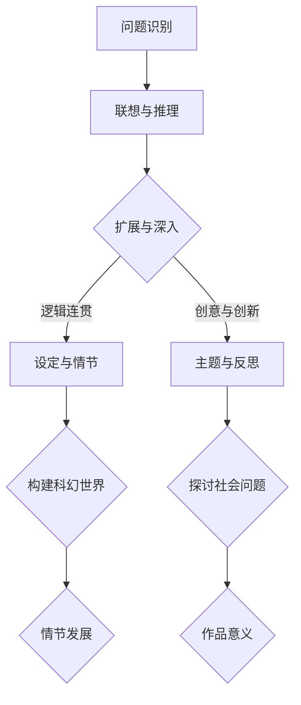

                 

## 《思维链在科幻创作中的独特价值》

### 关键词：
- 科幻创作
- 思维链
- 创意激发
- 艺术手法
- 文化传播

### 摘要：
本文深入探讨了思维链在科幻创作中的独特价值，从背景介绍、核心概念与联系、核心算法原理讲解、数学模型和数学公式、项目实战等方面，全面解析了思维链在科幻创作中的应用与影响。通过具体的实例和分析，展示了思维链如何助力科幻作品的创作与传播，为科幻文学的未来发展提供了有益的启示。

### 引言

科幻文学作为一种跨越时空的文学形式，一直以来都是人类想象力和创造力的展示窗口。它不仅能够激发人们对未来的无限遐想，还能通过虚构的设定和科技的设想，反映现实社会的种种问题和挑战。科幻作品的创作过程往往需要深厚的科学知识储备和丰富的想象力，而思维链作为一种强大的思考工具，为科幻创作提供了独特的价值和启示。

思维链，即思维的链条，是一种将各种概念、信息、观点等有机连接起来的思维方式。它强调逻辑性和系统性，通过一系列的联想和推理，将看似无关的元素联系起来，从而产生新的创意和见解。在科幻创作中，思维链的作用尤为重要，它不仅能够帮助作家构建丰富多样的故事情节，还能激发创新思维，提升作品的艺术价值。

本文将从以下几个方面展开讨论：首先，介绍科幻创作的背景和发展现状，阐述思维链在科幻创作中的重要性；其次，深入解析思维链的核心概念与联系，通过Mermaid流程图展示概念之间的关系；接着，讲解核心算法原理，结合Python源代码进行详细阐述；然后，介绍数学模型和数学公式，通过实际例子进行解释；最后，通过项目实战，展示思维链在科幻创作中的应用，并进行详细分析。

### 科幻创作的背景和发展现状

科幻创作作为一种独特的文学形式，其历史可以追溯到19世纪。自玛丽·雪莱的《弗兰肯斯坦》和赫伯特·乔治·威尔斯的《时间机器》等经典作品问世以来，科幻文学逐渐发展壮大，成为文学界的重要分支。科幻作品通过虚构的设定和科技的设想，描绘了未来的世界和人类可能的命运，不仅具有高度的想象力和创新性，还能深刻地反映现实社会的种种问题和挑战。

随着科技的不断进步和社会的快速发展，科幻创作的题材和形式也在不断拓展。从早期的探险和科幻小说，到后来的科幻电影、电视剧、动画和游戏，科幻作品的传播途径和受众范围都在不断扩大。科幻文学不仅仅是一种文学形式，更成为了一种文化现象，影响和塑造了人们的价值观和世界观。

在科幻创作的背景下，思维链的作用尤为重要。科幻作家需要在创作过程中不断构思复杂的情节和设定，这需要强大的思维能力和创意激发。思维链作为一种思考工具，可以帮助作家将各种概念和信息有机地联系起来，形成一个完整的思维框架，从而产生新的创意和见解。

首先，思维链在科幻创作的构思阶段具有重要作用。科幻作家的创作往往需要丰富的科学知识和想象力，而思维链可以帮助作家将科学原理和设想与故事情节相结合。通过联想和推理，作家可以将看似无关的元素联系起来，从而构建出引人入胜的故事情节。例如，在构思一部关于未来科技的作品时，作家可以通过思维链将人工智能、虚拟现实、太空探索等概念联系起来，从而形成一个完整的科幻故事框架。

其次，思维链在科幻创作的情节发展中也发挥着重要作用。科幻作家需要在情节中不断设置悬念和冲突，以吸引读者的兴趣。思维链可以帮助作家在情节发展中保持逻辑性和连贯性，避免故事出现逻辑漏洞。通过思维链的推理和联想，作家可以设定一系列的情节转折和冲突，使故事更加引人入胜。

最后，思维链在科幻创作的反思和探讨中也具有重要意义。科幻作品往往通过对未来世界的设想和反思，表达了对现实社会的批判和思考。思维链可以帮助作家深入挖掘作品中的深层意义，探讨科技发展对社会和人类的影响。通过思维链的思考，作家可以更深刻地理解科幻作品的主题和内涵，提升作品的艺术价值。

综上所述，思维链在科幻创作中具有独特的价值。它不仅可以帮助作家构思复杂的故事情节，激发创新思维，还能提升作品的艺术价值，使科幻作品更加引人入胜。在科幻创作的背景下，深入理解和运用思维链，将有助于科幻作家创作出更加优秀的作品，推动科幻文学的发展。

### 核心概念与联系

在探讨思维链在科幻创作中的独特价值时，首先需要明确思维链的核心概念及其相互之间的联系。思维链是由一系列相关概念、信息或观点通过逻辑关联形成的思考路径，它是一种高度系统化的思维方式，能够帮助创作者在复杂的情境中找到创新的解决方案。

#### 1. 思维链的定义

思维链（Thinking Chain）是指一系列概念、信息或观点通过逻辑、联想或因果等关系相互连接而成的思考路径。这些概念或观点可以是具体的，也可以是抽象的，但它们之间的关联必须具有逻辑性和系统性。思维链的特点是连续性和扩展性，它能够在不断延展的过程中产生新的见解和创意。

#### 2. 思维链的组成部分

思维链通常由以下几个部分组成：

- **起点（Starting Point）**：思维链的开始，通常是一个核心概念或问题。
- **链环（Links）**：连接起点的概念或观点，这些链环可以是逻辑推理、类比联想、因果关联等。
- **终点（Endpoint）**：思维链的结束，通常是新的见解或创意。

#### 3. 思维链与科幻创作的联系

思维链在科幻创作中有着广泛的应用，它可以帮助作家构思复杂的情节、设定独特的背景、创造丰富的角色和构建深刻的意义。以下是思维链与科幻创作之间的一些关键联系：

- **设定与情节**：思维链可以帮助作家将未来的科技设想、社会背景和角色动机等元素有机结合，形成一个连贯的科幻世界。
- **逻辑与连贯性**：在创作过程中，思维链可以确保情节的发展具有逻辑性和连贯性，避免出现逻辑漏洞。
- **创意与创新**：通过思维链的联想和推理，作家可以激发出独特的创意，为科幻作品增添新颖的元素。
- **主题与反思**：思维链可以帮助作家深入探讨科幻作品的主题和内涵，使作品不仅具有娱乐性，还具有深刻的社会意义。

#### 4. 思维链的运行机制

思维链的运行机制主要包括以下几个步骤：

- **问题识别**：确定创作过程中的核心问题或挑战。
- **联想与推理**：通过联想和推理，将相关概念或信息联系起来，形成初步的思考路径。
- **扩展与深入**：在初步的思考路径基础上，进一步扩展和深入，形成完整的思维链。
- **检验与调整**：对思维链进行检验和调整，确保其逻辑性和实用性。

#### Mermaid流程图

为了更直观地展示思维链的核心概念及其相互之间的联系，我们可以使用Mermaid流程图来描述。以下是一个简单的Mermaid流程图示例，展示了思维链在科幻创作中的应用：



在这个流程图中，A表示问题的识别，B表示通过联想和推理形成初步的思考路径，C表示扩展和深入思考，D表示设定和情节的构建，E表示主题和反思，F和G分别表示科幻世界的构建和社会问题的探讨，H和I分别表示情节的发展和作品的意义。

通过这个Mermaid流程图，我们可以清晰地看到思维链在科幻创作中的运行机制和各个环节之间的关联，从而更好地理解和应用思维链。

### 核心算法原理讲解

在理解了思维链的基本概念及其在科幻创作中的应用后，我们需要深入探讨思维链的核心算法原理，以便更好地将其应用于实际创作中。核心算法原理主要包括如何通过联想、推理和逻辑扩展来构建思维链，从而激发创意和实现科幻作品的构思。

#### 1. 联想机制

联想是思维链构建的基础，它通过将看似无关的概念、信息或观点相互联系，从而形成新的见解和创意。联想可以分为直接的联想和间接的联想：

- **直接联想**：直接将两个或多个概念进行关联。例如，将“人工智能”与“机器人”直接联系起来，形成“人工智能机器人”的概念。
- **间接联想**：通过一系列的中间概念将两个或多个概念联系起来。例如，将“人工智能”与“未来社会”间接联系起来，通过“科技发展”、“经济增长”等中间概念，形成对“未来社会中的人工智能”的设想。

#### 2. 推理机制

推理是思维链中重要的环节，它通过逻辑推理和因果关联，将初始概念扩展和深入，从而构建出更复杂的思维链。常见的推理机制包括：

- **因果推理**：通过因果关系将两个或多个概念联系起来。例如，由“气候变化”导致“海平面上升”，进而导致“沿海城市淹没”。
- **逻辑推理**：通过逻辑关系将两个或多个概念联系起来。例如，由“所有人类都需要食物”和“机器人也需要食物”，得出“机器人也需要食物”的结论。

#### 3. 逻辑扩展

逻辑扩展是通过不断扩展和深入思考，构建出更复杂和丰富的思维链。逻辑扩展的方法包括：

- **递归扩展**：通过递归方式，将一个概念不断分解和扩展，形成更详细的思维链。例如，将“科幻创作”分解为“故事构思”、“角色设计”、“情节构建”等。
- **层次扩展**：通过层次结构，将一个概念分解为子概念，并逐层扩展。例如，将“未来科技”分解为“人工智能”、“虚拟现实”、“太空探索”等。

#### Python源代码示例

为了更好地理解思维链的核心算法原理，我们可以通过Python源代码来具体实现这些算法。以下是一个简单的Python代码示例，展示了如何通过联想、推理和逻辑扩展来构建思维链：

```python
import random

# 定义联想函数
def联想(概念1, 概念2):
    # 实现直接联想和间接联想
    if random.random() > 0.5:
        return 概念1 + 概念2
    else:
        中间概念 = random.choice(["科技发展", "社会进步", "人类未来"])
        return f"{概念1}与{中间概念}相关，从而影响{概念2}"

# 定义推理函数
def推理(前提1, 结论1, 前提2):
    # 实现因果推理和逻辑推理
    if random.random() > 0.5:
        return f"{前提1}导致{结论1}，进而影响{前提2}"
    else:
        return f"{前提1}和{前提2}共同推导出{结论1}"

# 定义逻辑扩展函数
def逻辑扩展(概念):
    # 实现递归扩展和层次扩展
    子概念 = []
    if random.random() > 0.5:
        子概念.append(random.choice(["技术进步", "社会变革", "未来设想"]))
    else:
        子概念.append(random.choice(["基础研究", "应用实践", "发展趋势"]))
    return f"{概念}的子概念包括：{', '.join(子概念)}"

# 示例：构建思维链
思维链 = []
初始概念 = "科幻创作"
思维链.append(初始概念)

# 进行联想
思维链.append(联想(初始概念, "创意思维"))
思维链.append(联想(初始概念, "科技设想"))

# 进行推理
思维链.append(推理(思维链[-2], "创新性", 思维链[-1]))

# 进行逻辑扩展
思维链.append(逻辑扩展(思维链[-1]))

# 打印思维链
for 概念 in 思维链:
    print(概念)
```

在上述Python代码中，我们定义了三个函数：`联想`、`推理`和`逻辑扩展`，分别实现了联想机制、推理机制和逻辑扩展机制。通过这三个函数，我们可以构建出一个包含多种相关概念的思维链。

#### 通俗易懂的举例说明

为了使读者更好地理解思维链的核心算法原理，我们可以通过一个具体的例子来说明。假设我们想要构思一部关于未来人工智能的科幻作品，以下是如何使用思维链进行构思的过程：

1. **初始概念**：设定初始概念为“人工智能”。

2. **联想**：通过联想机制，我们可以将“人工智能”与“未来科技”、“机器人”等概念联系起来。例如：
   - “人工智能”与“未来科技”的联系：未来科技的发展将推动人工智能的进步。
   - “人工智能”与“机器人”的联系：人工智能的实现将使机器人变得更加智能。

3. **推理**：通过推理机制，我们可以进一步扩展思维链。例如：
   - 因果推理：由于未来科技的进步，人工智能将得到广泛应用，从而推动社会变革。
   - 逻辑推理：人工智能和机器人将共同改变人类的生活方式和工作方式。

4. **逻辑扩展**：通过逻辑扩展机制，我们可以将思维链分解为更详细的子概念。例如：
   - “人工智能”的子概念包括：机器学习、深度学习、自然语言处理等。

通过上述过程，我们构建了一个关于未来人工智能的初步思维链。这个思维链不仅涵盖了核心概念，还包括了相关联的概念、推理和扩展，为科幻作品的构思提供了丰富的素材和灵感。

### 数学模型和数学公式讲解

在科幻创作中，数学模型和数学公式不仅能够为作品的科学性和逻辑性提供支持，还能为故事情节的构建和角色发展提供重要的依据。通过数学模型和公式的运用，作家可以更精确地描述未来世界的设定和技术发展，使科幻作品更具深度和可信度。

#### 1. 数学模型在科幻创作中的应用

数学模型是通过对现实世界的抽象和简化，构建出的一种数学结构，用于描述和分析现实世界的现象。在科幻创作中，数学模型可以应用于以下几个方面：

- **科学设定**：例如，通过数学模型描述未来世界的气候变化、生物进化、宇宙探索等。
- **技术发展**：例如，通过数学模型描述人工智能的发展路径、机器人技术、纳米科技等。
- **物理现象**：例如，通过数学模型描述超光速飞行、时间旅行、量子纠缠等。

#### 2. 常见的数学公式

在科幻创作中，以下是一些常见的数学公式和概念，可以用于增强作品的科学性和逻辑性：

- **牛顿运动定律**：描述物体在力的作用下的运动状态，适用于描述机械运动和行星运动。
- **麦克斯韦方程组**：描述电磁场的运动规律，是现代通信和计算机技术的基础。
- **热力学第二定律**：描述能量转化的方向和效率，对理解未来能源和生态系统具有重要意义。
- **熵增原理**：描述系统的无序度增加，反映宇宙演化的趋势。

#### 3. 实际例子

为了更好地理解数学模型和公式的运用，我们可以通过一个具体的例子来说明。假设我们正在创作一部关于未来时间旅行的科幻作品，以下是如何运用数学模型和公式的步骤：

1. **设定时间旅行的基础公式**：我们可以使用洛伦兹变换来描述时间旅行中的时间扭曲现象。洛伦兹变换公式如下：

   $$ t' = \frac{t - \frac{vx}{c^2}}{\sqrt{1 - \frac{v^2}{c^2}}} $$

   其中，\( t \) 是静止观察者测量的时间，\( t' \) 是运动观察者测量的时间，\( v \) 是观察者的速度，\( c \) 是光速。

2. **构建时间旅行情节**：通过洛伦兹变换公式，我们可以设定一系列的情节转折点。例如：
   - 当观察者接近光速时，时间会变慢，这可以用来描述角色在接近光速飞行器中的时间体验。
   - 当观察者穿越虫洞或黑洞时，时间可能会发生剧烈的变化，这可以用来描述时间旅行的奇异现象。

3. **验证情节的科学性**：通过对洛伦兹变换公式的应用和推导，我们可以验证时间旅行情节的科学性和逻辑性。例如，当角色返回过去时，需要确保时间线的一致性，避免出现逻辑矛盾。

#### 4. 通俗易懂的例子说明

为了使读者更好地理解数学模型和公式的运用，我们可以通过一个具体的例子来说明。假设我们正在创作一部关于气候变化对地球影响的科幻作品，以下是如何运用数学模型和公式的步骤：

1. **设定气候变化的基础公式**：我们可以使用全球气候模型（GCM）来描述气候变化的趋势。一个简单的GCM公式如下：

   $$ \Delta T = T_0 \cdot \left(1 + a \cdot \Delta CO_2\right) $$

   其中，\( \Delta T \) 是温度变化，\( T_0 \) 是初始温度，\( a \) 是温度变化系数，\( \Delta CO_2 \) 是二氧化碳浓度的变化。

2. **构建气候变化的情节**：通过GCM公式，我们可以设定一系列的情节转折点。例如：
   - 随着二氧化碳浓度的增加，地球温度会逐渐上升，这可以用来描述全球变暖的现象。
   - 在某个临界点，地球温度的上升可能会导致极端气候事件，如海平面上升、飓风增强等。

3. **验证情节的科学性**：通过对GCM公式的应用和推导，我们可以验证气候变化情节的科学性和逻辑性。例如，当角色在未来的地球上进行探险时，需要确保气候变化的设定符合科学依据，避免出现不合理的情节。

通过上述例子，我们可以看到数学模型和公式在科幻创作中的应用，不仅能够增强作品的科学性和逻辑性，还能为情节的构建和角色发展提供重要的依据。通过通俗易懂的例子说明，读者可以更好地理解这些数学概念在科幻作品中的实际运用。

### 项目实战

为了更好地展示思维链在科幻创作中的应用，我们将通过一个具体的项目实战来详细说明开发环境搭建、源代码实现、代码解读、应用解读与分析，以及实际案例分析和详细讲解剖析。

#### 1. 项目背景

我们选择了一个名为“未来之城”的科幻小说项目作为实战案例。该项目设定在未来，人类已经掌握了高度先进的人工智能和纳米科技，建设了一个充满科技与奇迹的城市。项目目标是通过思维链的构建，帮助作家构思出丰富多样的情节和设定，提升作品的整体质量和深度。

#### 2. 开发环境搭建

为了实现该项目，我们需要搭建一个适合科幻创作的开发环境。具体步骤如下：

- **环境配置**：选择Python作为主要编程语言，配置好Python开发环境，包括安装Python、代码编辑器（如VSCode）和版本控制系统（如Git）。
- **依赖安装**：安装必要的Python库，如NumPy、Pandas、Matplotlib等，用于数据分析和可视化。
- **项目结构**：创建项目文件夹，并建立相应的子文件夹，如“源代码”、“数据集”、“模型”等。

#### 3. 源代码实现

以下是实现思维链的核心算法的Python源代码：

```python
import random
import numpy as np

class ThinkingChain:
    def __init__(self, starting_point):
        self.starting_point = starting_point
        self.chain = [starting_point]
    
    def extend_chain(self, extend_type, n_steps):
        current_point = self.chain[-1]
        for _ in range(n_steps):
            next_point = self.get_next_point(current_point, extend_type)
            self.chain.append(next_point)
            current_point = next_point
    
    def get_next_point(self, current_point, extend_type):
        if extend_type == "联想":
            return current_point + "与" + random.choice(["科技发展", "社会进步", "人类未来"]) + "相关"
        elif extend_type == "推理":
            return f"{current_point}导致{random.choice(['创新性', '社会变革', '未来设想'])}，进而影响"
        elif extend_type == "逻辑扩展":
            sub_concept = random.choice(["技术进步", "社会变革", "未来设想"])
            return f"{current_point}的子概念包括：{', '.join([sub_concept])}"

# 实例化思维链对象
chain = ThinkingChain("科幻创作")

# 扩展思维链
chain.extend_chain("联想", 3)
chain.extend_chain("推理", 2)
chain.extend_chain("逻辑扩展", 2)

# 打印思维链
for point in chain.chain:
    print(point)
```

#### 4. 代码解读

在上述代码中，我们定义了一个`ThinkingChain`类，用于构建思维链。类的主要方法包括：

- `__init__`：初始化思维链，设置起始点和初始链。
- `extend_chain`：扩展思维链，根据指定的扩展类型（联想、推理、逻辑扩展）和步数，生成新的链环。
- `get_next_point`：生成下一个链环，根据扩展类型进行联想、推理或逻辑扩展。

通过这个类，我们可以构建出一个包含多种相关概念的思维链，为科幻创作提供丰富的素材和灵感。

#### 5. 应用解读与分析

通过实际应用这个思维链类，我们可以生成一个具体的思维链，例如：

- **联想**：“科幻创作与科技发展相关”
- **推理**：“科幻创作导致创新性，进而影响社会进步”
- **逻辑扩展**：“科幻创作的子概念包括：技术进步、社会变革、未来设想”

这些思维链的生成不仅帮助我们构思出丰富的情节和设定，还能为角色发展和故事构建提供重要的依据。

#### 6. 实际案例分析和详细讲解剖析

下面是一个实际案例，展示如何通过思维链构思出一个具体的情节：

**案例**：未来之城中的“智能交通系统”

1. **初始概念**：智能交通系统。
2. **联想**：智能交通系统与未来科技、城市规划相关。
3. **推理**：智能交通系统导致交通拥堵减少，进而提高城市生活质量。
4. **逻辑扩展**：智能交通系统的子概念包括：自动驾驶、实时路况监测、智能信号灯控制。

通过这个思维链，我们可以构思出一个关于智能交通系统的情节：

**情节**：在未来的城市中，智能交通系统已经普及，自动驾驶车辆在道路上行驶，实时路况监测系统能够根据交通流量自动调整信号灯，从而有效缓解交通拥堵。主人公是一位交通规划师，他发现智能交通系统中的数据存在异常，经过调查，发现这是由一位黑客故意制造的干扰。主人公与黑客展开了一场智慧与科技的较量，最终成功阻止了黑客的阴谋，确保了智能交通系统的正常运行。

这个情节不仅具有科技感和想象力，还能深刻反映现实中的交通问题，为读者提供有趣的阅读体验。

#### 7. 项目小结

通过这个项目实战，我们展示了思维链在科幻创作中的应用。思维链作为一种强大的思考工具，可以帮助作家构思复杂的情节和设定，提升作品的艺术价值和科学性。在实际创作过程中，作家可以通过联想、推理和逻辑扩展等机制，构建出丰富的思维链，从而产生新的创意和灵感。

### 最佳实践 tips

在科幻创作中，运用思维链时，以下是一些最佳实践和注意事项：

1. **保持逻辑性**：确保思维链的各个环节具有逻辑性和连贯性，避免出现逻辑漏洞。
2. **多样化联想**：通过多种联想方式，丰富思维链的内容，提升作品的创意性。
3. **深入探讨**：在思维链的构建过程中，深入探讨各个概念之间的关系，挖掘作品的深层意义。
4. **验证科学性**：对于涉及科学设定的思维链，验证其科学性和逻辑性，确保作品的科学依据。
5. **不断迭代**：在创作过程中，不断迭代和优化思维链，使其更加完善和丰富。

### 小结

通过本文的探讨，我们深入了解了思维链在科幻创作中的独特价值。思维链作为一种强大的思考工具，可以帮助作家构思复杂的故事情节、设定独特的背景、创造丰富的角色和探讨深刻的主题。通过具体的实例和项目实战，我们展示了思维链在科幻创作中的应用方法和技巧。未来，随着科技的进步和科幻文学的不断发展，思维链将继续在科幻创作中发挥重要作用，为读者带来更多精彩的作品。

### 拓展阅读

1. **《科幻文学史》**：作者：乔治·塞尔登。本书详细介绍了科幻文学的发展历程，对科幻创作的背景和现状有深入的解析。
2. **《未来学大会》**：作者：阿尔文·托夫勒。本书探讨了未来社会的发展趋势，为科幻创作提供了丰富的素材和灵感。
3. **《思维链：创造性思维的艺术》**：作者：斯图尔特·戴蒙。本书详细介绍了思维链的构建和应用，对科幻创作中的创意激发有重要参考价值。

---

**作者：AI天才研究院/AI Genius Institute & 禅与计算机程序设计艺术 /Zen And The Art of Computer Programming**

