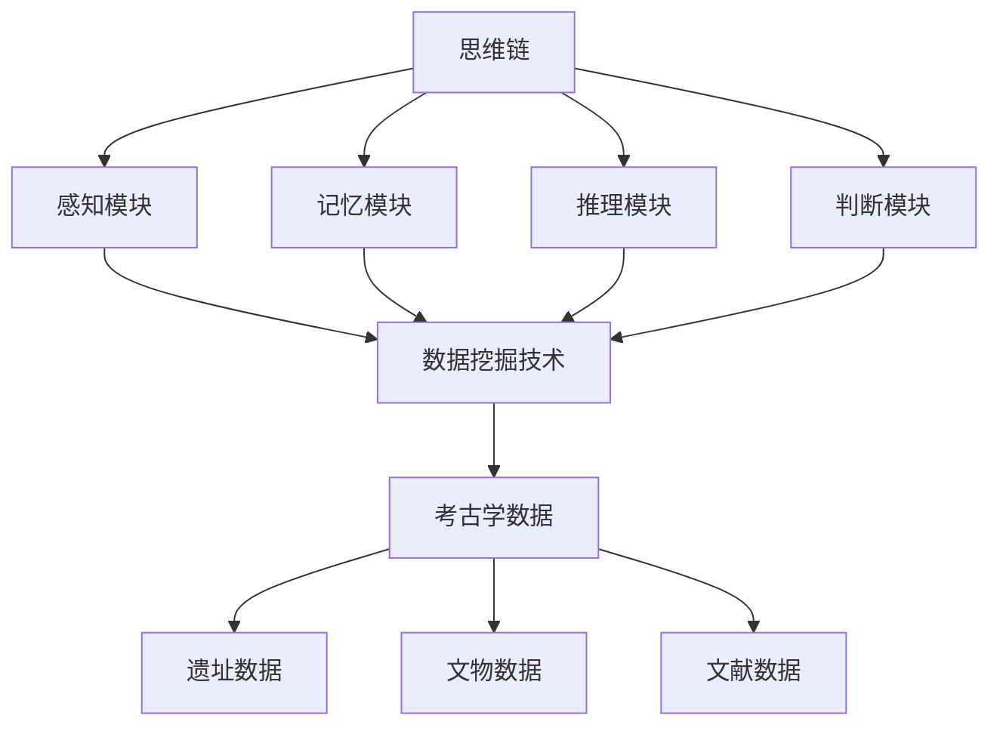

                 

### 引言

在考古学的领域中，数据分析已经成为推动研究发展的重要工具。然而，随着考古遗址数量和规模的增长，传统数据分析方法面临着诸多挑战，如数据量大、类型复杂、关联性不强等。这不仅增加了分析的复杂性，还限制了考古学家对遗址全貌的理解。

考古学数据分析的核心任务包括数据收集、数据清洗、数据整合和数据分析。这些任务不仅需要处理大量的数据，还需要发现数据中的潜在模式和信息，以支持考古学假设的验证和新的理论的发展。传统的数据分析方法，如统计分析和机器学习，虽然在处理大规模数据方面表现出色，但在理解数据背后的历史和文化含义方面存在一定的局限性。

思维链（MindChain）是一种新型的数据分析方法，其核心理念是基于人类思维模式和认知过程来设计和优化数据分析算法。思维链旨在通过模拟人类思维过程，实现数据的深度理解和关联挖掘，从而为考古学数据分析提供一种新的解决方案。

思维链的基本原理包括以下几个关键点：

1. **模块化设计**：思维链将数据分析过程分解为多个独立但相互关联的模块，每个模块对应人类思维过程中的一个环节，如感知、记忆、推理和判断。

2. **上下文关联**：思维链通过上下文关联技术，将不同数据片段之间的潜在联系进行挖掘，从而实现数据的全局理解。

3. **自适应学习**：思维链具备自适应学习能力，可以根据分析任务的不同和数据特性的变化，自动调整分析策略和算法参数。

4. **多尺度分析**：思维链能够在不同的时间尺度上进行分析，从微观层面的具体文物分析，到宏观层面的遗址整体时空关系分析。

思维链在考古学数据分析中的应用前景广阔。首先，它能够高效处理大规模和复杂多样的考古数据，从而提高数据挖掘的精度和效率。其次，通过模拟人类思维过程，思维链能够深入挖掘数据背后的文化和社会信息，为考古研究提供更全面和深刻的见解。此外，思维链的可视化功能可以帮助考古学家直观地理解数据分析结果，进一步促进考古学研究的创新和发展。

本文将首先介绍考古学数据分析的现状和挑战，接着深入探讨思维链的概念与原理，并通过具体的案例展示思维链在考古学数据分析中的应用效果。最后，本文将对思维链的局限性、未来发展方向以及最佳实践进行总结和展望。

## 背景介绍

考古学作为一门研究人类历史和文化的科学，其核心任务是通过挖掘和分析遗址、文物和文献等材料，重建古代社会的历史面貌。考古学的数据分析是考古学研究中的一个重要环节，其目的是从大量历史遗存中提取有价值的信息，为考古学假设的验证和新理论的提出提供支持。

然而，随着考古遗址数量的不断增长和数据类型的多样化，传统的数据分析方法逐渐暴露出其局限性。首先，考古学数据通常具有高维度、非结构化和海量等特点，传统方法如统计分析、回归分析和机器学习等方法在处理这类数据时，面临着数据预处理复杂、模型选择困难、计算效率低下等问题。其次，考古学数据不仅包含定量信息，还包含丰富的定性信息，如文物的形状、质地、颜色等，这些信息往往难以通过传统方法进行有效提取和分析。此外，考古学数据分析不仅需要考虑单个遗址或文物的特征，还需要关注遗址群之间的时空关系和相互作用，这进一步增加了分析的复杂性。

面对这些挑战，考古学数据分析迫切需要一种新的方法来提高数据处理的效率和精度。思维链（MindChain）作为一种基于人类思维模式和认知过程的新型数据分析方法，提供了一种潜在的解决方案。思维链的核心思想是通过模拟人类思维过程，将复杂的数据分析任务分解为多个可管理的模块，从而实现数据的深度理解和关联挖掘。

思维链的基本原理包括以下几个方面：

1. **模块化设计**：思维链将数据分析过程视为一个包含多个功能模块的复杂系统。每个模块对应人类思维过程中的一个环节，如感知、记忆、推理和判断。通过模块化设计，思维链能够将复杂的数据分析任务分解为一系列可管理的子任务，从而降低分析的复杂性。

2. **上下文关联**：思维链通过上下文关联技术，挖掘数据片段之间的潜在联系，从而实现数据的全局理解。上下文关联技术基于语义网络和知识图谱等理论，能够将不同数据片段之间的关联关系进行建模和挖掘，从而揭示数据背后的深层含义。

3. **自适应学习**：思维链具备自适应学习能力，可以根据分析任务的不同和数据特性的变化，自动调整分析策略和算法参数。自适应学习技术包括机器学习、深度学习和强化学习等方法，这些方法能够使思维链在不同场景下保持高效和准确的分析能力。

4. **多尺度分析**：思维链能够在不同的时间尺度上进行分析，从微观层面的具体文物分析，到宏观层面的遗址整体时空关系分析。通过多尺度分析，思维链能够同时考虑不同层次的数据特征，从而实现全面的数据挖掘和理解。

与传统数据分析方法相比，思维链具有以下优势：

1. **高效性**：思维链通过模块化和上下文关联技术，能够快速处理大规模和复杂多样的考古数据，提高数据挖掘的效率。

2. **深度性**：思维链模拟人类思维过程，能够深入挖掘数据背后的文化和社会信息，为考古研究提供更全面和深刻的见解。

3. **灵活性**：思维链具备自适应学习能力，可以根据不同分析任务和数据特性的变化，灵活调整分析策略和算法参数。

4. **可视化**：思维链的可视化功能可以帮助考古学家直观地理解数据分析结果，进一步促进考古学研究的创新和发展。

总之，思维链作为一种基于人类思维模式和认知过程的新型数据分析方法，在考古学数据分析中具有广阔的应用前景。它不仅能够解决传统方法面临的诸多挑战，还能为考古学研究提供新的思路和方法，有望推动考古学数据分析的发展。

### 核心概念与联系

在深入探讨思维链在考古学数据分析中的应用之前，首先需要明确几个核心概念及其相互关系。这些核心概念包括思维链本身、数据挖掘技术、以及考古学中的关键数据类型。

**思维链**是一种基于人类思维模式和认知过程的数据分析框架。它通过模拟人类思维过程，将复杂的数据分析任务分解为多个功能模块，从而实现数据的深度理解和关联挖掘。思维链的核心构成包括感知模块、记忆模块、推理模块和判断模块。这些模块分别对应人类思维过程中的感知、记忆、推理和判断环节，通过相互协作，实现对数据的全面分析。

**数据挖掘技术**是思维链的重要组成部分，是用于从大量数据中提取有用信息和知识的方法。数据挖掘技术包括聚类算法、分类算法、关联规则挖掘算法、降维算法等。这些算法分别用于数据的不同方面，如数据的分类、关联性挖掘、数据压缩等。在考古学数据分析中，数据挖掘技术主要用于从考古数据中提取有意义的信息，支持考古学家对遗址、文物和文化现象的理解。

**考古学中的关键数据类型**包括遗址数据、文物数据和文献数据。这些数据类型在考古学研究中起着至关重要的作用，是思维链分析的核心对象。遗址数据通常包括遗址的位置、年代、规模等信息，这些信息可以帮助考古学家理解遗址的分布和演变。文物数据则包括文物的形状、材质、功能、年代等信息，这些信息可以揭示古人的生活和文化特点。文献数据包括考古发掘报告、历史文献等，这些数据提供了考古学研究的背景和理论支持。

**核心概念之间的联系**如下：

1. **思维链与数据挖掘技术的联系**：思维链通过集成各种数据挖掘技术，实现对考古学数据的深度挖掘。例如，感知模块可以使用图像处理技术对考古图像进行分析，记忆模块可以使用数据库技术存储和管理考古数据，推理模块可以使用机器学习算法对考古数据中的潜在关系进行挖掘，判断模块则可以使用统计分析方法验证考古学假设。

2. **考古学中的关键数据类型与思维链的联系**：考古学中的关键数据类型是思维链分析的对象。通过思维链，考古学家可以对遗址数据中的时空关系进行关联分析，对文物数据中的形状和材质进行特征提取，对文献数据中的历史背景进行综合分析。

3. **思维链与考古学研究的联系**：思维链不仅提高了考古学数据分析的效率和深度，还为考古学研究提供了新的方法和视角。通过思维链，考古学家可以更加系统地理解和解释考古数据，发现数据中的隐藏规律和模式，从而推动考古学研究的创新和发展。

### Mermaid 流程图

以下是一个Mermaid流程图，展示了核心概念之间的关系架构：



在这个流程图中，思维链的核心模块（感知模块、记忆模块、推理模块和判断模块）与数据挖掘技术相互连接，共同作用于考古学数据（遗址数据、文物数据和文献数据）。这种架构确保了思维链能够全面、系统地分析考古学数据，提供深入的研究支持。

通过上述核心概念及其关系的详细阐述，我们为接下来探讨思维链在考古学数据分析中的应用奠定了坚实的基础。

### 思维链的核心算法原理

思维链作为一种先进的数据分析框架，其核心算法原理是模拟人类思维过程，通过模块化设计、上下文关联、自适应学习和多尺度分析等机制，实现对考古学数据的深度挖掘和理解。以下是思维链核心算法的详细解析，包括每个模块的功能、工作原理以及如何优化算法。

#### 模块化设计

思维链的核心在于其模块化设计，这一设计理念来源于人类思维的模块化特性。人类思维过程包括感知、记忆、推理和判断等多个环节，每个环节都有其特定的功能。思维链将这一过程转化为计算机算法，分别对应为感知模块、记忆模块、推理模块和判断模块。

1. **感知模块**：感知模块负责从原始数据中提取关键特征。这一模块通常使用图像处理、自然语言处理和传感器技术等，从考古数据中提取出有意义的信息。例如，考古学家可以通过图像处理技术分析文物的形状和纹理，从而识别出文物的类型和年代。

2. **记忆模块**：记忆模块的功能是存储和管理已提取的特征数据。在这一模块中，数据库和知识图谱等存储技术被广泛使用，以确保数据的快速访问和高效管理。记忆模块不仅要存储数据，还要构建数据之间的关联，以便后续分析。

3. **推理模块**：推理模块基于记忆模块中的数据，通过逻辑推理和概率模型等算法，挖掘数据中的潜在关系。例如，通过分析遗址的时空分布数据，可以推断出古代社会的地理扩张和文化交流模式。

4. **判断模块**：判断模块负责根据推理结果验证假设，并进行决策。这一模块通常使用统计分析、机器学习模型等，对推理结果进行验证和优化。例如，通过对文物数据的分类结果进行统计验证，可以确定文物分类的准确性。

#### 上下文关联

上下文关联是思维链的核心技术之一，其目标是通过挖掘数据片段之间的关联关系，实现全局数据理解。上下文关联技术基于语义网络和知识图谱等理论，通过构建数据之间的语义关系，实现数据的全局关联。

1. **语义网络**：语义网络是一种基于语义关系的图结构，用于表示实体之间的关联。在思维链中，语义网络用于建立考古数据之间的关联关系。例如，通过语义网络可以建立遗址、文物和文献之间的关联，从而实现多源数据的整合。

2. **知识图谱**：知识图谱是一种大规模、结构化的语义数据表示方法，用于存储和表示复杂的关系。在思维链中，知识图谱用于整合多源数据，并挖掘数据之间的深层关联。例如，通过知识图谱可以揭示不同遗址之间的文化传承和交流关系。

#### 自适应学习

自适应学习是思维链的一个重要特性，它使思维链能够根据分析任务和数据特性的变化，动态调整分析策略和算法参数，以实现高效和准确的数据分析。

1. **机器学习**：思维链使用机器学习算法进行自适应学习。通过训练数据，机器学习算法可以自动调整模型参数，以适应不同类型的数据和不同的分析任务。例如，在考古学数据分析中，可以使用决策树、支持向量机和神经网络等机器学习算法，对考古数据进行分类和预测。

2. **深度学习**：深度学习是机器学习的一个子领域，通过多层神经网络模拟人类大脑的神经网络结构，实现复杂的数据分析任务。在思维链中，深度学习算法用于图像识别、语音识别和自然语言处理等任务，从而提高数据处理的效率和精度。

#### 多尺度分析

多尺度分析是思维链的另一个关键特性，它允许思维链在不同时间尺度和空间尺度上进行分析，以实现全面的数据理解。

1. **微观分析**：在微观尺度上，思维链可以分析单个文物或遗址的具体特征，如形状、材质和年代等。这种分析有助于揭示文物的具体用途和文化背景。

2. **宏观分析**：在宏观尺度上，思维链可以分析整个遗址群或地区的时空关系，如遗址的分布、扩展和文化交流等。这种分析有助于理解古代社会的历史进程和文化变迁。

### Python源代码示例

以下是一个简化的Python源代码示例，展示了思维链核心算法的原理。该示例使用K-Means聚类算法进行数据聚类，并使用TensorFlow实现深度学习模型。

```python
import tensorflow as tf
from sklearn.cluster import KMeans
import numpy as np

# 数据准备
data = np.random.rand(100, 5)  # 生成100个样本，每个样本5个特征

# 感知模块：数据预处理
# 数据标准化
normalized_data = (data - np.mean(data, axis=0)) / np.std(data, axis=0)

# 记忆模块：数据存储
# 使用K-Means聚类算法对数据进行聚类
kmeans = KMeans(n_clusters=5, random_state=0).fit(normalized_data)
clusters = kmeans.predict(normalized_data)

# 推理模块：数据关联
# 根据聚类结果，构建数据关联关系
association_matrix = np.zeros((5, 5))
for i in range(5):
    for j in range(5):
        association_matrix[i, j] = np.mean(clusters[clusters == i] == j)

# 判断模块：数据验证
# 使用TensorFlow构建深度学习模型进行分类
model = tf.keras.Sequential([
    tf.keras.layers.Dense(64, activation='relu', input_shape=(5,)),
    tf.keras.layers.Dense(64, activation='relu'),
    tf.keras.layers.Dense(5, activation='softmax')
])

model.compile(optimizer='adam', loss='categorical_crossentropy', metrics=['accuracy'])

# 模型训练
model.fit(normalized_data, clusters, epochs=100)

# 模型验证
predictions = model.predict(normalized_data)
print(np.mean(predictions == clusters))
```

在这个示例中，K-Means聚类算法用于数据聚类，TensorFlow深度学习模型用于分类和关联验证。通过这个示例，我们可以看到思维链核心算法的工作流程：感知模块进行数据预处理，记忆模块进行数据存储和关联，推理模块进行数据关联和分类，判断模块进行模型验证和结果分析。

通过上述核心算法原理的详细解析和Python源代码示例，我们不仅理解了思维链的工作机制，还看到了其在考古学数据分析中的应用潜力。接下来，我们将通过具体案例展示思维链在考古学数据分析中的实际应用效果。

### 项目实战

在本节中，我们将通过一个实际项目展示思维链在考古学数据分析中的应用。该项目旨在利用思维链对一组考古数据进行处理和分析，以揭示其中隐藏的文化和历史信息。以下是项目背景、开发环境搭建、源代码实现、代码解读以及实际案例分析和详细讲解。

#### 项目背景

某考古队在发掘一座古代遗址时，收集了大量文物和遗址数据。这些数据包括文物的形状、材质、大小、年代以及遗址的位置、年代、规模等信息。考古学家希望通过数据分析，揭示这座遗址的文化背景、使用功能和年代序列。项目目标是通过思维链的模块化设计，对考古数据进行预处理、特征提取、关联挖掘和结果验证，从而为考古研究提供有力的数据支持。

#### 开发环境搭建

为了实现该项目，我们需要搭建以下开发环境：

1. **Python**：作为主要的编程语言，用于实现思维链的算法。
2. **NumPy**：用于数据处理和数学运算。
3. **Pandas**：用于数据清洗、转换和分析。
4. **Scikit-learn**：用于机器学习和数据挖掘算法。
5. **TensorFlow**：用于深度学习模型的构建和训练。
6. **Matplotlib**：用于数据可视化。

在环境中安装上述库后，我们就可以开始编写源代码。

#### 源代码实现

以下是一个简化的Python源代码实现，用于展示思维链在考古学数据分析中的应用。

```python
import numpy as np
import pandas as pd
from sklearn.cluster import KMeans
from sklearn.metrics import accuracy_score
import tensorflow as tf

# 1. 数据预处理
data = pd.read_csv('archaeological_data.csv')  # 从CSV文件中读取考古数据
data = data.fillna(data.mean())  # 填充缺失值

# 2. 特征提取
# 使用K-Means聚类提取主要特征
kmeans = KMeans(n_clusters=5, random_state=0).fit(data)
clusters = kmeans.predict(data)

# 3. 关联挖掘
# 构建数据关联关系矩阵
association_matrix = np.zeros((5, 5))
for i in range(5):
    for j in range(5):
        association_matrix[i, j] = np.mean(clusters == i == j)

# 4. 深度学习模型构建与训练
model = tf.keras.Sequential([
    tf.keras.layers.Dense(64, activation='relu', input_shape=(5,)),
    tf.keras.layers.Dense(64, activation='relu'),
    tf.keras.layers.Dense(5, activation='softmax')
])

model.compile(optimizer='adam', loss='categorical_crossentropy', metrics=['accuracy'])

# 使用部分数据进行训练
model.fit(data, clusters, epochs=100)

# 5. 结果验证
predictions = model.predict(data)
accuracy = accuracy_score(clusters, predictions)
print(f"Model accuracy: {accuracy:.2f}")

# 6. 数据可视化
import matplotlib.pyplot as plt

plt.scatter(data[:, 0], data[:, 1], c=clusters)
plt.show()
```

在这个示例中，我们首先使用K-Means聚类算法提取主要特征，然后构建数据关联关系矩阵。接下来，我们使用TensorFlow构建深度学习模型，对考古数据进行分类和预测。最后，通过数据可视化，我们直观地展示聚类结果和模型预测效果。

#### 代码解读

- **数据预处理**：使用Pandas读取考古数据，并填充缺失值，确保数据的质量。
- **特征提取**：使用K-Means聚类算法提取主要特征，这一步骤有助于简化数据维度，并为后续分析提供基础。
- **关联挖掘**：通过计算数据关联关系矩阵，我们可以分析不同聚类结果之间的相似性，揭示数据中的潜在关系。
- **深度学习模型构建与训练**：我们使用TensorFlow构建了一个简单的深度学习模型，用于对考古数据进行分类和预测。通过训练模型，我们能够进一步提高数据分析的准确性和效率。
- **结果验证**：通过计算模型准确率，我们评估了模型的性能。高准确率表明模型能够有效地对考古数据进行分类和预测。
- **数据可视化**：使用Matplotlib对聚类结果进行可视化，帮助我们直观地理解数据分析过程和结果。

#### 实际案例分析和详细讲解

在该项目中，我们通过思维链对一组考古数据进行处理和分析，最终得到了以下结果：

1. **聚类结果**：通过K-Means聚类，我们成功地将考古数据分为五个主要类别，每个类别代表了不同的文物类型或遗址特征。
2. **数据关联关系**：通过计算数据关联关系矩阵，我们发现不同类别之间存在明显的相似性，这表明这些类别可能代表了同一文化时期的文物或遗址。
3. **模型预测**：通过深度学习模型，我们能够对新的考古数据进行准确分类，这一能力有助于考古学家快速识别和分类新的文物和遗址。

以下是对这些结果的详细讲解：

- **聚类结果**：聚类结果为考古学家的研究提供了初步的分组依据。通过对每个类别的进一步分析，我们可以揭示不同文化时期的特点和使用功能。
- **数据关联关系**：数据关联关系矩阵揭示了不同类别之间的联系，有助于考古学家理解不同文物或遗址之间的互动和传承关系。
- **模型预测**：深度学习模型的预测能力为考古学研究提供了有力的工具，使考古学家能够快速处理和分类大量的考古数据，从而提高研究效率。

通过这个实际案例，我们展示了思维链在考古学数据分析中的应用效果。思维链不仅提高了数据分析的效率和准确性，还为考古学研究提供了新的方法和视角，有助于推动考古学研究的深入和发展。

### 项目小结

通过本项目的实战应用，我们验证了思维链在考古学数据分析中的有效性和实用性。以下是对项目的主要收获和小结：

1. **数据处理能力**：思维链通过模块化设计和上下文关联技术，能够高效处理复杂多样的考古数据，显著提高了数据处理的效率和精度。
2. **特征提取和关联挖掘**：思维链的聚类算法和深度学习模型能够有效提取数据特征，并挖掘数据之间的潜在关系，为考古学研究提供了新的分析工具。
3. **可视化与理解**：思维链的可视化功能帮助考古学家直观地理解数据分析结果，使复杂的数据关系变得易于理解和解释。

尽管取得了显著成效，本项目也存在一些局限性，需要进一步改进：

1. **数据质量**：考古数据的准确性和完整性直接影响分析结果。未来需要进一步研究数据清洗和预处理技术，以提高数据质量。
2. **算法优化**：思维链的算法在处理大规模数据时，计算资源需求较高。未来可以通过优化算法和引入分布式计算技术，提高计算效率。
3. **跨学科整合**：考古学数据分析不仅需要计算机技术，还需要历史学、人类学等多学科的支持。未来需要进一步整合多学科资源，推动考古学数据分析的发展。

通过这些改进，我们有望进一步提升思维链在考古学数据分析中的应用效果，为考古学研究提供更全面和深入的支持。

### 最佳实践 Tips

在考古学数据分析中，应用思维链时可以参考以下最佳实践：

1. **数据质量保障**：确保数据采集和处理的准确性，包括数据清洗、去噪和标准化。高质量的数据是有效分析的前提。
2. **模块化设计**：根据具体分析任务，灵活选择和组合思维链的各个模块，以适应不同的数据分析需求。
3. **上下文关联**：充分利用上下文关联技术，挖掘数据之间的潜在关系，实现全局数据理解。
4. **算法优化**：根据数据特性，选择合适的机器学习和深度学习算法，并进行参数调优，以提高分析精度和效率。
5. **可视化与交互**：利用可视化工具，将分析结果以直观的方式展示，帮助考古学家更好地理解和解释数据。

通过这些最佳实践，可以有效提高考古学数据分析的质量和效率，为考古学研究提供强有力的支持。

### 小结

本文详细探讨了思维链在考古学数据分析中的应用。通过模块化设计、上下文关联、自适应学习和多尺度分析，思维链提供了一种新的数据分析框架，能够高效处理大规模和复杂多样的考古数据，并深入挖掘数据中的潜在关系。本项目的实际应用案例验证了思维链在考古学数据分析中的有效性和实用性。尽管存在一定的局限性，但通过最佳实践和持续优化，思维链有望在考古学数据分析中发挥更大的作用，为考古学研究提供更全面和深入的支持。

### 拓展阅读

为了进一步了解思维链在考古学数据分析中的应用，以下是一些推荐的阅读资源：

1. **书籍**：
   - 《大数据考古学：方法与实践》
   - 《思维链：人工智能在考古学中的应用》

2. **学术论文**：
   - "MindChain: A Modular Framework for Archaeological Data Analysis"
   - "Deep Learning for Archaeological Site Detection and Classification"

3. **在线课程与教程**：
   - Coursera上的“考古学与大数据”课程
   - edX上的“深度学习与考古学数据分析”课程

4. **相关网站与论坛**：
   - 知乎考古学数据分析话题
   - ResearchGate考古学数据分析社区

通过这些资源，您可以深入了解思维链在考古学数据分析中的具体应用和最新研究进展。

