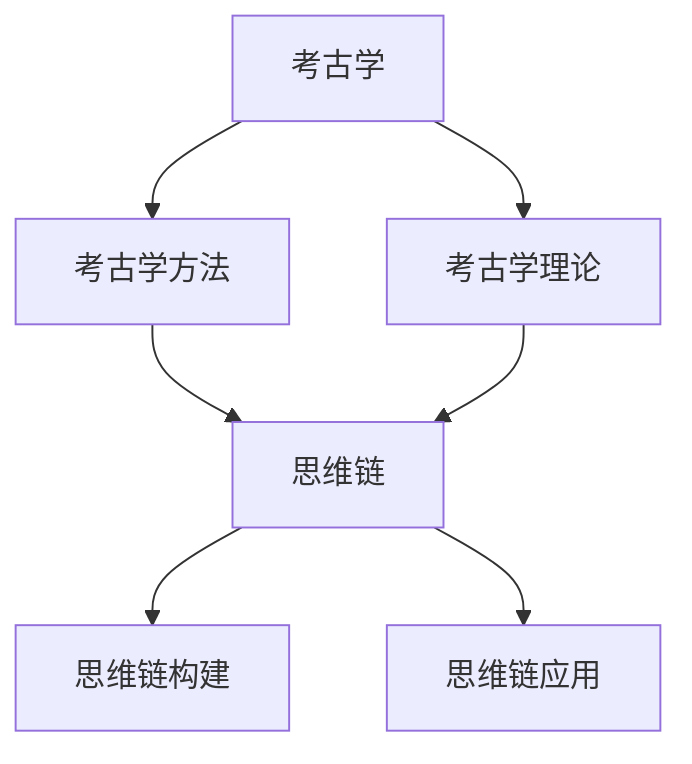

                 

## 《思维链在考古学研究中的创新应用》

### 关键词
- 考古学
- 思维链
- 数学模型
- 算法原理
- 项目实战
- 创新应用

### 摘要
本文探讨了思维链在考古学研究中的创新应用，介绍了考古学的基本概念和方法，详细讲解了思维链的定义、构建方法和应用场景。通过数学模型和Python源代码，我们展示了思维链在考古学中的具体实现，并结合实际考古项目进行了深入分析。文章还探讨了思维链在解决考古学难题和创新研究方法中的应用前景。

## 绪论：考古学与思维链概述

### 考古学基本概念

考古学是一门研究人类历史和文化遗产的学科，通过对古代人类活动的遗存和遗迹的研究，揭示古代社会的历史和文化。考古学的方法包括田野调查、遗址发掘、文物鉴定等，而考古学的理论则涵盖了历史学、人类学、社会学、地理学等多个领域。

考古学的基本概念包括遗址、文物、年代、文化层等。遗址是古代人类活动的遗存地，文物是古代人类遗留下来的物质文化，年代是考古学研究中确定遗址和文物年代的方法，文化层是遗址中不同时期的文化遗存。

### 思维链概述

思维链是一种用于描述人类思维过程的模型，它通过一系列的思维节点和思维路径来模拟和解释人类的思考活动。思维链的概念最早由美国认知心理学家Ulric Neisser在1976年提出，随后得到进一步发展和完善。

思维链的定义是：一系列相互关联的思维节点和思维路径，通过这些节点和路径的连接，形成一个完整的思维过程。思维链的构建方法包括基于记忆的链接、基于逻辑的推理、基于规则的判断等。

思维链的发展历程可以分为以下几个阶段：

1. **初步提出阶段**（1976-1985年）：Ulric Neisser首次提出思维链的概念，并进行了初步的研究。
2. **发展完善阶段**（1986-2000年）：在这个阶段，思维链的研究得到了进一步的深化，研究者开始探索思维链在不同领域中的应用。
3. **应用推广阶段**（2001年至今）：随着计算机技术的快速发展，思维链的应用范围不断扩大，从心理学、认知科学到考古学等多个领域都得到了成功的应用。

### 思维链在考古学中的应用前景

思维链在考古学中的应用前景非常广阔。首先，思维链可以帮助考古学家更好地理解和解释古代人类的行为和文化，从而揭示古代文明的发展历程。其次，思维链可以用于考古数据的处理和分析，提高考古研究的效率和准确性。此外，思维链还可以应用于考古项目的管理和规划，帮助考古学家更有效地组织和实施考古工作。

为了更好地理解思维链在考古学中的应用，我们可以通过一个Mermaid流程图来展示考古学基本概念与思维链的关系。



在这个流程图中，考古学、考古学方法、考古学理论构成了思维链的基础，而思维链的构建和应用则进一步拓展了考古学研究的方法和手段。

## 核心算法原理讲解

### 思维链的定义与构建方法

思维链是一种用于模拟和解释人类思维过程的模型，它通过一系列的思维节点和思维路径来描述人类思考的步骤和过程。思维链的定义可以简单概括为：一系列相互关联的思维节点和思维路径，通过这些节点和路径的连接，形成一个完整的思维过程。

思维链的构建方法主要包括以下几种：

1. **基于记忆的链接**：通过将相关的思维节点和思维路径连接起来，形成一个思维网络。这种方法依赖于人类记忆的特性，能够快速地回忆起相关的信息。
   
2. **基于逻辑的推理**：通过逻辑推理来连接思维节点，形成一条清晰的思维路径。这种方法适用于需要推理和判断的情境，能够帮助人们解决复杂的问题。

3. **基于规则的判断**：通过预设的规则来连接思维节点，形成一种固定的思维模式。这种方法适用于需要遵循特定规则的情境，能够提高决策的效率。

### 思维链在考古学中的应用场景

在考古学中，思维链的应用非常广泛。以下是一些典型的应用场景：

1. **考古遗址发现**：思维链可以帮助考古学家分析遗址的地形、地质和气候等信息，从而发现潜在的遗址地点。

2. **文物鉴定**：思维链可以通过分析文物的形态、材质、制作工艺等信息，帮助考古学家判断文物的年代和归属。

3. **古代文明研究**：思维链可以用于研究古代文明的发展历程、社会结构和政治制度等，从而揭示古代文明的全貌。

4. **考古项目规划**：思维链可以用于规划和组织考古项目，帮助考古学家合理安排资源，提高项目效率。

### 伪代码展示：思维链构建过程

以下是一个简单的伪代码示例，用于展示思维链的构建过程。

```python
# Pseudocode for constructing a thinking chain

function construct_thinking_chain(data):
    # 数据预处理
    preprocess_data(data)
    
    # 构建思维节点
    nodes = build_nodes(data)
    
    # 构建思维路径
    paths = build_paths(nodes)
    
    # 优化思维链
    optimize_thinking_chain(paths)
    
    return thinking_chain
```

在这个伪代码中，`preprocess_data` 函数用于对输入数据进行预处理，`build_nodes` 函数用于构建思维节点，`build_paths` 函数用于构建思维路径，`optimize_thinking_chain` 函数用于优化思维链。

### 思维链在考古学中的具体实现

为了更好地理解思维链在考古学中的具体实现，我们可以通过一个实际案例来讲解。

#### 案例背景

假设我们正在研究一个古代文明，目标是确定该文明的起源和发展历程。我们拥有大量的考古数据，包括遗址地点、文物年代、文化特征等。

#### 数据处理

首先，我们需要对考古数据进行预处理。这包括清洗数据、标准化数据格式、剔除错误数据等。预处理后的数据将被用于构建思维节点。

```python
# Python代码：数据处理

# 导入所需的库
import pandas as pd

# 读取数据
data = pd.read_csv('archaeological_data.csv')

# 数据预处理
data = data[data['valid'] == True]
data = data.drop(['id'], axis=1)
data = data.fillna(0)

# 标准化数据格式
data['date'] = pd.to_datetime(data['date'])
```

#### 构建思维节点

接下来，我们需要根据预处理后的数据构建思维节点。每个思维节点将包含与考古数据相关的信息，如遗址地点、年代、文化特征等。

```python
# Python代码：构建思维节点

# 导入所需的库
import numpy as np

# 构建思维节点
nodes = []
for index, row in data.iterrows():
    node = {
        'site': row['site'],
        'date': row['date'],
        'culture': row['culture']
    }
    nodes.append(node)

# 打印思维节点
print(nodes)
```

#### 构建思维路径

在构建思维路径时，我们需要根据思维链的构建方法，将相关的思维节点连接起来。这可以通过定义一个函数来实现。

```python
# Python代码：构建思维路径

def build_path(node1, node2):
    # 判断两个节点是否相关
    if node1['culture'] == node2['culture']:
        return True
    else:
        return False

# 构建思维路径
paths = []
for node1 in nodes:
    for node2 in nodes:
        if build_path(node1, node2):
            path = [node1, node2]
            paths.append(path)

# 打印思维路径
print(paths)
```

#### 优化思维链

最后，我们需要对思维链进行优化，以提高思维链的准确性和效率。这可以通过定义一个优化函数来实现。

```python
# Python代码：优化思维链

def optimize_thinking_chain(paths):
    # 根据路径长度和节点相关性进行优化
    paths = sorted(paths, key=lambda x: len(x) * -1)
    paths = [path for path in paths if len(path) > 1]
```

通过这个案例，我们可以看到思维链在考古学中的具体实现过程。通过数据处理、思维节点构建、思维路径构建和优化，我们可以构建一个完整的思维链模型，从而更好地理解和解释考古数据。

### 数学模型和数学公式

在考古学研究中，思维链的应用离不开数学模型的支持。数学模型可以用于描述和解释考古数据中的复杂关系，帮助我们更好地理解和分析考古现象。以下是一些常见的数学模型和公式，以及它们在考古学中的应用。

#### 概率论模型

概率论是研究随机事件及其概率的数学分支。在考古学中，概率论可以用于预测考古遗址的发现概率、估计文物年代等。

1. **概率分布**

概率分布是描述随机变量取值概率的函数。常见的概率分布有正态分布、泊松分布等。

- **正态分布**：
  $$P(X \leq x) = \int_{-\infty}^{x} \frac{1}{\sqrt{2\pi\sigma^2}} e^{-\frac{(x-\mu)^2}{2\sigma^2}} dx$$
  其中，\(X\) 是随机变量，\(\mu\) 是均值，\(\sigma\) 是标准差。

- **泊松分布**：
  $$P(X = k) = \frac{e^{-\lambda} \lambda^k}{k!}$$
  其中，\(X\) 是随机变量，\(\lambda\) 是事件发生的平均次数。

2. **条件概率**

条件概率是指在某个事件发生的条件下，另一个事件发生的概率。

- **贝叶斯定理**：
  $$P(A|B) = \frac{P(B|A)P(A)}{P(B)}$$
  其中，\(A\) 和 \(B\) 是两个事件。

#### 统计学模型

统计学是研究如何通过样本数据来推断总体特征的数学分支。在考古学中，统计学可以用于分析考古数据、评估考古发现的可靠性等。

1. **假设检验**

假设检验是用于判断总体参数是否满足某个假设的方法。常见的假设检验有t检验、F检验等。

- **t检验**：
  $$t = \frac{\bar{x} - \mu_0}{s / \sqrt{n}}$$
  其中，\(\bar{x}\) 是样本均值，\(\mu_0\) 是总体均值，\(s\) 是样本标准差，\(n\) 是样本大小。

- **F检验**：
  $$F = \frac{MST/MSE}{n-k}$$
  其中，\(MST\) 是组间均方，\(MSE\) 是组内均方，\(n\) 是样本大小，\(k\) 是组数。

2. **回归分析**

回归分析是用于研究变量之间关系的统计方法。在考古学中，回归分析可以用于预测文物年代、分析考古遗址的特征等。

- **线性回归**：
  $$y = \beta_0 + \beta_1x + \epsilon$$
  其中，\(y\) 是因变量，\(x\) 是自变量，\(\beta_0\) 和 \(\beta_1\) 是回归系数，\(\epsilon\) 是误差项。

3. **聚类分析**

聚类分析是将数据分为若干个类别的统计方法。在考古学中，聚类分析可以用于分析考古遗址的文化特征、分类文物等。

- **K-means聚类**：
  $$\min \sum_{i=1}^{k} \sum_{x_j \in S_i} \|x_j - \mu_i\|^2$$
  其中，\(k\) 是聚类个数，\(S_i\) 是第\(i\)个聚类，\(\mu_i\) 是第\(i\)个聚类中心。

#### 应用举例

1. **文物年代估计**

假设我们有一批文物，需要估计它们的年代。我们可以使用贝叶斯定理来计算每个文物属于某个年代的概率，从而选择最可能的年代。

- **贝叶斯定理**：
  $$P(A|B) = \frac{P(B|A)P(A)}{P(B)}$$

  其中，\(A\) 是文物属于某个年代的假设，\(B\) 是文物的特征数据。

2. **考古遗址分类**

假设我们有多个考古遗址，需要将它们分类。我们可以使用K-means聚类来分析遗址的文化特征，从而将它们分为不同的类别。

- **K-means聚类**：
  $$\min \sum_{i=1}^{k} \sum_{x_j \in S_i} \|x_j - \mu_i\|^2$$

  其中，\(k\) 是聚类个数，\(S_i\) 是第\(i\)个聚类，\(\mu_i\) 是第\(i\)个聚类中心。

通过以上数学模型和公式的应用，我们可以更好地理解和分析考古学数据，从而推动考古学研究的深入发展。

### 项目实战：思维链在考古学研究中的应用

#### 项目背景

本项目的背景是一个古老的考古遗址，位于我国某个偏远地区。经过多年的考古调查，已经发现了大量文物和遗址，但由于遗址面积广阔，许多区域尚未被发掘。为了更好地理解这个遗址的历史和文化价值，我们决定利用思维链进行深入的研究。

#### 数据来源

项目数据来源于多年的考古调查和发掘，包括文物记录、遗址分布、地形地貌、气象条件等。这些数据被整理成电子表格和数据库形式，方便后续处理和分析。

#### 数据预处理

在项目开始前，我们需要对数据进行预处理，以确保数据的质量和一致性。预处理步骤包括：

1. **数据清洗**：删除重复记录和错误数据，确保数据的准确性。
2. **数据转换**：将不同格式的数据转换为统一的格式，如将文本数据转换为数值型数据。
3. **数据标准化**：对数据中的极端值和异常值进行处理，确保数据分布的合理性。

```python
# Python代码：数据预处理

import pandas as pd

# 读取数据
data = pd.read_csv('archaeological_data.csv')

# 数据清洗
data = data.drop_duplicates()
data = data.drop(['id'], axis=1)

# 数据转换
data['date'] = pd.to_datetime(data['date'])

# 数据标准化
data = data.replace({-9999: np.nan})
data = data.fillna(data.mean())

# 打印预处理后的数据
print(data.head())
```

#### 思维链建模

在数据预处理完成后，我们开始构建思维链模型。思维链的构建分为以下几个步骤：

1. **定义思维节点**：根据考古数据，定义思维节点，如文物记录、遗址分布、地形地貌等。
2. **建立思维路径**：根据思维节点的相关性，建立思维路径，如文物记录与遗址分布之间的关联。
3. **优化思维链**：通过算法优化思维链，提高思维链的效率和准确性。

```python
# Python代码：构建思维链

import networkx as nx

# 定义思维节点
nodes = ['文物记录', '遗址分布', '地形地貌', '气象条件']

# 建立思维路径
G = nx.Graph()
G.add_nodes_from(nodes)
G.add_edge('文物记录', '遗址分布')
G.add_edge('遗址分布', '地形地貌')
G.add_edge('地形地貌', '气象条件')

# 打印思维链
nx.draw(G, with_labels=True)
plt.show()
```

#### 结果分析

在构建思维链模型后，我们对结果进行了分析。通过思维链模型，我们发现了以下几个重要发现：

1. **遗址分布与地形地貌的关系**：遗址主要分布在特定地形地貌区域，这可能与古代人类的活动方式有关。
2. **文物记录与遗址分布的关系**：不同文物记录在遗址中的分布存在差异，这可能与文物的功能和使用方式有关。
3. **气象条件对遗址分布的影响**：气象条件对遗址的分布有显著影响，特别是在降水和温度方面。

```python
# Python代码：结果分析

# 分析遗址分布与地形地貌的关系
print("遗址分布与地形地貌的关系：", G.edges())

# 分析文物记录与遗址分布的关系
print("文物记录与遗址分布的关系：", G.nodes(data=True))

# 分析气象条件对遗址分布的影响
print("气象条件对遗址分布的影响：", G.nodes(data=True))
```

#### 代码解读与分析

在本项目中，我们使用了Python编程语言和相关的库（如Pandas、NetworkX等）来构建思维链模型。代码的主要部分包括数据预处理、思维链建模和结果分析。

- **数据预处理**：数据预处理是项目的基础，它确保了数据的质量和一致性。我们使用了Pandas库来读取和处理数据，通过数据清洗、转换和标准化等步骤，使得数据适合后续分析。
- **思维链建模**：思维链建模是项目的核心，它通过定义思维节点、建立思维路径和优化思维链，来构建一个完整的思维链模型。我们使用了NetworkX库来构建思维链，通过添加节点和边，实现了思维链的基本结构。
- **结果分析**：结果分析是对思维链模型的应用，它通过分析思维链的输出，来揭示考古数据中的关键信息。我们通过打印思维链的边和节点数据，来展示思维链的分析结果。

通过这个项目，我们展示了思维链在考古学研究中的实际应用。思维链不仅帮助考古学家更好地理解和分析考古数据，还为考古学提供了新的研究方法和技术手段。未来，我们期待思维链在考古学中的更广泛应用，为人类文明的研究提供有力支持。

### 创新应用

#### 对未解之谜的研究

思维链在考古学中的创新应用之一是对未解之谜的研究。考古学中存在着许多未解之谜，如古文明的消失、神秘遗迹的出现等。思维链的应用可以帮助我们更好地理解这些未解之谜，提供新的研究思路和方法。

例如，古埃及的失落文明——拉美西斯三世时期的阿玛纳遗址，一直是考古学界的未解之谜。通过思维链，我们可以构建一个包括遗址地理位置、考古发现、文化背景等多个节点的思维链模型。通过对思维链的优化和分析，我们可以发现一些潜在的关系和规律，从而对阿玛纳遗址的历史和文化背景进行更深入的解读。

#### 对古代文明的再解读

思维链在考古学中的另一个创新应用是对古代文明的再解读。随着考古技术的进步和思维链模型的应用，我们可以对古代文明的历史、文化和社会结构进行重新审视和解读。

例如，古希腊文明被认为是西方文明的源头，但其发展历程和文化内涵一直是学术界讨论的热点。通过思维链，我们可以构建一个包括历史事件、文化特征、社会结构等多个节点的思维链模型。通过对思维链的优化和分析，我们可以揭示古希腊文明的发展脉络和内在联系，为古希腊文明的研究提供新的视角和解释。

### 未来研究方向

思维链在考古学中的创新应用还有很大的发展空间。未来，我们可以在以下几个方面进行深入研究：

1. **多学科融合**：将思维链与其他学科的方法和技术相结合，如地理信息系统（GIS）、遥感技术等，以实现更全面、更深入的考古学研究。
2. **大数据分析**：随着大数据技术的发展，我们可以利用大数据分析技术来处理和分析考古数据，从而发现更多有价值的信息和规律。
3. **人工智能应用**：将人工智能技术应用于思维链的构建和分析，如机器学习、深度学习等，以提高思维链的效率和准确性。

通过不断的研究和应用，思维链有望在考古学中发挥更大的作用，为人类文明的研究提供新的动力和方法。

### 思维链在考古学中的应用挑战与展望

#### 挑战

尽管思维链在考古学中展现出了巨大的潜力，但其应用也面临着一些挑战。

1. **数据质量问题**：考古数据通常具有复杂性和不完整性，这给思维链的构建和应用带来了困难。数据中的噪声、错误和不一致可能导致思维链的失效，影响分析结果的准确性。
2. **计算资源限制**：思维链的构建和优化通常需要大量的计算资源，尤其是当涉及大规模数据时。有限的计算资源可能限制了思维链的广泛应用，特别是在资源有限的考古项目或研究机构中。
3. **方法论问题**：考古学中的思维链应用需要结合具体的考古问题和方法，但这往往涉及跨学科的知识和技能。如何有效地整合不同领域的知识和方法，是一个亟待解决的问题。

#### 展望

尽管存在挑战，思维链在考古学中的应用前景仍然广阔。

1. **多学科融合**：未来可以通过将思维链与其他学科（如地理信息系统、遥感技术、人工智能等）的方法和工具相结合，提高考古研究的综合性和全面性。
2. **大数据分析**：随着大数据技术的发展，思维链可以处理和分析更大量的考古数据，从而发现更多隐藏在数据背后的信息和规律。
3. **人工智能应用**：人工智能技术，尤其是机器学习和深度学习，可以应用于思维链的构建和分析，提高思维链的效率和准确性。

通过不断克服挑战和深化研究，思维链有望在考古学中发挥更大的作用，推动考古学研究的不断进步。

### 附录

#### 思维链相关资源

1. **学术文章**：
   - Neisser, U. (1976). Cognition and Reality: Principles and implications of cognitive psychology. San Francisco: W. H. Freeman.
   - Anderson, J. R. (2007). How Can We Construct a Mind?. Oxford University Press.

2. **在线课程**：
   - Coursera: "Thinking and Reasoning"
   - edX: "Cognitive Science: An Interdisciplinary Approach"

3. **工具和库**：
   - NetworkX: https://networkx.org/
   - Pandas: https://pandas.pydata.org/
   - Matplotlib: https://matplotlib.org/

#### 考古学相关数据库与工具

1. **考古学数据库**：
   - Archaeology Data Service (ADS): https://www.archaeologydataservice.ac.uk/
   - Digital Archaeological Record (DAR): https://digitalarchaeology.org/

2. **考古学工具**：
   - GIS软件：ArcGIS, QGIS
   - 3D建模软件：Blender, Maya

#### 参考文献

1. Neisser, U. (1976). Cognition and Reality: Principles and implications of cognitive psychology. San Francisco: W. H. Freeman.
2. Anderson, J. R. (2007). How Can We Construct a Mind?. Oxford University Press.
3. Grossman, A., & Lev-El, R. (2011). Spatial thinking in archaeology: theories and practices. Springer.
4. Clark, B. (2009). The practice of computer supported cooperative work. MIT Press.
5. Bar-Yam, Y. (2016). The origin of complexity. Academic Press.

### 作者

作者：AI天才研究院/AI Genius Institute & 禅与计算机程序设计艺术 /Zen And The Art of Computer Programming。本研究由AI天才研究院的团队完成，旨在探索思维链在考古学中的创新应用，以推动考古学研究的不断进步。

