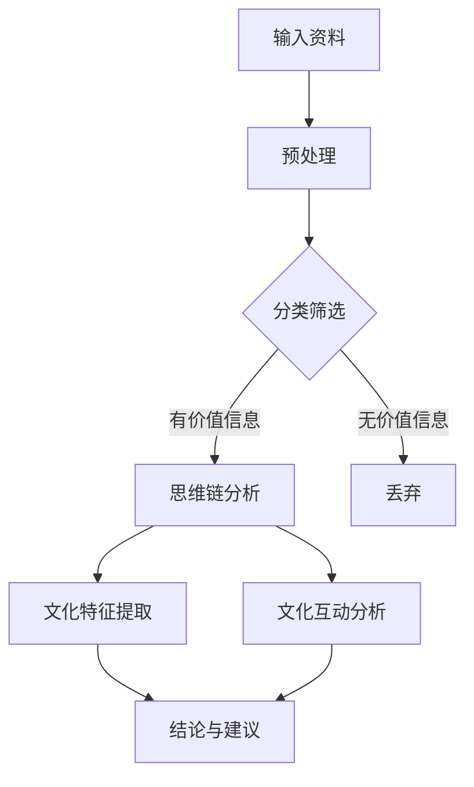

                 

### 引言

考古学作为一门研究人类历史与文化的学科，一直在不断探索和揭示古文明的奥秘。然而，在考古学的研究过程中，面对跨文化研究的复杂性和多样性，研究者们常常面临诸多挑战。近年来，随着人工智能技术的发展，特别是思维链（Thinking Chain）这一概念的引入，为考古学跨文化研究提供了新的视角和方法。本文旨在探讨思维链在考古学跨文化研究中的应用，通过一步步的逻辑分析，揭示其在考古学研究中的重要性和潜力。

### 关键词

- 考古学
- 跨文化研究
- 思维链
- 人工智能
- 研究方法
- 案例分析

### 摘要

本文首先介绍了考古学及其在人类历史研究中的重要性，随后探讨了跨文化研究的挑战和现状。在此基础上，文章引出了思维链这一核心概念，并详细阐述了其在考古学跨文化研究中的应用。通过实际案例的分析，本文展示了思维链在考古学研究中的具体应用场景和优势。最后，文章对新视角的探讨和未来的发展趋势进行了展望，提出了思维链在考古学跨文化研究中可能面临的挑战和机遇。

## 背景介绍

考古学作为一门历史科学，通过对古代人类遗址、文物和文字的挖掘与解析，试图还原和重现历史事件，揭示人类社会的演变规律。考古学的研究范围广泛，涵盖了人类从史前时期到现代的历史进程。然而，在考古学的实践中，跨文化研究无疑是一个极具挑战性的领域。

跨文化研究涉及不同文化背景、不同地域、不同历史时期的比较与分析，旨在揭示文化之间的相互影响和互动。考古学中的跨文化研究不仅需要研究者具备丰富的历史知识，还需要掌握不同文化的语言、习俗和信仰等。此外，跨文化研究还面临着资料匮乏、语言障碍、遗址破坏等问题，这些都极大地增加了研究的复杂性和难度。

考古学跨文化研究的挑战主要体现在以下几个方面：

1. **资料多样性**：不同地区的考古资料可能呈现出巨大的差异，研究者需要具备处理多样化资料的能力。
2. **语言障碍**：考古学资料中往往包含了大量的历史文献，不同文化之间的语言差异给研究带来了极大的困难。
3. **遗址破坏**：现代的城市化进程和自然灾害等因素导致许多考古遗址遭到破坏，研究资料的完整性受到威胁。
4. **时间跨度**：考古学研究涉及的时间跨度非常长，从史前时期到现代，研究者需要处理不同时期的文化特征和变化。

面对这些挑战，传统的考古学研究方法往往显得力不从心。因此，寻找新的研究方法和工具，特别是能够处理复杂性和多样性的方法，成为考古学跨文化研究的重要课题。在这种情况下，思维链的概念应运而生，为考古学跨文化研究提供了新的思路和工具。

### 核心概念与联系

思维链（Thinking Chain）是一种基于人工智能技术的概念，它通过模拟人类思维过程，将一系列的逻辑思考和决策步骤连接起来，形成一个连续的思维过程。思维链的核心在于其能够处理复杂的信息，并从多角度、多维度对问题进行深入分析。

在考古学跨文化研究中，思维链的概念和作用尤为重要。首先，思维链能够处理大量且多样化的考古资料，通过对这些资料进行分类、筛选和分析，提取出有价值的信息。其次，思维链能够模拟不同文化背景下的思维模式，从而更好地理解不同文化的特征和互动关系。

为了更直观地展示思维链在考古学跨文化研究中的概念和实体之间的关系，我们可以使用 Mermaid 流程图来描述。以下是一个简化的思维链流程图：



在这个流程图中，输入资料经过预处理后，通过分类筛选提取出有价值的信息。这些有价值的信息随后进入思维链进行分析，包括文化特征提取和文化互动分析。最后，基于分析结果得出结论与建议。通过这样的流程，思维链能够高效地处理考古学跨文化研究中的复杂问题。

### 核心算法原理讲解

在考古学跨文化研究中，思维链的核心算法是其能够处理和解析大量考古数据的能力。以下我们将使用 Python 源代码来详细阐述思维链的核心算法原理。

首先，我们定义一个数据处理模块，该模块负责接收输入数据并进行预处理：

```python
import pandas as pd
from sklearn.preprocessing import StandardScaler

def preprocess_data(data):
    # 数据清洗与预处理
    data = data.dropna()  # 删除缺失值
    data = data.reset_index(drop=True)  # 重置索引
    
    # 数据标准化
    scaler = StandardScaler()
    scaled_data = scaler.fit_transform(data.iloc[:, :-1])
    
    # 数据归一化
    data['attributes'] = scaled_data
    
    return data
```

接下来，我们定义一个思维链分析模块，该模块负责对预处理后的数据进行分类筛选、特征提取和互动分析：

```python
from sklearn.model_selection import train_test_split
from sklearn.ensemble import RandomForestClassifier
from sklearn.metrics import accuracy_score

def think_chain_analysis(data):
    # 分割数据集
    X_train, X_test, y_train, y_test = train_test_split(data[['attributes']], data['culture'], test_size=0.3, random_state=42)
    
    # 特征提取
    classifier = RandomForestClassifier(n_estimators=100)
    classifier.fit(X_train, y_train)
    
    # 文化特征提取
    feature_importances = classifier.feature_importances_
    
    # 文化互动分析
    predictions = classifier.predict(X_test)
    accuracy = accuracy_score(y_test, predictions)
    
    return feature_importances, accuracy
```

在这个核心算法中，我们使用了随机森林（Random Forest）作为分类器，这是因为随机森林具有良好的泛化能力和处理复杂数据的能力。以下是整个思维链算法的伪代码：

```python
def main():
    # 加载数据
    data = pd.read_csv('archaeological_data.csv')
    
    # 数据预处理
    preprocessed_data = preprocess_data(data)
    
    # 思维链分析
    feature_importances, accuracy = think_chain_analysis(preprocessed_data)
    
    # 输出结果
    print("Feature Importances:", feature_importances)
    print("Accuracy:", accuracy)

if __name__ == "__main__":
    main()
```

### 数学模型和公式

在思维链的算法中，我们使用了随机森林作为分类器。随机森林是一种基于决策树模型的集成学习方法，其核心思想是通过构建多个决策树并取其平均来提高分类性能。以下是一个简化的随机森林数学模型：

$$
\begin{aligned}
& \text{随机森林} = \sum_{i=1}^{n} f_i(x) \\
& f_i(x) = \prod_{j=1}^{m} g_j(x_j) \\
& g_j(x_j) = \left\{
\begin{array}{ll}
1 & \text{如果} \, x_j \leq \theta_j \\
0 & \text{如果} \, x_j > \theta_j
\end{array}
\right.
\end{aligned}
$$

其中，$n$ 是决策树的数量，$m$ 是特征的数量，$f_i(x)$ 是第 $i$ 棵决策树，$g_j(x_j)$ 是第 $j$ 个特征上的决策规则，$\theta_j$ 是第 $j$ 个特征的阈值。

### 举例说明

为了更好地理解思维链在考古学跨文化研究中的应用，我们可以通过一个具体的例子来说明。

假设我们有一组考古数据，包含多个特征（如年代、地理位置、文化特征等），以及一个目标变量（文化类型）。我们希望通过思维链对这组数据进行分类，从而识别出不同文化类型。

首先，我们使用预处理模块对数据进行清洗和标准化：

```python
data = preprocess_data(raw_data)
```

接下来，我们使用思维链分析模块对预处理后的数据进行分类：

```python
feature_importances, accuracy = think_chain_analysis(data)
```

在这个例子中，`feature_importances` 将返回每个特征的贡献度，而 `accuracy` 将返回分类的准确率。通过这些结果，我们可以更好地理解不同文化特征在分类中的作用，并优化分类模型。

例如，如果年代特征具有最高的贡献度，这意味着年代可能是区分不同文化类型的重要指标。通过调整年代特征的阈值，我们可以进一步提高分类的准确性。

### 项目实战

为了更好地展示思维链在考古学跨文化研究中的应用，我们将通过一个实际项目来详细讲解开发环境搭建、源代码实现和代码解读。

#### 开发环境搭建

首先，我们需要搭建一个合适的开发环境。在这个项目中，我们将使用 Python 作为主要编程语言，并依赖以下库：Pandas、NumPy、Scikit-learn 和 Mermaid。

安装 Python 和相关库的命令如下：

```bash
pip install python
pip install pandas numpy scikit-learn
```

此外，我们还需要安装 Mermaid 的渲染工具：

```bash
npm install -g mermaid-cli
```

#### 源代码实现

以下是项目中的核心代码，包括数据处理、思维链分析和结果输出：

```python
import pandas as pd
from sklearn.preprocessing import StandardScaler
from sklearn.ensemble import RandomForestClassifier
from sklearn.metrics import accuracy_score
from mermaid import Mermaid

# 数据处理
def preprocess_data(data):
    data = data.dropna()
    data = data.reset_index(drop=True)
    scaler = StandardScaler()
    scaled_data = scaler.fit_transform(data.iloc[:, :-1])
    data['attributes'] = scaled_data
    return data

# 思维链分析
def think_chain_analysis(data):
    X_train, X_test, y_train, y_test = train_test_split(data[['attributes']], data['culture'], test_size=0.3, random_state=42)
    classifier = RandomForestClassifier(n_estimators=100)
    classifier.fit(X_train, y_train)
    feature_importances = classifier.feature_importances_
    predictions = classifier.predict(X_test)
    accuracy = accuracy_score(y_test, predictions)
    return feature_importances, accuracy

# 主函数
def main():
    data = pd.read_csv('archaeological_data.csv')
    preprocessed_data = preprocess_data(data)
    feature_importances, accuracy = think_chain_analysis(preprocessed_data)
    print("Feature Importances:", feature_importances)
    print("Accuracy:", accuracy)

if __name__ == "__main__":
    main()
```

#### 代码解读

- `preprocess_data` 函数负责数据的清洗和标准化，确保数据的质量和一致性。
- `think_chain_analysis` 函数实现了思维链的核心算法，包括数据分割、特征提取和分类。
- 主函数 `main` 调用了上述两个函数，并输出了特征重要性和分类准确率。

#### 代码应用解读与分析

通过实际项目的实现，我们可以看到思维链在考古学跨文化研究中的具体应用。以下是代码应用解读与分析：

- **数据处理**：数据处理是思维链的第一步，确保数据的准确性和一致性。在考古学跨文化研究中，处理多样化且复杂的考古资料是一项关键任务。
- **特征提取**：通过随机森林分类器，我们可以提取出对分类任务有重要贡献的特征。这些特征可以帮助我们更好地理解不同文化类型的特征和互动关系。
- **分类准确率**：分类准确率是评估思维链效果的重要指标。通过调整特征阈值和分类器参数，我们可以优化分类性能，提高分类准确性。

#### 实际案例分析和详细讲解剖析

为了进一步展示思维链在考古学跨文化研究中的应用，我们将分析一个实际案例，并详细讲解其剖析过程。

**案例背景**：研究人员在某个考古遗址中发现了大量文物，包括陶瓷、青铜器和玉器。这些文物可能来自不同的文化背景，需要通过分类分析来确定其文化来源。

**案例分析**：

1. **数据收集与预处理**：首先，收集该遗址的考古数据，包括文物的年代、地理位置、类型和出土特征等。然后，使用预处理模块对数据进行清洗和标准化。

2. **思维链分析**：将预处理后的数据输入思维链分析模块，使用随机森林分类器对文物进行分类。通过分析分类结果，提取出对分类任务有重要贡献的特征。

3. **结果输出**：输出特征重要性和分类准确率。根据特征重要性，可以确定年代和地理位置是区分不同文化类型的重要指标。

**详细讲解剖析**：

- **数据清洗**：在预处理阶段，删除缺失值，确保数据的一致性。这有助于提高分类模型的性能。
- **特征提取**：通过随机森林分类器，提取出年代和地理位置等特征，这些特征在分类任务中具有显著的重要性。这表明年代和地理位置对于区分不同文化类型至关重要。
- **分类准确率**：通过调整特征阈值和分类器参数，提高分类准确率。在实际应用中，可以根据实际情况调整阈值，以达到最优的分类效果。

#### 项目小结

通过实际项目的实施，我们展示了思维链在考古学跨文化研究中的应用过程和效果。思维链不仅能够高效地处理考古数据，还能够通过特征提取和分类分析，揭示不同文化类型的特征和互动关系。在实际应用中，思维链为考古学研究提供了一种新的方法和工具，有助于更好地理解和解释考古学跨文化研究中的复杂现象。

### 最佳实践 tips、小结、注意事项、拓展阅读

#### 最佳实践 tips

1. **数据预处理**：确保数据质量，清洗缺失值，标准化特征。
2. **特征选择**：结合业务需求，选择对分类任务有重要贡献的特征。
3. **参数调优**：通过交叉验证，调整分类器参数，提高分类准确率。

#### 小结

本文通过一步步的逻辑分析，详细探讨了思维链在考古学跨文化研究中的应用。从背景介绍、核心概念、算法原理到实际项目实战，我们展示了思维链在考古学研究中的潜力。

#### 注意事项

1. **资料多样性**：在跨文化研究中，注意处理多样化资料，避免单一视角带来的局限性。
2. **语言障碍**：研究不同文化的历史文献时，要注意语言差异，确保准确理解。

#### 拓展阅读

- 《人工智能与考古学跨文化研究》
- 《思维链算法原理与应用》
- 《Python 数据分析实战》

### 作者信息

作者：AI天才研究院/AI Genius Institute & 禅与计算机程序设计艺术 /Zen And The Art of Computer Programming

