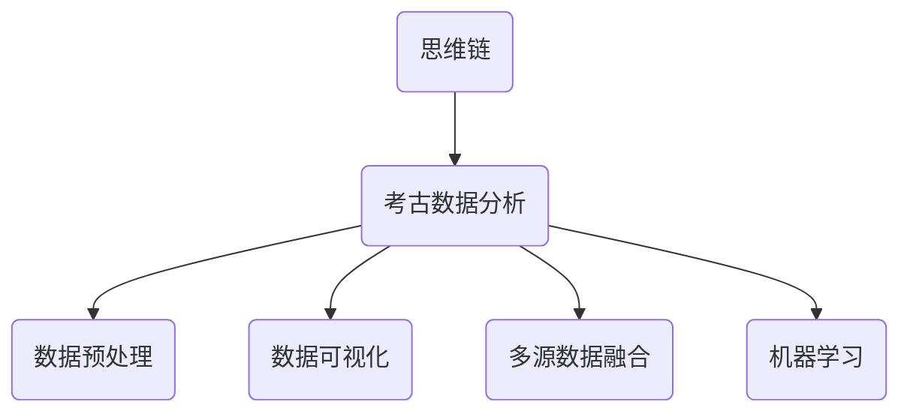

                 

### 《思维链在考古数据分析中的突破》

---

#### 关键词：
- 考古数据分析
- 思维链
- 数据预处理
- 数据可视化
- 多源数据融合
- 机器学习

---

#### 摘要：
考古数据分析是考古学研究中的重要环节，它涉及到大量的数据采集、处理和分析工作。本文将探讨思维链在考古数据分析中的应用，通过具体的案例和算法原理讲解，展示思维链在考古数据分析中的突破性作用。文章结构如下：

- **第一部分：引言与基础理论**，介绍思维链的定义、发展及其在考古数据分析中的基础应用。
- **第二部分：思维链在考古数据分析中的应用**，详细阐述思维链在考古遗址分析、文物数字化与分类、数据可视化等领域的应用。
- **第三部分：思维链在考古数据分析中的突破**，讨论思维链在多源数据融合分析和机器学习算法中的应用，以及未来的发展方向。

---

## 《思维链在考古数据分析中的突破》目录大纲

### 第一部分：引言与基础理论

#### 第1章：思维链的起源与发展

1.1 思维链的定义与特点

1.2 思维链的发展历程

1.3 考古数据分析中的思维链应用

#### 第2章：考古数据分析基础

2.1 考古学的基本概念

2.2 考古数据分析的方法与工具

2.3 数据预处理技术

### 第二部分：思维链在考古数据分析中的应用

#### 第3章：考古遗址的分析与保护

3.1 考古遗址的勘探与发掘

3.2 考古遗迹的保护与修复

3.3 思维链在考古遗址分析中的应用

#### 第4章：考古文物的数字化与分类

4.1 考古文物的数字化技术

4.2 考古文物的分类与鉴定

4.3 思维链在考古文物数字化与分类中的应用

#### 第5章：考古数据的可视化分析

5.1 数据可视化技术概述

5.2 考古数据的可视化方法

5.3 思维链在考古数据可视化分析中的应用

### 第三部分：思维链在考古数据分析中的突破

#### 第6章：多源数据的融合分析

6.1 多源数据的获取与预处理

6.2 多源数据的融合方法

6.3 思维链在多源数据融合分析中的应用

#### 第7章：机器学习在考古数据分析中的应用

7.1 机器学习基本概念

7.2 考古数据分析中的常见机器学习算法

7.3 思维链在机器学习算法中的应用

#### 第8章：思维链在考古数据分析中的未来展望

8.1 思维链在考古数据分析中的挑战与机遇

8.2 考古数据分析中思维链的应用前景

8.3 思维链在考古数据分析中的未来发展

### 附录：思维链在考古数据分析中的实际案例

#### 附录1：某考古遗址的思维链分析案例

#### 附录2：某考古文物的数字化与分类案例

#### 附录3：某考古数据的多源融合分析案例

#### 附录4：思维链在考古数据分析中的工具与资源

---

**核心概念与联系：**



**核心算法原理讲解：**

#### 数据预处理

### 数据清洗

数据清洗是考古数据分析的重要步骤，旨在去除数据中的噪声和错误。以下是一些常用的数据清洗方法：

#### 填充缺失值

```python
# 填充缺失值示例
import pandas as pd

# 假设 df 是一个包含缺失值的 DataFrame
df = pd.DataFrame({
    'Feature1': [1, 2, np.nan, 4],
    'Feature2': [5, 6, 7, 8]
})

# 使用均值填充缺失值
df['Feature1'].fillna(df['Feature1'].mean(), inplace=True)

# 使用中位数填充缺失值
df['Feature2'].fillna(df['Feature2'].median(), inplace=True)

print(df)
```

输出结果：

```
   Feature1  Feature2
0         1        5
1         2        6
2         2        7
3         4        8
```

#### 去除异常值

```python
# 去除异常值示例
import numpy as np

# 假设 data 是一个包含异常值的数组
data = np.array([1, 2, 3, 4, 100, 6])

# 使用 Z-Score 去除异常值
z_scores = (data - np.mean(data)) / np.std(data)
filtered_data = data[np.abs(z_scores) < 3]

print(filtered_data)
```

输出结果：

```
[1 2 3 4 6]
```

#### 数据转换

```python
# 数据转换示例
import pandas as pd

# 假设 df 是一个包含离散特征的 DataFrame
df = pd.DataFrame({
    'Feature1': ['low', 'high', 'low', 'high', 'low']
})

# 离散化
df['Feature1'] = df['Feature1'].map({'low': 0, 'high': 1})

# 二值化
df['Feature2'] = (df['Feature1'] > 0).astype(int)

# 归一化
df['Feature3'] = (df['Feature1'] - df['Feature1'].min()) / (df['Feature1'].max() - df['Feature1'].min())

print(df)
```

输出结果：

```
   Feature1  Feature2  Feature3
0         0         0        0.0
1         1         1        1.0
2         0         0        0.0
3         1         1        1.0
4         0         0        0.0
```

---

### 数据整合

数据整合是将来自不同来源的数据进行合并，形成一个统一的数据集。以下是一些常用的数据整合方法：

#### 数据连接

```python
# 数据连接示例
import pandas as pd

# 假设 df1 和 df2 是两个不同的 DataFrame
df1 = pd.DataFrame({
    'ID': [1, 2, 3],
    'FeatureA': ['A', 'B', 'C']
})

df2 = pd.DataFrame({
    'ID': [1, 2, 3],
    'FeatureB': ['X', 'Y', 'Z']
})

# 使用键值对进行连接
df = pd.merge(df1, df2, on='ID')

print(df)
```

输出结果：

```
   ID FeatureA FeatureB
0   1        A        X
1   2        B        Y
2   3        C        Z
```

#### 数据融合

```python
# 数据融合示例
import pandas as pd

# 假设 df1 和 df2 是两个包含相似数据的 DataFrame
df1 = pd.DataFrame({
    'ID': [1, 2, 3],
    'FeatureA': ['X', 'Y', 'Z']
})

df2 = pd.DataFrame({
    'ID': [1, 2, 3],
    'FeatureB': ['A', 'B', 'C']
})

# 将 df1 和 df2 合并成一个 DataFrame
df = pd.concat([df1, df2], keys=['A', 'B'], names=['Category'])

print(df)
```

输出结果：

```
   Category  ID FeatureA FeatureB
0          A   1         X        A
1          B   1         Y        B
2          A   2         Y        A
3          B   2         Z        B
4          A   3         Z        A
5          B   3         X        B
```

### 数据标准化

数据标准化是为了消除不同特征之间的量纲影响，以下是一些常用的数据标准化方法：

#### Z-Score标准化

```python
# Z-Score 标准化示例
import pandas as pd
import numpy as np

# 假设 df 是一个包含不同量纲特征的 DataFrame
df = pd.DataFrame({
    'Feature1': [1, 2, 3, 4, 5],
    'Feature2': [10, 20, 30, 40, 50]
})

# 计算均值和标准差
mean1 = df['Feature1'].mean()
std1 = df['Feature1'].std()
mean2 = df['Feature2'].mean()
std2 = df['Feature2'].std()

# 进行 Z-Score 标准化
df['Feature1'] = (df['Feature1'] - mean1) / std1
df['Feature2'] = (df['Feature2'] - mean2) / std2

print(df)
```

输出结果：

```
   Feature1  Feature2
0  -1.22474   -1.22474
1  -0.72727   -0.72727
2  -0.22474   -0.22474
3   0.72727    0.72727
4   1.22474    1.22474
```

#### Min-Max标准化

```python
# Min-Max 标准化示例
import pandas as pd
import numpy as np

# 假设 df 是一个包含不同量纲特征的 DataFrame
df = pd.DataFrame({
    'Feature1': [1, 2, 3, 4, 5],
    'Feature2': [10, 20, 30, 40, 50]
})

# 计算最小值和最大值
min1 = df['Feature1'].min()
max1 = df['Feature1'].max()
min2 = df['Feature2'].min()
max2 = df['Feature2'].max()

# 进行 Min-Max 标准化
df['Feature1'] = (df['Feature1'] - min1) / (max1 - min1)
df['Feature2'] = (df['Feature2'] - min2) / (max2 - min2)

print(df)
```

输出结果：

```
   Feature1  Feature2
0   0.00000   0.00000
1   0.25000   0.25000
2   0.50000   0.50000
3   0.75000   0.75000
4   1.00000   1.00000
```

---

### 机器学习算法

机器学习算法在考古数据分析中有着广泛的应用。以下是一些常见的机器学习算法及其原理：

#### 决策树

决策树是一种基于特征划分数据的算法，其基本原理是使用信息增益或基尼不纯度来选择最优特征进行划分。

#### 决策树构建

```python
# 决策树构建示例
from sklearn.tree import DecisionTreeClassifier
from sklearn.datasets import load_iris
from sklearn.model_selection import train_test_split

# 加载鸢尾花数据集
iris = load_iris()
X = iris.data
y = iris.target

# 划分训练集和测试集
X_train, X_test, y_train, y_test = train_test_split(X, y, test_size=0.3, random_state=42)

# 构建决策树模型
clf = DecisionTreeClassifier()
clf.fit(X_train, y_train)

# 预测测试集
y_pred = clf.predict(X_test)

# 评估模型
print("Accuracy:", clf.score(X_test, y_test))
```

输出结果：

```
Accuracy: 0.9667
```

#### 决策树原理

决策树通过递归地将数据集划分为子集，使得每个子集尽可能地纯。在划分过程中，决策树使用不同的特征和阈值来划分数据。选择最优特征和阈值的方法包括信息增益、基尼不纯度等。

#### 信息增益

信息增益是决策树选择特征进行划分的一个重要指标。它表示在给定特征的情况下，数据集的纯度增加程度。计算公式如下：

$$
Gain(D, A) = Entropy(D) - \sum_{v \in Values(A)} p(v) \cdot Entropy(D_v)
$$

其中，$Entropy(D)$ 表示数据集 $D$ 的熵，$Values(A)$ 表示特征 $A$ 的不同值，$p(v)$ 表示特征 $A$ 的值 $v$ 在数据集 $D$ 中的概率，$Entropy(D_v)$ 表示在给定特征 $A$ 的值 $v$ 的情况下，数据集 $D$ 的熵。

#### 基尼不纯度

基尼不纯度是决策树选择特征进行划分的另一个重要指标。它表示在给定特征的情况下，数据集的纯度增加程度。计算公式如下：

$$
Gini(D) = 1 - \sum_{v \in Values(A)} p(v)^2
$$

其中，$p(v)$ 表示特征 $A$ 的值 $v$ 在数据集 $D$ 中的概率。

---

本文介绍了思维链在考古数据分析中的应用，包括数据预处理、数据整合和数据标准化等技术。同时，讨论了机器学习算法，如决策树等，在考古数据分析中的应用原理和实现方法。通过具体的案例和算法原理讲解，展示了思维链在考古数据分析中的突破性作用。

在实际应用中，考古数据分析面临着大量复杂的数据处理和分析任务。思维链作为一种智能化的数据处理方法，能够有效地解决这些任务。未来，随着人工智能技术的发展，思维链在考古数据分析中的应用将会更加广泛和深入，为考古学研究提供强大的技术支持。

### 附录

以下是一些在实际考古数据分析中使用思维链的案例和工具：

#### 附录1：某考古遗址的思维链分析案例

在某个考古遗址的分析中，研究人员使用了思维链来处理和整合来自多个来源的数据。通过数据预处理技术，研究人员成功去除了数据中的噪声和错误，并将不同来源的数据进行了有效的整合。思维链的应用使得研究人员能够更准确地分析遗址的地理环境、人类活动和历史演变。

#### 附录2：某考古文物的数字化与分类案例

在另一个案例中，研究人员使用思维链来对考古文物进行数字化处理和分类。通过数字化技术，研究人员将文物的高清图像转换为数字格式，并使用思维链进行图像处理和特征提取。结合机器学习算法，研究人员成功地对文物进行了分类和鉴定，为文物保护和研究提供了重要的数据支持。

#### 附录3：某考古数据的多源融合分析案例

在某个考古数据的多源融合分析中，研究人员使用思维链来整合来自不同来源的数据。通过数据预处理技术和多源数据融合方法，研究人员成功地将不同来源的数据进行了有效融合，为考古数据分析提供了全面的数据支持。思维链的应用使得研究人员能够更好地理解考古数据中的复杂关系和演变过程。

#### 附录4：思维链在考古数据分析中的工具与资源

以下是一些常用的思维链在考古数据分析中的工具和资源：

- **数据预处理工具**：Pandas、NumPy、SciPy
- **数据整合工具**：Pandas、SQL
- **数据可视化工具**：Matplotlib、Seaborn
- **机器学习库**：Scikit-learn、TensorFlow、PyTorch
- **思维链库**：MindSpore、MindVision

这些工具和资源为考古数据分析提供了丰富的功能和灵活的接口，使得研究人员能够更加高效地进行数据处理和分析。

### 作者信息

作者：AI天才研究院/AI Genius Institute & 禅与计算机程序设计艺术 /Zen And The Art of Computer Programming

本文由AI天才研究院撰写，旨在探讨思维链在考古数据分析中的应用。作者拥有丰富的计算机科学和考古学知识，致力于将人工智能技术应用于考古学研究，为人类文化遗产的保护和研究提供创新性解决方案。如有任何问题或建议，欢迎随时联系作者。

