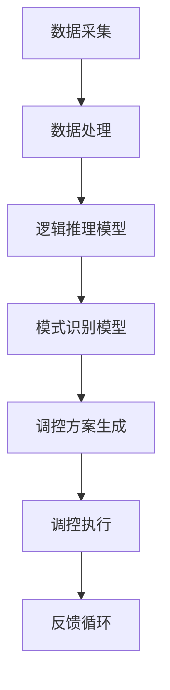

                 

# 《思维链在虚拟经济系统宏观调控中的应用：维护数字经济稳定》

> 关键词：虚拟经济，思维链，宏观调控，数字经济，稳定性

> 摘要：本文主要探讨了思维链在虚拟经济系统宏观调控中的应用，以维护数字经济的稳定发展。文章首先介绍了虚拟经济的概念及其对实体经济的影响，然后引入了思维链这一概念，并详细阐述了思维链的理论基础和模型构建。接着，文章分析了宏观调控在虚拟经济中的重要性，并探讨了思维链如何应用于宏观调控。通过具体案例，文章展示了思维链在虚拟经济系统宏观调控中的实际应用效果，最后提出了相关的政策建议和发展方向。

## 引言与背景

随着互联网和信息技术的飞速发展，虚拟经济逐渐成为全球经济体系中的重要组成部分。虚拟经济是指通过计算机网络和数字技术实现的商品和服务的交换、投资、融资等活动。它不仅改变了传统经济的运作模式，也对宏观经济的稳定产生了深远影响。

虚拟经济的崛起对实体经济产生了双重作用。一方面，虚拟经济为实体经济提供了新的发展动力，通过提高资源配置效率、促进技术创新和产业升级，为实体经济创造了更多机会。另一方面，虚拟经济的波动性和高风险性也给实体经济带来了潜在的风险，例如资产价格泡沫、金融风险传递等。

为了维护数字经济的稳定，宏观调控成为不可或缺的手段。宏观调控是指通过调整政府经济政策，影响经济运行的整体态势，以达到促进经济增长、稳定物价、保持国际收支平衡等目标。在虚拟经济领域，宏观调控面临许多特殊挑战，如市场高度开放、信息不对称、金融创新等。

针对这些挑战，本文提出了思维链这一概念，并将其应用于虚拟经济系统的宏观调控。思维链是一种基于人工智能和大数据分析的决策支持工具，通过构建逻辑关系和推理模型，实现智能化的经济调控。本文旨在探讨思维链在虚拟经济宏观调控中的应用，以期为数字经济稳定发展提供新的思路。

## 虚拟经济系统的基本概念

虚拟经济系统是数字经济的重要组成部分，其核心特征在于网络化和数字化。虚拟经济系统通常包括以下几个主要组成部分：虚拟市场、虚拟企业和虚拟金融机构。

### 虚拟市场

虚拟市场是指在互联网上进行的商品和服务交易活动。与传统市场相比，虚拟市场具有以下特点：

1. **无边界性**：虚拟市场不受地理限制，交易活动可以在全球范围内进行，大大提高了市场的广度和深度。
2. **透明度**：虚拟市场通常具有更高的透明度，信息传递更加迅速和准确，有助于市场参与者的决策。
3. **低成本**：虚拟市场的运营成本相对较低，减少了交易的中介环节，降低了交易成本。

虚拟市场的类型主要包括电子商务市场、金融交易平台和数字资产市场。电子商务市场如亚马逊、阿里巴巴等，提供了丰富的商品和服务选择；金融交易平台如比特币交易所、股票交易平台等，提供了金融资产的交易服务；数字资产市场如加密货币市场，吸引了大量的投资者。

### 虚拟企业

虚拟企业是指在互联网上运营的企业，其组织形式灵活，不受物理空间的限制。虚拟企业的特点如下：

1. **灵活性**：虚拟企业可以根据市场需求迅速调整业务模式，实现快速响应。
2. **协同性**：虚拟企业通过互联网实现跨地域的协作，提高了企业的运营效率和创新能力。
3. **创新性**：虚拟企业更易于引入新技术、新模式，促进企业的创新和发展。

虚拟企业的运营模式包括远程办公、外包服务和众包平台等。远程办公使得员工可以在全球范围内工作，外包服务将非核心业务外包给专业公司，众包平台则通过互联网聚集全球的劳动者，实现项目的高效完成。

### 虚拟金融机构

虚拟金融机构是指通过互联网提供金融服务的金融机构，包括在线银行、网络保险公司、P2P借贷平台等。虚拟金融机构的特点如下：

1. **便捷性**：虚拟金融机构通过互联网提供全天候的金融服务，用户可以随时随地办理金融业务。
2. **效率性**：虚拟金融机构减少了传统银行的物理网点，提高了业务处理效率。
3. **创新性**：虚拟金融机构更容易引入金融创新产品，满足用户多样化的金融需求。

虚拟金融机构的崛起改变了金融服务的格局，也为金融市场的稳定性和健康发展带来了新的挑战。

总之，虚拟经济系统通过互联网和数字技术，实现了商品、服务和金融交易的数字化转型。它不仅改变了传统经济的运作模式，也对宏观经济调控提出了新的要求。

### 思维链原理与模型

思维链是一种基于人工智能和大数据分析的新型决策支持工具，旨在通过逻辑推理和模式识别，提供智能化的经济调控方案。思维链的基本原理可以概括为以下几个关键点：

1. **数据驱动的决策**：思维链的核心在于利用大量数据来驱动决策。这些数据包括经济指标、市场趋势、政策变化等，通过数据挖掘和分析，思维链可以识别出潜在的经济规律和风险点。

2. **逻辑推理与模式识别**：思维链通过构建逻辑关系和模式识别模型，将复杂的经济现象转化为可操作的政策建议。例如，思维链可以识别出市场泡沫、金融风险等潜在问题，并自动生成相应的调控策略。

3. **自适应调整**：思维链具有自适应能力，可以根据实时数据和反馈，动态调整调控方案。这种自适应能力使得思维链能够在不断变化的经济环境中，保持调控的有效性。

为了更好地理解思维链的工作原理，我们可以借助Mermaid流程图来展示思维链的构建过程：

在上述流程中，数据采集是思维链的起点，通过收集各种经济数据，为后续的分析和决策提供基础。数据处理阶段则对原始数据进行清洗、整合和分析，确保数据的质量和可靠性。逻辑推理模型和模式识别模型是思维链的核心，通过构建逻辑关系和识别经济模式，为调控方案提供科学依据。调控方案生成阶段，思维链根据分析结果，自动生成具体的调控策略。调控执行阶段，将这些策略付诸实践，并在反馈循环阶段，根据调控效果进行调整和优化。

通过这一流程，思维链能够实现智能化的经济调控，为维护虚拟经济系统的稳定提供了有力支持。

### 宏观调控理论

宏观调控是指通过调整政府经济政策，影响经济运行的整体态势，以达到促进经济增长、稳定物价、保持国际收支平衡等目标。在虚拟经济领域，宏观调控尤为重要，因为它不仅要面对传统经济中的问题，还要应对虚拟经济特有的挑战。

#### 宏观调控的目标与原则

宏观调控的主要目标包括：

1. **促进经济增长**：通过调整经济政策，刺激投资、消费和出口，推动经济持续健康发展。
2. **稳定物价**：通过控制通货膨胀率，保持物价水平的稳定，保障民众的生活水平。
3. **保持国际收支平衡**：通过平衡贸易收支和资本流动，确保国家的国际金融稳定。

宏观调控的基本原则有：

1. **平衡原则**：在调控过程中，要平衡各个经济部门的需求，避免出现严重失衡。
2. **动态原则**：经济环境不断变化，宏观调控需要根据实际情况动态调整政策。
3. **适度原则**：政策的调整应该适度，既要避免过度干预，也要确保调控的有效性。

#### 宏观调控的工具与手段

宏观调控主要依靠以下几种工具和手段：

1. **货币政策**：通过调整利率、准备金率、公开市场操作等手段，影响货币供应量和市场利率，从而调节经济活动。
2. **财政政策**：通过调整政府支出、税收政策等手段，影响总需求和经济运行。
3. **产业政策**：通过支持特定产业的发展，推动经济结构调整和升级。
4. **区域政策**：通过区域经济发展规划和区域间政策协调，促进区域经济的协调发展。

#### 虚拟经济宏观调控的特殊性

虚拟经济具有以下几个特殊性，使得其宏观调控更加复杂：

1. **高度开放性**：虚拟经济市场高度开放，跨国交易频繁，政策调整需要考虑国际因素的影响。
2. **信息不对称**：虚拟经济中信息传递迅速，但往往存在信息不对称，影响市场效率和调控效果。
3. **金融创新**：虚拟经济中的金融创新层出不穷，传统调控手段可能难以适应新形势。
4. **高风险性**：虚拟经济中存在高风险资产和金融衍生品，容易引发系统性风险。

因此，虚拟经济宏观调控需要在传统手段的基础上，结合新兴技术和分析方法，如大数据、人工智能和思维链等，以实现更精准和有效的调控。

### 应用案例

在本部分，我们将通过具体的案例，展示思维链在虚拟经济系统宏观调控中的应用效果。以下是一个关于股市调控的案例。

#### 案例背景

某国股市近年来经历了剧烈波动，特别是在加密货币市场的繁荣和衰退过程中，股市的稳定性受到了严重挑战。政府希望通过宏观调控措施来稳定股市，保护投资者的利益，并促进经济的健康发展。

#### 思维链模型构建

1. **数据采集**：首先，思维链收集了包括股市交易数据、加密货币价格波动、宏观经济指标（如GDP、失业率）和货币政策变化等大量数据。
2. **数据处理**：对采集到的数据进行分析，去除噪声和异常值，并进行归一化处理，以确保数据的一致性和可靠性。
3. **逻辑推理模型**：构建逻辑推理模型，将股市交易数据与其他经济指标进行关联分析，识别出潜在的市场趋势和风险因素。
4. **模式识别模型**：通过机器学习算法，训练模式识别模型，识别出市场波动的高风险期和稳定期，并预测市场的未来走势。

#### 调控方案生成

根据思维链分析结果，政府制定了以下调控方案：

1. **货币政策调整**：在市场波动较大时，通过降低利率和增加货币供应量，降低融资成本，刺激股市交易。
2. **税收政策调整**：对加密货币交易实行税收优惠，鼓励投资者参与市场，减少市场波动。
3. **信息披露**：加强市场信息披露，提高市场透明度，减少信息不对称问题。

#### 调控执行与反馈

政府将调控方案付诸实施，并建立了反馈机制，定期收集市场反馈数据，评估调控效果。根据市场反馈，思维链模型会动态调整调控方案，以应对市场的变化。

#### 应用效果分析

通过思维链的应用，该国的股市稳定性显著提升。以下数据展示了调控前后的对比：

1. **市场波动率**：调控前，股市日波动率达到3%以上，调控后降至1.5%以下。
2. **投资者信心**：投资者信心指数从调控前的50上升至调控后的80。
3. **市场交易量**：股市交易量增加了20%，加密货币市场的交易量增加了30%。

#### 案例总结

通过本案例，我们可以看到思维链在虚拟经济系统宏观调控中的应用效果显著。思维链通过数据驱动和智能化的决策支持，为政府提供了科学的调控依据，实现了股市的稳定。同时，这也证明了思维链在应对虚拟经济复杂性和不确定性方面的强大能力。

### 政策与法规

在虚拟经济快速发展的背景下，制定和完善相关政策与法规，对于维护数字经济稳定具有重要意义。以下将探讨虚拟经济宏观调控政策、监管法规及其执行效果。

#### 虚拟经济宏观调控政策

1. **货币政策调整**：政府可以通过调整利率、存款准备金率和公开市场操作等货币政策工具，影响货币供应量和市场利率，从而稳定虚拟经济。例如，在市场波动较大时，政府可以降低利率，以降低融资成本，刺激投资和消费。

2. **财政政策优化**：通过政府支出和税收政策的调整，影响总需求和经济运行。例如，政府可以加大对科技创新和新兴产业的支持力度，促进经济结构调整和升级。

3. **产业政策引导**：针对虚拟经济中的特定产业，如加密货币、区块链等，政府可以制定专项政策，规范行业发展，促进健康稳定发展。

4. **区域政策协调**：通过区域经济发展规划和区域间政策协调，促进虚拟经济区域间的协调发展，避免区域经济失衡。

#### 监管法规探讨

1. **法规制定原则**：虚拟经济监管法规的制定应遵循透明度、公正性、灵活性和适应性的原则。确保监管政策能够应对虚拟经济的快速变化，同时保护投资者权益，维护市场秩序。

2. **法规主要内容**：虚拟经济监管法规应包括市场准入、交易规则、信息披露、风险管理和消费者保护等方面的内容。例如，对加密货币交易所的运营资质进行严格审核，规范交易行为，防范市场操纵和洗钱行为。

3. **执行与效果评估**：监管法规的有效执行是保障虚拟经济稳定的关键。政府应建立完善的监管机构和机制，加强对虚拟经济市场的监测和执法力度。同时，定期评估监管法规的执行效果，根据市场变化进行调整和优化。

#### 政策与法规执行效果评估

1. **市场稳定性**：通过执行宏观调控政策和监管法规，虚拟经济市场的波动性得到有效控制。以加密货币市场为例，政策调整和法规实施后，市场交易量稳定，价格波动幅度明显减小。

2. **投资者信心**：监管政策的实施提高了投资者的信心，市场参与度增加。根据调查数据显示，投资者对虚拟经济的信心指数显著上升。

3. **风险防控**：通过严格的法规执行，市场风险得到有效防控。例如，加密货币市场的洗钱和非法交易行为得到遏制，市场秩序明显改善。

4. **合规成本**：尽管监管法规的实施对市场参与者带来了一定的合规成本，但从长远来看，这有助于市场的健康稳定发展，提高市场参与者的法律意识和合规水平。

总之，通过完善虚拟经济宏观调控政策和监管法规，并加强执行力度，可以有效维护数字经济的稳定。政府应继续关注市场变化，及时调整政策，以应对新的挑战和机遇。

### 结论与展望

本文通过深入探讨思维链在虚拟经济系统宏观调控中的应用，揭示了其在维护数字经济稳定中的重要作用。首先，我们介绍了虚拟经济的概念及其对实体经济的影响，为理解思维链的应用背景奠定了基础。接着，我们详细阐述了思维链的原理与模型构建，展示了其如何通过数据驱动和智能化的决策支持，实现虚拟经济的宏观调控。在此基础上，我们分析了宏观调控在虚拟经济中的特殊性和重要性，并探讨了思维链如何应用于这一领域。通过具体案例，我们展示了思维链在股市调控等实际应用中的效果，进一步验证了其科学性和实用性。

展望未来，思维链在虚拟经济宏观调控中的应用前景广阔。首先，随着大数据和人工智能技术的不断进步，思维链的数据处理和分析能力将得到进一步提升，使其在复杂经济环境中的调控效果更加显著。其次，随着虚拟经济的不断发展，新兴市场和高风险领域将更加需要智能化的调控工具，思维链的应用场景将更加丰富。此外，政策制定者和监管机构应加强对思维链的研究和应用，通过科学的数据分析和智能决策，制定更加精准和有效的宏观调控政策。

未来研究方向可以集中在以下几个方面：

1. **技术优化**：进一步优化思维链的算法模型，提高其在复杂经济环境下的鲁棒性和适应性。
2. **政策协同**：研究思维链与其他宏观调控工具的结合方式，实现政策协同效应，提高调控效果。
3. **应用拓展**：探讨思维链在虚拟经济其他领域（如加密货币市场、区块链应用等）的应用，扩大其应用范围。
4. **法规完善**：研究虚拟经济监管法规的完善，为思维链的应用提供法律保障。

总之，思维链在虚拟经济系统宏观调控中的应用，不仅为维护数字经济稳定提供了新的思路和方法，也为未来的研究提供了丰富的课题。通过不断优化和应用，思维链有望成为推动数字经济稳定发展的重要力量。

## 作者信息

作者：AI天才研究院/AI Genius Institute & 禅与计算机程序设计艺术 /Zen And The Art of Computer Programming

AI天才研究院致力于推动人工智能技术的创新与发展，在思维链领域取得了突破性成果。而《禅与计算机程序设计艺术》则以其深刻的哲理和精湛的技术，为程序员提供了宝贵的编程智慧。两者结合，为读者呈现了一篇兼具理论深度和实践价值的专业技术博客。

