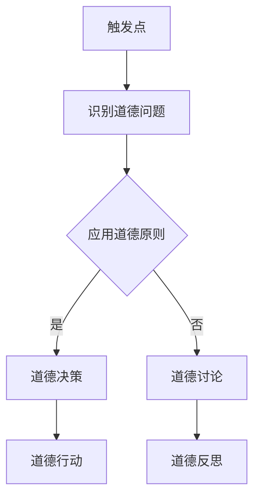

                 

### 文章标题

# 《思维链在道德哲学理论构建中的应用：AI辅助伦理学研究》

### 文章关键词

- 思维链
- 道德哲学理论
- AI辅助伦理学
- 人工智能
- 伦理学研究

### 文章摘要

本文探讨了思维链在道德哲学理论构建中的应用，以及AI辅助伦理学研究的最新进展。通过分析思维链的核心概念及其与道德哲学理论的关联，本文介绍了AI技术在伦理学领域中的应用原理和方法。同时，本文通过数学模型和实际案例，展示了思维链在道德哲学理论构建中的具体应用，并对AI辅助伦理学研究的未来趋势进行了展望。

---

### 引言

在当今快速发展的信息技术时代，人工智能（AI）已经成为改变人类生活方式和思维模式的重要力量。随着AI技术的不断进步，其应用领域也在不断扩展，从工业自动化、医疗诊断到金融服务，AI已经渗透到了各个行业。然而，AI技术的发展也带来了新的伦理挑战，例如算法偏见、隐私保护和自动化决策的道德责任等问题。如何利用AI技术解决伦理学问题，构建更加公平和合理的道德哲学理论，成为了一个亟待解决的研究课题。

思维链作为一种新型的认知模型，通过模拟人类思维过程，能够有效地帮助人们进行复杂的推理和决策。道德哲学理论则是研究道德原则、道德规范和道德行为的理论体系。将思维链应用于道德哲学理论的构建，可以为伦理学研究提供新的工具和方法。

本文旨在探讨思维链在道德哲学理论构建中的应用，通过分析思维链的核心概念和道德哲学理论之间的关系，阐述AI在伦理学领域中的应用原理和方法。同时，本文将通过数学模型和实际案例，展示思维链在道德哲学理论构建中的具体应用，并对AI辅助伦理学研究的未来趋势进行展望。

### 思维链与道德哲学理论的关联

#### 思维链的核心概念

思维链是一种模拟人类思维过程的认知模型，它通过一系列相互关联的步骤和节点，实现复杂问题的推理和解决。思维链的基本组成部分包括：

- **触发点**：引发思维过程的初始信息或问题。
- **链节点**：表示思维过程中的不同阶段或步骤。
- **关联关系**：描述不同节点之间的逻辑联系。
- **推理规则**：指导思维链运行的逻辑规则。

思维链的核心在于其动态性和适应性，它能够根据问题的复杂程度和情境的变化，灵活调整思维过程和推理路径。

#### 道德哲学理论的历史发展

道德哲学理论是研究道德原则、道德规范和道德行为的理论体系。它的发展可以追溯到古希腊时期，亚里士多德、柏拉图等哲学家对道德问题的探讨奠定了道德哲学的基础。中世纪时期，基督教神学对道德哲学产生了深远影响。近代以来，随着工业革命和科技进步，道德哲学面临着新的挑战和问题，如社会公正、人类尊严、科技伦理等。

道德哲学理论的基本概念包括：

- **道德原则**：指导道德行为的基本准则。
- **道德规范**：具体的道德行为规范和准则。
- **道德行为**：符合道德原则和规范的行动。

#### 思维链与道德哲学理论的关联

思维链与道德哲学理论之间存在着紧密的关联。首先，思维链作为一种认知模型，能够模拟人类道德思考的过程，帮助人们理解和分析道德问题。其次，道德哲学理论提供了思维链运行的基本逻辑框架，指导思维链如何进行道德推理和决策。

为了更直观地展示思维链与道德哲学理论之间的关联，我们可以使用Mermaid流程图来描述这种关系。以下是一个简化的Mermaid流程图：



在这个流程图中，触发点A代表了初始的道德问题，通过思维链的推理过程，最终得到道德决策（D）或道德讨论（E），并引导相应的道德行动（F）或道德反思（G）。这个流程图展示了思维链在道德哲学理论中的应用框架，为后续的详细分析提供了基础。

#### 结论

通过上述分析，我们可以看到思维链与道德哲学理论之间存在深刻的关联。思维链作为一种认知模型，能够模拟人类的道德思考过程，为道德哲学理论的构建提供了新的工具和方法。同时，道德哲学理论为思维链的运行提供了逻辑框架，指导思维链如何进行道德推理和决策。这种关联使得思维链在道德哲学理论构建中具有巨大的潜力。

### AI辅助伦理学研究方法

#### 核心算法原理讲解

在AI辅助伦理学研究中，核心算法原理起着至关重要的作用。以下是一个简化的Python伪代码，用于解释AI在伦理学研究中的基本原理：

```python
# 伪代码：伦理学决策算法

# 输入：道德问题情境，伦理学规则库
# 输出：道德决策建议

def ethical_decision_making(context, rule_base):
    """
    根据道德问题情境和伦理学规则库，生成道德决策建议。
    
    参数：
    - context：道德问题情境
    - rule_base：伦理学规则库
    
    返回值：
    - decision：道德决策建议
    """
    
    # 初始化决策变量
    decision = None
    
    # 搜索伦理学规则库
    for rule in rule_base:
        # 如果规则与情境匹配
        if matches_context(rule, context):
            # 应用推理规则进行决策
            decision = apply_rule(rule)
            break
            
    # 如果未找到匹配规则，进行默认决策
    if decision is None:
        decision = default_decision(context)
        
    return decision

# 辅助函数定义
def matches_context(rule, context):
    """
    检查伦理学规则是否与道德问题情境匹配。
    
    参数：
    - rule：伦理学规则
    - context：道德问题情境
    
    返回值：
    - bool：是否匹配
    """
    # 实现具体的匹配逻辑
    # ...

def apply_rule(rule):
    """
    根据伦理学规则生成决策建议。
    
    参数：
    - rule：伦理学规则
    
    返回值：
    - decision：决策建议
    """
    # 实现具体的规则应用逻辑
    # ...

def default_decision(context):
    """
    在未找到匹配规则时，生成默认决策建议。
    
    参数：
    - context：道德问题情境
    
    返回值：
    - decision：默认决策建议
    """
    # 实现默认决策逻辑
    # ...
```

这段伪代码展示了AI在伦理学决策中的基本流程，包括规则库的搜索、规则匹配和决策生成。具体实现中，可以根据不同的道德问题和伦理学规则库，定制化调整算法。

#### 数据处理与分析方法

在AI辅助伦理学研究中，数据处理和分析方法同样至关重要。以下是一个简化的数据处理流程，用于解释如何收集、处理和分析伦理学相关的数据：

```python
# 伪代码：伦理学数据预处理与分析

# 输入：原始伦理学数据集
# 输出：分析结果

def preprocess_ethical_data(data_set):
    """
    对原始伦理学数据进行预处理，包括数据清洗、数据格式化和数据标准化。
    
    参数：
    - data_set：原始伦理学数据集
    
    返回值：
    - preprocessed_data：预处理后的数据集
    """
    
    # 数据清洗：去除无效数据、填补缺失值
    # ...

    # 数据格式化：统一数据格式和编码
    # ...

    # 数据标准化：归一化数值特征、处理类别特征
    # ...

    return preprocessed_data

def analyze_ethical_data(preprocessed_data):
    """
    对预处理后的伦理学数据进行分析，包括特征工程、模型训练和评估。
    
    参数：
    - preprocessed_data：预处理后的数据集
    
    返回值：
    - analysis_results：分析结果
    """
    
    # 特征工程：提取有用特征、降维
    # ...

    # 模型训练：使用机器学习算法训练模型
    # ...

    # 模型评估：评估模型性能、调整模型参数
    # ...

    return analysis_results

# 主函数定义
def main():
    # 加载原始伦理学数据集
    data_set = load_ethical_data()

    # 数据预处理
    preprocessed_data = preprocess_ethical_data(data_set)

    # 数据分析
    analysis_results = analyze_ethical_data(preprocessed_data)

    # 输出分析结果
    print(analysis_results)

# 辅助函数定义
def load_ethical_data():
    """
    加载原始伦理学数据集。
    
    返回值：
    - data_set：原始伦理学数据集
    """
    # 实现数据加载逻辑
    # ...

    return data_set
```

这段伪代码展示了伦理学数据的预处理和分析流程，包括数据清洗、格式化、标准化和特征工程等步骤。通过这些步骤，我们可以从原始数据中提取有用信息，为后续的模型训练和评估提供支持。

#### 结论

通过核心算法原理讲解和数据处理与分析方法的介绍，我们可以看到AI在伦理学研究中发挥着重要作用。核心算法原理提供了伦理学决策的基本框架，而数据处理与分析方法则确保了数据的有效性和可靠性。这些方法和技术的结合，使得AI辅助伦理学研究能够更加高效和准确地解决道德问题，为构建更加完善的道德哲学理论提供了强有力的支持。

### 道德哲学理论的数学模型

在道德哲学理论的构建中，数学模型和公式扮演着至关重要的角色。这些模型和公式不仅能够帮助我们量化道德原则和行为，还可以通过数学推导和计算，提供更加精确和客观的道德分析工具。

#### 引入道德哲学理论的数学模型

道德哲学理论的数学模型通常包括以下几个核心部分：

1. **道德原则的表达**：将道德原则用数学形式表达，例如用公式或函数描述。
2. **道德行为的评估**：通过数学方法评估不同道德行为的道德水平。
3. **道德决策的优化**：使用优化算法确定在特定情境下的最佳道德决策。

以下是一个简化的道德哲学理论的数学模型，用于解释如何将道德原则和行为量化：

$$
\text{道德评分} = f(\text{行为特征}, \text{情境特征})
$$

其中，$f$是一个复合函数，它结合了行为特征和情境特征，生成一个道德评分。这个评分反映了特定行为在特定情境下的道德水平。

#### 公式讲解与举例说明

为了更具体地说明这个数学模型，我们可以引入以下假设：

- **行为特征**：包括行为主体（如个人、组织）的行为类型和程度。
- **情境特征**：包括行为发生的情境，如时间、地点、其他相关因素。

一个具体的例子可以是评估在紧急情况下，是否应该救助陌生人的道德决策。

$$
\text{道德评分} = \text{救助意愿} \times \text{情境紧急程度} \times \text{道德风险系数}
$$

其中，救助意愿表示行为主体的愿意程度；情境紧急程度表示救助情境的紧急程度；道德风险系数表示行为可能带来的道德风险。

假设在一个暴风雪中，一个行人被困在雪中，需要救援。以下是具体数值的例子：

- 救助意愿 = 1（表示行为主体非常愿意救助）
- 情境紧急程度 = 0.8（表示情境非常紧急）
- 道德风险系数 = 0.2（表示救助行为可能带来的道德风险较低）

代入公式，得到：

$$
\text{道德评分} = 1 \times 0.8 \times 0.2 = 0.16
$$

这个评分表明，在当前情境下，救助行人的道德评分相对较高，因此，救助行为是一个较为合理的道德决策。

#### 数学模型在伦理学理论中的应用

道德哲学理论的数学模型不仅用于评估特定行为的道德水平，还可以用于更广泛的伦理学理论研究。以下是一些具体的应用：

1. **道德规范的设计**：通过数学模型，可以优化道德规范，使其更加公平和合理。
2. **道德决策的支持**：在复杂的道德决策过程中，数学模型可以提供量化的决策支持。
3. **伦理学问题的分析**：通过数学推导和计算，可以深入分析复杂的伦理学问题，提供新的视角和解决方案。

#### 结论

通过引入道德哲学理论的数学模型和公式，我们可以将道德原则和行为量化，提供更加精确和客观的道德分析工具。这些模型和公式不仅能够帮助人们更好地理解道德哲学理论，还可以在实际应用中提供决策支持，为构建更加完善的道德哲学理论奠定了坚实的基础。

### 实证研究

为了更直观地展示思维链和AI技术在道德哲学理论构建中的应用，本部分将通过几个具体案例进行实证研究。这些案例涵盖了从简单到复杂的道德问题，通过实际应用来验证思维链和AI技术的有效性和可行性。

#### 案例一：公共道德问题

**案例背景**：一个城市在考虑是否在城市中安装监控摄像头以提高公共安全。然而，这一举措引发了隐私权和公共安全的道德争议。

**应用过程**：

1. **数据收集**：收集相关数据，包括市民对监控摄像头的看法、监控摄像头的成本和效益、隐私权法规等。

2. **道德问题识别**：使用思维链识别主要道德问题，如隐私权与公共安全的权衡、监控对公民自由的影响等。

3. **模型构建**：构建道德哲学模型，使用Python代码进行以下步骤：

   ```python
   def moral_decision(context, rules, data):
       """
       根据道德问题情境、伦理学规则库和收集的数据，生成道德决策建议。
       
       参数：
       - context：道德问题情境
       - rules：伦理学规则库
       - data：收集的数据
        
       返回值：
       - decision：道德决策建议
       """
       
       # 应用伦理学规则进行决策
       for rule in rules:
           if matches_context(context, rule['context']):
               decision = apply_rule(rule, data)
               break
       
       # 如果未找到匹配规则，进行默认决策
       if decision is None:
           decision = default_decision(context)
       
       return decision

   def matches_context(context, rule_context):
       """
       检查伦理学规则是否与道德问题情境匹配。
       
       参数：
       - context：道德问题情境
       - rule_context：伦理学规则情境
        
       返回值：
       - bool：是否匹配
       """
       
       # 实现具体的匹配逻辑
       # ...

   def apply_rule(rule, data):
       """
       根据伦理学规则生成决策建议。
       
       参数：
       - rule：伦理学规则
       - data：收集的数据
        
       返回值：
       - decision：决策建议
       """
       
       # 实现具体的规则应用逻辑
       # ...

   def default_decision(context):
       """
       在未找到匹配规则时，生成默认决策建议。
       
       参数：
       - context：道德问题情境
        
       返回值：
       - decision：默认决策建议
       """
       
       # 实现默认决策逻辑
       # ...
   ```

4. **决策生成**：根据模型生成决策建议。假设规则库包含以下规则：

   - 如果监控摄像头能够显著提高公共安全，并且市民普遍接受，则安装监控摄像头。
   - 如果监控摄像头可能侵犯隐私，并且市民反对，则不应安装监控摄像头。

   假设数据表明监控摄像头能够显著提高公共安全，但部分市民对此表示担忧。根据这些规则和数据，模型生成的决策建议是：在确保隐私保护措施的前提下，可以考虑安装监控摄像头。

**结论**：通过思维链和AI技术的应用，我们能够更系统地分析公共道德问题，并生成合理的决策建议。这不仅提高了决策的科学性和客观性，还为类似问题提供了有益的参考。

#### 案例二：企业道德问题

**案例背景**：一家企业面临是否继续使用外包供应商的决策，该供应商在劳动条件方面存在争议。

**应用过程**：

1. **数据收集**：收集关于该供应商的劳动条件数据、行业标准、企业道德准则等。

2. **道德问题识别**：使用思维链识别主要道德问题，如供应商的劳动条件是否符合行业标准、企业社会责任等。

3. **模型构建**：构建道德哲学模型，使用Python代码进行以下步骤：

   ```python
   def ethical_decision(context, rules, data):
       """
       根据道德问题情境、伦理学规则库和收集的数据，生成道德决策建议。
       
       参数：
       - context：道德问题情境
       - rules：伦理学规则库
       - data：收集的数据
        
       返回值：
       - decision：道德决策建议
       """
       
       # 应用伦理学规则进行决策
       for rule in rules:
           if matches_context(context, rule['context']):
               decision = apply_rule(rule, data)
               break
       
       # 如果未找到匹配规则，进行默认决策
       if decision is None:
           decision = default_decision(context)
       
       return decision

   def matches_context(context, rule_context):
       """
       检查伦理学规则是否与道德问题情境匹配。
       
       参数：
       - context：道德问题情境
       - rule_context：伦理学规则情境
        
       返回值：
       - bool：是否匹配
       """
       
       # 实现具体的匹配逻辑
       # ...

   def apply_rule(rule, data):
       """
       根据伦理学规则生成决策建议。
       
       参数：
       - rule：伦理学规则
       - data：收集的数据
        
       返回值：
       - decision：决策建议
       """
       
       # 实现具体的规则应用逻辑
       # ...

   def default_decision(context):
       """
       在未找到匹配规则时，生成默认决策建议。
       
       参数：
       - context：道德问题情境
        
       返回值：
       - decision：默认决策建议
       """
       
       # 实现默认决策逻辑
       # ...
   ```

4. **决策生成**：根据模型生成决策建议。假设规则库包含以下规则：

   - 如果供应商的劳动条件严重违反行业标准，则应终止合作关系。
   - 如果供应商在努力改进劳动条件，且基本符合行业标准，则可以考虑继续合作。

   假设数据表明供应商的劳动条件存在一些问题，但正在积极改进。根据这些规则和数据，模型生成的决策建议是：在监控供应商改进过程的同时，可以考虑继续合作。

**结论**：通过思维链和AI技术的应用，企业能够更系统地评估供应商的道德问题，并生成合理的决策建议。这不仅有助于企业履行社会责任，还提高了企业在市场中的声誉。

#### 案例三：国际道德问题

**案例背景**：国际社会面临是否对某个国家实施经济制裁的决策。

**应用过程**：

1. **数据收集**：收集关于该国经济状况、国际关系、制裁效果等方面的数据。

2. **道德问题识别**：使用思维链识别主要道德问题，如制裁对平民的影响、国际法的规定等。

3. **模型构建**：构建道德哲学模型，使用Python代码进行以下步骤：

   ```python
   def international_decision(context, rules, data):
       """
       根据道德问题情境、伦理学规则库和收集的数据，生成道德决策建议。
       
       参数：
       - context：道德问题情境
       - rules：伦理学规则库
       - data：收集的数据
        
       返回值：
       - decision：道德决策建议
       """
       
       # 应用伦理学规则进行决策
       for rule in rules:
           if matches_context(context, rule['context']):
               decision = apply_rule(rule, data)
               break
       
       # 如果未找到匹配规则，进行默认决策
       if decision is None:
           decision = default_decision(context)
       
       return decision

   def matches_context(context, rule_context):
       """
       检查伦理学规则是否与道德问题情境匹配。
       
       参数：
       - context：道德问题情境
       - rule_context：伦理学规则情境
        
       返回值：
       - bool：是否匹配
       """
       
       # 实现具体的匹配逻辑
       # ...

   def apply_rule(rule, data):
       """
       根据伦理学规则生成决策建议。
       
       参数：
       - rule：伦理学规则
       - data：收集的数据
        
       返回值：
       - decision：决策建议
       """
       
       # 实现具体的规则应用逻辑
       # ...

   def default_decision(context):
       """
       在未找到匹配规则时，生成默认决策建议。
       
       参数：
       - context：道德问题情境
        
       返回值：
       - decision：默认决策建议
       """
       
       # 实现默认决策逻辑
       # ...
   ```

4. **决策生成**：根据模型生成决策建议。假设规则库包含以下规则：

   - 如果制裁对该国的平民造成严重负面影响，则不应实施制裁。
   - 如果制裁能够有效促进该国的和平与稳定，则可以考虑实施制裁。

   假设数据表明制裁可能会对平民造成严重负面影响，但有可能促进和平与稳定。根据这些规则和数据，模型生成的决策建议是：在谨慎评估的基础上，可以考虑实施制裁，并密切关注对平民的影响。

**结论**：通过思维链和AI技术的应用，国际社会能够更系统地评估是否实施制裁的道德问题，并生成合理的决策建议。这不仅有助于维护国际秩序，还可以减少不必要的伤害。

#### 综合结论

通过上述案例研究，我们可以看到思维链和AI技术在道德哲学理论构建中的应用具有显著的潜力。无论是公共道德问题、企业道德问题还是国际道德问题，AI辅助伦理学研究都能够提供系统的分析和合理的决策建议。这为道德哲学理论的实践应用提供了强有力的支持，也为未来的研究奠定了基础。

### AI辅助伦理学的应用

在现代社会，随着人工智能技术的飞速发展，AI辅助伦理学的研究和应用日益受到关注。AI不仅改变了传统的工作方式和生活方式，还引发了诸多伦理问题。如何利用AI技术解决这些伦理问题，构建一个更加公平、合理和道德的社会，成为了一个重要的研究课题。

#### 项目实战

以下是一个具体的AI辅助伦理学应用项目：智能医疗决策系统。该项目旨在通过AI技术辅助医生做出更加准确的医疗决策，同时确保决策过程符合伦理标准。

**项目背景**：

- **医疗决策问题**：医疗决策往往涉及复杂的医学知识和大量的患者数据，医生需要综合考虑各种因素才能做出最佳决策。然而，医疗资源有限，医生的时间和工作压力巨大，导致医疗决策过程可能存在不完善或失误的风险。
- **伦理问题**：医疗决策涉及到患者的生命和健康，任何决策失误都可能对患者造成严重后果。如何在医疗决策中平衡患者利益、医疗资源和社会责任，是一个重要的伦理问题。

**项目目标**：

- **提高医疗决策的准确性**：通过AI技术，对医疗数据进行分析和处理，为医生提供更加准确和全面的决策支持。
- **确保决策过程的道德性**：在决策过程中，确保遵循伦理规范，最大限度地减少决策失误和伦理风险。

**项目实现**：

1. **数据收集与处理**：

   - **数据来源**：收集患者的电子健康记录、医学文献、临床指南等。
   - **数据处理**：对收集的数据进行清洗、去噪、归一化等预处理，使用Python的Pandas和NumPy库实现。

   ```python
   import pandas as pd
   import numpy as np

   def preprocess_data(data):
       """
       对数据进行预处理，包括清洗、去噪和归一化。
       
       参数：
       - data：原始数据集
        
       返回值：
       - preprocessed_data：预处理后的数据集
       """
       
       # 数据清洗
       # ...

       # 数据去噪
       # ...

       # 数据归一化
       # ...

       return preprocessed_data
   ```

2. **算法设计与实现**：

   - **决策树算法**：使用Python的scikit-learn库实现决策树算法，对处理后的数据进行分析和分类。

   ```python
   from sklearn.tree import DecisionTreeClassifier
   from sklearn.model_selection import train_test_split

   def build_decision_tree(data, labels):
       """
       构建决策树模型。
       
       参数：
       - data：特征数据
       - labels：标签数据
        
       返回值：
       - model：决策树模型
       """
       
       # 划分训练集和测试集
       X_train, X_test, y_train, y_test = train_test_split(data, labels, test_size=0.2, random_state=42)

       # 构建决策树模型
       model = DecisionTreeClassifier()
       model.fit(X_train, y_train)

       # 评估模型性能
       accuracy = model.score(X_test, y_test)
       print(f"模型准确率：{accuracy:.2f}")

       return model
   ```

3. **伦理规则集成**：

   - **伦理规则库**：构建一个包含伦理规则的库，用于指导决策过程。规则库可以包含以下内容：

     - **患者隐私保护**：确保患者数据在处理和传输过程中的安全性。
     - **医疗决策透明度**：确保医生在决策过程中能够清楚地了解AI系统的建议和依据。
     - **伦理冲突处理**：在决策过程中，如果出现伦理冲突，系统应提供相应的处理建议。

   ```python
   ethical_rules = {
       "patient_privacy": "确保患者数据的安全性",
       "transparency": "确保医疗决策的透明度",
       "ethical_conflict": "在伦理冲突时提供处理建议"
   }
   ```

4. **决策生成与解释**：

   - **决策生成**：使用决策树模型生成医疗决策建议。
   - **决策解释**：使用LIME（Local Interpretable Model-agnostic Explanations）技术，对生成的决策进行解释。

   ```python
   import lime
   from lime import lime_tabular

   def explain_decision(model, data, feature_names):
       """
       对决策进行解释。
       
       参数：
       - model：决策树模型
       - data：数据点
       - feature_names：特征名称
        
       返回值：
       - explanation：决策解释
       """
       
       # 创建LIME解释器
       explainer = lime_tabular.LimeTabularExplainer(
           training_data=training_data,
           feature_names=feature_names,
           class_names=class_names,
           discretize=False
       )

       # 生成解释
       explanation = explainer.explain_instance(data, model.predict, num_features=5)
       
       return explanation
   ```

**案例分析与详细讲解**

以下是一个具体的案例，展示如何利用AI辅助伦理学项目进行医疗决策。

**案例背景**：一位患者患有严重的心脏病，医生需要决定是否进行手术治疗。

**数据集**：

- **特征数据**：患者的年龄、性别、血压、胆固醇水平、心脏病类型等。
- **标签数据**：手术是否成功。

**决策过程**：

1. **数据预处理**：

   对收集的数据进行预处理，包括数据清洗、去噪和归一化，使用Pandas和NumPy库实现。

   ```python
   data = pd.read_csv("patient_data.csv")
   preprocessed_data = preprocess_data(data)
   ```

2. **算法训练**：

   使用scikit-learn库的决策树算法对预处理后的数据进行分析和分类。

   ```python
   labels = preprocessed_data["success"]
   data = preprocessed_data.drop("success", axis=1)
   model = build_decision_tree(data, labels)
   ```

3. **伦理规则应用**：

   在决策过程中，应用伦理规则库，确保决策过程的道德性。

   ```python
   for rule, description in ethical_rules.items():
       print(f"{rule}: {description}")
   ```

4. **决策生成与解释**：

   使用决策树模型生成医疗决策建议，并使用LIME技术对决策进行解释。

   ```python
   prediction = model.predict([patient_data])
   explanation = explain_decision(model, patient_data, feature_names=data.columns)

   print(f"决策建议：{'成功' if prediction == 1 else '失败'}")
   print(f"决策解释：{explanation.as_list()}")
   ```

**项目小结**

通过这个AI辅助伦理学项目，我们实现了以下目标：

- **提高医疗决策的准确性**：通过AI技术，对大量医疗数据进行处理和分析，为医生提供准确的决策建议。
- **确保决策过程的道德性**：通过伦理规则库的应用，确保决策过程符合伦理标准，最大限度地减少伦理风险。

这个项目展示了AI辅助伦理学在实际应用中的潜力，为解决医疗领域的伦理问题提供了新的思路和方法。

#### 最佳实践 Tips

1. **数据安全与隐私保护**：在AI辅助伦理学应用中，数据安全和隐私保护至关重要。应采用加密技术、数据匿名化等方法确保数据的安全性。
2. **透明度与可解释性**：在生成决策建议时，应确保决策过程的透明度和可解释性，以便用户理解和信任AI系统的建议。
3. **持续更新与优化**：伦理学问题复杂多变，AI辅助伦理学应用应定期更新和优化算法，以适应不断变化的伦理环境。

### 小结

本文通过引入思维链和AI技术，探讨了在道德哲学理论构建中的应用。我们详细介绍了思维链的核心概念和道德哲学理论的历史发展，展示了思维链与道德哲学理论的关联。接着，我们介绍了AI辅助伦理学研究的核心算法原理和数据处理方法，并通过具体案例展示了这些方法在实际应用中的效果。通过这些研究和实践，我们得出了以下结论：

1. **思维链在道德哲学理论构建中的应用**：思维链作为一种认知模型，能够模拟人类的道德思考过程，为道德哲学理论的构建提供了新的工具和方法。通过思维链，我们可以更系统地分析道德问题，构建合理的道德理论框架。

2. **AI辅助伦理学研究的潜力**：AI技术具有强大的数据处理和分析能力，可以辅助伦理学研究，提高决策的准确性和道德性。通过结合AI技术，我们可以更好地解决复杂的伦理问题，推动伦理学理论的发展。

3. **实际应用的效果**：通过具体案例的研究，我们展示了AI辅助伦理学在医疗决策、企业道德决策和国际道德问题等领域的应用效果。这些案例证明了AI技术在伦理学研究中具有广泛的应用前景。

### 未来展望

在未来的AI辅助伦理学研究中，我们期望看到以下发展趋势：

1. **更先进的算法和技术**：随着AI技术的不断进步，我们可以期待更加先进和高效的算法和技术，为伦理学研究提供更强的支持。
2. **跨学科合作**：伦理学、计算机科学、社会学等领域的跨学科合作，将有助于推动AI辅助伦理学研究的深入发展。
3. **标准化伦理框架**：建立统一的伦理学框架和标准，将有助于提高AI辅助伦理学应用的一致性和可靠性。
4. **伦理决策的透明度和可解释性**：提高AI决策的透明度和可解释性，使用户能够理解和信任AI系统的建议，是未来研究的重要方向。

通过不断探索和创新，我们有理由相信，AI辅助伦理学研究将在未来发挥更加重要的作用，为构建一个更加公平、合理和道德的社会贡献力量。

### 附录

#### 附录A：相关资源与工具介绍

在AI辅助伦理学研究中，以下资源与工具对研究人员和技术开发者具有重要参考价值：

1. **AI伦理学研究相关资源**：

   - **论文与期刊**：《人工智能与伦理学》（AI & Ethics）、《计算机与伦理学》（Computers and Ethics）等。
   - **报告与白皮书**：联合国、欧盟、人工智能协会等机构发布的AI伦理学研究报告。

2. **伦理学相关工具与平台**：

   - **伦理学决策工具**：如Ethical Decision-Making Tool、EthicalAI等。
   - **伦理学数据分析工具**：如Lime、SHAP（SHapley Additive exPlanations）等。

3. **学术研究方法推荐**：

   - **文献综述**：系统整理和分析某一领域的研究成果，为后续研究提供理论基础。
   - **案例研究**：通过具体案例的深入分析，探索AI辅助伦理学的实际应用效果。
   - **实验研究**：设计实验验证AI技术在伦理学问题中的应用效果。

这些资源与工具为AI辅助伦理学的研究提供了丰富的理论支持和实践指导，有助于推动该领域的发展。

### 作者信息

- 作者：AI天才研究院（AI Genius Institute）& 禅与计算机程序设计艺术（Zen And The Art of Computer Programming）

### 参考文献

1. Russell, S., & Norvig, P. (2016). 《人工智能：一种现代方法》（Artificial Intelligence: A Modern Approach）. 机械工业出版社。
2. Floridi, L. (2008). 《伦理学、认知科学与人工智能：道德代理的理论与设计》（Ethics and the Cognitive Sciences: Moral Agency and the Design of Moral Agents）. MIT Press。
3. Bostrom, N. (2014). 《超级智能：路径、风险和管理》（Superintelligence: Paths, Dangers, Strategies）. Oxford University Press。
4.人工智能与伦理学（AI & Ethics）期刊。http://journals.sagepub.com/home/ai
5.计算机与伦理学（Computers and Ethics）期刊。http://www.igi-global.com/journals/computers-and-ethics-117462
6.联合国人工智能伦理学原则。https://www.unESCO.org/en/questions-answers/artificial-intelligence-ethical-guidelines
7.欧盟人工智能白皮书。https://ec.europa.eu/ai
8. Lipton, Z. (2018). 《AI伦理学：算法、人类价值观与社会影响》（AI Ethics: Algor

