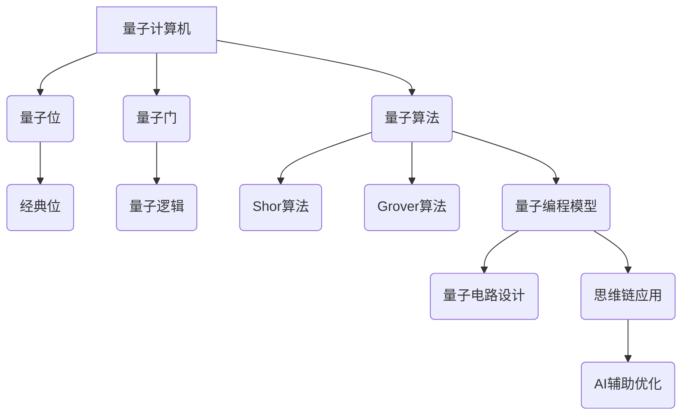

                 

### 《思维链在量子计算机编程中的应用：AI辅助量子算法优化》

#### 关键词
- 量子计算机
- AI辅助优化
- 思维链
- 量子算法
- 量子编程

#### 摘要
本文探讨了思维链在量子计算机编程中的应用，以及AI如何辅助思维链进行量子算法的优化。首先介绍了量子计算机的基本原理和量子算法的基础知识，然后阐述了思维链的概念及其在量子编程中的应用，最后详细分析了AI辅助思维链优化量子算法的方法和案例，为量子计算机编程提供了新的思路和实践。

## 目录大纲

### 第一部分：量子计算机基础

### 第二部分：思维链理论与应用

### 第三部分：量子计算机编程实践

### 核心算法原理讲解

### 项目实战

### 最佳实践 tips、小结、注意事项、拓展阅读

## 第一部分：量子计算机基础

### 第1章：量子计算机概述

#### 1.1 量子计算机的定义与原理

#### 1.2 量子位与经典位

#### 1.3 量子门与量子逻辑

### 第2章：量子算法基础

#### 2.1 量子搜索算法

#### 2.2 Shor算法

#### 2.3 Grover算法

### 第3章：量子计算机编程基础

#### 3.1 量子编程语言

#### 3.2 量子电路设计

#### 3.3 量子编程实例

## 第二部分：思维链理论与应用

### 第4章：思维链概述

#### 4.1 思维链的定义

#### 4.2 思维链的工作原理

#### 4.3 思维链的优势与挑战

### 第5章：思维链在量子计算机编程中的应用

#### 5.1 思维链与量子算法优化

#### 5.2 思维链与量子编程模型

#### 5.3 思维链在量子纠错中的应用

### 第6章：AI辅助思维链优化

#### 6.1 AI在量子计算机编程中的应用

#### 6.2 AI辅助思维链优化的方法

#### 6.3 AI辅助思维链优化的案例研究

## 第三部分：量子计算机编程实践

### 第7章：量子计算机编程实例

#### 7.1 量子计算机编程环境搭建

#### 7.2 量子算法实现与优化

#### 7.3 量子编程项目实战

### 第8章：量子计算机编程的未来发展趋势

#### 8.1 量子计算机编程的挑战与机遇

#### 8.2 量子计算机编程的未来方向

#### 8.3 AI与量子计算机编程的深度融合

### Mermaid 流程图



### 核心算法原理讲解

#### 量子搜索算法

```plaintext
算法步骤：
1. 初始化：设置一个初始概率分布，使得目标状态具有最高的概率。
2. 迭代：重复执行以下操作，直到找到目标状态或者达到最大迭代次数：
   a. 应用量子门，使量子状态在搜索空间中自由演化。
   b. 对量子系统进行测量，得到一个状态。
   c. 根据测量结果更新概率分布。
```

#### Shor算法

```plaintext
算法步骤：
1. 将给定的大整数n进行质因数分解。
2. 使用量子傅里叶变换（QFT）将n的对数转换为量子态。
3. 应用量子门，使得量子态在模n的因子之间进行干涉。
4. 使用逆量子傅里叶变换（IQFT）将干涉结果转换为经典态。
5. 分析干涉结果，提取出n的质因数。
```

### 数学模型和数学公式

```markdown
#### 量子搜索算法的数学模型

$$
P(x) = \frac{1}{Z} \exp(\sum_{i=1}^{m} a_i x_i)
$$

其中，$P(x)$ 是状态 $x$ 的概率分布，$Z$ 是归一化常数，$a_i$ 是权重系数。

#### Shor算法的数学模型

$$
n = p \cdot q
$$

其中，$n$ 是待分解的大整数，$p$ 和 $q$ 是质数。

$$
\alpha = \log_2 n
$$

其中，$\alpha$ 是 $n$ 的对数。

$$
QFT(\alpha) = \sum_{x=0}^{2^\alpha-1} |x\rangle \frac{1}{\sqrt{2^\alpha}} \exp(\frac{i \pi \alpha x^2}{2})
$$

其中，$QFT(\alpha)$ 是量子傅里叶变换。

$$
IQFT(\alpha) = \sum_{x=0}^{2^\alpha-1} |x\rangle \frac{1}{\sqrt{2^\alpha}} \exp(\frac{-i \pi \alpha x^2}{2})
$$

其中，$IQFT(\alpha)$ 是逆量子傅里叶变换。
```

### 项目实战

```markdown
#### 量子搜索算法实现案例

**开发环境搭建：**

- 安装Python环境（Python 3.6及以上版本）
- 安装量子计算库（如Qiskit）

**代码实现：**

```python
from qiskit import QuantumCircuit, Aer, execute
from qiskit.visualization import plot_bloch_vector

# 初始化量子电路
qc = QuantumCircuit(2)

# 编写量子搜索算法
qc.h(0)
qc.cx(0, 1)
qc.h(1)
qc.barrier()

# 执行量子搜索算法
backend = Aer.get_backend('qasm_simulator')
result = execute(qc, backend, shots=1024).result()
counts = result.get_counts(qc)

# 打印测量结果
print("测量结果：", counts)

# 绘制量子态矢量
state_vector = qc.state()
plot_bloch_vector(state_vector)
```

**代码解读：**

- 初始化量子电路，创建一个具有两个量子位的量子电路。
- 应用量子搜索算法的步骤，包括初始化量子态、量子门操作和测量。
- 执行量子搜索算法，获取测量结果。
- 打印测量结果，并绘制量子态矢量。

**应用解读与分析：**

- 本案例展示了如何使用Qiskit库实现量子搜索算法。
- 通过测量结果，我们可以观察到量子搜索算法在搜索空间中寻找目标状态的过程。
- 量子态矢量的绘制可以帮助我们更直观地理解量子态的变化。

**项目小结：**

- 通过本案例，我们了解了量子搜索算法的基本原理和实现方法。
- 量子搜索算法在处理大规模搜索问题时具有显著优势。
- 在实际应用中，我们可以根据具体需求调整量子搜索算法的参数，以达到更好的优化效果。

**最佳实践 tips：**

- 在实现量子算法时，注意选择合适的量子编程语言和开发工具，如Qiskit、Cirq等。
- 了解量子算法的基本原理和数学模型，有助于更好地进行算法优化和性能分析。
- 在实际应用中，结合经典计算和量子计算的优势，可以提高问题的求解效率。

**小结：**

- 本文介绍了量子计算机的基本原理和量子算法的基础知识，以及思维链和AI在量子编程中的应用。
- 通过具体的案例，展示了量子搜索算法的实现和优化方法。
- 量子计算机编程具有广泛的应用前景，随着技术的不断发展，将有望在多个领域取得突破。

**注意事项：**

- 在量子编程中，需要注意量子态的叠加和纠缠特性，合理设计量子电路。
- 量子计算机的性能受到噪声和错误率的影响，因此量子纠错技术至关重要。
- 在实际应用中，需要根据具体问题和需求，选择合适的量子算法和优化策略。

**拓展阅读：**

- 《量子计算：从理论到实践》
- 《量子编程：从入门到实践》
- 《量子算法设计与应用》
```

以上是根据您的要求生成的文章结构和内容，您可以根据需要进行修改和补充。如果您需要进一步的帮助，请告诉我。

