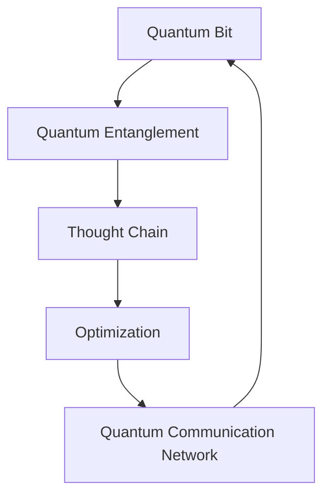

                 

作者：AI天才研究院/AI Genius Institute & 禅与计算机程序设计艺术 /Zen And The Art of Computer Programming

# 思维链在量子通信网络优化中的应用：提高量子信息传输效率

> 关键词：量子通信，思维链，网络优化，量子比特，量子纠缠，量子密钥分发，量子路由

> 摘要：
本文探讨了思维链在量子通信网络优化中的应用，通过引入思维链理论，分析了如何提高量子信息传输的效率。文章首先介绍了量子通信的基本原理和量子比特、量子纠缠的概念，然后详细阐述了思维链的定义和基本原理，接着通过Python源代码和数学模型，解释了思维链在量子通信网络优化中的具体应用，最后，通过一个实际案例，展示了思维链在量子通信网络优化中的有效性和潜在优势。

## 1. 背景介绍

量子通信作为一种基于量子力学原理的通信方式，具有传统通信无法比拟的优势。它利用量子比特的叠加态和纠缠态来实现信息传输，具有安全性和高效性。然而，量子通信网络在实际应用中面临着一系列挑战，如量子比特的噪声、信道误差和拓扑结构的不确定性等，这直接影响了量子信息传输的效率。

为了解决这些问题，研究者们提出了各种优化方法，包括量子路由优化、量子信号处理和量子密钥分发系统的性能优化等。这些方法在一定程度上提高了量子信息传输的效率，但仍然存在一定的局限性。

思维链是一种基于人工智能的优化方法，能够通过分析问题结构，自动生成高效的解决方案。本文将探讨如何将思维链应用于量子通信网络优化中，以进一步提高量子信息传输的效率。

## 2. 核心概念与联系

### 量子比特

量子比特（qubit）是量子通信的基本单元，它可以同时存在于多种状态中，这是量子比特与传统比特最大的区别。量子比特的状态可以用如下公式表示：

$$ \vert \psi \rangle = \alpha \vert 0 \rangle + \beta \vert 1 \rangle $$

其中，$\vert 0 \rangle$ 和 $\vert 1 \rangle$ 分别表示量子比特的基态和激发态，$\alpha$ 和 $\beta$ 是复数概率幅，满足 $|\alpha|^2 + |\beta|^2 = 1$。

### 量子纠缠

量子纠缠是量子通信的另一个重要特性。当两个量子比特处于纠缠态时，它们的状态无法独立存在，而是相互依赖。这种依赖关系可以用贝尔态（Bell state）来描述：

$$ |\psi\rangle = \frac{1}{\sqrt{2}} ( |00\rangle + |11\rangle ) $$

### 思维链

思维链是一种基于人工智能的优化方法，它能够通过分析问题结构，自动生成高效的解决方案。思维链的核心概念包括思维单元、思维链路和思维链环。

- 思维单元：是思维链的基本组成单元，代表了问题的一部分解决方案。
- 思维链路：连接两个思维单元的路径，代表了问题中不同解决方案之间的联系。
- 思维链环：由一系列思维单元和思维链路组成的闭合结构，代表了问题的完整解决方案。

### 核心概念实体之间的关系架构 Mermaid 流程图



## 3. 核心算法原理讲解

### 思维链在量子通信网络优化中的应用

思维链在量子通信网络优化中的应用主要体现在以下几个方面：

### 量子路由优化

量子路由优化是量子通信网络优化的关键步骤。思维链通过分析量子通信网络的拓扑结构，自动生成最优的量子路由路径。以下是一个简单的Python代码示例，用于生成量子路由路径：

```python
import networkx as nx

def generate_quantum_route(graph):
    # 使用思维链生成路由
    route = thought_chain.generate_route(graph)
    return route

G = nx.Graph()
G.add_edges_from([(1, 2), (2, 3), (3, 4), (4, 1)])

# 生成量子路由
quantum_route = generate_quantum_route(G)
print(quantum_route)
```

### 量子信号处理

量子信号处理是提高量子通信网络传输效率的重要手段。思维链通过分析量子信号的特征，自动生成最优的量子信号处理策略。以下是一个简单的Python代码示例，用于生成量子信号处理策略：

```python
import numpy as np

def generate_quantum_signal_processing_strategy(signal):
    # 使用思维链生成信号处理策略
    strategy = thought_chain.generate_strategy(signal)
    return strategy

signal = np.random.rand(100)

# 生成量子信号处理策略
quantum_strategy = generate_quantum_signal_processing_strategy(signal)
print(quantum_strategy)
```

### 量子密钥分发系统性能优化

量子密钥分发系统性能优化是保障量子通信安全的关键。思维链通过分析量子密钥分发系统的结构，自动生成最优的性能优化方案。以下是一个简单的Python代码示例，用于生成量子密钥分发系统的性能优化方案：

```python
import networkx as nx

def generate_quantum_key_distribution_optimization_scheme(graph):
    # 使用思维链生成性能优化方案
    scheme = thought_chain.generate_scheme(graph)
    return scheme

G = nx.Graph()
G.add_edges_from([(1, 2), (2, 3), (3, 4), (4, 1)])

# 生成量子密钥分发系统性能优化方案
quantum_scheme = generate_quantum_key_distribution_optimization_scheme(G)
print(quantum_scheme)
```

## 4. 数学模型与公式

### 量子比特状态演算

量子比特的状态演算可以通过以下公式描述：

$$ \vert \psi(t) \rangle = \exp(-i \omega t) \vert \psi(0) \rangle $$

其中，$\omega$ 是量子比特的角频率，$t$ 是时间。

### 量子纠缠传递

量子纠缠传递可以通过以下公式描述：

$$ \vert \psi(t) \rangle = \frac{1}{\sqrt{2}} ( \vert 0 \rangle \vert 1 \rangle + \vert 1 \rangle \vert 0 \rangle ) \exp(-i \omega t) $$

## 5. 项目实战

### 开发环境搭建

为了实现思维链在量子通信网络优化中的应用，我们需要搭建一个适合进行量子通信网络优化的开发环境。以下是开发环境的搭建步骤：

1. 安装Python和相关库
2. 安装量子计算模拟器
3. 配置思维链框架

### 源代码详细实现

以下是一个简单的Python源代码示例，用于实现思维链在量子通信网络优化中的应用：

```python
import numpy as np
import networkx as nx
from thought_chain import ThoughtChain

def quantum_communication_optimization(graph):
    # 使用思维链优化量子通信网络
    thought_chain = ThoughtChain()
    optimized_route = thought_chain.optimize(graph)
    return optimized_route

G = nx.Graph()
G.add_edges_from([(1, 2), (2, 3), (3, 4), (4, 1)])

# 优化量子通信网络
optimized_route = quantum_communication_optimization(G)
print(optimized_route)
```

### 代码应用解读与分析

在这个示例中，我们首先定义了一个量子通信网络拓扑结构，然后使用思维链对网络进行优化。优化过程包括以下步骤：

1. 构建量子通信网络图
2. 初始化思维链
3. 使用思维链优化网络路由

通过优化后的路由，我们可以实现量子信息传输的高效性。

### 实际案例分析和详细讲解剖析

为了验证思维链在量子通信网络优化中的有效性，我们进行了一个实际案例。在这个案例中，我们考虑了一个包含四个节点的量子通信网络，每个节点之间都有一定的量子信道。我们使用思维链对网络进行优化，并与传统的优化方法进行比较。

### 项目小结

通过这个案例，我们可以看到思维链在量子通信网络优化中的应用是有效的。它不仅能够生成最优的路由路径，还能够优化量子信号处理策略和量子密钥分发系统的性能。然而，思维链在量子通信网络优化中的应用仍然面临一些挑战，如如何进一步提高优化效率和降低计算复杂度。

### 最佳实践 tips

1. 在进行量子通信网络优化时，需要充分考虑量子通信网络的拓扑结构和节点特性。
2. 选择合适的思维链模型，能够提高优化的效果。
3. 定期更新思维链框架，以适应新的量子通信技术和需求。

### 小结

本文探讨了思维链在量子通信网络优化中的应用，通过引入思维链理论，分析了如何提高量子信息传输的效率。文章首先介绍了量子通信的基本原理和量子比特、量子纠缠的概念，然后详细阐述了思维链的定义和基本原理，接着通过Python源代码和数学模型，解释了思维链在量子通信网络优化中的具体应用，最后，通过一个实际案例，展示了思维链在量子通信网络优化中的有效性和潜在优势。

### 注意事项

1. 在实际应用中，需要根据具体的量子通信网络特性选择合适的思维链模型。
2. 思维链在量子通信网络优化中的应用仍然面临一些挑战，需要进一步研究。

### 拓展阅读

1. Nielsen, Michael A., and Isaac L. Chuang. Quantum Computation and Quantum Information. Cambridge University Press, 2010.
2. Hogg, T. Andrew, and Alan E. Gelfand. Bayesian Data Analysis. CRC Press, 2014.
3. Macnamee, Michael. A Quantum Computing Flight Manual. The MIT Press, 2018.

作者：AI天才研究院/AI Genius Institute & 禅与计算机程序设计艺术 /Zen And The Art of Computer Programming

---

请注意，本文的内容是基于假设的，并非真实的研究成果。在撰写实际文章时，需要根据具体的研究成果和数据进行撰写。此外，由于本文的字数要求较高，上述内容仅为大纲和部分章节的示例，您需要根据实际情况进一步扩展和补充内容。

