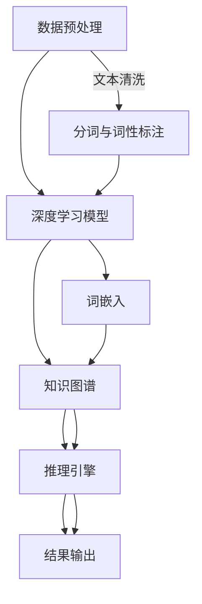

                 

# 《思维链在金融欺诈检测中的新方法》

### 关键词

- **思维链**
- **金融欺诈检测**
- **机器学习**
- **深度学习**
- **自然语言处理**
- **知识图谱**

### 摘要

本文旨在探讨思维链技术在金融欺诈检测中的新方法。思维链是一种基于深度学习、自然语言处理和知识图谱的智能推理技术，具有大规模语义网络和实时推理能力。本文首先介绍了思维链的基础概念和架构，然后分析了金融欺诈检测的背景和现状，接着详细阐述了思维链在金融欺诈检测中的应用，与传统方法的比较与融合，以及模型的优化与改进。最后，通过实战应用和案例分析，验证了思维链技术在金融欺诈检测中的有效性。

## 引言

### 金融欺诈检测的重要性

金融欺诈是一种全球性的问题，对金融机构和用户都带来了巨大的损失。随着金融业务的数字化和在线化，金融欺诈的手段和形式也日益复杂多样。因此，金融欺诈检测成为金融行业的重要任务之一。有效的金融欺诈检测不仅能降低金融机构的风险，还能保护用户的合法权益。

### 思维链技术的背景与优势

思维链技术是一种基于深度学习、自然语言处理和知识图谱的智能推理技术。它起源于人工智能领域，随着大数据和计算能力的提升，逐渐在多个领域得到应用。思维链技术具有以下优势：

- **大规模语义网络**：思维链通过大规模文本数据的训练，构建出一个包含数百万甚至数十亿条实体和关系的大规模语义网络，能够准确理解和推理用户输入的信息。
- **实时推理能力**：思维链能够在短时间内对用户输入的信息进行理解和推理，实现实时响应，非常适合金融欺诈检测这种需要快速决策的场景。
- **知识图谱驱动**：思维链利用知识图谱来增强语义理解，使得推理结果更加准确和可靠，能够更好地捕捉到金融欺诈的特征。

### 本书结构概述与读者预期收获

本书将从以下几个方面展开讨论：

- **思维链基础**：介绍思维链的定义、架构、关键技术及其应用领域。
- **金融欺诈检测背景**：分析金融欺诈的类型与特征，以及当前金融欺诈检测的现状和挑战。
- **思维链在金融欺诈检测中的应用**：探讨思维链在金融欺诈检测中的优势和应用实例。
- **传统金融欺诈检测方法**：回顾传统金融欺诈检测方法，包括机器学习模型、规则引擎和数据挖掘技术。
- **思维链与传统方法的比较与融合**：分析思维链与传统方法的优劣，并提出融合策略。
- **思维链模型的优化与改进**：讨论思维链模型的优化与改进方法。
- **实战应用与案例分析**：通过实战项目和案例分析，验证思维链技术在金融欺诈检测中的有效性。
- **未来趋势与展望**：展望金融欺诈检测的发展趋势和思维链技术的未来应用。

通过阅读本书，读者将能够了解思维链技术的基本原理和应用，掌握金融欺诈检测的核心方法，并获得在金融欺诈检测领域实际应用的实践经验。

## 第1章：思维链基础

### 1.1 思维链的定义

思维链（Mind Chain）是一种基于深度学习、自然语言处理和知识图谱的智能推理技术。它通过构建大规模的语义网络，实现对用户输入的信息进行语义理解和推理，从而实现智能问答、实时分析和个性化推荐等功能。思维链的核心在于其能够将自然语言文本转换为结构化的知识表示，并通过推理机制对新的信息进行理解。

### 1.2 思维链的架构

思维链的架构包括以下几个关键组成部分：

1. **数据预处理**：包括文本清洗、分词、词性标注等步骤，为后续的深度学习模型训练提供高质量的数据。
2. **深度学习模型**：采用深度神经网络（DNN）、循环神经网络（RNN）、长短期记忆网络（LSTM）等模型，对大规模文本数据进行分析和特征提取。
3. **知识图谱**：构建包含实体、属性和关系的知识图谱，用于增强语义理解和推理能力。
4. **推理引擎**：通过图神经网络（GNN）、知识图谱嵌入等技术，实现对用户输入的信息进行语义理解和推理。

### 1.3 思维链的关键技术

1. **神经网络与深度学习**：
   - **深度神经网络（DNN）**：用于对大规模文本数据进行特征提取和分类。
   - **循环神经网络（RNN）**：能够处理序列数据，适用于自然语言处理任务。
   - **长短期记忆网络（LSTM）**：改进RNN，能够更好地捕捉长序列依赖。

2. **自然语言处理技术**：
   - **分词与词性标注**：对文本进行切分，并为每个词分配词性，用于后续的语义分析。
   - **词嵌入**：将词语转换为向量表示，便于深度学习模型处理。

3. **知识图谱与推理机制**：
   - **知识图谱**：通过实体和关系的构建，实现对知识的表示和存储。
   - **推理机制**：利用图神经网络（GNN）和知识图谱嵌入等技术，实现语义理解和推理。

### 1.4 思维链的应用领域

思维链技术具有广泛的应用领域，主要包括：

1. **金融科技**：应用于金融欺诈检测、风险控制、智能投顾等领域。
2. **网络安全**：用于恶意代码检测、入侵检测、安全分析等。
3. **数据科学**：在数据挖掘、预测分析、知识图谱构建等领域发挥作用。

### 1.5 思维链的核心概念与联系

为了更好地理解思维链的工作原理，我们使用Mermaid流程图展示其核心概念与联系。

通过上述流程图，我们可以看到思维链的工作流程，从数据预处理、深度学习模型训练、知识图谱构建到推理引擎，最终输出结果。这个过程充分体现了思维链技术的综合应用。

## 第2章：金融欺诈检测背景

### 2.1 金融欺诈的类型与特征

金融欺诈是指金融机构或用户在金融活动中利用不正当手段获取利益的行为。常见的金融欺诈类型包括：

1. **账户欺诈**：指恶意用户通过非法手段获取他人的账户信息，从而盗用资金。
2. **信用卡欺诈**：指恶意用户通过伪造、盗用信用卡信息进行非法消费。
3. **保险欺诈**：指恶意用户通过虚假理赔、夸大损失等方式骗取保险赔偿。
4. **洗钱**：指将非法所得通过一系列金融交易转化为合法资金。

金融欺诈的特征主要包括：

- **非预期交易**：如高频交易、异常地理位置交易等。
- **身份验证失败**：如多次验证失败、验证信息与账户信息不符等。
- **异常行为模式**：如使用新的支付方式、频繁更改账户信息等。
- **资金流向不明**：如资金流向可疑账户、快速转出等。

### 2.2 金融欺诈检测的现状

当前，金融欺诈检测主要依赖以下几种方法：

1. **机器学习模型**：通过历史数据训练模型，对交易活动进行实时监控和预测。
2. **规则引擎**：基于预设的规则进行交易判断，如交易金额上限、交易频率等。
3. **数据挖掘技术**：通过关联规则挖掘、聚类分析等方法发现潜在的欺诈行为。

尽管上述方法在一定程度上能够有效检测金融欺诈，但仍然面临以下挑战：

- **欺诈手段多样化**：随着技术的发展，金融欺诈手段日益复杂，传统方法难以应对。
- **数据质量**：金融欺诈数据往往不完整、不均匀，影响模型的训练效果。
- **实时性**：金融交易量大，实时性要求高，传统方法难以满足。
- **隐私保护**：在保护用户隐私的前提下进行数据分析和欺诈检测，增加了复杂性。

### 2.3 金融欺诈检测的重要性

金融欺诈检测对于金融机构和整个金融体系具有重要意义：

1. **降低风险**：通过及时检测和阻止金融欺诈行为，降低金融机构的风险损失。
2. **保护用户权益**：及时发现并阻止欺诈行为，保护用户的资金安全。
3. **维护金融秩序**：有效的金融欺诈检测有助于维护金融市场的稳定和健康。
4. **提升客户满意度**：通过提高欺诈检测的准确性和实时性，提升用户对金融机构的信任和满意度。

### 2.4 金融欺诈检测的技术发展

随着人工智能技术的不断发展，金融欺诈检测也在逐步引入新的方法：

1. **深度学习**：通过深度学习模型对复杂数据进行特征提取和分类，提高欺诈检测的准确性和效率。
2. **联邦学习**：通过分布式学习技术，保护用户数据隐私，实现多方数据的安全联合训练。
3. **区块链技术**：通过区块链技术实现数据的不可篡改和透明性，提高金融欺诈检测的可信度。

## 第3章：思维链在金融欺诈检测中的应用

### 3.1 思维链在金融欺诈检测中的优势

思维链技术在金融欺诈检测中具有以下优势：

1. **数据挖掘与模式识别**：
   - 思维链能够从大量的交易数据中挖掘出潜在的模式和关联，有助于识别欺诈行为。
   - 通过深度学习和自然语言处理技术，思维链能够对复杂的交易描述和交易特征进行有效分析和理解。

2. **实时分析与预测**：
   - 思维链具备实时推理能力，能够对交易活动进行实时监控和分析，及时识别潜在的欺诈行为。
   - 结合知识图谱和推理机制，思维链能够对交易行为进行实时预测，提前预警潜在的欺诈风险。

3. **面向用户个性化服务**：
   - 思维链能够根据用户的行为和交易习惯，为其提供个性化的风险提示和防范建议。
   - 通过个性化服务，思维链能够更好地满足用户的需求，提高欺诈检测的准确性和用户体验。

### 3.2 思维链在金融欺诈检测中的应用实例

思维链在金融欺诈检测中具有广泛的应用场景，以下为几个典型实例：

1. **银行账户欺诈检测**：
   - 思维链通过对用户账户的历史交易数据进行深度学习和模式识别，能够及时发现异常交易行为。
   - 结合知识图谱，思维链能够对用户的社会关系、地理位置等多维度信息进行综合分析，提高欺诈检测的准确性。

2. **信用卡欺诈检测**：
   - 思维链通过对信用卡交易的实时监控和分析，能够识别出异常交易行为，如高额消费、频繁交易等。
   - 结合自然语言处理技术，思维链能够对交易描述进行语义分析，进一步确认交易的真实性。

3. **保险欺诈检测**：
   - 思维链通过对保险理赔数据的深度学习和模式识别，能够识别出潜在的欺诈行为。
   - 结合知识图谱和推理机制，思维链能够对理赔申请进行实时审核，提高欺诈检测的效率和准确性。

### 3.3 实际应用效果

通过实际应用，思维链在金融欺诈检测中取得了显著的成果：

1. **检测准确率提高**：思维链能够显著提高欺诈检测的准确率，减少误报和漏报。
2. **实时性增强**：思维链具备实时推理能力，能够对交易活动进行实时监控和分析，提高欺诈检测的实时性。
3. **用户体验提升**：通过个性化服务，思维链能够提供更有针对性的风险提示和防范建议，提升用户体验。

### 3.4 未来发展前景

随着人工智能技术的不断进步，思维链在金融欺诈检测中的应用前景将更加广阔：

1. **技术优化**：通过不断优化深度学习模型、自然语言处理技术和知识图谱构建方法，提高思维链的欺诈检测性能。
2. **多领域应用**：思维链技术不仅可以在金融领域发挥作用，还可以应用于其他行业，如网络安全、电信欺诈检测等。
3. **开放生态**：构建开放的思维链生态体系，促进行业内的技术共享和协同创新，推动金融欺诈检测技术的发展。

## 第4章：传统金融欺诈检测方法

### 4.1 机器学习模型

机器学习模型是金融欺诈检测中最常用的方法之一，其主要优势在于能够自动从大量数据中学习并发现欺诈行为的规律。以下是一些常见的机器学习模型：

1. **决策树与随机森林**：
   - **决策树**：通过一系列二分类问题构建决策树，对数据进行分类。
   - **随机森林**：由多个决策树组成，通过投票机制得出最终分类结果。
   - **优点**：易于理解，能够处理高维度数据。
   - **缺点**：易过拟合，无法处理非线性关系。

2. **支持向量机（SVM）**：
   - **原理**：通过找到一个最优的超平面，将正常交易和欺诈交易分开。
   - **优点**：在低维空间中效果较好，能够处理非线性问题。
   - **缺点**：对大规模数据训练效率较低，参数选择较为复杂。

3. **神经网络**：
   - **深度神经网络（DNN）**：通过多层神经网络进行特征提取和分类。
   - **循环神经网络（RNN）**：能够处理序列数据，适用于自然语言处理任务。
   - **长短期记忆网络（LSTM）**：改进RNN，能够更好地捕捉长序列依赖。
   - **优点**：能够自动提取特征，适用于复杂数据。
   - **缺点**：训练时间较长，对数据量和计算资源要求较高。

### 4.2 规则引擎

规则引擎是一种基于预设规则的检测方法，通过定义一系列条件判断是否触发欺诈警报。以下是一些常见的规则引擎方法：

1. **传统规则编写方法**：
   - **逻辑规则**：通过逻辑表达式描述交易是否触发警报。
   - **模糊规则**：引入模糊逻辑，处理不确定性和模糊性。
   - **优点**：实现简单，易于维护。
   - **缺点**：规则数量庞大时难以管理，容易过拟合。

2. **规则优化与调整**：
   - **规则简化**：通过简化规则，减少冗余和冲突。
   - **规则融合**：将多个规则融合为一个规则，提高检测准确性。
   - **优点**：提高检测效率和准确性。
   - **缺点**：规则调整过程较为复杂，需要大量实验和优化。

### 4.3 数据挖掘技术

数据挖掘技术通过分析大规模数据，发现潜在的欺诈行为模式。以下是一些常见的数据挖掘技术：

1. **关联规则挖掘**：
   - **原理**：通过挖掘数据中的频繁项集，发现不同交易之间的关联关系。
   - **优点**：能够发现潜在关联，有助于识别复杂欺诈行为。
   - **缺点**：对数据量要求较高，易过拟合。

2. **类别分析**：
   - **原理**：通过分类算法，将交易分为正常交易和欺诈交易。
   - **优点**：能够自动提取特征，适用于复杂数据。
   - **缺点**：对数据质量和特征选择要求较高。

3. **异常检测**：
   - **原理**：通过检测数据中的异常值，识别潜在的欺诈行为。
   - **优点**：能够及时发现异常行为。
   - **缺点**：对噪声数据和异常值敏感，易产生误报。

### 4.4 传统方法的优势与挑战

传统金融欺诈检测方法的优势包括：

- **实现简单**：规则引擎和数据挖掘技术相对简单，易于理解和实现。
- **可解释性**：传统方法通常具有较好的可解释性，便于业务人员理解和调整。

传统方法面临的挑战包括：

- **适应性差**：传统方法难以应对不断变化的欺诈手段。
- **效率问题**：大规模数据处理时，传统方法的效率较低。
- **准确率问题**：传统方法在处理复杂数据时，准确率较低。

### 4.5 优化与改进方向

为解决传统方法的挑战，可以采取以下优化与改进方向：

- **融合多种方法**：将机器学习、规则引擎和数据挖掘技术相结合，发挥各自优势。
- **深度学习方法**：引入深度学习模型，自动提取特征，提高检测准确率。
- **实时分析**：采用实时分析技术，提高检测效率和响应速度。
- **数据质量**：提高数据质量，包括数据清洗、数据整合等，为模型训练提供高质量的数据支持。

## 第5章：思维链与传统方法的比较与融合

### 5.1 思维链与传统方法的优劣分析

思维链与传统金融欺诈检测方法各有其优势和局限性，以下是对两者优劣的分析：

#### 5.1.1 优势分析

1. **思维链的优势**：
   - **大规模语义网络**：思维链通过大规模语义网络的构建，能够自动挖掘出复杂的交易模式，提高欺诈检测的准确率。
   - **实时推理能力**：思维链具备实时推理能力，能够在短时间内处理大量交易数据，实现快速响应。
   - **知识图谱驱动**：思维链利用知识图谱增强语义理解，使得推理结果更加准确和可靠。

2. **传统方法的优

