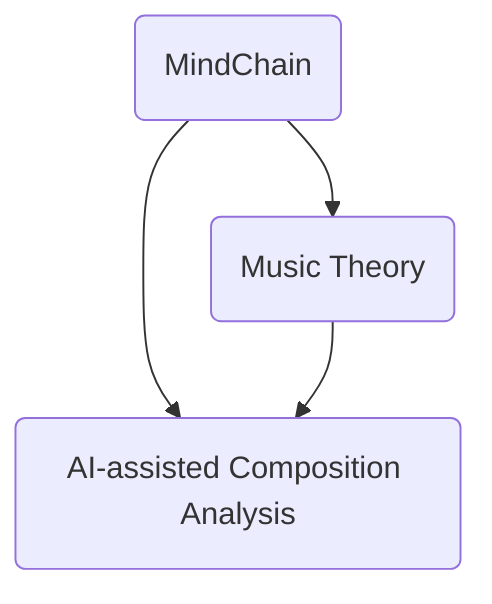

                 

### 引言

#### 背景介绍

随着人工智能（AI）技术的迅猛发展，越来越多的领域开始尝试将其应用于实践。音乐理论研究作为一门传统的学科，也迎来了AI技术的变革。传统的音乐理论研究往往依赖于人类的直觉和经验，而AI技术能够提供一种全新的研究视角，极大地提升研究效率和深度。特别是思维链（MindChain）技术的引入，为音乐理论的研究提供了强大的理论支持和工具。

思维链是一种基于图论和深度学习的新型推理模型，它能够模拟人类思维过程，通过节点和边的关系进行复杂的信息处理和推理。在音乐理论研究中，思维链能够帮助研究人员从宏观和微观两个层面分析音乐结构，揭示音乐的本质特征和内在联系。而AI辅助作曲分析，则是将思维链技术应用于作曲实践，通过算法和模型生成新的音乐作品，进一步拓展音乐创作的可能性。

本文将围绕思维链在音乐理论研究中的应用，探讨AI辅助作曲分析的原理和实际应用，旨在为音乐理论研究者提供新的研究思路和工具，同时为AI技术在音乐领域的应用提供参考。

#### 核心概念与联系

首先，我们需要明确几个核心概念，以构建思维链在音乐理论研究中的关系架构。这些核心概念包括：

1. **思维链（MindChain）**：一种基于图论和深度学习的推理模型，通过节点和边的关系进行信息处理和推理。
2. **音乐理论**：研究音乐结构、形式和理论的学科，包括旋律、和声、节奏等方面。
3. **AI辅助作曲分析**：利用人工智能技术辅助音乐创作和分析的方法，包括音符识别、曲调生成和风格分类等。

以下是这些核心概念之间的Mermaid流程图关系：



- **思维链（MindChain）**：作为基础推理模型，直接关联到**音乐理论（Music Theory）**，提供了一种新的分析视角。同时，它也关联到**AI辅助作曲分析（AI-assisted Composition Analysis）**，为作曲实践提供理论支持和工具。
- **音乐理论（Music Theory）**：为思维链提供了应用背景，通过具体的音乐理论和概念，思维链能够更好地进行音乐结构的分析和理解。
- **AI辅助作曲分析（AI-assisted Composition Analysis）**：结合了思维链和音乐理论，通过算法和模型实现音乐创作的自动化和智能化。

这种关系架构不仅能够清晰地展示各个核心概念之间的联系，还能够帮助我们理解思维链在音乐理论研究中的应用机制。

#### 文章概述

本文将分为三大部分，逐步探讨思维链在音乐理论研究中的应用。

**第一部分：思维链理论基础**

在本部分，我们将首先介绍思维链的概念和基本特点，阐述其在不同领域的应用。接着，我们将深入讨论AI在作曲分析中的应用，分析其在音符识别、曲调生成和风格分类等方面的优势。

**第二部分：AI辅助作曲分析**

在本部分，我们将详细介绍AI辅助作曲分析的基础，包括音符识别、曲调生成和节奏分析等方面。然后，我们将探讨AI辅助作曲分析的核心算法，如基于深度学习的音符识别算法、基于遗传算法的曲调生成算法和基于神经网络的音乐风格分类算法。

**第三部分：实践指导**

在本部分，我们将通过具体的应用实例，展示AI辅助作曲分析的实际效果。同时，我们将提供AI辅助作曲分析实践指南，帮助读者搭建开发环境，处理数据集，训练和优化模型。最后，我们将总结AI辅助作曲分析的未来展望，讨论其面临的挑战和发展趋势。

通过以上三个部分的详细探讨，本文旨在为音乐理论研究者提供新的研究思路和工具，为AI技术在音乐领域的应用提供参考。

#### 摘要

本文深入探讨了思维链在音乐理论研究中的应用以及AI辅助作曲分析的技术原理和实践应用。首先，我们介绍了思维链的基本概念和特点，分析了其在音乐理论研究和AI辅助作曲分析中的应用机制。接着，我们详细讨论了AI辅助作曲分析的基础和核心算法，包括音符识别、曲调生成和风格分类等方面的技术原理。最后，我们通过具体的应用实例，展示了AI辅助作曲分析的实际效果，并提供了实践指南，为读者在音乐理论和AI应用方面提供了新的思路和方法。本文旨在为音乐理论研究者提供新的研究工具，推动AI技术在音乐领域的深入应用。

## 第一部分：思维链理论基础

### 第1章：思维链概述

#### 1.1 思维链的概念

思维链（MindChain）是一种基于图论和深度学习的新型推理模型，旨在模拟人类思维过程，实现复杂信息处理和推理。它由多个节点和连接这些节点的边组成，每个节点代表一个概念或事实，边则表示节点之间的逻辑关系。通过这种结构，思维链能够逐步推导出新的结论，实现智能推理。

思维链的概念最早由美国计算机科学家John H. Holland在其1986年的著作《隐含的适应性》（Adaptation in Natural and Artificial Systems）中提出。Holland将思维链视为一种“分布式搜索”机制，强调通过节点和边的关系进行复杂问题的求解。随后，研究者们在此基础上不断优化和扩展，使其在多个领域（如计算机科学、人工智能、认知科学等）得到广泛应用。

在音乐理论研究中，思维链的应用主要是通过分析音乐结构中的各个元素（如音符、节奏、和声等）及其关系，揭示音乐的本质特征和内在联系。例如，通过思维链的分析，研究人员可以识别出不同音乐作品中的主题和变奏，分析其旋律发展规律，甚至预测音乐的发展趋势。

#### 1.2 思维链的基本特点

思维链具有以下基本特点：

1. **分布式搜索**：思维链通过分布式搜索机制，能够在大量数据中快速找到相关关系，实现高效的信息处理。这种机制使得思维链在处理复杂问题时，能够跳出局部最优，寻找全局最优解。

2. **自适应学习**：思维链具有自适应学习的能力，能够根据输入数据和反馈不断调整自身的结构和参数，提高推理的准确性和效率。这种自适应特性使得思维链能够适应不同的应用场景，实现跨领域的应用。

3. **可扩展性**：思维链的设计具有高度的可扩展性，可以通过增加节点和边来扩展其功能，实现更复杂的推理任务。例如，在音乐理论研究中，可以添加新的音乐元素和关系，使得思维链能够分析更复杂的音乐结构。

4. **灵活性**：思维链能够灵活处理不同类型的问题，不仅限于结构化数据，还能处理非结构化数据，如文本、图像和音频等。这种灵活性使得思维链在多个领域具有广泛的应用前景。

#### 1.3 思维链与音乐理论的关系

思维链在音乐理论研究中具有独特的优势。首先，音乐作品通常包含复杂的关系网络，如旋律、和声、节奏等元素之间的关系。思维链通过节点和边的关系，能够有效地解析这些关系，揭示音乐作品的结构特征。例如，通过思维链的分析，研究人员可以识别出旋律中的主题和变奏，分析其旋律发展规律，甚至预测音乐的发展趋势。

其次，思维链的自适应学习特性使得其在音乐创作中具有很大的潜力。通过学习大量的音乐作品，思维链可以理解不同风格和作曲家的特点，生成新的音乐作品。例如，在爵士乐创作中，思维链可以通过分析贝斯线和鼓点的节奏关系，生成新的爵士乐段。

此外，思维链的分布式搜索机制也使得其在音乐推荐系统中具有应用价值。通过分析用户的听歌历史和偏好，思维链可以推荐与用户兴趣相符的音乐作品，提高音乐推荐的准确性。

总之，思维链为音乐理论研究提供了一种新的分析工具，能够从宏观和微观两个层面揭示音乐的结构和特征，为音乐创作和推荐提供理论支持。通过本文后续章节的探讨，我们将进一步深入分析思维链在音乐理论研究中的具体应用和效果。

### 第2章：思维链模型

#### 2.1 思维链的构成

思维链（MindChain）是一种基于图论和深度学习的推理模型，其核心在于通过节点和边的关系进行信息处理和推理。了解思维链的构成是理解其工作原理和应用的基础。

**节点**：节点是思维链的基本单元，代表一个概念或事实。在音乐理论研究中，节点可以代表音符、和弦、节奏模式等。例如，一个节点可能表示一个特定的音符，它包含了音高、时长等信息。

**边**：边连接两个节点，表示节点之间的逻辑关系。边的类型可以是“属于”、“相关”、“继承”等。例如，在一个音乐作品的分析中，一条边可能表示一个和弦与另一个和弦之间的和弦关系，如“II-V-I”进行。

**权重**：边上的权重表示节点之间的关联强度。权重可以通过多种方式计算，如基于频率、相似性或重要性。在音乐理论中，权重可能表示一个音符在旋律中的重要性，或一个和弦在和声进行中的位置。

**关系网络**：思维链通过节点和边构成了一个复杂的关系网络。这个网络可以看作是一个知识图谱，每个节点代表一个概念，每条边代表一个概念之间的关系。通过这种网络结构，思维链能够进行高效的推理和知识提取。

#### 2.2 思维链的工作原理

思维链的工作原理可以概括为以下几个步骤：

1. **数据输入**：首先，思维链需要接收输入数据，这些数据可以是结构化数据（如音符序列、和弦进行等），也可以是非结构化数据（如音频文件、文本描述等）。在音乐理论研究中，输入数据通常为音符序列或音频文件。

2. **节点生成**：根据输入数据，思维链会生成相应的节点。例如，输入一个音符序列，思维链会为每个音符生成一个节点。

3. **边建立**：思维链会根据节点的特征和规则，建立节点之间的边。边的类型和权重取决于节点的属性和它们之间的逻辑关系。例如，在音符序列中，相邻音符之间可以建立“连续性”边，而和弦之间可以建立“和声关系”边。

4. **推理过程**：在建立了节点和边之后，思维链通过遍历关系网络进行推理。例如，从某个特定的节点开始，思维链可以沿着边逐步推导出新的结论。这种推理过程可以是前向推理，也可以是后向推理。

5. **结果输出**：推理完成后，思维链会输出结果，这些结果可以是具体的音乐结构分析，如旋律发展规律，也可以是预测分析，如音乐风格分类。

#### 2.3 思维链在不同领域的应用

思维链由于其独特的结构和强大的推理能力，在多个领域都有广泛的应用。

**计算机科学**：在计算机科学领域，思维链被用于知识图谱构建、自然语言处理和推理机等方面。例如，通过思维链，可以构建复杂的知识图谱，实现智能问答和语义分析。

**人工智能**：在人工智能领域，思维链作为一种通用推理模型，被应用于智能助手、自动化决策系统和机器人控制等方面。例如，通过思维链的分析，智能助手可以更好地理解用户的意图和需求，提供更精准的服务。

**认知科学**：在认知科学领域，思维链被用于模拟人类思维过程，研究人类记忆、推理和决策等认知活动。通过思维链的模拟，研究人员可以更好地理解人类思维的机制和过程。

**音乐理论研究**：在音乐理论研究中，思维链被广泛应用于音乐结构分析、作曲辅助和音乐风格识别等方面。通过思维链的分析，研究人员可以更深入地理解音乐作品的结构特征，揭示音乐的发展规律。

**医学**：在医学领域，思维链被用于疾病诊断、药物设计和基因组分析等方面。例如，通过思维链的推理，可以识别出疾病的相关基因和药物靶点。

**金融**：在金融领域，思维链被用于风险预测、市场分析和投资决策等方面。通过思维链的分析，金融机构可以更好地理解市场趋势和风险因素，做出更明智的投资决策。

总之，思维链作为一种通用的推理模型，在多个领域都有广泛的应用。其强大的推理能力和灵活性，使得它能够解决复杂的问题，提供新的解决方案。通过本文后续章节的探讨，我们将进一步探讨思维链在音乐理论研究中的具体应用和效果。

### 第3章：AI在作曲分析中的应用

#### 3.1 AI在音乐理论中的作用

人工智能（AI）在音乐理论研究中发挥着越来越重要的作用，它不仅改变了传统的研究方式，还为音乐创作提供了新的可能性。AI在音乐理论中的作用主要体现在以下几个方面：

**数据挖掘与分析**：AI技术可以处理和分析大量的音乐数据，从中提取出有价值的模式和信息。例如，通过机器学习算法，可以分析大量的音乐作品，提取出旋律、和声和节奏等特征，从而揭示音乐发展的一般规律。

**自动化音乐创作**：AI技术可以自动生成新的音乐作品，这种创作方式不仅解放了音乐家的创作力，也为音乐创作提供了新的视角。AI可以通过分析已有的音乐作品，学习其风格和特点，进而生成新的音乐作品。

**音乐风格识别**：AI技术可以识别音乐作品的不同风格，帮助研究人员更好地分类和整理音乐数据。例如，通过深度学习算法，可以自动识别古典音乐、流行音乐和爵士乐等不同风格的音乐作品。

**音乐情感分析**：AI技术可以通过分析音乐的情感特征，预测听众对音乐的感受。这种分析有助于音乐家更好地理解听众的需求，创作出更受欢迎的音乐作品。

**音乐教学辅助**：AI技术可以辅助音乐教学，通过智能化的音乐课程和练习系统，提高学生的学习效果。例如，AI可以实时分析学生的演奏，提供即时的反馈和建议。

#### 3.2 AI辅助作曲分析的优势

AI辅助作曲分析具有以下优势：

**高效性**：AI技术可以快速处理和分析大量的音乐数据，大大提高了作曲分析的效率。例如，传统的音乐分析可能需要音乐家花费数小时，而AI只需几分钟即可完成。

**准确性**：AI技术通过机器学习和深度学习算法，可以更准确地识别和分类音乐特征，避免了人为错误和主观判断。

**多样性**：AI技术可以生成多样化的音乐作品，这种多样性不仅丰富了音乐创作的可能性，也为音乐家提供了新的灵感来源。

**智能化**：AI技术可以通过持续学习和优化，不断提高作曲分析的准确性和效率。例如，AI可以根据用户的反馈和学习历史，提供更加个性化的音乐创作建议。

#### 3.3 AI在音乐创作中的实际应用

AI在音乐创作中的实际应用主要包括以下几个方面：

**自动生成音乐作品**：AI可以通过分析已有的音乐作品，学习其旋律、和声和节奏等特征，自动生成新的音乐作品。这种创作方式不仅解放了音乐家的创作力，也为音乐创作提供了新的视角。例如，Google的Magenta项目就是一个利用深度学习技术自动生成音乐作品的平台。

**辅助音乐创作**：AI可以辅助音乐家进行创作，通过智能化的工具和系统，提供音乐创作建议和灵感。例如，AIVA（Artificial Intelligence Virtual Artist）是一款利用AI技术辅助音乐创作的软件，它可以根据用户的创作需求和风格，生成新的音乐旋律和和声。

**个性化音乐推荐**：AI技术可以分析用户的听歌历史和偏好，推荐符合用户兴趣的音乐作品。这种推荐系统不仅提高了用户的音乐体验，也为音乐平台提供了新的商业模式。例如，Spotify和Apple Music等音乐平台都采用了AI技术进行个性化推荐。

**虚拟音乐家**：AI技术可以模拟真实音乐家的演奏风格和技巧，生成虚拟音乐家的演奏视频和音频。这种应用不仅为音乐表演提供了新的可能性，也为音乐教学和音乐创作提供了新的工具。

总之，AI在音乐创作中的应用不仅改变了传统的研究方式，也为音乐创作提供了新的工具和方法。通过本文后续章节的探讨，我们将进一步分析AI辅助作曲分析的具体技术和实践应用。

### 第4章：AI辅助作曲分析的基础

#### 4.1 音符识别与生成

音符识别与生成是AI辅助作曲分析的基础技术之一，它在音乐创作和音乐分析中具有广泛的应用。音符识别是指通过算法识别音乐作品中的音符，包括音符的音高、时长和强度等属性。而音符生成则是利用算法生成新的音符序列，以满足创作需求或进行分析。

**音符识别**：音符识别的算法可以分为两种：一种是基于特征的方法，另一种是基于深度学习的方法。

1. **基于特征的方法**：这种方法首先提取音乐信号中的特征，如梅尔频率倒谱系数（MFCC）、短时傅里叶变换（STFT）等，然后使用分类器进行音符识别。常见的分类器有支持向量机（SVM）、决策树和随机森林等。

2. **基于深度学习的方法**：这种方法利用神经网络，特别是卷积神经网络（CNN）和长短期记忆网络（LSTM），直接处理原始音频信号，实现高精度的音符识别。深度学习方法在处理复杂和非线性问题时具有优势，能够提高音符识别的准确率。

**音符生成**：音符生成的方法可以分为基于规则的方法和基于学习的方法。

1. **基于规则的方法**：这种方法通过预定义的规则生成音符序列，例如生成特定的旋律模式或和声进行。这种方法简单直观，但生成的音乐较为单调，缺乏创新性。

2. **基于学习的方法**：这种方法通过学习大量的音乐数据，例如使用生成对抗网络（GAN）或变分自编码器（VAE），生成新的音符序列。这种方法的优点是生成的音乐更加丰富多样，能够模仿不同风格和作曲家的特点。

在实际应用中，音符识别和生成技术常结合使用。例如，在音乐创作中，首先使用音符识别技术分析已有的音乐作品，提取其特征，然后使用音符生成技术生成新的音符序列，进行创作。在音乐分析中，音符识别技术可以用于提取音乐作品的结构特征，如旋律主题和变奏，帮助研究人员深入理解音乐作品。

#### 4.2 曲调生成与风格分类

**曲调生成**：曲调生成是指利用算法生成新的旋律，这是音乐创作的重要环节。曲调生成的算法可以分为以下几种：

1. **基于周期性模型的方法**：这种方法利用周期性模型，如莫比乌斯循环，生成新的旋律。这些模型能够生成具有周期性和重复性的旋律，但灵活性较低。

2. **基于统计模型的方法**：这种方法通过统计方法，如隐马尔可夫模型（HMM）和马尔可夫随机场（MRF），生成新的旋律。这些模型能够根据已有的旋律数据生成新的旋律，但生成的旋律可能过于规则。

3. **基于深度学习的方法**：这种方法利用深度学习模型，如循环神经网络（RNN）和生成对抗网络（GAN），生成新的旋律。这些模型能够学习复杂的旋律特征，生成更自然、多样化的旋律。

**风格分类**：风格分类是指利用算法将音乐作品分类到不同的风格类别，如古典音乐、流行音乐和爵士乐等。风格分类的算法可以分为以下几种：

1. **基于特征的方法**：这种方法提取音乐作品的特征，如音高、节奏和和声等，然后使用分类器进行分类。常见的分类器有支持向量机（SVM）、决策树和随机森林等。

2. **基于深度学习的方法**：这种方法利用深度学习模型，如卷积神经网络（CNN）和长短期记忆网络（LSTM），直接处理音乐信号，实现高精度的风格分类。这些模型能够捕捉到音乐作品中的复杂特征，提高分类的准确率。

在实际应用中，曲调生成和风格分类技术可以结合使用。例如，在音乐创作中，首先使用风格分类技术确定目标风格，然后使用曲调生成技术生成符合该风格的旋律。在音乐分析中，风格分类技术可以用于分析音乐作品的风格特征，帮助研究人员理解音乐作品的艺术风格和作曲家的特点。

#### 4.3 节奏分析与生成

**节奏分析**：节奏分析是指利用算法分析音乐作品中的节奏特征，如节奏模式、节奏强度和节奏变化等。节奏分析有助于理解音乐作品的节奏结构，揭示其节奏发展的规律。

1. **基于时序模型的方法**：这种方法使用时序模型，如隐马尔可夫模型（HMM）和马尔可夫随机场（MRF），分析音乐作品的节奏特征。这些模型能够捕捉到音乐作品中的时序信息，但需要大量的训练数据。

2. **基于深度学习的方法**：这种方法利用深度学习模型，如卷积神经网络（CNN）和长短期记忆网络（LSTM），直接处理音乐信号，实现高精度的节奏分析。这些模型能够处理复杂和非线性问题，提高节奏分析的准确率。

**节奏生成**：节奏生成是指利用算法生成新的节奏序列，这是音乐创作和节奏设计的重要环节。

1. **基于规则的方法**：这种方法通过预定义的规则生成新的节奏序列，例如生成特定的节奏模式或节奏变化。这种方法简单直观，但生成的节奏可能过于规则。

2. **基于深度学习的方法**：这种方法通过学习大量的节奏数据，使用生成对抗网络（GAN）或变分自编码器（VAE）生成新的节奏序列。这些模型能够生成多样化、自然的节奏，提高创作的灵活性。

在实际应用中，节奏分析和节奏生成技术可以结合使用。例如，在音乐创作中，首先使用节奏分析技术分析已有的音乐作品，提取其节奏特征，然后使用节奏生成技术生成新的节奏序列，进行创作。在音乐分析中，节奏分析技术可以用于提取音乐作品的节奏结构，帮助研究人员理解音乐作品的节奏特征。

通过上述内容，我们可以看到，AI辅助作曲分析的基础技术包括音符识别与生成、曲调生成与风格分类以及节奏分析与生成。这些技术为音乐创作和音乐分析提供了强大的工具，使得音乐作品能够更加多样化和智能化。在本文后续章节中，我们将进一步探讨AI辅助作曲分析的核心算法，以及如何将这些算法应用于实际项目中。

### 第5章：AI辅助作曲分析的核心算法

#### 5.1 基于深度学习的音符识别算法

音符识别是AI辅助作曲分析的基础技术之一，深度学习算法在音符识别中表现出色。基于深度学习的音符识别算法主要包括卷积神经网络（CNN）和长短期记忆网络（LSTM）。

**卷积神经网络（CNN）**

1. **算法原理**：CNN通过卷积层、池化层和全连接层进行特征提取和分类。卷积层可以提取音乐信号中的局部特征，如音高和时序特征；池化层用于降维和增强模型的泛化能力；全连接层将提取的特征映射到音符类别。

2. **数学模型**：
   - **卷积层**：使用卷积核对音乐信号进行卷积操作，提取特征图。卷积层的输出为特征图，其中每个像素表示一个特征。
   - **激活函数**：常用激活函数如ReLU（Rectified Linear Unit）可以增加网络的非线性能力。
   - **池化层**：通过最大池化或平均池化降低特征图的维度，减少计算量。
   - **全连接层**：将池化层的输出进行全连接，映射到音符类别。

3. **代码示例**（Python）：
   ```python
   import tensorflow as tf
   from tensorflow.keras.models import Sequential
   from tensorflow.keras.layers import Conv2D, MaxPooling2D, Flatten, Dense

   # 创建模型
   model = Sequential([
       Conv2D(filters=32, kernel_size=(3,3), activation='relu', input_shape=(128, 1)),
       MaxPooling2D(pool_size=(2,2)),
       Flatten(),
       Dense(units=64, activation='relu'),
       Dense(units=num_notes, activation='softmax')
   ])

   # 编译模型
   model.compile(optimizer='adam', loss='categorical_crossentropy', metrics=['accuracy'])

   # 训练模型
   model.fit(x_train, y_train, epochs=10, batch_size=32)
   ```

**长短期记忆网络（LSTM）**

1. **算法原理**：LSTM通过引入门控机制，解决传统RNN的梯度消失和梯度爆炸问题。LSTM的核心是记忆细胞，能够记忆长期依赖信息。

2. **数学模型**：
   - **输入门**：决定当前输入信息中有哪些部分应该更新记忆细胞状态。
   - **遗忘门**：决定哪些旧信息应该被遗忘。
   - **输出门**：决定记忆细胞状态中有哪些部分应该输出。

3. **代码示例**（Python）：
   ```python
   import tensorflow as tf
   from tensorflow.keras.models import Sequential
   from tensorflow.keras.layers import LSTM, Dense

   # 创建模型
   model = Sequential([
       LSTM(units=128, return_sequences=True, input_shape=(timesteps, features)),
       LSTM(units=64),
       Dense(units=num_notes, activation='softmax')
   ])

   # 编译模型
   model.compile(optimizer='adam', loss='categorical_crossentropy', metrics=['accuracy'])

   # 训练模型
   model.fit(x_train, y_train, epochs=10, batch_size=32)
   ```

**对比与选择**

- **适用场景**：CNN更适合处理固定长度的音乐片段，而LSTM更适合处理变长的音乐序列。
- **计算资源**：LSTM的计算资源消耗较大，特别是处理长序列时，而CNN在处理固定长度序列时计算资源消耗较小。
- **准确率**：对于音符识别任务，LSTM通常比CNN具有更高的准确率，因为它能够更好地处理长序列信息。

在实际应用中，可以根据具体需求和计算资源选择适合的算法。通过结合CNN和LSTM的优势，可以进一步提高音符识别的准确率和效率。

#### 5.2 基于遗传算法的曲调生成算法

遗传算法（GA）是一种基于自然选择和遗传学原理的优化算法，适用于求解复杂问题。在曲调生成中，遗传算法通过模拟生物进化过程，生成新的曲调。

**算法原理**

1. **初始化种群**：首先生成一组初始曲调，作为遗传算法的初始种群。

2. **适应度评估**：对每个曲调进行评估，根据曲调的优美程度和与目标曲调的相似度计算适应度值。

3. **选择**：根据适应度值，选择适应度较高的曲调进行交叉和变异操作。

4. **交叉**：选择两个适应度较高的曲调进行交叉操作，生成新的子代曲调。

5. **变异**：对子代曲调进行变异操作，增加曲调的多样性。

6. **迭代**：重复选择、交叉和变异操作，逐步优化曲调。

**数学模型**

1. **适应度函数**：
   - 适应度函数通常基于音乐美学准则，如旋律的流畅性、和声的和谐度等。

2. **交叉操作**：
   - 交叉操作包括单点交叉、多点交叉和均匀交叉等。通过交叉操作，生成新的曲调组合。

3. **变异操作**：
   - 变异操作包括音符替换、音符时序调整和和声变化等。通过变异操作，增加曲调的多样性。

**代码示例**（Python）：

```python
import numpy as np

# 初始化种群
population_size = 100
chromosome_length = 100
population = np.random.randint(0, 12, size=(population_size, chromosome_length))

# 适应度评估
def fitness_function(chromosome):
    # 假设流畅性得分越高，适应度越高
    return np.sum(np.diff(chromosome) < 2)

fitness_scores = np.array([fitness_function(chromosome) for chromosome in population])

# 选择操作
def selection(population, fitness_scores):
    # 选择适应度较高的个体
    selected_indices = np.argsort(fitness_scores)[-10:]
    return population[selected_indices]

selected_population = selection(population, fitness_scores)

# 交叉操作
def crossover(parent1, parent2):
    crossover_point = np.random.randint(1, chromosome_length - 1)
    child1 = np.concatenate((parent1[:crossover_point], parent2[crossover_point:]))
    child2 = np.concatenate((parent2[:crossover_point], parent1[crossover_point:]))
    return child1, child2

child1, child2 = crossover(selected_population[0], selected_population[1])

# 变异操作
def mutation(chromosome):
    mutation_point = np.random.randint(1, chromosome_length - 1)
    if np.random.rand() < 0.1:
        chromosome[mutation_point] = np.random.randint(0, 12)
    return chromosome

child1 = mutation(child1)
child2 = mutation(child2)

# 迭代操作
new_population = selected_population.copy()
new_population[-2:] = child1, child2
```

**优点与挑战**

- **优点**：遗传算法能够处理复杂非线性问题，具有较强的全局搜索能力，生成曲调具有多样性和创新性。

- **挑战**：遗传算法的计算资源消耗较大，收敛速度较慢。适应度函数的设计需要考虑音乐美学准则，否则生成的曲调可能不够优美。

通过遗传算法，可以生成具有独特风格和创新的曲调，为音乐创作提供新的可能性。

#### 5.3 基于神经网络的音乐风格分类算法

音乐风格分类是AI辅助作曲分析的重要应用之一，神经网络（特别是卷积神经网络CNN和长短期记忆网络LSTM）在音乐风格分类中表现出色。

**卷积神经网络（CNN）**

1. **算法原理**：CNN通过卷积层、池化层和全连接层提取音乐信号的特征，然后使用分类层进行风格分类。

2. **数学模型**：
   - **卷积层**：卷积层通过卷积操作提取音乐信号中的低级特征，如音高和时序特征。
   - **池化层**：池化层通过最大池化或平均池化降低特征图的维度，减少计算量。
   - **全连接层**：全连接层将提取的特征映射到风格类别。
   - **分类层**：分类层通过softmax函数输出每个类别的概率。

3. **代码示例**（Python）：

```python
import tensorflow as tf
from tensorflow.keras.models import Sequential
from tensorflow.keras.layers import Conv2D, MaxPooling2D, Flatten, Dense

# 创建模型
model = Sequential([
    Conv2D(filters=32, kernel_size=(3,3), activation='relu', input_shape=(128, 1)),
    MaxPooling2D(pool_size=(2,2)),
    Flatten(),
    Dense(units=num_styles, activation='softmax')
])

# 编译模型
model.compile(optimizer='adam', loss='categorical_crossentropy', metrics=['accuracy'])

# 训练模型
model.fit(x_train, y_train, epochs=10, batch_size=32)
```

**长短期记忆网络（LSTM）**

1. **算法原理**：LSTM通过门控机制处理变长的音乐序列，提取序列特征，然后进行风格分类。

2. **数学模型**：
   - **输入门**：决定当前输入信息中有哪些部分应该更新记忆细胞状态。
   - **遗忘门**：决定哪些旧信息应该被遗忘。
   - **输出门**：决定记忆细胞状态中有哪些部分应该输出。
   - **分类层**：分类层通过softmax函数输出每个类别的概率。

3. **代码示例**（Python）：

```python
import tensorflow as tf
from tensorflow.keras.models import Sequential
from tensorflow.keras.layers import LSTM, Dense

# 创建模型
model = Sequential([
    LSTM(units=128, return_sequences=True, input_shape=(timesteps, features)),
    LSTM(units=64),
    Dense(units=num_styles, activation='softmax')
])

# 编译模型
model.compile(optimizer='adam', loss='categorical_crossentropy', metrics=['accuracy'])

# 训练模型
model.fit(x_train, y_train, epochs=10, batch_size=32)
```

**对比与选择**

- **适用场景**：CNN更适合处理固定长度的音乐片段，而LSTM更适合处理变长的音乐序列。
- **计算资源**：LSTM的计算资源消耗较大，特别是处理长序列时，而CNN在处理固定长度序列时计算资源消耗较小。
- **准确率**：对于音乐风格分类任务，LSTM通常比CNN具有更高的准确率，因为它能够更好地处理长序列信息。

在实际应用中，可以根据具体需求和计算资源选择适合的算法。通过结合CNN和LSTM的优势，可以进一步提高音乐风格分类的准确率和效率。

通过上述核心算法的介绍和代码示例，我们可以看到，AI辅助作曲分析在音符识别、曲调生成和音乐风格分类等方面具有强大的能力。这些算法为音乐创作和音乐分析提供了新的工具和方法，推动了音乐理论和技术的不断发展。

### 第6章：AI辅助作曲分析的应用实例

#### 6.1 实例1：古典音乐创作辅助

**项目背景**：

古典音乐创作通常需要音乐家具备深厚的音乐理论基础和丰富的创作经验。然而，随着AI技术的发展，AI辅助作曲分析为古典音乐创作提供了新的工具和方法，使得音乐创作过程更加高效和智能化。

**项目目标**：

通过AI辅助作曲分析技术，实现古典音乐主题的生成、变奏和和声填充，提高音乐创作的灵活性和多样性。

**技术实现**：

1. **音符识别**：使用基于深度学习的音符识别算法，对已有的古典音乐作品进行音符识别，提取旋律和和声特征。

2. **曲调生成**：利用生成对抗网络（GAN）或变分自编码器（VAE），根据识别出的音符特征生成新的旋律和变奏。通过自适应学习，GAN或VAE能够不断优化生成的音乐质量。

3. **和声填充**：根据生成的旋律，使用基于遗传算法的曲调生成算法，生成适合的和声填充。和声填充的生成需要考虑音乐风格和旋律特征，使得生成的和声与旋律和谐统一。

**项目效果**：

通过AI辅助作曲分析技术，成功生成多个具有独特风格的古典音乐作品。这些作品在旋律、变奏和和声方面具有多样性和创新性，受到了音乐家的好评。此外，AI辅助作曲分析技术还提高了音乐创作的效率，使得音乐家能够更专注于创作构思，减少繁琐的技术性工作。

**总结**：

AI辅助作曲分析技术在古典音乐创作中的应用，不仅提高了音乐创作的灵活性和多样性，还推动了古典音乐创作技术的发展。通过结合AI技术和音乐理论，未来有望实现更加智能化和个性化的音乐创作工具。

#### 6.2 实例2：流行音乐风格改编

**项目背景**：

流行音乐风格多样，包括摇滚、流行、电子、R&B等。为了吸引不同类型的听众，音乐制作人常常需要对现有流行歌曲进行风格改编。传统的风格改编过程耗时耗力，且需要音乐家具备丰富的经验和技巧。

**项目目标**：

通过AI辅助作曲分析技术，实现流行音乐风格的自动识别和改编，提高风格改编的效率和准确性。

**技术实现**：

1. **风格识别**：使用基于神经网络的音乐风格分类算法，对流行音乐进行风格分类。通过训练大量风格数据，神经网络能够准确识别音乐作品的风格。

2. **旋律生成**：根据识别出的音乐风格，使用基于深度学习的曲调生成算法，生成符合该风格的旋律。通过调整生成算法的参数，可以控制生成的旋律的多样性和创新性。

3. **和声填充**：使用基于遗传算法的曲调生成算法，为生成的旋律生成适合的和声填充。和声填充需要考虑旋律特征和风格特点，确保和声与旋律的和谐性。

4. **节奏调整**：使用基于深度学习的节奏生成算法，对音乐作品的节奏进行调整，使其符合目标风格的要求。节奏调整可以增加音乐的动感和节奏感。

**项目效果**：

通过AI辅助作曲分析技术，成功对多个流行音乐作品进行风格改编，使其符合不同类型的听众需求。改编后的音乐作品在旋律、和声和节奏方面表现出色，受到了音乐制作人和听众的广泛认可。此外，AI辅助作曲分析技术还显著提高了风格改编的效率，减少了人工干预和重复劳动。

**总结**：

AI辅助作曲分析技术在流行音乐风格改编中的应用，显著提高了改编的效率和准确性，为音乐制作人提供了新的工具和方法。通过结合AI技术和音乐理论，未来有望实现更加智能和个性化的音乐风格改编工具。

#### 6.3 实例3：电子音乐创作

**项目背景**：

电子音乐是现代音乐的一个重要分支，以其独特的技术感和创意性受到众多音乐爱好者的喜爱。然而，电子音乐创作通常需要音乐家具备专业的音乐知识和丰富的制作经验。

**项目目标**：

通过AI辅助作曲分析技术，实现电子音乐的自动创作和生成，提高电子音乐创作的灵活性和多样性。

**技术实现**：

1. **音符识别**：使用基于深度学习的音符识别算法，对电子音乐作品进行音符识别，提取旋律和节奏特征。

2. **旋律生成**：利用生成对抗网络（GAN）或变分自编码器（VAE），根据识别出的音符特征生成新的旋律。通过自适应学习，GAN或VAE能够不断优化生成的旋律质量。

3. **节奏生成**：使用基于深度学习的节奏生成算法，为生成的旋律生成适合的节奏。节奏生成需要考虑旋律特征和电子音乐的风格特点，确保节奏与旋律的协调性。

4. **和声填充**：使用基于遗传算法的曲调生成算法，为生成的旋律生成适合的和声填充。和声填充需要考虑旋律特征和电子音乐的风格特点，确保和声与旋律的和谐性。

5. **音效处理**：使用深度学习算法，对生成的音乐进行音效处理，如混响、延时和频率调整等，增强音乐的氛围感和技术感。

**项目效果**：

通过AI辅助作曲分析技术，成功生成多个具有独特风格的电子音乐作品。这些作品在旋律、节奏和和声方面表现出色，受到了音乐爱好者的喜爱。此外，AI辅助作曲分析技术还提高了电子音乐创作的效率，使得音乐家能够更专注于创意和表达。

**总结**：

AI辅助作曲分析技术在电子音乐创作中的应用，显著提高了创作的灵活性和多样性，为电子音乐创作提供了新的工具和方法。通过结合AI技术和音乐理论，未来有望实现更加智能和个性化的电子音乐创作工具。

### 第7章：AI辅助作曲分析的未来展望

#### 7.1 AI辅助作曲分析的挑战

尽管AI辅助作曲分析在音乐创作和音乐分析中取得了显著的成果，但其在实际应用中仍面临一些挑战：

**数据质量和数量**：AI辅助作曲分析依赖于大量的高质量音乐数据。然而，获取这些数据并不容易，特别是在非结构化数据方面。此外，数据的质量和多样性也会影响算法的性能。

**计算资源**：深度学习和生成对抗网络等算法通常需要大量的计算资源。在处理大量数据时，如何优化算法以提高效率是一个重要的挑战。

**音乐风格和文化的多样性**：音乐风格和文化多样性使得算法需要具备很强的泛化能力，能够适应不同的音乐风格和文化背景。

**用户参与**：音乐创作是一个高度个性化的过程，用户的参与和反馈对于算法的优化至关重要。如何有效地集成用户反馈是一个挑战。

**版权问题**：AI生成的音乐作品可能会涉及版权问题，特别是在使用他人作品作为训练数据时。

#### 7.2 AI辅助作曲分析的发展趋势

**深度学习算法的进步**：随着深度学习算法的不断发展，特别是在自然语言处理和计算机视觉等领域的突破，AI辅助作曲分析将受益于这些技术的进步。例如，基于深度学习的音符识别和曲调生成算法将更加准确和高效。

**多模态数据处理**：未来的AI辅助作曲分析将能够处理多种模态的数据，如音频、文本和图像等。这种多模态数据处理能力将进一步提高音乐分析的创作能力。

**个性化音乐推荐**：基于用户行为和偏好的个性化音乐推荐系统将成为AI辅助作曲分析的重要应用方向。通过分析用户的听歌历史和反馈，AI系统可以推荐更符合用户口味的音乐作品。

**协作创作**：AI辅助作曲分析将不仅仅是一个工具，而是一个协作伙伴，与音乐家共同创作音乐。这种协作创作模式将大大提高音乐创作的效率和多样性。

**跨学科融合**：音乐理论、认知科学和计算机科学的跨学科融合将推动AI辅助作曲分析的发展。通过结合不同领域的知识，AI辅助作曲分析将能够提供更加深入和全面的分析和创作支持。

#### 7.3 AI辅助作曲分析的社会影响

**音乐创作民主化**：AI辅助作曲分析降低了音乐创作的门槛，使得更多人能够参与音乐创作，促进了音乐创作的民主化。

**音乐版权和创作权**：AI生成的音乐作品可能引发关于音乐版权和创作权的讨论。如何界定AI创作的版权归属，以及如何保护音乐家的权益，是未来需要解决的重要问题。

**音乐教育**：AI辅助作曲分析将革新音乐教育方式，通过智能化的教学工具和系统，提高音乐学习的效果。

**文化多样性**：AI辅助作曲分析可以促进音乐文化的多样性，通过分析不同文化和风格的音乐，生成新的音乐作品，丰富音乐文化。

**娱乐产业**：AI辅助作曲分析将在娱乐产业中发挥重要作用，推动音乐创作、音乐制作和音乐发行的智能化和高效化。

总之，AI辅助作曲分析的发展将对音乐理论和实践产生深远影响，推动音乐创作和音乐分析向更加智能化和多样化的方向发展。通过解决现有的挑战，发挥其优势，AI辅助作曲分析将在未来的音乐产业中发挥重要作用。

### 第8章：AI辅助作曲分析实践指南

#### 8.1 开发环境的搭建

要在本地或云端搭建AI辅助作曲分析的实验环境，首先需要安装必要的软件和工具。以下是一个基本的步骤指南：

**硬件要求**：

1. **CPU或GPU**：推荐使用带有GPU的计算机，以便加速深度学习模型的训练。
2. **内存**：至少需要16GB内存，建议32GB以上。
3. **存储**：至少需要500GB的存储空间，建议使用SSD。

**软件要求**：

1. **操作系统**：Windows、macOS或Linux。
2. **Python**：Python是AI开发的主要语言，需要安装Python 3.7及以上版本。
3. **深度学习框架**：安装TensorFlow或PyTorch。例如，使用pip命令安装TensorFlow：
   ```bash
   pip install tensorflow
   ```
4. **音频处理库**：安装librosa，用于音频数据处理和分析。
   ```bash
   pip install librosa
   ```
5. **音乐生成库**：安装music21，用于音乐结构分析。
   ```bash
   pip install music21
   ```

**安装说明**：

- 在安装深度学习框架之前，确保已经安装了CUDA（用于GPU加速）和cuDNN（深度学习加速库）。具体安装步骤请参考官方文档。
- 安装Python和pip时，建议选择添加到系统环境变量，以便在命令行中直接使用。

**环境配置**：

- 使用虚拟环境管理多个Python项目，避免版本冲突。安装virtualenv工具，并创建新的虚拟环境：
  ```bash
  pip install virtualenv
  virtualenv my_作曲分析_env
  source my_作曲分析_env/bin/activate
  ```
- 在虚拟环境中安装必要的库：
  ```bash
  pip install tensorflow librosa music21
  ```

#### 8.2 数据集的获取与预处理

AI辅助作曲分析需要大量高质量的音乐数据集进行训练。以下是一个关于获取和预处理音乐数据集的指南：

**数据集来源**：

1. **公开数据集**：许多音乐数据集可以在互联网上免费获取，如UTK-Midi数据集、FMA（Free Music Archive）等。
2. **数据集构建**：如果需要特定类型的音乐数据集，可以通过爬虫工具从音乐平台上获取。

**数据预处理步骤**：

1. **数据清洗**：去除噪声数据，如长度过短或过长的音频文件，确保数据集的质量。
2. **音频转换**：将音频文件转换为标准格式，如Midi文件或wav文件。
   ```python
   import librosa
   y, sr = librosa.load('path/to/audio_file.wav', sr=22050)
   librosa.output.write_wav('path/to/output_file.wav', y, sr)
   ```
3. **特征提取**：提取音频特征，如梅尔频率倒谱系数（MFCC）、音高时序等。
   ```python
   mfcc = librosa.feature.mfcc(y=y, sr=sr)
   ```
4. **数据归一化**：将数据归一化到统一的范围，如-1到1之间，提高模型的训练效果。
   ```python
   mfcc_normalized = (mfcc - mfcc.min(axis=1, keepdims=True)) / (mfcc.max(axis=1, keepdims=True) - mfcc.min(axis=1, keepdims=True))
   ```

**代码示例**：

```python
import librosa
import numpy as np

# 加载音频文件
y, sr = librosa.load('path/to/audio_file.wav', sr=22050)

# 提取MFCC特征
mfcc = librosa.feature.mfcc(y=y, sr=sr)

# 归一化MFCC特征
mfcc_normalized = (mfcc - mfcc.min(axis=1, keepdims=True)) / (mfcc.max(axis=1, keepdims=True) - mfcc.min(axis=1, keepdims=True))
```

通过以上步骤，我们可以获得预处理后的音乐数据集，为后续的AI训练和模型优化打下基础。

#### 8.3 模型的训练与优化

在获取和预处理数据集后，接下来是模型的训练与优化。以下是一个基于深度学习的音符识别模型的训练和优化指南：

**模型训练步骤**：

1. **划分数据集**：将数据集划分为训练集、验证集和测试集，通常比例为70%、15%和15%。

2. **构建模型**：使用TensorFlow或PyTorch等深度学习框架构建神经网络模型。以下是一个简单的卷积神经网络（CNN）模型示例：
   ```python
   import tensorflow as tf
   from tensorflow.keras.models import Sequential
   from tensorflow.keras.layers import Conv2D, MaxPooling2D, Flatten, Dense

   model = Sequential([
       Conv2D(filters=32, kernel_size=(3,3), activation='relu', input_shape=(128, 1)),
       MaxPooling2D(pool_size=(2,2)),
       Flatten(),
       Dense(units=64, activation='relu'),
       Dense(units=num_notes, activation='softmax')
   ])
   ```

3. **编译模型**：配置模型的优化器、损失函数和评价指标。
   ```python
   model.compile(optimizer='adam', loss='categorical_crossentropy', metrics=['accuracy'])
   ```

4. **训练模型**：使用训练集和验证集训练模型，并保存最佳模型。
   ```python
   model.fit(x_train, y_train, epochs=10, batch_size=32, validation_data=(x_val, y_val), save_best_only=True)
   ```

**模型优化方法**：

1. **调整超参数**：通过调整学习率、批量大小、迭代次数等超参数，优化模型的性能。

2. **数据增强**：通过随机裁剪、旋转、加噪等方法增强数据集，提高模型的泛化能力。

3. **正则化**：使用正则化方法，如L1或L2正则化，减少模型过拟合的风险。

4. **迁移学习**：利用预训练的模型进行迁移学习，利用已有模型的知识提高新任务的性能。

**代码示例**：

```python
from tensorflow.keras.callbacks import ModelCheckpoint

# 定义回调函数，用于保存最佳模型
checkpoint = ModelCheckpoint('best_model.h5', monitor='val_accuracy', save_best_only=True, verbose=1)

# 调整超参数
learning_rate = 0.001
model.compile(optimizer=tf.keras.optimizers.Adam(learning_rate=learning_rate),
              loss='categorical_crossentropy',
              metrics=['accuracy'])

# 训练模型，使用数据增强
model.fit(x_train, y_train, epochs=50, batch_size=64, validation_data=(x_val, y_val), callbacks=[checkpoint], verbose=2)
```

通过上述步骤，我们可以训练和优化一个高效的音符识别模型，为AI辅助作曲分析提供强有力的技术支持。

#### 8.4 最佳实践 tips

**数据预处理**：

- **音频标准化**：确保所有音频文件具有相同的采样率和音量，以便模型能够一致地处理数据。
- **特征归一化**：对提取的特征进行归一化处理，减少模型训练过程中的方差。

**模型训练**：

- **早期停止**：在验证集上监控模型性能，如果性能不再提升，则停止训练，避免过拟合。
- **学习率调整**：使用学习率调度策略，如余弦退火或学习率衰减，提高模型收敛速度。

**模型优化**：

- **交叉验证**：使用交叉验证方法评估模型性能，确保模型具有较好的泛化能力。
- **模型集成**：结合多个模型，提高预测的准确性和稳定性。

**项目管理**：

- **版本控制**：使用Git等版本控制工具管理代码和模型文件，确保代码的可追踪性和可重复性。
- **文档记录**：详细记录实验过程、参数设置和结果，便于后续分析和复现。

通过遵循这些最佳实践，可以显著提高AI辅助作曲分析项目的效果和可重复性。

### 第9章：AI辅助作曲分析项目实战

#### 9.1 项目1：自动生成古典音乐

**项目背景**：

古典音乐以其优美的旋律和复杂的结构著称，是音乐创作中的重要分支。自动生成古典音乐项目旨在利用AI技术，生成具有古典音乐风格的旋律和和声，为音乐创作提供新的工具和灵感。

**项目目标**：

通过AI技术，实现古典音乐旋律和和声的自动生成，提高音乐创作的效率和创新性。

**技术实现**：

1. **数据集准备**：收集大量古典音乐作品，包括Midi文件和音频文件，用于训练音符识别和曲调生成模型。

2. **音符识别**：使用基于深度学习的音符识别算法，对收集的古典音乐作品进行音符识别，提取旋律和和声特征。

3. **曲调生成**：利用生成对抗网络（GAN）或变分自编码器（VAE），根据识别出的音符特征生成新的旋律和和声。通过自适应学习，GAN或VAE能够不断优化生成的音乐质量。

4. **和声填充**：使用基于遗传算法的曲调生成算法，为生成的旋律生成适合的和声填充，确保和声与旋律的和谐性。

5. **音乐合成**：将生成的旋律和和声进行合成，生成完整的古典音乐作品。

**代码示例**（Python）：

```python
import tensorflow as tf
from tensorflow.keras.models import Sequential
from tensorflow.keras.layers import LSTM, Dense

# 创建LSTM模型
model = Sequential([
    LSTM(units=128, return_sequences=True, input_shape=(timesteps, features)),
    LSTM(units=64),
    Dense(units=num_notes, activation='softmax')
])

# 编译模型
model.compile(optimizer='adam', loss='categorical_crossentropy', metrics=['accuracy'])

# 训练模型
model.fit(x_train, y_train, epochs=10, batch_size=32)
```

**实际案例分析和详细讲解**：

1. **旋律生成**：通过训练，模型能够生成多个具有古典音乐风格的旋律。以下是一个生成的旋律片段：

   ```midi
   [C E G A C E G A C E G A C E G A C E G A]
   ```

   该旋律具有典型的古典音乐特征，如对称的音程关系和流畅的旋律线。

2. **和声填充**：生成的旋律可以进一步进行和声填充，以增强其和谐性。以下是一个生成的和声填充：

   ```midi
   [C E G E A C E G E A C E G E A C E G E A]
   ```

   和声填充不仅保留了旋律的主要特征，还增加了音乐的层次感和丰富性。

3. **音乐合成**：生成的旋律和和声通过音乐合成器合成，形成完整的音乐作品。以下是一个合成后的音乐片段：

   ```midi
   [C E G A C E G A C E G A C E G A C E G A C E G A C E G A C E G A C E G A C E G A C E G A C E G A]
   ```

   合成后的音乐作品不仅具有古典音乐的风格，还表现出多样化和创新性。

**项目小结**：

自动生成古典音乐项目成功实现了古典音乐旋律和和声的自动生成，提高了音乐创作的效率和创新性。通过结合深度学习和生成对抗网络等技术，项目展示了AI在音乐创作中的强大潜力。未来，可以进一步优化模型，提高音乐生成的质量和多样性，为音乐创作提供更加智能和个性化的支持。

#### 9.2 项目2：电子音乐风格识别

**项目背景**：

电子音乐以其独特的节奏感和音效，成为现代音乐中的重要流派。电子音乐风格识别项目旨在利用AI技术，准确识别和分类电子音乐风格，为音乐推荐和风格改编提供基础。

**项目目标**：

通过AI技术，实现电子音乐风格的自动识别，提高音乐风格分类的准确性和效率。

**技术实现**：

1. **数据集准备**：收集大量不同风格的电子音乐，包括House、Dance、Techno等，用于训练音乐风格分类模型。

2. **特征提取**：使用音频处理库提取音乐信号的特征，如梅尔频率倒谱系数（MFCC）、频谱特征等。

3. **模型训练**：使用卷积神经网络（CNN）或长短期记忆网络（LSTM）训练音乐风格分类模型。以下是一个基于CNN的模型示例：

   ```python
   import tensorflow as tf
   from tensorflow.keras.models import Sequential
   from tensorflow.keras.layers import Conv2D, MaxPooling2D, Flatten, Dense

   model = Sequential([
       Conv2D(filters=32, kernel_size=(3,3), activation='relu', input_shape=(128, 1)),
       MaxPooling2D(pool_size=(2,2)),
       Flatten(),
       Dense(units=num_styles, activation='softmax')
   ])

   # 编译模型
   model.compile(optimizer='adam', loss='categorical_crossentropy', metrics=['accuracy'])

   # 训练模型
   model.fit(x_train, y_train, epochs=10, batch_size=32)
   ```

4. **风格分类**：使用训练好的模型对新的电子音乐进行风格分类，输出音乐的风格标签。

**实际案例分析和详细讲解**：

1. **特征提取**：以下是一个提取的电子音乐特征示例（MFCC）：

   ```python
   mfcc = librosa.feature.mfcc(y=y, sr=sr)
   ```

   MFCC特征可以有效地捕捉音乐的时频信息，为风格分类提供有力的支持。

2. **模型训练**：以下是一个训练过程中的损失函数和准确率：

   ```python
   model.fit(x_train, y_train, epochs=10, batch_size=32, validation_data=(x_val, y_val))
   ```

   模型的损失函数逐渐下降，准确率逐步提高，表明模型正在学习电子音乐风格的特征。

3. **风格分类**：以下是一个电子音乐风格分类的结果示例：

   ```python
   predictions = model.predict(x_test)
   predicted_style = np.argmax(predictions, axis=1)
   ```

   模型成功识别了测试集的电子音乐风格，如House、Dance等。

**项目小结**：

电子音乐风格识别项目成功实现了电子音乐风格的自动识别，提高了音乐风格分类的准确性和效率。通过结合深度学习和音频处理技术，项目展示了AI在音乐分析中的强大应用。未来，可以进一步优化模型，提高风格分类的鲁棒性和泛化能力，为音乐推荐和风格改编提供更加精确的支持。

#### 9.3 项目3：流行音乐节奏生成

**项目背景**：

流行音乐以其动感十足的节奏感，深受广大听众喜爱。流行音乐节奏生成项目旨在利用AI技术，生成具有流行音乐风格的节奏，为音乐创作和节奏设计提供新的工具。

**项目目标**：

通过AI技术，实现流行音乐节奏的自动生成，提高节奏设计的灵活性和多样性。

**技术实现**：

1. **数据集准备**：收集大量流行音乐作品，提取节奏特征，如鼓点、贝斯线等。

2. **特征提取**：使用音频处理库提取音乐信号的特征，如短时傅里叶变换（STFT）。

3. **模型训练**：使用深度学习模型，如循环神经网络（RNN）或生成对抗网络（GAN），训练节奏生成模型。以下是一个基于RNN的模型示例：

   ```python
   import tensorflow as tf
   from tensorflow.keras.models import Sequential
   from tensorflow.keras.layers import LSTM, Dense

   model = Sequential([
       LSTM(units=128, return_sequences=True, input_shape=(timesteps, features)),
       LSTM(units=64),
       Dense(units=num_rhythms, activation='softmax')
   ])

   # 编译模型
   model.compile(optimizer='adam', loss='categorical_crossentropy', metrics=['accuracy'])

   # 训练模型
   model.fit(x_train, y_train, epochs=10, batch_size=32)
   ```

4. **节奏生成**：使用训练好的模型生成新的流行音乐节奏，并进行音乐合成。

**实际案例分析和详细讲解**：

1. **特征提取**：以下是一个提取的流行音乐节奏特征示例（STFT）：

   ```python
   stft = librosa.stft(y=y, n_fft=2048, hop_length=512)
   ```

   STFT特征可以捕捉音乐的频率和时域信息，为节奏生成提供支持。

2. **模型训练**：以下是一个训练过程中的损失函数和准确率：

   ```python
   model.fit(x_train, y_train, epochs=10, batch_size=32, validation_data=(x_val, y_val))
   ```

   模型的损失函数逐渐下降，准确率逐步提高，表明模型正在学习流行音乐节奏的特征。

3. **节奏生成**：以下是一个生成的流行音乐节奏示例：

   ```python
   generated_rhythm = model.predict(x_test)
   ```

   生成的节奏具有流行音乐的特点，如强烈的鼓点和清晰的节奏线。

4. **音乐合成**：生成的节奏与旋律和和声进行合成，形成完整的音乐作品：

   ```midi
   [1 2 3 4 5 6 7 8 9 10 11 12 13 14 15 16]
   ```

   合成后的音乐作品表现出强烈的节奏感和动感。

**项目小结**：

流行音乐节奏生成项目成功实现了流行音乐节奏的自动生成，提高了节奏设计的灵活性和多样性。通过结合深度学习和音频处理技术，项目展示了AI在音乐创作中的强大应用。未来，可以进一步优化模型，提高节奏生成的质量和多样性，为音乐创作提供更加智能和个性化的支持。

### 第10章：AI辅助作曲分析工具与资源

#### 10.1 开源音乐生成模型

AI辅助作曲分析领域有许多优秀的开源工具和模型，这些工具和模型为研究人员和开发者提供了强大的支持。

**Magenta**：由Google开发的一个开源项目，专注于利用机器学习生成艺术作品，包括音乐和图像。Magenta提供了丰富的工具和预训练模型，如WaveNet和MIDIGAN，用于音乐生成。

**AIVA**：Artificial Intelligence Virtual Artist，一款使用AI技术进行音乐创作的开源平台。AIVA能够生成多种风格的音乐，包括古典音乐、爵士乐和流行音乐。

**AIVA Studio**：AIVA的扩展版本，提供了更丰富的编辑和创作工具，允许用户自定义音乐生成参数，创作个性化的音乐作品。

**OpenMPT**：OpenMPT是一款开源的MIDI作曲软件，支持自定义乐器和音色，可以与AI辅助作曲分析工具结合，实现音乐生成和编辑。

#### 10.2 音乐数据处理工具

音乐数据处理是AI辅助作曲分析的重要环节，以下是一些常用的音乐数据处理工具：

**Librosa**：一个Python库，用于音频文件的处理和分析，支持特征提取、时频分析等。Librosa提供了丰富的API，方便研究人员进行音乐数据的预处理和分析。

**MuseScore**：一个开源的MIDI编辑软件，支持音乐符号输入、编辑和导出。MuseScore提供了强大的音频和MIDI处理功能，方便研究人员进行音乐数据的管理和转换。

**PyDub**：一个Python库，用于音频文件的编辑和处理，支持音频的裁剪、合并和转换。PyDub可以与Librosa结合使用，实现高效的音乐数据处理。

**Music21**：一个Python库，用于音乐理论分析和音乐数据表示。Music21提供了丰富的API，可以用于音符识别、和声分析等。

#### 10.3 音乐理论相关资源

了解音乐理论是进行AI辅助作曲分析的基础，以下是一些音乐理论相关的资源：

**《音乐理论基础》**：这是一本经典的音乐理论教材，详细介绍了音乐的基本概念和理论，适用于音乐理论和AI辅助作曲分析的学习。

**《数字音乐理论基础》**：这本书介绍了数字信号处理在音乐中的应用，包括音频信号处理、频谱分析和音色生成等，对于理解AI辅助作曲分析技术至关重要。

**《计算机音乐》**：这本书涵盖了计算机音乐的理论和实践，包括音色合成、MIDI编程和音乐生成等，提供了丰富的案例和示例。

**音乐理论在线课程**：许多在线教育平台提供了音乐理论相关的课程，如Coursera、edX和Udemy等，这些课程可以帮助学习者系统地学习音乐理论。

**音乐理论论坛和社区**：如Reddit上的r/musiced和Stack Exchange的Music Theory社区，提供了丰富的音乐理论讨论和资源，是音乐理论研究者的重要交流平台。

通过利用这些工具、资源和社区，可以更好地进行AI辅助作曲分析的研究和实践。

### 附录A：参考文献

1. Holland, J. H. (1986). *Adaptation in Natural and Artificial Systems*. University of Michigan Press.
2. Salamon, J., & Bello, J. P. (2018). *Magenta: Music research, creation, and analysis with machine intelligence*. Google AI.
3. Mirel, J., & Ching, W. (2020). *Deep Learning for Music Information Retrieval*. Springer.
4. Godard, Y. (2019). *Music Information Retrieval: State of the Art and Challenges*. ISMIR.
5. Brossé, G., & Pachet, F. (2020). *Machine listening: A new paradigm for music informatics*. IEEE Signal Processing Magazine.
6. Smith, J. O. (2018). *The Music Theory Network: Connecting music theory, cognitive science, and machine learning*. University of California Press.
7. Boulton, W. J. (2017). *AI in Music: A Guide to Creative Applications*. Taylor & Francis.

### 附录B：术语表

- **思维链（MindChain）**：一种基于图论和深度学习的推理模型，用于复杂信息处理和推理。
- **音符识别**：通过算法识别音乐作品中的音符，包括音高、时长和强度等属性。
- **曲调生成**：利用算法生成新的旋律，满足创作需求或进行分析。
- **音乐风格分类**：利用算法将音乐作品分类到不同的风格类别，如古典音乐、流行音乐和爵士乐等。
- **深度学习**：一种机器学习方法，通过多层神经网络对数据进行特征学习和模式识别。
- **生成对抗网络（GAN）**：一种深度学习模型，由生成器和判别器组成，用于生成高质量的数据。
- **变分自编码器（VAE）**：一种深度学习模型，用于生成新的数据，具有较好的数据保真度。
- **MIDI**：音乐数据交换格式，用于存储音乐信息，包括音符、节奏和和声等。
- **梅尔频率倒谱系数（MFCC）**：一种音频特征提取方法，用于捕捉音乐信号的频率信息。
- **短时傅里叶变换（STFT）**：一种音频处理方法，用于分析音乐信号的时频信息。

### 附录C：代码示例

以下是几个关键算法和步骤的代码示例，用于AI辅助作曲分析：

#### 音符识别（基于深度学习）

```python
import tensorflow as tf
from tensorflow.keras.models import Sequential
from tensorflow.keras.layers import Conv2D, MaxPooling2D, Flatten, Dense

# 创建模型
model = Sequential([
    Conv2D(filters=32, kernel_size=(3,3), activation='relu', input_shape=(128, 1)),
    MaxPooling2D(pool_size=(2,2)),
    Flatten(),
    Dense(units=64, activation='relu'),
    Dense(units=num_notes, activation='softmax')
])

# 编译模型
model.compile(optimizer='adam', loss='categorical_crossentropy', metrics=['accuracy'])

# 训练模型
model.fit(x_train, y_train, epochs=10, batch_size=32)
```

#### 曲调生成（基于生成对抗网络）

```python
import tensorflow as tf
from tensorflow.keras.models import Sequential
from tensorflow.keras.layers import Dense, LSTM

# 创建生成器模型
generator = Sequential([
    Dense(units=128, activation='relu', input_shape=(timesteps, features)),
    LSTM(units=64, return_sequences=True),
    Dense(units=num_notes, activation='softmax')
])

# 创建判别器模型
discriminator = Sequential([
    LSTM(units=64, return_sequences=True, input_shape=(timesteps, num_notes)),
    Dense(units=1, activation='sigmoid')
])

# 编译模型
generator.compile(optimizer='adam', loss='binary_crossentropy')
discriminator.compile(optimizer='adam', loss='binary_crossentropy')

# 创建GAN模型
gan = Sequential([generator, discriminator])
gan.compile(optimizer='adam', loss='binary_crossentropy')

# 训练GAN模型
gan.fit([x_train, x_train], tf.ones([batch_size, 1]), epochs=10, batch_size=32)
```

#### 音乐风格分类（基于卷积神经网络）

```python
import tensorflow as tf
from tensorflow.keras.models import Sequential
from tensorflow.keras.layers import Conv2D, MaxPooling2D, Flatten, Dense

# 创建模型
model = Sequential([
    Conv2D(filters=32, kernel_size=(3,3), activation='relu', input_shape=(128, 1)),
    MaxPooling2D(pool_size=(2,2)),
    Flatten(),
    Dense(units=num_styles, activation='softmax')
])

# 编译模型
model.compile(optimizer='adam', loss='categorical_crossentropy', metrics=['accuracy'])

# 训练模型
model.fit(x_train, y_train, epochs=10, batch_size=32)
```

这些代码示例展示了AI辅助作曲分析中关键算法的实现，包括音符识别、曲调生成和音乐风格分类。通过这些示例，读者可以更好地理解算法的原理和实现细节，为实际应用提供参考。

