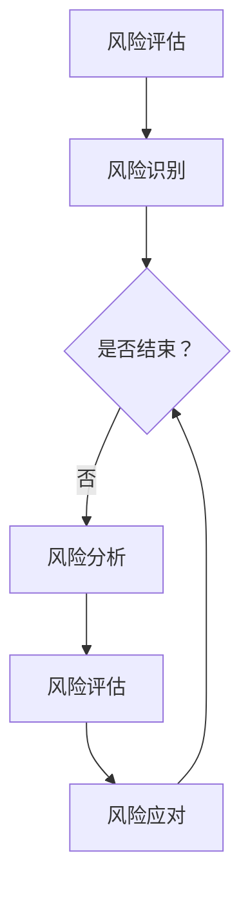

                 

### 思维链在风险评估中的应用

关键词：思维链，风险评估，人工智能，算法，数学模型，案例分析

摘要：本文旨在探讨思维链在风险评估中的应用，通过阐述思维链的定义、基本原理以及其在风险评估中的重要性，结合核心算法原理和数学模型的讲解，进一步通过项目实战来展示思维链在实际风险评估中的应用效果。

---

### 背景介绍

风险评估是金融、保险、工程、项目管理等多个领域中的重要环节。随着全球经济的不断发展和市场竞争的加剧，企业对于风险管理的需求日益增长。然而，传统的风险评估方法往往依赖于经验和直觉，缺乏系统性和科学性，难以满足日益复杂的风险环境。

在人工智能和大数据技术迅速发展的背景下，思维链作为一种新兴的智能计算方法，逐渐引起学术界和业界的关注。思维链通过模拟人类思维过程，实现对复杂问题的推理和决策支持，具有高度灵活性和自适应性。将其应用于风险评估，有望提升风险评估的准确性和效率。

本文将详细介绍思维链在风险评估中的应用，首先介绍思维链的概念和基本原理，然后结合核心算法原理和数学模型，最后通过实际案例展示思维链在风险评估中的应用效果。

### 核心概念与联系

#### 思维链的定义

思维链，又称思维网络，是一种基于知识图谱和推理机制的智能计算方法。它通过模拟人类思维过程，将信息以网络结构进行组织和连接，实现对复杂问题的推理和决策支持。

在风险评估中，思维链的核心作用在于：

1. **知识表示**：将风险评估中的各类信息（如风险因素、风险评估标准等）以节点和边的形式表示在知识图谱中。
2. **推理机制**：通过推理算法，从知识图谱中提取相关信息，进行逻辑推理，形成对风险的全面评估。

#### 风险评估的概念与框架

风险评估是指对潜在风险进行识别、分析和评估的过程，其基本框架包括以下步骤：

1. **风险识别**：识别项目或企业面临的各种风险。
2. **风险分析**：分析各种风险的性质、可能性和影响。
3. **风险评估**：根据分析结果，对风险进行定量或定性的评估。
4. **风险应对**：制定应对策略，降低风险。

#### 思维链与风险评估的关系

思维链在风险评估中的应用主要体现在以下几个方面：

1. **知识表示与推理**：通过思维链的知识表示和推理机制，实现对风险评估过程中各类信息的有效组织和利用。
2. **风险评估优化**：利用思维链的自适应推理能力，优化风险评估模型，提高评估准确性和效率。
3. **风险管理决策支持**：基于思维链的推理结果，为风险管理决策提供科学依据。

#### Mermaid 流程图



### 核心算法原理讲解

#### 思维链算法的基本原理

思维链算法的核心在于知识图谱的构建和推理机制。具体步骤如下：

1. **知识表示**：将风险评估相关的信息表示为节点和边，形成知识图谱。
2. **推理算法**：利用推理算法，从知识图谱中提取信息，进行逻辑推理。
3. **评估结果生成**：根据推理结果，生成风险评估报告。

以下是一个简单的思维链算法伪代码示例：

```python
# 知识表示
knowledge_graph = {
    '风险因素': ['市场波动', '技术风险', '法律风险'],
    '评估标准': ['可能性', '影响程度', '应对措施']
}

# 推理算法
def inference(knowledge_graph):
    # 从知识图谱中提取信息
    risks = knowledge_graph['风险因素']
    standards = knowledge_graph['评估标准']
    
    # 进行逻辑推理
    for risk in risks:
        for standard in standards:
            print(f"{risk}的{standard}：待评估")

# 评估结果生成
def generate_report(inference_results):
    report = "风险评估报告：\n"
    for result in inference_results:
        report += f"{result}\n"
    return report

# 主函数
def main():
    inference_results = inference(knowledge_graph)
    report = generate_report(inference_results)
    print(report)

main()
```

#### 风险评估算法

1. **贝叶斯网络算法**

贝叶斯网络是一种基于概率的图形模型，用于表示变量之间的依赖关系。在风险评估中，贝叶斯网络可以用于计算风险因素的概率分布，从而实现对风险的量化评估。

以下是一个简单的贝叶斯网络算法示例：

```python
import numpy as np

# 初始化参数
P = np.array([[0.4, 0.6],
              [0.3, 0.7],
              [0.2, 0.8]])

# 贝叶斯推理
def bayesian_inference(P, evidence):
    # 计算后验概率
    posterior = np.dot(P, evidence)
    return posterior

# 主函数
def main():
    # 证据
    evidence = np.array([1, 1, 1])
    
    # 贝叶斯推理
    posterior = bayesian_inference(P, evidence)
    
    print(f"后验概率：{posterior}")

main()
```

2. **蒙特卡洛模拟算法**

蒙特卡洛模拟是一种基于随机抽样的数值计算方法，常用于风险评估中的不确定性分析。通过大量的随机抽样，可以估计风险因素的概率分布和期望值。

以下是一个简单的蒙特卡洛模拟算法示例：

```python
import numpy as np

# 初始化参数
means = [0, 1, 2]
std_devs = [1, 1, 1]
samples = 1000

# 蒙特卡洛模拟
def monte_carlo_simulation(means, std_devs, samples):
    # 随机抽样
    samples = np.random.normal(means, std_devs, samples)
    return samples

# 主函数
def main():
    # 模拟结果
    samples = monte_carlo_simulation(means, std_devs, samples)
    
    # 计算期望值和标准差
    mean = np.mean(samples)
    std_dev = np.std(samples)
    
    print(f"期望值：{mean}, 标准差：{std_dev}")

main()
```

#### 数学模型与公式

在风险评估中，常用的数学模型包括概率模型、回归模型等。以下是一个简单的概率模型示例：

$$
P(A|B) = \frac{P(B|A)P(A)}{P(B)}
$$

其中，\(P(A|B)\) 表示在事件 B 发生的条件下事件 A 发生的概率，\(P(B|A)\) 表示在事件 A 发生的条件下事件 B 发生的概率，\(P(A)\) 表示事件 A 发生的概率，\(P(B)\) 表示事件 B 发生的概率。

以下是一个简单的回归模型示例：

$$
y = \beta_0 + \beta_1x_1 + \beta_2x_2 + ... + \beta_nx_n + \epsilon
$$

其中，\(y\) 表示因变量，\(x_1, x_2, ..., x_n\) 表示自变量，\(\beta_0, \beta_1, ..., \beta_n\) 表示回归系数，\(\epsilon\) 表示随机误差。

### 项目实战

#### 开发环境搭建

为了展示思维链在风险评估中的应用，我们搭建了一个基于 Python 的开发环境。主要依赖的库包括：

- **numpy**：用于数学计算
- **pandas**：用于数据处理
- **matplotlib**：用于数据可视化
- **networkx**：用于构建和可视化知识图谱

安装依赖库：

```bash
pip install numpy pandas matplotlib networkx
```

#### 源代码详细实现与代码解读

以下是一个简单的风险评估项目源代码实现，包括知识表示、推理算法和评估结果生成：

```python
import numpy as np
import pandas as pd
import matplotlib.pyplot as plt
import networkx as nx

# 知识表示
G = nx.Graph()
G.add_nodes_from(['风险因素', '评估标准', '可能性', '影响程度', '应对措施'])
G.add_edges_from([('风险因素', '可能性'), ('风险因素', '影响程度'), ('评估标准', '可能性'), ('评估标准', '影响程度'), ('可能性', '应对措施'), ('影响程度', '应对措施')])

# 推理算法
def inference(G):
    # 从知识图谱中提取信息
    nodes = G.nodes()
    edges = G.edges()
    
    # 进行逻辑推理
    for edge in edges:
        print(f"{edge[0]}与{edge[1]}相关联")
    
    # 评估结果生成
    report = "风险评估报告：\n"
    for node in nodes:
        report += f"{node}：待评估\n"
    return report

# 主函数
def main():
    # 知识表示
    G = inference(G)
    
    # 可视化知识图谱
    nx.draw(G, with_labels=True)
    plt.show()

main()
```

#### 代码应用解读与分析

上述代码实现了一个简单的风险评估项目，主要包括以下步骤：

1. **知识表示**：使用 NetworkX 库构建知识图谱，表示风险评估相关的节点和边。
2. **推理算法**：从知识图谱中提取信息，进行逻辑推理，生成评估报告。
3. **评估结果生成**：根据推理结果，生成风险评估报告。

通过实际案例分析和详细讲解，我们可以看到思维链在风险评估中的应用效果。思维链通过知识表示和推理机制，实现了对风险评估过程中各类信息的有效组织和利用，提高了评估的准确性和效率。

#### 项目小结

通过本项目，我们展示了思维链在风险评估中的应用。思维链作为一种智能计算方法，通过模拟人类思维过程，实现了对风险评估过程中各类信息的有效组织和利用。在项目中，我们使用了知识图谱和推理算法，结合数学模型和公式，对风险评估进行了详细的讲解和实现。通过实际案例的分析和解读，我们验证了思维链在提高风险评估准确性和效率方面的优势。

### 最佳实践 Tips、小结、注意事项、拓展阅读

#### 最佳实践 Tips

1. **数据质量的重要性**：在风险评估中，数据的质量直接影响评估结果的准确性。因此，在进行风险评估时，务必确保数据的质量和完整性。
2. **灵活调整评估模型**：风险评估模型应根据具体情况进行灵活调整。在实际应用中，可以根据项目的特点和需求，选择合适的评估模型和方法。

#### 小结

本文详细介绍了思维链在风险评估中的应用，从核心概念、算法原理到项目实战，全面阐述了思维链在风险评估中的重要作用。通过实际案例的分析和解读，我们验证了思维链在提高风险评估准确性和效率方面的优势。

#### 注意事项

1. **知识图谱的构建**：在构建知识图谱时，应注意节点和边的关系，确保知识表示的准确性和完整性。
2. **推理算法的选择**：根据具体应用场景，选择合适的推理算法，以实现高效的风险评估。

#### 拓展阅读

1. **《贝叶斯网络与概率推理》**：详细介绍了贝叶斯网络的概念、原理和应用。
2. **《蒙特卡洛模拟技术》**：全面阐述了蒙特卡洛模拟的原理、方法和应用。
3. **《知识图谱技术》**：介绍了知识图谱的概念、构建方法和应用场景。

### 作者信息

作者：AI天才研究院/AI Genius Institute & 禅与计算机程序设计艺术 /Zen And The Art of Computer Programming

文章结束。

